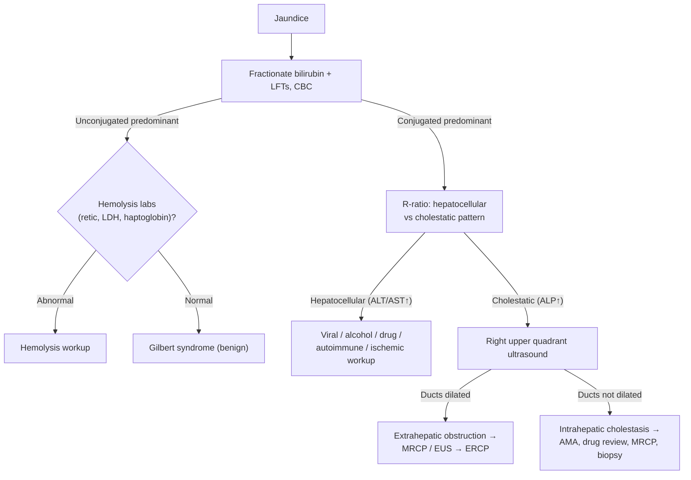

## Definition / Scope

**Jaundice** (icterus) is yellow discoloration of skin, sclerae, and mucous membranes from bilirubin deposition, clinically detectable when total bilirubin exceeds ~2–3 mg/dL. The first branch point is **bilirubin fractionation**:

- **Unconjugated (indirect) hyperbilirubinemia** — excess production (hemolysis), impaired uptake, or impaired conjugation. Bilirubin is **not** water-soluble → **no bilirubinuria**.
- **Conjugated (direct) hyperbilirubinemia** — hepatocellular dysfunction or impaired excretion/biliary obstruction. Bilirubin is water-soluble → **dark urine** and (with obstruction) **pale stools, pruritus**.

Conjugated cases are then split by the **R-ratio / pattern of liver enzymes** into **hepatocellular** (ALT/AST-predominant) versus **cholestatic** (ALP-predominant) injury — the same framework used on the [[abnormal-liver-chemistries]] page (R = (ALT/ULN) ÷ (ALP/ULN); >5 hepatocellular, <2 cholestatic, 2–5 mixed).

> ⚠ **Source-provenance flag.** The bilirubin-fractionation branch point, the R-ratio, and the Gilbert rule below (**3–7%** prevalence; presumptive at total bilirubin **<4 mg/dL** with normal enzymes) all come from [[acg-2017-liver-chemistries]], this page's only source. The ALF criteria below are credited separately to [[acg-2023-alf]]. Three items are **not** in any ingested source and remain flagged: the **~2–3 mg/dL** clinical-detection threshold for icterus, **Charcot's triad / Reynolds' pentad**, and **Courvoisier's sign**. An acute-cholangitis guideline (e.g. the Tokyo Guidelines) would be needed to source the cholangitis eponyms. Do not treat them as sourced by ACG 2017.

---

## Differential Diagnosis

### Unconjugated (Indirect) Hyperbilirubinemia

- **Hemolysis** — hereditary (G6PD deficiency, spherocytosis, sickle cell) or acquired (autoimmune, microangiopathic); check haptoglobin, LDH, reticulocytes, smear
- **Gilbert syndrome** — common (3–7% of population), benign; mild unconjugated rise with fasting/illness; **total bilirubin <4 mg/dL** with normal enzymes and CBC → presumptive diagnosis, no further workup
- **Crigler-Najjar** (rare), ineffective erythropoiesis, resorption of large hematoma
- Neonatal/physiologic jaundice (distinct pediatric pathway)

### Conjugated (Direct) — Hepatocellular

- **Viral hepatitis** — [[hepatitis-c]], [[chronic-hepatitis-b]], hepatitis A/E
- **[[alcohol-associated-liver-disease|Alcohol-associated hepatitis]]** — AST:ALT >2, often very high bilirubin
- **[[drug-induced-liver-injury]]** — acetaminophen and idiosyncratic DILI; herbal/dietary supplements
- **[[autoimmune-hepatitis]]**, ischemic hepatitis ("shock liver"), [[wilson-disease|Wilson disease]]
- **[[cirrhosis|Cirrhosis]] / decompensation** of any chronic liver disease (e.g. [[nafld-masld|MASLD]])
- Inherited excretion defects — Dubin-Johnson, Rotor (benign conjugated)

### Conjugated (Direct) — Cholestatic / Obstructive

**Extrahepatic (mechanical) obstruction:**

- **[[choledocholithiasis]]** — most common; ± ascending cholangitis (Charcot's triad)
- **Malignant biliary obstruction** — [[pancreatic-cancer|pancreatic head cancer]], [[cholangiocarcinoma]], [[ampullary-adenoma|ampullary tumor]], [[gallbladder-cancer|gallbladder cancer]] ([[biliary-stricture|biliary stricture differential]])
- **Benign strictures** — post-surgical, [[chronic-pancreatitis|chronic pancreatitis]], IgG4 disease

**Intrahepatic cholestasis:**

- **[[primary-biliary-cholangitis]]** (AMA-positive), **[[primary-sclerosing-cholangitis]]** ([[mri-mrcp|MRCP]] beading; PSC-[[inflammatory-bowel-disease|IBD]])
- Drug-induced cholestasis, infiltrative disease (sarcoid, amyloid, malignancy), TPN, sepsis
- [[intrahepatic-cholestasis-of-pregnancy|Cholestasis of pregnancy]] and other [[liver-disease-in-pregnancy|pregnancy-related liver disease]]

---

## Diagnostic Algorithm

1. **Fractionate bilirubin** and obtain LFTs and CBC.
2. **Unconjugated** → check **hemolysis labs** (reticulocytes, LDH, haptoglobin, smear). If normal and enzymes normal → **Gilbert syndrome** (no further workup). If hemolytic → hematology workup.
3. **Conjugated** → classify by **R-ratio** ([[abnormal-liver-chemistries]]) into hepatocellular vs. cholestatic.
   - **Hepatocellular** → viral serologies ([[hepatitis-c]], [[chronic-hepatitis-b]], A/E), alcohol history, medication/supplement review ([[drug-induced-liver-injury]]), autoimmune markers ([[autoimmune-hepatitis|ANA/SMA/IgG]]), ceruloplasmin in young patients ([[wilson-disease]]).
   - **Cholestatic** → **right upper quadrant ultrasound first** to assess for **biliary dilation**.
4. **Ducts dilated → extrahepatic obstruction:** characterize with **MRCP** or **[[endoscopic-ultrasound|EUS]]**; proceed to **[[ercp|ERCP]]** for therapeutic relief (stone extraction, stent) and tissue sampling ([[biliary-stricture]]). Cholangitis → urgent drainage + antibiotics.
5. **Ducts not dilated → intrahepatic cholestasis:** check **AMA** ([[primary-biliary-cholangitis|PBC]]), MRCP for [[primary-sclerosing-cholangitis|PSC]], review drugs, consider [[liver-biopsy|liver biopsy]].

---

## Key Tests

- **Fractionated bilirubin** — conjugated vs. unconjugated; defines the entire pathway.
- **Liver enzymes + R-ratio** — hepatocellular vs. cholestatic pattern ([[abnormal-liver-chemistries]]).
- **Hemolysis panel** — reticulocyte count, LDH, haptoglobin, peripheral smear, Coombs.
- **Urinalysis** — bilirubinuria indicates conjugated hyperbilirubinemia (absent in unconjugated).
- **Right upper quadrant ultrasound** — first imaging in cholestasis; detects biliary dilation, stones, masses.
- **MRCP / [[endoscopic-ultrasound|EUS]]** — noninvasive (MRCP) and tissue-capable (EUS-FNB) characterization of biliary/pancreatic obstruction.
- **[[ercp|ERCP]]** — therapeutic for extrahepatic obstruction (stones, stent) with sampling; not for diagnosis alone.
- **Serologies & autoantibodies** — viral hepatitis panel, AMA ([[primary-biliary-cholangitis|PBC]]), ANA/SMA/IgG ([[autoimmune-hepatitis|AIH]]), IgG4; ceruloplasmin ([[wilson-disease]]).
- **Liver biopsy** — selected intrahepatic cholestasis/hepatocellular cases without a clear diagnosis.

---

## Red Flags / Alarm Features

- **[[acute-liver-failure|Acute liver failure]]** — illness <26 weeks in a patient **without** preexisting liver disease, with **any degree** of [[hepatic-encephalopathy|encephalopathy]] **AND** coagulopathy (**INR ≥1.5**) → urgent [[liver-transplantation|transplant]]-center referral ([[acg-2023-alf]]). Exceptions to the "no prior liver disease" rule: [[autoimmune-hepatitis|AIH]], [[budd-chiari-syndrome|Budd-Chiari]], [[wilson-disease|Wilson disease]]
- **Ascending cholangitis** — Charcot's triad (fever, jaundice, RUQ pain) ± Reynolds' pentad (+ hypotension, confusion) → urgent biliary drainage
- **Painless jaundice with weight loss** — pancreaticobiliary malignancy (Courvoisier's sign: palpable nontender gallbladder)
- **Marked coagulopathy or rising bilirubin/INR** — severe hepatic dysfunction
- **Signs of sepsis** in the setting of biliary obstruction

---

## See Also

[[abnormal-liver-chemistries]], [[choledocholithiasis]], [[biliary-stricture]], [[cholangiocarcinoma]], [[pancreatic-cancer]], [[gallbladder-cancer]], [[primary-biliary-cholangitis]], [[primary-sclerosing-cholangitis]], [[drug-induced-liver-injury]], [[autoimmune-hepatitis]], [[alcohol-associated-liver-disease]], [[hepatitis-c]], [[chronic-hepatitis-b]], [[wilson-disease]], [[budd-chiari-syndrome]], [[nafld-masld]], [[acute-liver-failure]], [[hepatic-encephalopathy]], [[liver-transplantation]], [[chronic-pancreatitis]], [[ercp]], [[endoscopic-ultrasound]], [[mri-mrcp]], [[liver-biopsy]], [[liver-disease-in-pregnancy]], [[intrahepatic-cholestasis-of-pregnancy]], [[ampullary-adenoma]]

---

## Sources

1. [[acg-2017-liver-chemistries|ACG 2017: Evaluation of Abnormal Liver Chemistries]]
2. [[acg-2023-alf|ACG 2023: Acute Liver Failure]]
