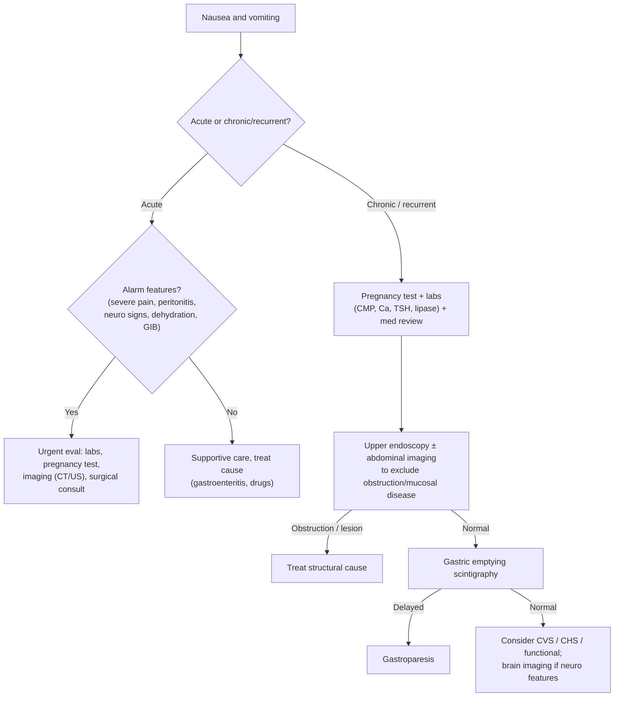

## Definition / Scope

**Nausea** is the unpleasant sensation of an imminent urge to vomit; **vomiting** is the forceful oral expulsion of gastric contents via coordinated GI, abdominal-wall, and respiratory muscle activity. Distinguish from:

- **Regurgitation** — effortless return of undigested food/liquid without nausea or retching (suggests [[gerd]], [[achalasia]], Zenker's, or [[rumination-syndrome|rumination]]).
- **Rumination** — repetitive effortless regurgitation of recently ingested food within minutes of eating, with re-chewing; a behavioral [[disorders-of-gut-brain-interaction|DGBI]].

Duration frames the differential: **acute** (<1 week — usually infection, drugs, toxins, or an acute abdomen) vs. **chronic/recurrent** (>1 month — motility, functional, obstructive, metabolic, or CNS causes). The **timing relative to meals** is a useful clue: vomiting of undigested food hours after eating suggests gastric outlet obstruction or [[gastroparesis]]; early-morning vomiting suggests pregnancy, raised intracranial pressure, or uremia.

---

## Differential Diagnosis

### GI / Luminal

- **Gastric outlet / mechanical obstruction** — [[peptic-ulcer-disease|peptic stricture]], malignancy ([[gastric-adenocarcinoma]]), small-bowel obstruction (adhesions, hernia), superior mesenteric artery syndrome
- **[[gastroparesis]]** — delayed gastric emptying without obstruction; postprandial fullness, early satiety, bloating; diabetic, post-surgical, idiopathic
- **Peptic disease / [[dyspepsia]]**, [[gerd]], biliary disease ([[choledocholithiasis]], [[acute-cholecystitis|cholecystitis]]), [[acute-pancreatitis|pancreatitis]], appendicitis, hepatitis
- **Infectious gastroenteritis** ([[acute-diarrhea|see acute diarrhea]]; [[norovirus]], food poisoning)
- [[crohns-disease|Crohn's]] with stricturing, intestinal pseudo-obstruction

### CNS / Vestibular

- Raised intracranial pressure (tumor, hemorrhage, hydrocephalus) — often projectile, with headache/neuro signs
- Migraine, vestibular disorders (labyrinthitis, BPPV, Ménière's), motion sickness

### Metabolic / Endocrine / Drugs

- **Pregnancy** (always test in reproductive-age women) — [[nausea-and-vomiting-of-pregnancy|nausea/vomiting of pregnancy & hyperemesis gravidarum]]; see [[liver-disease-in-pregnancy]] for the hepatic overlap
- DKA, uremia, hypercalcemia, adrenal insufficiency, thyroid disease
- **Drugs/toxins** — opioids, chemotherapy, digoxin, antibiotics, NSAIDs, dopamine agonists, GLP-1 agonists; alcohol
- Postoperative nausea/vomiting

### Functional and Episodic Syndromes

- **[[cyclic-vomiting-syndrome|Cyclic vomiting syndrome (CVS)]]** — stereotyped, recurrent discrete episodes of intense vomiting with symptom-free intervals; Rome IV [[disorders-of-gut-brain-interaction|DGBI]]; migraine association
- **[[cannabinoid-hyperemesis-syndrome|Cannabinoid hyperemesis syndrome (CHS)]]** — chronic cannabis use, cyclic vomiting relieved by hot showers/baths; resolves with cessation
- **Chronic nausea vomiting syndrome** and **functional vomiting** — Rome IV functional disorders, diagnosed after exclusion

---

## Diagnostic Algorithm

1. **Acute vs. chronic.** Acute with **alarm features** (severe/localized pain, peritoneal signs, GI bleeding, neurologic deficits, signs of obstruction, severe dehydration) → urgent labs, **pregnancy test**, and cross-sectional imaging ± surgical evaluation.
2. **Always test pregnancy** in reproductive-age women before imaging or pharmacotherapy.
3. **Labs** — CMP (electrolytes, renal, glucose/ketones), calcium, TSH, lipase, LFTs; CBC; consider cortisol/morning if adrenal insufficiency suspected; drug review (opioids, GLP-1 agonists, chemo).
4. **Exclude obstruction and mucosal disease** — abdominal X-ray/CT for suspected obstruction; **[[upper-endoscopy|EGD]]** for chronic symptoms, [[dysphagia]], weight loss, or suspected [[peptic-ulcer-disease|PUD]]/malignancy.
5. **If structural causes excluded** → **scintigraphic gastric emptying** for [[gastroparesis]]. The threshold only means something with its protocol attached ([[acg-2022-gastroparesis]]):
   - **Solid meal, standard 255-kcal, 2% fat Egg Beaters meal**; imaging at **0, 1, 2, and 4 h**.
   - **≥3 h of imaging required, 4 h optimal** (3 h acceptable only if >90% emptied by 3 h).
   - **Delayed emptying = >10% retention at 4 h.** A 2-h or non-standard-meal study does not establish the diagnosis.
   - Stop opioids/GLP-1 agonists and correct hyperglycemia first — both delay emptying and confound the test.
6. **Neuroimaging** (CT/MRI brain) if headache, papilledema, focal deficits, or early-morning vomiting suggest a CNS cause.
7. **Recognize episodic syndromes** — stereotyped attacks with well intervals = CVS; cannabis use + relief with hot bathing = CHS (treat with cessation).

---

## Key Tests

- **Urine/serum hCG** — mandatory in reproductive-age women.
- **Metabolic labs** — CMP, calcium, glucose/ketones, TSH, lipase, LFTs; identifies DKA, uremia, hypercalcemia, thyroid/adrenal disease, biliary/pancreatic disease.
- **Abdominal imaging** — upright X-ray/CT for obstruction; ultrasound for biliary causes.
- **[[upper-endoscopy|EGD]]** — excludes gastric outlet obstruction, [[peptic-ulcer-disease|PUD]], and [[gastric-adenocarcinoma|malignancy]] in chronic/refractory cases.
- **Scintigraphic gastric emptying (4-hour, standard solid meal)** — confirms [[gastroparesis]]; gold standard (protocol and cutoff above). Wireless motility capsule and ¹³C breath testing are alternatives.
- **Brain CT/MRI** — when CNS features are present.
- **[[small-bowel-motility|Antroduodenal manometry]]** — selected refractory cases to evaluate for chronic intestinal pseudo-obstruction.

---

## Red Flags / Alarm Features

- **Severe or localized abdominal pain, peritoneal signs** — surgical abdomen
- **Signs of obstruction** — abdominal distension, absent flatus/stool, succussion splash
- **Hematemesis or coffee-ground emesis** — see [[upper-gi-bleeding]]
- **Neurologic features** — headache, papilledema, focal deficits, projectile/early-morning vomiting (raised ICP)
- **Severe dehydration / electrolyte disturbance** — hypokalemia, metabolic alkalosis, AKI
- **Unintentional weight loss, dysphagia, anemia** — malignancy/structural disease
- **Suspected pregnancy / hyperemesis gravidarum**

---

## See Also

[[gastroparesis]], [[cyclic-vomiting-syndrome]], [[cannabinoid-hyperemesis-syndrome]], [[nausea-and-vomiting-of-pregnancy]], [[dyspepsia]], [[gerd]], [[peptic-ulcer-disease]], [[gastric-adenocarcinoma]], [[achalasia]], [[rumination-syndrome]], [[acute-pancreatitis]], [[choledocholithiasis]], [[acute-cholecystitis]], [[upper-endoscopy]], [[upper-gi-bleeding]], [[acute-diarrhea]], [[norovirus]], [[liver-disease-in-pregnancy]], [[disorders-of-gut-brain-interaction]], [[small-bowel-motility]], [[acute-colonic-pseudo-obstruction]], [[colonic-volvulus]]

---

## Sources

1. [[acg-2022-gastroparesis|ACG 2022: Gastroparesis]]
2. [[aga-2024-cvs|AGA Clinical Practice Update on Diagnosis and Management of Cyclic Vomiting Syndrome (2024)]]
3. [[aga-2024-chs|AGA Clinical Practice Update on Diagnosis and Management of Cannabinoid Hyperemesis Syndrome: Commentary]]
4. [[asge-2020-acpo-volvulus|ASGE Guideline on the Role of Endoscopy in the Management of Acute Colonic Pseudo-Obstruction and Colonic Volvulus (2020)]]
