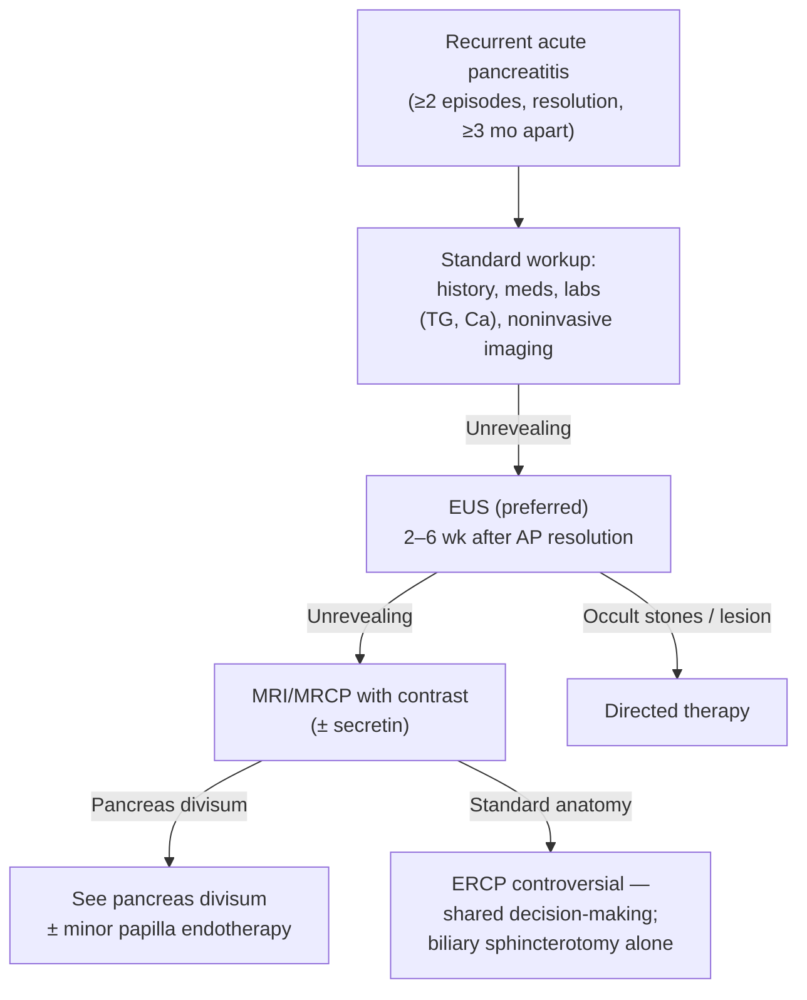

# Recurrent Acute Pancreatitis

## Definition / Scope

- **RAP = ≥2 distinct episodes of [[acute-pancreatitis|acute pancreatitis]] with complete interceding resolution, separated by ≥3 months** [[aga-2022-recurrent-pancreatitis-endoscopy]].
- After an index AP episode, **~10–30%** develop RAP; **~35% of RAP progress to [[chronic-pancreatitis|chronic pancreatitis (CP)]]** (some develop CP without antecedent AP attacks).
- **Unexplained (idiopathic) RAP:** etiology remains unknown in **16–27%** of all AP cases despite a comprehensive standard workup.

## Differential Diagnosis

- **Occult biliary lithiasis / microlithiasis** — most common etiology uncovered at EUS
- [[pancreas-divisum|Pancreas divisum]] and anomalous pancreaticobiliary union
- [[sphincter-of-oddi-dysfunction|Pancreaticobiliary sphincter dysfunction / stenosis]]
- **Occult ampullary or pancreatobiliary malignancy** — up to **5%** after a single unexplained AP, up to **12%** with RAP
- [[hereditary-pancreatitis|Genetic / hereditary pancreatitis]]
- Metabolic: hypertriglyceridemia, hypercalcemia
- Medications, autoimmune pancreatitis
- Evolving [[chronic-pancreatitis|chronic pancreatitis]]

## Diagnostic Algorithm

1. **Standard initial evaluation (should precede EUS):** comprehensive personal + family history, physical exam, **medication review**, laboratory testing (liver biochemistries, **triglycerides, calcium**), and noninvasive imaging (US, CT).
2. **If unrevealing → [[endoscopic-ultrasound|EUS]] is the preferred diagnostic test** (BPA 1). Yields a potential etiology in **29–88%**; most common finding is occult biliary lithiasis. Optimal timing: **short delay of 2–6 weeks after AP resolution** (persistent inflammation hinders detection of subtle lesions / underlying CP).
3. **[[mri-mrcp|MRI/MRCP]] with contrast — complementary or alternative** (BPA 1). EUS is more likely than MRI to give a probable cause (**OR 3.79**, driven by sensitivity for occult biliary stones); however **MRCP better identifies ductal etiologies** (pancreas divisum, anomalous pancreaticobiliary union). Secretin-enhanced MRCP improves yield but limited by availability/logistics.
4. **Role of [[ercp|ERCP]] to reduce AP frequency is controversial** — not a routine diagnostic step:
   - **Pancreas divisum (BPA 2):** minor papilla endotherapy may be considered, mainly with **objective outflow obstruction** (dilated dorsal duct and/or santorinicele); **no role for ERCP for pain alone**. See [[pancreas-divisum]].
   - **Standard ductal anatomy (BPA 3):** even more controversial; only after shared decision-making about uncertain benefit and severe adverse-event risk. When pursued, **biliary sphincterotomy alone may be preferable to dual sphincterotomy** (Coté RCT: pancreatic sphincterotomy adds no incremental benefit).

## Key Tests

| Test | Role in RAP |
|---|---|
| **[[endoscopic-ultrasound\|EUS]]** | Preferred first test after unrevealing workup; best for occult biliary stones, microlithiasis, ampullary lesions, small tumors, early CP |
| **[[mri-mrcp\|MRI/MRCP]] (± secretin)** | Complementary/alternative; best for ductal variants (pancreas divisum, PB union) |
| Labs | Liver biochemistries, triglycerides, calcium, IgG4; genetic testing if young/family history |
| **[[ercp\|ERCP]]** | Therapeutic, not routine diagnostic — reserved per BPA 2–3 with shared decision-making |

## Red Flags / Alarm Features

- **Occult ampullary or pancreatobiliary malignancy** — up to 5% (single unexplained AP) / 12% (RAP): scrutinize the ampulla and pancreatobiliary tree.
- Progression toward [[chronic-pancreatitis|CP]] (~35% of RAP) — screen for pain, EPI, and endocrine dysfunction.
- Post-ERCP pancreatitis and post-papillotomy stenosis are real, potentially severe iatrogenic risks — weigh before any ERCP.

## See Also

[[acute-pancreatitis]], [[chronic-pancreatitis]], [[pancreas-divisum]], [[endoscopic-ultrasound]], [[ercp]], [[mri-mrcp]], [[sphincter-of-oddi-dysfunction]], [[hereditary-pancreatitis]], [[choledocholithiasis]]

---

## Sources

1. [[aga-2022-recurrent-pancreatitis-endoscopy|AGA Clinical Practice Update on the Endoscopic Approach to Recurrent Acute and Chronic Pancreatitis: Expert Review]]
