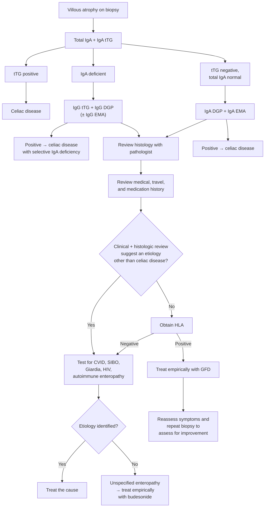

Villous atrophy on duodenal or jejunal biopsy **with negative celiac serology** (tTG, DGP, and EMA all negative). A histologic finding, not a diagnosis — it carries a wide differential across immune-mediated, infectious, iatrogenic, and inflammatory causes, and distinct, highly effective therapy exists for many of them. Prognosis is **poor compared with classic [[celiac-disease|celiac disease]]**, so the point of the workup is to name the cause rather than default to a gluten-free diet.

## Contents
- [[#Definition / Scope]]
- [[#Differential Diagnosis]]
  - [[#Etiologies by category]]
  - [[#History, histology, and confirmatory test by cause]]
- [[#Diagnostic Algorithm]]
- [[#Key Tests]]
  - [[#Histology]]
  - [[#Serology]]
  - [[#HLA-DQ2 / DQ8]]
  - [[#Gluten challenge]]
- [[#Red Flags / Alarm Features]]
- [[#Management by Outcome of the Workup]]
- [[#See Also]]
- [[#Sources]]

---

## Definition / Scope

| Term | Definition ([[aga-2021-seronegative-enteropathies|AGA 2021]]) |
|---|---|
| **Seronegative enteropathy** | Some degree of villous atrophy **and** negative tTG, DGP, and anti-EMA |
| **Seronegative celiac disease** | With or without GI signs/symptoms, **villous atrophy + compatible HLA genetics**, **negative** IgA/IgG tTG, IgA/IgG DGP and IgA/IgG EMA, **clinical and histologic response to a gluten-free diet (GFD)**, other etiologies examined |
| **CeD with selective IgA deficiency** | Total IgA below the lower limit of detection **plus** positive IgG tTG, IgG DGP, or EMA, with villous atrophy — the IgA-based tests are *falsely* negative. **Not** seronegative disease |
| **Idiopathic ("unspecified") villous atrophy** | Sprue-like histology with no etiology identified after a complete workup |

- **Villous atrophy must be present.** Increased intraepithelial lymphocytes (IELs) with normal villi alone does **not** qualify as seronegative CeD or as a seronegative enteropathy.
- Seronegative CeD is **1.7%–5% of all celiac disease**, but is the single most common cause of seronegative enteropathy — **up to one-third of cases in White patients**. Consider it early.
- Selective or partial IgA deficiency occurs **10–15 times more often** in celiac disease than in healthy controls.

---

## Differential Diagnosis

### Etiologies by category

| Category | Etiologies |
|---|---|
| **Immune-mediated** | Seronegative CeD · common variable immune deficiency (CVID) · autoimmune enteropathy · intestinal lymphoma · sarcoidosis |
| **Infectious** | Parasitic infection (*[[giardiasis\|Giardia lamblia]]*) · tropical sprue / environmental enteropathy · Whipple disease · [[small-intestinal-bacterial-overgrowth\|small intestinal bacterial overgrowth]] · tuberculosis · [[hiv-aids-related-diarrhea\|HIV enteropathy]] |
| **Iatrogenic** | **Medications** — olmesartan, [[thiopurines\|azathioprine]], mefenamic acid, methotrexate, mycophenolate mofetil · chemotherapy · graft-vs-host disease · radiation enteritis · transplanted small intestine |
| **Inflammatory** | [[crohns-disease\|Crohn's disease]] · collagenous sprue · eosinophilic enteritis |

*Table 1 — Etiologies of seronegative villous atrophy. ([[aga-2021-seronegative-enteropathies]])*

### History, histology, and confirmatory test by cause

| Condition | Pertinent history | Histology | Other tests | Treatment |
|---|---|---|---|---|
| [[giardiasis\|Giardiasis]] | Diarrhea, abdominal pain, weight loss | Trophozoites identified on villi | PCR from duodenal aspirate; positive stool specific immunoassay | Metronidazole |
| Tropical sprue | Travel to endemic areas; vitamin B12 and folate deficiency | Increased plasma cells and eosinophils in lamina propria; changes in duodenum, jejunum and ileum | — | Tetracycline **or** doxycycline **+** folic acid |
| Collagenous sprue | Diarrhea, abdominal pain, weight loss | **Subepithelial collagen deposition** | — | GFD ± immunosuppression (budesonide, prednisone, azathioprine) |
| CVID | Onset **after age 2 y**, poor response to vaccines, recurrent infections, persistent diarrhea | **Absence of plasma cells**, polymorphonuclear infiltrate | **IgG <5 g/L** + low IgA or IgM | Budesonide |
| Autoimmune enteropathy | Intractable diarrhea and weight loss | Few IELs, lymphoplasmacytic infiltrate in lamina propria, **decreased goblet cells**, neutrophilic cryptitis | Anti-enterocyte antibody | Immunosuppression (steroids, azathioprine, infliximab) |
| Intestinal lymphoma | Diarrhea, abdominal pain, fever, weight loss, bleeding, signs of obstruction or perforation | **Monoclonal population of T cells** | Inflammatory markers, CT, [[capsule-endoscopy\|capsule endoscopy]], PET | Hematology consultation |
| [[small-intestinal-bacterial-overgrowth\|SIBO]] | Anatomical abnormalities, poor motility, other predisposing conditions | Increased IELs and neutrophils, increased plasma cells in lamina propria | H₂-glucose breath test, duodenal aspirate | Antibiotics |
| [[crohns-disease\|Crohn's disease]] | Bloody diarrhea, fever, weight loss | Aphthous ulceration, skip lesions, **granulomas** | Elevated ESR, CRP | Immunosuppression, biologic agents |
| Eosinophilic gastroenteritis | Multiple allergies, atopy | Massive eosinophilic infiltration | Peripheral hypereosinophilia | Dietary therapy, glucocorticoids |
| [[hiv-aids-related-diarrhea\|HIV enteropathy]] | Presence of opportunistic infections | Decreased CD4⁺ T lymphocytes, increase in CD8⁺ T lymphocytes | HIV antibody test | Antiretroviral therapy |
| Tuberculosis | Cough, ascites, night sweats | Granulomatous disease | Interferon-gamma release assay, CT, ascitic fluid analysis | Anti-tuberculous therapy |
| Whipple disease | Joint inflammation, hyperpigmentation of sun-exposed skin | **PAS⁺ macrophagic infiltration** of the lamina propria | Positive PCR for *Tropheryma whipplei* | Ceftriaxone or penicillin G, then TMP-SMX, hydroxychloroquine and doxycycline |
| Radiation enteropathy | History of radiotherapy | Lamina propria fibrosis | — | — |
| Graft-vs-host disease | Diarrhea, abdominal pain, nausea, vomiting, anorexia; prior bone marrow transplantation | Crypt cell necrosis, loss of epithelium | — | Prednisone or budesonide |

*Table 2 — Conditions, characteristics, and treatment of potential etiologies of seronegative enteropathy. ([[aga-2021-seronegative-enteropathies]])*

- **Medication-induced atrophy is the miss to avoid.** Olmesartan enteropathy can be severe and has led patients to be **incorrectly diagnosed with refractory celiac disease**; it **resolves on discontinuing the drug**. Other angiotensin II receptor antagonists, azathioprine and mycophenolate mofetil are also reported.
- Fever, bloody diarrhea and weight loss suggest Crohn's disease or a lymphoproliferative disorder; low total IgG, IgA **and** IgM suggest CVID.

---

## Diagnostic Algorithm

*Approach to the patient with seronegative villous atrophy. ([[aga-2021-seronegative-enteropathies]])*

**Order of operations:**

1. **Confirm the histology** with a pathologist who specializes in gastroenterology — that atrophy is genuinely present and the biopsies are **optimally oriented**. Have previous biopsies re-reviewed alongside the current ones to judge progression or improvement.
2. **Complete the serologic panel**, including IgG isotypes if IgA-deficient.
3. **Review the diet** — confirm gluten exposure at the time of testing, since reduction limits the accuracy of both serology and histology.
4. **Take a detailed medication and travel history** — specifically angiotensin II receptor blockers such as olmesartan, and travel that would raise tropical sprue or *Giardia*.
5. **HLA-DQ2/DQ8 as the rule-out test** when no alternative etiology is suggested.
6. **HLA-compatible → empiric GFD, then re-scope at 1–3 years** to document histologic improvement; that response is what retrospectively confirms seronegative CeD.

---

## Key Tests

### Histology

- [[upper-endoscopy|EGD]] with **duodenal- and/or jejunal-oriented biopsies** showing villous atrophy is required.
- **Total of 4–6 specimens** from the **second portion of the duodenum and the duodenal bulb**.
- Read by an **experienced GI pathologist**. The **Corazza–Villanacci classification** should be considered for describing the findings; [[aga-2021-seronegative-enteropathies|AGA 2021]] names it without printing its grades, so the grade assignment cannot be made from this document alone.
- **tTG-specific, gluten-dependent mucosal deposits** have been described but are **not available for clinical use**.

### Serology

- **Serum total IgA and IgA tTG first**; IgA EMA and/or IgA DGP in selected cases.
- **True seronegative CeD requires all IgA antibodies to be negative** — discrepancy between the individual antibodies is common in practice.
- IgA deficiency → **IgG tTG, IgG DGP, and IgG EMA**.
- Serology can be **falsely negative** if gluten has been reduced or eliminated, or if the patient is on immunosuppressive therapy for another condition.

### HLA-DQ2 / DQ8

- Up to **30% of the population** carries one or both of DQ2/DQ8, yet only **2%–3%** of those carriers develop celiac disease in their lifetime — so a positive result **cannot stand alone as a diagnostic criterion**; it only infers risk.
- **Most useful when negative** — a negative result excludes seronegative CeD. Highest yield when villous atrophy is seronegative, the celiac workup is incomplete, and the patient **has already started a GFD** with severe symptoms on gluten exposure: a negative DQ2/DQ8 spares an unnecessary gluten challenge, GFD trial, and further workup.
- Before calling a patient HLA-negative, confirm **all alleles were tested and reported** (commercial and academic labs may not report every celiac-associated allele) and check whether **compatible half heterodimers** are present:

| Haplotype | Alleles |
|---|---|
| HLA DQ2.5 | DQA1*0501, DQB1*0201 |
| HLA DQ8 | DQA1*03, DQB1*0302 |
| HLA DQ2.2 | DQA1*0201, DQB1*0202 |
| HLA DQ7.5 | DQA1*05, DQB1*0301 |

- **Gene dose** ([[aga-2019-celiac-monitoring|AGA 2019]]): homozygous HLA-DQ2.5 makes celiac disease **likely**; heterozygous HLA-DQ2.2 makes it **unlikely**.
- One view holds that a compatible haplotype plus a family history may make **mild enteropathy short of villous atrophy** a form of celiac disease even without serologies. Optimal management of that scenario is unknown.

### Gluten challenge

- Patients **must not avoid gluten before diagnostic testing**.
- If gluten has already been reduced or removed: resume a regular diet containing **1 to 3 slices of gluten-containing bread daily for 1 to 3 months**, then repeat testing.

---

## Red Flags / Alarm Features

- **Fever, night sweats, bloody diarrhea, obstruction, GI bleeding, perforation** — intestinal lymphoma or Crohn's disease rather than an enteropathy.
- **Low total IgG, IgA and IgM** (IgG <5 g/L) — CVID.
- **Intractable diarrhea with weight loss** — autoimmune enteropathy.
- **Recent ARB (olmesartan) start** — drug-induced atrophy; stop the drug before escalating.
- **No response to a GFD** in an HLA-compatible patient — refer to a celiac center for workup and treatment of refractory celiac disease. If **refractory type 2** is in play, send **flow cytometry and T-cell gene rearrangement studies**.
- **Ongoing malabsorption** — poor prognosis relative to classic celiac disease; naming the cause changes therapy.

---

## Management by Outcome of the Workup

| Outcome | Management |
|---|---|
| **Etiology identified** | Treat on its own terms (Table 2 above). Follow-up EGD with biopsy **might or might not** be indicated, depending on etiology, treatment and clinical status |
| **Seronegative CeD (HLA-compatible, responds to GFD)** | Dietitian **frequently in the first year**, then **annual** visits. Serologic markers **cannot** be used for follow-up — clinical and histologic improvement on the GFD is what confirms the diagnosis. Follow-up EGD **at approximately 12 months**, or sooner with severe illness; **re-scope at 1–3 years** of GFD to document improvement in villous atrophy. Same biopsy protocol; a GI pathologist compares initial and follow-up specimens |
| **No etiology, patient clinically stable** | In a series of **200 cases** of seronegative villous atrophy, **18%** had no identifiable etiology, and **72% of those resolved without intervention 9 months after the initial biopsy** — transient atrophy. **Repeating endoscopy after a period of observation without intervention can be considered** |
| **No etiology, patient symptomatic or clinically unstable** | **Budesonide 9 mg daily first-line**, followed by **prednisone or azathioprine** per clinical status and response |
| **Refractory celiac disease** | **Open-capsule budesonide starting at 9 mg daily** is first-line; treatment length depends on symptoms and budesonide should be **tapered slowly over a 9-month period**. Alternatives: prednisone and [[thiopurines\|azathioprine]] |

**Where the sources differ:**

- **Biopsy count.** [[aga-2021-seronegative-enteropathies|AGA 2021]] asks for a **total of 4–6 specimens** from the second portion of the duodenum and the bulb; the newer [[acg-2022-celiac|ACG 2022]] guideline asks for **1–2 bulb specimens plus ≥4 postbulbar specimens (≥6 total)** in separately labeled jars. [[celiac-disease]] follows the ACG figure; when atrophy is already present and the question is its cause, 4–6 oriented specimens from both sites is the operative minimum.
- **Budesonide taper.** [[aga-2021-seronegative-enteropathies|AGA 2021]] gives a **9-month slow taper** from 9 mg daily. The newer [[aga-2022-refractory-celiac|AGA 2022]] refractory-celiac update states that initial doses and taper recommendations for steroids have not been examined rigorously and supplies no schedule — the 9-month period is the only taper duration either document names.

---

## See Also

[[celiac-disease]], [[chronic-diarrhea]], [[small-intestinal-bacterial-overgrowth]], [[giardiasis]], [[crohns-disease]], [[microscopic-colitis]], [[upper-endoscopy]], [[capsule-endoscopy]], [[device-assisted-enteroscopy]], [[hiv-aids-related-diarrhea]], [[exocrine-pancreatic-insufficiency]], [[thiopurines]]

---

## Sources

1. [[aga-2021-seronegative-enteropathies|AGA Clinical Practice Update on the Evaluation and Management of Seronegative Enteropathies: Expert Review]]
2. [[aga-2022-refractory-celiac|AGA Clinical Practice Update on Management of Refractory Celiac Disease: Expert Review]]
3. [[aga-2019-celiac-monitoring|AGA Clinical Practice Update on Diagnosis and Monitoring of Celiac Disease—Changing Utility of Serology and Histologic Measures: Expert Review]]
4. [[acg-2022-celiac|ACG 2022: Diagnosis and Management of Celiac Disease]]
