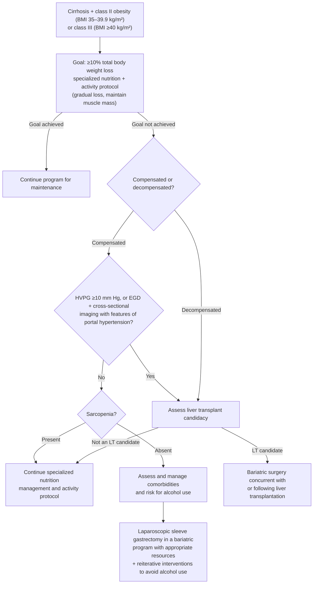

Surgical weight-loss procedures — laparoscopic **sleeve gastrectomy (SG)**, **Roux-en-Y gastric bypass (RYGB)**, adjustable gastric banding, duodenal switch — for [[obesity]]. Only ~**1.1% of eligible patients** receive primary bariatric surgery, and **<5%** of patients seeking weight loss are aware of endoscopic alternatives ([[aga-2021-intragastric-balloons]]).

This page covers the **GI/endoscopic consequences** of these operations, which is where gastroenterology owns the care. Perioperative surgical technique is outside the scope of the guidelines cited here.

## Contents
- [[#Role Among Weight-Loss Options]]
- [[#Bariatric Surgery in MASLD/MASH]]
- [[#Bariatric Surgery in Cirrhosis]]
  - [[#Candidacy — the stage is the decision]]
  - [[#Preoperative CSPH assessment (BPA 6)]]
  - [[#Alcohol use — screen before, mitigate after (BPA 7)]]
  - [[#Procedure choice and timing (BPA 10)]]
  - [[#Program requirements (BPA 9)]]
  - [[#Endoscopic bariatric therapies in cirrhosis (BPA 8)]]
  - [[#Algorithm — class II/III obesity in cirrhosis]]
- [[#Post-Sleeve Gastrectomy — Reflux and Barrett's Surveillance]]
- [[#Bariatric Surgery for GERD in Obesity]]
- [[#Iron Deficiency After Bariatric Surgery]]
- [[#See Also]]
- [[#Sources]]

---

## Role Among Weight-Loss Options

- Definitive option for eligible patients; sits alongside dietary intervention, pharmacotherapy ([[glp-1-receptor-agonists|GLP-1 receptor agonists]] such as [[semaglutide]]), and endoscopic bariatric therapy — see [[obesity]] for the full menu.
- **Sequencing with [[intragastric-balloon|intragastric balloons (IGB)]]** ([[aga-2021-intragastric-balloons]], Rec 7, *conditional, low certainty*): after IGB removal, subsequent weight-loss or maintenance interventions may include dietary interventions, pharmacotherapy, repeat IGB, **or bariatric surgery** — chosen by shared decision-making based on patient context and comorbidities. Bariatric surgery after IGB, and IGB as a bridge before surgery, are each supported by limited data.

---

## Bariatric Surgery in MASLD/MASH

Per [[aasld-2023-nafld|AASLD 2023]] (Guidance Statement 22):

> Bariatric surgery should be considered as a therapeutic option in patients who meet criteria for metabolic weight-loss surgery, as it effectively resolves NAFLD or NASH in the majority of patients without cirrhosis and reduces mortality from CVD and malignancy.

- ⚠ *"Criteria for metabolic weight-loss surgery"* (the BMI/comorbidity eligibility thresholds) are **not defined by the guidelines on this page**. [[obesity]] carries only the **pharmacotherapy** thresholds (BMI ≥30, or ≥27 with a weight-related comorbidity, [[aga-2022-obesity-pharm]]) — those are **not** the surgical criteria and must not be read as such; take the surgical criteria from ASMBS/IFSO metabolic-surgery indications.
- **Efficacy:** resolves NASH **without worsening fibrosis in ~80% at 1 year**, sustained at 5 years.
- Sits within the lifestyle/weight-loss backbone of [[nafld-masld|MASLD]] management (weight-loss thresholds 3–5% for steatosis, 7–10% for steatohepatitis, ≥10% for fibrosis).
- Once [[cirrhosis]] is present the stage of liver disease governs the decision — see below.

---

## Bariatric Surgery in Cirrhosis

Anchored to [[aga-2020-bariatric-surgery-cirrhosis]] (10 ungraded Best Practice Advice statements). Perioperative risk scoring for any operation in cirrhosis lives on [[cirrhosis]].

**Why operate at all:** obesity in cirrhosis independently drives hepatic decompensation, [[portal-vein-thrombosis|portal vein thrombosis]], [[hepatocellular-carcinoma|HCC]], and [[acute-on-chronic-liver-failure|acute-on-chronic liver failure]], so weight loss is a therapeutic goal (BPA 1). Bariatric surgery **should be considered in selected patients with compensated cirrhosis** to reduce HCC risk and improve survival (BPA 4).

### Candidacy — the stage is the decision

| Stage | Position |
|---|---|
| **Compensated, no CSPH** | Candidate — **only** by an experienced surgeon at a **high-volume bariatric center**, and **only after extrahepatic comorbidities are evaluated and managed** (BPA 5) |
| **Compensated with CSPH** | Not a candidate on the standard pathway → assess [[liver-transplantation\|LT]] candidacy. [[aga-2018-surgical-risk-perioperative-cirrhosis\|AGA 2018]] states plainly that **clinically significant portal hypertension is a contraindication** to the operation |
| **Decompensated** | **The only acceptable option is bariatric surgery concurrent with or after [[liver-transplantation\|liver transplantation]]** (BPA 10) |
| **NASH cirrhosis** ([[aasld-2023-nafld\|AASLD 2023]]) | Decompensated cirrhosis is an **absolute contraindication**; compensated NASH cirrhosis only at high-volume centers or in the transplant context |

**Stage-dependent operative mortality** (US Nationwide Inpatient Sample) — this is the number that makes stage the decision:

| Stage | In-hospital mortality after bariatric surgery |
|---|---|
| No cirrhosis | **0.3%** |
| Compensated cirrhosis | **0.9%** |
| Decompensated cirrhosis | **16.3%** |

- **LT candidacy must be determined before** bariatric surgery, so a patient who is not a transplant candidate knows that in advance (BPA 9). At a non-transplant center, consult a hepatologist with transplant expertise at a minimum.
- **Cirrhosis discovered incidentally at operation** → transfer to a center with cirrhosis resources if intraoperative or postoperative liver-related complications occur.

### Preoperative CSPH assessment (BPA 6)

- **Cross-sectional imaging *and* upper endoscopy** are both required to look for features of CSPH. Noninvasive testing is **not validated for this purpose** in bariatric candidates — specifically, the Baveno elastography-plus-platelet rule for skipping variceal screening has **not** been validated here.
- **[[hepatic-venous-pressure-gradient|HVPG]] <10 mm Hg** is the accepted threshold for safe segmental liver resection in cirrhosis and is adopted here in the absence of bariatric-specific data; **HVPG ≥10 mm Hg** takes the patient off the standard pathway.
- CSPH raises postoperative mortality, complications, liver failure, and poorer survival in the liver-resection literature. Small series report feasible bariatric surgery in patients with CSPH with low event rates, but it should be restricted to selected centers with the experience and resources to manage complications.

### Alcohol use — screen before, mitigate after (BPA 7)

- Bariatric surgery changes both drinking habits and alcohol metabolism, so candidates need **intensive preoperative assessment** and **long-term postoperative risk mitigation**.
- Alcohol use disorder (dependence symptoms or **AUDIT score ≥8**) rose after **RYGB from ~7% preoperatively to 16% at year 7**, while remaining 6%–8% after adjustable gastric banding. Meta-analysis: no increase at 2 years, but at **3 years pooled OR 1.83 (95% CI 1.53–2.18)**, particularly with RYGB.
- After both RYGB and sleeve gastrectomy, **time to peak blood alcohol concentration is shorter and peak BAC roughly doubles** per drink equivalent — so in preoperative advanced fibrosis the threshold for clinically significant liver injury is likely very low.
- Risk factors for postoperative AUD: regular or problematic preoperative alcohol use, male sex, younger age, tobacco or recreational drug use, lower interpersonal support, prior RYGB. Patient recall of this education is poor → **repeat it**.

### Procedure choice and timing (BPA 10)

- **Laparoscopic sleeve gastrectomy is the likely optimal procedure**: preserves endoscopic access to the stomach and biliary tree, causes **no malabsorption** (which would threaten absorption of immunosuppression after transplant), and produces **gradual** weight loss.
- Adjustable gastric banding is now much less used (reduced long-term efficacy; band erosion and displacement).
- **Decompensated disease → SG concurrent with or after LT.** Combined LT + SG gives one procedure and one recovery, with durable weight loss and favorable metabolic outcomes at 3 years; SG *after* transplant is reported with acceptable outcomes but **longer operative times and more complications**. The risk of combined versus sequential operations is unknown.
- **Prior bariatric surgery worsens the waitlist:** in cirrhotic patients evaluated for LT, prior bariatric surgery was associated with **delisting or death on the list in 33% vs 10%** of matched controls, with more sarcopenia after RYGB.

### Program requirements (BPA 9)

- MBSAQIP standards — a bariatric surgeon meeting training and volume requirements (**50 cases annually** for comprehensive centers), specialized anesthesia protocols, and a multidisciplinary team (dietitians, behavioral health, physical therapy), with cardiology/nephrology/pulmonology consultation available.
- **On top of that:** a surgical and anesthesia team experienced in operating on patients with portal hypertension and cirrhosis, plus a medical team experienced in postoperative cirrhosis care.

### Endoscopic bariatric therapies in cirrhosis (BPA 8)

- Intragastric balloon, percutaneous gastric aspiration, and endoscopic sleeve gastrectomy may carry lower risk than surgery, but direct comparative and long-term efficacy data are lacking.
- **CSPH — specifically gastric and/or esophageal varices — contraindicates all endoscopic bariatric devices.** Device detail on [[intragastric-balloon]].

### Algorithm — class II/III obesity in cirrhosis

*Figure — management pathway for class II/III [[obesity]] in cirrhosis. ([[aga-2020-bariatric-surgery-cirrhosis]])*

---

## Post-Sleeve Gastrectomy — Reflux and Barrett's Surveillance

Sleeve gastrectomy is **refluxogenic**, and the resulting [[barretts-esophagus|Barrett's esophagus]] rate crosses the threshold at which the ASGE screens ([[asge-2024-gerd]], *conditional, very low quality*):

| Finding after SG | Rate |
|---|---|
| De novo [[gerd\|GERD]] | **45%** |
| Erosive esophagitis | **39.1%** post-SG vs 21.9% pre-SG |
| Pooled Barrett's esophagus | **11.4%** (vs the ASGE's 10% screening threshold) |

**Endoscopy recommendation after SG:**

- **Symptomatic** → perform [[upper-endoscopy|upper endoscopy]].
- **Asymptomatic** → consider screening endoscopy at **3 years**, then **every 5 years**.

---

## Bariatric Surgery for GERD in Obesity

- **[[acg-2021-gerd|ACG 2021]]:** Roux-en-Y gastric bypass is recommended for obese patients with GERD (*conditional, low quality*) — i.e. in obesity, RYGB is the antireflux operation, distinct from the fundoplication pathway on [[antireflux-surgery]].
- Contrast with SG above, which **causes** rather than treats reflux.

---

## Iron Deficiency After Bariatric Surgery

Per [[aga-2024-ida-management|AGA 2024]] (Best Practice Advice 7, *unrated*):

> Intravenous iron therapy should be used in individuals who have undergone bariatric procedures, particularly those that are likely to disrupt normal duodenal iron absorption, and have iron-deficiency anemia with no identifiable source of chronic gastrointestinal blood loss.

- Rationale: **duodenal bypass** (especially RYGB) defeats oral iron absorption — so [[iron-deficiency-anemia|IDA]] here is a malabsorptive, not necessarily a bleeding, problem.
- Still perform **upper endoscopy to exclude an anastomotic (marginal) ulcer** before attributing IDA to malabsorption alone.

---

## See Also

[[obesity]], [[intragastric-balloon]], [[semaglutide]], [[glp-1-receptor-agonists]], [[nafld-masld]], [[cirrhosis]], [[portal-hypertension]], [[hepatic-venous-pressure-gradient]], [[portal-vein-thrombosis]], [[acute-on-chronic-liver-failure]], [[hepatocellular-carcinoma]], [[gerd]], [[barretts-esophagus]], [[antireflux-surgery]], [[upper-endoscopy]], [[iron-deficiency-anemia]], [[liver-transplantation]]

---

## Sources

1. [[aga-2021-intragastric-balloons|AGA Clinical Practice Guidelines on Intragastric Balloons in the Management of Obesity (2021)]]
2. [[aasld-2023-nafld|AASLD Practice Guidance on the Clinical Assessment and Management of Nonalcoholic Fatty Liver Disease (2023)]]
3. [[asge-2024-gerd|ASGE 2024: Diagnosis and Management of GERD]]
4. [[acg-2021-gerd|ACG 2021 Clinical Guideline: Diagnosis and Management of GERD]]
5. [[aga-2024-ida-management|AGA Clinical Practice Update on Management of Iron Deficiency Anemia: Expert Review]]
6. [[aga-2022-obesity-pharm|AGA Clinical Practice Guideline: Pharmacological Interventions for Adults with Obesity (2022)]]
7. [[aga-2020-bariatric-surgery-cirrhosis|AGA Clinical Practice Update on Bariatric Surgery in Cirrhosis: Expert Review]]
8. [[aga-2018-surgical-risk-perioperative-cirrhosis|AGA Clinical Practice Update on Surgical Risk Assessment and Perioperative Management in Cirrhosis: Expert Review (2019)]]
