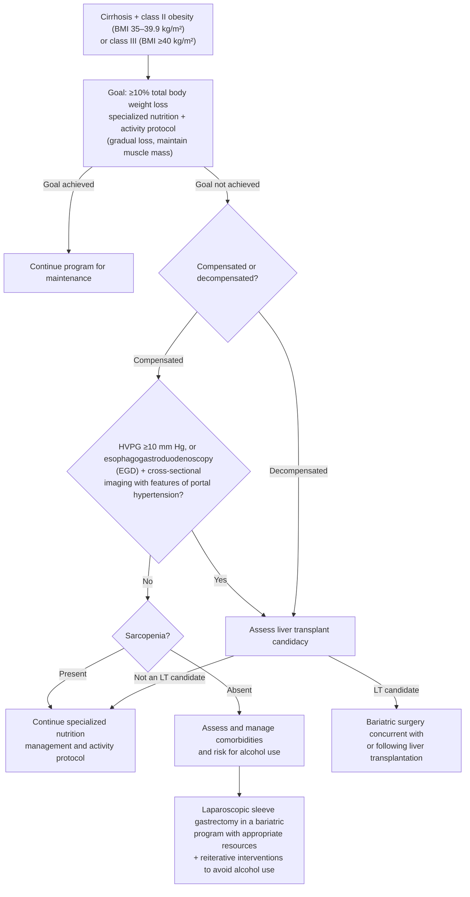

Surgical weight-loss procedures — laparoscopic **sleeve gastrectomy (SG)**, **Roux-en-Y gastric bypass (RYGB)**, adjustable gastric banding, duodenal switch — for [[obesity]]. Only ~**1.1% of eligible patients** receive primary bariatric surgery, and **<5%** of patients seeking weight loss are aware of endoscopic alternatives ([[aga-2021-intragastric-balloons]]).

This page covers the **gastrointestinal (GI)/endoscopic consequences** of these operations, which is where gastroenterology owns the care. Perioperative surgical technique is outside the scope of the guidelines cited here.

## Contents
- [[#Role Among Weight-Loss Options]]
- [[#Bariatric Surgery in MASLD/MASH]]
- [[#Bariatric Surgery in Cirrhosis]]
  - [[#Candidacy — the stage is the decision]]
  - [[#Preoperative CSPH assessment (BPA 6)]]
  - [[#Alcohol use — screen before, mitigate after (BPA 7)]]
  - [[#Procedure choice and timing (BPA 10)]]
  - [[#Program requirements (BPA 9)]]
  - [[#Endoscopic bariatric therapies in cirrhosis (BPA 8)]]
  - [[#Algorithm — class II/III obesity in cirrhosis]]
- [[#Early Complications (<90 Days)]]
  - [[#Scale of the problem]]
  - [[#Immediate postoperative endoscopy (BPA 5)]]
  - [[#Comorbid screening (BPA 4)]]
  - [[#Upper gastrointestinal hemorrhage]]
  - [[#Acute luminal obstruction]]
  - [[#Functional stenosis — pneumatic dilation technique (BPA 6)]]
  - [[#Operator requirements (BPA 2–3)]]
- [[#Post-Sleeve Gastrectomy — Reflux and Barrett's Surveillance]]
- [[#Bariatric Surgery for GERD in Obesity]]
- [[#Iron Deficiency After Bariatric Surgery]]
- [[#See Also]]
- [[#Sources]]

---

## Role Among Weight-Loss Options

- Definitive option for eligible patients; sits alongside dietary intervention, pharmacotherapy ([[glp-1-receptor-agonists|glucagon-like peptide-1 (GLP-1) receptor agonists]] such as [[semaglutide]]), and [[endoscopic-bariatric-therapies|endoscopic bariatric therapy]] — see [[obesity]] for the full menu.
- **Magnitude:** bariatric/metabolic surgery induces **20%–40% total body weight loss (TBWL)** and reduces obesity-related morbidity and mortality, offset by increased morbidity and rare mortality ([[aga-2017-endoscopic-bariatric-therapies]]).
- **Bridge indication, the other direction:** an endoscopic bariatric therapy can be used in severe obesity **as a bridge to surgery**, and as a bridge to unrelated interventions blocked by weight limits (orthopedic surgery, organ transplantation).
- **Sequencing with [[intragastric-balloon|intragastric balloons (IGB)]]** ([[aga-2021-intragastric-balloons]], Rec 7, *conditional, low certainty*): after IGB removal, subsequent weight-loss or maintenance interventions may include dietary interventions, pharmacotherapy, repeat IGB, **or bariatric surgery** — chosen by shared decision-making based on patient context and comorbidities. Bariatric surgery after IGB, and IGB as a bridge before surgery, are each supported by limited data.

---

## Bariatric Surgery in MASLD/MASH

Per [[aasld-2023-nafld|American Association for the Study of Liver Diseases (AASLD) 2023]] (Guidance Statement 22):

> Bariatric surgery should be considered as a therapeutic option in patients who meet criteria for metabolic weight-loss surgery, as it effectively resolves NAFLD [nonalcoholic fatty liver disease] or NASH [nonalcoholic steatohepatitis] in the majority of patients without cirrhosis and reduces mortality from CVD [cardiovascular disease] and malignancy.

- ⚠ *"Criteria for metabolic weight-loss surgery"* (the body mass index [BMI]/comorbidity eligibility thresholds) are **not defined by the guidelines on this page**. [[obesity]] carries only the **pharmacotherapy** thresholds (BMI ≥30, or ≥27 with a weight-related comorbidity, [[aga-2022-obesity-pharm]]) — those are **not** the surgical criteria and must not be read as such; take the surgical criteria from American Society for Metabolic and Bariatric Surgery (ASMBS)/International Federation for the Surgery of Obesity and Metabolic Disorders (IFSO) metabolic-surgery indications.
- **Efficacy:** resolves NASH **without worsening fibrosis in ~80% at 1 year**, sustained at 5 years.
- Sits within the lifestyle/weight-loss backbone of [[nafld-masld|metabolic dysfunction–associated steatotic liver disease (MASLD)]] management (weight-loss thresholds 3–5% for steatosis, 7–10% for steatohepatitis, ≥10% for fibrosis).
- Once [[cirrhosis]] is present the stage of liver disease governs the decision — see below.

---

## Bariatric Surgery in Cirrhosis

Anchored to [[aga-2020-bariatric-surgery-cirrhosis]] (10 ungraded Best Practice Advice statements). Perioperative risk scoring for any operation in cirrhosis lives on [[cirrhosis]].

**Why operate at all:** obesity in cirrhosis independently drives hepatic decompensation, [[portal-vein-thrombosis|portal vein thrombosis]], [[hepatocellular-carcinoma|hepatocellular carcinoma (HCC)]], and [[acute-on-chronic-liver-failure|acute-on-chronic liver failure]], so weight loss is a therapeutic goal (best practice advice [BPA] 1). Bariatric surgery **should be considered in selected patients with compensated cirrhosis** to reduce HCC risk and improve survival (BPA 4).

### Candidacy — the stage is the decision

| Stage | Position |
|---|---|
| **Compensated, no clinically significant portal hypertension (CSPH)** | Candidate — **only** by an experienced surgeon at a **high-volume bariatric center**, and **only after extrahepatic comorbidities are evaluated and managed** (BPA 5) |
| **Compensated with CSPH** | Not a candidate on the standard pathway → assess [[liver-transplantation\|liver transplantation (LT)]] candidacy. [[aga-2018-surgical-risk-perioperative-cirrhosis\|American Gastroenterological Association (AGA) 2018]] states plainly that **clinically significant portal hypertension is a contraindication** to the operation |
| **Decompensated** | **The only acceptable option is bariatric surgery concurrent with or after [[liver-transplantation\|liver transplantation]]** (BPA 10) |
| **NASH cirrhosis** ([[aasld-2023-nafld\|AASLD 2023]]) | Decompensated cirrhosis is an **absolute contraindication**; compensated NASH cirrhosis only at high-volume centers or in the transplant context |

**Stage-dependent operative mortality** (US Nationwide Inpatient Sample) — this is the number that makes stage the decision:

| Stage | In-hospital mortality after bariatric surgery |
|---|---|
| No cirrhosis | **0.3%** |
| Compensated cirrhosis | **0.9%** |
| Decompensated cirrhosis | **16.3%** |

- **LT candidacy must be determined before** bariatric surgery, so a patient who is not a transplant candidate knows that in advance (BPA 9). At a non-transplant center, consult a hepatologist with transplant expertise at a minimum.
- **Cirrhosis discovered incidentally at operation** → transfer to a center with cirrhosis resources if intraoperative or postoperative liver-related complications occur.

### Preoperative CSPH assessment (BPA 6)

- **Cross-sectional imaging *and* upper endoscopy** are both required to look for features of CSPH. Noninvasive testing is **not validated for this purpose** in bariatric candidates — specifically, the Baveno elastography-plus-platelet rule for skipping variceal screening has **not** been validated here.
- **[[hepatic-venous-pressure-gradient|Hepatic venous pressure gradient (HVPG)]] <10 mm Hg** is the accepted threshold for safe segmental liver resection in cirrhosis and is adopted here in the absence of bariatric-specific data; **HVPG ≥10 mm Hg** takes the patient off the standard pathway.
- CSPH raises postoperative mortality, complications, liver failure, and poorer survival in the liver-resection literature. Small series report feasible bariatric surgery in patients with CSPH with low event rates, but it should be restricted to selected centers with the experience and resources to manage complications.

### Alcohol use — screen before, mitigate after (BPA 7)

- Bariatric surgery changes both drinking habits and alcohol metabolism, so candidates need **intensive preoperative assessment** and **long-term postoperative risk mitigation**.
- Alcohol use disorder (AUD) (dependence symptoms or **Alcohol Use Disorders Identification Test [AUDIT] score ≥8**) rose after **RYGB from ~7% preoperatively to 16% at year 7**, while remaining 6%–8% after adjustable gastric banding. Meta-analysis: no increase at 2 years, but at **3 years pooled odds ratio (OR) 1.83 (95% confidence interval [CI] 1.53–2.18)**, particularly with RYGB.
- After both RYGB and sleeve gastrectomy, **time to peak blood alcohol concentration (BAC) is shorter and peak BAC roughly doubles** per drink equivalent — so in preoperative advanced fibrosis the threshold for clinically significant liver injury is likely very low.
- Risk factors for postoperative AUD: regular or problematic preoperative alcohol use, male sex, younger age, tobacco or recreational drug use, lower interpersonal support, prior RYGB. Patient recall of this education is poor → **repeat it**.

### Procedure choice and timing (BPA 10)

- **Laparoscopic sleeve gastrectomy is the likely optimal procedure**: preserves endoscopic access to the stomach and biliary tree, causes **no malabsorption** (which would threaten absorption of immunosuppression after transplant), and produces **gradual** weight loss.
- Adjustable gastric banding is now much less used (reduced long-term efficacy; band erosion and displacement).
- **Decompensated disease → SG concurrent with or after LT.** Combined LT + SG gives one procedure and one recovery, with durable weight loss and favorable metabolic outcomes at 3 years; SG *after* transplant is reported with acceptable outcomes but **longer operative times and more complications**. The risk of combined versus sequential operations is unknown.
- **Prior bariatric surgery worsens the waitlist:** in cirrhotic patients evaluated for LT, prior bariatric surgery was associated with **delisting or death on the list in 33% vs 10%** of matched controls, with more sarcopenia after RYGB.

### Program requirements (BPA 9)

- Metabolic and Bariatric Surgery Accreditation and Quality Improvement Program (MBSAQIP) standards — a bariatric surgeon meeting training and volume requirements (**50 cases annually** for comprehensive centers), specialized anesthesia protocols, and a multidisciplinary team (dietitians, behavioral health, physical therapy), with cardiology/nephrology/pulmonology consultation available.
- **On top of that:** a surgical and anesthesia team experienced in operating on patients with portal hypertension and cirrhosis, plus a medical team experienced in postoperative cirrhosis care.

### Endoscopic bariatric therapies in cirrhosis (BPA 8)

- Intragastric balloon, percutaneous gastric aspiration, and endoscopic sleeve gastrectomy may carry lower risk than surgery, but direct comparative and long-term efficacy data are lacking.
- **CSPH — specifically gastric and/or esophageal varices — contraindicates all endoscopic bariatric devices.** Device detail on [[intragastric-balloon]] and [[endoscopic-bariatric-therapies]].

---

## Early Complications (<90 Days)

*Source: [[aga-2021-early-complications-bariatric-surgery]] — **7 Best Practice Advice, ungraded**. Staple-line leak itself, with the AGA Figure 1 algorithm and all internal-drainage technique, has its own page: [[bariatric-surgery-leak]].*

### Scale of the problem

- ~**205,000** primary bariatric operations in the United States in 2018; ~**95% (198,000)** were SG (**155,000**) or RYGB (**43,000**).
- **90-day mortality 0.1%–0.3%**; **90-day overall complication rate 7%–10%, of which 4% are major**.
- **Age >65 y: 90-day mortality 1.3%, overall complication rate 20.1%.**
- Flexible endoscopy is the principal method of diagnosing and treating many of these complications. Evaluation and treatment algorithms are **not standardized** and high-quality prospective data are scarce.
- **Multidisciplinary co-management is advised (BPA 1)** — interventional radiology and bariatric/metabolic surgery co-managing, with **daily communication**. The radiologist advises on optimal imaging (upper gastrointestinal series vs oral/intravenous contrast computed tomography) and on prospects for a percutaneous drain; the surgeon advises on the anticipated morbidity of revision.

### Immediate postoperative endoscopy (BPA 5)

- Endoscopy may be considered in the immediate, early, and late postoperative periods **depending on hemodynamic stability**.
- Use **carbon dioxide insufflation**; minimize pressure along fresh staple lines when advancing into the small bowel.
- Critically ill patient, or an endoscopist without experience in the scenario → perform **in the operating room with a surgeon present**, preferably the operating surgeon.
- Owing to the small-caliber lumens after SG and RYGB and to body habitus, keep a **low threshold for general anesthesia with airway protection**.

### Comorbid screening (BPA 4)

- Severe persistent vomiting about to undergo **emergent general anesthesia** (often with paralysis) → **test and treat for potassium deficiency**.
- In the weeks after surgery → **screen regularly and prophylactically treat for thiamine deficiency**; Wernicke's encephalopathy has been reported.
- **Severe food intolerance plus concomitant [[proton-pump-inhibitors|proton pump inhibitor (PPI)]] use** → also test for **magnesium and calcium deficiency**.
- Screen all patients for comorbid medical (nutrient deficiencies, infection, pulmonary embolism) and psychological (depression, anxiety) conditions.

### Upper gastrointestinal hemorrhage

- Most commonly at staple lines, or from an **acute marginal ulcer after RYGB**; also suspect **extraluminal bleeding** in the early postoperative period.
- Massive bleeding → **overtube** for clot removal.
- **Prefer through-the-scope (TTS) clips over thermal ablative methods** — thermal energy risks a consequent leak. This is the decision rule.
- TTS clips fail → hemostatic powder (TC-325), over-the-scope clips, Padlock clip, or endoscopic suturing.
- Mechanical hemostasis also allows **prompt restart of venous thromboembolism prophylaxis**.
- General approach to the bleed itself: [[upper-gi-bleeding]], [[endoscopic-hemostasis]].

### Acute luminal obstruction

Postoperative edema or hematoma at the anastomosis — consider a **self-expandable metallic stent (SEMS)**:

| Site | Preferred stent | Note |
|---|---|---|
| After SG at the **incisura angularis**, or a prior laparoscopic adjustable gastric band site | Covered esophageal SEMS **secured** with endoscopic suturing or an over-the-scope stent-fixation clip | Securing is **mandatory** — the distal end may lie beyond the pylorus or gastrojejunal (GJ) anastomosis |
| **GJ anastomosis after RYGB** | **Lumen-apposing metal stent**, if anatomy permits | — |

- **Large-caliber stents (15–20 mm) are safe and will not cause dehiscence of fresh staple lines.**
- Where obstruction is malignant rather than postoperative, see [[gastric-outlet-obstruction]].

### Functional stenosis — pneumatic dilation technique (BPA 6)

Downstream stenosis is what propagates a leak, so it must be treated alongside it, not after it. Technique:

- Balloons **8–10 cm long, 30–40 mm diameter** — but **dilation should rarely exceed 35 mm**.
- Endoscope **side-by-side with the balloon**, not through-the-scope (TTS balloons are for a GJ anastomotic stricture), so endoscopic *and* fluoroscopic views are maintained throughout.
- **Fluoroscopy recommended though not mandatory** — confirm the distal balloon has not inadvertently crossed the pylorus.
- Endoscope flush on the proximal aspect of the balloon: an **isolated ischemic ring should be seen at the stenosis**. **Confluent mucosal blanching means the sleeve lumen may be too small for that balloon** — stop.
- **Inflate to 20 psi for 1–3 minutes**, then reinspect for a tear.
- Tear involving the **muscularis propria or beyond** → attempt endoscopic suturing to close the defect. Perforation uncertain → inject contrast to flood the stomach and assess for extravasation.
- **Dilations may be performed as early as 2 weeks after surgery.**
- **Refractory incisura stenosis** — inadequate response after **2–3 dilations, each 2–4 weeks apart, to a maximum of 35 mm** → deploy a **large-diameter fully covered SEMS up to 60 mm long** across the stenosis, secured, for **2 months**. Its sole purpose is to improve pressure and flow dynamics, not to cover a leak site; because such stents should not cross the gastroesophageal junction, they are generally well tolerated.

### Operator requirements (BPA 2–3)

- Comprehensive knowledge of the indications, contraindications, risks, benefits, and outcomes of each endoscopic technique, **and** of surgical and interventional-radiologic alternatives.
- Expertise in interventional endoscopy: concomitant fluoroscopy, **stent deployment and retrieval**, managing stenosis, managing percutaneous drains, **pneumatic balloon dilation, incisional therapies, and endoscopic suturing**.
- Experience with the endoscopic appearance of SG and RYGB anatomy — recognizing the staple line, what constitutes a stenosis or stricture, and the **diameter and length of stent required**.

### Algorithm — class II/III obesity in cirrhosis

```mermaid
flowchart TD
    A["Cirrhosis + class II obesity (BMI 35–39.9 kg/m²)<br/>or class III (BMI ≥40 kg/m²)"] --> B["Goal: ≥10% total body weight loss<br/>specialized nutrition + activity protocol<br/>(gradual loss, maintain muscle mass)"]
    B -->|"Goal achieved"| C["Continue program for maintenance"]
    B -->|"Goal not achieved"| D{"Compensated or decompensated?"}
    D -->|"Compensated"| E{"HVPG ≥10 mm Hg, or esophagogastroduodenoscopy<br/>(EGD) + cross-sectional<br/>imaging with features of portal hypertension?"}
    E -->|"Yes"| F["Assess liver transplant candidacy"]
    E -->|"No"| G{"Sarcopenia?"}
    G -->|"Present"| K["Continue specialized nutrition<br/>management and activity protocol"]
    G -->|"Absent"| H["Assess and manage comorbidities<br/>and risk for alcohol use"]
    H --> I["Laparoscopic sleeve gastrectomy in a bariatric<br/>program with appropriate resources<br/>+ reiterative interventions to avoid alcohol use"]
    D -->|"Decompensated"| F
    F -->|"LT candidate"| J["Bariatric surgery concurrent with<br/>or following liver transplantation"]
    F -->|"Not an LT candidate"| K
```

*Figure — management pathway for class II/III [[obesity]] in cirrhosis. ([[aga-2020-bariatric-surgery-cirrhosis]])*

---

## Post-Sleeve Gastrectomy — Reflux and Barrett's Surveillance

Sleeve gastrectomy is **refluxogenic**, and the resulting [[barretts-esophagus|Barrett's esophagus]] rate crosses the threshold at which the American Society for Gastrointestinal Endoscopy (ASGE) screens ([[asge-2024-gerd]], *conditional, very low quality*):

| Finding after SG | Rate |
|---|---|
| De novo [[gerd\|gastroesophageal reflux disease (GERD)]] | **45%** |
| Erosive esophagitis | **39.1%** post-SG vs 21.9% pre-SG |
| Pooled Barrett's esophagus | **11.4%** (vs the ASGE's 10% screening threshold) |

**Endoscopy recommendation after SG:**

- **Symptomatic** → perform [[upper-endoscopy|upper endoscopy]].
- **Asymptomatic** → consider screening endoscopy at **3 years**, then **every 5 years**.

---

## Bariatric Surgery for GERD in Obesity

- **[[acg-2021-gerd|American College of Gastroenterology (ACG) 2021]]:** Roux-en-Y gastric bypass is recommended for obese patients with GERD (*conditional, low quality*) — i.e. in obesity, RYGB is the antireflux operation, distinct from the fundoplication pathway on [[antireflux-surgery]].
- Contrast with SG above, which **causes** rather than treats reflux.

---

## Iron Deficiency After Bariatric Surgery

Per [[aga-2024-ida-management|AGA 2024]] (Best Practice Advice 7, *unrated*):

> Intravenous iron therapy should be used in individuals who have undergone bariatric procedures, particularly those that are likely to disrupt normal duodenal iron absorption, and have iron-deficiency anemia with no identifiable source of chronic gastrointestinal blood loss.

- Rationale: **duodenal bypass** (especially RYGB) defeats oral iron absorption — so [[iron-deficiency-anemia|iron-deficiency anemia (IDA)]] here is a malabsorptive, not necessarily a bleeding, problem.
- Still perform **upper endoscopy to exclude an anastomotic (marginal) ulcer** before attributing IDA to malabsorption alone.

---

## See Also

[[obesity]], [[intragastric-balloon]], [[endoscopic-bariatric-therapies]], [[bariatric-surgery-leak]], [[semaglutide]], [[glp-1-receptor-agonists]], [[nafld-masld]], [[cirrhosis]], [[portal-hypertension]], [[hepatic-venous-pressure-gradient]], [[portal-vein-thrombosis]], [[acute-on-chronic-liver-failure]], [[hepatocellular-carcinoma]], [[gerd]], [[barretts-esophagus]], [[antireflux-surgery]], [[upper-endoscopy]], [[upper-gi-bleeding]], [[endoscopic-hemostasis]], [[gastric-outlet-obstruction]], [[proton-pump-inhibitors]], [[iron-deficiency-anemia]], [[liver-transplantation]]

---

## Sources

1. [[aga-2021-intragastric-balloons|AGA Clinical Practice Guidelines on Intragastric Balloons in the Management of Obesity (2021)]]
2. [[aasld-2023-nafld|AASLD Practice Guidance on the Clinical Assessment and Management of Nonalcoholic Fatty Liver Disease (2023)]]
3. [[asge-2024-gerd|ASGE 2024: Diagnosis and Management of GERD]]
4. [[acg-2021-gerd|ACG 2021 Clinical Guideline: Diagnosis and Management of GERD]]
5. [[aga-2024-ida-management|AGA Clinical Practice Update on Management of Iron Deficiency Anemia: Expert Review]]
6. [[aga-2022-obesity-pharm|AGA Clinical Practice Guideline: Pharmacological Interventions for Adults with Obesity (2022)]]
7. [[aga-2020-bariatric-surgery-cirrhosis|AGA Clinical Practice Update on Bariatric Surgery in Cirrhosis: Expert Review]]
8. [[aga-2018-surgical-risk-perioperative-cirrhosis|AGA Clinical Practice Update on Surgical Risk Assessment and Perioperative Management in Cirrhosis: Expert Review (2019)]]
9. [[aga-2021-early-complications-bariatric-surgery|AGA Clinical Practice Update on Evaluation and Management of Early Complications After Bariatric/Metabolic Surgery: Expert Review (2021)]]
10. [[aga-2017-endoscopic-bariatric-therapies|AGA Clinical Practice Update: Expert Review on Endoscopic Bariatric Therapies (2017)]]
