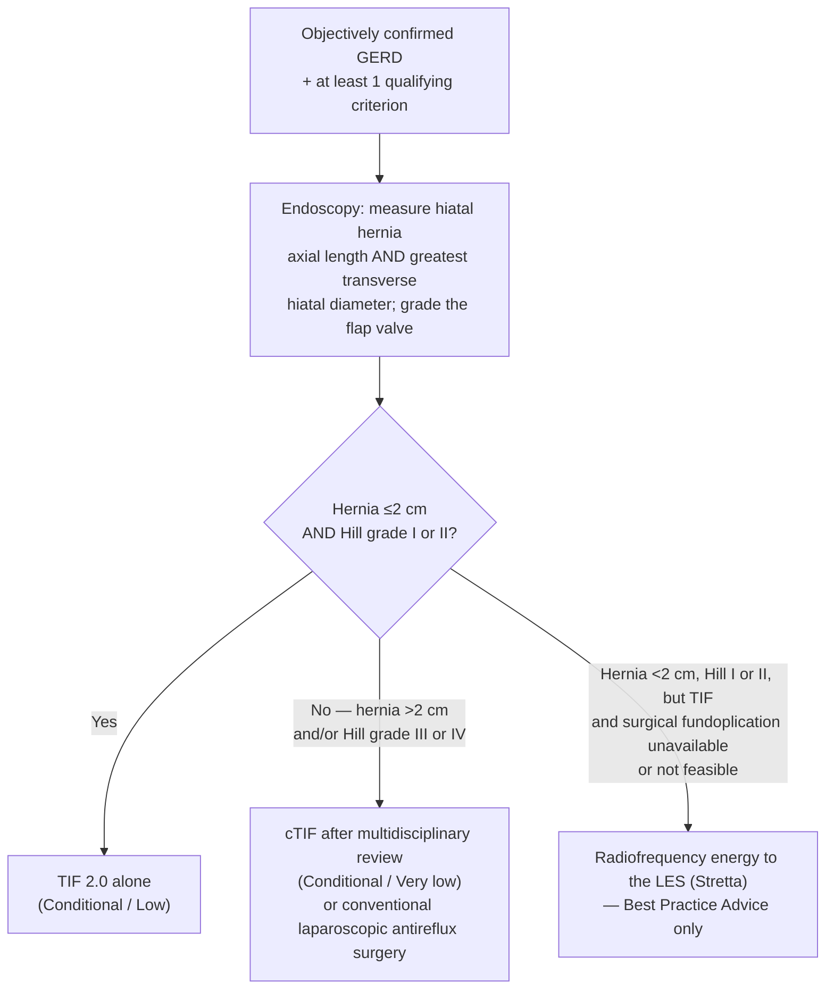

*Endoscopic, incisionless reconstruction of the gastroesophageal flap valve for [[gerd|gastroesophageal reflux disease (GERD)]]. Candidacy turns on three things: **objectively confirmed GERD**, **hiatal hernia size**, and **[[reflux-testing|Hill grade]]** — hernia ≤2 cm with Hill grade I/II can have transoral incisionless fundoplication (TIF) alone; hernia >2 cm with Hill grade III/IV needs the hernia repaired surgically first in the same session (concomitant TIF).*

## Contents
- [[#What the Procedure Creates]]
- [[#Patient Selection]]
  - [[#Who Qualifies for TIF 2.0]]
  - [[#Hernia Size and Hill Grade — the Routing Decision]]
  - [[#Relative Contraindications]]
- [[#Preoperative Workup]]
- [[#Technique — TIF 2.0]]
- [[#Concomitant Hiatal Hernia Repair (cTIF)]]
- [[#Postoperative Care]]
- [[#Outcomes]]
  - [[#TIF 2.0 vs Medical Therapy]]
  - [[#cTIF vs Medical Therapy]]
- [[#Adverse Events]]
- [[#How It Compares to the Alternatives]]
- [[#See Also]]
- [[#Sources]]

---

## What the Procedure Creates

- Endoscopic procedure that **re-establishes and augments the gastroesophageal flap valve (GEFV)** ([[afs-2023-transoral-incisionless-fundoplication]]).
- Components of the reflux barrier it addresses: diaphragmatic crura · GEFV · intrinsic lower esophageal sphincter (LES) and its sling fibers.
- **Mechanism:** reduces esophagogastric junction (EGJ) distensibility → decreases transient LES relaxation — the main mechanism in upright refluxers.
- Done under general anesthesia, left lateral / supine / modified left lateral position; two operators (one on the device, one on the endoscope) or one operator plus a trained helper.

**TIF vs a surgical fundoplication — these are different constructs, not the same operation by another route:**

| | TIF 2.0 | Traditional fundoplication |
|---|---|---|
| Valve produced | **True flap valve** — distal esophagus partially invaginated into the surrounding fundus, accentuating the cardiac notch and sharpening the angle of His | **Wrapped valve construct** — fundus wrapped circumferentially around the distal esophagus |
| Short gastric vessels | **Not divided** | Divided |
| Stomach during construction | **Inflated**, fixed at 30+ points | Collapsed, not inflated |
| High-pressure zone at distal esophagus | Yes | Yes |

- **Device generations:** endoluminal gastro-gastric fundoplication (ELF) → TIF 1.0 (plications of the cardia onto the distal esophagus, just proximal to the EGJ; wrap 250°–300°) → **TIF 2.0** (rotational wrap of cardia and fundus around the circumference of the distal esophagus; wrap **270°–320°**). Current device is the single-use **EsophyX Z+**.
- **Food and Drug Administration (FDA) milestone:** since **2017**, same-session laparoscopic hiatal hernia repair followed by TIF (**cTIF**) is permitted.

---

## Patient Selection

### Who Qualifies for TIF 2.0

[[asge-2024-gerd|American Society for Gastrointestinal Endoscopy (ASGE) 2025]] — *Conditional recommendation, low quality of evidence:*

> In patients with confirmed GERD with **small hiatal hernia (≤2 cm)** and **Hill grade I or II** who meet **any** of the following criteria, ASGE suggests evaluation for TIF as an alternative to long-term medical management.

| # | Qualifying criterion (any one suffices) |
|---|---|
| 1 | **Chronic GERD** — at least 6 months |
| 2 | **Long-term proton pump inhibitor (PPI) use** — at least 6 months, for GERD symptoms |
| 3 | **Refractory GERD** |
| 4 | **Regurgitation-predominant GERD** |
| 5 | **Patient prefers to avoid long-term PPI use** |

- **"Refractory GERD" is defined** in the panel's discussion as persistent troublesome GERD symptoms **despite double-dose PPI for at least 8 weeks**, in the setting of **ongoing documented pathologic reflux** ([[asge-2024-gerd]]).
- **GERD must be objectively confirmed** before the discussion starts — the recommendation applies only to *confirmed* disease (see [[reflux-testing]]).
- Original FDA approval was for chronic GERD **responsive** to PPIs; indications have since widened to partial responders, refractory GERD, PPI-intolerant patients, patients with PPI-adverse effects, and patients who simply do not want lifelong acid suppression ([[afs-2023-transoral-incisionless-fundoplication]]).
- Also an option for patients who are **not magnetic sphincter augmentation (MSA) candidates on manometry**, and for those declining a traditional fundoplication over gas-bloat and dysphagia concerns.
- **Post-[[poem|peroral endoscopic myotomy (POEM)]] reflux:** published case reports describe TIF 2.0 safety, efficacy, and utility — case-report-level evidence only.
- **Barrett's esophagus:** very limited data on TIF to facilitate remission of intestinal metaplasia/dysplasia after endoscopic eradication of [[barretts-esophagus|Barrett's]]. A trial is ongoing; **efficacy in this setting is not yet defined.**

### Hernia Size and Hill Grade — the Routing Decision

| Hiatal hernia | Hill grade | Route | Strength / Evidence ([[asge-2024-gerd]]) |
|---|---|---|---|
| **≤2 cm** | **I or II** | TIF 2.0 | Conditional / Low |
| **>2 cm** | **III or IV** | **cTIF** in multidisciplinary review, or conventional laparoscopic anti-reflux surgery (LARS) | Conditional / Very low |
| **<2 cm** | **I or II** | Radiofrequency energy (Stretta) — only when endoscopic or surgical fundoplication is **not available or feasible** | Best Practice Advice (ungraded) |

- **Measure the hernia two ways** — **axial length** *and* **greatest diameter of the diaphragmatic hiatus**. A hernia **<2 cm in transverse diameter and in axial length** is the inclusion criterion for TIF ([[afs-2023-transoral-incisionless-fundoplication]]).
- **Sizing caution:** hernia size observed at laparoscopic repair is **often larger than it looked on endoscopy** — apply extra caution even when the hernia measures under 2 cm endoscopically.
- **Hill grade is the valve limb of the decision:** Hill Grade I and **some** Hill Grade II qualify for TIF 2.0 alone; **Hill Grade III and IV should be addressed through LARS or a concomitant approach.** Hill grade criteria with the figure live on [[reflux-testing]]; [[asge-2024-gerd]] drives the decision off Hill grade without printing the grades.
- A newer **American Foregut Society (AFS) endoscopic classification of the EGJ** — axial hiatal hernia length (**L**), hiatal aperture diameter (**D**), presence or absence of the flap valve (**F**) — **may** be incorporated into antireflux procedure selection **after validation in independent studies**; it is not a selection criterion today.
- The hernia-size threshold for **cTIF** has **not** been defined by any randomized trial; published series span hernias from 2–5 cm up to **8 cm** with no intraoperative complications and no adverse events reported.

### Relative Contraindications

Conditions of specific or relative contraindication to TIF with the EsophyX device ([[afs-2023-transoral-incisionless-fundoplication]], Table 1):

| Category | Condition |
|---|---|
| **Hiatus** | [[hiatal-hernia\|Hiatal hernia]] >2 cm · paraesophageal hernia |
| **Esophagus — structural** | Esophageal diverticula · stenosis · strictures · obstructions · [[variceal-upper-gi-bleeding\|esophageal varices]] · any normal or abnormal esophageal anatomy that will not permit insertion of the device |
| **Esophagus — mucosal** | Severe esophagitis (**Los Angeles [LA] grade C and D**) · [[infectious-esophagitis\|esophageal infection or fungal disease]] |
| **Access / positioning** | Limited neck mobility · osteophytes of the spine |
| **Systemic** | Bleeding disorders · **body mass index (BMI) ≥35** |

- **BMI caveat:** BMI ≥35 sits in the relative-contraindication table, yet the same paper's conclusions state obese patients with BMI >35 **may still be candidates for TIF**, though they "may be better served overall with [[bariatric-surgery|bariatric surgery]]." Treat as relative, with a bariatric-referral preference — not an absolute bar.

---

## Preoperative Workup

**No specific guideline defines a pre-TIF workup.** AFS advises following the same principles and diagnostic evaluation used for surgical fundoplication, with slight modifications, plus a detailed history of symptoms and response to PPIs and/or histamine-2 receptor blockers ([[afs-2023-transoral-incisionless-fundoplication]]):

| # | Study | Status | What it must establish |
|---|---|---|---|
| 1 | **[[upper-endoscopy\|Esophagogastroduodenoscopy (EGD)]] with esophageal biopsies within 1 year** | **Essential** | EGJ integrity by Hill classification · hiatal hernia **axial length and greatest hiatal diameter** · GERD complications (esophagitis by LA grade, long-segment Barrett's) |
| 2 | **pH monitoring off PPI** ± impedance | **Highly recommended in non-erosive reflux disease** | Objective pathologic reflux |
| 3 | **Barium esophagram** | Advised | Presence, size, and type of hernia; alerts to **short esophagus** — central to choosing TIF vs cTIF |
| 4 | **[[high-resolution-manometry\|High-resolution esophageal manometry (HREM)]]** ± timed barium esophagram | **Strongly advised only if dysphagia** | Rule out [[achalasia]] or another major motility disorder |
| 5 | **4-hour gastric emptying study** | Case by case | When nausea, early satiety, fullness, or bloating suggests [[gastroparesis]] |

- **When objective reflux testing can be skipped:** **LA grade C and D** esophagitis and **long-segment** Barrett's **obviate** the need for pH testing. **LA grade A and B** and **short-segment** Barrett's carry high inter-observer variability as evidence of pathologic reflux — **formal objective reflux testing should be performed** in those cases.
- **Wireless pH off PPI for 96 hours** increases diagnostic yield compared with 48 hours, and both exceed 24-hour catheter-based testing (see [[ambulatory-reflux-monitoring]]).
- **Manometry policy deliberately differs from pre-laparoscopic Nissen fundoplication (LNF) practice:** GERD patients **without** dysphagia do **not** routinely require manometry before TIF. Rationale — before LNF, a manometric diagnosis of [[ineffective-esophageal-motility|ineffective esophageal motility (IEM)]] carries more dysphagia risk and may change the type of fundoplication; TIF is a **partial fundoplication performed over a 60 French device**, so IEM poses less dysphagia risk.
- **[[flip-panometry|Functional luminal imaging probe (FLIP)]] is an acceptable alternative to routine manometry** as a screen for achalasia and [[esophagogastric-junction-outflow-obstruction|EGJ outflow obstruction (EGJOO)]], and can be performed at the same session as the diagnostic endoscopy — generally more appealing to patients.

---

## Technique — TIF 2.0

Diagnostic EGD first — assess esophagitis, exclude strictures or webs that would prevent safe device passage, measure anatomic landmarks, document the Hill grade ([[afs-2023-transoral-incisionless-fundoplication]]).

| Step | Rule | Why it matters |
|---|---|---|
| **Insufflation** | **Carbon dioxide (CO₂) only, set to 15 mmHg.** Air insufflation is discouraged | — |
| **Esophageal preparation** | Empiric dilation with a **57–60 Fr (18–20 mm) Savary dilator** over a wire, or an **18–20 mm through-the-scope (TTS) hydrostatic balloon** | Mucosal tear/perforation typically occurs at initial introduction of the device past the cervical esophagus |
| **Device passage** | Lubricate (mineral oil or equivalent, **not standard lubricant** in the channel); jaw thrust; the anesthesia provider may temporarily deflate the endotracheal tube cuff; gentle back-and-forth rocking rotation; index finger at the base of the tongue to deflect the vector downward. **Never force** | Difficulty is almost always mechanical and must be remedied — excessive force is the problem |
| **Starting point** | Rotate to the **posterior aspect of the EGJ, 11 o'clock** | Starting point for the fundoplication |
| **Depth before firing** | Advance the device into the stomach, **usually 0.5–1.0 cm**, to the level of the **pre-procedure EGJ measurement**, before deploying | **Critical step.** Fasteners deployed above this landmark may pass **through the diaphragm** → mediastinitis, abscess, or leak |
| **Plication sequence** | ≥**3 plications posteriorly**, then **3 anteriorly**, then rotate toward the greater curvature and repeat at **4, 6, and 8 o'clock** (no rotation needed) | 4/6/8 o'clock is where the **diaphragm lies closest to the esophagus** and fasteners are most liable to traverse mediastinum and diaphragm if the device is not advanced far enough below the EGJ |
| **Fastener count** | The first **20 fasteners (10 plications) is the minimal number.** Typically 1–2 reinforcements per corner and 3–4 "mid-valve" fasteners at ~8, 6, and 4 o'clock without retraction | — |
| **Re-firing** | **Never place additional fasteners over prior fasteners** | Esophageal injury → mediastinal infection, abscess, fistula, perforation |
| **Final valve** | **270°–320°** in circumference, **3–4 cm** long | — |
| **Before withdrawal** | **Immediate post-TIF endoscopy** after the device is removed | Evaluate for bleeding or injury |

---

## Concomitant Hiatal Hernia Repair (cTIF)

Laparoscopic repair of the hiatal hernia followed by TIF **under the same anesthetic** — currently the most common procedure performed involving TIF 2.0, because the majority of GERD patients have a concomitant hiatal hernia ([[afs-2023-transoral-incisionless-fundoplication]]). Either a single surgeon performs both, or the surgeon repairs the hernia and the gastroenterologist performs the TIF.

**The operative determinant is intra-abdominal esophageal length, not hernia size:**

- Dissect **as high in the mediastinum as possible** → reduces the stomach into the abdomen and obtains **2–3 cm of intra-abdominal esophageal length**.
- **Hard stop: if adequate intra-abdominal esophageal length cannot be obtained, do not perform the TIF** — firing the T-fasteners may injure mediastinal structures.
- Dividing the phrenoesophageal membrane with mediastinal mobilization makes the TIF portion **technically easier** (the valve lies flat against the crura) and lowers the risk of firing T-fasteners through the diaphragm. **The suction-and-push-off-the-diaphragm maneuver is still critical and must be performed.**
- **Crural repair** per surgeon preference — **interrupted sutures more commonly than running**. The repair must still permit the device to pass the level of the diaphragmatic hiatus; pass with caution at that level.
- **Do not fixate the stomach to the crura** — it impedes the tissue mobility the TIF portion requires.
- **Mesh** is at the operating surgeon's discretion (biologic or biosynthetic); it must not impact the TIF portion so long as it lies flat without folded edges. Bioabsorbable mesh does not appear to increase adverse events. **Use of mesh in cTIF remains an area to be further studied.**
- Preferred hernia-repair approach is **minimally invasive (laparoscopic or robotic)** — less postoperative pain, faster recovery, reduced morbidity, shorter length of stay than open repair.
- Minority view to disclose: some patients and gastroenterologists decline laparoscopic fundoplication over perceived long-term gas-bloat and dysphagia; the trade for cTIF is a perceived higher risk of esophageal injury when mixing laparoscopy with endoscopy.

---

## Postoperative Care

Retching and vomiting can **disrupt the hiatus and the newly created valve** — which is why the antiemetic protocol is aggressive ([[afs-2023-transoral-incisionless-fundoplication]]):

| Element | Protocol |
|---|---|
| **Disposition** | TIF alone — brief observation, **same-day discharge on a clear liquid diet**. cTIF — **nothing by mouth (NPO)**, overnight observation for hydration and control of nausea, vomiting, abdominal cramps; same-day discharge is acceptable at the surgical/GI team's discretion if pain and nausea are well controlled |
| **Antiemetics** | Preoperative **scopolamine patch** + intraoperative **ondansetron and dexamethasone**; scheduled postoperative antiemetics for the first few days — **double or even triple** agents if no contraindication (ondansetron 8 mg, droperidol 0.625 mg, aprepitant 80 mg) |
| **Antibiotics** | Broad-spectrum, **within 30 minutes before the procedure**, covering enteric gram-negatives, anaerobes, and enterococci (see [[antibiotic-prophylaxis-endoscopy]]); some providers continue for several days |
| **Analgesia** | Intraoperative acetaminophen and/or ketorolac |
| **Diet** | Full liquid **2 weeks** → pureed **1–2 weeks** → soft **1–2 weeks** → **regular diet in the sixth week** |
| **PPI** | **Continue 4–6 weeks** after TIF — allows gastric mucosal healing, avoids ulceration and bleeding at the fastener sites |
| **Activity** | **Lifting ≤15 lb for the first 8 weeks** — heavy lifting raises intra-abdominal pressure and can cause hiatal recurrence |
| **Adjuncts** | Hyoscyamine for esophageal spasm (± anxiolytic at bedtime) · simethicone for bloating · bowel regimen (e.g., polyethylene glycol) to avoid straining |

- **Expected after the procedure, not complications:** sore throat, left shoulder pain, substernal chest pain — the plication is full thickness. Esophageal spasm can be pronounced and can itself cause chest pain in the immediate postoperative period.

---

## Outcomes

### TIF 2.0 vs Medical Therapy

[[asge-2024-gerd]] meta-analyses (EsophyX 2.0 vs sham and/or PPI). Certainty is the guideline's own Grading of Recommendations Assessment, Development and Evaluation (GRADE) rating per outcome:

| Outcome | TIF | Sham and/or PPI | Effect | Certainty |
|---|---|---|---|---|
| **PPI discontinuation** (3 randomized controlled trials [RCTs], mean 6 mo) | 76/98 (**77.6%**) | 4/63 (6.3%) | Risk ratio (RR) **12.70** (1.15–140.30) | Low |
| PPI discontinuation (14 cohorts, mean 19.1 mo) | 179/625 (**28.6%**) on PPI after TIF | 659/667 (98.8%) on PPI before | Pooled RR 2.93 (2.06–4.15) | Very low |
| PPI discontinuation at **8–10 y** (2 cohorts, n=107) | **34.4%** completely off PPI; 91.7% occasional users | — | — | Very low |
| **Symptom resolution** (4 RCTs, mean 6 mo) | 120/176 (**68.2%**) | 33/102 (32.4%) | RR **2.12** (1.27–3.54) | Low |
| **Durable symptom resolution** (1 RCT, mean 5 y) | 38/44 (**86.4%**) resolved; 100% symptomatic at baseline | — | — | Moderate |
| Durable symptom resolution (3 non-randomized, mean 5 y) | 69/86 (86.3%) | — | — | Very low |
| **Acid exposure time (AET, % time pH <4) vs sham** (2 RCTs) | n=109 | n=64 | Mean difference (MD) **2.38 lower** (0.22–4.54 lower) | Moderate |
| **AET vs PPI** (2 RCTs) | n=79 | n=41 | MD **2.61 higher** (0.78 lower to 4.44 higher) | Moderate |
| Normalization of AET (2 RCTs) | 35/62 (56.5%) | 17/42 (40.5%) | RR 1.62 (0.30–8.62) | Moderate |
| GERD health-related quality of life (GERD-HRQL) score, cohorts only (10 studies, mean 22.2 mo) | — | — | MD 19.91 lower (16.46–23.36 lower) | Very low |

- **The honest reading of the acid data:** TIF lowers AET versus sham but **not versus PPI** — the mechanism of the symptom benefit is unresolved.
- **Cost:** in refractory GERD, average cost of care over 2 years was much lower with TIF 2.0 than with LNF (**$66,000 vs $124,000**).
- **Panel's overall judgement:** TIF 2.0 showed short-term improvement of GERD symptoms and durable symptom remission **for up to 5 years** with low serious adverse event rates; certainty was downgraded for heterogeneity (3–4 device iterations and 3 techniques over a decade), imprecision, varying outcome definitions, and inability to pool some outcomes.
- **Durability trade-off ([[afs-2023-transoral-incisionless-fundoplication]]):** no head-to-head comparison exists. Traditional fundoplication appears to have the **greatest durability for increasing LES pressure and reducing % time pH <4 long-term**; TIF appears **superior in symptom improvement and patient satisfaction.** Prospective direct comparison is needed.

### cTIF vs Medical Therapy

All evidence is observational — **7 cohort studies (3 prospective, 4 retrospective); one multicenter RCT (NCT04795934) is ongoing** ([[asge-2024-gerd]]):

| Outcome | cTIF | Comparator | Effect | Certainty |
|---|---|---|---|---|
| **PPI discontinuation** (6 cohorts, mean 9.3 mo) | 95/253 (**37.5%**) still on PPI | 349/369 (94.6%) on PPI at baseline | Odds ratio (OR) **0.71** (0.48–0.93) | Very low |
| **GERD-HRQL score** (cohorts, n=239) | n=186 | n=236 | MD **21.87 lower** (13.91–29.83 lower) | Very low |
| **Serious adverse events** (6 cohorts) | **2/358 (0.56%)** | — | — | Very low |
| **Dysphagia** (1 cohort, median 12 mo) | 7/125 (**5.6%**) | 0/125 (0%) | Not estimable | Very low |

- Panel's reasoning for recommending cTIF despite very low certainty: most GERD patients have a hernia **>2 cm**, and TIF 2.0 alone has only been shown effective for small hernias (≤2 cm and Hill grade I or II) — so if the larger hernia (≥2 cm) is corrected surgically first, TIF 2.0 becomes applicable.
- **Not reported anywhere in the cTIF literature:** long-term symptom resolution, patient values and preferences, and cost-effectiveness data.

---

## Adverse Events

| Event | Rate ([[asge-2024-gerd]]) |
|---|---|
| **Adverse events (AEs), all types** — RCTs | TIF **37.8%** (71/188) vs sham/PPI 14.3% (15/105); RR 2.56 (1.36–4.81) — *moderate certainty* |
| **Severe AEs** — RCTs | TIF **8.0%** (15/188) vs 1.9% (2/105); RR 2.94 (0.94–9.19) — **not statistically different** |
| Overall AE incidence — 16 studies (4 RCTs + 12 prospective observational) | **2.4%** (19/781) |
| Perforation | **0.9%** (7/781) |
| Post-TIF bleeding | **0.6%** (5/781) |
| Pneumothorax | **0.5%** (4/781) |
| Death | 0.1% (1/781), 20 months later |
| **Post-TIF dysphagia** (9 studies) | pooled **3.6%** (1.4%–8.8%) |

**Management, by event ([[afs-2023-transoral-incisionless-fundoplication]]):**

- **Bleeding** at the helical retractor or fastener sites → **first maneuver is pressure**: bring the helical retractor back into safe position in the device, clamp the tissue in the tissue mold, tighten, hold **several minutes**. This resolves most bleeding. If not — endoscopic clips, epinephrine injection, or fibrin glue. Monitor for recurrent bleeding in the early postoperative period.
- **Mucosal tear / perforation** — believed to occur during initial introduction of the device past the cervical esophagus, from excessive force. Mitigations: Savary dilation over a guidewire beforehand; a bougie passed by anesthesia right after the hiatal repair during cTIF (lets the surgeon manipulate the EGJ to assist passage); jaw thrust; balloon cuff deflation; left lateral position with manual guidance of the tip. **Perforation may also occur during fastener deployment** — firing in the same area as previous deployment increases the risk of fistula or perforation, so **intentionally reposition the tissue mold sequentially.**
- **Mediastinal abscess — reported in <2% of cases.** The T-fasteners deploy transmurally through the esophageal and gastric walls, a potential route for bacterial translocation — the reason for pre-procedural antibiotics. Abscess → **immediate surgical consultation** if a surgeon was not involved, admission for intravenous (IV) hydration and IV antibiotics after diagnosis on computed tomography (CT).

---

## How It Compares to the Alternatives

*Full antireflux-procedure comparison, surgical technique trade-offs, and post-surgical valve assessment: see [[antireflux-surgery]].*

| Comparator | How the sources frame it |
|---|---|
| **PPI / long-term medical therapy** | TIF is positioned as **an alternative to long-term medical management** in the specific anatomic subset above. The panel judged the established benefits and lower noninvasive risk profile of medical therapy preferable **for the majority of GERD patients**, with most TIF data covering short-term benefit in a subset — hence a *conditional* recommendation ([[asge-2024-gerd]]) |
| **LNF / partial fundoplication (LARS)** | Required for hernia >2 cm or Hill III/IV unless cTIF is chosen. Fundoplication likely more durable for LES pressure and acid control; TIF likely better for symptom improvement and satisfaction, with no head-to-head trial ([[afs-2023-transoral-incisionless-fundoplication]]) |
| **MSA** | TIF/cTIF is an option for patients who are **not MSA candidates based on manometry** ([[afs-2023-transoral-incisionless-fundoplication]]) |
| **Redo fundoplication** | TIF offers an advantage in **recurrent GERD without recurrent hiatal hernia** — redo fundoplication is considered riskier for injury to esophagus or stomach, and TIF is a nonsurgical option that avoids those risks |
| **Radiofrequency energy (Stretta)** | Second-line only: considered for hernia <2 cm and Hill I or II **when endoscopic or surgical fundoplication is not available or feasible** — Best Practice Advice, no graded recommendation ([[asge-2024-gerd]]) |

---

## See Also

[[gerd]], [[antireflux-surgery]], [[hiatal-hernia]], [[reflux-testing]], [[ambulatory-reflux-monitoring]], [[hrm-antireflux-surgery]], [[high-resolution-manometry]], [[flip-panometry]], [[upper-endoscopy]], [[barretts-esophagus]], [[achalasia]], [[poem]], [[gastroparesis]], [[bariatric-surgery]], [[proton-pump-inhibitors]], [[esophagogastric-junction-outflow-obstruction]], [[ineffective-esophageal-motility]], [[infectious-esophagitis]], [[variceal-upper-gi-bleeding]], [[antibiotic-prophylaxis-endoscopy]], [[dysphagia]]

---

## Sources

1. [[afs-2023-transoral-incisionless-fundoplication|American Foregut Society White Paper on Transoral Incisionless Fundoplication (2023)]]
2. [[asge-2024-gerd|American Society for Gastrointestinal Endoscopy Guideline on the Diagnosis and Management of GERD: Methodology and Review of Evidence]]
