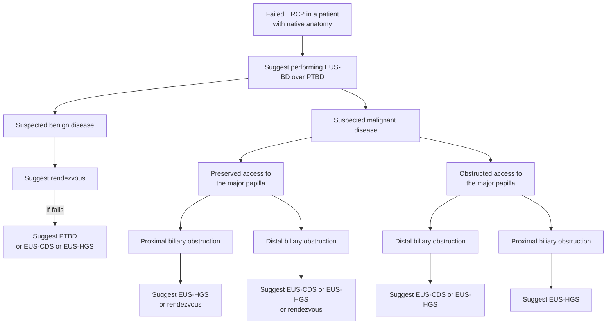
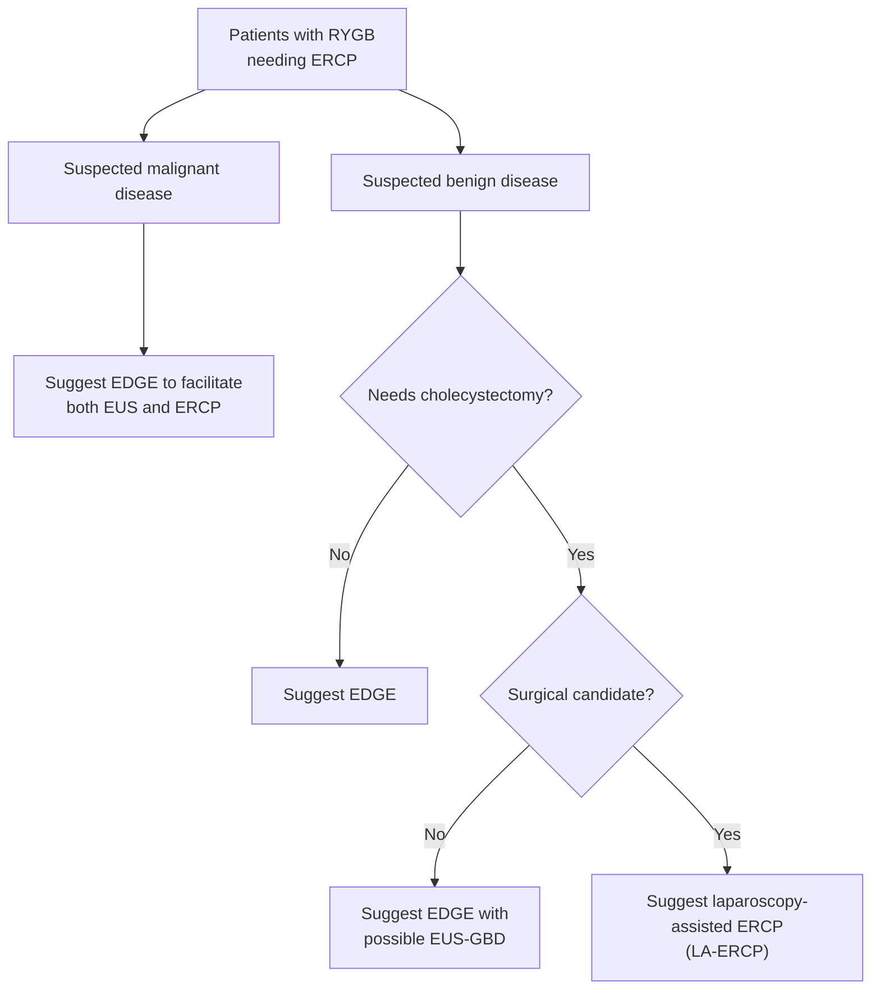

## Contents
- [[#Definition and Techniques]]
- [[#Indications and Contraindications]]
- [[#Route Selection]]
  - [[#Failed ERCP, Native Anatomy]]
  - [[#EUS-CDS vs EUS-HGS]]
  - [[#Surgically Altered Anatomy]]
  - [[#When PTBD or Surgery Is Preferred]]
- [[#ASGE 2024 Recommendations]]
- [[#Outcomes]]
- [[#Adverse Events]]
- [[#Devices, Stents, and Quality Benchmarks]]

## Definition and Techniques

**EUS-guided biliary drainage (EUS-BD)** — biliary drainage using [[endoscopic-ultrasound|endoscopic ultrasound (EUS)]] to puncture the intra- or extrahepatic ducts, accessing the obstructed tree from the gastrointestinal (GI) lumen (usually stomach or duodenum). Developed as the alternative to percutaneous transhepatic biliary drainage (PTBD) when [[ercp|endoscopic retrograde cholangiopancreatography (ERCP)]] fails or is not feasible — ERCP remains first-line, with cannulation rates >90%. ([[asge-2024-therapeutic-eus-biliary]])

Four EUS-BD techniques, plus two related access procedures:

| Technique | What is created | Access route |
|---|---|---|
| **EUS-guided rendezvous** | Duct punctured with a fine-needle aspiration (FNA) needle from the upper GI tract; guidewire passed through the needle into the duodenum; scope exchanged for the duodenoscope; cannulation reattempted over or alongside the EUS-placed guidewire | Transpapillary — **no transmural stent** |
| **EUS-guided choledochoduodenostomy (EUS-CDS)** | Stent connecting the extrahepatic bile duct to the duodenum | Transmural, extrahepatic |
| **EUS-guided hepaticogastrostomy (EUS-HGS)** | Stent connecting the liver / intrahepatic ducts to the stomach | Transmural, intrahepatic |
| **EUS-guided antegrade intervention** | Stent passed from the stomach (intrahepatic access) or duodenal bulb (extrahepatic access) **across** the stricture, draining via the ampullary orifice | Antegrade, transpapillary outflow |
| **EUS-directed transgastric ERCP (EDGE)** | Lumen-apposing metal stent (LAMS) placed between the gastric pouch (or jejunum) and the excluded stomach, so the duodenoscope can be advanced anterograde to the duodenum | Gastrogastrostomy / jejunogastrostomy, then conventional ERCP |
| **Endoscopic transpapillary transcystic gallbladder drainage (ET-GBD)** | Stent through the cystic duct into the gallbladder at ERCP | Transpapillary |

*Gallbladder drainage ([[eus-guided-gallbladder-drainage|EUS-guided gallbladder drainage, EUS-GBD]]) is a separate procedure with its own indications and recommendations.*

## Indications and Contraindications

**Indications** ([[acg-2025-eus-quality]]):
- Failed ERCP with an accessible ampulla.
- Inaccessible ampulla because of [[gastric-outlet-obstruction|gastric outlet obstruction (GOO)]].
- Ampulla difficult or impossible to reach after surgically altered anatomy.
- Failed ERCP here includes inability to achieve selective biliary cannulation **and** inability to reach the major papilla because of gastric or duodenal obstruction ([[asge-2024-therapeutic-eus-biliary]]).
- Also used when an enteral stent has been placed across the ampulla and subsequent ERCP fails ([[aga-2021-malignant-alimentary-tract-obstruction]]).

**Contraindications** ([[acg-2025-eus-quality]]):
- Tumor at the intended puncture site.
- Duct not visualized on EUS.
- Massive [[ascites|ascites]].
- Coagulopathy.
- Standard contraindications to endoscopy or [[endoscopy-sedation|sedation]].

**Before the procedure:**
- Transmural drainage for **benign** disease requires multidisciplinary input and patient counseling before proceeding ([[asge-2024-therapeutic-eus-biliary]]).
- Discuss drainage options with the surgical team first in anyone who may need future surgery — EUS-CDS can cause inflammation around the porta hepatis and complicate a later Whipple procedure.
- With ascites, consider percutaneous drainage of ascitic fluid **before or at the time of** EUS-BD or PTBD.
- Consent: discuss EUS-specific adverse events (AEs) and, where relevant, the possibility of pivoting to an EUS-guided salvage approach after a failed ERCP and its risks ([[acg-2025-eus-quality]]).
- Give intravenous broad-spectrum [[antibiotic-prophylaxis-endoscopy|antibiotic prophylaxis]] — ACG/ASGE 2025 says to strongly consider it for all interventional EUS, including EUS-BD.
- Refer to a higher-volume biliary endoscopist after a failed cannulation rather than escalating locally; EUS-BD and these altered-anatomy procedures are technically complex and may be best managed at tertiary referral centers.

## Route Selection

### Failed ERCP, Native Anatomy

Two inputs pick the route: **benign vs malignant** aetiology, then **access to the major papilla** (preserved vs obstructed) and **level of obstruction** (proximal vs distal).

*Figure 1 — Approach to biliary drainage after failed ERCP. In benign disease, the decision to pursue transmural EUS-BD follows multidisciplinary evaluation and counseling. Factors to weigh before intervening: patient age, comorbidities, prior adverse events from percutaneous drains, location of the gastric outlet obstruction, hemodynamic instability, and presence of ascites. Consider EUS-GBD if the biliary obstruction is clearly occurring below the cystic duct insertion. ([[asge-2024-therapeutic-eus-biliary]])*

- **Rendezvous is the preferred EUS-BD technique in suspected benign disease** — it leaves no transmural tract. Transmural drainage (EUS-CDS/EUS-HGS) or PTBD is the fallback if rendezvous fails.
- **Malignant disease with preserved papillary access** keeps rendezvous on the table at either obstruction level; **obstructed papillary access** removes it, leaving transmural drainage only.
- **Proximal (hilar) obstruction → EUS-HGS**, at either access state — EUS-CDS drains the extrahepatic duct below a hilar block and will not decompress it.

### EUS-CDS vs EUS-HGS

For **distal malignant biliary obstruction after failed ERCP, either route is acceptable** — technical success, clinical success, AEs, and reintervention did not differ. Anatomy and future-surgery plans decide ([[asge-2024-therapeutic-eus-biliary]]):

| Pick **EUS-CDS** when | Pick **EUS-HGS** when |
|---|---|
| Cancerous involvement of the **stomach** compromises the puncture sites for EUS-HGS | Cancerous involvement of the **duodenum** compromises the puncture sites for EUS-CDS |
| Interfering **vasculature** compromises the puncture sites for EUS-HGS | A **pre-existing enteral stent** interferes with EUS-CDS |
| — | **Gastric outlet obstruction proximal to the pylorus** is present |
| — | A **proximal/hilar** biliary obstruction is present |
| — | Surgery is planned and the **surgeon prefers not to use the duodenum** |

- **Device availability tilts US practice toward EUS-CDS.** Cautery-enhanced LAMS and smaller-caliber LAMS make EUS-CDS technically easier as a single-step procedure; no such dedicated device is currently available in the United States for EUS-HGS, so US endoscopists may be more comfortable with EUS-CDS.
- **Future Whipple is the counterargument to EUS-CDS** — it can inflame the porta hepatis and complicate later surgery there. Discuss with the surgical team before proceeding.
- ASGE 2024 gives no intrahepatic duct-diameter threshold for attempting EUS-HGS; it directs the operator to review cross-sectional imaging for dilated left hepatic ducts before choosing the approach.

### Surgically Altered Anatomy

*The anatomy, not the lesion, picks the first move.*

**Roux-en-Y gastric bypass (RYGB) — EDGE first.**

*Figure 2 — Approach to biliary drainage in patients with RYGB. ([[asge-2024-therapeutic-eus-biliary]])*

- **EDGE is favored over enteroscopy-assisted ERCP (E-ERCP) and LA-ERCP** — superior to E-ERCP on every outcome, equivalent to LA-ERCP with better patient values and cost-effectiveness.
- **EDGE specifically preferred** for a suspected ampullary lesion, malignant disease, or when repeat ERCP is anticipated (repeat interventions are easy through a matured tract).
- **LA-ERCP preferred when surgery is needed in the near future** (e.g., [[acute-cholecystitis|cholecystectomy]]) — everything can be combined under one anesthetic.
- **No safe EDGE window found** → either LA-ERCP or E-ERCP is reasonable.
- Weight regain through a persistent fistula is not a significant concern in this population: patients lost 6.3 lb at 52 weeks and 6.6 lb at 28 weeks after EDGE in two studies, and only 9% had a persistent fistula at a mean of 182 days.

**Non–gastric-bypass altered anatomy** (prior Roux-en-Y hepaticojejunostomy, pancreaticoduodenectomy, or Billroth II reconstruction):

- **E-ERCP is the initial approach**, despite lower technical and clinical success than EUS-BD, because its AE rate is lower and it succeeds in patients with shorter pancreaticobiliary limbs.
- **If E-ERCP fails → EUS-BD or PTBD** (comparable outcomes between the two).
- **Review the operative report to identify the Roux-limb length** before choosing, if feasible, and review imaging for dilated left hepatic ducts.

### When PTBD or Surgery Is Preferred

PTBD is preferred over EUS-BD when ([[asge-2024-therapeutic-eus-biliary]]):

- Patient is **hemodynamically unstable**.
- Patient **cannot tolerate general anesthesia**.
- **Malignancy is the suspected cause** of the obstruction.
- **EUS-BD expertise or training is not available** — where interventional EUS personnel are unavailable, radiologically guided percutaneous intervention remains the appropriate option.

ASGE 2024 does not compare EUS-BD with **surgical biliary bypass** and makes no recommendation about it; it advises discussing drainage options with the surgical team before attempting EUS-BD in anyone who may require surgical intervention later.

For perihilar strictures specifically, ACG 2023 found **insufficient evidence to recommend ERCP over PTBD** for drainage of a suspected malignant perihilar stricture — individualize ([[acg-2023-biliary-strictures]]).

## ASGE 2024 Recommendations

Numbering is the document's own. Developed with the Grading of Recommendations Assessment, Development and Evaluation (GRADE) framework; **every recommendation in the document is conditional** — "we suggest," not "we recommend."

| # | Recommendation | Strength | Quality of evidence |
|---|---|---|---|
| 1 | Biliary obstruction + failed ERCP → **EUS-BD over percutaneous biliary drainage** to resolve biliary obstruction | Conditional recommendation | Low |
| 2 | Distal malignant biliary obstruction + failed ERCP → **either EUS-HGS or EUS-CDS** should be performed to resolve biliary obstruction | Conditional recommendation | Low |
| 3 | RYGB surgery needing biliary drainage → **EDGE over E-ERCP or LA-ERCP** in resolving biliary obstruction | Conditional recommendation | Low *(table)* / very low *(recommendation box)* |
| 4 | Biliary obstruction + non–gastric-bypass surgically altered anatomy (prior Roux-en-Y hepaticojejunostomy, pancreaticoduodenectomy, or Billroth II reconstruction) → **E-ERCP as the initial approach**; if unsuccessful → **EUS-BD or percutaneous biliary drainage** | Conditional recommendation | Very low *(table)* / low *(recommendation box)* |
| 5a | Nonsurgical candidates with [[acute-cholecystitis|acute cholecystitis]] → **EUS-GBD over percutaneous gallbladder drainage (PT-GBD)** | Conditional recommendation | Moderate |
| 5b | Patients with acute cholecystitis who cannot undergo cholecystectomy → **EUS-GBD over ET-GBD** | Conditional recommendation | Very low |

- ASGE 2024's summary table and its recommendation boxes give **different certainty ratings for Recommendations 3 and 4**; both are shown above.
- Recommendations 5a and 5b govern gallbladder drainage — criteria for choosing EUS-GBD vs PT-GBD vs ET-GBD are on [[eus-guided-gallbladder-drainage]].
- **What is new:** the document positions EUS-BD over PTBD after failed ERCP; EUS-CDS or EUS-HGS after failed ERCP in distal malignant obstruction; EDGE over LA-ERCP or E-ERCP in RYGB; E-ERCP before EUS-BD or PTBD in non-RYGB altered anatomy; and EUS-GBD over PT-GBD or ET-GBD when cholecystectomy is not an option.
- ASGE guidelines are reviewed for update approximately every 5 years, or sooner if new data may change a recommendation.

## Outcomes

**EUS-BD vs PTBD after failed ERCP, native anatomy** — 13 studies (2 randomized controlled trials [RCTs], 11 observational), 379 EUS-BD vs 376 PTBD ([[asge-2024-therapeutic-eus-biliary]]):

| Outcome | Result (odds ratio [OR], 95% confidence interval [CI]) |
|---|---|
| Technical success | No difference — OR 1.39 (0.55–3.48) |
| Clinical success | Higher with EUS-BD in 10 observational studies — OR 2.53 (1.22–5.28); **no difference in the 2 RCTs** — OR 0.86 (0.24–3.17) |
| Adverse events | Lower with EUS-BD — 2 RCTs OR 0.29 (0.09–0.91); 10 observational OR 0.26 (0.12–0.56) |
| Need for reintervention | Less frequent with EUS-BD — RCTs OR 0.27 (0.09–0.78); observational OR 0.07 (0.04–0.14) |
| 30-day mortality | No difference — OR 0.34 (0.09–1.19) |
| Length of stay | Shorter with EUS-BD — 11.54 vs 15.68 days (*P* < .05, one observational study) |

- **Cost:** the RCT found no significant difference ($5673 vs $7570, *P* = .39), but 4 observational studies found EUS-BD less costly ($1440.15 vs $2165.87; $3439 vs $4798; $5439 vs $9987; index procedure + reinterventions $9072 vs $18,261).
- Evidence came largely from high-volume tertiary centers — expect lower success outside them.

**EUS-CDS vs EUS-HGS in distal malignant obstruction** — 13 studies (2 RCTs, 11 observational), 281 EUS-CDS vs 267 EUS-HGS: **no significant difference** in technical success (OR 1.35; 0.56–3.29), clinical success (OR 1.31; 0.63–2.72), AEs (OR 0.76; 0.35–1.63), or reintervention (OR 1.83; 0.86–3.87). No cost or cost-effectiveness studies were identified.

**EDGE vs LA-ERCP vs E-ERCP in RYGB** — 4 observational studies, no RCTs; 176 EDGE, 396 LA-ERCP, 172 E-ERCP:

- **EDGE vs E-ERCP:** technical success OR 28.01 (5.17–151.6); clinical success OR 26.30 (1.52–453.0); fewer AEs OR 0.32 (0.11–0.93); fewer reinterventions OR 0.05 (0.01–0.35); procedure 34.4 minutes shorter (17.5–51.3).
- **EDGE vs LA-ERCP:** no difference in technical success (OR 1.09; 0.01–5.55), clinical success (OR 0.90; 0.11–7.53), or AEs (OR 0.62; 0.17–2.29); procedure 95.1 minutes shorter (63.8–126.5).
- **Direct cost:** LA-ERCP $20,000 vs EDGE $11,300 vs E-ERCP $13,000; EDGE was cost-saving with higher effectiveness.

**Non-RYGB altered anatomy** — 15 observational studies, no RCTs; 299 EUS-BD, 92 E-ERCP, 89 PTBD:

- **EUS-BD vs E-ERCP:** better technical success OR 5.56 (1.04–9.16) and clinical success OR 4.08 (1.82–9.16), but **higher AEs** OR 3.24 (1.33–7.90) — mostly mild-to-moderate events related to EUS-guided antegrade interventions, including advancing a peroral [[cholangioscopy|cholangioscope]] through an EUS-HGS tract.
- **EUS-BD vs PTBD:** similar — technical success 92.9% vs 87.6% (*P* = .26); clinical success 87.6% vs 80.8% (*P* = .44); reintervention 18.8% vs 29% (*P* = .63); AEs 18.8% vs 29% (*P* = .11).

## Adverse Events

**Rates** ([[acg-2025-eus-quality]]):

| Adverse event | Rate after EUS-BD |
|---|---|
| Overall AEs | 3%–39% (quality-indicator ceiling **<25%**) |
| Bile leak — **most common** | 3.5%–4.9% |
| Bleeding | ~4% |
| Biloma | 0.6% |
| Perforation | <1% |
| Mortality | 0.5% |

- **Stent misdeployment with perforation** is the dominant AE of LAMS-based transluminal procedures (~10% for EUS-guided gastroenterostomy and EDGE). Management where the distal flange sits in the peritoneum without an enterotomy — and often where there is one — is **stent removal plus closure**; keep the patient fasted for **≥24 hours** after such an event.
- **Minimize capnoperitoneum** with minimal dilating force and carbon dioxide insufflation.
- **Bleeding after LAMS placement** rises with prolonged dwell (~7% cumulative in pancreatic fluid collection drainage, associated with dwell >4 weeks).
- Earlier guidance notes EUS-BD carries real risk including **fatalities**, particularly early in the learning curve, and demands substantial endoscopist experience ([[acg-2023-biliary-strictures]]).
- Known downsides of the percutaneous alternative that EUS-BD avoids: external drain discomfort, and hospitalization for drains that become dislodged, blocked, or kinked.
- **Actively contact patients about AEs**, ideally 2 weeks after the procedure — 15%–45% of AEs otherwise go unrecognized or unreported ([[acg-2025-eus-quality]]).

## Devices, Stents, and Quality Benchmarks

- **Cautery-enhanced LAMS** and smaller-caliber LAMS have made EUS-CDS a single-step procedure; the lack of a comparable dedicated device for EUS-HGS in the United States is a practical driver of route choice.
- **LAMS dwell time after EDGE drives fistula persistence:** dwell **≥40 days** carried an odds ratio of **4.5** for a persistent fistula, with an added **9.5% per extra 7 days** ([[acg-2025-eus-quality]]). ASGE 2024 lists whether LAMS placed for EUS-GBD need removal, when, and whether they should be exchanged for double-pigtail plastic stents as an **unanswered question for future study** — it gives no dwell or exchange interval for EUS-BD stents, and no stent diameter or length specifications for any EUS-BD route.
- ASGE 2024 also encourages manufacturers to develop dedicated **single-step stent delivery systems** for transluminal drainage and devices to steer guidewires for antegrade and rendezvous procedures.

**ACG/ASGE 2025 quality targets** ([[acg-2025-eus-quality]]):

| Indicator | Grade | Target |
|---|---|---|
| Technical success of EUS-BD | 1B | >85% |
| Technical success of EDGE | 1C | >92% |
| Technical success of [[eus-guided-gallbladder-drainage\|EUS-GBD]] | 2B | >90% |
| Overall AEs, EUS-BD | 2C | <25% |
| Overall AEs, EDGE | 2C | <15% |

- Published EUS-BD technical and clinical success is **90%–96%** and AEs 8%–27%; the >85% target is set deliberately below published rates because the literature comes from expert centers.
- EDGE technical success in published series is 96%–99%.

## See Also

[[ercp]], [[endoscopic-ultrasound]], [[eus-guided-gallbladder-drainage]], [[biliary-stricture]], [[cholangiocarcinoma]], [[pancreatic-cancer]], [[choledocholithiasis]], [[acute-cholangitis]], [[gastric-outlet-obstruction]], [[acute-cholecystitis]], [[cholangioscopy]], [[bariatric-surgery]], [[pancreatic-fluid-collection-drainage]], [[antibiotic-prophylaxis-endoscopy]], [[ascites]], [[jaundice]]

---

## Sources

1. [[asge-2024-therapeutic-eus-biliary|ASGE Guideline: Role of Therapeutic EUS in Biliary Tract Disorders (2024)]]
2. [[acg-2025-eus-quality|ACG/ASGE 2025: Quality Indicators for EUS]]
3. [[acg-2023-biliary-strictures|ACG 2023: Diagnosis and Management of Biliary Strictures]]
4. [[aga-2021-malignant-alimentary-tract-obstruction|AGA Clinical Practice Update: Endoscopic Management of Malignant Alimentary Tract Obstruction (2021)]]
