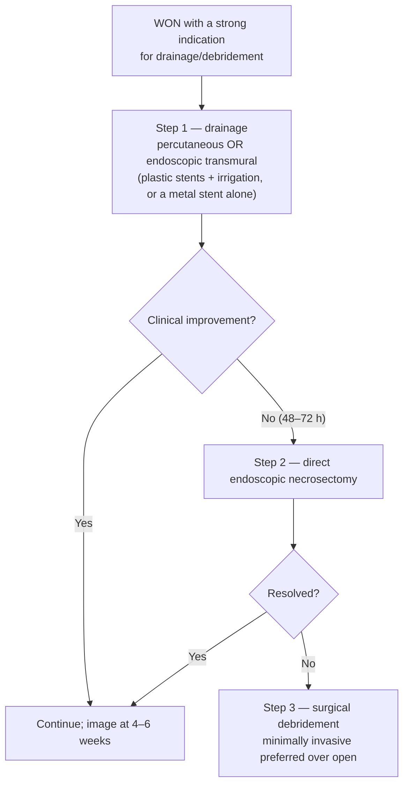

# Pancreatic Fluid Collection Drainage (Pseudocyst and WON)

Endoscopic decompression of an inflammatory **pancreatic fluid collection (PFC)** — a pseudocyst or **walled-off necrosis (WON)** — by creating a tract from the stomach or duodenum into the collection under [[endoscopic-ultrasound|endoscopic ultrasound (EUS)]] guidance (transmural), or by stenting the leak through the papilla (transpapillary). Where solid debris persists, drainage is escalated to **direct endoscopic necrosectomy (DEN)**. Inflammatory PFCs arise after acute and chronic pancreatitis, pancreatic trauma, and pancreatic surgery. ([[asge-2016-pancreatic-fluid-collections]])

**The collection type picks the technique** — a pseudocyst holds amylase-rich fluid with essentially no solid debris and often resolves with two plastic stents; WON holds solid necrosis that must be evacuated, needs a large-bore transmural route, and has lower success and higher adverse-event rates. Disease-level management of necrotizing pancreatitis (antibiotics, nutrition, severity grading) lives on [[acute-pancreatitis|acute pancreatitis]].

## Contents
- [[#Collection Types (Revised Atlanta)]]
- [[#Indications for Drainage]]
  - [[#Timing and Wall Maturation]]
  - [[#Recognizing Infected Necrosis]]
- [[#Before the Procedure]]
- [[#Step-Up Approach]]
- [[#Choosing the Route]]
  - [[#Transmural vs Transpapillary]]
  - [[#Endoscopic vs Percutaneous]]
- [[#Stent Selection and Dwell Time]]
- [[#Direct Endoscopic Necrosectomy]]
- [[#After the Procedure]]
- [[#Disconnected Pancreatic Duct]]
- [[#Adverse Events]]
- [[#Outcomes]]
- [[#Graded Recommendations (ASGE 2016)]]

## Collection Types (Revised Atlanta)

The Atlanta classification of [[acute-pancreatitis|acute pancreatitis (AP)]] was revised in 2012; inflammatory PFCs are categorized into four entities. The split that matters at the scope is **fluid only vs fluid + solid necrosis**, and **wall vs no wall**. ([[asge-2016-pancreatic-fluid-collections]], ASGE Table 2)

| Term | Definition | Contrast-enhanced CT findings |
|---|---|---|
| **Acute peripancreatic fluid collection (peri-PFC)** | Peripancreatic fluid associated with **interstitial edematous** pancreatitis, **no** associated peripancreatic necrosis. Term applies only within the **first 4 weeks** after onset, and without the features of a pseudocyst | Homogeneous, fluid density · confined by normal peripancreatic fascial planes · **no definable wall** · adjacent to the pancreas (no intrapancreatic extension) |
| **Pancreatic pseudocyst** | Encapsulated collection of fluid with a **well-defined inflammatory wall**, usually outside the pancreas, with **minimal or no necrosis**. Usually requires **>4 weeks** after onset of interstitial edematous pancreatitis to mature | Well circumscribed, round/oval, homogeneous fluid density · **no non-liquid component** · well-defined, completely encapsulated wall · occurs after interstitial edematous pancreatitis |
| **Acute necrotic collection (ANC)** | Collection containing **variable amounts of both fluid and necrosis** associated with necrotizing pancreatitis; necrosis can involve the pancreatic parenchyma and/or the peripancreatic tissues | Only in acute necrotizing pancreatitis · heterogeneous, non-liquid density varying by location · **no definable wall** · intrapancreatic and/or extrapancreatic |
| **Walled-off necrosis (WON)** | **Mature, encapsulated** collection of pancreatic and/or peripancreatic necrosis that has developed a **well-defined inflammatory wall**. Usually **>4 weeks** after onset of necrotizing pancreatitis | Heterogeneous, liquid and non-liquid density, varying loculation · well-defined, completely encapsulated wall · intrapancreatic and/or extrapancreatic · maturation usually ~4 weeks after onset of acute necrotizing pancreatitis |

**Distinguishing them in practice:**
- Acute peri-PFCs occur early, rarely become infected, and **typically resolve spontaneously**.
- ANCs contain necrotic tissue, are often associated with main pancreatic duct disruption, and are **more likely to become infected**. The distinction between an ANC and an acute peri-PFC typically becomes clear **after 1 week**.
- Pseudocysts may also arise from necrotizing pancreatitis when necrosis of the neck and body isolates a still-viable segment of tail parenchyma — a **disconnected duct** (see [[#Disconnected Pancreatic Duct]]). Pseudocysts contain amylase-rich fluid, essentially no solid debris, and a well-defined non-epithelialized wall.
- WON may be **multiple**, may become infected, and may sit **some distance from the pancreas**.
- **Imaging choice:** contrast-enhanced computed tomography (CT) is used initially, but **magnetic resonance imaging (MRI) and magnetic resonance cholangiopancreatography (MRCP) may be superior to CT for detecting debris within a collection** — i.e. for separating pseudocyst from WON — and for assessing integrity of the main pancreatic duct. EUS may also aid characterization.
- Roughly **20%** of patients with AP develop necrosis, with secondary infection in **30%** of those.

## Indications for Drainage

**Most acute PFCs resolve spontaneously and require no intervention.** Drain to treat the symptoms the collection is causing, or to resolve an infected or enlarging collection. ([[asge-2016-pancreatic-fluid-collections]])

| Scenario | Drain? |
|---|---|
| **Symptomatic pancreatic pseudocyst** | **Yes** — recommended |
| **Rapidly enlarging pancreatic pseudocyst** | **Yes** — suggested |
| **Infected PFC failing conservative management alone** | **Yes** — recommended for all |
| **Symptomatic sterile necrosis lasting >8 weeks after onset of AP** | **Yes** — recommended |
| **Sterile WON causing gastric outlet or biliary obstruction** | **Yes** — this complication may appear within **4–8 weeks** of onset |
| **Sterile WON with refractory abdominal pain, ongoing systemic illness, anorexia, or weight loss >8 weeks after onset** | **Yes** |
| **Acute peri-PFC or ANC** | **Generally no** — recent onset (<4 weeks) and no mature wall; these typically do not undergo endoscopic intervention |
| **Large pseudocyst, asymptomatic** | **No — size alone is not an indication.** Pseudocysts **>6 cm** tend to be symptomatic, but the symptom, not the diameter, drives drainage |
| **Infected PFC, patient stable on antibiotics** | **May be followed clinically** rather than drained immediately |

- **No minimum collection size for drainage is specified** by [[asge-2016-pancreatic-fluid-collections]].
- Drainage/debridement is likewise indicated for **infected** pancreatic necrosis, and **may** be required in **sterile** necrosis with persistent unwellness (abdominal pain, nausea, vomiting, nutritional failure) or with associated complications: **gastrointestinal luminal obstruction, biliary obstruction, [[recurrent-acute-pancreatitis|recurrent acute pancreatitis]], fistulas, or persistent systemic inflammatory response syndrome (SIRS)** ([[aga-2020-cpu-pancreatic-necrosis]] Best Practice Advice [BPA] 5 — this is an American Gastroenterological Association [AGA] expert review and its BPA statements carry **no Grading of Recommendations Assessment, Development and Evaluation [GRADE] strength or evidence quality**).
- Many patients with sterile necrosis — and selected patients with infected necrosis — improve without any intervention ([[acg-2024-acute-pancreatitis]]).

### Timing and Wall Maturation

**The ~4-week rule, with its qualifier:** wait for the cyst wall to mature before endoscopic intervention. Drainage, if required, should be undertaken **after 4 weeks** to allow encapsulation and better definition of the collection's margins, and potentially to reduce adverse events. ([[asge-2016-pancreatic-fluid-collections]])

- **Delay any intervention — surgical, radiologic, or endoscopic — in stable patients, preferably 4 weeks**, to let the wall mature ([[acg-2024-acute-pancreatitis]] Key concept 23). Antibiotics in infected necrosis are used **largely to delay drainage beyond 4 weeks**; some patients avoid drainage altogether because the infection resolves (Key concept 16).
- **Hard floor at 2 weeks:** avoid debridement in the **first 2 weeks** — associated with increased morbidity and mortality. Optimally delay to **4 weeks**; perform earlier **only when there is an organized collection *and* a strong indication** — both, not either ([[aga-2020-cpu-pancreatic-necrosis]] BPA 6).
- **What the 4-week figure rests on:** it is an extrapolation from the surgical literature. Endoscopic step-up therapy and DEN starting at **<4 weeks** are clinically possible when indicated; patients who **could** clinically wait ≥4 weeks before endoscopic intervention had decreased mortality — which is at least partly a marker of how ill they were.
- Mortality fell as the interval from hospital admission to intervention lengthened in a study of 242 patients: **0–14 days 56% · 14–29 days 26% · >29 days 15%** (P<.001).

### Recognizing Infected Necrosis

- Infected necrosis is **not initially distinguishable from sterile necrosis clinically**, but usually becomes apparent **2 to 4 weeks after onset**, when the incidence of infected necrosis peaks.
- **Signs:** new-onset or persistent sepsis · clinical deterioration despite adequate support · no alternative source of infection · **gas bubbles within the PFC on radiologic imaging**.
- **Do not aspirate to prove it.** Routine fine-needle aspiration (FNA) is **not required** to diagnose infected necrosis: high false-negative rate, and the diagnostic puncture may **contaminate a previously sterile collection**. Intervening on clinical suspicion alone was accurate in **>90%** of cases in one study. [[acg-2024-acute-pancreatitis]] (Rec 9, conditional, very low quality) goes further and suggests **against** FNA in suspected infected pancreatic necrosis.

## Before the Procedure

**Prove it is an inflammatory collection first — Rec 1 is graded high quality.** Contrast-enhanced CT, MRI/MRCP, or EUS should be obtained before drainage to confirm the collection is **not a cystic pancreatic neoplasm, pseudoaneurysm, duplication cyst, or other noninflammatory fluid collection**. ([[asge-2016-pancreatic-fluid-collections]])

| Step | Detail |
|---|---|
| **Exclude the mimics** | Cystic neoplasm, pseudoaneurysm, duplication cyst — cross-sectional imaging or EUS (see [[pancreatic-cysts]]) |
| **[[ercp\|Endoscopic retrograde cholangiopancreatography (ERCP)]] beforehand?** | **Pseudocyst:** may be considered before percutaneous, transmural or surgical drainage to define anatomy and guide therapy — **not necessary in most patients** when high-quality cross-sectional imaging is available. Done preoperatively, perform it **shortly before surgery** to minimize infecting the collection. **WON: not typically used** — transmural drainage is the standard initial endoscopic approach |
| **Antithrombotics** | Anticoagulants and antiplatelets **other than aspirin** ideally stopped before endoscopy — drainage and necrosectomy carry **acute and delayed bleeding** risk |
| **Backup on site** | Surgical **and** interventional radiology (IR) support available for severe bleeding or perforation — a graded recommendation (Rec 11, high quality), not a courtesy |
| **Sedation** | Deep sedation or general anesthesia, given procedural complexity |
| **Insufflation** | **Carbon dioxide**, to minimize gas embolism (Rec 12, low quality) |
| **Antibiotics** | Typically given, **especially for suspected WON** |

## Step-Up Approach

**Least invasive first; escalate only on failure.** Drainage precedes debridement, and debridement precedes surgery ([[aga-2020-cpu-pancreatic-necrosis]] BPA 15; [[asge-2016-pancreatic-fluid-collections]] Rec 10, moderate quality).

- Escalation trigger inside step 1: **no clinical improvement within 48–72 hours** of nasocystic lavage plus transmural drainage ([[asge-2016-pancreatic-fluid-collections]]).
- The original step-up trial sequence (percutaneous drainage → minimally invasive retroperitoneal necrosectomy → open necrosectomy) reduced morbidity and mortality vs primary open necrosectomy, confirmed at long-term follow-up.
- Disease-level sequencing, antibiotic choice and the surgical menu (video-assisted retroperitoneal debridement [VARD], transgastric and open debridement) live on [[acute-pancreatitis]].

## Choosing the Route

Four factors decide the approach for a pseudocyst ([[asge-2016-pancreatic-fluid-collections]]):

1. **Anatomic relationship** of the collection to the stomach or duodenum
2. **Ductal communication** with the pseudocyst
3. **Cyst contents** (fluid vs solid debris)
4. **Size** of the collection

### Transmural vs Transpapillary

| | **Transmural** | **Transpapillary** |
|---|---|---|
| **Technique** | Tract through the gastric or duodenal wall → balloon dilation → ≥1 stents. Collections at the pancreatic **head → transduodenal**; others **→ transgastric** (most common, and the most direct access if necrosectomy follows) | Pancreatic endoprosthesis ± pancreatic sphincterotomy at ERCP. Proximal (tail-side) end placed **into the collection** or **across the duct disruption** to divert secretions |
| **Best for** | Any pseudocyst; **the only option for WON** (solid debris must be evacuated) | Pseudocyst **communicating with the main pancreatic duct**; duct disruption |
| **Key technical rule** | — | **Complete bridging of the leak is the best approach** — and achieves higher resolution for **body and tail** collections than for the head |
| **Advantages** | Handles debris; large-bore access | **Lower bleeding and perforation risk** than transmural; identifies intraductal stones and strictures needing treatment for long-term resolution |
| **Disadvantages** | Bleeding, perforation | Post-ERCP pancreatitis; stent-induced **scarring of the main pancreatic duct**; infection of the collection; **cannot adequately drain large cysts** |

- **Does adding a transpapillary stent to transmural drainage help?** The evidence is split and the page does not resolve it: a retrospective single-center study found **higher clinical success** when transpapillary stents were added to treat duct disruption; another found the benefit **limited to partial duct disruptions, with none in complete disruptions**; and a large multicenter study found **comparable resolution rates** for transmural + transpapillary vs transmural alone.

### Endoscopic vs Percutaneous

- **Both percutaneous and transmural endoscopic drainage are appropriate first-line non-surgical approaches for WON. Endoscopic may be preferred — it avoids a pancreatocutaneous fistula** ([[aga-2020-cpu-pancreatic-necrosis]] BPA 7; fistula **32%** after percutaneous/VARD vs **5%** endoscopic, P<.01).
- **Choose percutaneous first** for infected or symptomatic necrotic collections in the **early acute period (<2 weeks)**, and for WON in a patient **too ill** for endoscopy or surgery (BPA 8).
- **Add percutaneous to endoscopic** when WON extends **deep into the paracolic gutters or pelvis** (dependent portions will not drain through a superiorly placed transmural stent), or as **salvage** after endoscopic/surgical debridement leaves residual necrosis (BPA 8).
- **Drain caliber:** series used **8F–24F**; choose **≥24F if VARD is anticipated** — the tract becomes the entry portal and a larger drain reduces the dissection needed.
- **Dual endoscopic + radiologic drainage:** in one study (median follow-up 750 days) surgical necrosectomy was avoided in **all 103 patients** who completed treatment, with no pancreaticocutaneous fistulae and no procedure-related deaths.
- **Endoscopic drainage preferred over surgery as *initial* therapy for pseudocysts** ([[asge-2016-pancreatic-fluid-collections]] Rec 8, moderate quality).

**When EUS guidance is required rather than optional** — Rec 9 (high quality): use EUS for transmural drainage **in the absence of a luminal bulge** or when **[[portal-hypertension|portal hypertension]] is suspected**. Also preferred for an unusual collection location, documented intervening varices, or a prior failed direct endoscopic approach. Where an endoscopically visible indentation exists and there is no portal hypertension, direct endoscopic and EUS-assisted drainage were **equivalent**.

## Stent Selection and Dwell Time

| Stent | What it is and when it is used |
|---|---|
| **Two double-pigtail plastic stents** | The traditional transmural construct for an **uncomplicated pseudocyst**. **Neither diameter nor number of plastic stents** is associated with the number of interventions needed for resolution of an uncomplicated pseudocyst |
| **Plastic stents + nasocystic drain** | Traditional **WON** construct — the lavage catheter evacuates necrotic debris and improves success. Retrospective data in **debris-containing pseudocysts** show better short- and long-term success than transmural stents alone |
| **Fully covered self-expandable metal stent (SEMS)** | One stent instead of two → shorter, simpler procedure; **lumen ≥10 mm** gives faster drainage, less occlusion, and lets a gastroscope re-enter the cavity. **Large-diameter SEMS = 15 mm** for necrosis. **Migration risk** → some anchor a plastic double-pigtail stent inside the covered SEMS |
| **Lumen-apposing metal stent (LAMS)** | Broad anchoring flanges + large inner diameter → **no anchoring stent needed** and through-the-stent necrosectomy is easy. **Length ~1 cm**, vs covered esophageal SEMS which are **no shorter than 6–7 cm**. Cautery-enhanced delivery avoids tract dilation and shortens the procedure. Some place **double-pigtail plastic stents through the LAMS** to limit early occlusion by debris and LAMS migration |

- **Metal is not proven better for pseudocysts.** [[asge-2016-pancreatic-fluid-collections]]: **no clear data support SEMS superiority over plastic stents** for PFC resolution, and SEMS adds direct procedure cost. [[aga-2020-cpu-pancreatic-necrosis]] BPA 9 states LAMS "appear to be superior to plastic stents" **for necrosis** — but the same document's text notes a randomized trial that **did not show superiority**. Treat BPA 9 as expert opinion.
- **Dwell time:** plastic stents may stay until the collection resolves on cross-sectional imaging, and **potentially indefinitely** where the main pancreatic duct is disrupted. **Do not leave a LAMS or any SEMS long-term — delayed bleeding** is the concern beyond several weeks.

## Direct Endoscopic Necrosectomy

**What it is:** passing the endoscope **into the cavity** through the transmural tract and mechanically removing necrosis with grasping forceps, polypectomy snares, or retrieval nets.

- **Indication — escalation, not first-line.** Reserve DEN for **limited necrosis that does not respond adequately** to transmural drainage with large-bore SEMS/LAMS alone, or plastic stents plus irrigation. It is also an option for **large amounts of infected necrosis** — but only **at referral centers** with the endoscopic expertise plus IR and surgical backup ([[aga-2020-cpu-pancreatic-necrosis]] BPA 10).
- **Session interval:** multiple debridements, typically **every 48–72 hours**, may be needed to clear all necrotic debris.
- **Risks specific to DEN: air embolism, intracavitary bleeding, perforation.**
- **Unsettled:** whether to perform DEN **up front** at stent placement or on failure of drainage, and whether sessions should be **scheduled or on-demand**. Preliminary single-center data suggest DEN at initial drainage may raise resolution rates and reduce length of stay and health care utilization vs step-up; a recent study found an **18 mm** fully covered esophageal SEMS could treat WON in a **single procedure without necrosectomy**.
- **Multiple transluminal gateway technique (MTGT)** — 2–3 separate transmural tracts, one for nasocystic lavage and stents in the others: clinical success **91.7% vs 52.1%** (P=.01) vs conventional single-tract drainage in 60 patients with WON.
- **Adjunctive irrigation is not established.** Two small case series used **hydrogen peroxide (100–500 mL of 3% solution at 1:5–1:10 dilution)** to dislodge debris; antibiotic lavage and peroxide have **no comparative trials vs placebo and cannot be routinely recommended** ([[aga-2020-cpu-pancreatic-necrosis]]).
- Avoiding acid suppression after transmural drainage (on the theory that gastric acid auto-debrides) is a practice some experienced endoscopists recommend, but **data are lacking**.

## After the Procedure

- **Disposition:** after uncomplicated drainage of a **non-infected pseudocyst**, most patients **do not require hospitalization**.
- **Antibiotic prophylaxis** is usually prescribed after drainage.
- **Imaging:** follow-up CT typically at **4–6 weeks** to assess resolution.
- **Stent removal:** internal stents are removed endoscopically **once radiographic resolution is documented**. Some advocate delaying removal to promote resolution of duct disruptions.
- **Treat the duct, not just the collection:** in [[chronic-pancreatitis|chronic pancreatitis]] patients drained transmurally, **endoscopic therapy of any related pancreatic duct obstruction** should be performed to reduce recurrence.
- **Long-term indwelling transmural stents reduce recurrence in the right patient.** Two studies (33 and 30 patients) of long-term transmural stents found **1 recurrence** over median/mean follow-up of 14 and 20 months — and that recurrence followed spontaneous stent migration. Indicated for **disconnected duct syndrome or duct disruption** at high risk of recurrence.

## Disconnected Pancreatic Duct

Necrosis of the neck/body can sever continuity between the upstream (tail-side) duct and the gastrointestinal lumen, leaving a viable but disconnected remnant that secretes into a persistent collection.

- **Endoscopic transmural drainage beats transpapillary drainage here:** success **>90%** vs **~55%** ([[uspg-2025-disconnected-pancreatic-duct]]).
- **Leave the stents in.** At least **2 double-pigtail plastic stents in the residual cavity** is the position of the 2025 consensus, and where multiple plastic stents were placed initially they **can remain indefinitely** if drainage was successful. Long-term indwelling transmural stents reduce recurrence after main-duct disruption in the body/tail.
- ⚠ **Conflicts with the older [[aga-2020-cpu-pancreatic-necrosis]] BPA 14**, which calls transmural stenting only **temporizing**, makes **distal pancreatectomy** the definitive management in operative candidates, and finds insufficient evidence for long-term transenteric stenting. **USPG 2025 is the same tier and newer, so the long-term-stent strategy is what this page asserts**; the surgical option is not withdrawn, only narrowed.
- Definitions, diagnostic criteria, imaging sequence and the full stent strategy live on [[disconnected-pancreatic-duct-syndrome]].

## Adverse Events

**Serious adverse events** of endoscopic PFC drainage ([[asge-2016-pancreatic-fluid-collections]]):

- **Common:** bleeding · perforation · infection · pancreatitis · aspiration · stent migration and/or occlusion · pancreatic-duct damage · sedation-related events · death
- **Less common:** cardiac air embolism · arterial pseudoaneurysm · inadvertent gallbladder puncture

| Series | Adverse-event rate |
|---|---|
| 148 EUS-guided transmural drainages (pseudocyst, abscess, WON) | **5.4%** — 2 perforations, 4 infections, 1 bleed, 1 stent migration |
| Other reported series | **18%–19%** |
| Systematic review, 17 studies / 881 patients | **No significant difference** between plastic (16%) and metal (23%) stents |

- **Adverse events increase when draining and debriding necrosis** rather than fluid.
- **Infectious adverse events usually mean inadequate drainage** — of fluid, of solid debris, or both. After **transpapillary-only** drainage, stent exchange, upsizing, or **conversion to a transmural approach** may resolve the infection.

## Outcomes

| Collection | Technical/clinical result |
|---|---|
| **Pseudocyst** | Successful drainage **82%–100%** · adverse events **5%–16%** · recurrence **5%–18%** |
| **WON** | Nonsurgical resolution **70%–80%**; success lower and adverse events higher than for pseudocysts. Systematic review (14 studies, 455 patients): clinical success **81%**, adverse events **36%**, mortality **6%**, average **4 (range 1–23)** endoscopic interventions per patient |

- **Endoscopic vs open cystgastrostomy (randomized, 20 vs 20):** no recurrent pseudocysts endoscopically over 24 months vs 1 surgically; **no difference in adverse events**; endoscopy gave a **4-day shorter** median hospitalization, better physical and mental health component scores, and **lower cost ($7011 vs $15,052)**.
- **Endoscopic vs surgical necrosectomy (randomized, 22 patients with infected necrotizing pancreatitis):** endoscopic necrosectomy much-reduced the inflammatory response, **significantly reduced new-onset multiple-organ failure**, and reduced the number of pancreatic fistulas.
- **Durability:** of 93 patients treated with endoscopic necrosectomy, **84% with initial resolution stayed recurrence-free** over a mean 43-month follow-up; pancreatitis recurred in **16%**, with **10%** needing repeat endoscopic treatment and **4%** surgery.

## Graded Recommendations (ASGE 2016)

Quality of evidence as graded in the document (GRADE); ASGE's Standards of Practice statements use *recommend* vs *suggest* for strength. ([[asge-2016-pancreatic-fluid-collections]])

| # | Recommendation | Quality |
|---|---|---|
| 1 | Perform endoscopic drainage of PFCs **only after sufficient exclusion of alternative diagnoses**, such as cystic pancreatic neoplasms and pseudoaneurysms | High |
| 2 | **Wait for maturation of the cyst wall** before endoscopic intervention | Moderate |
| 3 | Drain **symptomatic** pancreatic pseudocysts | Moderate |
| 4 | *Suggest* draining **rapidly enlarging** pancreatic pseudocysts | Low |
| 5 | Drain **all infected PFCs** in patients who fail to improve with conservative management alone | High |
| 6 | Drain **symptomatic sterile necrosis lasting >8 weeks** after onset of acute pancreatitis | Moderate |
| 7 | *Suggest* that **routine FNA is not required** to diagnose infected necrosis | Low |
| 8 | Consider **endoscopic drainage before surgical drainage** as initial therapy for pancreatic pseudocysts | Moderate |
| 9 | Use **EUS** for transmural drainage **in the absence of a luminal bulge, or when portal hypertension is suspected** | High |
| 10 | **Initial endoscopic transmural and/or percutaneous drainage of WON** before considering transmural necrosectomy or surgical drainage | Moderate |
| 11 | Perform endoscopic PFC drainage **only with surgical and interventional radiology support available** | High |
| 12 | *Suggest* **carbon dioxide** insufflation for transmural drainage procedures | Low |

## See Also

[[acute-pancreatitis]], [[chronic-pancreatitis]], [[disconnected-pancreatic-duct-syndrome]], [[pancreatic-cysts]], [[endoscopic-ultrasound]], [[ercp]], [[recurrent-acute-pancreatitis]], [[eus-guided-gallbladder-drainage]], [[endoscopic-management-of-perforation]]

---

## Sources

1. [[asge-2016-pancreatic-fluid-collections|ASGE Guideline: The Role of Endoscopy in the Diagnosis and Treatment of Inflammatory Pancreatic Fluid Collections (2016)]]
2. [[aga-2020-cpu-pancreatic-necrosis|AGA Clinical Practice Update: Management of Pancreatic Necrosis (2020)]]
3. [[acg-2024-acute-pancreatitis|American College of Gastroenterology Guidelines: Management of Acute Pancreatitis (2024)]]
4. [[uspg-2025-disconnected-pancreatic-duct|Management of the Disconnected Pancreatic Duct in Pancreatic Necrosis (USPG 2025)]]
