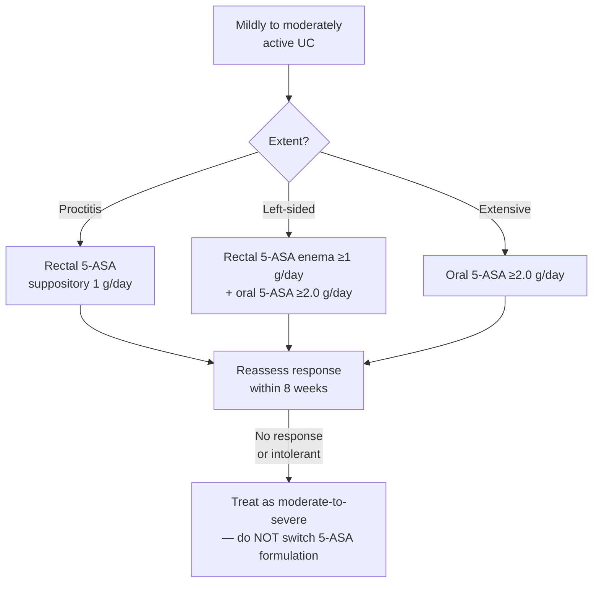

**Topical anti-inflammatory agents that act within the lumen of the intestine** ([[acg-2025-crohns]]). 5-ASAs are the first-line drug class for **mildly to moderately active [[ulcerative-colitis|UC]]** — and, in [[crohns-disease|Crohn's disease]], a class the guidelines **recommend against**. That asymmetry is the single most misremembered fact about this drug class, and it is the reason this page exists.

Two further decisions the class turns on, both of which are numbers rather than principles: **which route** (which follows disease extent, not severity), and **which dose** — because the induction dose and the maintenance dose differ, and because *the approved maintenance dose of at least one US formulation is below the effective induction dose*.

## Contents
- [[#Agents]]
- [[#Ulcerative Colitis — Dosing by Extent]]
  - [[#The route rule]]
  - [[#Induction and maintenance doses]]
  - [[#Oral dose selection — low vs high]]
  - [[#Dosing frequency]]
  - [[#The formulation trap]]
- [[#Ulcerative Colitis — the Graded Recommendations]]
- [[#When 5-ASA Has Failed]]
- [[#5-ASA with Advanced Therapy]]
- [[#Crohn's Disease — the Class Is Recommended Against]]
- [[#Efficacy Data Behind the Grades]]
- [[#Mesalamine vs Sulfasalazine]]
- [[#Other GI Uses]]
- [[#Adverse Effects, Pregnancy, and Monitoring]]
- [[#What Changed Between Guideline Versions]]
- [[#Gaps]]
- [[#See Also]]
- [[#Sources]]

---

## Agents

| Agent | Route(s) named | Where it is positioned |
|---|---|---|
| **Mesalamine** | Oral (delayed/extended release, granules); rectal **suppository, enema, foam, gel/liquid** | The default 5-ASA for [[ulcerative-colitis\|UC]]; **not** for [[crohns-disease\|CD]] |
| **Sulfasalazine** | Oral | UC maintenance (superior to mesalamine in one meta-analysis, but poorly tolerated); the **only** 5-ASA with any CD role — *symptomatic mild colonic CD only* |
| **Olsalazine** | Oral | Named only inside the UC maintenance meta-analysis; no separate recommendation |

- **Balsalazide** is not covered by the guidelines cited here; no dose or positioning is given for it.
- **Agent choice does not predict relapse.** In the 11-trial UC maintenance meta-analysis, *the type of 5-ASA agent was not found to predict rates of relapse* ([[acg-2025-uc]]).

---

## Ulcerative Colitis — Dosing by Extent

### The route rule

**Disease extent selects the route.** Severity selects whether you stay in this class at all.

*Rectal 5-ASA beats rectal steroids for induction in proctitis and left-sided colitis (Rec 9, Strong/Moderate) — but **rectal steroids remain an important option** for a patient who cannot retain rectal 5-ASA, is hypersensitive to 5-ASA, or is not responding to it ([[acg-2025-uc]]).*

### Induction and maintenance doses

*All doses [[acg-2025-uc]] unless noted. Doses are given as the guideline states them — as **minimums** ("at least"), not as fixed prescriptions.*

| Extent | Induction | Maintenance |
|---|---|---|
| **Ulcerative proctitis** | Rectal 5-ASA **1 g/daily** (Rec 6) | Rectal 5-ASA **1 g daily** (Rec 18) |
| **Left-sided colitis** | Rectal 5-ASA enema **at least 1 g/daily** (Rec 9) **combined with** oral 5-ASA **at least 2.0 g/daily** (Rec 10) | Oral 5-ASA **at least 1.5 g/d** (Rec 19) |
| **Extensive colitis** | Oral 5-ASA **at least 2.0 g daily** (Rec 12) | Oral 5-ASA **at least 1.5 g/d** (Rec 19) |

- **The oral+rectal combination is the left-sided rule, and only the left-sided rule.** Rec 10 pairs the enema with oral therapy specifically in left-sided UC. In **extensive** colitis the guideline states oral 5-ASA at least 2.0 g daily **is preferred** to induce remission.
- **Induction dose ≠ maintenance dose.** Oral induction is **≥2.0 g/day**; oral maintenance is **≥1.5 g/day**. Rectal is **1 g/day for both**.
- **Rectal formulation does not matter for efficacy** — no significant differences by dose (1 or 4 g) or formulation (liquid, gel, foam, or suppository) in the 38-study meta-analysis.

### Oral dose selection — low vs high

- **Rec 15 (Conditional / Very low):** in **mildly** active UC of any extent, use a **low dose (2.0–2.4 g)** rather than a higher dose (**4.8 g**) — *there is no difference in remission rate* (RR = 0.91; 95% CI 0.85–0.98).
- **The subgroup that changes the answer:** a subgroup analysis indicated **patients with more active (moderate) disease may benefit from the higher dose of 4.8 g/d**. Rec 15 is scoped to *mildly* active disease; do not carry it into moderate disease.
- The ceiling of "appropriately dosed" oral therapy is **4.8 g daily** (Rec 14).

### Dosing frequency

- **Rec 17 (Strong / Moderate):** **once daily or more frequently dosed** oral 5-ASA, **based on patient preference to optimize adherence** — efficacy and safety are no different.
- Supporting data: meta-analysis of 3 trials, no significant difference in efficacy or adherence (nonremission RR 0.95; 95% CI 0.82–1.10). An RCT in proctosigmoiditis found patients **preferred once-daily** dosing and had a significantly higher rate of clinical remission on it (**86%, n = 97 vs 73% TID, n = 100; P = 0.0298**).
- **Why this matters:** prevalence of nonadherence in the community is **40%**, reaching **up to 68%** in patients on more than 4 prescription medications. *Reinforcement of adherence is an important aspect of management of UC.*

### The formulation trap

> ⚠ **The approved dose of some mesalamine preparations in maintenance is lower than the recommended effective doses for induction.** Specifically, a **specific extended-release mesalamine capsule formulation available in the United States is approved for maintenance at a dose of 1.5 g/d but not for induction (Apriso)** — so it **may not provide optimal dosing for successful induction of remission** ([[acg-2025-uc]]). Check the formulation before concluding a patient has "failed 5-ASA."

---

## Ulcerative Colitis — the Graded Recommendations

*From [[acg-2025-uc]] Table 2. Every one is scoped to **mildly to moderately active** UC except where stated.*

| # | Recommendation | Strength / Evidence |
|---|---|---|
| 6 | Ulcerative proctitis — rectal 5-ASA **1 g/daily** for induction | Strong / Moderate |
| 9 | Proctitis or left-sided colitis — rectal 5-ASA enemas **at least 1 g/daily** **preferred over rectal steroids** for induction | Strong / Moderate |
| 10 | Left-sided UC — rectal 5-ASA enemas **≥1 g/daily combined with** oral 5-ASA **≥2.0 g/daily**, over oral 5-ASA alone, for induction | Conditional / Low |
| 12 | Extensive colitis — oral 5-ASA **at least 2.0 g daily** to induce remission | Strong / Moderate |
| 13 | **UC of any extent failing 5-ASA** → oral systemic corticosteroids to induce remission | Strong / Low |
| 14 | Failing appropriately dosed 5-ASA (**at least 2–4.8 g daily oral mesalamine and/or at least 1 g daily rectal mesalamine**) → **suggest against changing to an alternate 5-ASA formulation**; alternative therapeutic classes should be considered | Conditional / Low |
| 15 | **Mildly** active UC, any extent — **low dose (2.0–2.4 g)** over higher dose (4.8 g); no difference in remission rate | Conditional / Very low |
| 16 | Any extent **not responding to oral 5-ASA** → **add budesonide MMX 9 mg/d** to induce remission | Strong / Moderate |
| 17 | Using 5-ASA to induce — **once daily or more frequently dosed**, by patient preference | Strong / Moderate |
| 18 | **Mildly** active ulcerative proctitis — rectal 5-ASA **1 g daily** for **maintenance** | Strong / Moderate |
| 19 | **Mildly** active left-sided or extensive UC — oral 5-ASA **at least 1.5 g/d** for **maintenance** | Strong / Moderate |
| 32 | Moderately-severely active UC who **failed** 5-ASA and are starting a biologic or [[jak-inhibitors\|JAK inhibitor]] for induction → **suggest against** 5-ASA for added clinical efficacy | Conditional / Very low |
| 34 | Prior moderately-severely active UC in remission, previously failed 5-ASA, now on [[anti-tnf-agents\|anti-TNF]] → **suggest against** concomitant 5-ASA for maintenance efficacy | Conditional / Low |

**Related recommendations that bound the class** (not 5-ASA itself, but they are what you do when it fails): Rec 11 — left-sided UC intolerant or nonresponsive to **oral and rectal 5-ASA at appropriate doses (oral at least 2.0 g daily and rectal at least 1 g daily)** → **oral budesonide MMX 9 mg/d** (Strong / Moderate). Rec 7 — proctitis not responsive to topical 5-ASA → **[[tacrolimus|tacrolimus]] suppository or beclomethasone suppository** over no treatment (Conditional / Low).

**Key concepts** ([[acg-2025-uc]] Table 3):
- **KC 19** — reassess to determine response to induction therapy **within 8 weeks**.
- **KC 24** — patients **not responsive (or intolerant) to 5-ASA therapies should be treated as patients with moderate-to-severe disease**.
- **KC 25a** — 5-ASA therapy could be used as **monotherapy for induction of moderately but not severely active UC**.
- **KC 33** — 5-ASA maintenance is **likely not as effective in prior *severely* active UC** as in prior moderately active UC.

---

## When 5-ASA Has Failed

Three separate rules apply the moment a patient is not responding, and they are easy to conflate:

1. **Do not switch 5-ASA formulation** (Rec 14) — meta-analyses have not demonstrated a therapeutic difference between formulations, and **no formal switch studies have been published**. Change *class*, not brand.
2. **Escalate within the mild-moderate pathway first if the failure is to oral 5-ASA alone** — add **budesonide MMX 9 mg/d** (Rec 16, Strong/Moderate); a meta-analysis showed corticosteroids more effective than placebo for induction (RR = 0.65; 95% CI 0.45–0.93).
3. **Reclassify the patient** — non-response or intolerance means treat as **moderate-to-severe** disease (KC 24). *A lack of response to 5-ASA should prompt consideration that a patient has moderate-to-severe UC.*

**Before calling it failure, exclude two mimics** ([[acg-2025-uc]]):
- **The formulation trap above** — a maintenance-only preparation used for induction.
- **The drug itself.** *Diarrhea as an adverse event of 5-ASA therapies should be considered.* A **rare paradoxical increase in diarrhea associated with 5-ASA** has been described in a subset of patients.

---

## 5-ASA with Advanced Therapy

- **Stop it, don't stack it.** Once an advanced therapy is started in a patient who **failed** 5-ASA, ACG suggests **against** continuing 5-ASA for added efficacy — at induction (Rec 32) and at maintenance on [[anti-tnf-agents|anti-TNF]] (Rec 34).
- The same position is carried by [[aga-2024-uc-pharm]] (Rec 13). *Its implementation note preserves one exception: a **partial** responder — especially with residual proctitis — may still benefit from **rectal** 5-ASA.* (That exception is about a partial responder, not a 5-ASA failure.)

---

## Crohn's Disease — the Class Is Recommended Against

**[[acg-2025-crohns]] Rec 4 (verbatim):** *"We recommend against the use of oral mesalamine for induction or maintenance in patients with mildly to moderately active CD"* — **strong recommendation, moderate level of evidence.**

**[[acg-2025-crohns]] Key concept 40 (verbatim):** *"Sulfasalazine should only be considered for patients with symptomatic mild colonic CD."*

| Question | ACG 2025 CD answer |
|---|---|
| Oral mesalamine, induction or maintenance | **Recommend against** (Strong / Moderate) — *not more effective compared with placebo for induction of remission and achieving mucosal healing in patients with active CD* |
| Sulfasalazine | **3–6 g daily in divided doses** — *may be a modestly effective therapy for treatment of **symptoms*** of patients with **mild colonic CD and/or ileocolonic CD**, but **not isolated small bowel disease**. It was **not** more effective than placebo for **mucosal healing**, even combined with corticosteroids |
| Topical (rectal) mesalamine in CD | *"the role of topical mesalamine in CD, although commonly used, is of **limited benefit**"* |
| Maintenance of medically induced remission | **5-ASAs are not recommended.** 11 placebo-controlled trials (1–4 g/day, 4–36 months): 4 reported a significant decrease in relapse, **the other 7 showed no prevention of relapse**. Across 5 meta-analyses the therapeutic advantage over control was **<10%**, with an **NNT of over 15** |
| Postoperative recurrence prophylaxis | **Neither 5-ASAs nor antibiotics as monotherapy was effective over placebo.** Anti-TNF monotherapy was the most effective intervention (clinical relapse RR 0.04, endoscopic relapse RR 0.01 vs placebo in a 21-trial network meta-analysis) |
| Fistulizing CD | Mesalamine and corticosteroids are **ineffective** |

- **The reason the drug persists anyway, stated by the guideline:** *"5-aminosalicylates (5-ASAs) remain widely prescribed for the treatment of CD, despite considerable evidence demonstrating their lack of efficacy"* — one of the *"largely ineffective agents whose use cannot be justified by clinical evidence."*
- **[[aga-2021-crohns-pharm]] agrees and goes further** — Rec 9: recommends **against** 5-aminosalicylates or sulfasalazine over no treatment for induction **or** maintenance in moderate-to-severe CD (**Strong**, moderate certainty); 5-ASA/sulfasalazine *did not reach the 10% MCID for induction*. Rec 7 suggests **early introduction of a biologic rather than delaying until after failure of 5-ASA** and/or corticosteroids (Conditional, low).
- **Sulfasalazine is the only survivor, and it is graded weakly.** [[acg-2018-crohns]] Rec 10 called it *effective for treating symptoms of colonic CD that is mild to moderately active* (**Conditional / Low**); ACG 2025 demotes it from a recommendation to a **key concept**.

---

## Efficacy Data Behind the Grades

*All from [[acg-2025-uc]] unless noted.*

| Setting | Comparison | Result |
|---|---|---|
| **UC induction or maintenance** (11 RCTs) | 5-ASA vs placebo | **60.3%** on 5-ASA failed to reach remission vs **80.2%** on placebo — **RR = 0.79** (95% CI 0.73–0.85); P = 0.009; **NNT = 6**. Efficacy similar whether remission was defined clinically or endoscopically |
| **Proctitis / left-sided induction** (38 studies) | **Rectal** 5-ASA vs placebo | Symptomatic remission **OR 8.30** (95% CI 4.28–16.12; P < 0.00001); endoscopic remission **OR 5.31** (95% CI 3.15–8.92; P < 0.00001) |
| Proctitis / left-sided induction | Rectal 5-ASA vs **rectal steroids** | Symptomatic remission **OR = 1.65** (95% CI 1.1–2.5) — favours 5-ASA |
| **Left-sided induction** | Rectal enema (1 g/d) **+** oral (≥2.0 g/d) vs oral alone | Induction failure **RR = 0.65** (95% CI 0.47–0.91); a second meta-analysis **RR 0.86** (95% CI 0.81–0.91) |
| **Topical maintenance** (7 trials) | Topical mesalamine vs placebo | Relapse **RR 0.60** (95% CI 0.49–0.73). Mean disease duration 5–7 years. ⚠ **Only one included trial enrolled extensive UC** — the rest were proctitis, proctosigmoiditis, or left-sided |
| **Oral maintenance** (11 trials, quiescent UC) | Oral 5-ASA (mesalamine, olsalazine, sulfasalazine) vs placebo | Relapse **RR 0.65** (95% CI 0.55–0.76) |
| Oral maintenance, dose effect | **≥2 g** vs **<2 g** | Relapse **RR = 0.79** (95% CI 0.64–0.97) — favours the higher dose band |
| Mesalamine **granules** 1.5 g/d, UC in remission | vs placebo | Remission at 6 months **79.9% vs 66.7%**; P = 0.03 |

---

## Mesalamine vs Sulfasalazine

A genuine trade-off, and the guideline states both halves:

| | Finding | Source |
|---|---|---|
| **Efficacy (UC maintenance)** | Oral 5-ASA vs sulfasalazine — **higher rate of failure** to maintain clinical or endoscopic remission with 5-ASA (**RR = 1.14**, 95% CI 1.03–1.27) and a higher rate of failure to maintain remission in general (**RR = 1.08**, 95% CI 0.92–1.26). *Sulfasalazine wins on efficacy* | [[acg-2025-uc]] (Cochrane meta-analysis) |
| **Tolerability** | *"sulfasalazine is often limited by **intolerance (headache, nausea)**, **allergy to the sulfa moiety**, and **need for multiple daily doses**"* | [[acg-2025-uc]] |
| **Pregnancy** | Sulfasalazine requires **folic acid 1 mg twice daily** from **3 months preconception through pregnancy** (neural tube defects). Mesalamine carries no such requirement | [[aga-2024-pregnancy-gi-liver]] |
| **CD** | Sulfasalazine is the **only** 5-ASA with any CD role (symptomatic mild colonic CD); mesalamine has none | [[acg-2025-crohns]] |

---

## Other GI Uses

| Condition | Position | Source |
|---|---|---|
| **[[pouchitis\|Cuffitis]]** | **First-line: topical mesalamine** (suppositories) **or** topical corticosteroids applied directly to the cuff — *use UC-approved therapy* (Rec 13, **very low** certainty) | [[aga-2024-pouchitis]] |
| **Chronic antibiotic-refractory pouchitis** | Mesalamine — **no recommendation** (explicit knowledge gap, Rec 10) | [[aga-2024-pouchitis]] |
| **Refractory [[celiac-disease\|celiac disease]] type 1** | **Small-intestinal-release mesalamine 2–4 g/d** — 75% clinical response alone; **33% complete response** combined with budesonide | [[aga-2022-refractory-celiac]] |
| **[[diverticulitis]] — recurrence prevention** | **Recommend against mesalamine** — **Strong, moderate certainty**. ACP 2022 meta-analysis, 6 RCTs, n = 1,898: no recurrence reduction (**OR 1.15**, 0.92–1.44) and **more discontinuation for adverse events** (OR 1.59, 1.12–2.27) | [[acg-2026-diverticulitis]] |
| **[[colorectal-cancer\|CRC]] chemoprevention in IBD** | **Unresolved.** *"There is uncertainty regarding the independent chemopreventive benefit of mesalamine therapy"* — meta-analyses of population-based studies have yielded **conflicting results**. Do not treat 5-ASA as a chemopreventive indication | [[aga-2021-ibd-colorectal-dysplasia]] |
| **[[primary-sclerosing-cholangitis\|PSC]]** | 5-ASA *may* reduce CRC risk — stated without a grade | [[acg-2015-psc]] |

---

## Adverse Effects, Pregnancy, and Monitoring

**Adverse effects named by the guidelines:**

| Effect | Detail | Source |
|---|---|---|
| **Diarrhea** | An adverse event of 5-ASA therapy; **a rare paradoxical increase in diarrhea** occurs in a subset of patients — consider it before calling the patient a treatment failure | [[acg-2025-uc]] |
| **Sulfasalazine intolerance** | Headache, nausea; **allergy to the sulfa moiety** | [[acg-2025-uc]] |
| **Discontinuation for adverse events** | Higher than placebo in the diverticulitis trials (**OR 1.59**, 1.12–2.27) | [[acg-2026-diverticulitis]] |

**Pregnancy** ([[aga-2024-pregnancy-gi-liver]]):
- **Mesalamine — safe.**
- **Sulfasalazine — with folic acid 1 mg twice daily**, from **3 months preconception through pregnancy** (neural tube defects).
- Most IBD medications, including these, are compatible with **breastfeeding**.

**Monitoring:** the response check is the only interval the guidelines give — **reassess response to induction within 8 weeks** ([[acg-2025-uc]] KC 19). See *Gaps* for what is not stated.

---

## What Changed Between Guideline Versions

Readers carry the old numbers in their heads, so the deltas matter:

| Item | ACG 2019 UC | ACG 2025 UC | Effect |
|---|---|---|---|
| **Oral maintenance dose** | *at least* **2 g/d** (Rec 17) | *at least* **1.5 g/d** (Rec 19) | **The maintenance floor dropped by 0.5 g.** The 1.5 g/d figure matches the granule trial (79.9% vs 66.7% at 6 months) |
| **Definition of "appropriately dosed"** before abandoning the class | oral **≥2 g/d** and/or rectal ≥1 g/d (Rec 12) | oral **2–4.8 g daily** and/or rectal ≥1 g daily (Rec 14) | The 2025 wording makes the **4.8 g ceiling** explicit, so "failed 5-ASA" now implies a dose *range* was tried |
| **Scope of the mild-disease recommendations** | mostly *"mildly active"* | *"mildly **to moderately** active"* | 5-ASA's graded territory formally extends into **moderate** activity (consistent with KC 25a) |
| **Concomitant 5-ASA on anti-TNF maintenance** | *"we recommend against"* (Conditional, low) | *"we **suggest** against"* (Conditional, low) | Same direction, softer verb; grade unchanged |

| Item | ACG 2018 CD | ACG 2025 CD |
|---|---|---|
| **Sulfasalazine in colonic CD** | **Rec 10** — effective for symptoms of mild-moderate colonic CD (Conditional / Low) | Demoted to **Key concept 40** — *"should only be considered for patients with symptomatic mild colonic CD"* |
| **Mesalamine for postoperative recurrence** | **Rec 55** — of limited benefit, but *an option* for isolated ileal resection with **no** risk factors (Conditional / Moderate) | ⚠ **Withdrawn as an option** — *"Neither 5-ASAs or antibiotics as monotherapy was effective over placebo"*; anti-TNF is first-line prophylaxis |
| **Oral mesalamine in active CD** | **Rec 11** — should not be used (Strong / Moderate) | **Rec 4** — recommend against for **induction *or* maintenance** (Strong / Moderate) — the prohibition now covers maintenance explicitly |

---

## Gaps

- *The guidelines give no **laboratory monitoring schedule** for 5-ASA — no renal function/creatinine interval, no CBC interval — and do not mention interstitial nephritis.*
- *None of the guidelines names **balsalazide**, gives a **pediatric** dose, or gives a **renal/hepatic dose adjustment**.*
- *The guidelines give no **duration** for maintenance 5-ASA, or a rule for **when it may be stopped**.*
- *No guideline states a **5-ASA dose for cuffitis or refractory pouchitis** — [[aga-2024-pouchitis]] names the drug but not the dose, and explicitly records "no recommendation" for mesalamine in chronic antibiotic-refractory pouchitis.*
- *CRC chemoprevention is **explicitly unresolved** ([[aga-2021-ibd-colorectal-dysplasia]]) and the [[primary-sclerosing-cholangitis\|PSC]] statement ([[acg-2015-psc]], 2015) is ungraded and older — neither supports prescribing 5-ASA for chemoprevention.*
- *No guideline addresses 5-ASA in **[[segmental-colitis-associated-with-diverticulosis\|SCAD]]**; see that page for the limits of its management evidence.*
- *No **individual agent pages** exist — mesalamine, sulfasalazine, and olsalazine are covered only at class level here.*

---

## See Also

[[ulcerative-colitis]], [[crohns-disease]], [[inflammatory-bowel-disease]], [[pouchitis]], [[anti-tnf-agents]], [[jak-inhibitors]], [[vedolizumab]], [[il-23-and-il-12-23-inhibitors]], [[thiopurines]], [[tacrolimus]], [[probiotics]], [[diverticulitis]], [[segmental-colitis-associated-with-diverticulosis]], [[celiac-disease]], [[primary-sclerosing-cholangitis]], [[colorectal-cancer]], [[colonoscopy-surveillance]], [[ibd-endoscopic-scoring]], [[ibd-preventive-care]], [[uc-vs-crohns-comparison]]

---

## Sources

1. [[acg-2025-uc|ACG 2025: Ulcerative Colitis in Adults (Guideline Update)]]
2. [[acg-2025-crohns|ACG 2025: Management of Crohn's Disease in Adults]]
3. [[acg-2019-uc|ACG Clinical Guideline: Ulcerative Colitis in Adults (2019)]]
4. [[acg-2018-crohns|ACG Clinical Guideline: Management of Crohn's Disease in Adults (2018)]]
5. [[aga-2024-uc-pharm|AGA Living Guideline: Pharmacologic Management of Moderate-to-Severe Ulcerative Colitis (2024)]]
6. [[aga-2021-crohns-pharm|AGA Clinical Practice Guidelines on the Medical Management of Moderate to Severe Luminal and Perianal Fistulizing Crohn's Disease (2021)]]
7. [[aga-2024-pregnancy-gi-liver|AGA Clinical Practice Update on Pregnancy-Related Gastrointestinal and Liver Disease: Expert Review]]
8. [[aga-2021-ibd-colorectal-dysplasia|AGA Clinical Practice Update on Endoscopic Surveillance and Management of Colorectal Dysplasia in Inflammatory Bowel Diseases: Expert Review]]
9. [[aga-2024-pouchitis|AGA Clinical Practice Guideline: Management of Pouchitis and Inflammatory Pouch Disorders (2024)]]
10. [[aga-2022-refractory-celiac|AGA Clinical Practice Update on Management of Refractory Celiac Disease: Expert Review]]
11. [[acg-2026-diverticulitis|ACG Clinical Guideline: Colonic Diverticulitis (2026)]]
