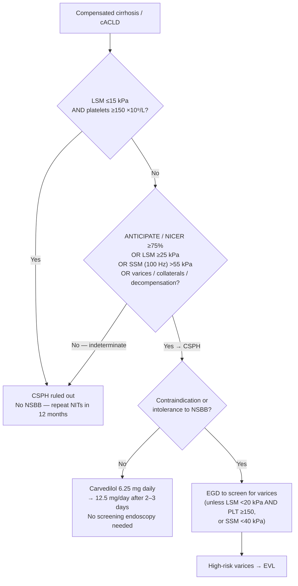

The drug class that lowers portal pressure in [[cirrhosis]]. Two groups, and the distinction drives every recommendation below:

- **Conventional NSBB (cNSBB)** — **propranolol**, **nadolol**. β-1 + β-2 blockade only.
- **Carvedilol** — NSBB **plus** anti-α-1-adrenergic activity. The preferred agent ([[aasld-2023-portal-hypertension]] GS 1; [[baveno-viii-2026-portal-hypertension]] 3.15, 4.4, 4.8).

The modern indication is **not "you have varices"** — it is **CSPH**, and the goal is **preventing decompensation**, not only preventing a bleed.

## Contents
- [[#Mechanism]]
- [[#Who Gets Them]]
  - [[#Step 1 — Establish CSPH]]
  - [[#Step 2 — Indication by disease stage]]
  - [[#High-risk varices — the definition behind the varix-based indications]]
- [[#Dosing and Titration]]
  - [[#Titration targets and their qualifiers]]
  - [[#Carvedilol — the up-titration in words]]
- [[#Carvedilol vs Conventional NSBB]]
- [[#Contraindications]]
- [[#Stop, Hold, and Restart Rules]]
- [[#When to Stop Permanently]]
- [[#Evidence — PREDESCI]]
- [[#What Changed Between Guideline Versions]]
- [[#See Also]]
- [[#Sources]]

---

## Mechanism

| Agent | Mechanism ([[aasld-2023-portal-hypertension]] Table 3) |
|---|---|
| Propranolol | ↓ cardiac output (β-1 blockade → ↓ heart rate and contractility) **plus** splanchnic arterial vasoconstriction (β-2 blockade → unopposed α-adrenergic vasoconstriction) |
| Nadolol | As above |
| Carvedilol | The above **plus** ↓ intrahepatic vascular resistance via anti-α-1-adrenergic activity and nitric oxide release |

The extra α-1 blockade is why carvedilol produces a **markedly greater [[hepatic-venous-pressure-gradient\|HVPG]] reduction** — and also why it drops arterial pressure more, which is the whole of its tolerability problem.

---

## Who Gets Them

### Step 1 — Establish CSPH

**CSPH = clinically significant portal hypertension = [[hepatic-venous-pressure-gradient\|HVPG]] ≥10 mm Hg** ([[aasld-2023-portal-hypertension]] GS 4; [[baveno-vii-2022-portal-hypertension]] 1.10). Both guidelines treat non-invasive testing — not the catheter — as the working route.

**Any one of these establishes CSPH without HVPG:**

| Route | Criterion | Source |
|---|---|---|
| Clinical/endoscopic | Clinical decompensation, **gastro-oesophageal varices at endoscopy**, or portosystemic collaterals / hepatofugal flow on imaging | [[aasld-2023-portal-hypertension]] GS 6 |
| Predictive model | **ANTICIPATE** (or **ANTICIPATE-NASH** if MASLD + BMI ≥30 kg/m²) or **NICER** estimated CSPH probability **≥75%** | [[baveno-viii-2026-portal-hypertension]] 1.16a |
| [[liver-stiffness-measurement\|Liver stiffness]] | **LSM ≥25 kPa** — in virus- and/or alcohol-related cACLD and **non-obese (BMI <30 kg/m²)** MASLD-related cACLD | [[baveno-viii-2026-portal-hypertension]] 1.16b |
| Spleen stiffness | **SSM (100 Hz probe) >55 kPa** — aetiology-agnostic | [[baveno-viii-2026-portal-hypertension]] 1.16c |

**Rule-out (no NSBB for decompensation prevention):** **LSM ≤15 kPa *and* platelets ≥150 ×10⁹/L** — negative predictive value >90% ([[baveno-viii-2026-portal-hypertension]] 1.15). Both criteria are required; either alone does not rule out CSPH.

**In between (indeterminate), re-evaluate at 12 months** rather than treating ([[baveno-viii-2026-portal-hypertension]] 1.17). NITs for CSPH should be repeated every 12 months, and **the most recent value guides the decision** (1.9, 1.10).

> **The two guidelines disagree on the intermediate LSM + platelet bands.** [[aasld-2023-portal-hypertension]] GS 7 diagnoses CSPH at **LSM 20–24.9 kPa with platelets <150 K/mm³** or **LSM 15–19.9 kPa with platelets <110 K/mm³** (the Baveno VII ANTICIPATE ≥60% bands). [[baveno-viii-2026-portal-hypertension]] 1.16 no longer accepts those combinations as diagnostic — it requires an ANTICIPATE/NICER probability **≥75%**, LSM ≥25 kPa, or SSM >55 kPa. Baveno VIII is the newer document and governs: a patient at LSM 22 kPa with platelets 130 K/mm³ is **not** automatically CSPH-positive; run ANTICIPATE or SSM.

**No CSPH → no NSBB.** NSBBs are not indicated to prevent decompensation or death in compensated cirrhosis/cACLD without CSPH ([[aasld-2023-portal-hypertension]] GS 9; [[baveno-viii-2026-portal-hypertension]] 3.16).

### Step 2 — Indication by disease stage

| Setting | Recommendation | Source |
|---|---|---|
| Compensated cirrhosis / cACLD **with CSPH** | NSBB, **preferably carvedilol 12.5 mg/day**, to prevent decompensation and improve survival | [[aasld-2023-portal-hypertension]] GS 12; [[baveno-viii-2026-portal-hypertension]] 3.15 |
| On NSBB for decompensation prevention | **No screening endoscopy needed** — the result would not change management | [[aasld-2023-portal-hypertension]] GS 14; [[baveno-viii-2026-portal-hypertension]] 3.18 |
| Compensated, **any size varices** found because NSBB was not started | Varices of any size should prompt initiation of NSBB | [[aasld-2023-portal-hypertension]] GS 15 |
| **Gastric varices** (GOV2/IGV1) in compensated disease | Gastric varices *mean* CSPH → NSBB, particularly carvedilol, to prevent decompensation | [[baveno-viii-2026-portal-hypertension]] 3.21a; [[aasld-2023-portal-hypertension]] GS 40 |
| **[[ascites]] + varices** (decompensated) | **Carvedilol/cNSBB, carvedilol preferred** — to prevent first bleeding and to lower ascites-related complications. **Variceal size, red signs and CTP class no longer stratify this decision.** | [[baveno-viii-2026-portal-hypertension]] 4.4 |
| Decompensated, never bled, **not** on NSBB | Annual screening endoscopy; if high-risk varices found → NSBB preferred over band ligation (benefits beyond bleeding prevention) | [[aasld-2023-portal-hypertension]] GS 22, 23 |
| **Secondary prophylaxis** after oesophageal variceal bleed | **NSBB + EVL**, carvedilol preferred over cNSBB — regardless of what was used for primary prophylaxis | [[baveno-viii-2026-portal-hypertension]] 4.8; [[aasld-2023-portal-hypertension]] GS 38 |
| After [[variceal-upper-gi-bleeding\|acute variceal haemorrhage]], no TIPS | Start NSBB **at discontinuation of vasoactive therapy**. A short vasoactive course (even 24 h) after successful endoscopic haemostasis is acceptable **provided NSBB is then initiated** | [[aasld-2023-portal-hypertension]] GS 33; [[baveno-viii-2026-portal-hypertension]] 5.8 |
| Portal hypertensive gastropathy | **NSBB first-line** to prevent rebleeding; [[tips\|TIPS]] is the most effective rescue if transfusion-dependent | [[baveno-viii-2026-portal-hypertension]] 5.44; [[aasld-2023-portal-hypertension]] GS 50, 51 |
| [[hepatocellular-carcinoma\|HCC]] with CSPH | NSBB for primary prophylaxis and decompensation prevention, absent contraindications | [[aasld-2023-portal-hypertension]] GS 53 |
| Occlusive bland or malignant [[portal-vein-thrombosis\|PVT]] with varices | NSBB preferred over band ligation | [[aasld-2023-portal-hypertension]] GS 54 |
| **Pregnancy** | Prophylaxis follows non-pregnant principles, **including the use of propranolol** | [[baveno-viii-2026-portal-hypertension]] 8.18 |
| Vascular liver disease (e.g. [[budd-chiari-syndrome\|BCS]], [[porto-sinusoidal-vascular-disorder\|PSVD/NCPF]]) | Evidence is insufficient to prefer carvedilol over cNSBB here | [[baveno-viii-2026-portal-hypertension]] 8.9 |

### High-risk varices — the definition behind the varix-based indications

**High-risk varices = moderate/large varices, OR varices of any size with red wale marks, OR varices of any size in a CTP class C patient** ([[aasld-2023-portal-hypertension]]).

- If the high-risk varices are **small**, NSBB is the only technically feasible option.
- If **large**, both NSBB and EVL are possible — NSBB is preferred.
- High-risk **cardiofundal (GOV2/IGV1)** varices are defined in [[aasld-2023-portal-hypertension]] GS 41 as **≥10 mm, red wale signs, or CTP class B/C**; those patients get endoscopic cyanoacrylate injection only if NSBB is contraindicated or not tolerated.

---

## Dosing and Titration

All doses below are from [[aasld-2023-portal-hypertension]] (Table 3 and GS 2). **Neither [[baveno-viii-2026-portal-hypertension]] nor [[baveno-vii-2022-portal-hypertension]] states any NSBB dose, titration step, or heart-rate target** — Baveno names the drug and the indication only.

| Drug | Starting dose | Titration | Maximal dose | Goal |
|---|---|---|---|---|
| **Propranolol** | **20–40 mg twice daily** | Increase the dose **every 2–3 days** until treatment goal | Without [[ascites\|ascites]]: **320 mg/day** With ascites: **160 mg/day** | **HR 55–60 bpm** if tolerated; **SBP maintained ≥90 mm Hg** |
| **Nadolol** | **20–40 mg at bedtime** | Increase the dose **every 2–3 days** until treatment goal | Without ascites: **160 mg/day** With ascites: **80 mg/day** | **HR 55–60 bpm** if tolerated; **SBP maintained ≥90 mm Hg** |
| **Carvedilol** | **6.25 mg once daily** | Increase to **6.25 mg twice daily after 3 days** | **12.5 mg/day**; higher doses may be considered for **non-hepatic** indications | **No heart-rate goal**; **SBP maintained ≥90 mm Hg** |

**Common adverse effects (all three):** fatigue, bradycardia, dyspnoea, orthostasis, hypotension, constipation.

### Titration targets and their qualifiers

- **Heart rate 55–60 bpm applies to propranolol and nadolol only, and only "if tolerated."** Carvedilol has **no HR target** — do not titrate carvedilol to pulse.
- **Systolic BP ≥90 mm Hg is the floor for all three agents.** It is a floor to *maintain*, not a target to reach.
- **The maximum dose halves in the presence of ascites** for both conventional agents (propranolol 320 → 160 mg/day; nadolol 160 → 80 mg/day). Carvedilol's cap does not change with ascites.
- **Maintenance is indefinite** — or until [[tips\|TIPS]] or [[liver-transplantation\|liver transplant]]. There is no indication for routine upper endoscopy while on therapy.

### Carvedilol — the up-titration in words

[[aasld-2023-portal-hypertension]] body text: start **6.25 mg/day**; if tolerated, increase to **12.5 mg/day after 2–3 days**, given as a single dose or as 6.25 mg twice daily. **Down-titrate back to 6.25 mg daily** (single or divided) if not tolerated or if systolic BP falls below 90 mm Hg in compensated cirrhosis. **Lower starting doses may be more appropriate in CTP class B and C** — the guideline does not say how much lower.

About **one third** of patients with compensated cirrhosis also have arterial hypertension; in those patients carvedilol may be up-titrated **to 25 mg/day** for blood-pressure control.

*Two internal inconsistencies in the source, both benign in practice: Table 3 says increase after **3 days** while the body text says **2–3 days**; and GS 2 caps maintenance at 12.5 mg/day while the body text permits up to 25 mg/day when a non-hepatic indication is being treated.*

---

## Carvedilol vs Conventional NSBB

**Prefer carvedilol** — across compensated disease ([[baveno-viii-2026-portal-hypertension]] 3.15), ascites + varices (4.4), and secondary prophylaxis (4.8), and as the blanket preference in [[aasld-2023-portal-hypertension]] GS 1.

Why:

- **Greater HVPG reduction** in head-to-head comparisons with conventional NSBBs — the α-1 effect lowers intrahepatic resistance, which propranolol and nadolol cannot do.
- **Simpler administration** and a trend toward **better tolerance**.
- **Possibility of preventing ascites**, and a **potential survival advantage**.
- In high-risk varices **with** ascites, carvedilol was associated with improved survival — **HR 0.41 (95% CI 0.19–0.96)** prospectively and **HR 0.61 (95% CI 0.46–0.81)** retrospectively ([[aasld-2023-portal-hypertension]]).

**When to use propranolol or nadolol instead:**

- **Arterial pressure is low even on low-dose carvedilol** — switch to propranolol or nadolol, which have lesser effects on arterial pressure ([[aasld-2023-portal-hypertension]]).
- **Pregnancy** — propranolol is the agent named by [[baveno-viii-2026-portal-hypertension]] 8.18. Weak evidence (from cardiac-indication use) suggests carvedilol causes less fetal growth retardation than propranolol.
- **Vascular liver disease** — no evidence favours carvedilol ([[baveno-viii-2026-portal-hypertension]] 8.9).

---

## Contraindications

[[aasld-2023-portal-hypertension]] Box 3. (Guidance statement 13 mis-cites this list as "Box 2"; Box 2 is the HVPG methodology box.)

| Absolute | Relative |
|---|---|
| Asthma | Psoriasis |
| **2nd- and 3rd-degree atrioventricular block** (in absence of an implanted pacemaker) | Peripheral arterial disease |
| Sick sinus syndrome | Chronic obstructive pulmonary disease |
| **Extreme bradycardia (<50 bpm)** | Pulmonary artery hypertension (controversial) |
| | Insulin-dependent diabetes mellitus (interferes with symptoms of hypoglycaemia) |
| | Raynaud syndrome |

If NSBB is contraindicated or not tolerated, the patient re-enters the **endoscopy pathway**: EGD to screen for varices unless **LSM <20 kPa *and* platelets ≥150 ×10⁹/L**, or **SSM <40 kPa** ([[baveno-viii-2026-portal-hypertension]] 1.19); if no varices at index EGD, repeat at **2 years** (active aetiology) or **3 years** (aetiology removed/suppressed) (1.20). High-risk varices → EVL ([[baveno-viii-2026-portal-hypertension]] 3.19).

---

## Stop, Hold, and Restart Rules

| Trigger | Action | Source |
|---|---|---|
| **Persistently low blood pressure** — systolic <90 mm Hg **or** mean arterial pressure <65 mm Hg | **Dose-reduce or discontinue** | [[baveno-viii-2026-portal-hypertension]] 4.6 |
| **HRS-[[aki-in-cirrhosis\|AKI]]** | **Dose-reduce or discontinue** | [[baveno-viii-2026-portal-hypertension]] 4.6 |
| Persistent systolic <90 mm Hg **or severe adverse effects** | Dose-reduce or discontinue; **discontinuation should prompt endoscopy** for high-risk varices needing band ligation | [[aasld-2023-portal-hypertension]] GS 24 |
| Carvedilol not tolerated / SBP <90 mm Hg in compensated cirrhosis | **Down-titrate carvedilol to 6.25 mg daily** before abandoning it | [[aasld-2023-portal-hypertension]] |
| **HRS-AKI resolved and/or blood pressure recovered** | **Re-initiate and/or re-titrate** carvedilol/cNSBB | [[baveno-viii-2026-portal-hypertension]] 4.7 |
| Remains intolerant after re-challenge | EVL to prevent variceal haemorrhage | [[baveno-vii-2022-portal-hypertension]] 7.7 |

**Refractory ascites is not itself a contraindication in either current source.** The historical mortality signal came from a study using unusually high doses (160 mg long-acting propranolol/day); subsequent studies find NSBBs safe and potentially beneficial in ascites, though a systolic BP <90 mm Hg may attenuate the survival advantage, possibly by reducing renal perfusion pressure and raising HRS-AKI risk ([[aasld-2023-portal-hypertension]]). The operative rule is the blood-pressure floor and HRS-AKI, not the ascites label.

**[[spontaneous-bacterial-peritonitis|Spontaneous bacterial peritonitis]] is not named as a stop trigger** by [[aasld-2023-portal-hypertension]] or [[baveno-viii-2026-portal-hypertension]]; the named triggers are persistent hypotension and HRS-AKI. Note that "SBP" in the dosing and stop rules above means **systolic blood pressure**.

---

## When to Stop Permanently

Only after **recompensation with confirmed resolution of CSPH** ([[baveno-viii-2026-portal-hypertension]] 7.18).

Confirmation requires **any one** of:

| Method | Threshold | Source |
|---|---|---|
| HVPG, **measured off carvedilol/cNSBB** | **<10 mm Hg** | [[baveno-viii-2026-portal-hypertension]] 7.16 |
| Liver stiffness alone | **LSM <10 kPa** | [[baveno-viii-2026-portal-hypertension]] 7.19 |
| Liver + spleen stiffness | **LSM <15 kPa *and* SSM <25 kPa** | [[baveno-viii-2026-portal-hypertension]] 7.19 |

Recompensation itself additionally requires removal/suppression/cure of the aetiology, sustained resolution of decompensating events for **>6 consecutive months**, and improvement of liver function to **CTP A5/A6** ([[baveno-viii-2026-portal-hypertension]] 7.4).

A separate, older exit route in [[baveno-vii-2022-portal-hypertension]] 3.9: a patient on NSBB with **no evident CSPH (LSM <25 kPa)** after the primary aetiological factor is removed/suppressed should be considered for **repeat endoscopy at 1–2 years** — if there are no varices, NSBB can be discontinued.

---

## Evidence — PREDESCI

The trial behind "treat CSPH, not varices" ([[aasld-2023-portal-hypertension]]):

- **201 patients**, compensated cirrhosis, **HVPG-confirmed CSPH**, **without high-risk varices**; beta-blocker (propranolol or carvedilol, assigned by acute haemodynamic response to propranolol) vs placebo.
- Titrated to tolerance, **pulse ≥55 bpm and SBP ≥90 mm Hg**, planned upper limits **160 mg propranolol / 25 mg carvedilol**. **Mean achieved doses: 95 mg/day propranolol, 19 mg/day carvedilol.**
- At 2 years: decompensation **HR 0.51 (95% CI 0.26–0.97)**, predominantly by preventing ascites.
- Caveats the guideline attaches: all participants had HVPG-confirmed CSPH (none selected non-invasively); most had untreated hepatitis C predating all-oral DAAs; ongoing alcohol use was not assessed.

**HVPG response** — a decrease of **≥10% from baseline, or to ≤12 mm Hg** after chronic treatment — is the haemodynamic definition of a responder, though neither current guideline requires measuring it to prescribe.

---

## What Changed Between Guideline Versions

| Rule | Baveno VII (2022) | Baveno VIII (2026) |
|---|---|---|
| Ascites + varices, which prophylaxis | Stratified by variceal size (<5 mm vs ≥5 mm), red signs, and CTP class C (7.5, 7.6) | **Any varices + ascites → carvedilol/cNSBB, carvedilol preferred.** Size stratification dropped (4.4) |
| Secondary prophylaxis after oesophageal variceal bleed | Traditional NSBB **or** carvedilol + EVL — **no preference** (7.8) | NSBB + EVL, **carvedilol preferred over cNSBB** (4.8) |
| Stopping NSBB after recompensation | Do not stop unless CSPH resolves — **no method given** (7.24) | Stop only on **confirmed** CSPH resolution, with named thresholds (7.16, 7.18, 7.19) |
| Ruling in CSPH non-invasively | LSM ≥25 kPa; ANTICIPATE **≥60%** bands (LSM 20–25 + PLT <150, or LSM 15–20 + PLT <110); SSM >50 kPa in viral cACLD | **ANTICIPATE/ANTICIPATE-NASH or NICER ≥75%**; LSM ≥25 kPa; **SSM (100 Hz) >55 kPa** (1.16) |
| Endoscopy when NSBB-ineligible | Endoscopy if LSM ≥20 kPa **or** PLT ≤150; SSM **≤**40 kPa as escape | Endoscopy **unless** LSM <20 kPa **and** PLT ≥150, **or** SSM **<**40 kPa (1.19) |

---

## See Also

[[portal-hypertension]], [[cirrhosis]], [[variceal-upper-gi-bleeding]], [[ascites]], [[hepatic-venous-pressure-gradient]], [[liver-stiffness-measurement]], [[tips]], [[aki-in-cirrhosis]], [[spontaneous-bacterial-peritonitis]], [[hepatocellular-carcinoma]], [[portal-vein-thrombosis]], [[porto-sinusoidal-vascular-disorder]], [[budd-chiari-syndrome]], [[liver-transplantation]]

---

## Sources

1. [[aasld-2023-portal-hypertension|AASLD 2023 Practice Guidance on Portal Hypertension and Varices in Cirrhosis]]
2. [[baveno-viii-2026-portal-hypertension|Baveno VIII — Advancing Consensus in Portal Hypertension (2026)]]
3. [[baveno-vii-2022-portal-hypertension|Baveno VII — Renewing Consensus in Portal Hypertension (2022)]]
