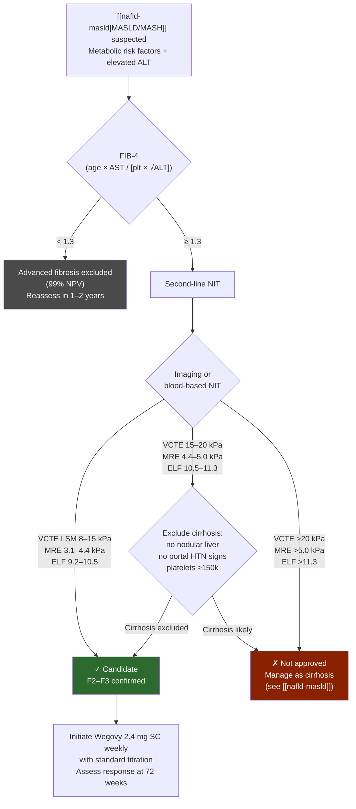

## Overview

Semaglutide is a glucagon-like peptide-1 receptor agonist (GLP-1 RA) — a long-acting analogue of human GLP-1 that incorporates structural modifications to slow dipeptidyl peptidase-4 (DPP-4) cleavage and prolong receptor activation. It shares 94% sequence homology with human GLP-1 and has a half-life of ~5–7 days, enabling once-weekly subcutaneous dosing. [[aasld-2025-semaglutide-mash]]

**Formulations and FDA-approved indications:**

| Brand | Route | Dose | Approved Indications |
|---|---|---|---|
| Wegovy | SC injection | 2.4 mg weekly | Chronic weight management ([[obesity]]/overweight + ≥1 comorbidity); CV risk reduction in obesity without T2DM (SELECT); **MASH with moderate-to-advanced fibrosis F2–F3 (August 2025)** |
| Ozempic | SC injection | 0.5 mg, 1.0 mg, 2.0 mg weekly | T2DM glycemic control; CV risk reduction in T2DM + established CVD (SUSTAIN-6); CKD risk reduction in T2DM (FLOW, 2025) |
| Rybelsus | Oral tablet | 3 mg, 7 mg, 14 mg daily | T2DM glycemic control |

## Mechanism of Action

GLP-1 is an incretin hormone secreted by enteroendocrine L-cells in the distal ileum and colon in response to nutrient intake. [[aasld-2025-semaglutide-mash]]

- **Pancreatic:** Glucose-dependent insulin release from β-cells; somatostatin secretion from δ-cells; glucagon suppression from α-cells
- **CNS:** GLP-1 receptors widely expressed in hypothalamus, hindbrain, brainstem → reduced hunger, increased satiety, reduced caloric intake
- **Gut:** Slowed gastric emptying → enhanced postprandial satiety
- **Cardiometabolic (indirect):** Hepatoprotective effects are thought to be mediated primarily *indirectly* via sustained weight loss, improved glycemic control, improved lipid profiles, and reduced hepatic/systemic inflammation — not through direct effects on hepatocytes, Kupffer cells, or stellate cells (GLP-1R expression is negligible on liver resident cells)
- **Lipid metabolism:** Inhibits chylomicron synthesis/secretion; decreases de novo lipogenesis; reduces hepatic VLDL production; lowers free fatty acids and ceramides through weight loss-induced effects

## GI Indication: MASH with Moderate-to-Advanced Fibrosis

### FDA Approval and Evidence Base

Semaglutide (Wegovy, 2.4 mg/week SC) received **accelerated FDA approval in August 2025** for treatment of MASH with moderate-to-advanced fibrosis (consistent with stages F2–F3 fibrosis). Full approval awaits completion of the ESSENCE trial (expected 2028 or thereafter). [[aasld-2025-semaglutide-mash]]

**ESSENCE trial (Phase 3, clinicaltrials.gov NCT04822181):**

- Population: Biopsy-confirmed MASH, Metavir stages 2–3 fibrosis; mild/no alcohol use (up to 20/30 g/day women/men); n=800 (interim analysis)
- Treatment: Semaglutide 2.4 mg SC weekly × 72 weeks vs. placebo
- Co-primary endpoints (both met):
  - MASH resolution without worsening of fibrosis: **62.9% vs. 34.3% placebo (p<0.001)**
  - ≥1 stage reduction in liver fibrosis without worsening of MASH: **36.8% vs. 22.4% placebo (p<0.001)**
- NIT aggregate results at 72 weeks (semaglutide vs. placebo): ALT relative change −52.1% vs. −22.2%; CAP absolute reduction −43.4 vs. −13.1 dB/m; LSM relative change −52% vs. −30.3%; ELF absolute change −0.60 vs. 0.00; proportion achieving ≥30% decrease in LSM: 52% vs. 30.3%; proportion achieving ≥0.5 decrease in ELF: 55.8% vs. 25.5%
- Note: 37.1% of semaglutide-treated patients did not resolve MASH; 63.2% did not have a reduction in fibrosis without worsening of steatohepatitis by week 72

### Patient Selection (AASLD 2025 Guidance)

**[[liver-biopsy|Liver biopsy]] is NOT routinely required** for semaglutide candidacy. A [[noninvasive-liver-disease-assessment|NIT]]-based approach is preferred. [[aasld-2025-semaglutide-mash]]

**Sequential NIT strategy — flowchart:**

**Sequential NIT strategy — cutoffs:**

1. Calculate FIB-4 (age × AST / [platelet × √ALT])
   - FIB-4 <1.3 → rules out advanced fibrosis in 99% of primary care patients; do not use alone as rule-in for candidacy
   - FIB-4 ≥1.3 → proceed to second-line NIT
2. Confirm F2–F3 range with imaging-based or blood-based NIT:

| NIT | Recommended (F2–F3) | May use (individualized; exclude cirrhosis) | [[cirrhosis\|Cirrhosis]] — NOT approved |
|---|---|---|---|
| VCTE LSM (kPa) | 8–15 | 15–20 | >20 |
| MRE LSM (kPa) | 3.1–4.4 | 4.4–5.0 | >5.0 |
| ELF score | 9.2–10.5 | 10.5–11.3 | >11.3 |
| Liver histology | MASH F2–F3 (biopsy ≤6–12 months) | | Cirrhosis |

For VCTE 15–20 kPa, MRE 4.4–5 kPa, or ELF 10.5–11.3: individualized treatment decision based on exclusion of cirrhosis with confirmatory NIT, cross-sectional imaging (no nodular liver contour or [[portal-hypertension|portal hypertension]] signs), or platelet count ≥150,000/mm³.

**Alcohol assessment required:** AUDIT-C + PEth before initiation; decisions individualized for MetALD range; enroll in clinical trials where possible.

### Contraindications (MASH Indication)

- Cirrhosis: VCTE >20 kPa, MRE >5.0 kPa, ELF >11.3, and/or portal hypertension evidence
- Personal or family history of medullary thyroid carcinoma (MTC)
- Multiple endocrine neoplasia syndrome type 2 (MEN2)
- Pregnancy
- Severe [[gastroparesis]] (relative contraindication — avoid)
- Active suicidal ideation at initiation (defer until patient is stable and under mental health care)

**Note on compensated cirrhosis:** Patients with compensated cirrhosis receiving semaglutide for another FDA-approved indication (obesity, T2DM) should be monitored carefully; a phase 2 trial (Cusi 2023, Lancet Gastroenterol Hepatol) did not identify liver-related safety concerns in this population.

### Dosing

- Wegovy 2.4 mg SC injection once weekly (titrated up from lower doses per standard protocol)
- Combination use with [[resmetirom]] at 2.4 mg/week has not been formally studied

### Monitoring and Safety

![[semaglutide-2025-safety-monitoring-table-08.png]]
*Table 3 — Key safety considerations and monitoring for semaglutide (Wegovy). ([[aasld-2025-semaglutide-mash]])*

**Pre-treatment baseline:** [[aasld-2025-semaglutide-mash]]

- Screen for active suicidal ideation
- Thyroid nodule evaluation (personal/family history of MTC/MEN2)
- Retinal exam in T2DM if not performed in past 12 months
- Hepatic function panel
- NIT of fibrosis (VCTE or MRE LSM)
- NIT of steatosis (CAP or MRI-PDFF)
- Serum creatinine and eGFR (baseline renal function)
- Alcohol assessment (AUDIT-C + PEth)
- Pregnancy test as appropriate

**On-treatment monitoring:**

| Timeframe | Symptoms to monitor | Diagnostic tests (as clinically indicated) |
|---|---|---|
| Ongoing | Nausea, vomiting, diarrhea, constipation, abdominal pain, depression or suicidal thoughts, palpitations/tachycardia | Pregnancy test; hepatic function panel; RUQUS for symptomatic gallstone disease; serum creatinine/eGFR if GI symptoms severe |
| 72 weeks | All of above | Retinal exam per society guidelines; hepatic function panel; NIT of fibrosis; NIT of steatosis |

**Treatment response assessment (at 72 weeks, using baseline NITs):** [[aasld-2025-semaglutide-mash]]

- **Beneficial response** (continue semaglutide): VCTE LSM decrease ≥30%; MRE LSM decrease ≥20%; MRI-PDFF decrease ≥30%; ALT decrease ≥17 U/L or ≥20%; ELF decrease ≥0.5
- **Uncertain benefit** (sub-threshold improvement, no cirrhosis progression): Re-evaluate strategy — re-optimize lifestyle, consider other therapy with/without stopping semaglutide
- **Non-response** (NITs worsen or suggest cirrhosis progression): Stop semaglutide

### Safety Profile

**Hepatic:** Favorable in ESSENCE — no discontinuations due to liver enzyme elevations. Routine hepatic panels recommended only as clinically indicated (not on a fixed schedule). [[aasld-2025-semaglutide-mash]]

**Key safety considerations:**

| Safety concern | Monitoring | Clinical action |
|---|---|---|
| Acute kidney injury (AKI) | Serum creatinine + eGFR at baseline, during initiation and titration; higher risk with vomiting, diarrhea, dehydration | Ensure adequate hydration; hold or reduce dose during significant GI intolerance; reassess renal function until recovery |
| [[acute-pancreatitis\|Acute pancreatitis]] | Monitor for severe, persistent abdominal pain (± vomiting); check amylase/lipase if symptomatic | Discontinue immediately if suspected; avoid rechallenge after confirmed episode; contraindicated with history of pancreatitis |
| Gallbladder disease (cholelithiasis/cholecystitis) | Monitor for right upper quadrant pain or biliary colic; RUQUS if symptomatic | Educate patients on biliary symptoms; caution in patients with history of gallbladder disease; 37% increased risk per meta-analysis (76 RCTs, n=103,371) |
| Thyroid C-cell tumors (MTC risk) | Review history of MTC/MEN2; monitor for neck mass, hoarseness, [[dysphagia]] | Contraindicated in MTC/MEN2; educate on symptoms; routine calcitonin testing NOT required; no conclusive human evidence for MTC causation |
| Hypoglycemia (with insulin/secretagogues) | Monitor glucose in patients on insulin or sulfonylureas; 7.4% vs. 5.4% in ESSENCE (T2DM) | Adjust insulin/sulfonylurea dose; educate on hypoglycemia recognition; higher risk post-[[bariatric-surgery]] |
| Heart rate increase (chronotropic effect) | Check pulse periodically; ask about palpitations or tachycardia | Caution in arrhythmia-prone patients; reassess if persistent tachycardia |
| [[gastroparesis]]/delayed gastric emptying | Evaluate baseline gastric motility in at-risk patients; monitor for early satiety, vomiting, retained food | Avoid in severe [[gastroparesis]]; consider gastric emptying evaluation if symptoms persist; retrospective incidence 6.5/1000 person-years |
| Procedural risks (aspiration/retained gastric contents) | Document GLP-1 RA use pre-procedure; coordinate with local anesthesia for fasting interval | Per [[aga-2024-glp1-endoscopy\|AGA 2024]]: individualized approach, not routine cessation — standard fast (8 h solids/2 h liquids) + no GI symptoms → proceed; ASA consensus alternative is hold day-of (daily dose)/1 wk prior (weekly). Full guidance on [[endoscopy-sedation]] |
| Diabetic retinopathy and ocular complications | Baseline retinal exam if not recently done in T2DM; periodic ophthalmology evaluation; monitor for blurred vision | Avoid rapid glucose lowering; refer for new visual symptoms; SUSTAIN-6: retinopathy 3.0% vs. 1.8% placebo; increased NAION and wet AMD risk |
| Lean mass loss/sarcopenia | Assess muscle strength/mass (DEXA, grip test); ensure protein intake and resistance training | Maintain protein intake 1.2–1.5 g/kg/day; encourage resistance training; monitor closely in older/sarcopenic adults; ~13% lean mass loss (39% of total weight loss); appendicular skeletal muscle declines 9–10% over 2 years |

**Most common adverse events (ESSENCE trial):** Nausea 36.2% vs. 13.2%; diarrhea 26.9% vs. 12.2%; constipation 22.2% vs. 8.4%; vomiting 18.6% vs. 5.6%; decreased appetite 14.0% vs. 2.8%. Most were transient and mild-moderate. Discontinuation rates due to AEs were similar: 2.6% semaglutide vs. 3.3% placebo.

**Patient education for GI tolerability:** Gradual dose titration; smaller, lower-fat meals; adequate hydration; dietary fiber for constipation; stop eating when full; temporary dose reduction, slower titration, or supportive medications (antiemetics, prokinetics, antidiarrheals) for persistent/severe symptoms.

## Broader Cardiometabolic Benefits

**Cardiovascular risk reduction:**

- SUSTAIN-6 (T2DM + established CVD): 2.3% absolute risk reduction in MACE (CV death, nonfatal MI, nonfatal stroke) with semaglutide 0.5–1.0 mg/week over ~2 years; primary benefit from nonfatal stroke reduction
- SELECT trial (obesity/overweight without T2DM, established CV disease): 1.5% absolute risk reduction in composite CV outcomes over ~40 months with Wegovy 2.4 mg/week
- Semaglutide is FDA-approved to reduce CV event risk in: T2DM + CVD (Ozempic); obesity/overweight + CVD without T2DM (Wegovy, 2024)

**Chronic kidney disease:**

- FLOW trial (T2DM + CKD): Semaglutide 1.0 mg/week showed 24% relative risk reduction in kidney failure, CV death, and other renal events vs. placebo (n=3533 adults with T2DM + CKD); trial stopped early for efficacy
- FDA expanded indication in 2025 to include reduction of CV death risk in T2DM + CKD and mitigation of kidney disease progression

**Obesity (STEP trials):**

- STEP 1: 14.9% mean body weight reduction with semaglutide 2.4 mg/week
- STEP 2 (T2DM): 9.6% mean body weight reduction
- STEP 3 (intensive behavioral therapy): 16% mean body weight reduction
- Substantial proportion (45.6–75.3%) achieved ≥10% weight loss — the threshold associated with fibrosis reversal in MASLD guidance
- STEP 1 extension and STEP 4: Discontinuation of semaglutide led to reversal of cardiometabolic improvements → ongoing treatment necessary to sustain benefits

## Investigational: Alcohol Use Disorder (off-label)

- **Off-label / investigational** — not FDA-approved for AUD; based on a single small phase 2 trial. Do not use in practice on this basis.
- **Phase 2 RCT** (n = 48 non–treatment-seeking adults with AUD, 9 weeks) [[hendershot-2025-semaglutide-aud]]: low-dose semaglutide reduced **laboratory alcohol self-administration** (grams consumed, peak breath alcohol), **drinks per drinking day**, and **weekly craving** vs placebo; also reduced cigarettes/day in smokers. No change in average drinks/day or number of drinking days.
- Mechanistically consistent with GLP-1RA effects on reward/craving; relevant to the rising burden of [[alcohol-associated-liver-disease]]. Larger trials are needed before any clinical use.

## Concomitant Use

- **[[resmetirom|Resmetirom]]:** Combination not formally studied at semaglutide 2.4 mg/week; MAESTRO-NASH subgroup data shows similar MASH resolution/fibrosis improvement when GLP-1 RAs were taken alongside resmetirom; no notable safety differences; relative efficacy not established [[aasld-2025-semaglutide-mash]]
- **Lifestyle modification:** Cornerstone of MASLD/MASH management — should be maintained regardless of pharmacotherapy status
- **Vitamin E (≥800 IU/day) and pioglitazone:** Both were excluded from ESSENCE eligibility criteria, suggesting uncertainty about interaction

## See Also

[[nafld-masld]], [[alcohol-associated-liver-disease]], [[acute-pancreatitis]], [[obesity]], [[resmetirom]], [[noninvasive-liver-disease-assessment]], [[liver-biopsy]], [[gastroparesis]], [[bariatric-surgery]], [[portal-hypertension]], [[endoscopy-sedation]]

---

## Sources

1. [[aasld-2025-semaglutide-mash|Semaglutide Therapy for Metabolic Dysfunction–Associated Steatohepatitis: November 2025 Updates to AASLD Practice Guidance]]
2. [[aga-2022-obesity-pharm|AGA Clinical Practice Guideline: Pharmacological Interventions for Adults with Obesity (2022)]]
3. [[hendershot-2025-semaglutide-aud|Once-Weekly Semaglutide in Adults With Alcohol Use Disorder (JAMA Psychiatry 2025)]]
4. [[aga-2024-glp1-endoscopy|AGA 2024 Rapid Clinical Practice Update: Management of Patients Taking GLP-1 Receptor Agonists Prior to Endoscopy]]
