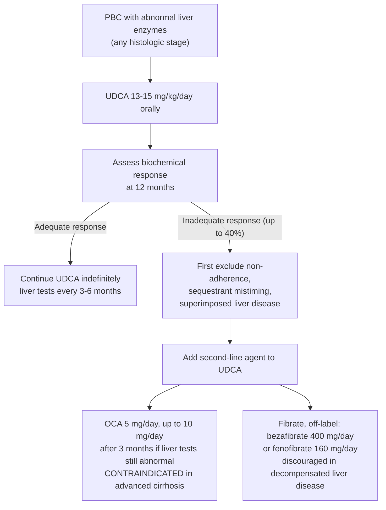

## Contents
- [[#What It Is]]
- [[#Dosing by Indication]]
  - [[#Administration]]
- [[#Primary Biliary Cholangitis]]
  - [[#Biochemical Response to UDCA (Assessed at 12 Months)]]
  - [[#Treatment Sequence]]
  - [[#Second-Line Agents]]
- [[#Primary Sclerosing Cholangitis]]
- [[#Intrahepatic Cholestasis of Pregnancy]]
- [[#After Liver Transplantation]]
- [[#Where UDCA Is Not Recommended]]
- [[#Adverse Effects and Interactions]]
- [[#Monitoring]]
- [[#See Also]]
- [[#Sources]]

---

## What It Is

- Oral hydrophilic bile acid; the only first-line drug therapy for [[primary-biliary-cholangitis|PBC]].
- **Mechanisms** (PBC): choleretic, cytoprotective, anti-inflammatory, immunomodulatory. ([[aasld-2018-pbc]])
- **In PBC, UDCA does:** improve liver biochemistries · slow histologic progression · reduce the risk of developing esophageal varices · lower LDL cholesterol · improve transplant-free survival (meta-analysis data on [[primary-biliary-cholangitis]]).
- **In PBC, UDCA does NOT:** improve fatigue, pruritus, bone disease, or associated autoimmune features — these need separate, symptom-directed therapy. ([[aasld-2018-pbc]])
- **Timing of effect:** liver tests improve within a few weeks; ~90% of the improvement occurs within **6–9 months**; ~**20%** normalize liver biochemistries after **2 years**. ([[aasld-2018-pbc]])

---

## Dosing by Indication

| Indication | Dose | Basis |
|---|---|---|
| **[[primary-biliary-cholangitis\|PBC]]** — abnormal liver enzymes, **any** histologic stage | **13–15 mg/kg/day** orally | [[aasld-2018-pbc]] Guidance Statement 5 |
| **PBC–[[autoimmune-hepatitis\|AIH]] overlap** | **13–15 mg/kg/day** with prednisone + azathioprine | [[aasld-2020-autoimmune-hepatitis]] |
| **[[primary-sclerosing-cholangitis\|PSC]]** — persistently elevated ALP/GGT, not eligible for or interested in a trial | **13–23 mg/kg/day** (*can be considered*, not recommended) | [[aasld-2022-psc]] Guidance Statement 12 |
| **PSC — high dose** | **≥28 mg/kg/day — do not use** (see harm signal below) | [[aasld-2022-psc]]; [[acg-2015-psc]] Rec 6 (*strong, high*) |
| **[[intrahepatic-cholestasis-of-pregnancy\|ICP]]** | **10–15 mg/kg/day** total daily dose, divided | [[aga-2024-pregnancy-gi-liver]] BPA 10; [[acg-2016-liver-disease-pregnancy]] Rec 13 (*strong, moderate*) |
| **PBC in pregnancy** | Continue the patient's existing UDCA — do not stop | [[acg-2016-liver-disease-pregnancy]] Rec 32 (*strong, very low*) |
| **Recurrent PBC after [[liver-transplantation\|liver transplant]]**, histologically proven | **10–15 mg/kg/day** | [[aasld-2012-liver-transplant-long-term]] Rec 84 (*grade 2, level B*) |

**Why 13–15 mg/kg/day in PBC:** a three-arm dose-comparison study found 13–15 mg/kg/day superior to both a **lower** dose of **5–7 mg/kg/day** and a **higher** dose of **23–25 mg/kg/day** in biochemical response and cost. ([[aasld-2018-pbc]])

### Administration

- Initiate gradually. Generally given in **two divided doses**; can be given **once daily, particularly at bedtime**, to improve compliance. ([[aasld-2018-pbc]])
- **No dose adjustment for renal or hepatic impairment.** ([[aasld-2018-pbc]])
- **Bile acid sequestrants and some antacids interfere with absorption.** Give UDCA **at least 1 hour before or 4 hours after** the sequestrant. ([[aasld-2018-pbc]] Guidance Statement 6)
- Formulations differ: a pharmacokinetic study in normal volunteers found substantial bioavailability differences by preparation; formulations have not been compared head-to-head in PBC. ([[aasld-2018-pbc]])
- Continued **indefinitely** in PBC — no data support discontinuation.

---

## Primary Biliary Cholangitis

UDCA is indicated for every PBC patient with abnormal liver enzyme values regardless of histologic stage. Patients at an earlier histologic stage respond more favorably, but those with advanced disease may still benefit in survival or avoidance of transplant. Treatment response is similar in AMA-negative and AMA-positive PBC. ([[aasld-2018-pbc]])

### Biochemical Response to UDCA (Assessed at 12 Months)

**Biochemical response should be evaluated at 12 months after initiation** to decide whether the patient should be considered for second-line therapy ([[aasld-2018-pbc]] Guidance Statement 7). Any one of the following published binary criteria may be used; **up to 40%** of patients are inadequate responders by one of these definitions.

| Criteria (arranged by year) | Response definition |
|---|---|
| Rochester I | ALP ≤2× ULN |
| Barcelona | Reduction in ALP ≥40% from baseline, or normalization of ALP |
| Paris I | ALP ≤3× ULN; AST ≤2× ULN; **and** total bilirubin ≤1 mg/dL |
| Rotterdam | Total bilirubin <1× ULN **and** albumin >1× LLN |
| Toronto | ALP ≤1.67× ULN |
| Paris II | ALP ≤1.5× ULN; AST ≤1.5× ULN; **and** total bilirubin ≤1 mg/dL |
| Rochester II | ALP ≤2× ULN |
| Global | ALP ≤2× ULN |

*ALP, alkaline phosphatase; AST, aspartate aminotransferase; ULN, upper limit of normal; LLN, lower limit of normal. Paris I/II require **all** listed components; the single-analyte criteria require only the one. ([[aasld-2018-pbc]] Table 1)*

- The **"Global" row above is a binary ALP criterion** and is not the same thing as the continuous **GLOBE score**; the continuous GLOBE and UK-PBC prognostic models — and their variables and thresholds — are on [[primary-biliary-cholangitis]].
- Serum **ALP and total bilirubin** are the biochemical values that predict outcome on treatment.
- **Liver biopsy is not indicated to monitor response to therapy.** ([[aasld-2018-pbc]])
- **Before calling a patient an inadequate responder, account for the mimics:** non-adherence, a superimposed liver disease (including fatty liver), and co-administration with a bile sequestrant. ([[aasld-2018-pbc]])

### Treatment Sequence

### Second-Line Agents

Both are added for **inadequate response to UDCA**; obeticholic acid (OCA) may also be used as monotherapy in patients intolerant of UDCA.

| Agent | Dose | Caveat that gates its use |
|---|---|---|
| **Obeticholic acid (OCA)** — FXR agonist | Start **5 mg/day**; after **3 months** may increase to **10 mg/day** if liver chemistries remain abnormal and it is tolerated | **Contraindicated in advanced cirrhosis.** Careful monitoring of **any** cirrhotic on OCA, even if not advanced. ([[aasld-2021-pbc]] Revised Guidance Statement 10) |
| **Fibrates** — PPAR agonists, **off-label** (approved only as lipid-lowering drugs) | **Bezafibrate 400 mg/day** or **fenofibrate 160 mg/day** | **Discouraged in decompensated liver disease**; not studied there. ([[aasld-2021-pbc]] Revised Guidance Statement 9) |

- **"Advanced cirrhosis"** = [[cirrhosis]] with **current or prior** evidence of liver decompensation (e.g. [[hepatic-encephalopathy|encephalopathy]], coagulopathy) **or** [[portal-hypertension|portal hypertension]] (e.g. [[ascites]], gastroesophageal varices, or persistent thrombocytopenia). A single resolved decompensating event still counts. [[aasld-2021-pbc]] sets no platelet cutoff for "persistent thrombocytopenia" and no INR cutoff for "coagulopathy."
- **What changed:** [[aasld-2018-pbc]] discouraged OCA **and** fibrates in decompensated liver disease defined as **Child-Pugh-Turcotte B or C** (after a September 2017 FDA warning). [[aasld-2021-pbc]], following a **May 2021** FDA warning, makes OCA **contraindicated** and redefines the trigger as advanced cirrhosis — a broader net, since a Child-Pugh A patient with varices or persistent thrombocytopenia now qualifies.
- Efficacy data for OCA (POISE) and the fibrates (BEZURSO and the open-label series) are on [[primary-biliary-cholangitis]].
- **Doubling the UDCA dose** — and adding colchicine, methotrexate, or silymarin — gave no benefit beyond UDCA alone. ([[aasld-2018-pbc]])

---

## Primary Sclerosing Cholangitis

No approved pharmacotherapy exists for PSC; all patients should be considered for a clinical trial first. ([[aasld-2022-psc]] Guidance Statement 11)

- **High dose is harmful — do not use.** [[aasld-2022-psc]] avoids **≥28 mg/kg/day**; [[acg-2015-psc]] Rec 6 states **>28 mg/kg/day should not be used** (*strong recommendation, high quality of evidence*). The controlled trial of **28–30 mg/kg/day** vs placebo (150 patients) was terminated early for futility, with excess serious adverse events (transplant, varices, death) and increased colorectal neoplasia in PSC–[[ulcerative-colitis|UC]].
- **13–23 mg/kg/day *can be considered*** — not recommended — in patients not eligible for or not interested in a trial who have **persistently elevated ALP or GGT**. Confirm the elevation is persistent by **observing 6 months** before starting; continue only if there is meaningful reduction or normalization of ALP (GGT in children) and/or symptom improvement **within 12 months** of treatment. ([[aasld-2022-psc]] Guidance Statement 12)
- The two guidelines differ in emphasis: ACG 2015 recommends against high-dose UDCA and takes no supportive position on lower doses; the newer AASLD 2022 keeps the high-dose prohibition but softens to "can be considered" at 13–23 mg/kg/day. The newer guidance governs. No data favor the low over the intermediate dose.
- UDCA has **not** been shown effective for pruritus in PSC. ([[aasld-2022-psc]])
- **Withdrawal** of UDCA in PSC has been associated with increases in fatigue, pruritus, liver biochemistries, and the Revised Mayo Risk Score. ([[aasld-2022-psc]])
- Safe in pregnancy and lactation; may be continued. ([[aasld-2022-psc]])

---

## Intrahepatic Cholestasis of Pregnancy

- **UDCA 10–15 mg/kg/day**, total daily dose, divided — **first-line** once ICP is diagnosed (serum bile acids >10 μmol/L with pruritus). ([[aga-2024-pregnancy-gi-liver]] BPA 10; [[acg-2016-liver-disease-pregnancy]] Rec 13)
- Improves pruritus and lowers serum bile acids and ALT; meta-analysis found **decreased preterm birth and stillbirth**. ([[aga-2024-pregnancy-gi-liver]])
- **More effective than cholestyramine or dexamethasone** for pruritus control; increases bile salt export pump expression and placental bile transporters. ([[acg-2016-liver-disease-pregnancy]])
- UDCA is **pregnancy category B**. Data in the first trimester are limited, so caution is warranted with first-trimester *initiation*. ([[acg-2016-liver-disease-pregnancy]])
- Delivery-timing thresholds by bile acid level are on [[intrahepatic-cholestasis-of-pregnancy]] and [[liver-disease-in-pregnancy]].

---

## After Liver Transplantation

- **Recurrent PBC, histologically proven:** UDCA **10–15 mg/kg/day** may be considered — it improves liver tests, but **no impact on graft survival has been documented** (*grade 2, level B*). ([[aasld-2012-liver-transplant-long-term]] Rec 84). OCA is the second-line option for recurrent PBC. ([[aasld-ast-2025-liver-transplant-graft-complications]])
- **No prophylactic UDCA** for a PBC recipient whose allograft histology is normal (*grade 2, level B*). ([[aasld-2012-liver-transplant-long-term]] Rec 84)
- **Recurrent PSC:** UDCA is not proven effective and is not routinely recommended. ([[aasld-2012-liver-transplant-long-term]])

---

## Where UDCA Is Not Recommended

| Setting | Position |
|---|---|
| **[[nafld-masld\|NASH/MASH]]** | **Should not be used.** Well studied; no meaningful histologic benefit. ([[aasld-2023-nafld]] Guidance Statement 28) |
| **PSC at ≥28 mg/kg/day** | Harmful — see above ([[aasld-2022-psc]]; [[acg-2015-psc]] Rec 6) |
| **PBC after transplant with normal allograft histology** | No prophylaxis ([[aasld-2012-liver-transplant-long-term]] Rec 84) |
| **Recurrent PSC after transplant** | Not proven effective; not routinely recommended ([[aasld-2012-liver-transplant-long-term]]) |
| **Secondary sclerosing cholangitis in [[hereditary-hemorrhagic-telangiectasia\|HHT]]** | May be used, but **no data support it** ([[acg-2020-hepatic-mesenteric-circulation]]) |
| **Fatigue, pruritus, or bone disease in PBC** | Ineffective — treat these separately ([[aasld-2018-pbc]]) |

---

## Adverse Effects and Interactions

- **Minimal side effects; generally well tolerated.** ([[aasld-2018-pbc]])
- **~5-pound weight gain** over the first year of therapy — reported, and **not progressive**.
- **Loose stools and/or thinning of the hair** — reported infrequently.
- **Absorption interaction:** cholestyramine, colestipol, colesevelam and some antacids bind UDCA — separate the doses (≥1 hour before or 4 hours after).
- **Dose-related harm at high dose in PSC** (≥28 mg/kg/day): serious adverse events including transplant, varices and death, plus increased colorectal neoplasia in PSC–UC.

---

## Monitoring

| What | When | Setting |
|---|---|---|
| Liver tests | Every **3–6 months** | PBC on UDCA ([[aasld-2018-pbc]] Table 2) |
| Formal biochemical response (criteria table above) | At **12 months** after initiation | PBC — decides second-line therapy ([[aasld-2018-pbc]] GS 7) |
| ALP (or GGT in children) ± symptoms | Within **12 months** of starting; observe **6 months** before starting to confirm persistent elevation | PSC — decides whether to continue UDCA ([[aasld-2022-psc]] GS 12) |
| Liver function, on OCA | "Careful monitoring" of **any** patient with cirrhosis, even if not advanced | PBC second-line ([[aasld-2021-pbc]]) — no specific test or interval is given |
| Liver biopsy | **Not indicated** to monitor treatment response | PBC ([[aasld-2018-pbc]]) |

The full PBC follow-up schedule (TSH, bone density, fat-soluble vitamins, variceal screening, [[hcc-surveillance|HCC surveillance]]) is on [[primary-biliary-cholangitis]].

---

## See Also

[[primary-biliary-cholangitis]], [[primary-sclerosing-cholangitis]], [[intrahepatic-cholestasis-of-pregnancy]], [[liver-disease-in-pregnancy]], [[autoimmune-hepatitis]], [[nafld-masld]], [[liver-transplantation]], [[cirrhosis]], [[portal-hypertension]], [[ascites]], [[hepatic-encephalopathy]], [[hereditary-hemorrhagic-telangiectasia]], [[abnormal-liver-chemistries]], [[hcc-surveillance]], [[liver-stiffness-measurement]], [[ulcerative-colitis]], [[liver-biopsy]]

---

## Sources

1. [[aasld-2018-pbc|AASLD 2018 Practice Guidance: Primary Biliary Cholangitis]]
2. [[aasld-2021-pbc|AASLD 2021 Practice Guidance Update: Primary Biliary Cholangitis]]
3. [[aasld-2022-psc|AASLD 2022 Practice Guidance on Primary Sclerosing Cholangitis and Cholangiocarcinoma]]
4. [[acg-2015-psc|ACG 2015 Clinical Guideline: Primary Sclerosing Cholangitis]]
5. [[aga-2024-pregnancy-gi-liver|AGA Clinical Practice Update on Pregnancy-Related Gastrointestinal and Liver Disease: Expert Review]]
6. [[acg-2016-liver-disease-pregnancy|ACG Clinical Guideline: Liver Disease and Pregnancy (2016)]]
7. [[aasld-2023-nafld|AASLD Practice Guidance on the Clinical Assessment and Management of Nonalcoholic Fatty Liver Disease (2023)]]
8. [[aasld-2012-liver-transplant-long-term|AASLD/AST 2012: Long-Term Management of the Successful Adult Liver Transplant]]
9. [[aasld-ast-2025-liver-transplant-graft-complications|AASLD/AST 2025: Practice Guideline on Adult Liver Transplantation — Diagnosis and Management of Graft-Related Complications]]
10. [[aasld-2020-autoimmune-hepatitis|AASLD Practice Guidance on Autoimmune Hepatitis (2020)]]
11. [[acg-2020-hepatic-mesenteric-circulation|ACG Clinical Guideline: Disorders of the Hepatic and Mesenteric Circulation]]
