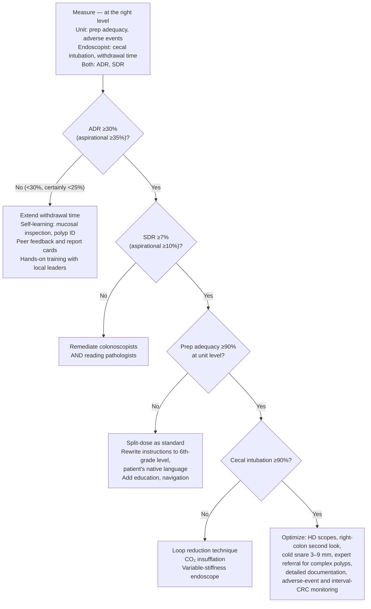

# Colonoscopy Quality Indicators

Colonoscopy's efficacy varies among endoscopists, and lower-quality colonoscopies are associated with higher interval CRC incidence and mortality. Quality has three components: **effectiveness** (detecting [[colorectal-cancer|CRC]] and its precursors), **safety**, and **value** (avoiding unnecessary costs). [[aga-2021-colonoscopy-quality]]

## Contents
- [[#The Benchmark Set]]
  - [[#Which Level to Measure At, and Why]]
  - [[#Denominators — What Actually Goes in the Numerator and Denominator]]
- [[#Bowel Preparation Adequacy]]
- [[#Cecal Intubation]]
- [[#Withdrawal Time]]
- [[#Adenoma Detection Rate (ADR)]]
- [[#Serrated Lesion Detection Rate (SDR)]]
- [[#Unnumbered Best Practices]]
- [[#Documentation]]
- [[#Adverse Events]]
- [[#Interval Adherence]]
- [[#Remediation — What to Do When a Metric Misses]]
  - [[#Tiers of Colonoscopy Quality]]
- [[#Where the Benchmarks Differ Between Documents]]

---

## The Benchmark Set

*[[aga-2021-colonoscopy-quality|AGA 2021]] — 15 Best Practice Advice statements, ungraded (the update assigns no evidence grade or strength of recommendation to any statement).*

| Metric | Goal | Aspirational target | Measured at |
|---|---|---|---|
| Bowel preparation adequacy rate | **≥90%** | ≥95% | Unit level |
| Cecal intubation rate | **≥90%** | ≥95% | Endoscopist level |
| Withdrawal time (mean, normal colonoscopies) | **≥6 min** | ≥9 min | Endoscopist level |
| Adenoma detection rate (ADR) | **≥30%** | ≥35% | Endoscopist **and** unit level |
| Serrated lesion detection rate (SDR) | **≥7%** | ≥10% | Endoscopist **and** unit level |
| Adverse events | Measure and report; no numeric target is given | — | Unit level |

**If resources are limited, measure these three first: cecal intubation rate, bowel preparation quality, and ADR.**

### Which Level to Measure At, and Why

- **Uncommon outcomes** (adverse events) and metrics reflecting **system-based practice** (bowel preparation quality) → aggregate **unit-level** measurement.
- Metrics that primarily reflect **colonoscopist skill** (ADR) → **endoscopist-level** measurement, so individual feedback is possible.

### Denominators — What Actually Goes in the Numerator and Denominator

| Metric | Denominator | Numerator / definition | Measurement frequency |
|---|---|---|---|
| **ADR** | All **screening** colonoscopies in patients **aged 50–75 y**; surveillance and diagnostic exams **excluded** | Colonoscopies with **confirmed adenomas**; **serrated polyps excluded** | Intervals of **≥250 screening colonoscopies** — semi-annually if high volume, annually if lower volume |
| **SDR** | Total screening colonoscopies in the period | Screening colonoscopies with **≥1 sessile serrated lesion** | Denominator of **≥500 screening colonoscopies, or annually**, preferred |
| **Cecal intubation rate** | **All screening and surveillance** colonoscopies | Cecum reached | — |
| **Withdrawal time** | An endoscopist's **normal cases only** (no biopsies or [[polypectomy]]) | Time from **cecal intubation to procedure completion**, reported as the **mean** | — |
| **Bowel prep adequacy** | Screening and surveillance colonoscopies | BBPS **≥6 with each segment score ≥2** | At a minimum **annually** |

---

## Bowel Preparation Adequacy

- **Adequate = Boston Bowel Preparation Scale (BBPS) total ≥6 *and* every segment score ≥2.** Both halves are required — a total of 6 built on a segment scoring 0 or 1 is not adequate.
- BBPS scores each segment (right, transverse, left) **0 (unprepared colon) to 3 (entire segment well seen)**. It is **preferred over the modified Aronchick score** (single global excellent/good/fair/poor/inadequate rating) because it is applied **after cleaning** and has been rigorously validated.
- Suboptimal cleansing causes failed detection of **flat or otherwise subtle polyps**; the impact is **most pronounced in the proximal colon**, reducing detection of both adenomas and sessile serrated lesions.
- Preparation regimens, salvage maneuvers, indication-specific adequacy wording, and the full scale anchors live on [[colonoscopy#Bowel Preparation|colonoscopy]].

**Two prep practices carried as advice rather than as a measured rate:**

- **Split-dose preparation is the standard strategy** — one-half to three-quarters of the purgative the evening before, the remainder **4–6 h before the start** of colonoscopy. **Same-day preparation** (purgative the morning of the procedure, finished **2–4 h before the scheduled appointment**) is **equally efficacious for afternoon examinations** and may be preferred for less disruption of activities and sleep.
- **Written instructions at a sixth-grade (or lower) reading level, in the patient's native language.** More than one-third of the US population has limited health literacy. Units with suboptimal prep quality should add patient education and support: instructional videos and **patient navigation** (trained staff helping patients overcome barriers) improve prep adequacy, particularly in low-literacy populations; smartphone apps and text messaging help but **may not be as universally effective as traditional navigation**.

---

## Cecal Intubation

- **≥90% of all screening and surveillance colonoscopies**; **≥95% if exams with inadequate bowel preparation are excluded** — that exclusion is the whole difference between the two numbers.
- Failure to reach the cecum should be rare in skilled hands **except with inadequate preparation or an obstructing lesion**.
- Low rates track with **diminished neoplasia detection, higher interval CRC incidence**, and the cost of repeat or alternative testing.
- **Photodocument the cecal landmarks — appendiceal orifice and ileocecal valve — in the report.**
- Levers for low performers (limited evidence): **loop reduction technique, CO₂ insufflation, variable-stiffness endoscopes**.

---

## Withdrawal Time

- **Mean ≥6 minutes in normal colonoscopies; aspirational ≥9 minutes.** Measured cecal intubation → procedure completion, on cases with no biopsy or polypectomy.
- **≥6 min** differentiates endoscopists with higher detection of adenomas and advanced neoplasia and is linked to **lower risk of post-colonoscopy CRC**; **incremental gains in adenomas *and* sessile serrated lesions appear at ≥9 min**.
- Withdrawal time is a **surrogate for inspection quality** and is most valuable **monitored alongside ADR** — lengthening withdrawal without a matching focus on inspection quality may not improve ADR. For an endoscopist with a substandard ADR *and* a low withdrawal time, improving the quality and time spent inspecting improves both.

---

## Adenoma Detection Rate (ADR)

- **Goal ≥30% for an individual endoscopist; aspirational ≥35%.** A single threshold for both sexes — **sex-based ADRs may be needed only for a significantly male- or female-predominant practice**, since adenoma prevalence is significantly higher in males.
- **ADR varies up to 5-fold among colonoscopists**; unmeasured, a colonoscopist cannot know where they sit.
- Prior guidelines set the bar at **25%**; recent data suggest interval CRC risk falls further at an ADR of **roughly 35% or higher**. **ADR <30% — and certainly <25% — calls for focused improvement.** The case for ≥35% rests on an apparent linear relationship across the range over which ADR improved from **19% to 33.5%** in prior research, and needs confirmation.
- Measure and give feedback at **both endoscopist and unit level**, at minimum annually or per 250 accrued screening colonoscopies.

**Improvement levers (from the same update):**

| Lever | What the evidence shows |
|---|---|
| Report cards / audit and feedback | Modestly effective, particularly for **low-performing** colonoscopists |
| Hands-on training with local leaders | Improved ADR **significantly more than quality feedback alone** |
| Quality-improvement "champions" in the unit | A primary component of sustainable educational intervention |
| Educational content that works | Adequate withdrawal time, looking **behind folds**, cleaning the colon, recognizing subtle lesions |
| Electronic chromoendoscopy (eg, narrow band imaging) on withdrawal | Higher ADR among **experienced** colonoscopists; particularly helpful for **flat** lesions |
| Distal-tip accessory devices | Improve mucosal exposure; **modest** ADR gains |
| Water exchange (instil and suction water on insertion, no air/CO₂) | Improves ADR, likely via better colon cleansing |
| Computer-aided detection (CADe) | Named only as anticipated future work here; the evidence and the AGA position are on [[artificial-intelligence-endoscopy]] |

---

## Serrated Lesion Detection Rate (SDR)

- **Goal ≥7% for an individual endoscopist; aspirational ≥10%.** Calculated analogously to ADR: screening colonoscopies with **≥1 sessile serrated lesion** ÷ total screening colonoscopies.
- **SDR depends on pathologist interpretation more than ADR does** — sessile serrated lesions are underdiagnosed by pathologists, so **remediation must target both the colonoscopist and the reading pathologists**.
- ADR and SDR are **highly correlated; if only one can be collected, prioritize ADR.** SDR's practical limitation is the **larger denominator** needed for a confident estimate (lower lesion prevalence) — use **≥500 screening colonoscopies, or an annual window**.
- There is a clear association between **withdrawal time and SDR**.

---

## Unnumbered Best Practices

Advice statements without a measurable rate attached:

- **High-definition colonoscopes for screening and surveillance.** Meta-analysis of RCTs confirms a **definite but modest** impact on adenoma, serrated polyp, and advanced adenoma detection. Many legacy lower-definition instruments remain in circulation; upgrading is an effective unit-level strategy.
- **Second look of the right colon, retroflexed or forward view.** The right colon is the **most frequent location for missed CRCs and polyps** — largely flat and serrated lesions that are hard to see even with adequate prep. A second look **increases ADR by 5%–20%**. *Technique:* insert to the base of the cecum, withdraw to the hepatic flexure inspecting and removing polyps, then **reintubate the cecum** and examine the proximal colon a second time. **Retroflexion and forward view are equally effective**; the second look matters most if polyps were found on first pass or the completeness of the first inspection is in doubt.
- **Cold snare polypectomy for nonpedunculated polyps 3–9 mm**, aiming for a **small rim of normal tissue** around the polyp — equally efficacious to hot snare, **substantially reduces delayed post-polypectomy bleeding**, avoids thermal injury. Technique details for every size band: [[polypectomy]].
- **Forceps limits.** Avoid forceps generally for polyps **>2 mm**; **standard cold forceps** carry a high rate of residual neoplasia and **hot biopsy forceps should not be used** (deep thermal injury). Narrow exceptions: **jumbo forceps for diminutive polyps ≤2 mm**, or **polyps ≤5 mm in locations that preclude a snare**. **Never the primary modality for polyps >5 mm.** Residual neoplasia is found at roughly **14% of post-polypectomy sites**.
- **Refer benign complex polyps for endoscopic resection, not surgery.** Endoscopic resection of nonmalignant colon polyps is **more cost-effective with a lower adverse event rate** than surgery, yet many are still sent to surgery because a "large" polyp is misjudged as malignant. Colonoscopists should be educated on the endoscopic features of **covert malignancy — a depressed component, nongranular lesions**. With no overt features of deep invasion, offer [[endoscopic-mucosal-resection|endoscopic resection]] by an expert in polypectomy. **For a lesion you are referring, avoid partial removal, tattoo injected *underneath* the polyp, and multiple biopsies** — each induces fibrosis and makes later endoscopic resection technically difficult.

---

## Documentation

A detailed report covering **indication, extent of examination, bowel preparation quality, findings and interventions, and the follow-up plan with its rationale**. The **CO-RADS** standardized colonoscopy reporting and data system (National Colorectal Cancer Roundtable, 2007) lists the elements:

| Element | Required content |
|---|---|
| Patient | Demographics and history; assessment of risk and comorbidity |
| Indication | Reason for the procedure |
| Technical description | Extent of examination, **bowel preparation adequacy**, and **withdrawal time where appropriate** |
| Findings and assessment | Interventions and unplanned events |
| Follow-up plan | Includes **resumption of medications — anticoagulants and antiplatelet agents** ([[anticoagulation-gi-bleeding]]) |
| Pathology and interval | Communicated to the **patient and the primary care provider** and documented in the chart |

**If the assigned interval deviates from standard guidelines, the report must state the rationale** — eg, inadequate preparation or incomplete polyp resection.

---

## Adverse Events

- Most serious events: **colonic perforation; adjacent organ injury such as splenic rupture; serious post-procedure bleeding**.
- **After routine colonoscopy: delayed bleeding ~0.24%, perforation ~0.06%.**
- **After endoscopic resection of large polyps: bleeding 4.3%–7.6%, perforation 0.2%–0.6%** — rates that predominantly reflect polypectomy by high-volume experts.
- **Most adverse events occur within 14 days**; risk rises with **age, comorbidity, and performance of polypectomy**.
- Every patient is counselled by the colonoscopist on possible events and their symptoms, and given **contact information** with instructions to call or seek emergency care for **severe abdominal pain, fever, significant bleeding, or other worrisome symptoms**.
- Optional unit-level systematic monitoring of **delayed** events: scheduled phone calls; administrative data on post-procedure bleeding and perforation, hospital readmission or ED visits, patient deaths, and interval CRC. **Perforations, deaths, and interval CRC cases should be reviewed for quality improvement.**
- Complication management and the ≤1 per 100 colonoscopies post-polypectomy bleeding benchmark are on [[colonoscopy#Complications|colonoscopy]].

---

## Interval Adherence

Assigning the guideline-concordant interval is itself a quality indicator — non-adherence produces both interval CRC (surveillance too late) and unnecessary harm and cost (surveillance too early). **The full interval grids live on [[colonoscopy-surveillance]]**; the two rules this update states outright:

- **Advanced adenoma → repeat colonoscopy in 3 years** (advanced precancerous lesions carry the highest risk of metachronous advanced neoplasia; follow-up ≤3 y after the index exam).
- **Average-risk patient with a high-quality colonoscopy negative for precancerous polyps, or with only small distal hyperplastic polyps → do not rescreen before 10 years.**
- **1–2 small adenomas (especially 1–2 diminutive adenomas):** increasing evidence that these patients are **not at significantly elevated CRC risk versus the general population**, and endoscopists **should consider assigning a 10-year interval** for this group — longer than the 7–10 y the surveillance grid assigns.

---

## Remediation — What to Do When a Metric Misses

*Ladder rebuilt from the update's Best Practice Advice and its tiers-of-quality figure.*

### Tiers of Colonoscopy Quality

| Tier | Poor | Variable | Adequate | Optimal |
|---|---|---|---|---|
| **Bowel preparation** | High risk of inadequate prep | Variable | Adequate for all patient groups | Adequate for all patient groups |
| **Withdrawal** | Insufficient withdrawal quality and time | Variable withdrawal quality and time, occasionally insufficient | Average withdrawal time and quality meets minimal standards | Average withdrawal time and quality **exceeds** minimal standards |
| **Polyp detection** | Suboptimal | Suboptimal | Meets benchmark levels | **Exceeds** benchmarks, may meet aspirational targets |
| **Polypectomy** | — | Improved documentation, but may lack important details | Low rate of incomplete or inadequate polypectomy | Performed with high degree of skill and accuracy; appropriate referral for EMR of large polyps and avoidance of surgery for benign polyps |
| **Documentation** | Poor | Improved but may lack important details | Meets minimal standards | Detailed, including photodocumentation and polyp details |
| **Surveillance intervals** | Inappropriate recommendations | May vary from guidelines | Low rate of inappropriate recommendations | Appropriate for all patients |

**The corresponding interventions, by tier:**

| Tier | Recommended measures and interventions |
|---|---|
| **Tier 1 — all providers** | Adequate bowel preparation ≥90%; use of split preps; measurement of withdrawal time; measurement of ADR; meeting ADR benchmarks; interventions to improve polyp detection for low detectors; minimum procedure documentation; adherence to guideline-recommended surveillance intervals |
| **Tier 2 — quality improvement** | Interventions to improve bowel preparation for all patients; interventions to improve polyp detection for **all** providers; interventions to improve polypectomy practices |
| **Tier 3 — optimizing quality** | All providers continuously monitor and optimize polyp detection; optimized care for patients with large polyps; detailed procedure documentation; monitoring of adverse events and interval cancer rates |

---

## Where the Benchmarks Differ Between Documents

Same metrics, different numbers and denominators across ingested guidelines. Audit against the document whose population matches your exam, and say which one you used.

| Metric | [[aga-2021-colonoscopy-quality\|AGA 2021 CPU]] | [[acg-2021-crc-screening\|ACG 2021]] | [[usmstf-2020-followup-colonoscopy\|USMSTF 2020]] |
|---|---|---|---|
| **ADR** | **≥30%** for an individual endoscopist (aspirational ≥35%), one threshold for both sexes; sex-based ADR only for a markedly sex-skewed practice | **≥25%** overall is the remedial-training trigger | **≥30% men / ≥20% women** as the high-quality-exam prerequisite |
| **Cecal intubation** | **≥90%** of screening + surveillance exams; **≥95%** when inadequately prepped exams are excluded | **≥90% overall, ≥95% in screening subjects** | Complete to cecum with photodocumented landmark |
| **Withdrawal time** | Mean **≥6 min** in normal exams, aspirational **≥9 min** | **≥6 min** of mucosal inspection | Not specified |
| **1–2 small adenomas** | **Consider 10 y** | — | **7–10 y** (see [[colonoscopy-surveillance]]) |

The AGA and ACG documents publish the same pair of cecal-intubation numbers against **different denominators** — a 95% target earned by excluding poorly prepped exams is not the same as a 95% target in screening exams. The ADR figures are not reconciled by any of the three documents.

---

## See Also

[[colonoscopy]], [[colonoscopy-surveillance]], [[polypectomy]], [[colorectal-cancer-screening]], [[colorectal-cancer]], [[artificial-intelligence-endoscopy]], [[endoscopic-mucosal-resection]], [[anticoagulation-gi-bleeding]], [[upper-endoscopy]]

---

## Sources

1. [[aga-2021-colonoscopy-quality|AGA 2021 Clinical Practice Update on Strategies to Improve Quality of Screening and Surveillance Colonoscopy: Expert Review]]
2. [[acg-2021-crc-screening|ACG Clinical Guidelines: Colorectal Cancer Screening 2021]]
3. [[usmstf-2020-followup-colonoscopy|USMSTF 2020: Recommendations for Follow-Up After Colonoscopy and Polypectomy]]
