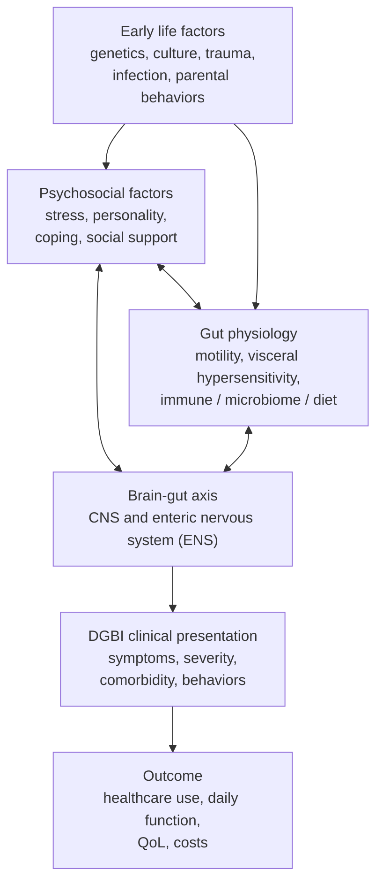

## Contents
- [[#Definition]]
- [[#Rome V Classification]]
  - [[#Adult DGBI (Categories A–F)]]
  - [[#Pediatric DGBI (Categories G–H)]]
- [[#Rome V Diagnostic Criteria Framework]]
  - [[#Standard Rome V Research Criteria]]
  - [[#Rome Clinical Criteria (New in Rome V)]]
- [[#Biopsychosocial Model]]
- [[#Brain–Gut Axis]]
- [[#IBS Severity Classification (Rome V, Table 4)]]
- [[#Treatment Framework]]
- [[#Managing Persistent Pain]]
  - [[#Visceral vs Centrally Mediated Pain]]
  - [[#Explaining Pain to the Patient]]
  - [[#Brain–Gut Psychotherapies]]
  - [[#Peripherally Acting Drugs for Pain in IBS]]
  - [[#Gut–Brain Neuromodulators]]
  - [[#Opioids]]
- [[#Key Changes from Rome IV to Rome V]]
- [[#Epidemiology]]
- [[#See Also]]
- [[#Sources]]

---

## Definition

**Disorders of gut–brain interaction (DGBI)** are a group of disorders characterized by gastrointestinal (GI) symptoms related to any combination of:

| Mechanism | Examples |
|---|---|
| Motility disturbance | Dysmotility, altered transit |
| Visceral hypersensitivity | Visceral hyperalgesia, allodynia |
| Altered mucosal and immune function | Mast cell activation, barrier dysfunction |
| Altered gut microbiota | Dysbiosis, reduced microbial diversity |
| Altered central nervous system (CNS) processing | Impaired descending pain modulation |

The term DGBI replaced "functional gastrointestinal disorder" (FGID) when Rome IV introduced it in 2016. With **Rome V (2026)**, "functional GI disorder" is formally retired and should no longer be used. The word "functional" is also removed from individual diagnoses where possible (e.g., "functional constipation" → "[[chronic-constipation|chronic constipation]]").

**Source:** [[rome-v-2026-dgbi]]

---

## Rome V Classification

Rome V (2026) classifies **34 adult** and **22 pediatric** DGBI across anatomic domains.

### Adult DGBI (Categories A–F)

| Category | Disorders |
|---|---|
| **A. Esophageal** | Functional chest pain (A1), [[functional-heartburn\|Functional heartburn]] (A2), Reflux hypersensitivity (A3), Globus (A4), Functional [[dysphagia]] (A5) |
| **B. Gastroduodenal** | Functional [[dyspepsia]] — postprandial distress syndrome (PDS; B1a), epigastric pain syndrome (EPS; B1b); [[nausea-and-vomiting\|Nausea/vomiting]]: chronic nausea vomiting syndrome (CNVS; B2a), [[cyclic-vomiting-syndrome\|cyclic vomiting syndrome (CVS)]] (B2b), [[cannabinoid-hyperemesis-syndrome\|cannabinoid hyperemesis syndrome (CHS)]] (B2c); Belching: supragastric (B3a), gastric (B3b), **inability to belch** (B3c, *new*); [[rumination-syndrome\|Rumination]] (B4) |
| **C. Bowel** | [[irritable-bowel-syndrome\|irritable bowel syndrome (IBS)]] with subtypes (C1a–d); [[chronic-idiopathic-constipation\|Chronic constipation]] (C2); Functional diarrhea (C3); [[abdominal-bloating-and-distention\|Functional abdominal bloating]] (C4); Unclassified bowel disorders (C5); Opioid-induced constipation (C6) |
| **D. Centrally mediated GI pain** | Centrally mediated abdominal pain syndrome (CAPS; D1); **Abdominal migraine** (D2, *new adult diagnosis*); Narcotic bowel syndrome (D3) |
| **E. Gallbladder and [[sphincter-of-oddi-dysfunction\|sphincter of Oddi dysfunction (SOD)]]** | Biliary-type pain (E1); Dysfunctional gallbladder disorder (E2); Biliary SOD (E3); Pancreatic SOD (E4) |
| **F. Anorectal** | [[fecal-incontinence\|Fecal incontinence]] (F1); [[proctalgia-syndromes\|Anorectal pain]] (F2a–c); [[defecation-disorders\|Dyssynergic defecation]] (F3); **Anorectal sensory dysfunction** (F4, *new*): rectal hyposensitivity (F4a), rectal hypersensitivity (F4b) |

### Pediatric DGBI (Categories G–H)

Reorganized in Rome V from age-based (neonate/toddler vs. child/adolescent) to anatomically based:

- **G. Pediatric upper DGBI:** Esophageal (G1), feeding disorders (G2), gastroduodenal (G3)
- **H. Pediatric lower and biliary DGBI:** Abdominal pain disorders (H1), defecation/anorectal (H2), discomfort disorders (H3)

---

## Rome V Diagnostic Criteria Framework

### Standard Rome V Research Criteria

Used for clinical trials and research; require specific symptom frequency and 6-month duration threshold.

### Rome Clinical Criteria (New in Rome V)

Designed for clinical practice. More inclusive than research criteria.

| Criterion | Rome Clinical Criteria Rule |
|---|---|
| Qualitative symptoms | Must meet qualitative features of Rome V (symptom type/character) |
| Bothersomeness | Symptoms must interfere with daily activities or prompt healthcare seeking |
| Frequency | Lower than research threshold is permitted |
| Duration | 8 weeks suggested (not 6 months); exceptions: organic disease excluded, or infrequent-episode disorders (CVS, proctalgia fugax) |

**Clinical implication:** Approximately 25% of the population has bothersome GI symptoms but does not meet full Rome research criteria — these patients have poor quality of life (QoL), high anxiety/depression scores, and significant healthcare utilization. The Rome Clinical Criteria are designed to capture this group.

---

## Biopsychosocial Model

The central conceptual framework for DGBI. Factors operate bidirectionally:

**Key psychosocial principles:**

1. Psychological stress exacerbates GI symptoms and may contribute to DGBI development (e.g., [[postinfectious-ibs|post-infection IBS]])
2. Psychological distress is strongly associated with DGBI — global study (N>54,000): 4.45× higher odds of DGBI in patients with psychological distress
3. DGBI itself creates psychosocial consequences (chronic illness as stressor)
4. Maladaptive cognitions (catastrophizing, hypervigilance) perpetuate and amplify symptoms → visceral anxiety → lower pain threshold → need for brain–gut behavioral treatments

---

## Brain–Gut Axis

The neuroanatomic substrate connecting CNS (brain, spinal cord) and ENS (myenteric plexus) through:

- Autonomic nervous system (sympathetic, parasympathetic)
- Neuroendocrine and neurohumoral systems
- Microbiome–gut–brain axis (emerging concept)

**Pain regulation:** Brain nuclei (anterior cingulate cortex, amygdala, parabrachial nucleus, locus coeruleus) modify incoming visceral pain via descending modulation (gate control mechanism). In DGBI, down-regulation is impaired → lowered pain threshold.

**Key neurotransmitters:** Serotonin and noradrenaline — targets for neuromodulator treatment (tricyclic antidepressants [TCAs], serotonin-norepinephrine reuptake inhibitors [SNRIs]).

**Physiological mechanisms in DGBI:**

- **Visceral hypersensitivity:** Lower pain threshold to balloon distension (visceral hyperalgesia) or increased sensitivity to normal GI function (allodynia)
- **Abnormal motility:** Exaggerated motor response to psychological/physiological stressors
- **Immune dysregulation/barrier dysfunction:** Mast cell activation, increased inflammatory cytokines → altered receptor sensitivity → visceral hypersensitivity; mucosal barrier dysfunction is a potential treatment target
- **Microbiome:** Reduced microbial diversity, altered bacterial flora composition implicated in IBS pathogenesis; duodenal microbiota involved in dyspeptic symptoms
- **Food/diet:** Low-FODMAP and gluten restriction may benefit subsets; role of diet increasingly recognized (patients have long attributed food as a major trigger)

---

## IBS Severity Classification (Rome V, Table 4)

| Feature | Mild (~40%) | Moderate (~35%) | Severe (~25%) |
|---|---|---|---|
| Functional Bowel Disorder Severity Scale (FBDSI) | <36 | 36–109 | >109 |
| IBS Symptom Severity Scale (IBS-SSS) | 75–175 | 176–300 | >300 |
| Physiology | Primarily bowel dysfunction | Bowel + CNS dysregulation | Primarily CNS dysregulation |
| Psychosocial | None or mild distress | Moderate distress | Severe distress, comorbidity, catastrophizing, trauma |
| Pain | Mild/intermittent | Moderate, frequent | Severe/very frequent |
| QoL | Good | Fair | Poor |
| Healthcare use | 0–1/year | 2–4/year | ≥5/year |
| Work disability | <5% | 6–10% | ≥11% |

---

## Treatment Framework

Severity-guided biopsychosocial approach:

**Mild:**

- Education (GI system is overly responsive to food, stress, hormones — legitimate disorder)
- Reassurance based on patient concerns
- Dietary modification; dietitian referral

**Moderate:**

- Symptom diary (1–3 weeks) to identify dietary/lifestyle/stress triggers
- Pharmacotherapy directed at predominant symptoms (antispasmodics, [[loperamide]] acutely; secretagogues, neuromodulators continuously)
- Brain–gut behavioral treatments: cognitive behavioral therapy (CBT), hypnosis, mindfulness

**Severe:**

- Ongoing therapeutic relationship; realistic treatment goals (improved QoL, not cure)
- Central neuromodulators: TCAs (pain + depression), SNRIs; selective serotonin reuptake inhibitors (SSRIs) ancillary (anxiety/depression but less effective for pain)
- Multidisciplinary DGBI treatment center referral

**Brain–gut behavioral treatments (all severities):**

- Cognitive behavioral therapy
- Gut-directed hypnotherapy
- Mindfulness-based interventions
- Target: reduce visceral anxiety, improve pain tolerance, restore sense of control

---

## Managing Persistent Pain

Applies to pain that **persists after first-line therapy directed at visceral stimuli** (food, bowel movements; [[proton-pump-inhibitors|proton pump inhibitors (PPIs)]] for esophageal/gastroduodenal DGBI such as [[functional-heartburn]] or functional dyspepsia (FD)). Dietary treatment, antidiarrheals, and laxatives are used frequently in IBS but have **limited evidence for abdominal pain**. Four components run in parallel: the patient–provider relationship, explaining pain, nonpharmacologic therapy, and pharmacologic therapy — with opioids avoided throughout. Not addressed: complementary/alternative therapies including marijuana, and abdominal wall or pelvic pain syndromes. [[aga-2021-chronic-gi-pain-dgbi]]

**The relationship is the platform** — collaborative, empathic, culturally sensitive:

- Take the history with a **nondirective interview using open-ended questions**; closed-ended questions later, for clarification.
- Ask explicitly how symptoms affect QoL and daily functioning (*"how do your symptoms interfere with your ability to do what you want in your daily life?"*) — also identifies who needs behavioral health.
- Ask about **symptom-specific anxiety**, and about the patient's own explanation (*"what do you think is causing your symptoms?"*, *"what are you most concerned about?"*). Many patients are relieved to hear that **a diagnosis of IBS or FD does not shorten life expectancy**.
- Agree a **shared set of goals and expectations**; revisit and modify as the relationship develops.

### Visceral vs Centrally Mediated Pain

The differentiation that selects the drug class.

| | Visceral (peripheral) | Centrally mediated |
|---|---|---|
| Pattern | Intermittent pain arising from peripheral stimulation | Persistent pain **even without ongoing peripheral stimulation** |
| Mechanism | Visceral hypersensitivity — common in both IBS and FD | **Central sensitization**; pain worsens with minimal non-painful stimulation (**allodynia**); CNS changes may be visible on imaging |
| Predisposing factors | — | History of abuse, anxiety, catastrophizing, hypervigilance (not limited to these) |
| Drug target | Peripherally acting drugs (below) | Gut–brain neuromodulators (below) |

### Explaining Pain to the Patient

Four messages the patient must hear: (1) chronic DGBI pain is **real**; (2) pain is **perceived from sensory signals processed and modulated in the brain**; (3) **peripheral factors can drive increased pain**; (4) pain is **modifiable**.

- Chronic GI pain is perpetuated by nerve impulses that may be **unrelated to** (CAPS) or **out of proportion to** actual sensory input (postprandial fullness) — unlike acute pain, which is an informative alarm.
- Beyond the **sensory-discriminative** component (location, intensity), higher-order processing is **cognitive-evaluative** (prior experience/expectation) and **affective-motivational** (unpleasantness, fear, desire to act).
- Usable framing: the brain scans for threat from the gut after infection, injury, or inflammation (e.g. [[postinfectious-ibs|post-infection IBS]] or FD) and engages unhelpful higher-order processes instead of down-regulating — the **Fear-Avoidance model**, which also instils hope that changing one's approach can improve function.
- Distinguish what **initiated** the problem (infection, surgery, stressful life event) from what **perpetuates** it. Psychological inflexibility (overfocusing on a cause or cure) blocks acceptance and response to treatment.
- Perpetuating behaviours: **pain hypervigilance** (checking whether pain follows a meal or bowel movement, avoiding valued activities), **pain solicitation** by family routinely asking about pain, and psychological comorbidity (depression, anxiety, post-traumatic stress disorder, somatization).
- **Pain catastrophizing** — overestimating the seriousness of pain plus helplessness — is associated with **higher health care utilization and opioid misuse**.
- **Do not feed it:** avoid telling a patient they *"shouldn't be in so much pain"*, and stop ordering tests to find the "cause".

### Brain–Gut Psychotherapies

Brief, evidence-based, highly customizable, well-tolerated with minimal side effects; usable across painful DGBI including IBS, FD, and CAPS. **Raise them at the outset of care** — uptake is better when they do not feel like a last-ditch effort or a punishment for not improving. Identify a few mental health providers to collaborate with; defer the **choice** of modality to them.

| Therapy | Target / delivery | Evidence |
|---|---|---|
| CBT | **4–12 sessions**; remediates pain catastrophizing, pain hypervigilance, visceral anxiety via cognitive reframing, exposure, relaxation training, flexible problem solving | >30 randomized controlled trials (RCTs) in IBS — self-administered, web-based, group, individual |
| Gut-directed hypnotherapy | Somatic awareness + down-regulation of pain via guided imagery and posthypnotic suggestion; **groups or online**, deliverable by non–mental health professionals | Systematic reviews/meta-analyses for pain in IBS; RCTs in CAPS and FD |
| Mindfulness-based stress reduction | Decreases visceral hypersensitivity, improves cognitive appraisal and QoL; deliverable by non–mental health professionals | Effective in IBS and musculoskeletal pain; improves constipation, diarrhea, bloating, GI-specific anxiety, **especially in women** |
| Acceptance and commitment therapy | Acceptance + mindfulness paired with behaviour change; improves **psychological flexibility** through metaphor, paradox, experiential exercises | Highly effective in the broader pain literature; research in painful DGBI **ongoing** |

### Peripherally Acting Drugs for Pain in IBS

Antispasmodics, peppermint oil, secretagogues, 5-hydroxytryptamine (5-HT) receptor drugs ([[alosetron]], [[tegaserod]]), nonabsorbable antibiotics ([[rifaximin]]), and the mixed opioid receptor drug [[eluxadoline]]. Ranked by network meta-analysis as relative risk of persistent pain (95% confidence interval; lower = better):

| Population | 1st | 2nd | 3rd |
|---|---|---|---|
| IBS irrespective of bowel habit | TCAs (0.53; 0.34–0.83) | Antispasmodics (0.64; 0.49–0.84) | Peppermint oil (0.64; 0.44–0.93) |
| IBS with constipation | [[linaclotide\|Linaclotide]] 290 mcg once daily (0.79; 0.73–0.85) | [[tenapanor\|Tenapanor]] 50 mg twice daily (0.82; 0.75–0.90) | Linaclotide 500 mcg once daily (0.83; 0.77–0.91) — **maximum approved US dose is 290 mcg once daily** |
| IBS with diarrhea | Ramosetron 2.5 mcg once daily (0.75; 0.65–0.85) | Ramosetron 5 mcg once daily (0.82; 0.75–0.89) | Alosetron 1 mg twice daily (0.83; 0.78–0.88) |

- The top three for IBS irrespective of bowel habit **performed similarly** despite the ranking.
- **Rifaximin was not superior to placebo** for likelihood of abdominal pain persisting in IBS with diarrhea; ramosetron, alosetron, and eluxadoline were efficacious.
- **Eluxadoline is contraindicated** with prior sphincter of Oddi problems or cholecystectomy, alcohol dependence, pancreatitis, or severe liver impairment. **Ramosetron is available only in Asia.**
- Data in **non-IBS** painful DGBI are limited, although **tegaserod and rifaximin were efficacious in RCTs in FD**.

### Gut–Brain Neuromodulators

Low-dose antidepressants used for their **pain-modifying properties**, independent of mood effect — the enteric nervous system shares embryologic origin, neurotransmitters, and receptors with brain and spinal cord.

- **SSRIs act solely on 5-HT receptors → least analgesic effect.** TCAs, SNRIs, and mirtazapine have norepinephric effects and **greater effects on pain**.
- **Start low, titrate to symptom response and tolerability**, and warn the patient about side effects up front.
- **Low-dose naltrexone may have analgesic effects without GI side effects**; opioids are avoided.

| Drug class | Starting dose | Titration | Common side effects |
|---|---|---|---|
| TCAs (e.g. amitriptyline or nortriptyline) | 10 mg at night | By 10 mg/wk or 10 mg/fortnight to response and tolerability, **max 30–50 mg at night** | Sedation, dry eyes, dry mouth, constipation |
| SNRIs (e.g. duloxetine) | 30 mg once daily | To response and tolerability, **max 60 mg once daily** | Sedation, dry mouth, constipation or diarrhea, anxiety, reduced appetite, nausea, headache, fatigue |
| Mirtazapine | 15 mg once daily | To response and tolerability, **max 45 mg once daily** | Sleep disorders, constipation or diarrhea, anxiety, increased appetite and weight gain, nausea, headache, fatigue |

- **Secondary amines** (desipramine, nortriptyline) may have **fewer anticholinergic side effects** than **tertiary amines** (amitriptyline, imipramine).
- Evidence by disorder: TCAs ranked **first for pain in IBS** and **second in FD** — ahead of PPIs, even though all 3 FD trials of TCAs recruited PPI-refractory patients; **SSRIs were no more efficacious than placebo** for FD. SNRIs are less well studied (venlafaxine negative in 1 FD trial; IBS evidence limited to duloxetine case series), though duloxetine has high-quality evidence in fibromyalgia and low back pain. Mirtazapine in 1 small FD trial acted more on **early satiety than epigastric pain**, and improved abdominal pain in a trial in IBS with diarrhea. Low-dose naltrexone improved **pain-free days** in an open-label IBS trial.
- Evidence grid across painful DGBI (TCAs, SSRIs, SNRIs, mirtazapine, CBT, hypnotherapy, mindfulness-based stress reduction in FD, IBS, noncardiac chest pain, functional heartburn, functional biliary pain, functional anorectal pain): [[aga-2021-chronic-gi-pain-dgbi]], Appendix Table 1.
- The 2021 American College of Gastroenterology (ACG) guideline on IBS **did not make a strong recommendation** for SSRI use.

### Opioids

- **Do not prescribe opioids for chronic GI pain caused by a DGBI** — ineffective and potentially harmful. **Tramadol counts as an opioid.**
- Referred already on opioids → prescribe responsibly in a **multidisciplinary setting with monitoring for efficacy, side effects, and abuse potential**, until they can be discontinued.
- Suspect **[[narcotic-bowel-syndrome|narcotic bowel syndrome]]** in any patient whose pain escalates with the opioid dose (~6% of long-term users in this population).
- Patients with overlapping [[inflammatory-bowel-disease|inflammatory bowel disease (IBD)]] and DGBI are more likely to use opioids than those without a DGBI — pain management in that group is on [[ibd-pain-management]].
- Non-responders to these measures may require a **pain management specialist**.

---

## Key Changes from Rome IV to Rome V

| Domain | Rome IV | Rome V |
|---|---|---|
| Terminology | FGID acceptable | FGID retired; DGBI only |
| New adult diagnoses | None in these categories | Inability to belch (B3c), Abdominal migraine (D2), Anorectal sensory dysfunction (F4a/b) |
| IBS criteria | ≥1 day/week abdominal pain; 6-month duration; no discomfort | ≥3 days/month; "not continuous" criterion added; discomfort re-added |
| Clinical criteria | Not formalized | Rome Clinical Criteria introduced (8-wk duration, bother-someness) |
| Pediatric classification | Age-based (neonate/toddler vs. child/adolescent) | Anatomically based (upper vs. lower DGBI) |
| Dyssynergic defecation | ≥2 abnormal tests required | Only 1 of 3 tests required; electromyography (EMG) dropped |
| Gallbladder disorder | Cholescintigraphy recommended | Cholescintigraphy no longer required; watchful waiting preferred |
| SOD criteria | Sphincter manometry included | Manometry dropped (poor sensitivity/reproducibility) |
| CAPS | Single category | Two subcategories: A (not associated with physiological events) and B (modified by physiological events but pain remains continuous) |

---

## Epidemiology

- **41.4%** of >50,000 worldwide respondents met Rome criteria for ≥1 DGBI
- **33.4%** had no GI symptoms
- **~25%** had subdiagnostic GI symptoms — similarly impaired QoL as DGBI patients
- **35%** of general population met Rome criteria for 1 DGBI; >1/3 of those had ≥1 co-occurring DGBI in a different region
- Psychological distress reported in **37.5%** of global sample; 4.45× higher odds of DGBI

---

## See Also

[[irritable-bowel-syndrome]], [[dyspepsia]], [[abdominal-bloating-and-distention]], [[gastroparesis]], [[test-and-treat]], [[chronic-idiopathic-constipation]], [[rumination-syndrome]], [[postinfectious-ibs]], [[defecation-disorders]], [[proctalgia-syndromes]], [[fecal-incontinence]], [[nausea-and-vomiting]], [[cyclic-vomiting-syndrome]], [[cannabinoid-hyperemesis-syndrome]], [[dysphagia]], [[loperamide]], [[biofeedback-therapy]], [[narcotic-bowel-syndrome]], [[ibd-pain-management]], [[functional-heartburn]], [[linaclotide]], [[tenapanor]], [[alosetron]], [[eluxadoline]], [[rifaximin]], [[tegaserod]], [[proton-pump-inhibitors]]

---

## Sources

1. [[rome-v-2026-dgbi|Disorders of Gut–Brain Interaction and the Rome V Process]]
2. [[aga-2021-chronic-gi-pain-dgbi|AGA Clinical Practice Update on Management of Chronic Gastrointestinal Pain in Disorders of Gut–Brain Interaction: Expert Review]]
