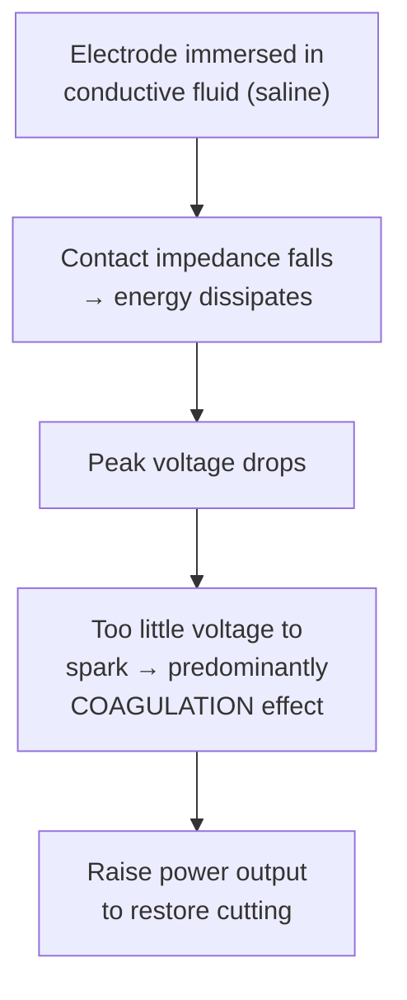

# Electrosurgery in Therapeutic Endoscopy

Conversion of high-frequency alternating current from an **electrosurgical unit (ESU)** into thermal energy at target tissue. The single home for electrosurgical principles, settings, and safety across the wiki — [[polypectomy]], [[endoscopic-mucosal-resection|EMR]], [[endoscopic-submucosal-dissection|ESD]], [[ercp|sphincterotomy]], and [[argon-plasma-coagulation|APC]] link here rather than restating the physics. Per [[aga-2026-electrosurgery]] (13 Best Practice Advice statements; **no formal evidence grades** — the authors did not perform systematic reviews).

**The one idea that organizes everything below:** tissue effect is driven by **current density**, and the ESU dial is only one of its inputs. Device geometry, operator technique, tissue characteristics, and the gas-vs-fluid environment act through the same pathway — so **changing ESU settings alone may not achieve the desired tissue effect** (BPA 3).

## Contents
- [[#Principles]]
  - [[#Terminology]]
  - [[#Tissue Effect — Cut vs Coagulation]]
  - [[#Waveforms — Duty Cycle and Crest Factor]]
  - [[#Monopolar vs Bipolar]]
  - [[#Current Density]]
  - [[#Tissue Resistance Is Not Constant]]
- [[#The Electrosurgical Unit]]
  - [[#Analog vs Microprocessor-Controlled Generators]]
  - [[#Settings by Indication and Manufacturer]]
  - [[#Factors That Change Tissue Effect at a Fixed Setting]]
- [[#Patient and Team Safety]]
  - [[#Pre-Procedure Timeout and Room Setup]]
  - [[#Dispersive Electrode (Return Pad)]]
  - [[#Implantable Cardiac Devices]]
- [[#Operational Environment — Gas vs Fluid]]
- [[#Application-Specific Practice]]
  - [[#Polypectomy]]
  - [[#Post-EMR Margin Ablation]]
  - [[#Soft Coagulation — Hemostasis and Deep Injury]]
  - [[#Hot Forceps Avulsion for Non-Lifting Fibrosis]]
  - [[#Argon Plasma Coagulation]]
  - [[#ERCP Sphincterotomy]]
  - [[#Third-Space Endoscopy (ESD, POEM)]]
- [[#See Also]]
- [[#Sources]]

---

## Principles

### Terminology

| Term | Definition | Unit |
|---|---|---|
| **Current (I)** | Flow of electrons through a circuit | amperes (A) |
| **Resistance (R)** | Ease with which electrons flow through the tissue | ohms (Ω) |
| **Voltage (V)** | Force that pushes current through the circuit | volts (V) |
| **Power (P)** | Energy transferred in a circuit per unit time; **P = V × I** or **V²/R** | watts (W) |
| **Ohm's law** | Current is directly proportional to voltage and inversely proportional to resistance: **I = V/R** | — |
| **Current density (D)** | **D = intensity (amperes) / area (cm²)** — *inversely proportional to contact surface area* | A/cm² |

### Tissue Effect — Cut vs Coagulation

Determined by the **rapidity, amplitude, and depth** of heating:

| Temperature | What happens | Clinical effect |
|---|---|---|
| **>100°C** (instantaneous) | Intracellular fluid vaporizes → cell membranes rupture | **Cutting** |
| **<100°C** | Proteins denature → tissue desiccation | **Coagulation** |

- **Cutting wants high current density**; coagulation wants **lower** current density.
- ESU pedals: **yellow left pedal = cut; blue right pedal = coagulation.**
- "Blended" currents modulate duty cycle and crest factor to give intermediate degrees of each.

### Waveforms — Duty Cycle and Crest Factor

- **Duty cycle** = the fraction of time energy is actively delivered within each waveform. **Higher duty cycle → more cutting, less coagulation.**
- **Crest factor** = peak voltage relative to average voltage. **Higher voltage spikes force current through high impedance → deeper tissue effect.**
- Every manufacturer names its modes differently, but all named modes are just different duty-cycle/crest-factor combinations. Learn the concepts, then map your suite's mode names onto them (BPA 2).

⚠ **Figure gap:** the CPU's Figure 1 plots the cut↔coagulation continuum against duty cycle, crest factor, and voltage. It is a raster figure and could not be extracted on ingest (no PyMuPDF available) — capture on a future pass.

### Monopolar vs Bipolar

| | **Monopolar** | **Bipolar** |
|---|---|---|
| Current path | Electrode (device) → target tissue → **through the patient** → return electrode (dispersive pad) → generator | Confined to tissue **between the 2 active electrodes** on the instrument |
| Dispersive pad | **Required** | **Not needed** |
| Notes | Used for snares, knives, sphincterotomes, [[argon-plasma-coagulation\|APC]] | Preferred (multipolar) when an implantable cardiac device is present |

### Current Density

**Current density is inversely proportional to the surface area of contact.** Practical consequences:

- **Small contact area → high current density → better cutting**, with less heating of surrounding tissue. E.g. a thin **monofilament** snare vs a thick **braided** snare.
- **Large contact area → low current density → slower heating.** During hemostasis this is desirable: coagulation forceps and larger-diameter cautery probes **coapt the vessel**, cutting blood flow through the target and defeating the **heat-sink effect**, which improves coagulation.
- But heat generated is proportional to power dissipated by the tissue, so **large contact area also means more thermal injury to adjacent tissue**. Even when coagulation is the goal, a small contact area (selectively grasping the vessel and **tenting it away** from other structures) reduces collateral injury.

### Tissue Resistance Is Not Constant

- **By GI segment:** lower in the **esophagus**, higher in the **colon**.
- **By wall layer, least → highest resistance:** **submucosa < mucosa < muscularis propria**.
- **During the procedure:** resistance *rises* as tissue desiccates (e.g. progressively during snare polypectomy).
- By Ohm's law, as resistance rises **current falls unless voltage rises** — the problem microprocessor-controlled generators exist to solve.

---

## The Electrosurgical Unit

### Analog vs Microprocessor-Controlled Generators

| | **Analog (older)** | **Microprocessor-controlled (newer)** |
|---|---|---|
| Behavior | Selected **power output stays constant** regardless of changing tissue properties | **Output adjusts to tissue impedance**, holding **voltage constant** |
| Consequence | Voltage fluctuates → **variable tissue effect, higher collateral thermal injury risk** | More consistent and precise tissue effect |

This distinction limits how far trial evidence generalizes — see [[#Polypectomy]].

### Settings by Indication and Manufacturer

Commonly used settings ([[aga-2026-electrosurgery]] Table 2). ⚠ **Reference values only.** Settings vary with the device used (size of coagulation grasper, diameter of knife/snare wire), endoscopist technique, and patient/tissue characteristics — **contact the manufacturer for case-by-case guidance**.

| Indication | Olympus ESG 300 | ConMed Beamer CE200 | ERBE VIO 300D / VIO3 |
|---|---|---|---|
| **[[endoscopic-mucosal-resection\|EMR]]** | Pulse cut slow, power 120 W, effect 2 | Polyp pulse cut II G2; pure coagulation 20–30 W | EndoCut Q, effect 2–3, duration 2–3, interval 2–3; forced coagulation effect 2–3, 30–40 W |
| **Hemostasis** | Soft coagulation 30–40 W | Gentle coagulation 50 W | Soft coagulation effect 5, 60–80 W; forced coagulation effect 1, 10 W |
| **[[ercp\|Sphincterotomy]]** | Pulse cut fast, 120 W, effect 2 | Papilla pulse cut 1 G2 | EndoCut I, effect 2–3, duration 2–3, interval 2–3 |
| **Mucosal incision** | Pulse cut fast 120 W | ESD G2–G5 | EndoCut I, effect 2–3, duration 2–3, interval 2–3 |
| **Submucosal dissection** | Forced/power coagulation, effect 2–3, 40–50 W; pulse cut fast effect 3, 80–120 W | Hot biopsy 35–37 W | Forced coagulation 30–50 W; dry cut 30–40 W; swift coagulation 30–50 W; EndoCut I effect 2–3, duration 2–3, interval 2–3; Precise Sect (VIO3) 40–60 W |

### Factors That Change Tissue Effect at a Fixed Setting

The reason BPA 3 exists — every row below moves current density without touching the dial ([[aga-2026-electrosurgery]] Table 3):

| Variable | Direction of effect |
|---|---|
| **Duration of activation** | Use the **shortest activation time** that achieves the desired effect |
| **Pressure/tension of electrode on tissue** | **More pressure → lower current density** → less cutting, more coagulation |
| **Speed of electrode movement** | **Slower** (e.g. slow snare closure) → **more coagulation, less cutting** |
| **Electrode material/structure** | **Monofilament → more cutting**; **braided → more coagulation** |
| **Electrode surface area** | **Thin → more cutting**; thicker → more coagulation |
| **Coagulum/eschar on the electrode** | Raises resistance → **lower current density, less precision**; can spark and even flame the eschar |
| **Patient variables** | **Increasing age, increasing body weight, and decreased hydration all raise tissue impedance** |
| **Distance from active to return electrode** (monopolar) | Keep the return electrode **as close as possible** — for GI, the patient's **flank** |
| **ESU settings/waveforms** | Presets may not suit all circumstances; work with the manufacturer |

---

## Patient and Team Safety

ESU malfunction is uncommon; **most ESU-associated adverse events are operator- or device-related.**

### Pre-Procedure Timeout and Room Setup

Best practice (BPA 4) — a team process involving endoscopist, room nurse, technician, and anesthesia:

- **Pre-procedure timeout specifically to review electrosurgery safety.**
- **Position the ESU** in the room for both **visibility and operation**.
- **Closed-loop communication** among team members **before ESU activation** and during troubleshooting.

⚠ **Figure gap:** the CPU's Figure 2 (endoscopy room layout + the full ESU safety-practice checklist) is a raster figure with no extractable text and could not be captured this pass; the itemized checklist within it is **not** reproduced here rather than invented.

### Dispersive Electrode (Return Pad)

Required for any **monopolar** device to complete the circuit.

- Place **as close as possible to the treatment site** — shortest electrical circuit. For GI applications the target is the **patient's flank**.
- Place over **muscular areas with good blood supply**: **thigh, flank, upper arm**.
- **Avoid** areas of poor current dispersion: **scars, bony protuberances, excessive hair, tattoos, implants**.
- **Pad size** is chosen primarily by **patient size and weight**, and must be adequate to safely disperse the current.
- **Dual-pad system** for **larger patients** or when **high-power settings** are required — maximizes surface area for dispersal.

### Implantable Cardiac Devices

Pacemakers and implantable cardioverter-defibrillators may react to ESU signals with **pacing inhibition, mode switching, device inactivation, or delivery of inappropriate shocks**.

- **Mandatory preoperative assessment:** the device's **manufacturer**, **model**, **location**, and whether the patient is **device-dependent**.
- Place the **dispersive pad so current does not flow through or near the device or its leads**.
- **Preferentially use multipolar electrocautery when feasible.**
- ⚠ **There is no GI societal consensus** on managing cardiac and non-cardiac implantable devices during electrosurgery; this guidance derives from the HRS/ASA perioperative consensus statement, which is not an ingested source.

---

## Operational Environment — Gas vs Fluid

The environment changes the tissue effect independently of the settings (BPA 8):

- Immersion in **conductive fluid** markedly **reduces contact impedance → energy dissipates**.
- The resulting **drop in peak voltage produces a predominantly coagulation effect**, because relatively **high voltage is needed to generate the spark that cuts** under water/saline.
- **Designated settings — usually higher power output — are needed underwater** to achieve the intended cut and/or coagulation. Consult the ESU manufacturer for specifics.
- **Use saline, not water.** Saline mitigates **water intoxication syndrome** — rare but serious **dilutional hyponatremia**, seen with prolonged procedures or large resections.
- Applies to underwater/immersion [[endoscopic-mucosal-resection|EMR]] and [[endoscopic-submucosal-dissection|ESD]]; **optimal underwater settings remain unstudied**.

*Figure — why underwater work needs higher power settings, recreated from the BPA 8 text. ([[aga-2026-electrosurgery]])*

---

## Application-Specific Practice

### Polypectomy

*Technique selection by lesion size and morphology lives on [[polypectomy]]; only the current choice is here.*

- **Either a cut- or a coagulation-predominant current is acceptable** for colorectal polyp resection — **no clear difference in serious adverse events, complete resection rate, or recurrence** (BPA 5).
- **RCT data** (blended cut = EndoCut Q effect 2, duration 1, interval 4 vs coagulation = forced coagulation effect 2, 25 W; ERBE):

| Outcome | Cut (blended) | Coagulation | P |
|---|---|---|---|
| Intraprocedural bleeding | **17%** | **11%** | .006 |
| Severe adverse events | 7.2% | 7.9% | .76 |
| Delayed bleeding | 5.0% | 5.7% | .84 |

- ⚠ **Generalizability limit:** the trial used a **microprocessor-controlled** generator that compensates for changing tissue resistance — results **may not apply to older analog ESUs**.
- ⚠ **Superseded framing:** two older retrospective studies had linked **cut** current to immediate bleeding and **coagulation** current to delayed bleeding. The RCT and BPA 5 supersede that dichotomy.
- **Large pedunculated polyps → hot, not cold, snare** (BPA 6): the stalk carries a thick feeding vessel prone to bleeding on transection, and current aids transection without compromising margins or histopathology. A **coagulation-predominant waveform may be preferable** to seal vessels across the thick stalk. **Position the snare across the mid-stalk, not close to the base** — too basal transmits excessive thermal injury to the colonic wall.

### Post-EMR Margin Ablation

*Recurrence figures and the STSC-vs-[[argon-plasma-coagulation|APC]] choice live on [[endoscopic-mucosal-resection]]. The electrosurgical constraints are here (BPA 7):*

- **Ablate only the normal-appearing mucosal margin.** Any **visible residual neoplasia must be resected** — additional cold snaring or another adjunct technique — never ablated.
- Snare-tip soft coagulation penetrates deeply; apply with caution to avoid thermal injury to the **muscularis propria** (see next section).
- Role **outside the colorectum is not well established**, though preliminary duodenal data suggest it is safe and reduces recurrence.

### Soft Coagulation — Hemostasis and Deep Injury

**Soft coagulation** = continuous, **low-voltage (<200 Vp)** sinusoidal waveform that **produces no sparks**, so it coagulates large vessels with little risk of inadvertent cutting. Energy is delivered by **direct contact**, so the effect is localized and superficial *at first*.

⚠ **The trap (BPA 9):** coagulum formation and rising impedance during desiccation distribute current unevenly, **prompting the ESU to maintain or increase power over time**. Prolonged application, or grasping too much tissue, therefore produces **deep thermal injury and delayed perforation despite the low-voltage setting**.

Mitigation:

- Treat **only the target vessel or bleeding point**, with **coaptation** — raises current density, improves hemostatic efficiency, limits collateral injury.
- After grasping with the forceps, apply **gentle traction away from the underlying layers** to reduce thermal transmission deep and the risk of delayed perforation.
- When using soft coagulation to **ablate** (e.g. STSC of an EMR margin), place the **snare tip on the mucosal surface only**, avoid contact with the **muscularis propria**, and stop once the mucosal surface is ablated.

### Hot Forceps Avulsion for Non-Lifting Fibrosis

For focal areas of visible neoplasia that will not lift — from **prior biopsy, incomplete resection, or tattoo placement** — and so resist snare-based resection (BPA 10).

*Technique steps, the ERBE setting, and the colorectal indication are on [[endoscopic-mucosal-resection]]. The current choice is here:*

- **Use a predominant *cutting* current**, not coagulation.
- **Why:** fibrotic tissue has **poor conductivity and high impedance**. To maximize the cutting effect, **target a small surface area** so current density stays high.
- ⚠ **Avoid prolonged continuous activation** — cutting current can cause deep tissue injury → **bleeding, post-coagulation syndrome, delayed perforation**. Deliver it as **short bursts** while pulling.

### Argon Plasma Coagulation

The one **non-contact** modality in this page (BPA 11): argon delivered to the catheter tip is **ionized by a high-voltage waveform** into **plasma**, which conducts current to the nearest tissue **along the path of least resistance, without mechanical contact**. The circuit is still **monopolar** — it exits via the dispersive electrode, so [[#Dispersive Electrode (Return Pad)]] applies.

*The two dials (power vs argon flow rate) and their tissue consequences, site-specific settings, the non-absorption/distension problem, and the bowel-prep rule against colonic explosion are all on **[[argon-plasma-coagulation]]**.*

### ERCP Sphincterotomy

*Indications and adverse-event rates are on [[ercp]]; energy delivery is here (BPA 12).*

- **Goal: high current density at the cutting wire.** Minimize sphincterotome wire contact with mucosa and sphincter.
- The wire should **not be "buried" in the sphincter** — apply it **gently to the surface with minimal tension**. This concentrates current density while minimizing collateral thermal injury.
- **Waveform choice is unsettled.** An older study suggested "pure cut" causes less post-ERCP pancreatitis (PEP — risk factors and prophylaxis on [[ercp]]) than blended current, but **more recent studies of newer blended-current settings have not shown increased pancreatitis risk** and may show **reduced post-sphincterotomy bleeding**.
- **Bottom line:** the pancreatitis risk of sphincterotomy is **primarily technique-related** (small area of wire–tissue contact, minimal tension) **rather than energy-setting-related**.

### Third-Space Endoscopy (ESD, POEM)

Applies to [[endoscopic-submucosal-dissection|ESD]], [[colorectal-esd|colorectal ESD]], [[poem|POEM]], and [[g-poem|G-POEM]] — monopolar electrosurgery in a submucosal tunnel, where off-target injury is the governing concern (BPA 13).

| Situation | What to use | Why |
|---|---|---|
| **Fibrotic tissue** (low water content, high resistance) | **Cut current** | Avoids the excessive adjacent thermal injury that high-peak-voltage coagulation current causes |
| **Submucosal dissection** generally | **Either cutting or coagulation** current | Choice depends on endoscopist preference, GI location, and tissue characteristics |
| **Preemptive hemostasis, small-caliber vessels** | **Shaft of the ESD knife at low power — 10 W forced coagulation** | Lower current density → seals rather than cuts through the vessel |
| **Vessels wider than the widest part of the knife**, especially **arteries** | **Coagulation forceps** | Knife shaft cannot coapt them |
| **Underwater dissection** | **Higher cutting settings**; **higher-power coagulation** for preemptive hemostasis | Current disperses underwater → lower current density than in air or CO₂ |

**Preemptive vessel-sealing technique:** first **"skeletonize"** the vessel — isolate it from surrounding tissue to improve knife contact — then apply **gentle pressure with the widest portion of the knife (the shaft)** to promote vessel sealing and reduce blood flow, avoiding the **heat-sink effect**.

---

## See Also

[[polypectomy]], [[endoscopic-mucosal-resection]], [[colorectal-esd]], [[endoscopic-submucosal-dissection]], [[endoscopic-full-thickness-resection]], [[argon-plasma-coagulation]], [[ercp]], [[poem]], [[g-poem]], [[colonoscopy]], [[upper-endoscopy]], [[upper-gi-bleeding]]

---

## Sources

1. [[aga-2026-electrosurgery|AGA Clinical Practice Update on the Use of Electrosurgery in Therapeutic Endoscopy: Expert Review (2026)]]
