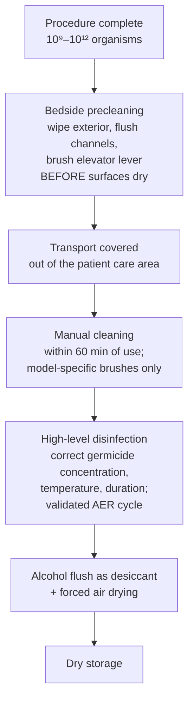

*Why flexible endoscopes transmit infection between patients, what reprocessing is supposed to achieve, and what a unit is actually held to.*

## Contents
- [[#Why Reprocessing Has No Safety Margin]]
- [[#Why Duodenoscopes Are the Worst Case]]
- [[#Outbreak Epidemiology]]
- [[#The Reprocessing Sequence]]
- [[#What the Unit Is Held To]]
- [[#Supplemental Measures Beyond Standard Reprocessing]]
- [[#Monitoring and Tracking]]
- [[#Sterilization vs High-Level Disinfection]]
- [[#Unresolved Issues]]
- [[#See Also]]
- [[#Sources]]

## Why Reprocessing Has No Safety Margin

- **Spaulding classification:** endoscopes are **semicritical** devices — they contact mucous membranes → suitable for **high-level disinfection (HLD)**, not sterilization.
- **Sterility Assurance Level** for sterile devices = **10⁻⁶** (<1 organism in 10⁶ reprocessed instruments). A similar standard holds for HLD, except for some tolerant spores.
- The bioburden ledger makes the margin narrow:

| Step | Organisms / log reduction |
|---|---|
| Endoscope at procedure completion | **10⁹–10¹²** organisms |
| Bedside precleaning | **10³** (1000-fold) reduction |
| Manual washing | further **10⁶** reduction |
| High-level disinfection (liquid chemical germicide) | must supply the final **10⁶–10⁹** reduction |

- "A tall order, given the need to achieve optimal reprocessing on every instrument every day" — space, pace, staffing, and resources all erode it ([[aga-2016-infection-ercp-endoscopes]]).
- **Lapses → biofilm.** Adherent biofilm cannot be eradicated by repeated, thorough cleaning and HLD; its aggregation lets otherwise susceptible organisms defy HLD.
- Real-world failure rate: universal culturing of reprocessed endoscopes at one center found **2% of patient-ready instruments harbored persistent enteric pathogens**.

## Why Duodenoscopes Are the Worst Case

- Complex instruments with **tight crevices and mechanical joints repeatedly exposed to high infectious bioburden** — the **elevator region** and **cable channels**. Some ultrasound endoscopes share the problem.
- Outbreaks have been **attributed to persistent contamination at the elevator region and/or cable channels**.
- **Durability matters:** inert surfaces exposed to significant wear become more susceptible to contamination and less amenable to easy clearance of bioburden.
- Not new — *Pseudomonas aeruginosa* outbreaks after [[ercp|endoscopic retrograde cholangiopancreatography (ERCP)]] with side-viewing duodenoscopes date to the **1980s**, clustering in the **first patient of the day** after overnight storage and shortly after reprocessing. Largely eliminated by adopting **complete channel drying with alcohol flushing and forced air perfusion after HLD**.
- Contaminated endoscopes transmit **antibiotic-sensitive as well as highly resistant** causes of post-ERCP [[acute-cholangitis|cholangitis]], and can produce **chronic gastrointestinal colonization with infectious complications appearing weeks to months later in unrelated organ systems**.

## Outbreak Epidemiology

Carbapenem-resistant *Enterobacteriaceae* (CRE) and ERCP outbreaks, as of 2016 ([[aga-2016-infection-ercp-endoscopes]]):

| Finding | Figure |
|---|---|
| US sites published in medical literature | **4** (>5 more publicly disclosed) |
| Outbreaks of multidrug-resistant organism (MDRO) after duodenoscope use | **≥25** overall |
| Timing | **1 cluster before 2010**; most exposures **2012–2014** |
| Clinical infections / deaths worldwide | **≥250 infections, 20+ deaths** |
| Patients notified for screening | **>1000**; estimated **>100 silent carriage** |
| Mortality of clinical infection | **significant (≤50%)** |
| Manufacturers involved | **all 3**, multiple designs |
| Automated endoscope reprocessors (AERs) involved | **multiple**, one with greater prevalence |

- **CRE is not inherently more resistant to HLD agents and process** — it was transmitted *despite apparent optimal HLD*. The failure is mechanical/design-related, not microbiologic resistance. Resistant species simply made transmission visible, by prompting source investigation with sophisticated bacterial typing.
- Greatest risk of infection and death: **multiple comorbidities or immunosuppression**. Many patients develop **silent carriage**, with risk of future infection or transmission; clinical infections are often **removed in time (months) and in organ location** from the exposure.
- Environmental/institutional cross-contamination also occurs (intensive care units, chronic nursing facilities), but at **far lower frequency than iatrogenic exposure** — investigations point to the endoscope as the source in most post-ERCP multidrug-resistant outbreaks.
- **Scale of preventable risk:** with **>650,000 ERCPs/year in the United States**, even the lowest reported defect rate of **0.7%** exposes **4500 patients** annually.

## The Reprocessing Sequence

- **Manual cleaning is the most effective single step** — wiping the exterior, flushing the channels, and **brushing the elevator lever immediately after use and before the surfaces have become dried**.
- **Biofilm only develops in a moist environment** → alcohol desiccation, forced air drying, and dry storage are "equally important steps," not optional finishing touches.
- **Reprocessing (other than immediate pre-cleaning) must not be performed in patient care areas** — risk of patient exposure to contaminated surfaces and devices. Facilities are designed for **optimal flow of personnel, endoscopes and devices to avoid contamination between entering dirty instruments and reprocessed clean instruments** (Multi-Society Task Force [MSTF] 2016 recommendation #31, new in 2016).

## What the Unit Is Held To

The **MSTF 2016 reprocessing guideline** — **41 recommendations** (2003: 34; 2011: 39), **officially endorsed by the AGA Institute** — governs flexible gastrointestinal endoscope reprocessing. Only **2 recommendations were new in 2016**; the major changes were language consistent with the 2015 US Food and Drug Administration (FDA) reprocessing communications, and statements requiring greater monitoring and tracking of the endoscope through the clinical units and cleaning rooms ([[aga-2017-mstf-endoscope-reprocessing-commentary]]).

| Requirement | Operative detail | MSTF 2016 |
|---|---|---|
| **Strict adherence to manufacturer guidance** | Device- and manufacturer-specific. "A single standard work process within one institution may be **insufficient**, given differences among manufacturers' instructions and varied instrument designs" — a generic unit protocol built from elements common to all brands is **not permitted** | #5 (revised; same language as FDA 2015 interim guidance) |
| **Model-specific cleaning devices** | "Only model-specific cleaning devices (such as brushes) **designed for the endoscope model being cleaned**" — brush brand must be matched to endoscope brand, not chosen for the majority of the unit's scopes | #5 |
| **Manual cleaning time limit** | "Manual cleaning should occur **within 60 minutes of endoscope use** and the **intervals from use to cleaning should be monitored**" | #5 |
| **Staff training** | **Documented brand- and model-specific training at commencement of employment and at least annually**. Additional training + updated evaluation and documentation of competency **whenever reprocessing guidance changes** (manufacturer, regulatory agency, or professional-society guidance incorporated into unit policy); also **anytime a breach is identified**, when a major technique or new endoscope/reprocessing equipment is introduced, and in the context of local quality control efforts | #5, #6, #8, #12, #16, #28, #32 |
| **Procedure logging** | Log each procedure by **patient name, medical record number, procedure, endoscope serial number, AER unit**, plus the **name of the person who cleaned and disinfected the endoscope**, and information about **temporarily used / loaner endoscopes** — needed for outbreak investigation | #27 (expanded) |
| **Facility design** | Reprocessing out of patient care areas; clean/dirty flow separation | #31 (new) |
| **Precleaning and covered transport** | Preclean the endoscope; transport it pre-cleaned and covered | #2, #3 (added between 2003 and 2011) |

- **FDA advice** relayed to units: (a) enhanced oversight, training, and competency assurance for front-line reprocessing staff; (b) assiduous attention to precleaning and cleaning steps before usual automated HLD; (c) adherence to manufacturer's instructions for use, **including the singular proprietary cleaning brushes used by manufacturers in their validation studies**; (d) new emphasis on **record keeping** of all these measures.
- **Competency interval:** most technical tasks in health care involve **annual** competency testing; the AGA has encouraged **demonstration of competency semi-annually**. Certification of reprocessing staff has been proposed but not adopted beyond the operating room setting.
- **AGA short-term measures for elevator-channel endoscopes:** surveillance of all patients who had a procedure using an elevator channel endoscope; tracking of each elevator channel endoscope **by patient and device serial number**; and **periodic collection of cultures** from all elevator-equipped endoscopes in use within a practice.

## Supplemental Measures Beyond Standard Reprocessing

In May 2015 a majority of the FDA's independent advisory panel judged reprocessing standards for existing duodenoscope designs **insufficient for ensuring patient safety**. The FDA encouraged units to consider four optional supplemental measures; MSTF 2016 recommendation #24 (new) states that **"no validated methods for additional duodenoscope reprocessing currently exist"** but that units should review and consider their feasibility and appropriateness.

| Measure | How it is done | Why it may not be worth it |
|---|---|---|
| **Surveillance cultures ± quarantine** | Centers for Disease Control and Prevention (CDC) technique, analogous to outbreak investigation: sterile flushes of the biopsy channel + **swabbing and swirling immersion of the elevator region at the tip**. CDC advises **quarantine of cultured endoscopes until negative results return after 2–3 days**. Can be **per-procedure**, or **intermittent** (a subset of instruments at the end of every work week) to catch gross breaches | **Not cost-effective unless the unit's CRE transmission probability is ≥24% (pre-test probability 1 in 4 patients or greater)**. Expensive, hard to perform well, hard to interpret (many nonsignificant organisms). CDC regimen is **not validated for confirmation of sterility or even post-HLD pathogen clearance** — some clinical laboratories decline to process "environmental" cultures. Imperfect: contaminated scopes can harbor **culture-negative but biologically viable residue**. Per-procedure quarantine curtails instrument availability or demands a larger duodenoscope inventory |
| **Double reprocessing** (repeat HLD) | Routine sequential duplication of manual cleaning and HLD: **washing → HLD → washing → HLD**, without quarantine. Derived from culture-quarantine experience where repeat reprocessing of culture-positive duodenoscopes cut the culture-positive rate of pathogenic bacteria **by one additional log (~2% → 0.2%)** | "Perhaps the most simple and readily adopted additional measure," but **not validated**; staffing, space, and equipment are limiting. Carries **the same potential limitations as sterilization** |
| **Ethylene oxide (ETO) sterilization** | Chemical sterilization; some manufacturers provide validated time/temperature conditions | **Not subjected to FDA review for this purpose**; some manufacturers do not approve it. May **stiffen or alter functional aspects** of flexible endoscopes. Out of favor owing to controls required against **carcinogenic and teratogenic** risk; few units equipped. Turnaround **17–48 hours**, plus sterilization, transport, and inventory costs. In practice, a unit using ETO **still cultured CRE from an endoscope**, incurred extra scope-purchase costs from longer turnaround, and had more endoscope damage (not directly attributable to sterilization) |
| **Liquid chemical sterilant / germicide** (e.g., peracetic acid, 2% glutaraldehyde) | Automated reprocessing with a liquid chemical sterilant | Peracetic acid **has yet to be validated and approved as a chemical sterilant for duodenoscopes**; transmissions have occurred after appropriate treatment with other liquid chemical germicides, so a liquid-based process is unlikely to reach inaccessible crevices. **2% glutaraldehyde exposes reprocessing staff to known irritants and can cause colitis in patients if the endoscope is not properly rinsed between uses** |

**Other strategies**

- **Preprocedure MDRO/CRE screening** — anal swab by polymerase chain reaction (PCR) avoids the delayed turnaround of culture and permits intensified reprocessing of exposed instruments, but **does not address transmission of common antibiotic-sensitive organisms**.
- **Antibiotic prophylaxis is not a substitute.** It has only been demonstrated useful, and is deemed appropriate, in procedures with **an expectation of persisting obstruction** — intervention for [[primary-sclerosing-cholangitis]], hilar tumors, duct leaks, or fluid collections. Regimens and the full indication list: [[antibiotic-prophylaxis-endoscopy]].
- **Disposable endoscopes.** The FDA approved the **first disposable colonoscope in September 2016**, expected in the United States in early 2017 at **~$250 per colonoscope**. A disposable endoscope **with an elevator mechanism** was not available, but would address several unresolved issues. Cost-effectiveness versus reprocessing is unsettled; **not all patients may require one**, and those at highest risk of transmission and infection could be identified and prioritized — with budgeting and reimbursement implications.

## Monitoring and Tracking

- **Real-time verification of reprocessing adequacy remains elusive.** Tests for biologic contaminants help evaluate *intermediate* steps, but **none correlate well with terminal culture negativity**.
- **Adenosine triphosphate (ATP) testing after manual washing** is the **best studied and most easily used** — a **5-minute** assessment of test swabs or solutions. Most useful for **training and intermittent surveillance of washing performance**, not as a release test.
- Monitoring the **interval from use to manual cleaning** (≤60 min) and endoscope lifecycle tracking will in practice require **barcode scanning or equivalent** in both clinical areas and reprocessing rooms, and may require electronic health record modification to capture **endoscope and reprocessor serial numbers** for patient-specific notification during an outbreak.
- **Endoscopist-level tracking** is *not* mentioned in the 2011 or 2016 recommendations, though the **2003 recommendations did include it**; cross-documenting the endoscope information in the patient's record restores it.
- **Equipment upkeep:** scheduled endoscope maintenance, upgrades, parts replacement, and **scheduled retirement**; AER manufacturers should supply systems that **monitor and record the integrity of their functionality**; preventive inspection for **material degradation and biofilm accumulation**.

## Sterilization vs High-Level Disinfection

- In 2016 the **majority of FDA panel members recommended reclassifying endoscopes so that sterilization is required instead of HLD** — specifically, reclassifying duodenoscopes as **critical devices** in the Spaulding classification. The FDA Advisory Panel concluded that **"duodenoscopes and AERs do not provide a reasonable assurance of safety and effectiveness."** Some panelists held that HLD is adequate when done properly.
- **The evidence does not clearly support reclassification:** per the CDC and surgical (laparoscope) experience, there is **no evidence of a difference in infection transmission when laparoscopes undergo sterilization versus high level disinfection** — and the endoscopy unit that sterilized with ETO still identified CRE in a sterilized endoscope.
- Conclusion drawn: **contamination may be unavoidable under the current reprocessing or sterilization paradigm**, and **methods to rapidly identify and contain outbreaks are the highest priority for innovation**.
- Design agenda: alternative duodenoscope designs with **enhanced access for cleaning (removable tips)**, **tolerance to high-temperature autoclaving**, and **single-use disposable components**; alternative low-temperature sterilization technologies; adjunctive tools for enhanced precleaning, washing, and storage; and redesign that **reduces the impact of inevitable human error**.

## Unresolved Issues

- Carried unchanged through the **2003, 2011, and 2016** guidelines: **interval of storage after reprocessing**, **microbiologic surveillance**, and **endoscope durability and longevity**. Because units with outbreaks were adherent to the guidelines, these unresolved issues may be the clue to the source of the outbreaks.
- The 2016 guideline does not state the **minimum time allowed between a change in recommendations and updated staff training**, nor whether "all staff involved in the use" includes the **endoscopists**.
- The 2016 guidelines are "**unlikely to guarantee the prevention of future outbreaks**" — the changes reflect an effort to **contain, rather than prevent**, outbreaks by making the source traceable. Adherence cannot be relied upon as a guarantee against transmission.
- All 3 manufacturers (Olympus, Pentax, Fujinon) validated reprocessing outcomes in **test environments**; the FDA ordered **post-market studies of reprocessing in clinical settings**, results of which were not expected for several years.

## See Also

[[ercp]], [[colonoscopy]], [[upper-endoscopy]], [[endoscopic-ultrasound]], [[antibiotic-prophylaxis-endoscopy]], [[acute-cholangitis]], [[primary-sclerosing-cholangitis]], [[colonoscopy-quality-indicators]], [[preprocedure-testing]]

---

## Sources

1. [[aga-2016-infection-ercp-endoscopes|AGA Clinical Practice Update: Commentary — Infection Using ERCP Endoscopes (2016)]]
2. [[aga-2017-mstf-endoscope-reprocessing-commentary|AGA Clinical Practice Update: Commentary on the 2016 Multi-Society Task Force Endoscope Reprocessing Guidelines (2017)]]
