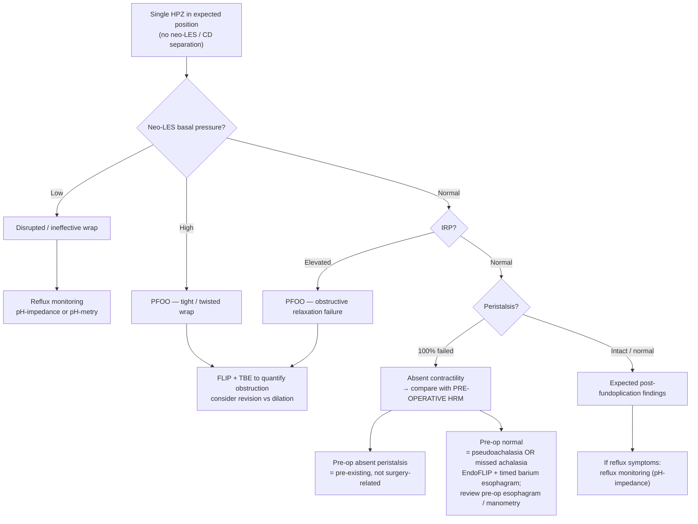

## Overview

[[high-resolution-manometry|High-resolution manometry (HRM)]] plays a dual role in the management of [[antireflux-surgery|antireflux surgery (ARS)]]: **pre-operative screening** to exclude motor disorders that would complicate or contraindicate surgery, and **post-operative diagnosis** of failed or complicated fundoplication. Standard [[chicago-classification-v4|Chicago Classification]] norms do not apply post-ARS; the wrap creates a new anatomic HPZ with predictably altered manometric parameters.

The **Padova Consensus (2025)** — a 3-year, 29-expert international process using RAND/UCLA appropriateness methodology — provides the first systematic framework for both contexts, culminating in the **Padova Classification**: a structured two-step post-ARS HRM algorithm.

---

## Pre-Operative HRM

### Why HRM Is Mandatory Before ARS

- **HRM is essential to exclude motor disorders not amenable to ARS** (median score 9, **89% agreement**).
- In a series of **>1000 patients** having HRM before ARS, **3%** had EGJ obstruction suspicious for **[[achalasia|achalasia-spectrum disorders]]**, where standard ARS would have significantly worsened esophageal transit — missed on clinical grounds alone.
- Conversely, in a series of **524 achalasia patients, 29% had been referred for ARS** because of incomplete response to [[gerd|GERD]] management.
- Wrapping over an achalastic esophagus creates pseudoachalasia and severe [[dysphagia]]
- HRM identifies contraindications, relative contraindications, and conditions requiring pre-ARS treatment

### Pre-ARS Motor Disorder Decision Framework

| HRM Finding | Decision |
|---|---|
| [[achalasia\|Achalasia]] (any type) | ARS contraindicated; treat achalasia first |
| [[esophagogastric-junction-outflow-obstruction\|EGJOO]] | Must be addressed (e.g., [[pneumatic-dilation\|pneumatic dilation]], [[poem\|POEM]] evaluation) before ARS; 86% consensus |
| [[hypercontractile-esophagus\|Hypercontractile esophagus (jackhammer)]] | Not an absolute contraindication **if** objective [[gerd\|GERD]] + partial [[proton-pump-inhibitors\|PPI]] response; 81% consensus |
| [[distal-esophageal-spasm\|DES]] with obstructive symptoms | Caution; consider non-surgical options first; 95% consensus |
| DES without obstructive symptoms + objective GERD | May proceed to ARS; 81% consensus |
| [[ineffective-esophageal-motility\|Ineffective esophageal motility (IEM)]] | Insufficient evidence for absolute contraindication; partial wrap preferred by many |
| Normal HRM | Proceed to ARS |

### EGJ Barrier Assessment Pre-ARS

The EGJ barrier should be characterized by:

1. LES end-expiratory pressure
2. LES baseline pressure
3. EGJ-contractility index (EGJ-CI)
4. LES–crural diaphragm (CD) separation (a marker of [[hiatal-hernia|hiatal hernia]] physiology)

---

## Post-Operative HRM

### Expected Manometric Changes After Successful Fundoplication

A **successful fundoplication** on HRM shows:

- Single distal HPZ (neo-LES) in appropriate infradiaphragmatic position
- Appropriate relaxation of the neo-LES with swallowing (IRP within post-ARS range)
- No neo-LES/CD separation

**Post-ARS IRP norms differ from surgery-naive patients:**

- Nissen fundoplication → higher EGJ pressures + higher IRP + higher contractility vs. partial wrap
- **There is no established post-ARS upper limit of normal for IRP.** The consensus states verbatim: the "normal" post-surgical IRP "is expected to be greater than in surgery-naive patients so **any value < 15 mm Hg using Medtronic systems is consistent with normal though even a higher value may be within normal limits**." So **<15 mmHg (Medtronic) rules IRP normal; ≥15 mmHg does not rule it abnormal** — do not read 15 as a post-ARS cut-off.
- Padova explicitly notes **minimal data** on expected "normal" IRP in wholly asymptomatic postfundoplication patients, with variance expected by **wrap type** and **manometry system**.
- ⚠ **Do not use IRP alone.** "Reliance on IRP alone may be insufficient to assess for outflow obstructive physiology" — the diagnostic unit is high IBP **+** high IRP (see [[#PFOO — Post-Fundoplication Outflow Obstruction]]).

### PFOO — Post-Fundoplication Outflow Obstruction

Defined by the **simultaneous** presence of:

- Elevated intrabolus pressure (IBP)
- Elevated IRP

Neither finding alone is sufficient for PFOO. PFOO indicates obstruction at the level of the wrap and encompasses tight, twisted, or stenotic configurations.

- Median score **8**, **93% agreement**.
- A **very prominent single HPZ with impaired or failed deglutitive relaxation** indicates a twisted or too-tight fundoplication (median score 8, **86% agreement**).
- In the Padova algorithm, PFOO is reached by **either** a hypertensive neo-LES **or** a normotensive neo-LES with elevated median IRP; **intrabolus pressurization increases confidence** in the diagnosis.

> **Gap — no numeric IBP threshold.** [[padova-2025-hrm-antireflux]] never states what pressure counts as "elevated" intrabolus pressure post-ARS, and gives no post-ARS basal-pressure cut-offs for "hypotensive" / "normotensive" / "hypertensive" neo-LES. The surgery-naive supine IBP threshold on [[chicago-classification-v4]] (**20 mmHg**, Medtronic) is not validated after fundoplication — do not carry it over. Would need a post-ARS normative-values study.

---

## The Padova Classification

A two-step algorithm for post-ARS HRM interpretation:

### Step 1: Anatomy — Is there neo-LES/CD Separation >1 cm?

Assess whether the HPZ is in the expected infradiaphragmatic position relative to the crural diaphragm. *(The consensus statement writes the criterion as **≥1 cm**; the discussion writes **>1 cm** — reproduced as published.)*

| Finding | Diagnosis |
|---|---|
| HPZ located **below CD** | **Slipped fundoplication** — dual HPZ; upper relaxes, lower remains uniform (pressure pattern) |
| HPZ located **above CD** + low basal pressure | **Disrupted/herniated wrap** — wrap has migrated; EGJ barrier lost |
| HPZ located **above CD** + normal/high basal pressure | **Intrathoracic wrap** — dual HPZ; lower HPZ shows respiratory inversion pattern (intrathoracic); upper HPZ may relax |

→ If anatomical separation identified: proceed to structural evaluation (CT, barium swallow, endoscopy).

→ No single manometric finding mandates reoperation alone (96% consensus); anatomy + symptoms + functional data guide surgical decision.

### Step 2: Physiology — Single HPZ in Expected Position

If no neo-LES/CD separation is present, assess the physiology of the single HPZ:

---

## Special Patterns

### Slipped Fundoplication

- Dual HPZ: upper HPZ relaxes with swallowing, lower HPZ shows uniform (non-relaxing) pressure profile
- Wrap has slipped distally below crural diaphragm
- Clinical: recurrent GERD; may have some obstruction at wrap level

### Intrathoracic Wrap (Migrated Fundoplication)

- Dual HPZ: lower HPZ displays **respiratory inversion** (intrathoracic pressure dynamics); upper HPZ (at or above hiatus) may relax
- Clinical: recurrent GERD, ± dysphagia; often associated with paraesophageal hernia

### Pseudoachalasia Post-ARS

- Presentation: progressive dysphagia, often with weight loss, resembling achalasia
- Mechanism: chronic outflow obstruction from tight wrap → progressive motor failure → complete aperistalsis
- Differentiate from missed achalasia by:
  1. Reviewing pre-operative HRM (if available) — normal pre-op = acquired/pseudoachalasia
  2. EndoFLIP: achalasia shows REO with absent CR; PFOO shows REO with variable CR + elevated pressures
  3. Response to pneumatic dilation may help differentiate
  4. Timed barium esophagram at 1 and 5 minutes

### Post-ARS Dysphagia — Workup Algorithm

- New dysphagia + normal endoscopy after ARS: **TBE + [[flip-panometry|FLIP]]** first (93% consensus)
- TBE: assesses emptying, identifies wrap morphology, column height
- FLIP: quantifies EGJ opening (REO/NEO), localizes obstruction
- HRM: characterizes peristalsis and IRP in anatomic context (Padova Classification)

---

## Key Clinical Principles

1. **No single manometric finding alone mandates reoperation** — integrate HRM, symptoms, endoscopy, and functional imaging (FLIP, TBE)
2. **Pre-ARS HRM is mandatory** — 3% achalasia-spectrum rate in ARS referrals is clinically unacceptable to miss
3. **There is no post-ARS IRP cut-off** — <15 mmHg (Medtronic) confirms normal, but a higher value may still be normal after a wrap; never call PFOO on IRP alone
4. **PFOO = IBP + IRP together** — elevated IRP alone after Nissen is expected; the combination with elevated IBP defines obstruction
5. **Absent peristalsis post-ARS requires pre-op comparison** — same finding means completely different things depending on pre-operative motor status

---

## See Also

[[high-resolution-manometry]], [[antireflux-surgery]], [[gerd]], [[achalasia]], [[chicago-classification-v4]], [[flip-panometry]], [[poem]], [[reflux-testing]], [[ambulatory-reflux-monitoring]], [[dysphagia]], [[hypercontractile-esophagus]], [[distal-esophageal-spasm]], [[ineffective-esophageal-motility]], [[proton-pump-inhibitors]], [[pneumatic-dilation]], [[hiatal-hernia]], [[esophagogastric-junction-outflow-obstruction]]

---

## Sources

1. [[padova-2025-hrm-antireflux|Padova Consensus: High-Resolution Manometry Before and After Antireflux Surgery]]
