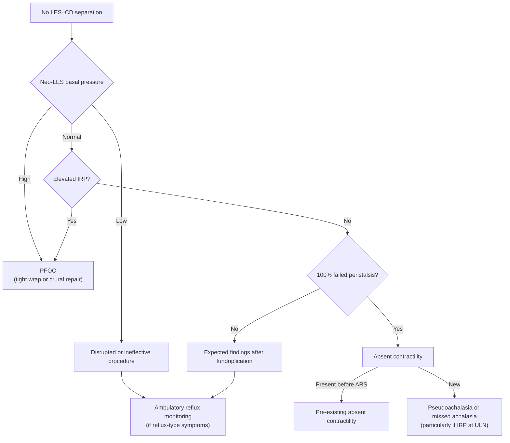

## Overview

- [[high-resolution-manometry|High-resolution manometry (HRM)]] in [[antireflux-surgery|antireflux surgery (ARS)]] has two jobs:
  - **Before ARS:** exclude motor disorders not amenable to ARS; describe the esophagogastric junction (EGJ) barrier.
  - **After ARS:** classify wrap anatomy and physiology in persistent or new reflux symptoms and/or dysphagia.
- Framework: **Padova Consensus (2025)** — 29 surgeons and gastroenterologists, RAND/University of California, Los Angeles (UCLA) appropriateness method; statement accepted at median ≥7 (1–9 scale) with ≥80% ranking it appropriate ([[padova-2025-hrm-antireflux]]).
- [[chicago-classification-v4|Chicago Classification v4.0 (CCv4.0)]] was built for surgery-naive patients; post-ARS findings are read with the Padova Classification below.

---

## Pre-Operative HRM

### Why HRM Before ARS

- **HRM is essential to exclude motor disorders not amenable to ARS** (median 9, **89%**).
- >1000 patients having HRM before ARS → **3%** had EGJ obstruction suspicious for [[achalasia|achalasia-spectrum disorders]], where standard ARS would have significantly worsened esophageal transit.
- 524 achalasia patients → **29%** had been referred for ARS for incomplete response to [[gerd|gastroesophageal reflux disease (GERD)]] management.
- Integrated relaxation pressure (IRP) is occasionally normal in achalasia → **absent contractility with [[dysphagia]] needs barium radiography or [[flip-panometry|functional lumen imaging probe (FLIP)]]** to exclude achalasia before ARS.

### Pre-ARS Motor Findings — Consensus Statements

| HRM finding | Padova statement | Median / % appropriate |
|---|---|---|
| [[esophagogastric-junction-outflow-obstruction\|EGJ outflow obstruction (EGJOO)]] by CCv4.0 criteria | Lower esophageal sphincter (LES) obstruction **must be addressed before ARS**. Confirm first: CCv4.0 requires a supportive timed barium esophagram or FLIP plus obstructive symptoms; act only if obstruction is definitively identified | 8 / 86% |
| [[hypercontractile-esophagus\|Hypercontractile esophagus]] (CCv4.0) | **Can be referred for ARS** if objective GERD **and** typical reflux symptoms **and** at least partial improvement on acid-suppression medication | 7 / 81% |
| [[distal-esophageal-spasm\|Distal esophageal spasm (DES)]] **with** obstructive symptoms (dysphagia and/or chest pain) | ARS **with caution** — may be on the type III (spastic) achalasia spectrum or opioid-related; treatment other than ARS may need to be considered | 8 / 95% |
| DES **without** obstructive symptoms + objective GERD | **Can be referred for ARS** | 7 / 81% |

- [[ineffective-esophageal-motility|Ineffective esophageal motility]] and peristaltic vigor: **no agreement** that ineffective swallows, peristaltic breaks, or multiple rapid swallow (MRS) response should choose total vs partial fundoplication. Retrospective data: absent contraction reserve on MRS associated with more post-ARS dysphagia, higher reflux burden, persistent hypomotility.
- No agreement that EGJ obstruction seen only on provocative maneuvers warrants further pre-ARS work-up.

### EGJ Barrier Assessment

- Assess by HRM (median 8, **85%**) using:
  - LES end-expiratory pressure
  - LES baseline pressure **or** EGJ contractile integral (EGJ-CI)
  - presence of [[hiatal-hernia|hiatal hernia]] = LES–crural diaphragm (CD) separation
- LES–CD separation correlates well with hiatal hernia found at laparoscopy.

---

## Post-Operative HRM

### Role

- **HRM has a diagnostic role in unsuccessful fundoplication** (persistent or new reflux symptoms and/or dysphagia), **unless a large recurrent hernia already necessitates reoperation** (median 8, **85%**).
- **No manometric finding is an absolute indication for reoperation**; HRM informs the decision alongside endoscopy, pH monitoring, and barium studies (median 9, **96%**).
- Initial evaluation of post-ARS symptoms = endoscopy + barium esophagram; HRM read with them.
- Scale: reflux symptoms and/or pathologic acid reflux recur in ~5–15%; persistent dysphagia in up to 12–25%.

### Expected Findings After a Successful Fundoplication

- **Single distal high-pressure zone (HPZ)** — normal LES–CD configuration — **with appropriate deglutitive relaxation** (median 8, **89%**); wrap, native LES, and crura all at the pressure inversion point (PIP).
- **Nissen (360°) vs partial:** Nissen tends to give higher EGJ resting pressure, higher IRP, higher esophageal contractility (median 8, **81%**); one study found no significant IRP difference.
- **Post-ARS IRP has no upper limit of normal.** Data in asymptomatic patients are minimal and vary with wrap type and manometry system. **Any IRP <15 mmHg (Medtronic) is consistent with normal, but a higher value may still be normal** — 15 mmHg is not a post-ARS cutoff.
- IRP alone may not be enough to judge outflow obstruction → read with intrabolus pressure (IBP).

### PFOO — Post-Fundoplication Outflow Obstruction

- **High IBP + high IRP may indicate post-fundoplication outflow obstruction (PFOO)** (median 8, **93%**).
- **Very prominent single HPZ with impaired or failed deglutitive relaxation → twisted or too-tight fundoplication** (median 8, **86%**).
- In the algorithm, PFOO = **hypertensive neo-LES** (tight wrap or tight crural repair) **or normotensive neo-LES with elevated median IRP**; intrabolus pressurization increases confidence.
- Padova gives no numeric post-ARS cutoffs for elevated IBP or for low/normal/high neo-LES basal pressure. The surgery-naive supine IBP threshold on [[chicago-classification-v4]] has not been validated after fundoplication.

### New Dysphagia With Normal Endoscopy

- **Timed barium swallow (with tablet) and FLIP may help clarify the cause, especially if manometry is equivocal** (median 8, **93%**).
- Neither has been tested specifically in failed fundoplication; used by analogy to confirming EGJOO under CCv4.0.
- **No post-ARS normative FLIP values** for distensibility index or EGJ diameter.

---

## The Padova Classification

![[padova-2025-padova-classification-04.png|700x653]]
*Figure 1 — Padova Classification: HRM assessment of anatomy (top) and physiology (bottom) after an antireflux procedure. n.v. = normal value; ULN = upper limit of normal. Note: the figure's two separation branches are labelled the reverse of the source text — see Step 1. ([[padova-2025-hrm-antireflux]])*

### Step 1: Anatomy — LES–CD Separation

| Finding | Neo-LES basal pressure | Interpretation |
|---|---|---|
| No separation | — | Expected anatomy → Step 2 |
| HPZ ≥1 cm **below** CD | — | **Slipped fundoplication** |
| HPZ ≥1 cm **above** CD (neo-LES–fundoplication complex migrated into chest) | Low | **Disrupted fundoplication with herniation** |
| HPZ ≥1 cm **above** CD | Normal | **Intrathoracic (herniated) wrap**, not disrupted |

- Table follows the classification text and discussion. Figure 1 places "slipped" under HPZ-above-CD and the basal-pressure split under HPZ-below-CD.
- Threshold written ≥1 cm in the text, >1 cm in the figure and discussion.
- **Slipped fundoplication** — dual HPZ: upper HPZ relaxes normally; distal HPZ (crus + slipped wrap) is generally a uniform pressure band (median 7, **80%**). Example tracing: native LES (proximal HPZ) above the wrap (distal HPZ, at gastric-body level); distal HPZ neither relaxes nor varies with respiration; PIP above the distal HPZ.
- **Intrathoracic fundoplication** — dual HPZ: lower HPZ (crus) shows the expected respiratory pattern, as in surgery-naive hiatal hernia; upper HPZ (herniated wrap around native LES) may relax with swallowing (median 7, **81%**). PIP at the distal HPZ.

### Step 2: Physiology — No Separation

```mermaid
flowchart TD
    A["No LES–CD separation"] --> B{"Neo-LES basal pressure"}
    B -->|"Low"| C["Disrupted or ineffective procedure"]
    C --> R["Ambulatory reflux monitoring<br/>(if reflux-type symptoms)"]
    B -->|"High"| P["PFOO<br/>(tight wrap or crural repair)"]
    B -->|"Normal"| D{"Elevated IRP?"}
    D -->|"Yes"| P
    D -->|"No"| E{"100% failed peristalsis?"}
    E -->|"Yes"| F["Absent contractility"]
    F -->|"Present before ARS"| G["Pre-existing absent contractility"]
    F -->|"New"| H["Pseudoachalasia or missed achalasia<br/>(particularly if IRP at ULN)"]
    E -->|"No"| I["Expected findings after fundoplication"]
    I --> R
```

- Ambulatory reflux monitoring after expected findings → if clinically indicated for recurrent GERD.
- Absent contractility: compare with pre-ARS HRM to separate pre-existing from new.
- Pseudoachalasia related to ARS and missed [[achalasia]] are the two possible sources of new absent contractility; the source gives no further criteria to separate them.

---

## Key Clinical Principles

1. Pre-ARS HRM excludes motor disorders not amenable to ARS — 3% of a >1000-patient pre-ARS HRM cohort had achalasia-spectrum EGJ obstruction.
2. Hypercontractile esophagus and DES without obstructive symptoms do not by themselves bar ARS when GERD is objective; DES with obstructive symptoms → caution.
3. No single manometric finding mandates reoperation.
4. No post-ARS IRP cutoff: <15 mmHg (Medtronic) is normal; higher may also be normal. Call PFOO on IBP + IRP together or a hypertensive neo-LES, not IRP alone.
5. New absent peristalsis after ARS → compare with pre-ARS HRM.

---

## See Also

[[high-resolution-manometry]], [[antireflux-surgery]], [[gerd]], [[achalasia]], [[chicago-classification-v4]], [[flip-panometry]], [[ambulatory-reflux-monitoring]], [[dysphagia]], [[hypercontractile-esophagus]], [[distal-esophageal-spasm]], [[ineffective-esophageal-motility]], [[hiatal-hernia]], [[esophagogastric-junction-outflow-obstruction]]

---

## Sources

1. [[padova-2025-hrm-antireflux|Padova Consensus: High-Resolution Manometry Before and After Antireflux Surgery]]
