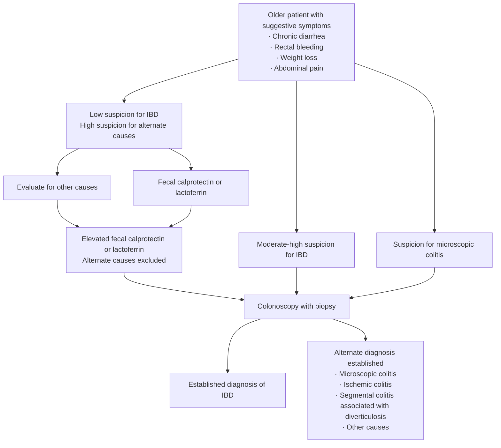

# IBD in Older Adults

*Age- and frailty-specific overlay on the general [[inflammatory-bowel-disease|inflammatory bowel disease (IBD)]] framework. Drug efficacy ordering lives on [[crohns-disease]] and [[ulcerative-colitis]]; what changes after 60 is **safety**, not efficacy.*

## Contents
- [[#Definition and Scope]]
- [[#Epidemiology and Phenotype]]
- [[#Diagnosis]]
  - [[#Mimics to Exclude After Age 60]]
  - [[#Diagnostic Algorithm]]
- [[#Treatment Principles]]
  - [[#Drug-by-Drug Safety in Older Adults]]
  - [[#Treatment Algorithm]]
- [[#Surgery]]
- [[#Health Maintenance]]
- [[#Best Practice Advice]]

## Definition and Scope

- **Older/elderly = age ≥60 years** ([[aga-2021-ibd-elderly]]).
- Population growing from two directions: incident elderly-onset disease + aging of the prevalent cohort.
- **Central rule: chronologic age alone is a poor decision variable.** Comorbidity, frailty, functional status, polypharmacy and immunosenescence drive diagnosis and drug selection.
- ⚠ **Therapy choices should not be delayed, nor corticosteroid therapy prolonged, out of concern for immune therapy–associated risks.**

## Epidemiology and Phenotype

| Measure | Value |
|---|---|
| Prevalence | ~**1 in 160** older individuals; rising **5.2%/year** |
| Share diagnosed after 60 (North America, Asia) | **up to 15%** |
| Incidence >60 y | **4–8 per 100,000** |
| Mortality — ulcerative colitis (UC) | **no difference** by age of onset |
| Mortality — Crohn's disease (CD) | **33/10,000 person-years** (elderly) vs **5.6** (middle age) vs **1** (young) |
| CD phenotype | **isolated colonic disease 44%**; less penetrating or perianal |
| UC phenotype | **left-sided disease 40%**; some data show elderly-onset UC more likely to reach colectomy |

- Phenotypes look more benign, but predict course from **specific disease characteristics, not chronologic age**.

## Diagnosis

### Mimics to Exclude After Age 60

*vs patients <40 y, these are more likely than IBD:* [[colorectal-cancer]] · [[colon-ischemia|ischemic colitis]] · [[segmental-colitis-associated-with-diverticulosis|segmental colitis associated with diverticulosis (SCAD)]] · nonsteroidal anti-inflammatory drug (NSAID)-induced pathology · [[radiation-proctopathy|radiation enteritis/colitis]] · [[microscopic-colitis]].

- Management of these differs substantially → confirm the IBD diagnosis vigorously.
- **Segmental left-sided colitis + diverticulosis** → consider SCAD alongside CD and IBD-unclassified.

**First-pass labs:** complete blood count (CBC) · serum albumin · serum ferritin · C-reactive protein (CRP). Liver enzymes, urea and creatinine serve double duty — comorbidity assessment **and** baseline for toxicity monitoring.

**Stool:** *C. difficile* testing in **all** new presentations of diarrhea, **regardless of antibiotic history**; selective culture and ova and parasites (O&P).

**Imaging:** computed tomography (CT) is appropriate with acute symptoms, especially prominent abdominal pain — also excludes ischemic and diverticular disease.

**Endoscopy:** [[colonoscopy]] with histologic confirmation is the cornerstone, but weigh procedural and anesthesia risk against comorbidity and polypharmacy. Where the indication is equivocal or high-risk, fecal calprotectin and imaging aid the decision.

### Diagnostic Algorithm

*Figure 1 — Diagnostic algorithm for older patients with IBD. ([[aga-2021-ibd-elderly]])*

## Treatment Principles

- **Selection principles are the same as in the general population.** Little evidence for age-related differences in *efficacy*; the differences are *safety*, driven by higher malignancy frequency and immunosenescence.
- **Risk-stratify for severe course:** perianal or penetrating phenotype · long-segment small bowel involvement (CD) · extensive colitis (UC) · anemia · hypoalbuminemia · elevated inflammatory markers · weight loss.
- **Assess fitness and frailty in addition to age.** Pretreatment frailty was associated with increased infection risk after immunomodulator or anti-tumor necrosis factor (anti-TNF) treatment **and** after surgery.
- **Pre-therapy screening is unchanged from younger patients:** hepatic and renal function · latent tuberculosis (TB) · hepatitis B · thiopurine methyltransferase (TPMT) status before thiopurine use.
- **Polypharmacy is the reason for pharmacist involvement:** **29%** of persons aged **57–85 y** take **≥5 prescription drugs**; **4%** are at risk of a major drug–drug interaction.
- **Care is multidisciplinary:** gastroenterology (GI) · primary care/geriatrics · other subspecialists · mental health · surgery · nutrition · pharmacy, engaging family and caregivers.

### Drug-by-Drug Safety in Older Adults

| Agent | Age-specific signal |
|---|---|
| [[mesalamine-5-asa\|Aminosalicylates]] | Efficacy proven in mild–moderate UC, **less well established in CD** (no or modest benefit over placebo). **>2/3 of older patients** with UC and CD receive mesalamine. **Interstitial nephritis** is the pertinent rare risk, on top of age-related renal decline |
| [[corticosteroids-ibd\|Systemic corticosteroids]] | Efficacy similar by age. Older patients are **more likely to be given steroids for maintenance** despite being **less** steroid-dependent (**21% vs 30%**). Exacerbate diabetes, hypertension, glaucoma, cataract, osteoporosis, cognitive impairment. **No efficacy for maintenance at any age** |
| [[corticosteroids-ibd\|Budesonide]] | Only **modestly lower efficacy** than systemic steroids in CD, fewer adverse effects, **less adrenal suppression** long-term. **Budesonide-MMX** works in mild–moderate **left-sided UC**. → Preferred in **ileocolonic or right-sided luminal CD, or left-sided UC** |
| Topical steroids / 5-aminosalicylate (5-ASA) | Effective for distal colonic disease but **poorly tolerated with limited mobility or weak sphincter tone** → prefer a **lower-volume formulation such as foam** |
| [[thiopurines]] | **Non-melanoma skin cancer (NMSC) 4.04 vs 0.66 per 1000** (>65 y vs <50 y). **Lymphoproliferative disorder 5.41 vs 0.37 per 1000 person-years**; in nonusers the age gap is far smaller (**1.68 vs 0**). Higher hepatotoxicity, **less** acute pancreatitis. **Avoidance solely on chronologic age is not appropriate** |
| [[methotrexate]] | Attractive in older adults with **CD** — induction and maintenance data; can **substitute for a thiopurine in combination therapy** when malignancy risk is a concern |
| [[anti-tnf-agents\|Anti-TNF]] | Efficacy mixed: corticosteroid-free remission at 12 mo **31% vs 67%**; lower response at **10 weeks** but **no difference later**; meta-analysis found no efficacy difference for infliximab or golimumab. Safety: severe infection **11% vs 2.6%**, cancer **3% vs 0%**, death **10% vs 1%** vs matched younger controls; pooled infection **odds ratio (OR) 2.28 (1.57–3.31)**, malignancy **OR 3.07 (1.98–4.62)** vs younger biologic users — **but no malignancy excess vs older controls**. **A fifth discontinue within 12 months** |
| [[vedolizumab]] | Effectiveness **similar** by age; **no age-related difference in any adverse events including serious infections**. Gut-selective → favorable safety. Head-to-head (131 anti-TNF vs 103 vedolizumab) showed **no infection difference at 1 year**, with **wide confidence intervals** |
| [[il-23-and-il-12-23-inhibitors\|Ustekinumab]] | **No published safety data specifically in older patients with IBD.** A case series of 24 psoriasis patients showed few infections |
| [[jak-inhibitors\|Tofacitinib]] | Safety is **indirect, from rheumatology**. Serious adverse events more common in older users at both 5 mg and 10 mg twice daily (BID) — **but the same effect appeared on placebo**, suggesting no incremental age effect. **Herpes zoster 5.5 (5 mg) and 3.1 (10 mg) per 100 patient-years vs 0 on placebo.** **Venous thromboembolism/pulmonary embolism (VTE/PE) on 10 mg BID with cardiovascular risk factors: 0.4 vs 0.07 per 100 patient-years on anti-TNF** — the interim analysis behind the boxed warning |
| [[calcineurin-inhibitors\|Cyclosporine]] | Rarely used, but **may be considered as rescue therapy in acute severe UC** where anti-TNF is contraindicated or has failed |

**Combination therapy (immunomodulator + anti-TNF) — evidence is mixed and the split is by phenotype and fitness:**

- *Combine* with **severe disease: deep ulceration, extensive bowel involvement, penetrating phenotype.** REACT post hoc found benefit of early combined intervention **similar in older and younger patients with no increase in risk**.
- *Monotherapy* preferred with **significant frailty, comorbidity, or infection risk**. One cohort found older patients on combination therapy **twice as likely to stop therapy early** (**hazard ratio [HR] 2.20; 95% confidence interval [CI] 1.12–4.32**).

### Treatment Algorithm

Three parallel assessments at new diagnosis:

| Assessment | Outputs |
|---|---|
| Prognostic factors · disease phenotype · psychosocial supports and needs | Mild vs severe disease |
| Comorbidity, frailty, functional status | Fit vs frail patient |
| Health maintenance | General health maintenance + vaccination |

| Phase | Options (figure's own annotations in parentheses) |
|---|---|
| **Induction** | Steroids (prefer budesonide over prednisone) · anti-TNF (assess ability to administer and adhere) · vedolizumab (*maybe slightly favored with higher complication risk*) · ustekinumab (*same*) · tofacitinib (*higher VTE risk with 10 mg BID and cardiac risk factors*) |
| **Maintenance** | Anti-TNF (assess adherence) · vedolizumab (*maybe slightly favored*) · ustekinumab (*same*) · thiopurines (*select cases; higher lymphoma and NMSC risk vs more targeted biologics*) · tofacitinib 5 mg BID |

*Figure 2 — Treatment algorithm for older patients with IBD. ([[aga-2021-ibd-elderly]])*

⚠ **Figure 2 predates the interleukin-23 (IL-23) p19 inhibitors and the selective Janus kinase 1 (JAK-1) inhibitors** now ranked by the American Gastroenterological Association (AGA) living guidelines on [[crohns-disease]] and [[ulcerative-colitis]]. Its contribution is the age- and frailty-specific safety overlay, not the efficacy ordering.

## Surgery

- Data on whether older age raises postoperative complication risk **conflict** — some small studies found no difference.
- **American College of Surgeons National Surgical Quality Improvement Program (ACS NSQIP):** 30-day postoperative mortality **higher** in older patients with both CD and UC; **complications 34.5% vs 21.3%**. Also higher postoperative infection, VTE, bleeding requiring transfusion, and cardiac, renal and neurologic complications including stroke and coma.
- **Emergent surgery is independently associated with increased mortality.**
- **UC operation choice:** reduced anal sphincter tone → **worse functional outcomes from an ileal pouch–anal anastomosis**; an **end-ostomy may offer more functional independence** in select patients.
- **Pharmacologic thromboprophylaxis** — higher VTE risk.
- **Assess and optimize nutritional status before surgery.**
- Timing and type of surgery weigh disease severity · impact on functional status and independence · risks and effectiveness of medical therapy · candidacy for surgery · postoperative complication risk.

## Health Maintenance

- **Vaccinate before immunosuppression where possible:** influenza (annual) · pneumococcal · **inactivated** herpes zoster. Influenza and zoster vaccines are underused in IBD; risk is increased especially on immunomodulatory drugs. See [[ibd-preventive-care]].
- The gap is structural: gastroenterologists defer to primary care, but **IBD patients of any age may have no primary care provider (PCP)**, and PCPs may be uncertain about vaccine safety and timing on immunomodulators.
- Keep up to date with **age-appropriate general-population cancer screening**; also screen for depression and optimize comorbidity.
- **Chronic colitis of usually ≥8 years duration** confers ~**2-fold** colorectal cancer (CRC) risk vs age-matched community counterparts. **Relative risk is higher in younger IBD patients; absolute risk is higher in older patients.** Adenomas and serrated polyps are also more common with age.
- **Stopping [[colonoscopy-surveillance|surveillance]] is an explicit judgment, not an interval:** age · comorbidity · overall life expectancy · likelihood of endoscopic resectability of a lesion · candidacy for colon resection surgery — weighed against the anesthesia and perforation risk of the procedure itself.

## Best Practice Advice

[[aga-2021-ibd-elderly]] carries **15 Best Practice Advice statements**, numbered **within three groups** (Diagnosis 1–3; Treatment: general principles 1–10; Health maintenance 1–2) — there is no continuous 1–15 numbering. It is an Expert Review and **assigns no Grading of Recommendations Assessment, Development and Evaluation (GRADE) rating, strength of recommendation, or quality-of-evidence label to any statement**; most underlying data are observational or indirect, because older patients are a very small proportion of IBD trial participants. All 15 are reproduced verbatim on the source page.

⚠ Treatment statement 4 reads "Candidacy for immunosuppression should be based on chronologic age, as well as consideration for the patient's functional status, comorbidities … and frailty." The surrounding text argues the opposite emphasis. Read it as adding comorbidity, function and frailty **to** age — not as endorsing age alone.

## See Also

[[inflammatory-bowel-disease]], [[crohns-disease]], [[ulcerative-colitis]], [[ibd-preventive-care]], [[ibd-in-malignancy]], [[thiopurines]], [[anti-tnf-agents]], [[vedolizumab]], [[jak-inhibitors]], [[corticosteroids-ibd]], [[segmental-colitis-associated-with-diverticulosis]], [[microscopic-colitis]], [[colonoscopy-surveillance]]

---

## Sources

1. [[aga-2021-ibd-elderly|AGA Clinical Practice Update on Management of Inflammatory Bowel Disease in Elderly Patients: Expert Review]]
