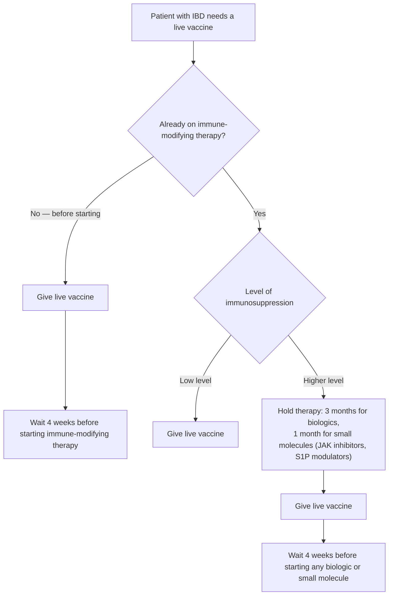

Patients with [[inflammatory-bowel-disease|inflammatory bowel disease (IBD)]] ([[crohns-disease|Crohn's disease (CD)]] and [[ulcerative-colitis|ulcerative colitis (UC)]]) require proactive health maintenance beyond gastrointestinal (GI) disease management. More than 70% of IBD patients will at some time be on immune-modifying therapy, significantly elevating the risk of vaccine-preventable infections, certain malignancies, and osteoporosis. Gastroenterologists should not assume primary care manages these issues — verification, documentation, and administration at GI visits is expected. How the ACG recommendations changed from 2017 to 2025: [[acg-2025-ibd-preventive-care#What Changed From 2017]].

## Contents
- [[#Vaccination Principles]]
  - [[#Vaccine Checklist by Agent/Age]]
  - [[#Live Vaccines]]
  - [[#Pneumococcal Schedule (ACG 2025 Figure 1)]]
  - [[#Hepatitis B Seroprotection Algorithm (AGA 2025)]]
  - [[#Pneumococcal Sequencing (AGA 2025)]]
  - [[#Vaccine Timing Note (AGA 2025)]]
- [[#Cancer Screening]]
  - [[#Cervical Cancer]]
  - [[#Melanoma]]
  - [[#Non-Melanoma Skin Cancer (NMSC)]]
  - [[#Anal Cancer]]
  - [[#Colorectal Dysplasia]]
- [[#Osteoporosis Screening]]
- [[#Mental Health Screening]]
- [[#Smoking]]
- [[#See Also]]
- [[#Sources]]

---

## Vaccination Principles

**Live vaccines are contraindicated in patients on immune-modifying therapy** (live attenuated influenza, measles-mumps-rubella (MMR), dengue, yellow fever, live herpes zoster (HZ) vaccine [Zostavax — no longer available in the US]). Decision pathway for when a live vaccine is needed: [[#Live Vaccines]].

**Timing:** Administer all due vaccines before starting immune-modifying therapy when possible; do not delay necessary IBD therapy for vaccination. For patients already on therapy, vaccines should not wait — administer at earliest opportunity regardless of biologic cycle timing; small molecules are not held for vaccination. Nonlive vaccines are safe in IBD (adverse events similar to patients without IBD).

**Immune response:** aminosalicylate or [[thiopurines|thiopurine]] monotherapy — normal responses. [[anti-tnf-agents|Anti–tumor necrosis factor (TNF) therapy]] blunts responses to inactivated vaccines, most with combination thiopurine or methotrexate. Non-TNF biologics ([[vedolizumab]], [[il-23-and-il-12-23-inhibitors|ustekinumab]]) appear to have less impact (small studies). Tofacitinib lowered pneumococcal (not influenza) response in rheumatoid arthritis; no data for upadacitinib, selective interleukin-23 (IL-23) inhibitors, or sphingosine-1-phosphate (S1P) modulators ([[jak-inhibitors|Janus kinase (JAK) inhibitors]] page holds the class detail).

### Vaccine Checklist by Agent/Age

| Vaccine | Who | Note |
|---|---|---|
| Annual influenza (inactivated, non-live) | All IBD (ungraded key concept) | **Anti-TNF monotherapy → high-dose (HD) vaccine**; age ≥65 → HD, recombinant, or adjuvanted vaccine. Patients on immune-modifying therapy (IMT) and household contacts: inactivated, not live inhaled. Ideally September–October; can be co-administered with pneumococcal, severe acute respiratory syndrome coronavirus 2 (SARS-CoV-2), and respiratory syncytial virus (RSV) vaccines |
| 20- or 21-valent pneumococcal conjugate vaccine (PCV20 or PCV21) — single dose | IBD ≥50, no prior vaccine (strong, low); IBD 19–49 on IMT, no prior vaccine (conditional, very low) | Previously vaccinated, 19–64 on IMT or ≥65: follow Centers for Disease Control and Prevention (CDC) guidance (strong, low) — sequencing in [[#Pneumococcal Schedule (ACG 2025 Figure 1)]] |
| Recombinant HZ vaccine (Shingrix), 2-dose | All IBD ≥50 (conditional, low); IBD ≥19 on or planning IMT (conditional, very low) | 0.5 mL intramuscular at **0 and 2–6 months**; immunocompromised may use **0 and 1–2 months**. Nonlive — safe on IMT and if varicella history unknown |
| RSV vaccine (single dose) | **American College of Gastroenterology (ACG)/Advisory Committee on Immunization Practices (ACIP):** IBD ≥75; IBD 50–74 with chronic conditions or high-risk features | ⚠ **Guidelines differ** — American Gastroenterological Association (AGA) 2025 instead advises all IBD **≥60** (no product preference). Page follows ACG/ACIP as the ACIP-aligned age cut; use AGA's ≥60 if screening more broadly |
| Hepatitis B (2- or 3-dose series, product-dependent) | All IBD not immune | ACG 2025: test hepatitis B surface antigen, core antibody, and surface antibody and vaccinate nonimmune patients before anti-TNF; check hepatitis B surface antibody (anti-HBs) 1–3 months after the series in immunocompromised patients; 2-dose adjuvanted vaccine or double-dose regimens improve response. AGA 2025: Evaluate all adults for latent hepatitis B virus (HBV); if previously fully vaccinated but anti-HBs <10 mIU/mL → see challenge-dose algorithm below |
| Varicella (2-dose, live) | Non-immune IBD before starting IMT | Immunity = documented chickenpox history or completed 2-dose series (ACG); serology not recommended after prior vaccination (high false-negative rate). Give ≥4 weeks before IMT; if already on IMT see [[#Live Vaccines]]. AGA 2025: varicella and MMR series history = presumptive immunity |
| Human papillomavirus (HPV) | ACG 2025 (per ACIP): ages 9–26 (catch-up through 26); 27–45 by shared decision-making. AGA 2025: all adults 18–26; 27–45 if likely to have a new sexual partner | |
| Tetanus, diphtheria, and acellular pertussis (Tdap), hepatitis A virus (HAV), meningococcus | Per ACIP recommendations | Tdap once, then tetanus-diphtheria (Td) or Tdap every 10 y; Tdap at 27–36 wk of each pregnancy. HAV for increased-risk adults (travel, men who have sex with men, drug use, homelessness, chronic liver disease, human immunodeficiency virus [HIV]). Meningococcal for IBD patients with meningitis risk factors |
| [[rotavirus\|Rotavirus]] (live) | Infants with in-utero biologic exposure | **May be offered** (ACG 2025 Rec 7, conditional, very low); no serious adverse events in >300 exposed infants |

### Live Vaccines

*Recreated from [[acg-2025-ibd-preventive-care|ACG 2025]] Figure 2 ("Live vaccine administration in patients with IBD"); immunosuppression levels per CDC definitions.*

| Low-level immunosuppression | Higher-level immunosuppression |
|---|---|
| Short-term steroids (<14 days) | High-dose steroids (>20 mg/day prednisone) |
| Low-to-moderate dose steroids (<20 mg/day prednisone or equivalent; <2 mg/kg/day for a young child) | Methotrexate or azathioprine |
| Long-term alternate-day short-acting steroids | Biologic therapy (anti-TNF) |
| Maintenance physiologic (replacement) steroid doses | Non-TNF biologics (ustekinumab, risankizumab, mirikizumab, guselkumab) |
| Topical (skin, eyes), inhaled, or intra-articular/bursal/tendon steroid injection | JAK inhibitors and S1P modulators (tofacitinib, upadacitinib, ozanimod, etrasimod) |
| Vedolizumab | |

Figure 2 caveats:
- Corticosteroids at the low-level doses above usually do not contraindicate live-virus vaccines.
- Current gastroenterology guidelines have **not** recommended live vaccines during any immune-modifying therapy; giving a live vaccine to someone on a TNF or non-TNF biologic or a small molecule is currently not recommended.
- If vaccination is needed, one opportunity to interrupt therapy is after surgical resection for CD. A 3-month hold resembles episodic dosing — risk of antidrug antibodies, loss of response, infusion reactions, flares — so weigh it against infection risk (likely low even during outbreaks).
- Low-dose immunomodulators (methotrexate <0.4 mg/kg/week, azathioprine <3 mg/kg/day, 6-mercaptopurine <1.5 mg/kg/day) do not preclude the live zoster vaccine (Zostavax) — this does not establish safety of other live vaccines.
- Vedolizumab: the US Food and Drug Administration (FDA) label allows concurrent live vaccines only if benefits outweigh risks.
- Non-TNF biologics' lower serious-infection rate does not make live vaccines safe on them.

### Pneumococcal Schedule (ACG 2025 Figure 1)

Vaccine-naive adults with IBD (any age, any immunosuppression status): **one dose of PCV20 or PCV21, no further boosters**. Prior 13-valent pneumococcal conjugate vaccine (PCV13) or 23-valent pneumococcal polysaccharide vaccine (PPSV23):

| Age group | PCV-naive | Incomplete PCV series† | Completed adult PCV series‡ |
|---|---|---|---|
| 19–49 immunocompromised; all 50–64 | PCV21 or PCV20 | PCV13 only → PCV21 or PCV20 **≥1 year** later; PCV13 + PPSV23 → PCV21 or PCV20 **≥5 years** later | No vaccine recommendation |
| ≥65 | PCV21 or PCV20 | ≥5 years since last PCV → PCV21 or PCV20 | PCV20 or PCV21 — one additional dose 5 years after the previous vaccine |

† Incomplete: unknown history; 7-valent vaccine (PCV7) at any age; PPSV23 only; PCV13 only; PCV13 + 1 dose PPSV23.
‡ Completed: PCV13 + 2 doses PPSV23; 15-valent vaccine (PCV15) + PPSV23; PCV20; or PCV21.

### Hepatitis B Seroprotection Algorithm (AGA 2025)

- Evaluate **all** adult IBD patients for latent [[chronic-hepatitis-b|hepatitis B]].
- Previously completed full HBV series but **not seroprotected (anti-HBs <10 mIU/mL):**
  1. Give a single **challenge dose** of HBV vaccine.
  2. Recheck anti-HBs at **4–8 weeks**.
  3. **Amnestic response** (anti-HBs ≥10 mIU/mL) → immunologic memory; no further doses.
  4. **No amnestic response** → complete a second full 2- or 3-dose HBV series.

### Pneumococcal Sequencing (AGA 2025)

- IBD aged **19–64**: initial pneumococcal vaccine; **second** dose administered at **≥65**.

### Vaccine Timing Note (AGA 2025)

- Inactivated vaccines are safe and do not exacerbate IBD activity — administer at the earliest opportunity, preferably off corticosteroids or at the lowest tolerable dose.

---

## Cancer Screening

*Scope split: this section is **screening of the cancer-free IBD patient**. What to do with thiopurines, anti-TNF, and the newer classes **once a cancer has developed** (or in a patient with a prior cancer) lives on [[ibd-in-malignancy]] — including the drug-by-cancer-type stop/continue grid. Do not duplicate it here.*

### Cervical Cancer

- Women with IBD on immune-modifying therapy → annual cervical cancer screening within 1 year of sexual activity onset (ACG 2025 Rec 8, conditional, very low)
- If <30 years old: continue annual screening for 3 consecutive years before transitioning to every 3 years
- Mechanics (ACG 2025, modeled on HIV guidance): baseline cytology; if normal, annual × 3 years, then every 3 years. Abnormal cytology → HPV serotyping; persistent abnormality → colposcopy
- Not on immune-modifying therapy → average-risk screening
- Applies also to JAK inhibitor and S1P modulator users (expert opinion; no data)
- Rationale: consistent trend toward more cervical dysplasia with immunosuppressants; women with IBD on immunosuppressants are screened less often than recommended
- *AGA 2025 differs:* data deemed **insufficient** to determine whether combined immunosuppression/thiopurines require more frequent (vs standard US Preventive Services Task Force [USPSTF]) cervical screening — shared decision making and individual risk stratification encouraged. Meta-analysis (Mann et al): no significant increased cervical cancer risk in IBD (hazard ratio [HR] 1.24, 95% confidence interval [CI] 0.94–1.63); slightly elevated low-grade lesions (HR 1.15). Page retains the more intensive ACG recommendation.

### Melanoma

- Annual melanoma screening for all IBD patients (CD and UC) regardless of biologic therapy use (ACG 2025 Rec 9, conditional, very low)
- ACG 2025: everyone on systemic immunosuppressive therapy gets an **annual total body skin exam** (melanoma + nonmelanoma skin cancer [NMSC]) and should do regular self-exams; all starting immunosuppression should use ultraviolet A/B-protective sunscreen and sun-protective clothing
- IBD itself carries ~37% higher melanoma risk (relative risk [RR] 1.37); meta-analyses show no statistically significant biologic- or thiopurine-associated melanoma increase

### Non-Melanoma Skin Cancer (NMSC)

- Annual NMSC screening for patients on: 6-mercaptopurine, azathioprine, methotrexate, JAK inhibitors, or S1P receptor modulators — particularly >50 years old (ACG 2025 Rec 10, conditional, very low)
- Thiopurine NMSC risk: RR 1.88; incidence rate ratio increases from 1.6× in year 1 to 3.6× by year 5
- Risk may persist after discontinuation (conflicting data) — ACG 2025 also advises continuing skin surveillance after stopping thiopurines
- Vedolizumab: no NMSC signal
- AGA 2025: yearly total body skin exam (TBSE) for patients on immunomodulators, anti-TNF, or small molecules; **continue yearly TBSE even after thiopurine cessation** for anyone with any history of thiopurine use. All IBD patients counseled on ultraviolet (UV)/sun primary prevention.

### Anal Cancer

*AGA 2025 net-new (BPA 4). Risk-group eligibility, start ages, and the cytology/hrHPV → high-resolution anoscopy pathway for the general high-risk population live on [[anal-cancer-screening]] — not duplicated here.*

- At **every [[colonoscopy]]**, perform a thorough perianal and anal examination.
- Special attention to the anal canal in: perianal [[crohns-disease|Crohn's disease]], anal stricture, HPV, HIV, and anoreceptive intercourse.
- Mostly squamous cell carcinoma. Incidence: 10.2/100,000 person-years in [[ulcerative-colitis|UC]], 7.7 in [[crohns-disease|CD]]; **19.6/100,000 in anal/perianal Crohn's**.
- Other risk factors: smoking, persistent HPV, HIV, men who have sex with men (MSM), women with HPV-associated genital cancers, solid organ recipients.
- Screening tools (risk-dependent): digital anorectal exam, cytology, high-risk HPV testing ± genotyping. Anal cytology not yet used for routine non-HIV screening.

### Colorectal Dysplasia

- Not addressed in these preventive-care guidelines. Who and when to survey for [[colorectal-cancer|colitis-associated colorectal cancer (CRC)]] lives on [[ulcerative-colitis]] and [[crohns-disease]]; chromoendoscopy/SCENIC technique on [[colonoscopy]]. These guidelines give no numeric repeat interval for IBD dysplasia surveillance. The average-risk grid on [[colonoscopy-surveillance]] explicitly excludes IBD.

---

## Osteoporosis Screening

Patients with IBD and conventional bone mineral density (BMD) risk factors → dual-energy x-ray absorptiometry (DEXA) scan at time of IBD diagnosis and periodically (ACG 2025 Rec 11, conditional, very low). Osteoporosis = BMD ≥2.5 standard deviations below young-adult peak mean.

**Key risk factors in IBD:**

- Corticosteroid use (risk tracks **daily** dose, not cumulative): 30–50% of long-term users develop fractures; prednisone **>7.5 mg/day → 5-fold** spine/hip fracture risk; even **2.5 mg/day → 1.55-fold** spinal fracture risk; fractures appear **3–6 months after starting**, risk falls as early as **3 months after stopping** and returns to baseline within **1–2 years**
- IBD-associated [[nutrition-in-ibd|malnutrition]], vitamin D deficiency, low weight
- Overall IBD fracture risk: RR 1.38 (vertebral RR 2.26)

Conventional DEXA risk factors apply: age, female sex, low body mass index (BMI), smoking, family history of hip fracture, alcohol use, prior fracture.

**Follow-up imaging and tools (ACG 2025):**

- **FRAX** (Fracture Risk Assessment Tool): 10-year hip and major osteoporotic fracture probability; designed for postmenopausal women and men ≥50; may overestimate risk in IBD; not a substitute for DEXA.
- **Spinal x-rays** only if height loss **≥4 cm** vs height at age 20, **≥2 cm** during follow-up, or symptoms such as back pain.
- **Repeat DEXA** after starting osteoporosis therapy: at a minimum of **1 year** (annual BMD change ~1% is below scanner precision error ~3%, so routine 1–2-year monitoring scans are contested).

**AGA 2025 indications (bone densitometry regardless of age when present):** BMI <20 kg/m², >3 months cumulative corticosteroid exposure, current smoking, postmenopausal status, or hypogonadism. Absent other factors, screen postmenopausal women and men ≥65.

---

## Mental Health Screening

- Screen all IBD patients (CD and UC) for depression and anxiety at baseline and annually (ACG 2025 key concept 11, ungraded)
- Refer to counseling/therapy if screen positive

**Epidemiology:**

- Anxiety: 32.1% of IBD vs. 10.4% general population
- Depression: 25.2% of IBD vs. 17.9% controls
- CD patients 20% more likely than UC to report both
- Active disease: >2× anxiety risk, 3× depression risk vs. remission
- Depression at baseline predicted relapse in one cohort and lower clinical remission after infliximab in another; other studies found no association

**Treatment:**

- Cognitive behavioral therapy (CBT): mixed — a 10-week randomized controlled trial (face-to-face or online) showed no significant effect; an updated meta-analysis of psychological therapies showed significant, persistent decreases in depression and anxiety scores
- Acceptance and commitment therapy: single small study — anxiety (not depression) improved
- Antidepressants: effective for psychological and somatic symptoms (review of 12 studies); serotonin-noradrenaline reuptake inhibitors improved depressive and anxiety scores (neuromodulator class/dosing table on [[ibd-pain-management]])
- IBD treatment alone lowered depression scores in a meta-analysis, but heterogeneity left this inconclusive

---

## Smoking

- Counsel all adults with IBD who smoke to quit (ACG 2025 Rec 12, strong, low; 2017 version limited this to CD)
- CD: smoking raises risk of developing CD (meta-analysis odds ratio 1.76), stricturing and perianal complications, flares, first and second surgery, and postoperative endoscopic recurrence; smokers respond less to anti-TNF (RR 0.63)
- Quitting >1 year → flare risk similar to never-smokers
- Colorectal neoplasia: former smoking raised risk in UC (hazard ratio 1.73); active and passive smoking raised risk in CD

## See Also

[[inflammatory-bowel-disease]], [[crohns-disease]], [[ulcerative-colitis]], [[thiopurines]], [[anti-tnf-agents]], [[vedolizumab]], [[ibd-in-malignancy]], [[ibd-endoscopic-scoring]], [[ibd-pain-management]], [[nutrition-in-ibd]], [[anal-cancer-screening]], [[pouchitis]], [[colonoscopy]], [[chronic-hepatitis-b]], [[rotavirus]], [[colorectal-cancer]], [[colonoscopy-surveillance]], [[primary-sclerosing-cholangitis]], [[il-23-and-il-12-23-inhibitors]], [[jak-inhibitors]]

---

## Sources

1. [[acg-2025-ibd-preventive-care|ACG Clinical Guideline Update: Preventive Care in Inflammatory Bowel Disease (2025)]]
2. [[acg-2017-ibd-preventive-care|ACG Clinical Guideline: Preventive Care in Inflammatory Bowel Disease (2017)]] *(historical / superseded)*
3. [[aga-2025-noncolorectal-cancer-ibd|AGA Clinical Practice Update on Noncolorectal Cancer Screening and Vaccinations in Patients With Inflammatory Bowel Disease: Expert Review]]
