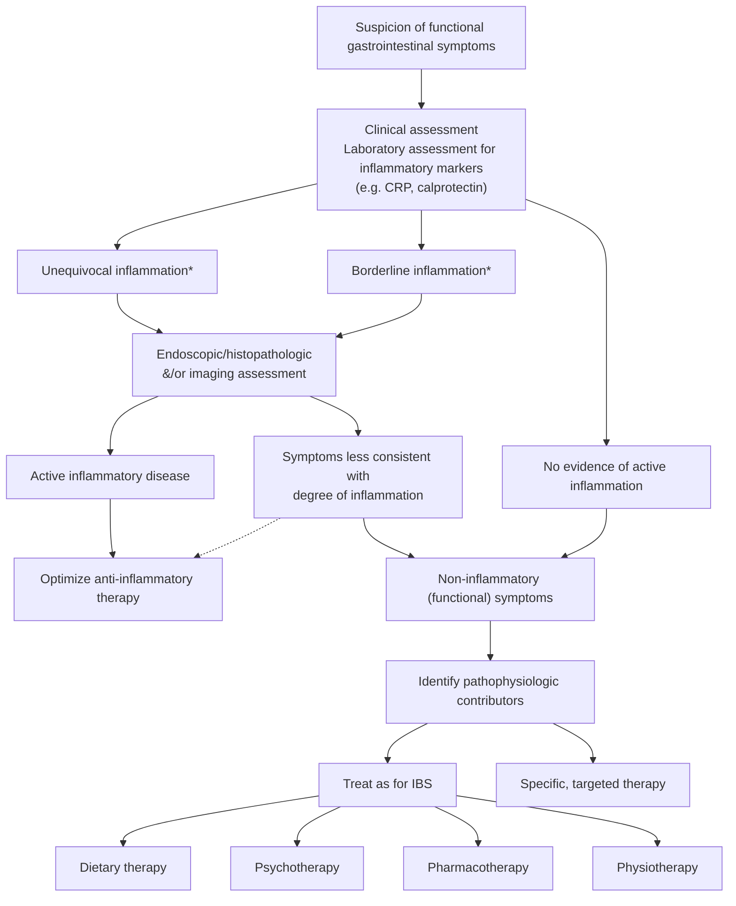

## Overview

Inflammatory bowel disease (IBD) comprises two major chronic immune-mediated disorders of the gastrointestinal (GI) tract: [[crohns-disease|Crohn's disease (CD)]] and [[ulcerative-colitis|ulcerative colitis (UC)]].

**Distinguishing the two — see [[uc-vs-crohns-comparison]].** That page carries the guideline-sourced distribution/depth/granuloma/smoking/surgery comparison (American College of Gastroenterology [ACG] 2025 UC and ACG 2025 Crohn's) and flags which classical teachings the guidelines do *not* assert.

## Where Each Topic Lives

| Topic | Page |
|---|---|
| Disease-specific diagnosis and therapy | [[crohns-disease]], [[ulcerative-colitis]] |
| UC vs CD distinguishing features | [[uc-vs-crohns-comparison]] |
| Endoscopic activity scoring (Mayo Endoscopic Subscore [MES], Ulcerative Colitis Endoscopic Index of Severity [UCEIS], Simple Endoscopic Score for Crohn's Disease [SES-CD], Rutgeerts) | [[ibd-endoscopic-scoring]] |
| Vaccination, cancer screening, bone/mental health in the cancer-free patient | [[ibd-preventive-care]] |
| Cancer risk from inflammation/drugs; what to do with IBD drugs once a cancer develops or with a prior cancer | [[ibd-in-malignancy]] |
| Anal cancer screening (general high-risk framework) | [[anal-cancer-screening]] |
| Colitis-associated [[colorectal-cancer\|colorectal cancer (CRC)]] dysplasia surveillance | [[ulcerative-colitis]], [[crohns-disease]] (technique on [[colonoscopy]]) |
| Diet and nutritional therapy | [[nutrition-in-ibd]] |
| Pain management | [[ibd-pain-management]] |
| Age- and frailty-specific safety overlay (age ≥60) | [[ibd-in-older-adults]] |
| Transmural monitoring | [[intestinal-ultrasound]] |
| Pouch disorders | [[pouchitis]] |
| Virtual follow-up, visit-type selection, remote monitoring | [[telemedicine-in-gastroenterology]] |
| Immunomodulator positioning, dosing, thiopurine methyltransferase (TPMT)/NUDT15 testing | [[thiopurines]] |
| Thiopurine / methotrexate hepatotoxicity | [[drug-induced-liver-injury]] |

## Inpatient Management of Hospitalized IBD

*Cross-cutting framework from [[aga-2026-inpatient-ibd|American Gastroenterological Association (AGA) 2026 Clinical Practice Update (CPU) on Inpatient Management of IBD]]. Disease-specific pathways: [[ulcerative-colitis]] (Acute Severe UC) and [[crohns-disease]] (Fulminant/Hospitalized CD).*

- **When to admit:** severe disease refractory to outpatient therapy, high suspicion for an IBD-related complication (intestinal obstruction, intra-abdominal abscess), or significant nutritional risk/failure to thrive. Increasingly patients are admitted for **failing outpatient therapy** rather than fulminant presentation.
- **Initial workup:** IBD-tailored history/exam; complete blood count (CBC) (anemia), C-reactive protein (CRP) and/or fecal calprotectin; assess disease activity with **biomarkers + endoscopy when indicated**; evaluate for IBD-related complications and **concomitant infections** ([[clostridioides-difficile|C. difficile]], cytomegalovirus [CMV]). Preparatory labs for anticipated drugs: fasting lipid panel before [[calcineurin-inhibitors|cyclosporine]]/[[jak-inhibitors|Janus kinase (JAK) inhibitor]]; latent tuberculosis (TB) (tuberculin skin test [TST] or interferon-gamma release assay [IGRA] — IGRA preferred if bacille Calmette-Guérin [BCG]-vaccinated) and [[chronic-hepatitis-b|hepatitis B virus (HBV)]] testing; [[nutrition-in-hospitalized-patients|malnutrition screen]] (e.g., Malnutrition Universal Screening Tool [MUST]).
- **Supportive care:** Intravenous (IV) hydration/electrolytes, treat anemia, pain control; avoid nonsteroidal anti-inflammatory drugs (NSAIDs).
- **Venous thromboembolism (VTE) prophylaxis:** all hospitalized IBD patients should receive **prophylactic [[anticoagulation-gi-bleeding|anticoagulation]]** (open question: benefit of continuing at discharge).
- **Discharge:** appropriate after resolution/stabilization of the acute indication — does **not** require CRP or imaging normalization; establish a clear outpatient transition plan (named responsible clinician, patient education) to reduce readmission.

## Functional GI Symptoms in Quiescent IBD

*Symptoms do not track inflammation in either direction. Framework from [[aga-2018-functional-gi-symptoms-ibd|AGA 2018 CPU on Functional Gastrointestinal Symptoms in Patients With IBD]], which numbers 14 Best Practice Advice (BPA) statements and assigns **no** evidence grade, strength, or quality rating to any of them.*

### Scale of the Overlap

- Pooled [[irritable-bowel-syndrome|irritable bowel syndrome (IBS)]] prevalence across IBD: **39% (95% confidence interval [CI] 30%–48%)**; **odds ratio (OR) 4.89 (95% CI 3.43–6.98)** vs controls. The Update's own caveat: IBS was defined by Manning, Rome I, Rome II, Rome III or other validated questionnaires, and the 4 case-control studies were of low quality — the numbers "should be taken with caution." Disease-specific split on [[crohns-disease]]; endoscopic-remission discordance on [[ulcerative-colitis]].
- Persistent diarrhea and abdominal pain in **16.3%** of IBD patients despite mucosal healing, associated with increased intestinal permeability.
- An IBS diagnosis in IBD tracked **higher narcotic use** — **17% vs 11% in CD** and **9% vs 5% in UC/indeterminate colitis** (both P < .001).
- **The stake is overtreatment.** Escalating anti-inflammatory therapy for symptoms driven by functional pathophysiology adds adverse-event risk with no symptomatic benefit. The Crohn's Disease Activity Index (CDAI) can be as high in IBS as in IBD — "no therapeutic decision should be taken based on clinical consideration alone."
- **Cost concentrates in the psychosocially burdened few: 15% of IBD patients account for approximately 50% of health care expenditures**, apparently driven by concomitant chronic pain, depression and poor social support ([[aga-2018-psychogastroenterology]]).

### Is It Inflammation? (BPA 1–4)

| # | Best practice advice (verbatim) |
|---|---|
| **1** | A stepwise approach to rule-out ongoing inflammatory activity should be followed in IBD patients with persistent GI symptoms (measurement of fecal calprotectin, endoscopy with biopsy, cross-sectional imaging). |
| **2** | In those patients with indeterminate fecal calprotectin levels and mild symptoms, clinicians may consider serial calprotectin monitoring to facilitate anticipatory management. |
| **3** | Anatomic abnormalities or structural complications should be considered in patients with obstructive symptoms including abdominal distention, pain, nausea and vomiting, obstipation or constipation. |
| **4** | Alternative pathophysiologic mechanisms should be considered and evaluated (small intestinal bacterial overgrowth, bile acid diarrhea, carbohydrate intolerance, chronic pancreatitis) based on predominant symptom patterns. |

**Clinical assessment that precedes any test:** bowel-pattern history with the presence *and severity* of associated pain, incontinence episodes, urgency and tenesmus; alarm features (weight loss, nocturnal symptoms, bleeding, high-volume or high-frequency diarrhea, fevers); recent antibiotic use; symptom duration. **Alarm features, or acute onset in previously well-controlled disease, keep suspicion for inflammation high.** Examine for distension and masses, inspect for perianal disease, and — absent obvious perianal pathology — perform a **careful digital rectal exam** for mass lesions and for a rectal evacuation disorder.

### Biomarker Limits — the Decision Inputs Behind BPA 1–2

- **CRP: up to 15% of patients fail to mount a CRP response.** A normal CRP does not exclude active inflammation. Optimal cutoffs "remain a source of debate."
- **Fecal calprotectin (FC) interpretive bands, as stated by this Update:** **<50 µg/g** may be reassuring and should prompt consideration of a non-IBD etiology for persisting symptoms; **50–250 µg/g may be challenging to interpret**, since upper normal limits may be seen with nonspecific low-grade inflammation; **200–250 µg/g** was the range predicting endoscopic remission in both UC and CD. Single-study cutoffs cited: **<60 µg/g** for deep remission in UC (sensitivity 86%, specificity 87%) and **≤40.5 µg/g** for histologic remission (sensitivity 41%, specificity 100%).
  - These are *interpretive* bands for persistent symptoms, not treat-to-target values — for the latter see [[ulcerative-colitis]] and [[crohns-disease]], whose newer guideline sources take precedence.
- **The operative interval behind BPA 2: serial calprotectin every 3–6 months** in patients with mild symptoms, to catch impending flares early.
- If a flare is suspected → **endoscopy with biopsies, or dedicated small-bowel imaging in CD.**

### Diagnostic Algorithm

*Figure 1 — Evaluation of suspected functional GI symptoms in IBD. \*Cut-off values for inflammatory markers such as calprotectin vary according to the clinical scenario; the figure sets no single threshold. ([[aga-2018-functional-gi-symptoms-ibd]])*

### Acquired Mechanisms to Work Up Before Calling Symptoms Functional

| Potential pathophysiological abnormality | Presentation | Potential investigations | Potential therapy |
|---|---|---|---|
| Anxiety and depression (inflammation-associated gut–brain axis change) | Pain, IBS, fatigue | Psychological or psychiatric evaluations | Psychological therapy, antidepressant, anxiolytic |
| Hypervigilance, central sensitization of pain processing | Pain, IBS | — | Similar approaches as for IBS (see [[ibd-pain-management]]) |
| Altered visceral sensory neurons (neuroinflammation); activation/sensitization of nociceptors; ↑mast cell density | Pain, IBS | — | — |
| [[bile-acid-diarrhea\|Bile acid diarrhea]] | Diarrhea, IBS | ⁷⁵SeHCAT testing*, fecal bile acids | Bile salt sequestrant |
| [[small-intestinal-bacterial-overgrowth\|Small intestinal bacterial overgrowth]] | Diarrhea, bloating, gas, pain, IBS | Breath testing, culture of small bowel aspirates | Antibiotics |
| [[exocrine-pancreatic-insufficiency\|Pancreatic exocrine insufficiency]] | Pain, weight loss, bloating, diarrhea | Fecal elastase | Pancreatic enzyme replacement |
| Lactose or fructose malabsorption | Gas, bloating, diarrhea, IBS | Breath testing | Dietary restriction |
| Obstipation/constipation from fecal stasis in uninflamed colon proximal to distal colitis (UC) | Constipation | Abdominal x-ray | Laxation, prokinetic |
| Intestinal stenosis (CD) | Pain, obstruction | Imaging, endoscopy | Dilatation, surgery |
| [[defecation-disorders\|Pelvic floor dyssynergia]] | Pain, constipation, IBS | Rectal exam, anorectal physiological studies | Biofeedback therapy |
| [[celiac-disease\|Celiac disease]] (not IBD-specific) | Diarrhea, gas, malabsorption | Celiac serology, small intestinal biopsy | Gluten-free diet |

\*⁷⁵SeHCAT (23-seleno-25-homotaurocholic acid) testing is not widely available in most countries outside Europe or Canada.

- **Pancreatic exocrine insufficiency is commoner than expected in IBD** — **OR 10.5 (95% CI 2.5–44.8)** vs controls by fecal elastase screening; falsely low elastase may simply reflect diarrhea, and its clinical significance in IBD remains undefined.
- **Structural disease hides from ileocolonoscopy.** Active small-bowel CD, stenosis and fistulas can be missed without systematic cross-sectional small-bowel imaging. Transmural fibrosis also occurs in UC (thickened muscularis mucosa, increased collagen in mucosa, submucosa and sometimes muscularis propria/subserosa) and is likely to affect colonic motility and anorectal function **even without strictures or active mucosal disease**.

### Managing the Functional Component (BPA 5–14)

Therapy is borrowed from IBS — the Update notes "a paucity of randomized controlled trials or even prospective studies" in IBD.

| # | Best practice advice (verbatim) | Where the detail lives |
|---|---|---|
| **5** | A low FODMAP diet may be offered for management of functional GI symptoms in IBD with careful attention to nutritional adequacy. | [[low-fodmap-diet]] |
| **6** | Psychological therapies (cognitive behavioural therapy, hypnotherapy, mindfulness therapy) should be considered in IBD patients with functional symptoms. | [[ibd-pain-management]], [[brain-gut-behavioral-therapy]] |
| **7** | Osmotic and stimulant laxative should be offered to IBD patients with chronic constipation. | [[chronic-constipation]] |
| **8** | Hypomotility agents or bile-acid sequestrants may be used for chronic diarrhea in quiescent IBD. | [[bile-acid-diarrhea]], [[loperamide]] |
| **9** | Antispasmodics, neuropathic-directed agents, and anti-depressants should be used for functional pain in IBD while use of opiates should be avoided. | [[ibd-pain-management]] |
| **10** | Probiotics may be considered for treatment of functional symptoms in IBD. | [[probiotics]] |
| **11** | Pelvic floor therapy should be offered to IBD patients with evidence of an underlying defecatory disorder. | [[defecation-disorders]] |
| **12** | Until further evidence is available, fecal microbiota transplant should not be offered for treatment of functional GI symptoms in IBD. | [[fmt]] |
| **13** | Physical exercise should be encourage[d] in IBD patients with functional GI symptoms. | — |
| **14** | Until further evidence is available, complementary and alternative therapies should not be routinely offered for functional symptoms in IBD. | — |

- **BPA 11's evidence base:** of **30 patients with IBD in remission and defecatory disorders, 30% had clinically relevant benefit from biofeedback therapy.**
- **BPA 13:** moderate exercise is safe in quiescent or mildly active IBD and improves well-being without detectable effect on inflammatory activity; higher exercise levels tracked with decreased risk of active disease in CD patients in remission. Whether it helps the *functional* symptoms specifically is untested.
- **BPA 14:** the complementary/alternative data (marijuana, curcumin, aloe vera, acupuncture, moxibustion) were not directed at functional symptoms and "have generally been of low quality."

## IBD Therapy During an Acute Systemic Viral Illness

*Framework from [[aga-2020-ibd-covid-19|AGA 2020 CPU on Management of IBD During the COVID-19 Pandemic]], written for coronavirus disease 2019 (COVID-19) and severe acute respiratory syndrome coronavirus 2 (SARS-CoV-2). Its epidemiology and investigational-therapy content is of historical interest only; the hold-versus-continue ladder below is the part that generalizes. **Ungraded expert commentary** — no numbered Best Practice Advice, no evidence grades.*

**Baseline position:** patients with IBD are **not** at increased risk of acquiring the infection. Do not pre-emptively stop therapy — relapse "strains available medical resources, may require steroid therapy, or necessitate hospitalization, outcomes that are all much worse than the known risks of existing IBD therapies."

| Agent class | Not infected | Infected, no symptoms | Confirmed illness |
|---|---|---|---|
| [[mesalamine-5-asa\|Aminosalicylates]], topical rectal therapy, diet, antibiotics | Continue | Continue | **Continue — considered safe** |
| Oral budesonide | Continue | Switch to it from prednisone where feasible | Likely safe; may continue if needed for control |
| Systemic [[corticosteroids-ibd\|corticosteroids]] | Continue | Reduce to **prednisone <20 mg/day** | **Avoid; discontinue quickly** — watch for adrenal insufficiency |
| [[thiopurines]], [[methotrexate]], [[jak-inhibitors\|tofacitinib]] | Continue | **Hold** | **Hold** |
| [[anti-tnf-agents\|Anti-TNF agents]], [[il-23-and-il-12-23-inhibitors\|ustekinumab]] | Continue | **Delay dosing 2 weeks** while monitoring | **Hold** |
| [[vedolizumab]] | Continue | Delay dosing 2 weeks | Hold if the IBD is stable (consensus was uncertain it is necessary) |

- **Restart** after 2 weeks if no illness develops; after confirmed illness, restart on complete symptom resolution, negative repeat viral testing, or serologic evidence of convalescence. No interval or threshold is defined for any of the three — the trigger is left to clinical judgement.
- **Infusion centres stay open.** Continue scheduled infusions where the centre prescreens for exposure and symptoms, checks temperatures at the door, spaces chairs **at least 6 feet apart**, uses and supplies masks and gloves, and deep-cleans after each patient. **Do not electively switch to an injectable** to avoid the centre — switching from infliximab to adalimumab was associated with relapse. **Home infusion is not recommended** (a travelling nurse can become a vector).
- **New digestive symptoms during the viral illness:** first exclude [[clostridioides-difficile|C. difficile]] and other enteric pathogens; then confirm active inflammation **nonendoscopically** — C-reactive protein, fecal calprotectin, or cross-sectional imaging — reading all three with caution, since the viral illness itself can raise them.
- **Hospitalized with severe IBD and the viral illness:** limit intravenous steroids to **3 days**, then decide between a [[calcineurin-inhibitors|calcineurin inhibitor]] and infliximab. Cytomegalovirus can be assessed by **serum polymerase chain reaction** to avoid [[colonoscopy]]. Surgical consultation as per standard practice.
- **Endoscopy:** urgent and emergent indications only — procedures that will "urgently change management." In IBD that means biopsies to diagnose new severe disease, excluding cytomegalovirus when noninvasive tests are equivocal, or mucosal inspection that would direct surgery. Use **N95, N99, or powered air-purifying respirators rather than surgical masks, plus double-gloving**, for both [[upper-endoscopy|upper]] and lower endoscopy **regardless of the patient's infection status**.

## See Also

[[crohns-disease]], [[ulcerative-colitis]], [[thiopurines]], [[ibd-preventive-care]], [[ibd-endoscopic-scoring]], [[ibd-pain-management]], [[ibd-in-malignancy]], [[nutrition-in-ibd]], [[intestinal-ultrasound]], [[clostridioides-difficile]], [[disorders-of-gut-brain-interaction]], [[drug-induced-liver-injury]], [[nutrition-in-hospitalized-patients]], [[colorectal-cancer]], [[pouchitis]], [[uc-vs-crohns-comparison]], [[probiotics]], [[anticoagulation-gi-bleeding]], [[anal-cancer-screening]], [[colonoscopy]], [[calcineurin-inhibitors]], [[jak-inhibitors]], [[ibd-in-older-adults]], [[irritable-bowel-syndrome]], [[low-fodmap-diet]], [[bile-acid-diarrhea]], [[small-intestinal-bacterial-overgrowth]], [[exocrine-pancreatic-insufficiency]], [[defecation-disorders]], [[chronic-constipation]], [[celiac-disease]], [[fmt]], [[loperamide]], [[brain-gut-behavioral-therapy]]

---

## Sources

1. [[aga-2026-inpatient-ibd|AGA Clinical Practice Update on Inpatient Management of Adults With Inflammatory Bowel Disease: Expert Review (2026)]]
2. [[aga-2018-functional-gi-symptoms-ibd|AGA Clinical Practice Update on Functional Gastrointestinal Symptoms in Patients With Inflammatory Bowel Disease: Expert Review]]
3. [[aga-2018-psychogastroenterology|Best Practice Update: Incorporating Psychogastroenterology Into Management of Digestive Disorders]]
4. [[aga-2020-ibd-covid-19|AGA Clinical Practice Update on Management of Inflammatory Bowel Disease During the COVID-19 Pandemic: Expert Commentary]]
