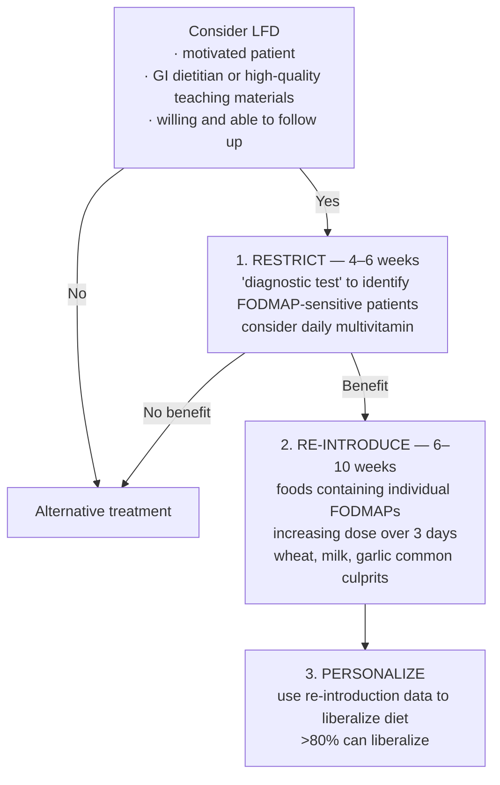

## Contents
- [[#Definition]]
- [[#Who Is a Candidate]]
- [[#The 3 Phases]]
  - [[#Phase 1 — Restriction (4–6 weeks)]]
  - [[#Phase 2 — Reintroduction (6–10 weeks)]]
  - [[#Phase 3 — Personalization]]
- [[#Efficacy]]
- [[#Nutritional Adequacy and Risks]]
- [[#Predicting Response]]
- [[#See Also]]
- [[#Sources]]

## Definition

- **FODMAPs** = fermentable oligo-, di-, and monosaccharides and polyols — short-chain, poorly digestible, poorly absorbed sugars.
- Carbohydrates are the **most common macronutrient trigger** in [[irritable-bowel-syndrome|IBS]]; fat content and total caloric intake enhance the gastrocolonic response and contribute to sensorimotor bowel dysfunction.
- The low-FODMAP diet (LFD) is **the most evidence-based diet intervention for IBS** ([[aga-2022-diet-ibs]], BPA 6).
- It is **not an open-ended restriction** — it is a structured 3-phase program with a defined endpoint (BPA 7).

---

## Who Is a Candidate

Prerequisites before starting (Figure 2, [[aga-2022-diet-ibs]]):

- **Motivated patient**
- **GI dietitian or high-quality teaching materials** available
- **Willing and able to follow up**

If these are not met → alternative treatment. Do not implement the diet solely on the basis of a brief handout or a mobile app.

**The LFD is the prototypical restrictive diet, so the poor-candidate gate applies before it is offered** — eating disorder, uncontrolled psychiatric disorder, malnutrition risk, food insecurity, or a habitual diet already low in FODMAP-containing foods. Screening criteria and the eating-disorder/malnutrition screens are on [[irritable-bowel-syndrome]].

If a patient consumes few culprit foods there is little benefit to trialing the LFD.

---

## The 3 Phases

*Figure 2 — Low-FODMAP diet for patients with IBS. ([[aga-2022-diet-ibs]])*

| Phase | Duration | What happens | Decision point |
|---|---|---|---|
| **1. Restriction** | **4–6 weeks** (no more than 4–6 weeks) | FODMAP intake reduced substantially; consider a daily multivitamin | Responders typically improve in **2–6 weeks**. No improvement in that timeframe → **discontinue** and move to another treatment |
| **2. Reintroduction** | **6–10 weeks** | Restriction is *continued* while challenging with foods containing a **single FODMAP** in **increasing quantities over 3 days**, recording symptom response each time | Establishes the individual's specific tolerances and intolerances |
| **3. Personalization** | Long-term | Reintroduction data used to diversify intake and build an individualized long-term LFD | **>80%** can liberalize the diet (body text of the same update gives **up to 76%**) |

### Phase 1 — Restriction (4–6 weeks)

- Treat it as a **diagnostic test**: does this patient's IBS respond to FODMAP restriction at all?
- **Only responders proceed to phase 2.** Non-responders stop the diet — do not extend the restriction.
- Numerous clinical trials found **4–6 weeks is enough** to determine whether a patient will respond; setting the duration up front reduces the complications of prolonged dietary over-restriction.

### Phase 2 — Reintroduction (6–10 weeks)

- Challenge one FODMAP at a time, **escalating the dose over 3 days**, with symptoms recorded throughout.
- **Wheat, milk, and garlic** are the common culprits.
- Double-blind reintroduction trials identify **fructans, mannitol, and galacto-oligosaccharides** as the FODMAPs that most commonly trigger recurrent symptoms.

### Phase 3 — Personalization

- Reintroduction results drive a diversified, individualized long-term diet — the goal is the **least restriction** that controls symptoms.
- Reintroduction and personalization still lack RCT evidence; a **simplified version of the LFD** may be effective but remains unproven in RCTs.

---

## Efficacy

| Evidence | Result |
|---|---|
| Meta-analysis, **7 RCTs (397 patients)** | LFD significantly reduced global IBS symptoms vs different control interventions |
| Network meta-analysis, **13 RCTs** | LFD was the **most effective diet strategy** for global symptoms, abdominal pain, and bloating |
| RCT, **100 patients with IBS-D** — LFD vs traditional dietary advice (NICE) | Both improved IBS-SSS and QOL vs baseline; primary outcome (**>50-point reduction in IBS-SSS**) favored LFD: **62.7% vs 40.8%, P = .04** |
| Crossover RCT, **42 patients** — LFD vs gluten-free vs "balanced"/Mediterranean | All 3 improved symptom severity, bloating, pain, and QOL (P < .05); LFD better **for bloating only** — not pain, IBS-SSS, or QOL. Needs a larger trial |
| **2 comparative effectiveness trials** | LFD gave similar benefit to gut-directed hypnotherapy or yoga, sustained **up to 6 months** |

- Benefit is best established in **IBS-D**; **studies in IBS-C are lacking**, and IBS-C patients instead benefit from a higher intake of **soluble fiber** ([[aga-2022-diet-ibs]]).
- [[acg-2020-ibs|ACG]] recommends a **limited trial** of a low-FODMAP diet to improve global IBS symptoms — **Conditional, very-low-quality evidence**.

---

## Nutritional Adequacy and Risks

- **Short-term** FODMAP restriction has little impact on micronutrient intake; taught by a dietitian it may actually **improve overall diet quality** relative to the habitual diets of most patients with IBS.
- Consider a **daily multivitamin** during the restriction phase.
- **Long-term effectiveness and adherence data are lacking** — preliminary observational data look promising.
- Over-restriction risks nutritional deficiency and can promote or exacerbate disordered eating; this is why the restriction phase is time-capped.
- A **registered dietitian nutritionist (RDN)** should deliver the diet where available — it is complex, potentially costly, and many patients with IBS are already eating a nutritionally inadequate diet. Where no GI RDN exists, collaborate with a community dietitian with an interest in digestive disorders.

---

## Predicting Response

- **Sucrase-isomaltase (SI) variants** are more common in IBS and associated with lower LFD response; pathogenic SI variants carried a **3- to 4-fold reduction in response** to either the LFD or a modified NICE diet, particularly the LFD (small sample, no mucosal disaccharidase measurements).
- **Fecal microbiome/metabolites** — baseline fecal bacterial profile discriminated responders from non-responders in two adult studies, but the discriminating profiles **differed between the studies**; fecal volatile organic compound patterns also distinguished responders.
- **Fructose breath testing** does not reliably predict response.
- No biomarker has sufficient evidence for routine clinical use ([[aga-2022-diet-ibs]], BPA 9).

---

## See Also
[[irritable-bowel-syndrome]], [[disorders-of-gut-brain-interaction]], [[abdominal-bloating-and-distention]], [[chronic-diarrhea]], [[celiac-disease]], [[confocal-laser-endomicroscopy]]

---

## Sources

1. [[aga-2022-diet-ibs|AGA Clinical Practice Update on the Role of Diet in Irritable Bowel Syndrome: Expert Review (2022)]]
2. [[acg-2020-ibs|ACG 2020 Clinical Guideline: Management of Irritable Bowel Syndrome]]
