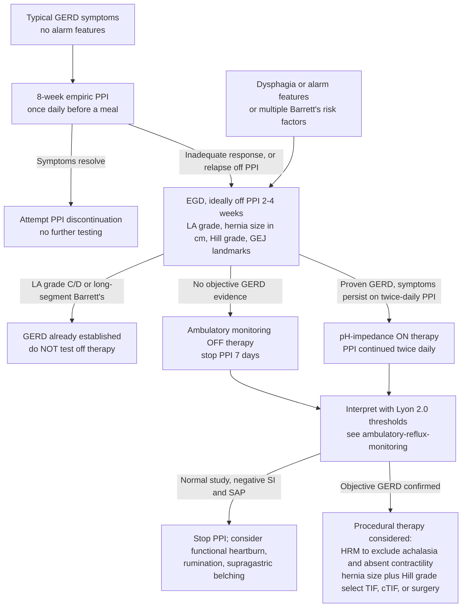

*Which objective test to order for suspected or refractory [[gerd|GERD]], when to order it, and whether to test on or off antisecretory therapy — plus the endoscopic grading systems used to characterise the antireflux barrier.*

**Interpretation thresholds are not on this page.** Acid exposure time (AET) bands, reflux-episode counts, MNBI, PSPW status, and SAP/SI cut-offs live on [[ambulatory-reflux-monitoring]] (Lyon Consensus 2.0) — their single home in this wiki.

## Contents
- [[#Why Test]]
- [[#Test Selection: Which Test, When]]
  - [[#Key Concepts (ACG 2021, ungraded)]]
  - [[#Off vs On Antisecretory Therapy]]
  - [[#Symptom-Category Routing (ACG 2020)]]
- [[#Reflux Monitoring Modalities]]
- [[#Endoscopic Evaluation of the GEJ]]
  - [[#Erosive Esophagitis: Los Angeles (LA) Grade]]
  - [[#Gastroesophageal Flap Valve: Hill Grade]]
  - [[#Mucosal Cleanliness]]
- [[#High-Resolution Manometry]]
- [[#Rumination and Supragastric Belching]]
- [[#CYP2C19 Genotyping]]
- [[#Diagnostic Algorithm]]

---

## Why Test

- Symptoms and PPI response are **not** diagnostic: empiric [[proton-pump-inhibitors|PPI]] trial 78% sensitive / 54% specific for GERD (80% sensitive for noncardiac chest pain); GERDQ ≥9 66% sensitive / 64% specific ([[acg-2020-esophageal-physiologic-testing]]).
- [[upper-endoscopy|Endoscopy]] has high specificity but low sensitivity — 20–30% of partial PPI responders have mucosal breaks ([[acg-2020-esophageal-physiologic-testing]]).
- **Objective confirmation of GERD is required before any endoscopic or surgical antireflux therapy** ([[acg-2021-gerd]], [[asge-2024-gerd]]).
- EGD precedes physiologic testing, and **no test is ordered without a clear clinical hypothesis** about what it will add ([[acg-2020-esophageal-physiologic-testing]]).

---

## Test Selection: Which Test, When

GRADE-rated recommendations, [[acg-2021-gerd]]:

| Clinical situation | What to do | Strength / Quality |
|---|---|---|
| Classic heartburn/regurgitation, no alarm features | **8-week empiric [[proton-pump-inhibitors\|PPI]]**, once daily before a meal — a treatment trial, not a diagnostic test | Strong / Moderate |
| Symptoms respond to the 8-week trial | Attempt PPI **discontinuation** | Conditional / Low |
| Inadequate response to 8 weeks, or symptoms return when PPI stopped | Diagnostic [[upper-endoscopy\|EGD]], ideally **after PPIs stopped 2–4 weeks** | Strong / Low |
| [[dysphagia\|Dysphagia]] or other alarm features (weight loss, GI bleeding); multiple [[barretts-esophagus\|Barrett's]] risk factors | **EGD first** | Strong / Low |
| Chest pain without heartburn, cardiac disease excluded | Objective testing — EGD and/or reflux monitoring | Conditional / Low |
| GERD suspected but unclear, and EGD shows no objective evidence | [[ambulatory-reflux-monitoring\|Reflux monitoring]] **off** therapy | Strong / Low |
| Known **LA grade C or D** esophagitis, or **long-segment Barrett's** | **Do not** perform off-therapy reflux monitoring solely to diagnose GERD — already established | Strong / Low |
| Any | **Barium swallow is not** a diagnostic test for GERD | Conditional / Low |
| Any | **HRM is not** a diagnostic test for GERD (key concept) | — |
| Refractory symptoms, GERD never objectively established | pH monitoring **off** PPI — wireless capsule, catheter pH, or catheter pH-impedance | Conditional / Low |
| Established GERD, inadequate response to **twice-daily** PPI | **pH-impedance on** PPI | Conditional / Low |

### Key Concepts (ACG 2021, ungraded)

- Refractory GERD with **normal EGD and normal reflux monitoring** → add esophageal manometry; also indicated before surgical or endoscopic treatment.
- **Negative test → stop the drug.** Normal off-PPI pH study, or normal on-PPI pH-impedance including negative SI and SAP → discontinue PPIs unless another indication exists (42% of patients kept taking PPIs after a negative refractory-GERD evaluation).
- **Extraesophageal symptoms** not responding to twice-daily PPI → EGD, ideally off PPI 2–4 weeks; if normal, consider reflux monitoring. Erosive esophagitis on EGD does **not** prove the extraesophageal symptoms are reflux-driven — pH-impedance may still be needed. Oropharyngeal/pharyngeal pH monitoring is **not** routinely recommended (see [[extraesophageal-reflux]]).
- Refractory-GERD definition and the management ladder live on [[gerd]].

### Off vs On Antisecretory Therapy

| | **Off therapy** | **On therapy** |
|---|---|---|
| Who | Unproven GERD, unclear diagnosis, or before antireflux surgery / endoscopic therapy | Proven GERD (erosive esophagitis, Barrett's, or prior positive off-PPI study) with symptoms not responding to PPI |
| PPI handling | **Stop PPI 7 days** before the study | **Continue PPI twice daily** through the study |
| Modality | Wireless capsule (48–96 h), catheter pH, or catheter pH-impedance | Catheter **pH-impedance** — impedance is required |
| Why | Documents abnormal acid reflux where it has never been shown | pH alone has very low yield — **<10%** of patients on twice-daily PPI have persistently abnormal acid reflux; impedance captures weakly acidic/nonacid reflux and symptom association |

Both columns per [[acg-2021-gerd]]; Lyon 2.0's parallel off/on framework and its thresholds are on [[ambulatory-reflux-monitoring]].

### Symptom-Category Routing (ACG 2020)

[[acg-2020-esophageal-physiologic-testing]] organises test selection by dominant symptom category:

| Symptom category | Primary tests | Notes |
|---|---|---|
| **Obstructive** ([[dysphagia\|dysphagia]], regurgitation) | [[high-resolution-manometry\|HRM]] ± provocative maneuvers (MRS, RDC, solid test meal); barium esophagram with tablet; [[flip-panometry\|FLIP]] if HRM borderline or catheter placement fails | HRM over conventional line-tracing manometry (Strong / Moderate); provocative maneuvers, barium tablet, and FLIP all Conditional |
| **Typical reflux** (heartburn, regurgitation, chest pain) | Ambulatory monitoring **off** PPI (unproven GERD); pH-impedance **on** PPI (proven GERD with persisting symptoms) | Monitoring preferred over questionnaires, PPI-trial response, or endoscopy alone for a conclusive diagnosis |
| **Extraesophageal/atypical** (cough, hoarseness, globus, belching, rumination) | pH-impedance **off** acid suppression (Strong / Low); upfront over an empiric PPI trial when there are no concurrent typical symptoms (Conditional / Very low) | Laryngoscopy is 86% sensitive but only **9% specific** vs reflux monitoring — unusable as the primary diagnostic test |

- Upfront ambulatory testing beats empiric twice-daily PPI on cost in suspected [[extraesophageal-reflux|extraesophageal reflux]]: **$1,897 vs $3,033** per patient.

---

## Reflux Monitoring Modalities

| Modality | What it measures | Duration | Order it when |
|---|---|---|---|
| Catheter pH (transnasal) | AET (% time pH <4); symptom diary correlation | 24 h | pH-impedance unavailable — pH alone misses weakly acidic/nonacid reflux, bolus clearance, and proximal extent |
| Wireless pH capsule | AET across consecutive days, capturing day-to-day variability | 48 h, extendable to 96 h | Off-therapy testing; infrequent or day-to-day variable symptoms; better tolerance (no catheter) |
| Catheter pH-impedance | All reflux regardless of pH — acid (pH <4), weakly acidic (pH 4–7), nonacid (pH >7), liquid vs gas; MNBI; symptom association | 24 h | On-therapy testing (mandatory); belching/rumination suspected; extraesophageal evaluation |

- **No capsule system exists for impedance** — impedance requires a transnasal catheter ([[acg-2021-gerd]]).
- Modality preference (wireless 96 h preferred in unproven GERD) and every interpretive threshold: [[ambulatory-reflux-monitoring]].
- *Corpus gap — DeMeester score.* [[acg-2021-gerd]] names total AET **and the composite DeMeester score** as the most consistently reliable variables on both wireless and catheter studies, but no ingested source states the score's components or its abnormal cut-off. Needs the original DeMeester/Johnson reference before it can be reproduced here — do not fill from memory.

---

## Endoscopic Evaluation of the GEJ

Careful endoscopic evaluation, reporting, and **photo-documentation** of the following is a **strong** recommendation (very low quality evidence, [[asge-2024-gerd]]):

| Element | Reporting system | Criteria live |
|---|---|---|
| Erosive esophagitis | Los Angeles (LA) grade A–D | Below |
| [[barretts-esophagus\|Barrett's esophagus]] | Prague C&M | [[barretts-esophagus]] |
| Peptic stricture | Present / absent | — |
| [[hiatal-hernia\|Hiatal hernia]] | Axial length in cm (GEJ to diaphragmatic impression) | [[hiatal-hernia]] |
| Flap valve morphology | Hill grade I–IV or American Foregut Society (AFS) grade, in **forward view and retroflexion** | Below (Hill); AFS not in corpus |
| GEJ landmarks | Top of gastric folds, Z-line, diaphragmatic impression | — |
| Prior fundoplication | Describe if present | — |

- **Hiatal hernia size + Hill grade is the procedural decision point** (≤2 cm with Hill I/II vs >2 cm with Hill III/IV) — the TIF / cTIF / surgery table and the TIF eligibility criteria live on [[antireflux-surgery]].
- HRM detects hiatal hernia with higher sensitivity than endoscopy (see below).

### Erosive Esophagitis: Los Angeles (LA) Grade

> ⚠ **Corpus-blocked — criteria deliberately absent.** [[acg-2021-gerd]], [[asge-2024-gerd]], [[acg-2020-esophageal-physiologic-testing]] and Lyon 2.0 all *use* LA grades A–D without ever defining them (verified by full-text search of all four PDFs). A previously written A–D criteria table was **removed at the 2026-08-26 lint** because it came from general knowledge, not a source — and it had already drifted (LA C was rendered as "confluent, <75% of circumference," dropping the *continuous between the tops of ≥2 mucosal folds* element). **Ingest the original Lundell 1999 LA-classification paper** to restore this table; do not refill it from memory.
>
> What *is* sourced: grade-specific significance (LA A borderline, LA B conclusive per Lyon 2.0) on [[ambulatory-reflux-monitoring]]; and **LA C/D as sufficient objective evidence of GERD** (see the test-selection table above — do not test off therapy).

### Gastroesophageal Flap Valve: Hill Grade

> ⚠ **Corpus-blocked — criteria deliberately absent.** [[asge-2024-gerd]] grades the flap valve by Hill classification and drives a real decision off it, but **cites Hill & Kozarek, *J Clin Gastroenterol* 1996 rather than reproducing the criteria**; no ingested source defines grades I–IV, and none defines the American Foregut Society (AFS) classification at all. A previously written I–IV appearance table was **removed at the 2026-08-26 lint** as untraceable. **Ingest Hill & Kozarek 1996** (and an AFS source) to restore it.
>
> What *is* sourced and decision-bearing: **hiatal hernia ≤2 cm + Hill I/II** vs **>2 cm + Hill III/IV** routes the patient between endoscopic and surgical antireflux therapy ([[asge-2024-gerd]]) — that pathway lives on [[antireflux-surgery]].

**Figure gap:** flap-valve grading is a *look-at-it* classification, so this page should carry retroflexed endoscopic images of Hill I–IV per the Style Guide. No ingested source contains them, and figure extraction (PyMuPDF) is unavailable in this environment — reported, not invented.

### Mucosal Cleanliness

- Grade with the **Barcelona scale** or the **Toronto Upper GI Cleaning Score** before documenting GEJ landmarks and before calling a segment free of precancerous lesions — a high-quality inspection is a precondition for every classification above ([[asge-2024-gerd]]).

---

## High-Resolution Manometry

- **Not a diagnostic test for GERD** ([[acg-2021-gerd]] key concept) — it is a gatekeeper, not a confirmer.
- **Before antireflux surgery or endoscopic therapy:** [[high-resolution-manometry|HRM]] to exclude [[achalasia]] and absent contractility; in [[ineffective-esophageal-motility|ineffective esophageal motility]], include provocative testing (multiple rapid swallows) for contractile reserve ([[acg-2021-gerd]]). Achalasia is found in ~3% of patients referred for planned fundoplication ([[acg-2020-esophageal-physiologic-testing]]). Full pre-operative motor-disorder framework: [[hrm-antireflux-surgery]].
- **Hiatal hernia detection:** 94.3% sensitivity, 91.5% specificity — superior to endoscopy and barium ([[acg-2020-esophageal-physiologic-testing]]).
- [[flip-panometry|FLIP]] complements HRM when findings are borderline or catheter placement fails (Conditional / Low); it does not replace HRM.

---

## Rumination and Supragastric Belching

Both are captured by reflux testing and both mimic refractory GERD.

- **[[rumination-syndrome|Rumination syndrome]]:** postprandial high-resolution impedance manometry (HRIM) is the diagnostic standard ([[acg-2020-esophageal-physiologic-testing]]). Manometric criteria, test performance, and the postprandial protocol live on [[rumination-syndrome]].
- **Supragastric belching:** confirmed on pH-impedance — sensitivity 93.4%, specificity 75%, PPV 96.8%; supragastric belches were identified in **48%** of 50 consecutive patients referred for reflux evaluation. Episodes occur almost exclusively upright (**37.8 ± 6.1/h upright vs 0.9 ± 0.5/h supine**) and are suppressed during sleep ([[acg-2020-esophageal-physiologic-testing]]). Both belong on the differential for PPI-refractory symptoms alongside the [[disorders-of-gut-brain-interaction|functional esophageal disorders]].

---

## CYP2C19 Genotyping

Not a GERD diagnostic test — it explains a poor PPI response.

- **Test CYP2C19 polymorphism in patients with suboptimal clinical response to PPI therapy and adjust PPI dose and selection accordingly** — Conditional, very low quality ([[asge-2024-gerd]]).
- Metabolizer phenotypes: poor, intermediate, normal (wild-type), rapid, ultrarapid.
- Rapid metabolizers vs poor metabolizers: **OR 1.6** for being refractory to PPI therapy; GERD resolution **52.2% (315/604) vs 61.3% (138/225)**.
- Which agent/dose to switch to is on [[proton-pump-inhibitors]] (and [[potassium-competitive-acid-blockers]] for CYP2C19-independent alternatives).

---

## Diagnostic Algorithm

---

## See Also

[[gerd]], [[ambulatory-reflux-monitoring]], [[extraesophageal-reflux]], [[high-resolution-manometry]], [[hrm-antireflux-surgery]], [[flip-panometry]], [[chicago-classification-v4]], [[barretts-esophagus]], [[laryngopharyngeal-symptoms]], [[antireflux-surgery]], [[achalasia]], [[upper-endoscopy]], [[dysphagia]], [[rumination-syndrome]], [[disorders-of-gut-brain-interaction]], [[proton-pump-inhibitors]], [[potassium-competitive-acid-blockers]], [[ineffective-esophageal-motility]]

---

## Sources

1. [[acg-2021-gerd|ACG 2021 Clinical Guideline: Diagnosis and Management of GERD]]
2. [[asge-2024-gerd|ASGE 2024: Diagnosis and Management of GERD]]
3. [[acg-2020-esophageal-physiologic-testing|ACG 2020: Clinical Use of Esophageal Physiologic Testing]]
