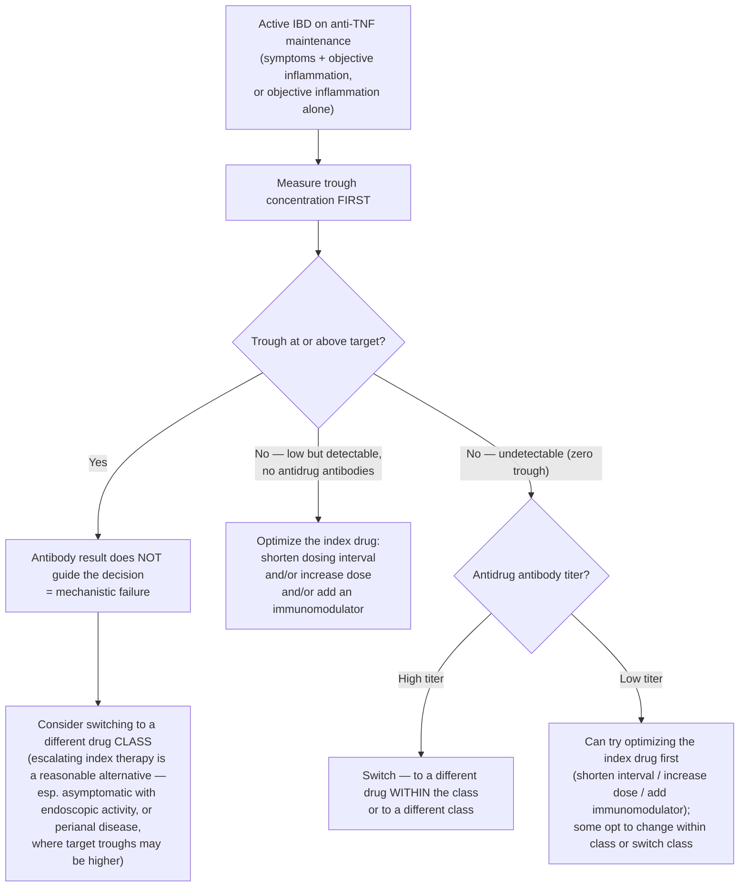

Measuring a drug's **trough concentration** and, for biologics, **antidrug antibodies**, to decide whether a patient failing therapy needs the **same drug optimized**, a **different drug in the same class**, or a **different class** entirely. The AGA framework covers [[anti-tnf-agents|anti-TNF agents]] and [[thiopurines]] in [[inflammatory-bowel-disease|IBD]] ([[aga-2017-tdm-ibd]]); it does not cover [[vedolizumab]] or [[il-23-and-il-12-23-inhibitors|ustekinumab]].

---

## Contents
- [[#Reactive vs Proactive]]
- [[#Why It Works — The Three Failure Mechanisms]]
- [[#Anti-TNF Trough Targets]]
- [[#Anti-TNF Reactive TDM Algorithm]]
- [[#Antidrug Antibodies — How to Read Them]]
- [[#Thiopurines — TPMT and Metabolites]]
- [[#Practical Operating Rules]]
- [[#Open Questions]]
- [[#See Also]]
- [[#Sources]]

---

## Reactive vs Proactive

| | Definition | AGA position |
|---|---|---|
| **Reactive** | TDM in a patient with **active IBD** — active IBD-related symptoms confirmed by objective findings (biochemical markers, endoscopy, radiology), **or** clinically asymptomatic with objective inflammation on endoscopy/radiology | **Suggested** to guide treatment changes for [[anti-tnf-agents\|anti-TNF]] (conditional, very low quality) and for [[thiopurines\|thiopurine]] metabolites (conditional, very low quality) |
| **Proactive** | Routine TDM performed while the patient is **in remission** | Anti-TNF: **no recommendation** — knowledge gap. Thiopurine metabolites: **suggested against** (conditional, very low quality) |

- The proactive anti-TNF gap is deliberate: the benefit-vs-harm balance is uncertain. The harm is **premature switching away from index therapy** in patients who are in remission, because target troughs in asymptomatic patients and the significance of low-titer antibodies are both unclear.
- **TAXIT** is the reason: after everyone was dose-optimized to an infliximab trough of 3–7 µg/mL (clinical remission rose 65% → 88%), remission at 1 year was no different with routine proactive TDM (RR 1.04; 95% CI 0.88–1.24). The **initial optimization** helped; **repeating it before every infusion** added nothing measurable at 1 year — though patients without proactive TDM ended the year with more antidrug antibodies and more undetectable troughs.

---

## Why It Works — The Three Failure Mechanisms

Trough + antibody result assigns the mechanism; the mechanism assigns the action.

| Failure type | Trough | Antidrug antibodies | Mechanism |
|---|---|---|---|
| **Mechanistic** | Optimal / at target | — | Disease driven by inflammatory mediators the drug doesn't block. Unlikely to respond to **another drug in the same class** |
| **Non–immune-mediated pharmacokinetic** | Subtherapeutic | Low or undetectable | Rapid drug clearance, often with a high inflammatory burden |
| **Immune-mediated pharmacokinetic** | Low or undetectable | **High titer**, neutralizing | Immunogenicity |

Frequencies in 464 patients across 3 observational studies: mechanistic **30%**, non–immune-mediated pharmacokinetic **51%**, immune-mediated pharmacokinetic **19%**.

**The payoff for stratifying:** 45% of patients responded to empiric dose escalation overall. Applying TDM retrospectively, response was **82%** in those with a subtherapeutic trough and no antibodies (RR 1.71; 95% CI 1.39–2.11) but only **8%** in those with a low/undetectable trough plus antibodies (RR 0.26; 95% CI 0.08–0.86) — escalation works on pharmacokinetic failure and not on immunogenicity.

---

## Anti-TNF Trough Targets

Suggested targets for **reactive** TDM in **active IBD on maintenance therapy**:

| Drug | Target trough | What the number is built on |
|---|---|---|
| Infliximab | **≥5 µg/mL** | 6 studies, 929 patients. Proportion not in remission: 25% at ≥1 µg/mL → 15% at ≥3 → ~4% at ≥7 or ≥10 |
| Adalimumab | **≥7.5 µg/mL** | 4 studies. Proportion not in remission: 17% at ≥5.0 ± 1 µg/mL → 10% at ≥7.5 ± 1 |
| Certolizumab pegol | **≥20 µg/mL** | 1 pooled exposure–response analysis of 9 trials. Not in remission: 42% at ≥10 µg/mL → 26% at ≥20 |
| Golimumab | **Unknown** | Insufficient evidence to establish a target trough goal |

Qualifiers that travel with these numbers:
- **Maintenance therapy only.** Optimal **induction** targets are uncertain; applying maintenance thresholds during induction risks misclassifying patients as mechanistic failures, since target troughs are likely higher during induction. Empiric dose escalation is a reasonable alternative during induction unless immune-mediated pharmacokinetic failure is suspected.
- **Not a universal target.** These are not uniform troughs to be targeted in all patients regardless of clinical status — a small subset may respond only to **higher** concentrations. Target troughs may be higher in asymptomatic patients with ongoing endoscopic activity and in **perianal disease**.
- Targets for **mucosal healing** may be higher than these, which were derived against clinical remission.
- Supporting data are **less robust for adalimumab than infliximab**, and it is unclear whether ulcerative colitis requires higher troughs than Crohn's disease.
- Derived from **cross-sectional** studies of maintenance patients at various stages of response — not from studies designed around secondary loss of response.

---

## Anti-TNF Reactive TDM Algorithm

- **Trough is read before antibodies, and when the trough is sufficient the antibody result should not guide treatment decisions.**
- Low-titer antibodies with **undetectable** drug: optimization is typically attempted before a switch, because these antibodies may be transient and non-neutralizing, and shortening the interval and/or escalating the dose can overcome them.
- High-titer antibodies with undetectable drug: there is very limited benefit to escalating the index agent — these antibodies are generally persistent and neutralizing, so switching within the class may be more effective.

---

## Antidrug Antibodies — How to Read Them

- **Low-titer** — may be transient and non-neutralizing; potentially overcome by shortening the interval and/or escalating the dose.
- **High-titer**, especially with an undetectable trough — generally **persistent and neutralizing**.
- **No validated cutoff separates the two.** Reporting varies between commercial assays, there is no standardized reporting, uniform thresholds for clinically relevant titers are lacking, and current data do not identify optimal high- vs low-titer cutoffs in commercially available assays. Some assays detect very-low-titer antibodies of limited clinical significance.
- Management is also unclear when **both detectable drug and antibodies** are present, and when a low trough coexists with low or high antibodies.

---

## Thiopurines — TPMT and Metabolites

**Before starting** — routine **TPMT** testing (enzymatic activity **or** genotype) to guide dosing (conditional, low quality).

| TPMT status | Dosing used in the supporting trials |
|---|---|
| Normal enzyme activity / genotype | Full-dose thiopurine |
| Intermediate enzymatic activity / heterozygous genotype | **50% dose reduction** |
| Low or absent enzyme activity / homozygous genotype | Drug withheld, or **0–10% of the initiation dose** |

- At a **population** level TPMT testing did not change outcomes — hematologic adverse events RR 0.94 (0.59–1.50), treatment discontinuation RR 1.09 (0.94–1.27), clinical remission RR 1.03 (0.84–1.27) across 3 RCTs — because homozygotes are rare (**0.17%**, n = 2 of 1145 patients).
- The recommendation exists for the **0.3%** with homozygous genotype or low/absent enzyme activity, who face considerable harm from empiric weight-based dosing. In patients with intermediate or low/absent activity, TPMT-guided dosing was associated with an **89% risk reduction in hematologic adverse events**.
- **Routine laboratory monitoring — CBC, plus liver enzymes — continues regardless of the TPMT result.** TPMT testing does not replace it, and real-world adherence to monitoring is suboptimal.

**Metabolite monitoring** — reactive only (active IBD, or adverse effects thought to be thiopurine toxicity):

| Metabolite | Target | Qualifier |
|---|---|---|
| **6-TGN** (6-thioguanine) | **230–450 pmol/8 × 10⁸ RBCs** | **Monotherapy only.** The optimal cutoff when a thiopurine is combined with an [[anti-tnf-agents\|anti-TNF]] is uncertain — in combination the thiopurine partly serves to reduce immunogenicity rather than independently drive remission, and lower targets have been suggested but no threshold is established |

- 6-TGN **≥230 pmol/8 × 10⁸ RBCs** carried **40% higher remission rates** (RR 1.4; 95% CI 1.2–1.6) than levels <230.
- Algorithm used in the supporting study: **6-TGN low (<230)** → optimize the thiopurine dose; **6-TGN adequate** → switch medication. Algorithm-concordant care was far more likely to respond to a therapeutic change (RR 5.15; 95% CI 1.82–14.56).
- **Quiescent disease: do not monitor routinely.** Two RCTs (107 patients on azathioprine) dosing to a 6-TGN of 250–400 pmol/8 × 10⁸ RBCs vs standard weight-based dosing found no difference in clinical remission (RR 1.44; 0.59–3.52) or serious adverse events (RR 1.20; 0.50–2.91). Those trials excluded combination therapy with an anti-TNF, permitted only dose escalation, and did not allow alternative strategies such as adding allopurinol — so they do not extrapolate to thiopurines used with an anti-TNF.
- Harms of reactive metabolite monitoring: intensified laboratory monitoring with each dose adjustment, and **delay of an alternative effective therapy** in a patient who is not responding.

---

## Practical Operating Rules

- **Draw the trough as close to the next dose as possible — within 24 hours.**
- **Use the same assay** for a given patient's repeated trough and antibody measurements. Quantitative infliximab concentrations across assays fall within **−7% to +20%** of each other; adalimumab showed considerable variability between an ELISA and a homogeneous mobility shift assay. Antibody reporting is the more variable of the two, so a single assay for both is preferable.
- **Not covered by this framework:** [[vedolizumab]] and [[il-23-and-il-12-23-inhibitors|ustekinumab]] — too few data at the time of publication. Newer biologics require their own evaluation as they are approved.

---

## Open Questions

- Should TDM be performed during **induction** rather than empiric dose escalation, and at what target troughs?
- Do target troughs differ by agent, disease phenotype, disease state, and treatment target — **clinical remission vs mucosal healing** (see [[treat-to-target-ibd]])?
- What defines a clinically meaningful vs insignificant antidrug antibody, and at what titer can antibodies be suppressed rather than triggering a drug change?
- RCTs comparing routine **proactive** TDM vs **reactive** TDM vs empiric dosing on patient-relevant outcomes — including how often proactive TDM should be repeated.
- A target trough for **golimumab**, and a 6-TGN target for thiopurines used **with** an anti-TNF.

---

## See Also

[[anti-tnf-agents]], [[thiopurines]], [[inflammatory-bowel-disease]], [[crohns-disease]], [[ulcerative-colitis]], [[vedolizumab]], [[il-23-and-il-12-23-inhibitors]], [[methotrexate]], [[treat-to-target-ibd]], [[ibd-endoscopic-scoring]]

---

## Sources

1. [[aga-2017-tdm-ibd|AGA Institute Guideline on Therapeutic Drug Monitoring in Inflammatory Bowel Disease (2017)]]
