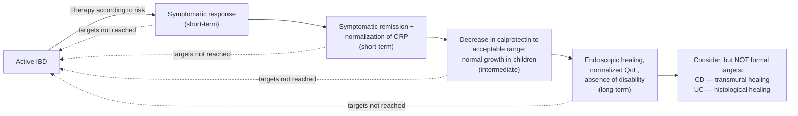

Treat-to-target framework for [[crohns-disease|Crohn's disease]] and [[ulcerative-colitis]] from the IOIBD STRIDE-II consensus: treat to defined objective targets, re-assess at a defined time, and change treatment when the target is not reached. Written for **clinical practice, not the trial setting**; adapt to the individual patient and local resources.

---

## Contents
- [[#The Target Sequence]]
- [[#Targets and Their Definitions]]
  - [[#Fecal Calprotectin — Which Cutoff]]
  - [[#Endoscopic Healing — How to Assess]]
- [[#Not Formal Targets — Transmural and Histologic Healing]]
- [[#Time to Target by Drug]]
- [[#What Changed from STRIDE-I]]
- [[#How the Statements Were Rated]]
- [[#Acknowledged Gaps]]
- [[#See Also]]
- [[#Sources]]

---

## The Target Sequence

*Figure — treatment targets in CD and UC, after Figure 2 of [[ioibd-2021-stride-ii|STRIDE-II]]. Any target not reached loops back to re-selection of therapy.*

- The paper's own wording is not internally consistent about where two targets sit on the timeline. The **balloted statements** call clinical response **immediate**, clinical remission **intermediate (medium-term)**, CRP/calprotectin normalization **intermediate**, and normal growth in children **long-term**; the figure above places symptomatic remission + CRP normalization in the **short-term** bracket and normal growth in the **intermediate** bracket. The balloted wording is what the target table below states.
- **Clinical response or remission alone are insufficient as long-term targets** — objective improvement must follow.
- The algorithm is a general scheme: elevated serum or fecal biomarkers may at times suffice to revise treatment, and at other times endoscopy is needed to document extent and severity before a major treatment change.

---

## Targets and Their Definitions

*Agreement = mean score of all voters on a 1–10 scale (10 = complete agreement) / % of votes scoring 7–10. These are agreement scores, not GRADE ratings — STRIDE-II assigns no certainty-of-evidence grades.*

| Target (timeframe) | [[crohns-disease\|Crohn's disease]] | [[ulcerative-colitis\|Ulcerative colitis]] | Agreement |
|---|---|---|---|
| **Clinical response** — *immediate*; consider changing treatment if not achieved | Decrease of **≥50% in PRO2** (abdominal pain and stool frequency); in children decrease in **PCDAI ≥12.5 points**, **wPCDAI ≥17.5 points** | Decrease of **≥50% in PRO2** (rectal bleeding and stool frequency); in children decrease in **PUCAI ≥20 points** | 9.0 / 94 · def. 8.3 / 84 |
| **Clinical remission** — *intermediate (medium-term)*; consider changing treatment if not achieved | PRO2 (**abdominal pain ≤1 and stool frequency ≤3**) or **HBI <5**; in children **PCDAI <10** (or **<7.5** excluding the height item) or **wPCDAI <12.5** | PRO2 (**rectal bleeding = 0 and stool frequency = 0**) or **partial Mayo <3 with no individual subscore >1**; in children **PUCAI <10** | 8.7 / 94 · def. 8.5 / 81 |
| **Normalization of CRP and fecal calprotectin** — *intermediate*; consider changing treatment if not achieved | CRP **below the upper limit of normal**; FC **to 100–250 μg/g** | CRP **below the upper limit of normal**; FC **to 100–250 μg/g** | 8.2 / 80 |
| **Endoscopic healing** — *long-term*; consider changing treatment if not achieved | **SES-CD <3 points** *or* **absence of ulcerations** (e.g. SES-CD ulceration subscore = 0) | **Mayo endoscopic subscore = 0** *or* **UCEIS ≤1** | 8.7 / 87 · def. 8.5 / 85 |
| **Restoration of normal growth (children)** — *long-term*; consider changing treatment if not achieved | Applies to both diseases | Applies to both diseases | 9.3 / 98 |
| **Absence of disability and normalized health-related quality of life** — *long-term*; consider changing treatment if not achieved | Applies to both diseases | Applies to both diseases | 7.7 / 75 |
| **Clinical response or remission are insufficient as long-term targets** | — | — | 8.3 / 80 |

- **Time to each target varies by drug and mechanism of action** — see [[#Time to Target by Drug]].
- Two candidate targets were **balloted and rejected**: absence of health-related **fatigue** (47% agreement) and absence of health-related **anxiety and depression** (37%). Fifteen recommendations were drafted; 13 were endorsed.
- Well-being domains (fatigue, depression, anxiety, sexual dysfunction, body image) must still be factored into regular assessment even though they were not made formal targets.

### Fecal Calprotectin — Which Cutoff

- **The endorsed target is a range (100–250 μg/g), and the number you pick depends on the outcome you want:**
  - **<100 μg/g** — proposed for reflecting **deep healing** (endoscopic *and* transmural) or **histological healing**.
  - **<250 μg/g** — reflects **less stringent outcomes** (e.g. MES of 0 or 1 in UC).
  - The systematic review and Delphi process separately supported **150 μg/g to identify endoscopic healing**.
- **100–250 μg/g is a gray zone**, and even values **<600 μg/g** can still be associated with minimal inflammation — so a single mid-range value does not settle the question.
- FC generally outperforms CRP: pooled **sensitivity 82%, specificity 72%, AUC 0.84** for reflecting endoscopic activity in CD. Elevated FC carries a **53%–83% probability of relapse over the next 2–3 months**. FC measured **12 weeks** after starting treatment predicts long-term clinical outcomes.
- CRP has the opposite profile — higher specificity, low sensitivity. Low CRP is associated with reduced relapse risk (**AUC 0.70–0.72**); **CRP normalization at 8–14 weeks** predicts remission at 1 year and anti-TNF success at 2 years; **CRP >5 mg/dL at week 22** predicts subsequent loss of response to anti-TNF.
- **Combining targets beats any single one** ("the more the merrier"): CRP + FC together outperformed FC alone for predicting endoscopic healing after 48 weeks of adalimumab (CALM post hoc); adding CRP to FC raised specificity for mucosal inflammation from **87% to 100%**; combined lack of ulcerations *and* clinical remission (deep remission) was associated with fewer treatment adjustments, hospitalizations, and surgeries than endoscopic healing alone (EXTEND post hoc).

### Endoscopic Healing — How to Assess

- **Sigmoidoscopy or colonoscopy.** When not feasible, alternatives **in CD** are **[[capsule-endoscopy|capsule endoscopy]]** or **balloon enteroscopy**. *(agreement 8.3 / 86)*
- Score definitions and the full index tables live on [[ibd-endoscopic-scoring]].
- The supportive text carries a second, slightly different set of definitions that "prevailed" in the systematic review and Delphi group: **endoscopic response = >50% decrease in SES-CD or CDEIS**; **endoscopic remission = SES-CD ≤2 points, or CDEIS <3 and lack of ulcerations** (including aphthous ulcers). The balloted **SES-CD <3 points** is the target stated above.
- In UC, endoscopic healing "is commonly defined as **MES ≤1**, but complete endoscopic healing (**MES 0**) is associated with superior disease outcomes" — which is why the balloted UC target is MES 0.

---

## Not Formal Targets — Transmural and Histologic Healing

Both were **explicitly rejected as formal treatment targets** in CD and UC, and both are endorsed as **adjuncts to endoscopic remission representing a deeper level of healing** — transmural healing in CD (agreement 7.5 / 77), histologic remission in UC (7.7 / 80).

| | Why not a formal target |
|---|---|
| **Transmural healing** (assessed by CTE, MRE, or [[intestinal-ultrasound\|bowel ultrasound]]) | Ileocolonoscopy cannot be repeated frequently and may not be feasible in proximal small-bowel disease; in the prospective ImageKids study of 240 children with CD, **mismatch between endoscopic and transmural healing was not uncommon**; currently available treatments have limited ability to achieve transmural healing → cross-sectional imaging is an **adjuvant** assessment |
| **Histologic remission — CD** | No well-validated, reliable, accepted measuring tool; insufficient data to justify intensifying immunosuppression to reach it; treatments are of limited effectiveness — **only 13%** of patients with CD on long-term anti-TNF regimens achieved histologic remission |
| **Histologic remission — UC** | Added benefit over macroscopic healing for long-term remission and cancer prevention has been shown, but it is a **high hurdle**: only **one-third** of patients with UC who had endoscopic healing in the ACT trials had histologic remission, and macroscopic–microscopic concordance held only at the extremes (remission and severe disease), reflecting poor interobserver reliability |

The **ultimate** target may be complete deep healing (clinical remission + complete endoscopic healing + histological healing + transmural healing), but the incremental gain, the therapy-related risks, and the costs are unestablished, and it is **not achievable in most patients with currently available treatments**.

---

## Time to Target by Drug

Mean number of **weeks** required to achieve each goal after starting treatment, from the Delphi-like process and the systematic review. Use it to decide **when a therapy may fairly be called a failure** — assessing a target earlier than the interval below risks abandoning a drug that has not yet had time to work.

*This table was **deliberately not voted on** — it "portrays cumulative evidence and expert opinion rather than practice recommendations," and the paper's own note reads: "Given the paucity of high-quality scientific data, the data in this table should be considered merely as a rough estimate of experts' opinion."*

**Crohn's disease** (n = 39)

| Treatment | Clinical response | Clinical remission | Normalization of CRP/ESR | Decrease of FC | Endoscopic healing |
|---|---|---|---|---|---|
| Oral steroids / EEN | 2 | 4 | 5 | 8 | 13 |
| Budesonide | 3 | 6 | 8 | 10 | 15 |
| [[thiopurines\|Thiopurines]] | 11 | 15 | 15 | 17 | 24 |
| Methotrexate | 9 | 14 | 14 | 15 | 24 |
| [[anti-tnf-agents\|Anti-TNF]] | 2–4 | 4–6 | 9 | 11 | 17 |
| [[vedolizumab\|Vedolizumab]] | 11 | 17 | 15 | 17 | 24 |
| [[il-23-and-il-12-23-inhibitors\|Ustekinumab]] | 7 | 13 | 11 | 14 | 19 |

**Ulcerative colitis** (n = 36)

| Treatment | Clinical response | Clinical remission | Normalization of CRP/ESR | Decrease of FC | Endoscopic healing |
|---|---|---|---|---|---|
| Oral [[mesalamine-5-asa\|5-ASA]] | 4 | 8 | 8 | 10 | 13 |
| Oral steroids | 2 | 2 | 5 | 8 | 11 |
| Locally active steroids (beclomethasone dipropionate, budesonide MMX) | 3 | 8 | 8 | 9 | 13 |
| Thiopurines | 11 | 15 | 15 | 15 | 20 |
| Adalimumab | 6 | 11 | 10 | 12 | 14 |
| Infliximab | 5 | 10 | 9 | 11 | 13 |
| Vedolizumab | 9 | 14 | 14 | 15 | 18 |
| [[jak-inhibitors\|Tofacitinib]] | 6 | 11 | 9 | 11 | 14 |

*EEN = exclusive enteral nutrition. "Decrease of FC" = below a desired threshold — see [[#Fecal Calprotectin — Which Cutoff]].*

---

## What Changed from STRIDE-I

- **Confirmed** the STRIDE-I long-term targets of **clinical remission and endoscopic healing**.
- **Added** clinical response and remission, plus **normalization of CRP**, as immediate and short-term targets.
- **Added** reduction of fecal calprotectin to an acceptable range as a **formal intermediate target**.
- **Added** restoration of **quality of life** and **absence of disability** to endoscopic healing as long-term targets.
- **Added pediatric targets** — different measuring scales (PCDAI, wPCDAI, PUCAI) and **restoration of normal growth** as a formal target.
- **Introduced time-to-target estimates** by drug, so a target is assessed on a defined schedule.
- **Newly recognized** transmural healing in CD and histological healing in UC as important **adjunctive measures** — not endorsed as formal targets.

---

## How the Statements Were Rated

- Systematic review picking up where STRIDE-I ended (end of 2013) and running to **July 2019**: **11,278 abstracts** screened (6,223 CD, 5,055 UC) → **1,005 full texts** (413 CD, 592 UC) → **435 manuscripts included** (297 CD, 138 UC), run in parallel with a Delphi-like process among the 89 IOIBD members.
- Concept elicitation survey: **39 of 89 (44%)** members. Final voting: **70 of 89 invited (79%)**.
- **Endorsement threshold:** ≥75% of participants scoring the statement **7 to 10** on a 10-point scale (1 = do not agree at all, 10 = agree completely). Statements failing after 2 rounds were excluded.
- The published "strength of recommendation" figure is the **mean agreement score of all responders on that 1–10 scale**. No GRADE certainty-of-evidence rating and no GRADE strength label is assigned anywhere in this document.
- Delphi ranking of short-term goals by importance (1 = most important, 5 = least; mean scores): in **CD** — clinical remission 1.8, endoscopic response 2.1, clinical response 2.2, CRP/ESR normalization 2.2, calprotectin normalization 2.6, transmural healing 3.1, histological healing 3.4. In **UC** — clinical remission 2.3, clinical response 2.4, endoscopic response 2.4, CRP/ESR normalization 2.7, calprotectin normalization 2.7, histological healing 2.7, transmural healing 4.2.

---

## Acknowledged Gaps

| Domain | Gap |
|---|---|
| **Patient-reported outcomes** | PRO2 for CD and UC were assembled from existing measures as a temporary means of meeting regulatory requirements in trials — not the product of stringent psychometric development and evaluation |
| **Health-related quality of life** | Current instruments were built as research tools and are too cumbersome for routine clinical practice; a shorter validated tool is needed |
| **Histology and transmural healing** | It is unclear whether these are significant enough to justify the increased treatment needed to reach them — the reason neither was selected as a formal target |
| **Endoscopic healing** | **The thresholds defining endoscopic remission and response remain un-validated** |

---

## See Also

[[crohns-disease]], [[ulcerative-colitis]], [[inflammatory-bowel-disease]], [[ibd-endoscopic-scoring]], [[intestinal-ultrasound]], [[capsule-endoscopy]], [[anti-tnf-agents]], [[vedolizumab]], [[thiopurines]], [[il-23-and-il-12-23-inhibitors]], [[jak-inhibitors]], [[mesalamine-5-asa]], [[nutrition-in-ibd]], [[colonoscopy]]

---

## Sources

1. [[ioibd-2021-stride-ii|STRIDE-II: An Update on the Selecting Therapeutic Targets in Inflammatory Bowel Disease (STRIDE) Initiative of the International Organization for the Study of IBD (IOIBD): Determining Therapeutic Goals for Treat-to-Target strategies in IBD]]
