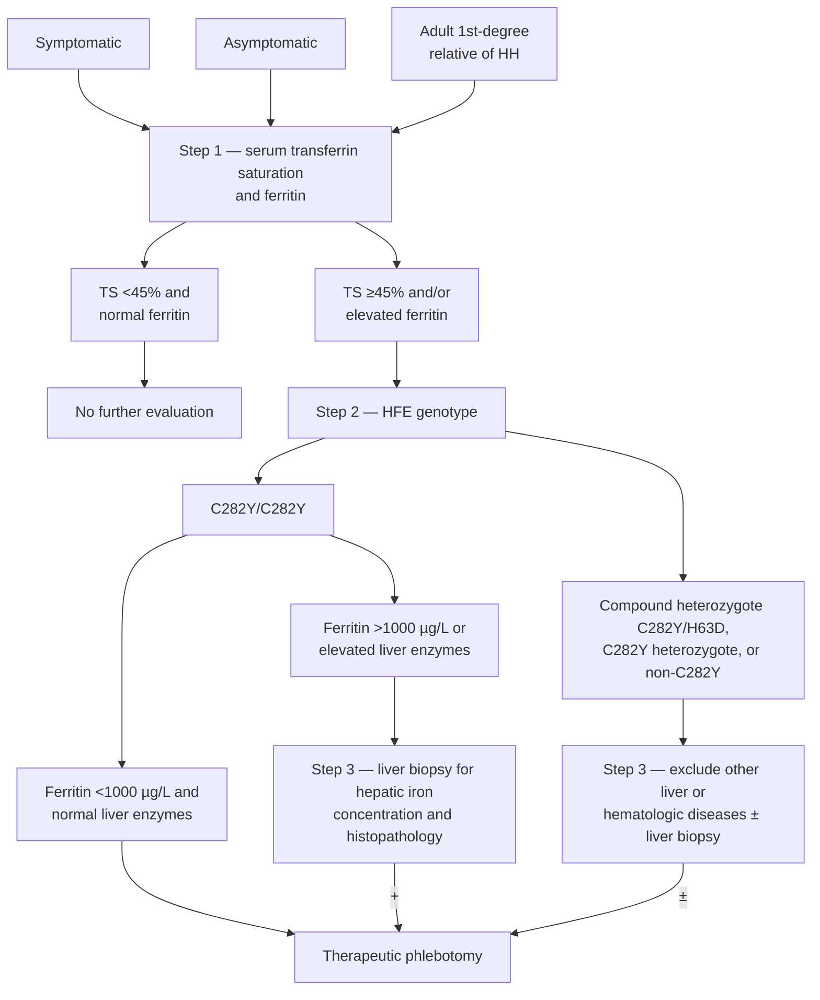

> ⚠ **Superseded for current practice.** The wiki's primary source for [[hereditary-hemochromatosis|hereditary hemochromatosis (HH)]] is the newer [[acg-2019-hereditary-hemochromatosis|American College of Gastroenterology (ACG) 2019: Hereditary Hemochromatosis]]. Where the two differ, follow ACG 2019; this American Association for the Study of Liver Diseases (AASLD) 2011 edition is additive. It remains the more detailed source on the phlebotomy regimen and on chelation for secondary iron overload.

## Bibliographic Info

- **Article:** [Bacon BR, Adams PC, Kowdley KV, Powell LW, Tavill AS. Diagnosis and management of hemochromatosis: 2011 practice guideline by the American Association for the Study of Liver Diseases. Hepatology 2011;54(1):328–343.](https://doi.org/10.1002/hep.24330)
- **Authors:** Bruce R. Bacon, Paul C. Adams, Kris V. Kowdley, Lawrie W. Powell, Anthony S. Tavill
- **Year:** 2011 (received March 22, 2011; accepted March 23, 2011)
- **Journal/Publisher:** Hepatology 2011;54(1):328–343 (AASLD Practice Guideline)
- **DOI:** [10.1002/hep.24330](https://doi.org/10.1002/hep.24330)
- **Type:** guideline (AASLD practice guideline, Grading of Recommendation Assessment, Development, and Evaluation [GRADE] with minor modifications)

---

## Summary

HH is the most common identified genetic disorder in Caucasians, with a prevalence of approximately 1 per 220–250 individuals. The clinical diagnosis rests on **documentation of increased iron stores** — an elevated serum ferritin reflecting increased hepatic iron content — and is further defined genotypically by *HFE* C282Y homozygosity or C282Y/H63D compound heterozygosity. Penetrance is incomplete: phenotypic expression occurs in only ~70% of C282Y homozygotes, and fewer than 10% develop severe iron overload with organ damage. Most patients are now identified while asymptomatic and without hepatic fibrosis or cirrhosis, through family screening or abnormal routine laboratory studies.

Diagnosis begins with **transferrin saturation (TS) plus serum ferritin together**, not a single test, in patients with suggestive symptoms, physical findings, or family history; if either is abnormal (TS ≥45% or ferritin above the upper limit of normal), *HFE* mutation analysis follows. First-degree relatives of a proband are screened by genotype and phenotype simultaneously. The guideline repositions **liver biopsy as a staging and prognostic tool rather than a diagnostic one** in the *HFE* era: it is for C282Y homozygotes or compound heterozygotes with elevated alanine aminotransferase (ALT) or aspartate aminotransferase (AST) or ferritin >1000 µg/L (cirrhosis prevalence 20%–45%), and for phenotypic iron overload in patients who are **not** C282Y homozygotes or compound heterozygotes, where hepatic iron concentration (HIC) and iron staining characterise the disorder. A C282Y homozygote with ferritin <1000 µg/L and normal liver enzymes proceeds straight to phlebotomy without biopsy.

Treatment is **therapeutic phlebotomy — one 500 mL unit weekly or biweekly as tolerated — to a target ferritin of 50–100 µg/L**, then lifelong maintenance phlebotomy at whatever interval keeps ferritin in that range. Dietary adjustment is unnecessary, but vitamin C and iron supplements are to be avoided. Iron chelation (deferoxamine mesylate or deferasirox) is reserved for iron-overloaded patients with dyserythropoietic syndromes or chronic hemolytic anemia, where phlebotomy would worsen anemia. Patients with HH and cirrhosis undergo hepatocellular carcinoma (HCC) surveillance per AASLD HCC guidance (relative risk ~20; annual incidence 3%–4%), continued even after iron stores are normalised. **Average-risk population screening is not recommended**, given that ~30% of C282Y homozygotes have no phenotypic expression of excess iron stores. Screening for non–*HFE*-related HH is likewise not recommended: it accounts for <5% of inherited iron overload and genetic testing is largely unavailable outside research laboratories.

## Grading System (Table 1)

The guideline uses the GRADE classification with minor modifications, as adopted by the AASLD Practice Guidelines Committee. Strength of recommendation is printed as a number in parentheses, quality of evidence as a letter — e.g. *(1B)* = strong recommendation, moderate-quality evidence.

| Strength of recommendation | Criteria |
|---|---|
| Strong (1) | Factors influencing the strength of the recommendation included the quality of the evidence, presumed patient-important outcomes, and cost |
| Weak (2) | Variability in preferences and values, or more uncertainty. Recommendation is made with less certainty, or higher cost or resource consumption |

| Quality of evidence | Criteria |
|---|---|
| High (A) | Further research is unlikely to change confidence in the estimate of the clinical effect |
| Moderate (B) | Further research is likely to have an impact on confidence in the estimate of the clinical effect |
| Low (C) | Further research is very likely to impact confidence on the estimate of clinical effect |

---

## Recommendations

All 16 recommendations, numbered 1–16 **by the document itself**, near-verbatim. Grades are reproduced exactly as printed. Where a recommendation carries two separately graded clauses, both grades are shown.

1. We recommend that patients with abnormal iron studies should be evaluated as patients with hemochromatosis, even in the absence of symptoms. **(A)** — the document prints a quality grade only for this statement, with no strength number.
2. All patients with evidence of liver disease should be evaluated for hemochromatosis. (1B)
3. In a patient with suggestive symptoms, physical findings, or family history, a combination of TS and ferritin should be obtained rather than relying on a single test (1B); if either is abnormal (TS ≥45% or ferritin above the upper limit of normal), then *HFE* mutation analysis should be performed. (1B)
4. Diagnostic strategies using serum iron markers should target high-risk groups such as those with a family history of HH or those with suspected organ involvement. (1B)
5. We recommend screening (iron studies and *HFE* mutation analysis) of first-degree relatives of patients with *HFE*-related HH to detect early disease and prevent complications. (1A)
6. Liver biopsy is recommended to stage the degree of liver disease in C282Y homozygotes or compound heterozygotes if liver enzymes (ALT, AST) are elevated or if ferritin is >1000 µg/L. (1B)
7. Liver biopsy is recommended for diagnosis and prognosis in patients with phenotypic markers of iron overload who are not C282Y homozygotes or compound heterozygotes. (2C)
8. In patients with non–*HFE*-related HH, data on hepatic iron concentration is useful, along with histopathologic iron staining, to determine the degree and cellular distribution of iron loading present. (2C)
9. Patients with hemochromatosis and iron overload should undergo therapeutic phlebotomy weekly as tolerated (1A); target levels of phlebotomy should be a ferritin level of 50–100 µg/L. (1B)
10. In the absence of indicators suggestive of significant liver disease (ALT, AST elevation), C282Y homozygotes who have an elevated ferritin (but <1000 µg/L) should proceed to phlebotomy without a liver biopsy. (1B)
11. Patients with end-organ damage due to iron overload should undergo regular phlebotomy to the same endpoints as indicated above. (1A)
12. During treatment for HH, dietary adjustments are unnecessary. Vitamin C supplements and iron supplements should be avoided. (1C)
13. Patients with hemochromatosis and iron overload should be monitored for reaccumulation of iron and undergo maintenance phlebotomy (1A); target levels of phlebotomy should be a ferritin level of 50–100 µg/L. (1B)
14. We recommend treatment by phlebotomy of patients with non-HFE iron overload who have an elevated hepatic iron concentration (HIC). (1B)
15. Iron chelation with either deferoxamine mesylate or deferasirox is recommended in iron-overloaded patients with dyserythropoietic syndromes or chronic hemolytic anemia. (1A)
16. Average-risk population screening for HH is not recommended. (1B)

**Ungraded statements.** Two further positions are stated in the narrative without a GRADE rating: patients with HH and cirrhosis should be screened regularly for HCC per AASLD HCC guidance, and **screening for non–*HFE*-related HH is not recommended**.

---

## Key Findings / Claims

### Diagnostic algorithm (Figure 3)

*Figure 3 — testing and treatment algorithm, recreated from the figure; modified from the version used in the previous AASLD guideline. ([[aasld-2011-hemochromatosis]])*

### Iron study thresholds

- Initial approach is by **indirect markers of iron stores — TS (or unsaturated iron-binding capacity) and serum ferritin**. TS is calculated from the ratio of serum iron to total iron-binding capacity.
- **A fasting sample is no longer absolutely necessary** (no improvement in sensitivity or specificity for detecting C282Y homozygotes), although it is advisable to confirm an elevated TS with a second determination, and not unreasonable to do that on a fasting specimen.
- **TS cutoff 45%** is chosen for high sensitivity for C282Y homozygosity; it has **lower specificity and positive predictive value than higher cutoffs**, and will also identify persons with minor secondary iron overload and some C282Y/wild-type heterozygotes, who then require further evaluation.
- **Ferritin has less biological variability than TS but a significant false-positive rate** from inflammation: it rises without increased iron stores in necroinflammatory liver disease — [[alcohol-associated-liver-disease|alcoholic liver disease (ALD)]], [[chronic-hepatitis-b|chronic hepatitis B]] and [[hepatitis-c|C]], [[nafld-masld|nonalcoholic fatty liver disease (NAFLD)]] — in lymphomas, and in other nonhepatic chronic inflammatory conditions. In the general population, **iron overload is not the most common cause of an elevated ferritin**.
- **Normal ferritin combined with TS <45%, in individuals under 35 years of age, had a negative predictive value of 97% for excluding iron overload.**
- Conversely, iron overload may be present with an **elevated ferritin and a normal TS** — particularly in non–*HFE*-related iron overload or in a C282Y/H63D compound heterozygote.
- Performance of ferritin cutoffs in C282Y homozygotes: in the HEmochromatosis and IRon Overload Screening (HEIRS) study of 99,711 North American participants, ferritin **>300 µg/L in men and >200 µg/L in women** was elevated in **57% of female and 88% of male** homozygotes. In a Californian primary-care population, ferritin **>250 µg/L in men and >200 µg/L in women** was positive in **77% and 56%** respectively.

### Genotypes and what each implies

- **C282Y homozygotes account for 80%–85% of typical HH patients**; approximately **85%–90%** of patients with inherited iron overload are C282Y homozygous, a small minority are compound heterozygotes, and the remaining **10%–15%** most likely have mutations in other iron-regulatory genes.
- **H63D and S65C are generally not associated with iron loading unless seen with C282Y** as a compound heterozygote — C282Y/H63D or C282Y/S65C.
- **C282Y heterozygotes and H63D heterozygotes can be reassured that they are not at risk of developing progressive or symptomatic iron overload.** Occasional **H63D homozygotes can develop mild iron overload**.
- Any of these genotypes **can act as a cofactor for liver disease** when they occur alongside porphyria cutanea tarda (PCT), hepatitis C, ALD, or NAFLD.
- C282Y homozygosity ("genetic susceptibility") is found in approximately **1 in 250 Caucasians**, yet fully expressed disease with end-organ manifestations is seen in **fewer than 10%** of them; full clinical manifestations occur in roughly 1 in 2500. The **C282Y/wild-type heterozygote genotype is found in about 1 in 10 individuals** and may be associated with elevated serum iron markers but without associated tissue iron overload or damage.
- Non–*HFE* forms: **juvenile HH** from *HJV* (hemojuvelin, chromosome 1q — the more common) or *HAMP* (hepcidin — much less common), characterised by rapid iron accumulation; **type 2 transferrin receptor (*TFR2*)** disease, autosomal recessive and clinically similar to *HFE*-related HH with iron primarily in hepatic parenchymal cells; **ferroportin (*SLC40A1*)** disease, autosomal dominant — loss-of-function mutations deposit iron primarily in macrophages, whereas gain-of-function mutations abolish hepcidin-induced ferroportin internalisation and distribute iron in parenchymal cells as in *HFE*-related HH; and **African iron overload**, a non–*HFE* genetic abnormality exacerbated by dietary iron loading (iron-rich fermented beverage), which also occurs in people who do not drink the beverage.
- Non–*HFE*-related HH accounts for **<5% of cases** encountered and genetic testing for it is largely unavailable outside research laboratories.

### Stages of hemochromatosis (European consensus)

| Stage | Definition |
|---|---|
| Stage 1 | Genetic disorder with no increase in iron stores — "genetic susceptibility" |
| Stage 2 | Genetic disorder with phenotypic evidence of iron overload but without tissue or organ damage |
| Stage 3 | Genetic disorder with iron overload and iron deposition to the degree that tissue and organ damage occurs |

### Classification of iron overload syndromes (Table 2)

| Category | Entities |
|---|---|
| Hereditary hemochromatosis — *HFE*-related | C282Y/C282Y; C282Y/H63D; other *HFE* mutations |
| Hereditary hemochromatosis — non–*HFE*-related | Hemojuvelin (*HJV*); transferrin receptor-2 (*TFR2*); ferroportin (*SLC40A1*); hepcidin (*HAMP*); African iron overload |
| Secondary — iron-loading anemias | Thalassemia major; sideroblastic; chronic hemolytic anemia; aplastic anemia; pyruvate kinase deficiency; pyridoxine-responsive anemia |
| Secondary — parenteral iron overload | Red blood cell transfusions; iron–dextran injections; long-term hemodialysis |
| Secondary — chronic liver disease | PCT; hepatitis C; hepatitis B; ALD; NAFLD; following portacaval shunt; dysmetabolic iron overload syndrome |
| Miscellaneous | Neonatal iron overload; aceruloplasminemia; congenital atransferrinemia |

### Liver biopsy — who, and what it adds

- Since *HFE* mutation analysis became available, [[liver-biopsy|liver biopsy]] has become less important as a clinical tool in diagnosis. It should be considered **only to determine the presence or absence of advanced fibrosis or [[cirrhosis]]**, which has prognostic value. Identifying cirrhosis may change management — screening for HCC and for esophageal varices and other features of [[portal-hypertension|portal hypertension]].
- Risks: mild bleeding after biopsy reported at **1%–6%**; mortality from a complication **less than 1:10,000**.
- **Ferritin selects who benefits.** C282Y homozygotes with ferritin **>1000 µg/L** are at increased risk of cirrhosis, prevalence **20%–45%**.
  - Ferritin >1000 µg/L had **100% sensitivity and 70% specificity** for identification of cirrhosis; **no subject with ferritin <1000 µg/L had cirrhosis**. Ferritin <1000 µg/L is an accurate predictor of the absence of cirrhosis, independent of the duration of disease.
  - Ferritin >1000 µg/L **plus** an elevated aminotransferase level **plus** a platelet count **<200 × 10⁹/L** predicted the presence of cirrhosis in **80%** of C282Y homozygotes.
  - **Fewer than 2%** of C282Y homozygotes with ferritin <1000 µg/L at diagnosis have cirrhosis or bridging fibrosis **in the absence of another risk factor** such as excessive alcohol consumption, viral hepatitis, or fatty liver disease. This must be tempered when large amounts of alcohol are consumed: **>60% of patients with HH consuming >60 g alcohol/day had cirrhosis, versus <7% of those who consumed less alcohol.**
  - Therefore **biopsy need not be performed when ferritin is <1000 µg/L, in the absence of excess alcohol consumption and elevated serum liver enzymes**.
- Patients with elevated serum iron studies **who lack C282Y homozygosity** should be considered for biopsy **if they have elevated liver enzymes or other clinical evidence of liver disease** — these patients may have non-HH liver disease such as NAFLD, ALD, or chronic viral hepatitis.
- When biopsy is performed, routine histopathologic evaluation includes hematoxylin–eosin and Masson's trichrome stains plus **Perls' Prussian blue** for the degree and cellular distribution of hepatic iron; a portion of tissue can be taken for HIC. HIC can also be measured from formalin-fixed, deparaffinized specimens, but **at least 4 mg dry weight** must be available.
- **All subjects with cirrhosis** in one series had an **HIC >200 µmol/g dry weight** (approximately seven times the upper limit of normal).
- **Hepatic iron index (HII)** = HIC in µmol/g divided by the patient's age in years; an HII **>1.9** historically supported a diagnosis of HH, as most homozygotes with iron overload exceeded 1.9 µmol/g/year whereas patients with other chronic liver diseases fell below it. **The HII is no longer routinely used**, because phenotypic expression of homozygosity can occur at a much lower HIC and HII.
- Iron distribution identifies the pattern: in **secondary** iron overload accompanying other liver diseases, iron deposition is usually mild (1+ to 2+) and occurs in both perisinusoidal lining cells (Kupffer cells) and hepatocytes in a panlobular distribution; in **ferroportin disease** iron is predominantly in reticuloendothelial cells or in a mixed pattern without a periportal predominance.
- There is **good correlation between HIC determined on biopsy samples and HIC estimated by proton transverse relaxation time** on magnetic resonance imaging (MRI).

### Laboratory findings in HH (Table 7)

| Measurement | Normal subjects | Asymptomatic HH | Symptomatic HH |
|---|---|---|---|
| Serum iron (µg/dL) | 60–80 | 150–280 | 180–300 |
| TS (%) | 20–50 | 45–100 | 80–100 |
| Ferritin, men (µg/L) | 20–200 | 150–1000 | 500–6000 |
| Ferritin, women (µg/L) | 15–150 | 120–1000 | 500–6000 |
| HIC (µg/g dry weight) | 300–1500 | 2000–10,000 | 8000–30,000 |
| HIC (µmol/g dry weight) | 5–27 | 36–179 | 140–550 |
| HII | <1.0 | >1.9 | >1.9 |
| Perls' Prussian blue stain | 0–1+ | 2+ to 4+ | 3+, 4+ |

### Family screening

- Once a proband is identified, family screening is recommended for **all first-degree relatives**. Both **genotype (*HFE* mutation analysis) and phenotype (ferritin and TS) should be performed simultaneously at a single visit**.
- **Children of an identified proband:** *HFE* testing of the **other parent** is generally recommended — if the other parent's results are normal, the child is an **obligate heterozygote and need not undergo further testing**, because there is no increased risk of iron loading.
- If C282Y homozygosity or compound heterozygosity is found in an **adult relative and ferritin is increased → begin therapeutic phlebotomy**. If **ferritin is normal in these patients → yearly follow-up with iron studies**.

### Phlebotomy regimen (Table 9)

- **One phlebotomy = removal of 500 mL of blood**, containing approximately **200–250 mg of iron** depending on the hemoglobin concentration, **weekly or biweekly** (once or twice per week) as tolerated.
- **Check hematocrit/hemoglobin before each phlebotomy** and **allow it to fall by no more than 20% of the prior level** — i.e. avoid reducing the hematocrit/hemoglobin below 80% of the starting value.
- **Check serum ferritin every 10–12 phlebotomies** (approximately every 3 months) in the initial stages of treatment. As the target range is approached, repeat testing more frequently to pre-empt overt iron deficiency.
- **Stop frequent phlebotomy when ferritin reaches 50–100 µg/L.** Excess iron can be confidently assumed to have been mobilised once ferritin falls into that range. **It is not necessary for patients to achieve iron deficiency and in fact this should be avoided.**
- **Maintenance: continue phlebotomy at intervals that keep ferritin between 50 and 100 µg/L.** Frequency varies widely — some patients require **monthly** maintenance phlebotomy, while those who reaccumulate iron more slowly may need only **1–2 units of blood removed per year**. Not all patients reaccumulate iron and accordingly not all require maintenance; once stores are depleted, assess the individual patient for whether maintenance is needed.
- Patients with total body iron stores **>30 g** may require **2–3 years** of therapeutic phlebotomy to adequately reduce iron stores.
- **TS usually remains elevated until iron stores are depleted**, whereas ferritin may fluctuate initially and then falls progressively with iron mobilisation, reflecting depletion of iron stores.
- **Avoid vitamin C supplements.** Pharmacological doses of vitamin C accelerate mobilisation of iron to a level that may saturate circulating transferrin, increasing pro-oxidant and free-radical activity — particularly important in those with advanced disease who may have cardiac arrhythmias or cardiomyopathy, in whom rapid mobilisation of iron carries an increased risk of sudden death. **Avoid iron supplements.**
- **No dietary adjustments are necessary**, because a low-iron diet changes absorption by only **2–4 mg/day** compared with the **~250 mg/week** mobilised by phlebotomy. **Avoid raw shellfish** — *Vibrio vulnificus* infections have been described in patients with HH who ingest it.
- The harder decision is the asymptomatic C282Y homozygote with a ferritin of only ~800 µg/L, normal liver tests, and no symptoms; such patients may never progress. In the absence of controlled trial results, the guideline **favours proceeding to prophylactic phlebotomy** in those who tolerate and adhere to the regimen — treatment is easy, safe, inexpensive, and could confer societal benefit through blood donation.
- Blood acquired by therapeutic phlebotomy may be used for blood donation in some institutions; both the American Red Cross and the US Food and Drug Administration have deemed this blood safe for transfusion.

### Response to phlebotomy (Table 8)

| Improves with iron removal | Does not improve |
|---|---|
| Reduction of tissue iron stores to normal | No reversal of established cirrhosis |
| Improved survival if diagnosis and treatment precede the development of cirrhosis and diabetes | No (or minimal) improvement in arthropathy |
| Improved sense of well-being, energy level | No reversal of testicular atrophy |
| Improved cardiac function | |
| Improved control of diabetes | |
| Reduction in abdominal pain | |
| Reduction in skin pigmentation | |
| Normalization of elevated liver enzymes | |
| Reversal of hepatic fibrosis (in approximately 30% of cases) | |
| Reduction in portal hypertension in patients with cirrhosis | |
| Elimination of risk of HH-related HCC if iron removal is achieved before development of cirrhosis | |

- **Advanced cirrhosis is not reversed with iron removal**, and development of decompensated liver disease is an indication to consider **orthotopic liver transplantation (OLT)**. Historically, survival after transplantation was lower in HH than in other causes of liver disease, with most post-transplant deaths occurring perioperatively from cardiac or infection-related complications, probably related to inadequate removal of excess iron stores before OLT. Current survival after OLT is comparable to that of other patients, at least in part because diagnosis and treatment now occur before transplantation.

### Secondary iron overload and chelation

- **Phlebotomy is clearly indicated in PCT** and results in a reduction in skin manifestations; total iron stores in PCT rarely exceed **4–5 g**.
- **Phlebotomy is not currently recommended for mild secondary iron overload (HIC <2500 µg/g dry weight) in chronic hepatitis C** — it reduces elevated ALT and achieves marginal histologic improvement but has **no effect on virologic clearance**. In NAFLD, therapeutic phlebotomy improves parameters of insulin resistance and reduces elevated ALT. There is **no published evidence** that phlebotomy is of benefit in ALD.
- **Chelation** — in secondary iron overload associated with ineffective erythropoiesis, parenteral **deferoxamine is the treatment of choice**.
  - **Deferoxamine (Desferal): 20–40 mg/kg body weight per day.** Usually given by continuous subcutaneous infusion using a battery-operated infusion pump at **40 mg/kg/day for 8–12 hours nightly, 5–7 nights weekly**; a total dose of approximately **2 g per 24 hours** usually achieves maximal urinary iron excretion. **Chelation therapy to reduce HIC to <15,000 µg/g dry weight significantly reduces the risk of clinical disease.**
  - Application of deferoxamine is limited by cost, the need for a parenteral route of therapy, discomfort, inconvenience, and neurotoxicity.
  - **Deferasirox (Exjade) is given orally**, approved in the United States for treatment of secondary iron overload due to ineffective erythropoiesis. Studies are ongoing regarding its potential use in HH; **recent concerns about complications have tempered enthusiasm for this drug in HH**.
- **Monitoring iron reduction in secondary iron overload is challenging.** Unlike in HH, where ferritin reliably reflects iron burden during therapy, **ferritin levels can be misleading in secondary iron overload** — it may be necessary to **repeat liver biopsy to assess the progress of therapy and ensure adequate chelation**. Monitoring 24-hour urinary iron excretion is sometimes helpful. **Avoid vitamin C supplements.**
- A superconducting quantum interference device (SQUID) can measure HIC over a wide range, but is a research technique available in only a few centres worldwide. MRI shows promise as a noninvasive method to evaluate HIC; in patients with secondary iron overload, HIC provides an accurate quantitative means for monitoring iron balance.

### HCC surveillance

- In patients with HH who present with cirrhosis, the AASLD guidelines for HCC surveillance should be followed. These recommendations are extended to patients with HH who have cirrhosis **whether or not they have had phlebotomy to restore normal iron levels**.
- **Relative risk for HCC is approximately 20, with an annual incidence of 3%–4%.** Patients with HH and **advanced fibrosis or cirrhosis** should be screened regularly for HCC.
- **HCC accounts for approximately 30% of HH-related deaths**, and complications of cirrhosis for an additional 20%. Life-threatening complications of established cirrhosis continue to threaten survival even after adequate phlebotomy. **HCC is exceptionally rare in noncirrhotic HH** — an additional argument for preventive therapy before cirrhosis develops.

### General population screening

- The key factor is the clinical penetrance of C282Y homozygosity: approximately **30% of C282Y homozygotes do not have phenotypic expression of excess iron stores** in cross-sectional studies. From a public policy perspective, general population screening for HH is therefore not indicated.
- Norwegian study — 65,238 subjects screened by TS, cases confirmed by genetic testing and/or liver biopsy when TS was elevated on two determinations; among 147 who underwent liver biopsy, **only 4 men and no women had cirrhosis (2.7%)**.
- Australian population study of 3011 individuals — 16 C282Y homozygotes; liver biopsy was performed in the 11 with ferritin >300 µg/L, of whom **3 had advanced fibrosis and 1 had cirrhosis with associated ALD (6.3% prevalence of cirrhosis)**.
- Economic models suggest population screening would be effective **if only 20% of patients developed life-threatening complications**. In the Copenhagen Heart Study, patients were followed for 25 years with serial ferritin testing without awareness that they were C282Y homozygotes; many did not demonstrate progression of iron overload, and the costs of investigating false-positive iron tests were considered significant. This has led some to consider that a genetic test should be done first, followed by measurement of ferritin.
- Concerns about adverse effects of genetic testing such as genetic discrimination have been raised, but several studies have demonstrated that this is rarely a valid concern. **More selective screening in high-risk populations needs further study.**

## Relevance to Wiki

- [[hereditary-hemochromatosis]] — the hepatology-society view: TS + ferritin together as the entry test, the TS ≥45% / elevated-ferritin trigger for *HFE* testing, the ferritin >1000 µg/L biopsy threshold with its supporting performance data, the Figure 3 algorithm, family screening mechanics, and the stage 1/2/3 schema.
- **Phlebotomy regimen** — this is the wiki's most operationally detailed source: 500 mL unit, weekly or biweekly, 200–250 mg iron per unit, the 20%-fall hematocrit/hemoglobin rule, ferritin every 10–12 phlebotomies, induction target 50–100 µg/L, and maintenance ranging from monthly to 1–2 units per year.
- [[iron-overload-and-iron-metabolism]] — hepcidin/ferroportin/bone morphogenetic protein 6 physiology, the *HFE*–transferrin receptor interaction, and the full classification of inherited, secondary, and miscellaneous iron overload syndromes (Table 2).
- [[liver-biopsy]] — biopsy as staging rather than diagnosis; Perls' Prussian blue grading, the ≥4 mg dry-weight requirement, HIC and HII criteria and why HII fell out of use, and the iron-distribution patterns that separate *HFE* disease from ferroportin disease and secondary overload.
- [[hepatocellular-carcinoma]] and [[hcc-surveillance]] — relative risk ~20, annual incidence 3%–4%, surveillance continued after iron depletion, HCC exceptionally rare without cirrhosis.
- [[cirrhosis]] and [[portal-hypertension]] — ferritin/aminotransferase/platelet triad predicting cirrhosis; fibrosis reversal in ~30% but no reversal of established cirrhosis; alcohol >60 g/day as a cirrhosis multiplier in HH.
- [[liver-transplantation]] — decompensation as the indication; historical excess perioperative mortality attributed to inadequate pre-transplant iron removal.
- [[abnormal-liver-chemistries]] — all patients with evidence of liver disease should be evaluated for hemochromatosis; ferritin as an acute-phase reactant in [[alcohol-associated-liver-disease|ALD]], [[hepatitis-c|hepatitis C]], [[chronic-hepatitis-b|hepatitis B]], and [[nafld-masld|NAFLD]].

---

## Contradictions / Open Questions

Where this guideline and the newer [[acg-2019-hereditary-hemochromatosis|ACG 2019]] differ, **ACG 2019 governs the entity pages**; the differences are recorded here.

- **HCC surveillance below cirrhosis.** AASLD 2011 states (ungraded) that patients with HH and **advanced fibrosis or cirrhosis** should be screened regularly for HCC. ACG 2019 **suggests against** routine HCC surveillance in HH with **stage 3 fibrosis or less**. Follow ACG 2019; surveil at cirrhosis.
- **Chelation indications.** AASLD 2011 confines chelation to **secondary** iron overload — dyserythropoietic syndromes or chronic hemolytic anemia — and explicitly notes that enthusiasm for deferasirox in HH itself has been tempered by concerns about complications. ACG 2019 recommends chelation **in HH** for patients intolerant or refractory to phlebotomy, or when phlebotomy may be harmful. Follow ACG 2019.
- **Ferritin monitoring interval during induction.** AASLD 2011: every **10–12 phlebotomies** (approximately every 3 months). ACG 2019: **monthly**. Follow ACG 2019.
- **Hemoglobin floor for deferring a phlebotomy.** AASLD 2011 gives a **relative** rule — allow the hematocrit/hemoglobin to fall by no more than 20% of the prior level. ACG 2019 gives an **absolute** floor — keep hemoglobin above 11 g/dL. The ACG floor governs; the AASLD relative rule is a useful additional constraint early in induction.
- **Maintenance target.** Both set induction at ferritin 50–100 µg/L. AASLD 2011 then keeps ferritin **between 50 and 100 µg/L** at individualised intervals (monthly to 1–2 units/year); ACG 2019 maintains **near 50 ng/mL**, typically 3–4 times per year.
- **Hepatic iron index.** AASLD 2011 states the HII is **no longer routinely used**, because phenotypic homozygosity occurs at much lower HIC and HII. ACG 2019 still lists HII ≥1.9 and HIC 71 µmol/g dry weight among the criteria distinguishing homozygous HH from compound heterozygosity or secondary iron overload.
- **H63D homozygotes.** AASLD 2011 notes occasional H63D homozygotes can develop **mild** iron overload. ACG 2019 recommends counseling patients with H63D or S65C in the absence of C282Y that they are **not** at increased risk of iron overload.
- **Non-invasive iron and fibrosis assessment is largely absent here.** AASLD 2011 describes MRI only as showing promise for estimating HIC and SQUID as a research technique; it offers no guidance on elastography. ACG 2019 carries the MRI T2* recommendation and the finding that elastography is not validated in HH.
- **Grading anomaly in the published document.** Recommendation 1 is printed with a quality grade of **(A)** and no strength number, while every other recommendation carries both (e.g. 1B, 2C). The grade is reproduced here exactly as printed.
- **Prophylactic phlebotomy in the mildly loaded asymptomatic homozygote is acknowledged as unresolved.** The guideline concedes there are no reliable indicators of who will develop complications and no controlled trial data, and favours treatment on grounds of safety, cost, and tolerability rather than demonstrated benefit at that level of iron loading.

---

## See Also

[[hereditary-hemochromatosis]], [[iron-overload-and-iron-metabolism]], [[liver-biopsy]], [[abnormal-liver-chemistries]], [[hepatocellular-carcinoma]], [[hcc-surveillance]], [[cirrhosis]], [[portal-hypertension]], [[liver-transplantation]], [[alcohol-associated-liver-disease]], [[nafld-masld]], [[hepatitis-c]], [[chronic-hepatitis-b]]
