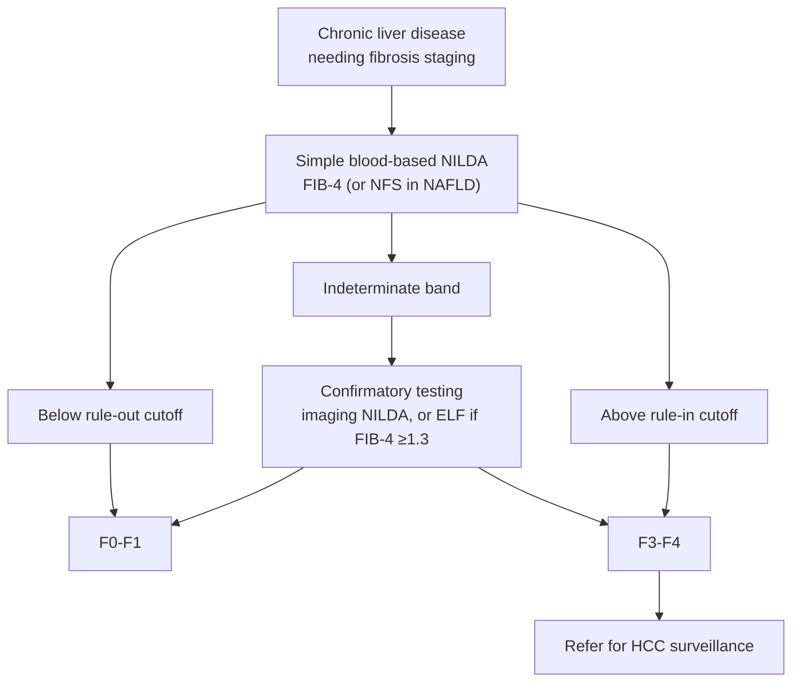

## Bibliographic Info

- **Article:** [Richard K. Sterling, Keyur Patel, Andres Duarte-Rojo, Sumeet K. Asrani, Mouaz Alsawas, Jonathan A. Dranoff, Maria Isabel Fiel, M. Hassan Murad, Daniel H. Leung, Deborah Levine, Tamar H. Taddei, Bachir Taouli, Don C. Rockey. AASLD 2024 Practice Guideline: Blood-Based Noninvasive Liver Disease Assessment (NILDA) of Hepatic Fibrosis and Steatosis. Hepatology (AASLD); DOI: 10.1097/HEP.0000000000000845.](https://doi.org/10.1097/HEP.0000000000000845)
- **Authors:** Richard K. Sterling, Keyur Patel, Andres Duarte-Rojo, Sumeet K. Asrani, Mouaz Alsawas, Jonathan A. Dranoff, Maria Isabel Fiel, M. Hassan Murad, Daniel H. Leung, Deborah Levine, Tamar H. Taddei, Bachir Taouli, Don C. Rockey
- **Year:** 2024 (published in print *Hepatology* 2025;81:321–357)
- **Journal/Publisher:** Hepatology (AASLD); DOI: 10.1097/HEP.0000000000000845
- **DOI:** [10.1097/HEP.0000000000000845](https://doi.org/10.1097/HEP.0000000000000845)
- **Type:** Practice Guideline. Six PICO questions; the document itself numbers its statements **1–10** and prints them in two boxed series — **Guideline Statements 1–5** (GRADE-rated or ungraded) and **Guidance Statements 6–10** (all ungraded). Grades used: *strong recommendation, moderate quality of evidence* (statements 1, 2, 4, 5) and *ungraded statement* (3, 6–10). No conditional recommendation appears in this document.

## Grading Scheme (as defined by the document)

- GRADE strength is **strong** (apply to most patients with minimal variation; adoptable as policy) or **conditional** (apply to a majority, but variation in care is acceptable; shared decision-making).
- Strength determination assumed that tests performing with **acceptable (>70%), excellent (>80%), or outstanding (>90%) diagnostic accuracy** are associated with improved patient outcomes.
- Quality of evidence starts High for randomized controlled trials (RCTs) and Low for observational studies; rated down for risk of bias, inconsistency, imprecision, indirectness, publication bias; rated up for large effect, dose-response gradient, or plausible confounding that would increase the association.
- **Ungraded statements** were developed by narrative review where evidence was sparse or indirect; **technical remarks** accompany both graded and ungraded statements. Statements with <75% panel agreement were rediscussed.

## Summary

This American Association for the Study of Liver Diseases (AASLD) Practice Guideline addresses **blood-based** [[noninvasive-liver-disease-assessment|noninvasive liver disease assessment]] (NILDA) of hepatic fibrosis and steatosis across chronic liver diseases (CLD). It is one of a coordinated set of AASLD NILDA documents; companion guidelines cover **imaging-based** NILDA and NILDA for **clinically significant [[portal-hypertension|portal hypertension]]**. Recommendations were developed using Grading of Recommendations Assessment, Development and Evaluation (GRADE) based on a commissioned Mayo Clinic systematic review (literature through April 2022); where evidence was sparse/indirect the panel issued ungraded **guidance statements**. Six Population, Intervention, Comparison, Outcome (PICO) questions are addressed (5 in adults, 1 in children).

The central clinical message: blood-based markers are **better at ruling out (high negative predictive value [NPV]) the absence of fibrosis or confirming the presence of cirrhosis than at distinguishing intermediate fibrosis stages**, and they have been studied predominantly in [[hepatitis-c|hepatitis C virus (HCV)]] and [[nafld-masld|nonalcoholic fatty liver disease (NAFLD)]]. Simple, cheap, widely available nonproprietary panels — chiefly **Fibrosis-4 Index (FIB-4)** (and aspartate aminotransferase-to-platelet ratio index [APRI], NAFLD fibrosis score [NFS] in NAFLD) — are recommended as initial tests over complex proprietary panels (FibroTest/FibroSURE, Enhanced Liver Fibrosis [ELF], FibroMeter, HepaScore, FibroSpect II), whose diagnostic accuracy is **not significantly different** in clinical practice. Markers perform worse for advanced fibrosis in [[chronic-hepatitis-b|hepatitis B virus (HBV)]] (cutoffs derived in HCV cause higher false-negative rates) and there are insufficient data to recommend blood-based NILDA for [[alcohol-associated-liver-disease|alcohol-associated liver disease (ALD)]] or chronic cholestatic disease ([[primary-biliary-cholangitis|primary biliary cholangitis (PBC)]]/[[primary-sclerosing-cholangitis|primary sclerosing cholangitis (PSC)]]) fibrosis staging.

For longitudinal use, the guideline recommends **against** using blood-based NILDA to follow progression, stability, or regression of histologic fibrosis stage, because extracellular matrix deposition/degradation is non-linear, etiology-dependent, and markers incorporating aminotransferases/acute-phase reactants reflect inflammation rather than true fibrosis change (notably post–sustained virological response [SVR] in HCV and on antiviral therapy in HBV, where biochemical improvement causes false-negative staging). For **steatosis**, the guideline recommends **against** blood-based NILDA to detect steatosis in NAFLD — the many serum steatosis indices (fatty liver index [FLI], hepatic steatosis index [HSI], NAFLD liver fat score [NLFS], etc.) are not accurate enough for daily practice, and **imaging-based NILDA (controlled attenuation parameter [CAP], magnetic resonance imaging–proton density fat fraction [MRI-PDFF], magnetic resonance spectroscopy [MRS])** is preferred.

A simplified clinician algorithm (Figure 1) operationalizes a **sequential strategy**: begin with FIB-4 (or NFS in NAFLD); results below the rule-out threshold → F0–F1; above the rule-in threshold → F3–F4 (refer for [[hcc-surveillance|hepatocellular carcinoma (HCC) surveillance]] per AASLD HCC guidance); **indeterminate** values (up to one-third of patients) require **confirmatory testing**, ideally imaging-based NILDA or ELF when FIB-4 ≥1.3.

## Key Findings / Claims

- Liver biopsy is the imperfect reference standard (sampling/classification/spectrum bias). Complication rates: clinically apparent bleeding ~1 in 500 (0.2%); severe bleeding 1 in 2500 to 1 in 10,000 (0.04%–0.01%); mortality 1 in 10,000 to 1 in 12,000 (0.01%–0.0083%). Because of biopsy error, the ideal NILDA area under the receiver operating characteristic curve (AUROC) usually does not exceed 0.9.
- For purposes of these guidelines fibrosis is collapsed to: **significant fibrosis = ≥F2**, **advanced fibrosis = F3–4**, **cirrhosis = F4**. Steatosis grades: **S0 <5%, S1 5%–33%, S2 34%–66%, S3 >66%**.
- AUROC interpretation: 0.5 = no discrimination; 0.7–0.8 acceptable. The document gives two labels for the top two bands — body text calls 0.8–0.9 *good* and >0.9 *excellent*; Table 4 calls 0.8–0.9 *excellent* and >0.9 *outstanding*. Positive likelihood ratio (LR) >10 and negative LR <0.1 indicate strong evidence; diagnostic odds ratio (DOR) = positive LR/negative LR and is independent of prevalence (higher is better).
- Blood-based markers have **high sensitivity/NPV for ruling out** advanced fibrosis in NAFLD but **low positive predictive value (PPV) for ruling in**; in low-prevalence (community/primary care) cohorts they are useful to exclude advanced fibrosis but need a second test to improve PPV.
- **FIB-4 and APRI** are the best-validated nonproprietary tests but have an **indeterminate range** and unreliable performance in some patients.
- **Proprietary and nonproprietary tests have comparable diagnostic accuracy**; nonproprietary tests are readily available, repeatable, and cheaper.
- **HBV caveat:** cutoffs established in HCV give higher false-negative rates for advanced fibrosis/cirrhosis in HBV; FibroTest/FibroMeter/HepaScore optimal cutoffs were lower in HBV than HCV.
- **Post-SVR (HCV) and on-treatment (HBV):** routine blood markers (which include aminotransferases) substantially underestimate significant fibrosis after viral clearance; no validated post-SVR thresholds exist.
- **Sequential combination** (e.g., FIB-4 → ELF, or FIB-4 → NFS) reduces indeterminate/misclassification rates and unnecessary referrals (one NAFLD primary-care pathway of FIB-4 followed by ELF cut referrals to secondary care by 80%, though it applied to only about half of referrals); adding a second test mainly reclassifies indeterminate patients.
- **Clinical factors degrade accuracy** (Table 6): age extremes (FIB-4, NFS, King's, eLift, ELF, HepaScore, FibroMeter); splenectomy/thrombocytopenia (platelet-based tests — APRI, FIB-4, NFS, FibroMeter); active alcohol use and Gilbert/cholestasis/hemolysis (FibroTest, HepaScore — gamma-glutamyl transferase [GGT]/bilirubin/haptoglobin effects); elevated alanine aminotransferase (ALT)/aspartate aminotransferase (AST) inflammation; chronic kidney disease (CKD); malnutrition (NFS albumin); postprandial state (NFS — glucose); gastrectomy and extra-hepatic fibrosing conditions (hyaluronic-acid-based — FibroSpect, HepaScore, ELF).
- **Steatosis:** blood-based indices (FLI, HSI, lipid accumulation product [LAP], NLFS, index of NAFLD [ION], SteatoTest, triglyceride-glucose index [TyG], visceral adiposity index [VAI], Dallas) are insufficiently accurate for daily practice; AASLD recommends imaging-based NILDA (CAP/MRI-PDFF/MRS) for steatosis.
- **Pediatrics:** APRI and FIB-4 are the most studied but vary widely; FIB-4 performs poorly in young children (age in the index); rapid somatic growth and alkaline-phosphatase fluctuation confound results; FibroTest correlates poorly with histology in children.
- Recommendations developed under prior NAFLD/nonalcoholic steatohepatitis (NASH) nomenclature are expected to apply to metabolic dysfunction–associated steatotic liver disease/steatohepatitis (MASLD/MASH) (>98% overlap).

### Key Blood-Based NIT Cut-Points (as reported)

**FIB-4 thresholds for advanced fibrosis (F3–4) in NAFLD:**

| Threshold | Use | Performance (systematic review) |
|---|---|---|
| FIB-4 ≤1.30 (lower) | Rule **out** F3–4 | Higher sensitivity than 1.45, as expected for the lower cutoff; DOR 7.81. Revised NASH CRN threshold |
| FIB-4 <1.45 (lower) | Rule **out** F3–4 | DOR 10.19 — higher DOR than 1.30, so the standard rule-out cutoff |
| FIB-4 ≥2.67 (upper) | Rule **in** F3–4 | Pooled specificity 0.94 (32 studies); DOR 10.76. Revised NASH CRN threshold |
| FIB-4 ≥3.25 (upper) | Rule **in** F3–4 | Pooled specificity 0.94; DOR 7.01 — lower DOR than 2.67 |

- A prior meta-analysis (6 studies, 1910 patients) gave a summary specificity of 0.96 for both FIB-4 ≥2.67 and ≥3.25 to rule in advanced fibrosis.
- Across etiologies, FIB-4 and NFS rule-out sensitivity is 60%–75% for significant fibrosis and 75%–85% for advanced fibrosis; the rule-in thresholds correspond to specificity 91%–97% (NFS validated only in NAFLD).

**NFS thresholds for advanced fibrosis (F3–4):**

| Threshold | Use | Performance |
|---|---|---|
| NFS < −1.455 (lower) | Rule **out** F3–4 | Summary median sensitivity 0.75 (95% confidence interval [CI] 0.61–0.81) for excluding F3–4 |
| NFS > 0.676 (upper) | Rule **in** F3–4 | Specificity 0.96 (95% CI 0.93–0.98); indeterminate rate ~33.5% |

**ELF for F3–4 in NAFLD:**

| Threshold | Use | Performance |
|---|---|---|
| ELF 7.7 (lower) | Rule out / screening | High sensitivity (0.93) but limited specificity (0.34) at this lower threshold |
| ELF higher thresholds (≥9.13–9.49 used in studies) | Rule in | Higher thresholds and F3–4 prevalence ≥30% needed to raise ELF PPV to >0.8 for advanced fibrosis; ELF had highest DOR (21.49) among advanced-fibrosis tests |

**Cutoffs used in the comparative (test-vs-test) analyses — each only valid for the population it was studied in:**

| Disease | Target | Cutoffs compared | Best performer |
|---|---|---|---|
| HCV | Significant fibrosis (F2–4) | APRI 0.5 or 1; FIB-4 1.45; FibroMeter 0.5; FibroTest 0.48 | DOR range 5.44–13.35, not significantly different; APRI cutoff 1 highest (DOR 13.35, 6.7–26.57) |
| HCV | Advanced fibrosis (F3–4) | APRI 1.5; FIB-4 1.45 or 3.25; FibroTest 0.48; ELF 9.13–9.49 | DOR range 6.87–21.49; ELF highest (DOR 21.49, 8.43–54.75) |
| HCV | Either | FIB-4 vs APRI in >2000 paired biopsies | Equivalent: AUROC 0.83 (0.81–0.85) vs 0.80 (0.78–0.82) |
| HBV | Advanced fibrosis | APRI 0.5; FIB-4 1.45; FIB-4 2.2 | DOR range 4.86–9.28; APRI 0.5 and FIB-4 1.45 not significantly different; **FIB-4 2.2** highest DOR |
| NAFLD | Advanced fibrosis | FIB-4 1.45 (rule-out) or 2.67 (rule-in) vs APRI 1.5 | FIB-4 higher DOR than APRI; data insufficient to compare FibroTest (cutoff 0.70) or ELF (cutoff 9.8) |
| ALD | Advanced fibrosis | ELF 10.5; FibroTest 0.58 | Both outperformed FIB-4 and APRI in primary and specialty care (all tests AUROC >0.8) |

- **ALD:** APRI alone had low accuracy (AUROC 0.59–0.67 for F2–4 or cirrhosis, 218 patients); FibroTest/FibroMeter/HepaScore better (F2–4 AUROC 0.83; cirrhosis AUROC 0.92–0.94), but heterogeneity precluded summary analysis.
- **HBV:** summary AUROC 0.75–0.84 for F2–4 and 0.75–0.90 for F4 across APRI, FIB-4, FibroTest (30 studies); FibroTest 0.84/0.87 in a 16-study, 2494-patient analysis. Optimal FibroTest/FibroMeter/HepaScore cutoffs were **lower** in HBV than HCV (510-patient study).
- **PBC:** APRI and FIB-4 AUROC 0.77–0.93 for ≥F2 (103 patients), better for cirrhosis — but no disease-specific thresholds have been established. **PSC:** ELF and FibroTest AUROC >0.8 for F4 (229 patients), comparable to the simple tests.
- **Hemochromatosis:** APRI and FIB-4 AUROC 0.86–0.88 with 81% accuracy for advanced fibrosis (181 C282Y homozygotes).
- **Pediatrics:** APRI >1.22 identified cirrhosis in biliary atresia (BA) at presentation (AUROC 0.83, sensitivity 75%, specificity 84%, 260 children); APRI optimal cut-points 1.01 for F3–4 and 1.41 for F4 in a 35-infant BA study; APRI >0.59 separated significant fibrosis in pediatric HBV (AUROC 0.75, positive predictive value [PPV] 70%, NPV 77%); APRI >0.462 indicated sevenfold odds of advanced fibrosis in cystic fibrosis liver disease (CFLD; AUROC 0.8). Results conflict across studies — these are not validated thresholds.

## Simplified Blood-Based NILDA Algorithm (Figure 1)

Fibrosis staging begins with a simple nonproprietary blood test; proprietary tests may be used where available. The left side of the algorithm aims to rule out advanced fibrosis.

| Result band | Non-NAFLD | NAFLD | Action |
|---|---|---|---|
| No advanced fibrosis | FIB-4 <1.45 | FIB-4 <1.3 **or** NFS <−1.455 | F0–F1 |
| Indeterminate | FIB-4 1.45–3.25 | FIB-4 1.3–2.67 **or** NFS −1.455 to 0.676 | Confirmatory testing → then F0–F1 or F3–F4 |
| Advanced fibrosis | FIB-4 >3.25 | FIB-4 >2.67 **or** NFS >0.676 | F3–F4 |

- Confirmatory testing for indeterminate values should be imaging-based NILDA; for NAFLD specifically, FIB-4 followed by imaging NILDA **or ELF when FIB-4 ≥1.3**.
- Patients above the advanced-fibrosis threshold: imaging-based NILDA may still be used for confirmation, and they should be referred for HCC surveillance per AASLD HCC guidelines.
- Up to one-third of patients fall in the indeterminate range.
- When more granularity is needed (starting antiviral therapy in HBV with significant fibrosis; initiating HCC surveillance), consult the companion imaging-based and portal-hypertension NILDA documents.

*Figure 1 — Simplified blood-based NILDA algorithm for the clinician, recreated as text. ([[aasld-2024-nilda-blood]])*

## Table 5 — Components of the Blood-Based Fibrosis Algorithms

Upper limit of normal (ULN); body mass index (BMI); impaired fasting glucose (IFG); international normalized ratio (INR).

| Panel (year) | Derivation cohort | Formula / components |
|---|---|---|
| APRI (2003) | HCV | [(AST/ULN) / platelet count (10⁹/L)] × 100 |
| FIB-4 (2006) | HIV-HCV | age (y) × AST (U/L) / [platelet count (10⁹/L) × √ALT (U/L)] |
| NFS (2007) | NAFLD | −1.675 + (0.037 × age) + (0.094 × BMI) + 1.13 × IFG/diabetes (yes = 1, no = 0) + 0.99 × (AST/ALT ratio) − (0.013 × platelets) − (0.66 × albumin) |
| Fibroindex (2007) | HCV | 1.738 − 0.064(platelet [×10⁴/mm³]) + 0.005(AST IU/L) + 0.463(gamma globulin [g/dL]) |
| King's Score (2009) | HCV | age × AST × INR / platelet count (10⁹/L) |
| Easy Liver Fibrosis Test (eLift, 2017) | Mixed | Component weighted scores (0–4) from age, sex, GGT, AST, platelets, prothrombin index |
| FibroSure/FibroTest (2001) | HCV | Proprietary — α2-macroglobulin (A2M), GGT, total bilirubin, haptoglobin, apolipoprotein A-1 |
| ELF (2004) | Mixed | Proprietary — hyaluronic acid (HA), amino-terminal propeptide of type III procollagen (PIIINP), tissue inhibitor of matrix metalloproteinase 1 (TIMP-1); age |
| FibroSpect II (2004) | HCV | Proprietary — A2M, HA, TIMP-1 |
| HepaScore (2005) | HCV | Proprietary — age, sex, total bilirubin, A2M, GGT, HA |
| FibroMeter (2005) | Mixed | Proprietary — age, platelets, prothrombin index, urea, AST, A2M, HA |

## Table 6 — Clinical Factors That Degrade Blood-Based NILDA

| Clinical condition | Tools affected | Effect |
|---|---|---|
| Age extremes (very young and very old) | FIB-4, NFS, King's, eLift, ELF, HepaScore, FibroMeter | May not perform as well |
| Splenectomy | APRI, FIB-4, Fibroindex, FibroMeter, NFS | Attenuated thrombocytopenia → falsely **lower** estimate |
| Thrombocytopenia not related to portal hypertension | APRI, FIB-4, Fibroindex, FibroMeter, NFS | Falsely **higher** estimate |
| Active alcohol use | FibroTest, HepaScore | ↑ GGT → falsely elevated |
| Elevated ALT and/or AST (inflammatory hepatitis) | APRI, FIB-4, Fibroindex, FibroMeter, NFS | Falsely elevated |
| Chronic kidney disease (CKD) | Fibroindex, APRI, FIB-4, FibroMeter | ↑ urea → falsely lower (Fibroindex); hemodialysis lowers ALT/AST → falsely lower |
| Malnutrition | NFS | Albumin reduction disproportionate to liver dysfunction → falsely elevated |
| Inflammatory condition | FibroTest, Fibroindex, HepaScore, FibroMeter | ↑ A2M and α-globulin → falsely elevated |
| Hemolysis | FibroTest, HepaScore | ↓ haptoglobin, ↑ total bilirubin → falsely elevated |
| Gilbert syndrome and other cholestatic diseases | FibroTest, HepaScore | ↑ total bilirubin → falsely elevated |
| Postprandial state | NFS | Glucose rise >110 mg/dL falsely elevates NFS |
| Gastrectomy | FibroSpect, HepaScore, ELF | ↑ hyaluronic acid → falsely elevated |
| Extra-hepatic fibrosing conditions (e.g. interstitial lung disease) | FibroMeter, FibroSpect, ELF | ↑ collagen turnover markers → falsely elevated |
| Acute sickle cell crisis | FibroTest | Via hemolysis → falsely elevated |

Also noted in the text: HIV co-infection (thrombocytopenia, antiretroviral-related bilirubin/GGT elevation), sepsis, acute hepatitis, and end-stage renal disease with normal-range transaminases all reduce accuracy.

## Recommendations (verbatim)

Statement numbers **1–10 and the grades below are the document's own**, not the wiki's. Statements 1–5 are printed as *Guideline Statements*, 6–10 as *Guidance Statements*. Technical remarks are condensed from the document's own bulleted remarks following each PICO.

> **PICO 1.** In adult patients with chronic liver disease, including hepatocellular (HCV, HIV [human immunodeficiency virus]-HCV, hepatitis B virus [HBV], HIV-HBV, NAFLD, and ALD) or cholestatic (primary sclerosing cholangitis [PSC] and primary biliary cholangitis [PBC]) disorders, are blood-based biomarker panels accurate in staging hepatic fibrosis (F0-1 vs. F2-4, F0-2 vs. F3-4, and F0-3 vs. F4) using histopathology as the reference?

**Guideline Statement 1.** In adult patients with chronic HBV and HCV undergoing fibrosis staging prior to antiviral therapy, AASLD recommends using simple blood-based NILDA such as APRI or Fibrosis-4 Index (FIB-4) as an initial test to detect significant (F2-4), advanced fibrosis (F3-4) or cirrhosis (F4) compared with no test (**strong recommendation, moderate quality of evidence**).

**Guideline Statement 2.** In adult patients with NAFLD undergoing fibrosis staging, AASLD recommends using simple blood-based NILDA tests such as FIB-4 to detect advanced fibrosis (F3-4) compared to no test (**strong recommendation, moderate quality of evidence**).

**Guideline Statement 3.** In adult patients with ALD or chronic cholestatic liver disease undergoing fibrosis staging, there is insufficient evidence to recommend using blood-based NILDA for staging fibrosis (**ungraded statement**).

> **PICO 2.** In adult patients with chronic liver disease, including hepatocellular (HCV, HIV-HCV, HBV, HIV-HBV, NAFLD, and ALD) or cholestatic (PSC and PBC) disorders, is any blood-based biomarker panel superior to another blood-based biomarker panel in staging hepatic fibrosis (F0-1 vs. F2-4, F0-2 vs. F3-4, and F0-3 vs. F4) using histopathology as the reference?

**Guideline Statement 4.** In patients with chronic HCV who require fibrosis staging, AASLD recommends using simple, less costly, and readily available blood-based NILDA such as FIB-4 over complex proprietary tests (**strong recommendation, moderate quality of evidence**).

**Guideline Statement 5.** In patients with NAFLD who require fibrosis staging, AASLD recommends the use of simple, less costly, and readily available blood-based NILDA tests such as FIB-4 or NAFLD fibrosis score over complex proprietary tests for the detection of advanced fibrosis (F3-4; **strong recommendation, moderate quality of evidence**).

> **PICO 3.** In adult patients with chronic liver disease, including hepatocellular (HCV, HIV-HCV, HBV, HIV-HBV, NAFLD, and ALD) or cholestatic (PSC and PBC) disorders, is the combination of two blood-based biomarker panels superior to a single one for staging fibrosis (F0-1 vs. F2-4, F0-2 vs. F3-4, and F0-3 vs. F4) using histopathology as the reference?

**Guidance Statement 6.** In patients with chronic untreated HCV, AASLD suggests a sequential combination of blood-based markers may perform better than a single biomarker for F2-4 or F4 (**ungraded statement**).

**Guidance Statement 7.** In patients with NAFLD, AASLD suggests the sequential combination of blood-based NILDA may be considered for diagnosis of advanced fibrosis (F3-4) over using a single test alone (**ungraded statement**).

> **PICO 4.** In adult patients with chronic liver disease, including hepatocellular (HCV, HIV-HCV, HBV, HIV-HBV, NAFLD, and ALD) or cholestatic (PSC and PBC) disorders, do serial blood-based biomarker panels accurately predict the natural history of progression of fibrosis or regression of fibrosis in response to therapy relative to serial histopathology as the reference?

**Guidance Statement 8.** AASLD suggests against the use of blood-based NILDA tests to follow progression, stability, or regression in histologic stage (as determined by biopsy) in chronic liver disease (**ungraded statement**).

> **PICO 5.** In patients with NAFLD, are blood-based biomarker panels accurate in grading hepatic steatosis (S0 vs. S1-3, S0-1 vs. S2-3, and S0-2 vs. S3) using histopathology or MR-spectroscopy or MRI PDFF as the reference?

**Guidance Statement 9.** AASLD suggests against the use of blood-based NILDA to detect steatosis in patients with NAFLD (**ungraded statement**).

> **PICO 6.** In pediatric chronic liver disease (HCV, HBV, BA [biliary atresia], CFLD [cystic fibrosis liver disease], and NAFLD/NASH), are blood-based biomarkers accurate in staging hepatic fibrosis (F0-1 vs. F2-4, F0-2 vs. F3-4, and F0-3 vs. F4) using histopathology as the reference?

**Guidance Statement 10.** In the pediatric patients with chronic liver disease, AASLD suggests the use of simple, cost-effective, and readily available blood-based NILDA, such as APRI or FIB-4, for the detection of advanced fibrosis (F3-4) (**ungraded statement**).

### Technical Remarks (condensed, by PICO)

**PICO 1 (statements 1–3):**
- Direct and indirect biomarkers include bilirubin, aminotransferases, platelets, and other acute-phase reactants → false-positive/false-negative results in acute hepatitis, hemolysis, Gilbert syndrome, HIV-induced thrombocytopenia, splenectomy, and disease- or treatment-related bilirubin/aminotransferase elevation (Table 6).
- High sensitivity and NPV for **ruling out** advanced fibrosis in NAFLD, but low PPV for **ruling in** advanced fibrosis in low-prevalence cohorts.
- **No validated post-SVR thresholds** correlate with fibrosis stage in HCV. Both indirect and direct markers have high false-negative rates for advanced fibrosis after antiviral therapy in HBV or HCV.
- Although not included in the systematic review, **NFS can be used to detect F3–4 in NAFLD**.

**PICO 2 (statements 4–5):**
- Head-to-head studies in the same population are few; pooling sensitivity/specificity across studies is suboptimal because different thresholds were used in heterogeneous populations and settings.
- Predictive values depend on clinical setting and fibrosis-stage prevalence; most research came from tertiary/referral centers, limiting generalizability.
- Limited data compare simple with proprietary NILDA in chronic HBV prior to therapy, and limited data exist in diseases other than viral hepatitis and NAFLD.
- Quality of evidence for PICO 2: **moderate** for sensitivity and specificity estimates.

**PICO 3 (statements 6–7):**
- Very few studies compared a combination of serum biomarkers against a single biomarker with histopathology as reference.
- Because simple single tests (APRI, FIB-4, NFS) frequently give indeterminate results between their upper and lower cutoffs, adding a second blood test may better classify fibrosis severity.
- Analyses supporting PICO 3 were imprecise and from studies at high or unclear risk of bias; quality of evidence judged **low**.
- For NAFLD advanced fibrosis, a sequential approach of **FIB-4 followed by imaging NILDA or ELF when FIB-4 ≥1.3** (where available) is recommended.

**PICO 4 (statement 8):**
- Longitudinal biomarker/biopsy studies in HCV come from the interferon era; **no** studies assess biomarker-vs-biopsy change on direct-acting antiviral therapy, so the optimal interval for repeat post-SVR measurement is not established.
- Few longitudinal biopsy studies in HIV-HCV, with variable biopsy intervals, scoring systems, and antiretroviral/HCV regimens.
- Few studies assessed biomarker change with histology after antiviral therapy in HBV; none assessed serial biomarkers with paired biopsy in HBeAg-positive (immunotolerant) or negative (inactive carrier) cohorts.
- Very few paired-biopsy studies in other CLD.

**PICO 5 (statement 9):**
- In adults with CLD, **CAP and MRI can reliably quantify steatosis; MRI-PDFF and MRS correlate excellently with histology and can be used as reference standards.**
- Steatosis independent of fibrosis predicts cardiovascular disease, diabetes mellitus (DM), and in severe cases liver-related mortality.
- CLD with steatosis other than NASH (e.g. chronic HCV genotype 3) has not been well studied.
- Evidence is insufficient to say **which** noninvasive test or algorithm to use for steatosis, to recommend blood tests as clinical endpoints for monitoring steatosis over time, or to recommend a specific blood test in combination with imaging.
- Because BMI is in many indices, use caution after bariatric surgery.

**PICO 6 (statement 10):**
- Some blood-based NILDA in children detect advanced fibrosis well but discriminate earlier stages poorly.
- **FIB-4 does not perform as well in children as in adults, particularly very young children, because age is in the index.**
- Rapid growth and attendant alkaline-phosphatase fluctuation confound blood- and collagen-based NILDA in pediatric liver disease.
- Insufficient biopsy-validated data to recommend biomarkers for pediatric NASH or alpha-1 antitrypsin deficiency (α1AT).
- Growing but insufficient evidence to recommend blood-based NILDA as endpoints for monitoring fibrosis change over time in children.
- Quality of evidence for PICO 6: **low**, from very few studies with severe imprecision; meta-analysis was not feasible.

## Relevance to Wiki

- **[[nafld-masld]]** — primary entity updated. Supplies the blood-based half of the sequential noninvasive test (NIT) strategy (FIB-4 → ELF), the **FIB-4 rule-out (1.3) / rule-in (2.67) thresholds in NAFLD**, the **NFS rule-out (−1.455) / rule-in (0.676) thresholds**, the **ELF diagnostic cutoffs (7.7 as the lower/screening threshold; 9.13–9.49 as rule-in, requiring F3–4 prevalence ≥30% to reach PPV >0.8)**, the recommendation **against** using blood markers to monitor fibrosis over time, and the recommendation **against** blood-based steatosis indices (use imaging/CAP/MRI-PDFF instead). Reinforces that FIB-4 should not be used alone as a rule-in test in low-prevalence settings.
- **[[portal-hypertension]]** — platelet-based markers (FIB-4, APRI, NFS, FibroMeter) are confounded by splenectomy and non-portal-hypertensive thrombocytopenia; FIB-4 >2.67/>3.25 or NFS >0.676 (rule-in advanced fibrosis) flags patients needing HCC surveillance and portal-hypertension workup; companion AASLD document covers NILDA for clinically significant portal hypertension specifically.
- **[[abnormal-liver-chemistries]]** — FIB-4 as an initial triage step for incidentally abnormal liver function tests (LFTs).
- **[[alcohol-associated-liver-disease]]** — insufficient evidence to recommend blood-based NILDA for ALD fibrosis staging (Guideline Statement [GS] 3); proprietary tests (FibroTest, FibroMeter, HepaScore, ELF) outperform APRI but with heterogeneity.
- **[[primary-biliary-cholangitis]] / [[primary-sclerosing-cholangitis]]** — disease-specific blood-based thresholds not established; insufficient evidence (GS 3).
- HBV/HCV entity pages (if present) — FIB-4/APRI as initial pre-treatment staging (GS 1, 4); HCV cutoffs unreliable in HBV; post-SVR/on-treatment staging unreliable.
- Feeds the **[[noninvasive-liver-disease-assessment]]** concept hub tying together the three AASLD NILDA documents (blood-based, imaging-based, portal hypertension).

## Contradictions / Open Questions

- **No conflict** with [[aasld-2025-semaglutide-mash]], but the two documents use ELF for different purposes and the bands do not overlap. This guideline gives only **diagnostic** ELF cutoffs (7.7 lower threshold, sensitivity 0.93/specificity 0.34; 9.13–9.49 rule-in; 10.5 in ALD; 9.8 in NAFLD). It does not define an ELF cirrhosis range — the 9.2–10.5 / 10.5–11.3 / >11.3 candidacy bands belong to the semaglutide document alone.
- This guideline issues a strong recommendation to prefer **simple FIB-4/NFS over proprietary ELF for diagnosis**, while the semaglutide guidance uses ELF as a candidacy/monitoring tool — these are not contradictory (diagnosis vs. treatment selection) but note that the AASLD diagnostic stance favors FIB-4 first.
- Recommends **against** serial blood markers to monitor fibrosis change — the semaglutide page describes an ELF decrease ≥0.5 as a treatment-response signal; flag that this longitudinal use is **outside** the evidence base of this diagnostic/staging guideline (drug-specific guidance, not a general endorsement of monitoring with blood markers).
- All NAFLD evidence predates the MASLD/MASH nomenclature; the guideline assumes carry-over (>98% overlap) but explicitly lists MASLD/steatotic liver disease (SLD) validation as a future-research need.
- No validated post-SVR (HCV) or on-treatment (HBV) blood-based thresholds — open question.
- Optimal interval for repeat blood-based measurements post-SVR not established.

## See Also

[[nafld-masld]], [[portal-hypertension]], [[abnormal-liver-chemistries]], [[alcohol-associated-liver-disease]], [[primary-biliary-cholangitis]], [[primary-sclerosing-cholangitis]], [[noninvasive-liver-disease-assessment]], [[liver-biopsy]], [[liver-stiffness-measurement]], [[hepatitis-c]], [[chronic-hepatitis-b]], [[hcc-surveillance]], [[cirrhosis]]
