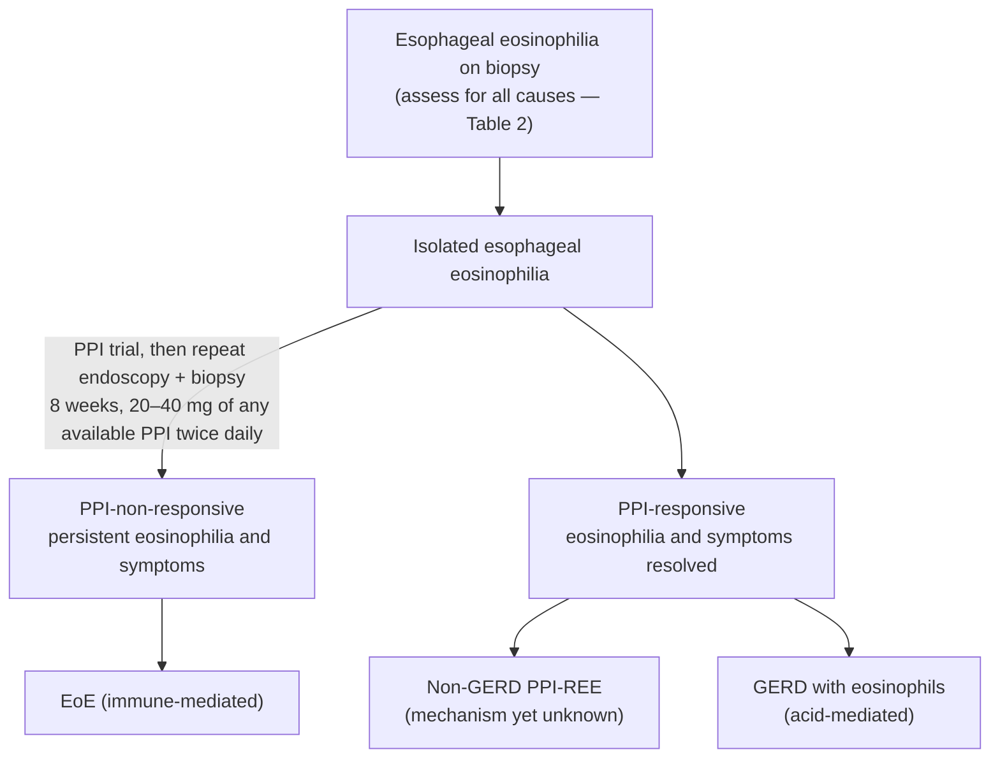

> ⚠ **Superseded guideline.** Superseded by [[acg-2025-eoe|American College of Gastroenterology (ACG) Clinical Guideline: Diagnosis and Management of Eosinophilic Esophagitis (2025)]]. Everything below is the 2013 position; where the two differ, the 2025 document governs current practice (see [[#Contradictions / Open Questions]]).

## Bibliographic Info
- **Article:** [Dellon ES, Gonsalves N, Hirano I, Furuta GT, Liacouras CA, Katzka DA. ACG Clinical Guideline: Evidenced Based Approach to the Diagnosis and Management of Esophageal Eosinophilia and Eosinophilic Esophagitis (EoE). Am J Gastroenterol 2013;108:679–692.](https://doi.org/10.1038/ajg.2013.71)
- **Authors:** Evan S. Dellon, Nirmala Gonsalves (co-first authors), Ikuo Hirano, Glenn T. Furuta, Chris A. Liacouras, David A. Katzka
- **Year:** 2013 (received 27 June 2012; accepted 19 February 2013; published online 9 April 2013)
- **Journal/Publisher:** American Journal of Gastroenterology, volume 108, issue 5 (May 2013), pages 679–692
- **DOI:** [10.1038/ajg.2013.71](https://doi.org/10.1038/ajg.2013.71)
- **Type:** guideline

## Summary
The 2013 ACG guideline established the clinicopathologic framework for [[eosinophilic-esophagitis|eosinophilic esophagitis]] (EoE): symptoms of esophageal dysfunction plus eosinophil-predominant inflammation (peak ≥15 eosinophils per high-power field [eos/hpf]) isolated to the esophagus and persisting after a proton pump inhibitor (PPI) trial, with secondary causes excluded. It required 2–4 biopsies from both proximal and distal esophagus, and antral/duodenal biopsies in children and selected adults.

A defining contribution was the now-historical entity of PPI-responsive esophageal eosinophilia (PPI-REE) — patients with symptomatic and histologic response to a 2-month PPI course, considered distinct from both EoE and [[gerd|gastroesophageal reflux disease (GERD)]] at the time. (Later guidance, including the [[acg-2025-eoe|ACG Clinical Guideline: Diagnosis and Management of Eosinophilic Esophagitis (2025)]], abandoned the PPI-trial requirement and folded PPI-responsive disease into EoE, treating PPIs as a therapy rather than a diagnostic filter.)

For treatment the guideline positioned swallowed topical steroids (fluticasone or budesonide, 8 weeks) as first-line pharmacotherapy, dietary elimination (elemental, empiric, or targeted) as an effective alternative, and conservative [[esophageal-dilation|esophageal dilation]] for fibrostenotic strictures, counseling patients about post-dilation chest pain. It is foundational but superseded for diagnostic criteria and drug positioning.

## Grading Vocabulary
- Grading of Recommendations Assessment, Development and Evaluation (GRADE) system; the document's own numbering runs 1–21 (Table 1).
- **Strength:** *strong* (desirable effects outweigh undesirable) or *conditional* (trade-offs less certain). The authors note most of their recommendations are conditional rather than strong.
- **Evidence quality:** *high* (further research unlikely to change confidence in the estimate) · *moderate* (further research likely to have an important impact) · *low* (further research very likely to change the estimate) · *very low* (estimate very uncertain).
- Strength and evidence are stated in the document's own order per statement (e.g. "Recommendation strong, evidence moderate" vs "Strong recommendation, low evidence") — reproduced as published below.

## Key Findings / Claims — Recommendations
All 21 recommendations, verbatim (strength + evidence as stated):

1. Esophageal eosinophilia, the finding of eosinophils in the squamous epithelium of the esophagus, is abnormal and the underlying cause should be identified. (Recommendation strong, evidence moderate)
2. EoE is clinicopathologic disorder diagnosed by clinicians taking into consideration both clinical and pathologic information without either of these parameters interpreted in isolation, and defined by the following criteria: • Symptoms related to esophageal dysfunction • Eosinophil-predominant inflammation on esophageal biopsy, characteristically consisting of a peak value of ≥ 15 eosinophils per high-power field (eos/hpf) • Mucosal eosinophilia is isolated to the esophagus and persists after a PPI trial • Secondary causes of esophageal eosinophilia excluded (Table 2) • A response to treatment (dietary elimination; topical corticosteroids) supports, but is not required for, diagnosis. (Strong recommendation, low evidence)
3. Esophageal biopsies are required to diagnose EoE. 2–4 biopsies should be obtained from both the proximal and distal esophagus to maximize the likelihood of detecting esophageal eosinophilia in all patients in whom EoE is being considered. (Recommendation strong, evidence low)
4. At the time of initial diagnosis, biopsies should be obtained from the antrum and/or duodenum to rule out other causes of esophageal eosinophilia in all children and in adults with gastric or small intestinal symptoms or endoscopic abnormalities. (Recommendation strong, evidence low)
5. Proton-pump inhibitor esophageal eosinophilia (PPI-REE) should be diagnosed when patients have esophageal symptoms and histologic findings of esophageal eosinophilia, but demonstrate symptomatic and histologic response to proton-pump inhibition. At this time, the entity is considered distinct from EoE, but not necessarily a manifestation of GERD. (Recommendation conditional, evidence low)
6. To exclude PPI-REE, patients with suspected EoE should be given a 2-month course of a PPI followed by endoscopy with biopsies. (Recommendation strong, evidence low)
7. A clinical, endoscopic and/or histologic response to a PPI does not establish gastroesophageal reflux as the cause of esophageal eosinophilia. To determine whether reflux is contributing to esophageal eosinophilia, additional evaluation for GERD, as per standard clinical practice, is recommended. This may include ambulatory pH testing in selected cases. (Recommendation conditional, evidence low)
8. The endpoints of therapy of EoE include improvements in clinical symptoms and esophageal eosinophilic inflammation. While complete resolution of symptoms and pathology is an ideal endpoint, acceptance of a range of reductions in symptoms and histology is a more realistic and practical goal in clinical practice. (Recommendation conditional, evidence low)
9. Symptoms are an important parameter of response in EoE, but cannot be used alone as a reliable determinant of disease activity and response to therapy, given that compensatory dietary and lifestyle factors can mask symptoms. (Recommendation conditional, evidence moderate) *In-text statement adds: and that esophageal strictures may not respond to medical therapy.*
10. Topical steroids (i.e., fluticasone or budesonide, swallowed rather than inhaled, for an initial duration of 8 weeks) are a first-line pharmacologic therapy for treatment of EoE. (Recommendation strong, evidence high)
11. Prednisone may be useful to treat EoE if topical steroids are not effective or in patients who require rapid improvement in symptoms. (Recommendation conditional, evidence low)
12. Patients without symptomatic and histologic improvement after topical steroids might benefit from a longer course of topical steroids, higher doses of topical steroids, systemic steroids, elimination diet, or esophageal dilation (Recommendation conditional, evidence low). There are few data to support the use of mast cell stabilizers or leukotriene inhibitors, and biologic therapies remain experimental at this time.
13. Dietary elimination can be considered as an initial therapy in the treatment of EoE in both children and adults. (Strong recommendation, evidence moderate)
14. The decision to use a specific dietary approach (elemental, empiric, or targeted elimination diet) should be tailored to individual patient needs and available resources. (Recommendation conditional, evidence moderate)
15. Clinical improvement and endoscopy with esophageal biopsy should be used to assess response to dietary treatment when food antigens are either being withdrawn from or reintroduced to the patient. (Recommendation conditional, evidence low)
16. Gastroenterologists should consider consultation with an allergist to identify and treat extraesophageal atopic conditions, assist with treatment of EoE, and to help guide elemental and elimination diets. (Recommendation conditional, evidence low)
17. Esophageal dilation, approached conservatively, may be used as an effective therapy in symptomatic patients with strictures that persist in spite of medical or dietary therapy. (Recommendation conditional, evidence moderate) *In-text statement adds: and initially in patients with severely symptomatic esophageal stenosis.*
18. Patients should be well informed of the risks of esophageal dilation in EoE including post-dilation chest pain, which occurs in up to 75% of patients, bleeding, and esophageal perforation. (Recommendation conditional, evidence moderate)
19. While knowledge of the natural history of EoE is limited, patients should be counseled about the high likelihood of symptom recurrence after discontinuing treatment due to the chronic nature of this disease. (Recommendation strong, moderate evidence)
20. The overall goal of maintenance therapy is to minimize symptoms and prevent complications of EoE, preserve quality of life, with minimal long-term adverse effects of treatments. (Recommendation conditional, evidence low)
21. Maintenance therapy with topical steroids and/or dietary restriction should be considered for all patients, but particularly in those with severe dysphagia or food impaction, high-grade esophageal stricture and rapid symptomatic/histologic relapse following initial therapy. (Recommendation conditional, evidence low)

## Diagnostic Algorithm (Figure 1)

Approach to esophageal eosinophilia found on biopsy at endoscopy done for symptoms of EoE.

*Figure 1 — if eosinophilia is isolated to the esophagus, the three most common clinical possibilities are EoE, GERD and PPI-REE. Persistent eosinophilia and symptoms after the PPI trial → EoE is formally diagnosed; resolution of both → PPI-REE. Some PPI-REE is acid-mediated GERD; in others the mechanism is not known. ([[acg-2013-eoe]])*

## Causes of Esophageal Eosinophilia (Table 2)

Secondary causes to exclude before EoE is diagnosed:

| Diseases associated with esophageal eosinophilia |
|---|
| Eosinophilic gastrointestinal diseases |
| PPI-responsive esophageal eosinophilia |
| [[celiac-disease\|Celiac disease]] |
| [[crohns-disease\|Crohn's disease]] |
| Infection |
| Hypereosinophilic syndrome |
| [[achalasia]] |
| Drug hypersensitivity |
| Vasculitis |
| Pemphigus |
| Connective tissue diseases |
| Graft vs. host disease |

## Endoscopic Classification and Grading (Table 3)

Proposed grading system for the endoscopic features of EoE (adopted by the guideline from the validated classification of Hirano et al.).

| Feature | Grade | Definition |
|---|---|---|
| **Edema** (decreased vascular markings, mucosal pallor) | 0 | Absent. Distinct vascularity present |
| | 1 | Loss of clarity or absence of vascular markings |
| **Fixed rings** (concentric rings, corrugated esophagus, corrugated rings, ringed esophagus, trachealization) | 0 | None |
| | 1 | Mild — subtle circumferential ridges |
| | 2 | Moderate — distinct rings that do **not** impair passage of a standard diagnostic adult endoscope (outer diameter 8–9.5 mm) |
| | 3 | Severe — distinct rings that do **not permit** passage of a diagnostic endoscope |
| **Exudates** (white spots, plaques) | 0 | None |
| | 1 | Mild — lesions involving less than 10% of the esophageal surface area |
| | 2 | Severe — lesions involving greater than 10% of the esophageal surface area |
| **Furrows** (vertical lines, longitudinal furrows) | 0 | Absent |
| | 1 | Vertical lines present |
| **Stricture** | 0 | Absent |
| | 1 | Present (specify estimated luminal diameter) |
| *Minor:* **Crepe paper esophagus** (mucosal fragility or laceration on passage of the diagnostic endoscope, but not after dilation) | 0 / 1 | Absent / Present |
| *Minor:* **Narrow-caliber esophagus** (reduced luminal diameter of the majority of the tubular esophagus) | 0 / 1 | Absent / Present |

## Topical Steroid Initial Dosing (Table 4)

| Medication | Age group | Dosing |
|---|---|---|
| Fluticasone (multi-dose inhaler) | Children | 88–440 mcg/day in a divided dose |
| | Adults | 880–1760 mcg/day in a divided dose |
| Budesonide (aqueous, as oral viscous budesonide) | Children | 1 mg/day |
| | Adults | 2 mg/day, typically in a divided dose |

- Fluticasone: multi-dose inhaler; patient puffs the medication into the mouth during a breath hold, then swallows it, to minimize pulmonary deposition. No spacer, not inhaled.
- Specific doses in children are determined by age, height, or weight.
- Oral viscous budesonide: aqueous budesonide 1 mg/2 mL mixed with 5 g of sucralose.
- Initial duration 8 weeks (Recommendation 10). After dosing, no eating or drinking for 30–60 minutes.

*These are the 2013 doses. Current dosing, including the US Food and Drug Administration (FDA)-approved budesonide oral suspension and orodispersible tablet, is on [[eoe-therapies]].*

## Operative Detail

**Biopsy protocol**
- 2–4 biopsies from each of at least two locations — typically the distal and proximal halves of the esophagus — because inflammation is patchy; reasonable to target rings, plaques and furrows.
- Diagnostic sensitivity approaches 100% once 6–9 biopsies are obtained.
- At least two locations in separate pathology jars (extent of inflammation; eosinophilia varies between distal and proximal esophagus).
- Gastric antral and/or duodenal biopsies: once in **all children**; in **adults** when there are gastric or small intestinal symptoms, abnormal stomach/duodenal endoscopic findings, or when celiac disease or eosinophilic gastroenteritis is a clinical possibility. Limited data support routine gastric/duodenal biopsy in adults without symptoms or endoscopic abnormalities.
- Biopsy all patients in whom EoE is a clinical possibility regardless of endoscopic appearance — the esophagus looks normal in 10–25% of patients with EoE.

**Histologic threshold**
- Peak ≥15 eos/hpf in at least one high-power field, on biopsy obtained **after** a PPI trial, in the proper clinical setting. No study has determined an "exact" threshold; the ≥15 figure is consensus.
- Limits: high-power field size is not standardized, and the definition of the intraepithelial eosinophil varies — note it in the pathology report and talk to the pathologist when results are in question.
- Supporting (non-specific) histology: eosinophil microabscesses, superficial layering, extracellular eosinophil granules, basal cell hyperplasia, rete-peg elongation, subepithelial lamina propria fibrosis, increased lymphocytes.

**Endoscopic and radiologic findings**
- Endoscopic findings alone are insufficient for diagnosis — meta-analysis of 100 publications (4,678 patients with EoE, 2,742 controls) found inadequate sensitivity, specificity and predictive value; inter- and intra-observer reliability only fair.
- Esophagram is **not** a routine diagnostic test; useful selectively for subtle strictures or small-caliber esophagus and for the length/diameter of a stricture when planning dilation.

**PPI trial**
- 8 weeks (2-month course), continuing until the follow-up endoscopy and biopsy; dose at least equivalent to that used for GERD-related erosive esophagitis — reported studies used 20–40 mg of available PPIs twice daily.
- More than one-third of all patients with esophageal eosinophilia on biopsy respond to a PPI (histologic response consistently 30–50%); those patients should not be diagnosed with EoE.
- Ambulatory pH monitoring at baseline does not reliably predict who will respond to a PPI trial.

**Treatment efficacy as cited**
- Fluticasone, children: ~50% complete and 95% partial response over 1–3 months in randomized trials vs prednisone and vs placebo.
- Fluticasone, adults (only placebo-controlled trial): 62% histologic response but no significant symptom improvement.
- Prednisone vs swallowed fluticasone (one randomized trial, children): more complete histologic improvement with prednisone but more adverse events — 40% developed hyperphagia, weight gain and/or Cushingoid features. Reserve prednisone for failure of topical steroids or need for rapid improvement.
- Topical steroid safety: candidal esophagitis reported in 5–30% (usually incidental on follow-up endoscopy); oral candidiasis ~1%; no evidence of adrenal suppression up to 2 months of treatment; long-term growth and bone density data not available.
- Agents **not** recommended for use: leukotriene inhibitors (montelukast — symptomatic but not histologic response; ineffective for maintaining steroid-induced remission), mast cell stabilizers (cromolyn), immunomodulators (6-mercaptopurine, azathioprine), anti-interleukin-5 (IL-5) antibodies (mepolizumab, reslizumab — eosinophil counts fall without symptom benefit), and omalizumab.

**Dietary elimination**
- Three strategies: **elemental** (amino-acid formula, all food allergens removed) · **targeted** elimination guided by allergy testing (skin prick, patch) · **empiric six-food elimination** (milk, wheat, egg, soy, nuts, seafood).
- Duration usually 4–8 weeks, then reintroduction once remission is achieved.
- Elemental formula is the most effective (95–98% resolution of symptoms and histology within 4 weeks) but costly, often needs feeding-tube administration, and affects quality of life.
- Six-food elimination: 74% symptomatic and histologic response in a pediatric cohort; in 50 adults over 6 weeks, 64% reached peak counts ≤5 eos/hpf and 70% ≤10 eos/hpf, with 94% symptom improvement — most common triggers wheat (60%) and milk (50%).
- Reintroduction: one food or food group every 4–6 weeks with symptom observation and endoscopy, or (alternative protocol) a food every 2 weeks with endoscopy after every two foods; a trigger is identified by recurrence of symptoms and eosinophilia (e.g. >15 eos/hpf).
- Allergy testing to direct the diet is not standardized — skin prick testing was only 13% predictive of food triggers in adults; data support a targeted approach in children at some centers but not others.
- Involve a dietitian — food diary early in the trial, contamination sources, caloric/electrolyte/micronutrient adequacy when elemental formula is used.

**Esophageal dilation**
- Reserve until the effect of medical or dietary therapy can be assessed, except when a critical stricture or food impaction is found at the initial endoscopy — dilation may then precede other therapy.
- Technique: conservative, small increments over multiple sessions. If a standard adult upper endoscope (typical diameter 9–10 mm) passes without resistance, select an initial dilator just above that size. Assess the mucosa after each increment; **stop for that session once a mucosal rent, disruption or laceration is seen.** Balloon vs bougie — no convincing evidence either is safer.
- Eventual goal 15–18 mm esophageal diameter for lasting relief of dysphagia (retrospective data and expert opinion; usually several sessions).
- Risks to counsel: post-dilation chest pain in up to 75%, bleeding, perforation. Perforation rate 0.3% in two meta-analyses (similar to dilation for other benign esophageal disease, achieved at experienced academic centers); major bleeding needing hemostasis or blood products is rare.

**Natural history and maintenance**
- Chronic disease; symptoms often precede diagnosis by a decade in adults. Recurrence after withdrawal of topical steroids, systemic steroids, leukotriene antagonists, 6-mercaptopurine, or reintroduction of allergens is near-universal, though the time course varies.
- No case of progression to hypereosinophilic syndrome or malignancy has been reported; some patients progress from an inflammatory to a fibrotic phenotype.
- Potential indications for maintenance therapy: narrow-caliber esophagus · prior stricture requiring repeated dilations · prior emergent endoscopy for food impaction · prior esophageal perforation · prior Boerhaave's syndrome · severe or ongoing symptoms · patient preference.
- Maintenance dosing (adults): reasonable starting dose budesonide 1 mg/day or fluticasone 880 mcg/day, lower in children, titrated to the best clinical response at the lowest achievable dose.
- Only maintenance trial: 28 adults, budesonide 0.25 mg twice daily vs placebo for 50 weeks — modest reduction in eosinophilia and fewer recurrent symptoms, but substantial recurrence persisted at that low dose; no superimposed viral or fungal infections and no mucosal atrophy.
- Long-term dietary elimination and intermittent "on-demand" dilation are also maintenance strategies; dilation alone does not affect the underlying eosinophilia.

## Relevance to Wiki
- [[eosinophilic-esophagitis]] — historical diagnostic criteria and the PPI-REE construct; current criteria come from the 2025 guideline.
- [[esophageal-dilation]] — the conservative technique, the "stop at the first mucosal rent" rule, the 15–18 mm goal and the 0.3% perforation / 75% post-dilation chest pain figures are this guideline's.
- [[eoe-therapies]] — holds current dosing; the Table 4 doses above are the 2013 values.
- [[dysphagia]], [[upper-endoscopy]] — biopsy protocol for suspected EoE (superseded by the ≥6-biopsy protocol of 2025).

## Contradictions / Open Questions

| Issue | ACG 2013 | ACG 2025 (governs) |
|---|---|---|
| PPI trial | Required before diagnosis; 8 weeks, 20–40 mg twice daily | Not a diagnostic criterion |
| PPI-REE | Separate entity, distinct from EoE and not necessarily GERD | Term retired; these patients have EoE |
| Role of PPI | Diagnostic filter | Treatment for EoE |
| Biopsies | 2–4 from proximal and distal esophagus | ≥6 from ≥2 levels, targeting endoscopic findings |
| Biologics | Experimental; anti-IL-5 and omalizumab negative | Dupilumab suggested in PPI-nonresponders |
| Diet | Empiric six-food elimination as the empiric option | Step-up from one- or two-food elimination |
| Endoscopic grading | Table 3 grading system "proposed" | Systematic scoring recommended at every endoscopy (strong) |

- Unresolved in 2013 and carried forward: whether PPI-responsive patients are a GERD variant, an EoE variant or a separate process; optimal treatment endpoints (eosinophil cut-off for response ranged from 0–1 to 0–6 eos/hpf across trials); optimal food reintroduction protocol; whether balloon or bougie dilation is safer.
- Dose-ranging for topical steroids and long-term growth/bone-density safety data were not available.

## See Also
[[eosinophilic-esophagitis]], [[eoe-therapies]], [[esophageal-dilation]], [[gerd]], [[barretts-esophagus]], [[dysphagia]], [[upper-endoscopy]], [[proton-pump-inhibitors]], [[celiac-disease]], [[crohns-disease]], [[achalasia]]

---

## Sources

1. [[acg-2013-eoe|ACG Clinical Guideline: Evidenced Based Approach to the Diagnosis and Management of Esophageal Eosinophilia and Eosinophilic Esophagitis (2013)]]
2. [[acg-2025-eoe|ACG 2025: Diagnosis and Management of Eosinophilic Esophagitis]]
