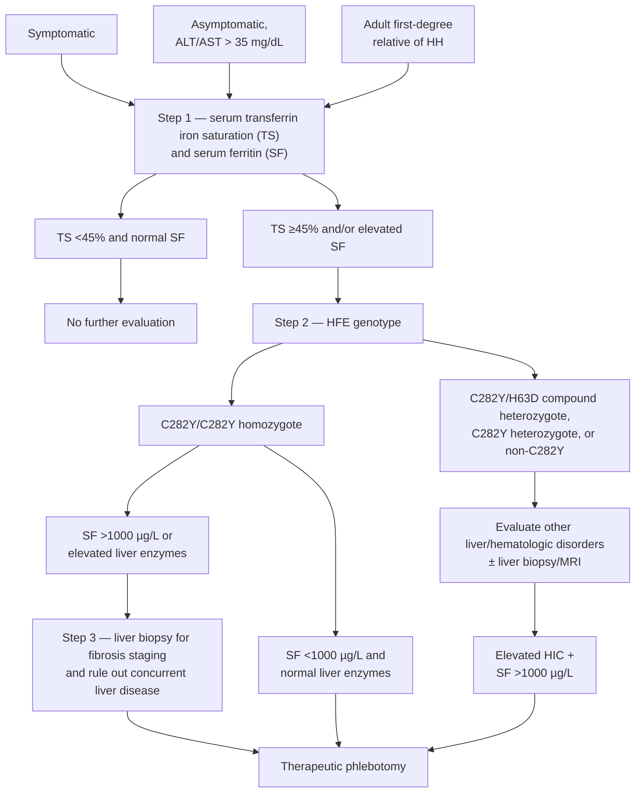

## Bibliographic Info

- **Article:** [Kowdley KV, Brown KE, Ahn J, Sundaram V. ACG Clinical Guideline: Hereditary Hemochromatosis. Am J Gastroenterol 2019;114:1202–1218.](https://doi.org/10.14309/ajg.0000000000000315)
- **Authors:** Kris V. Kowdley, MD, FACG; Kyle E. Brown, MD, MSc; Joseph Ahn, MD, MS, MBA, FACG (GRADE Methodologist); Vinay Sundaram, MD, MSc
- **Year:** 2019 (received December 11, 2018; accepted June 4, 2019; published online July 22, 2019)
- **Journal/Publisher:** American Journal of Gastroenterology 2019;114:1202–1218
- **DOI:** [10.14309/ajg.0000000000000315](https://doi.org/10.14309/ajg.0000000000000315)
- **Type:** guideline (American College of Gastroenterology [ACG] Clinical Guideline, Grading of Recommendations Assessment, Development and Evaluation [GRADE])

---

## Summary

ACG clinical guideline on the diagnosis, evaluation, and management of hereditary hemochromatosis (HH), centred on *HFE*-related (type 1) disease. It is structured as **key concepts, recommendations, and summaries of the evidence**. It contains **10 numbered recommendations, each with a GRADE strength (strong or weak/conditional) and quality of evidence (high, moderate, low, or very low)**, and **exactly one key concept** (the phlebotomy target). Key concepts are defined in the preamble as statements not amenable to GRADE, because of either the structure of the statement or the available evidence.

HH is defined as an inherited [[iron-overload-and-iron-metabolism|iron overload]] disorder characterised by excessive absorption of iron, due to deficiency of hepcidin. Type 1A (C282Y homozygosity) is the most frequent inherited form of iron overload, with a prevalence of approximately 1 in 200–400 persons and highest prevalence in people of Irish and Scandinavian origin. Biochemical penetrance is roughly 75% in men and 50% in women, but clinically manifest disease is far less common. Organ involvement spans liver (elevated liver enzymes, fibrosis, [[cirrhosis]], [[hepatocellular-carcinoma|hepatocellular carcinoma (HCC)]]), endocrine (diabetes, hypogonadism), joints, skin, and heart.

Diagnosis begins with transferrin-iron saturation (TS) and serum ferritin (SF), followed by *HFE* genotyping when TS is ≥45% and/or SF is elevated. SF is the better predictor of fibrosis than hepatic iron concentration (HIC); an SF <1,000 ng/mL in a C282Y homozygote makes advanced fibrosis unlikely and allows [[liver-biopsy|liver biopsy]] to be deferred. Non–contrast-enhanced magnetic resonance imaging (MRI) with T2* software is endorsed to measure HIC non-invasively in the non-C282Y homozygote. H63D and S65C mutations without C282Y are explicitly not a cause of pathologic iron overload.

Phlebotomy remains the mainstay of therapy and is first-line for C282Y homozygotes and C282Y/H63D compound heterozygotes. Chelation is recommended **against** as first-line therapy but **for** patients intolerant or refractory to phlebotomy or in whom phlebotomy may be harmful. Routine [[proton-pump-inhibitors|proton pump inhibitors (PPIs)]] as primary treatment are not recommended. [[liver-transplantation|Liver transplantation (LT)]] is recommended for decompensated cirrhosis or HCC.

---

## Key Findings / Claims

### Definitions (Box 1)

- **Hepcidin** — hormone synthesised and secreted by the liver in response to circulating iron levels; inhibits iron absorption from the intestinal mucosal cells by degradation of ferroportin-1.
- **Ferroportin-1 (FPN)** — transmembrane protein predominantly in intestinal epithelial cells, hepatocytes, and macrophages; facilitates iron export from the cells.
- **Transferrin** — glycoprotein synthesised by the liver, existing in 3 forms (apo, monoferric, and diferric); carries iron in the circulation.
- **Unsaturated iron-binding capacity (UIBC)** — the portion of iron-binding sites on transferrin not occupied by iron. A low UIBC raises the suspicion for hemochromatosis.
- **Total iron-binding capacity (TIBC)** — the sum of the serum iron and UIBC.
- **Transferrin-iron saturation (TS)** — the percentage of iron bound to transferrin; calculated by dividing serum iron by TIBC.
- **Ferritin** — intracellular protein that stores and releases intracellular iron.

### Categories of HH (Table 2)

| Classification | Genes involved and location | Inheritance | Protein function | Clinical manifestations |
|---|---|---|---|---|
| Type 1A HH (homozygote) | *HFE* on 6p21.3 — C282Y | AR | Hepcidin synthesis via BMP6, interaction with TFR1 | Arthropathy, skin pigmentation, liver damage, diabetes mellitus, endocrine dysfunction, cardiomyopathy, hypogonadism |
| Type 1B HH (compound heterozygote) | *HFE* on 6p21.3 — C282Y + H63D | AR | Hepcidin synthesis via BMP6, interaction with TFR1 | Arthropathy, skin pigmentation, liver damage, diabetes mellitus, endocrine dysfunction, cardiomyopathy, hypogonadism |
| Type 1C HH | *HFE* on 6p21.3 — S65C | AR | — | Possible elevations in serum iron/ferritin, no evidence of tissue iron deposition |
| Type 2A juvenile HH | *HJV* (hemojuvelin) on 1p21 | AR | Hepcidin synthesis, bone morphogenetic protein (BMP) co-receptor | Earlier onset, <30 years old, hypogonadism and cardiomyopathy prevalent |
| Type 2B juvenile HH | *HAMP* (hepcidin) on 19q13 | AR | Downregulation of iron efflux from erythrocytes | Earlier onset, <30 years old, hypogonadism and cardiomyopathy prevalent |
| Type 3 HH | *TFR2* (transferrin receptor 2) on 7q22 | AR | Hepcidin synthesis, interaction with transferrin | Arthropathy, skin pigmentation, liver damage, diabetes mellitus, endocrine dysfunction, cardiomyopathy, hypogonadism |
| Type 4A HH (FPN disease) | *SLC40A1* (FPN) on 2q32 — loss of function for FPN excretion | AD | Duodenal iron export | Iron deposition in the spleen very common, lower tolerance to phlebotomies, may have anemia |
| Type 4B HH (nonclassical FPN disease) | *SLC40A1* (FPN) on 2q32 — gain of function, FPN cannot be internalized after hepcidin binding | AD | Resistance to hepcidin | Fatigue, joint pain |

AD, autosomal dominant; AR, autosomal recessive; TFR1, transferrin receptor 1.

### Epidemiology and penetrance

- Prevalence of *HFE*-related HH ~1 in 200–400; incidence varies from 1.5–3 cases per 1,000 up to 1 case per 200–400 persons; prevalence among non-Hispanic whites in the United States 1 in 300.
- C282Y allelic frequency in the general European population approaches 6.2% (pooled cohort of 127,613); 80.6% of phenotypic HH is attributed to C282Y homozygosity (meta-analysis of 2,802 patients).
- C282Y homozygous mutation prevalence: non-Hispanic whites 0.44%, Hispanics 0.027%, African-Americans 0.014%, Pacific Islanders 0.012%, Asians 0.000039%.
- **Biochemical penetrance** (increased TS with or without elevation in SF): ~75% in men, ~50% in women.
- **Clinical penetrance:** Melbourne Collaborative Cohort Study (31,192 patients) — documented iron overload–related disease in **28.4% of men vs 1.2% of women**; French Mediterranean registry — 19% men vs 13% women.
- C282Y/H63D compound heterozygote prevalence ~2%–4% of northern Europeans; penetrance for clinically significant iron overload **0.5%–2%** unless cofactors such as alcohol or hepatitis C virus (HCV) are involved.
- H63D homozygotes/heterozygotes are not at increased risk of developing clinical iron overload, though they may show elevated TS and SF. S65C has not been associated with excess tissue iron stores and can be considered a polymorphism without clinical significance.
- Non-*HFE* disease is very rare: iron overload from pathogenic variants of *HFE2* (hemojuvelin) in 1 in 5–6 million; *TFR2* variants less common still.

### Clinical manifestations (Table 4)

| Organ | Manifestations |
|---|---|
| Liver | Elevated liver enzymes, hepatomegaly, fibrosis, cirrhosis, HCC |
| Endocrine | Hyperglycemia, diabetes mellitus, hypogonadism, testicular atrophy, amenorrhea, loss of libido, hypopituitarism |
| Skin | Hypermelanotic pigmentation (bronze skin) |
| Joints | Arthralgia, arthritis, chondrocalcinosis |
| Heart | Cardiomyopathies, arrhythmias, heart failure |

- Fatigue and arthralgias are the most common symptoms encountered early; up to 18% of men and 5% of women may have hepatic iron overload in the absence of clinical symptoms.
- Manifestations usually occur earlier in men, most commonly in the **fourth to fifth decades**; in women symptoms usually appear postmenopausally.
- Liver: risk of cirrhosis rises significantly with SF >1,000 ng/mL at diagnosis. Alcohol >60 g/d increases cirrhosis risk **9-fold**; >80 g/d significantly reduces survival.
- Endocrine: diabetes prevalence ~13%–23%; hypogonadotropic hypogonadism is the most common nondiabetic endocrine disorder; hypothyroidism risk 80 times that of men in the general population; up to 25% affected by osteoporosis.
- Joints: predominantly the second and third metacarpophalangeal joints; distinguished from calcium pyrophosphate deposition disease (CPPD) radiographically by involvement of the second and third metacarpophalangeal joints and the hook-shaped osteophyte of the metacarpal head.
- Cardiac: dilated cardiomyopathy in 30 of 3,531 patients (0.9%) in one series; cardiomyopathy in 34 of 1,085 (3.1%) in another, with 5 cardiovascular deaths, predominantly in those with SF above 1,000 ng/mL.

### Causes of secondary iron overload (Table 3)

| Category | Causes |
|---|---|
| Iron-loading anemias | Thalassemia major, hemoglobin H, chronic hemolytic anemia, sickle cell anemia, aplastic anemia, pyruvate kinase deficiency, hereditary spherocytosis |
| Parenteral iron overload | Red blood cell (RBC) transfusions, iron-dextran injections, long-term hemodialysis |
| Chronic liver disease | Porphyria cutanea tarda, [[hepatitis-c\|hepatitis C]], [[chronic-hepatitis-b\|hepatitis B]], [[alcohol-associated-liver-disease\|alcoholic liver disease]], [[nafld-masld\|NAFLD]], dysmetabolic iron overload syndrome |
| Miscellaneous | Malignancy (HCC, breast cancer, hematologic malignancies), chronic inflammatory states (systemic lupus erythematosus, rheumatoid arthritis) |

- 30%–40% of HCV-infected patients have elevated serum iron, SF, and TS.
- Nonalcoholic fatty liver disease (NAFLD): unexplained hepatic iron overload characterised by high SF with normal serum iron, related to hepcidin downregulation from insulin resistance, is termed "dysmetabolic" or "insulin-resistance hepatic iron overload syndrome" (DIOS or IR-HIO).
- Alcohol use disorder (AUD): chronic alcohol raises SF and TS and increases hepatic iron stores; low hepcidin levels occur through ethanol-induced downregulation of the transcription factor regulating hepcidin expression.

### Diagnostic testing — iron studies and thresholds

- Initial evaluation of suspected iron overload = serum iron, TS, SF, and UIBC. **TS is the preferred initial screening test; fasting is not required.**
- **TS >45% identifies 97.9%–100% of C282Y homozygotes.** A small proportion of patients — particularly younger individuals at an earlier stage — may have TS <45%. Iron overload may also be present with an elevated SF and a normal TS, particularly in non–*HFE*-related iron overload.
- **A normal SF is defined as <200 ng/mL in premenopausal women or <300 ng/mL in men and postmenopausal women.** Combined with **TS <45%**, this has a **negative predictive value (NPV) of 97%** for excluding iron overload.
- In C282Y homozygotes, **SF >1,000 ng/mL** in combination with elevated aminotransferase levels and a low platelet count predicts cirrhosis in **more than 80%** of patients.
- SF is an excellent predictor of advanced fibrosis but lacks specificity as a screening test — hyperferritinemia also occurs in alcoholic liver disease, HCV, NAFLD, and neoplastic disease.
- **UIBC** is the inverse of TS and can be obtained as a one-step automated test; comparable in diagnostic accuracy to TS. **UIBC below 26 µmol/L** has a sensitivity of 90% and specificity of 90% for detecting C282Y homozygosity.

### Genetic testing

- Genotyping for *HFE* (C282Y) is standard in patients with suspected HH on clinical grounds or with elevated iron studies. Commercial laboratories frequently report all 3 mutations (C282Y, H63D, S65C).
- H63D is more common than C282Y and found in most populations worldwide; ~20% of whites carry at least 1 copy. S65C heterozygote frequency ~2% among whites.
- **Neither the homozygous nor the heterozygous H63D or S65C mutation is a cause of pathologic iron overload.**
- Before pursuing testing for non-*HFE* hemochromatosis, alternative explanations for elevated serum iron tests should be excluded, because abnormal iron studies due to conditions such as AUD or NAFLD are far more common than non-*HFE* hemochromatosis. Sequencing of non-*HFE* genes may be considered in atypical cases — e.g., a younger patient presenting with endocrine or cardiac involvement.
- **Children of a proband:** test the other parent first — if the other parent's *HFE* testing is normal, the child is an obligate heterozygote and need not undergo further testing. Genotyping the spouses of probands could reduce the number of children needing screening by 39%. **If the other parent cannot be tested, the child need not be tested until age 18 years**, because clinical manifestations of HH rarely present beforehand.

### Liver biopsy

- Primary utility in HH is **staging of fibrosis**, particularly among C282Y homozygotes with **SF >1,000 ng/mL**.
- Among C282Y homozygotes with **SF <1,000 ng/mL, liver biopsy is not indicated** unless there is a concurrent risk factor for cirrhosis. In the absence of such risk factors, **less than 2%** of C282Y homozygotes with SF <1,000 ng/mL have advanced fibrosis or cirrhosis.
- Staining: hematoxylin and eosin; Masson's trichrome for fibrosis staging; Perls' Prussian blue to identify and characterise the distribution of stored iron.
- **Hepatic iron index (HII)** = HIC divided by the patient's age in years. An **HII ≥1.9 and/or an HIC of 71 µmol/g dry weight** can distinguish homozygous HH from compound heterozygosity or secondary iron overload. For fibrosis staging, **SF is considered a more accurate predictor of fibrosis than HIC**.
- **Diagnostic features of liver histology in type 1 HH:**
  1. grade 4 stainable iron in hepatocytes with a periportal distribution and lack of stainable iron in Kupffer cells
  2. an HIC of >71 µmol/g dry weight
  3. an HII of >1.9
- Iron distribution by disorder (Figure 2): *HFE*-related HH, juvenile HH, and type 3 HH — periportal hepatocytes, little or no iron in Kupffer cells, with midzonal and centrilobular spread plus biliary epithelium as accumulation continues. Type 4 HH and secondary iron overload — primarily Kupffer cells and reticuloendothelial cells, with sparsity of iron in hepatocytes and lack of a periportal-to-pericentral gradient.
- [[liver-stiffness-measurement|Transient elastography]] has not been validated to assess fibrosis stage in HH; readings did not correlate with SF levels in a prospective study, and the study did not compare elastography directly with liver biopsy.

### Magnetic resonance imaging

- T2-weighted imaging estimates HIC non-invasively: hepatic iron causes loss of signal intensity in the liver proportional to the amount of iron deposition, quantified by the ratio of liver signal intensity to a reference tissue (e.g., paraspinous muscle).
- MRI can distinguish *HFE*-related hemochromatosis from FPN disease or secondary iron overload, because splenic iron deposition is absent in *HFE* hemochromatosis but present in FPN disease or secondary iron overload.
- Meta-analysis of 20 studies, 819 patients: T2 spin echo and T2* gradient-recalled echo identified patients **without** iron overload accurately — **NPV 0.83 and 0.88** — but were less accurate at establishing a definite diagnosis of iron overload — **positive predictive value (PPV) 0.81 and 0.74**. MRI measurement of HIC is therefore more useful in ruling out than in diagnosing clinically significant iron overload.

### Diagnosis and treatment algorithm (Figure 4)

*Figure 4 — algorithm regarding the diagnosis and treatment of HH, recreated. Target population = symptomatic patients, asymptomatic patients with alanine aminotransferase (ALT)/aspartate transaminase (AST) >35 mg/dL, and adult first-degree relatives of patients with HH. Figure thresholds are printed in µg/L; 1,000 µg/L = 1,000 ng/mL.*

- **Step 1** — in the patient with suspected HH based on symptoms, elevated liver enzymes, or family history, the suggested initial screening test is TS and SF level.
- **Step 2** — if TS is <45% and SF is normal, further evaluation is not necessary. If TS is ≥45% and SF is elevated, *HFE* gene testing should be performed.
- **Step 3** — all patients who are C282Y homozygotes should proceed to phlebotomy. If SF is >1,000 µg/L, liver biopsy is suggested for fibrosis staging. Patients with cirrhosis should undergo screening for HCC. A liver biopsy can also be considered before initiating phlebotomy in C282Y homozygotes with elevated liver enzymes, to rule out additional causes of liver disease. In the patient who is **not** a C282Y homozygote, evaluate for other causes of elevated iron indices, including liver and hematologic disorders; if other causes of iron overload have been ruled out, HIC should be assessed by liver biopsy or MRI. Patients with elevated HIC and SF >1,000 should proceed to therapeutic phlebotomy.

### When to initiate treatment

- **Treatment should be initiated in C282Y homozygotes with an elevated SF, defined as >300 ng/mL in men and >200 ng/mL in women, along with a TS of ≥45%.**
- **C282Y homozygotes with an SF within normal limits at diagnosis** are unlikely to develop clinically relevant iron overload later in life and should be monitored with serial assessment of liver aminotransferase and SF levels.
- Patients with an **SF <1,000 ng/mL** at diagnosis are unlikely to have end-organ damage, but treatment is still suggested in this population, because **13%–35% of men and 16%–22% of women will progress to an SF of >1,000 ng/mL if left untreated**. One retrospective study reported reduced mortality from cardiovascular events and extrahepatic cancers among treated C282Y homozygotes even with baseline SF below 1,000 ng/mL; one randomized controlled trial (RCT) of iron removal vs sham found improvement in fatigue and quality of life in the treatment arm.
- **C282Y/H63D compound heterozygotes:** risk of clinically relevant iron overload is low based on *HFE* genotype alone, although liver fibrosis may develop among heterozygotes with comorbidities such as NAFLD, diabetes, or excess alcohol consumption. **Such risk factors need to be evaluated and treated before consideration of iron removal.**
- **H63D homozygotes:** phenotypic hemochromatosis reported in rare cases, usually in association with other comorbidities. Liver biopsy can be considered to rule out secondary liver disorders or to evaluate HIC and fibrosis stage, **particularly among individuals with an SF above 1,000 ng/mL**.
- For **compound heterozygotes or H63D homozygotes with evidence of elevated HIC on biopsy, iron removal can be considered.**

### Phlebotomy

- **Induction:** weekly removal of **500 mL of blood**. Larger volumes, usually **1,000 mL**, can be removed if tolerated to expedite removal of excess iron; conversely, in patients who do not tolerate weekly phlebotomies, smaller volumes can be removed or the interval between sessions increased, although this lengthens the time required to mobilise the excess iron.
- **Check the hemoglobin level before and during treatment to ensure it is above 11 g/dL.**
- **Check SF monthly** during the course of phlebotomy until a **goal SF level of 50–100 ng/mL** is reached.
- **Maintenance:** maintain SF levels **near 50 ng/mL**; frequency of phlebotomy typically **3–4 times per year**.
- Patients with HH should be advised to **avoid vitamin C supplements**, because ascorbic acid increases iron absorption.
- **Elimination of red meat and other sources of dietary iron is not necessary** in the patient undergoing phlebotomy, although a systematic review did suggest that dietary iron restriction may reduce the amount of blood needed to be phlebotomised by **0.5–1.5 L**.
- Blood removed by phlebotomy has been used for transfusion from patients undergoing both induction and maintenance treatment; there are no universal policies, and many blood banks do not accept blood from patients with HH, although others have done so without complications.
- **Effects of phlebotomy:** liver fibrosis and [[portal-hypertension|portal hypertension]] — improvement reported mainly with mild-to-moderate fibrosis at baseline; cardiomyopathy — may improve; skin pigmentation — slowly regresses. **Diabetes does not improve** with iron depletion; **arthropathy** — phlebotomy does not reverse established joint disease, which may progress despite treatment, though some patients report diminished arthralgias; **hypogonadism** — in most cases does not improve.

### Counseling the patient who will undergo phlebotomy (Box 2)

- Phlebotomy is expected to occur weekly, removing around 500 mL of blood each session.
- The goal is to reduce your serum ferritin level to a goal of 50–100 ng/mL.
- In addition to monitoring your serum ferritin, we will monitor your hemoglobin so that it does not fall below 11 g/dL.
- Once the goal serum ferritin level is reached, we will reduce the frequency of phlebotomy to 3–4 times a year.
- You do not need to restrict dietary iron when undergoing phlebotomy.
- You should avoid iron and vitamin C supplements.
- Treatment with phlebotomy will reduce your risk of developing complications related to liver disease or liver cancer.
- The following complications may improve with phlebotomy: abnormal liver tests, heart dysfunction, fatigue.
- The following complications likely will not improve with phlebotomy: diabetes, arthralgias, hypogonadism.
- Treatment with phlebotomy does not medically prevent a patient from being a blood donor.

### Chelation

Three chelating agents are approved by the US Food and Drug Administration (FDA) for the treatment of **secondary** iron overload:

| Agent | Route | Dose as given | Notable toxicity |
|---|---|---|---|
| Deferoxamine | Subcutaneous or intravenous infusion | 20–60 mg/kg over 8–24 h, 5–7 times weekly | Retinopathy, auditory toxicity |
| Deferiprone | Oral | 75–100 mg/kg/d, 3 times daily (approved for transfusion-dependent thalassemia when deferoxamine is inadequate) | Neutropenia, agranulocytosis |
| Deferasirox | Oral | See trial doses below | Gastrointestinal upset, rash, aminotransferase elevation, renal toxicity (>10% of patients) |

- Evidence in HH is limited to small trials: 49 homozygotes with SF 300–2,000 ng/mL randomized to deferasirox **5, 10, or 15 mg/kg/d** — after 48 weeks of treatment, SF decreased by **63.5%, 74.8%, and 74.1%** respectively; at 15 mg/kg/d, elevated aminotransferases and creatinine were more prevalent. A phase 2 study of 10 patients intolerant or refractory to phlebotomy treated with deferasirox **10 mg/kg/d** for 12 months achieved reduction in median ferritin and HIC and was well tolerated.

### Erythrocytapheresis

- Selectively removes RBCs and returns the remaining components (plasma proteins, clotting factors, platelets) — particularly useful in patients with hypoproteinemia or thrombocytopenia.
- Can remove **up to 1,000 mL of RBCs per procedure**, compared with **200–250 mL with phlebotomy**.
- **Frequency: once every 2–3 weeks**, depending on the patient's hemoglobin. RBC volume removed is usually **350–800 mL**. **Minimal targeted post-procedure hemoglobin must be at least 10 mg/dL.**
- In patients without comorbidities and estimated removed RBC volume **≤500 mL**, volume expansion is not needed. For removal of higher RBC volumes, **30% of the removed RBC volume should be replaced with isotonic saline** during the first treatment procedure.
- Adverse reactions relate to the citrate anticoagulant: muscle cramps, paresthesias, nausea.
- In induction, one series of 12 patients found greater reduction in SF per treatment, although over time decreases in both SF and TS were similar. In maintenance, a larger trial found erythrocytapheresis equally effective as phlebotomy with a significantly lower number of treatments annually (**1.9 vs 3.3**), although costs were still higher.

### Proton pump inhibitors

- Gastric acid has an important role in the release of non-heme iron, the major form of iron in most food; PPIs inhibit its absorption and therefore reduce the number of phlebotomies required to maintain SF below target levels.
- RCT: 30 C282Y homozygous patients allocated to pantoprazole **40 mg/d** or placebo for 12 months, with phlebotomies performed when SF was >100 ng/mL — median **2.6 procedures on placebo vs 1.3 on PPI** (P = 0.005).
- Routine use is not recommended; however, if PPIs are otherwise needed for other primary indications, they may have the benefit of reducing the frequency of phlebotomies needed.

### Treatment of secondary iron overload

- Both phlebotomy and chelation may have a therapeutic role in iron-loading anemias, though **chelation is preferred** because of concerns about exacerbating anemia from phlebotomy.
- In secondary iron overload from excess transfusions, a correlation has been established between **SF >1,000 ng/mL** and elevated HIC on liver biopsy.
- For **non–transfusion-dependent iron-loading anemias** such as thalassemia intermedia, SF may underestimate HIC — an **SF threshold of >800 ng/mL** should lead to initiation of treatment in such patients.
- Indications for phlebotomy in AUD, HCV, and NAFLD remain controversial. **All patients should be screened for AUD before treatment and counseled to abstain from alcohol in the appropriate setting, rather than proceeding with the treatment.**
- In HCV, phlebotomy and iron depletion improve virologic response to interferon-based therapy, although these findings are less relevant given the cure rates of direct antiviral therapy. In NAFLD, one RCT of phlebotomy vs standard of care demonstrated a greater reduction in SF but **no significant improvement** in ALT levels, hepatic fat, or insulin resistance.

### Liver transplantation

- Referral should be considered for patients with HH with end-stage liver disease or HCC. LT is curative not only in decompensated cirrhosis and HCC, but also **normalizes hepcidin levels and alterations in iron metabolism**.
- Several groups reported inferior outcomes after LT in HH compared with other etiologies; more recent series have demonstrated similar survival at **1 and 5 years posttransplant**. Studies are limited by small numbers — HH comprises **~1% of all transplants** in most series. Excess mortality has been variably attributed to higher rates of infectious complications or cardiovascular disease.
- **Treatment of iron overload should not be deferred** in a potential transplant candidate whose general health permits, but may not be tolerated in those presenting with advanced liver disease. **In such cases, the inability to de-iron the patient preoperatively is not a contraindication to transplantation.**

### HCC risk, surveillance, and prognosis

- Lifetime incidence of cirrhosis approaches **10%** among untreated men with HH. Iron overload can be worsened by both tobacco smoking and alcohol consumption.
- In the setting of cirrhosis, HCC accounts for as much as **45% of deaths** in this population. Relative risk of tumor formation is estimated at **20 to 200**; an **SF above 2,000 ng/mL indicates particularly high risk**. The **10-year incidence of HCC in patients with cirrhosis secondary to HH is approximately 6%–10%**, with men at higher risk than women.
- [[hcc-surveillance|Surveillance]] recommendations for patients with cirrhosis due to HH are the **same as for other causes of chronic liver disease** — specifically **ultrasound with or without alpha-fetoprotein (AFP) levels performed every 6 months**. **Surveillance should continue even after iron removal is completed**, because HCC can develop years after successful iron depletion.
- There are **no data** addressing the efficacy of HCC screening in patients with HH **without** cirrhosis, and data on HCC occurrence in individuals without cirrhosis are limited to a small number of cases; it is therefore unknown whether patients with HH with stage 3 fibrosis are at increased risk of HCC.
- **Cirrhosis at the time of diagnosis is a critical determinant of prognosis.** Cumulative survival of patients with HH without cirrhosis did not differ from that of the general population, whereas survival of patients with HH and cirrhosis was significantly reduced.
- Mortality from liver disease including HCC for C282Y homozygotes with **ferritin >2,000 at diagnosis** was increased compared with the general population, with a **standardized mortality ratio (SMR) of nearly 24**; the SMR for liver cancer in this group was **49**.

---

## Recommendations

All 10 statements are GRADE-rated; strength is strong or weak/conditional and quality of evidence is high, moderate, low, or very low. Numbering and wording follow Table 1.

**Screening for HH**

1. "We recommend that family members, particularly first-degree relatives, of patients diagnosed with HH should be screened for HH" — *strong recommendation, moderate quality of evidence.*

**Clinical features**

2. "We suggest against the routine surveillance for HCC among patients with HH with stage 3 fibrosis or less" — *conditional recommendation, very low quality of evidence.*

**Diagnostic testing**

3. "We recommend that individuals with the H63D or S65C mutation in the absence of C282Y mutation should be counseled that they are not at increased risk of iron overload" — *conditional recommendation, very low quality of evidence.*
4. "We suggest against further genetic testing among patients with iron overload who tested negative for the C282Y and H63D alleles" — *conditional recommendation, very low quality of evidence.*
5. "We suggest a non–contrast-enhanced MRI (in conjunction with software used for the estimation of HIC (i.e., MRI T2*) be used to noninvasively measure liver iron concentration, in the non-C282Y homozygote with suspected HH. If there is a concomitant need to stage hepatic fibrosis or evaluate for alternate liver diseases, then liver biopsy is the preferred method to determine HIC" — *conditional recommendation, low quality of evidence.*

**Treatment**

6. "We recommend that phlebotomy be used as the first-line treatment in patients diagnosed with HH, as determined by C282Y homozygosity or C282Y/H63D compound heterozygosity" — *strong recommendation, moderate quality of evidence.*
7. "We recommend against chelation as the first-line therapy for HH, given the effectiveness of phlebotomy, the associated side effects of chelation including hepatic and renal toxicity, and the relatively small sample size of clinical trials supporting chelation" — *strong recommendation, low quality of evidence.*
8. "We recommend the use of iron chelation for the treatment of HH in the patient who is intolerant or refractory to phlebotomy or when phlebotomy has the potential for harm, such as in patients with severe anemia or congestive heart failure" — *strong recommendation, low quality of evidence.*
9. "We recommend against the routine use of PPIs as the primary treatment of HH" — *strong recommendation, low quality of evidence.*

**Liver transplantation for HH**

10. "We recommend that liver transplantation be considered in patients with HH who have decompensated cirrhosis or HCC" — *strong recommendation, low quality of evidence.*

### Key Concept

The guideline designates a **single** key concept, placed with Recommendation 6. Key concepts carry no GRADE strength or quality rating.

1. "The goal of phlebotomy is to achieve a SF level between 50 and 100 µg/dL."

The guideline's treatment text and its patient-counseling box state the same goal as **50–100 ng/mL**, which is the figure to use.

---

## Relevance to Wiki

- Anchors [[hereditary-hemochromatosis]] — genotype categories, TS/SF thresholds, biopsy and MRI criteria, the Figure 4 algorithm, treatment-initiation thresholds, phlebotomy induction/maintenance targets, chelation, erythrocytapheresis, and transplant indications.
- [[iron-overload-and-iron-metabolism]] — hepcidin/ferroportin physiology, intestinal iron absorption, definitions of TS, UIBC, and TIBC, and the distinction between primary and secondary iron overload.
- [[hepatocellular-carcinoma]] and [[hcc-surveillance]] — HCC surveillance in HH cirrhosis is identical to other chronic liver disease (ultrasound ± AFP every 6 months) and continues after iron depletion; no surveillance in stage 3 fibrosis or less.
- [[alcohol-associated-liver-disease]] — alcohol as a cofactor for iron overload and cirrhosis in HH (>60 g/d, 9-fold cirrhosis risk), and AUD screening before treating secondary iron overload.
- [[nafld-masld]] and [[hepatitis-c]] — hyperferritinemia and secondary iron overload that mimic HH; phlebotomy in these settings remains controversial.
- [[liver-transplantation]] — LT normalises hepcidin and iron metabolism; inability to de-iron preoperatively is not a contraindication.
- [[liver-biopsy]] — HII and HIC criteria and iron-distribution patterns by hemochromatosis type.
- [[proton-pump-inhibitors]] — PPIs reduce phlebotomy frequency but are not primary treatment for HH.

---

## Contradictions / Open Questions

- **HCC surveillance below cirrhosis is unresolved.** No data address the efficacy of HCC screening in HH without cirrhosis; it is unknown whether stage 3 fibrosis carries increased risk. The recommendation against surveillance rests on very low quality evidence.
- **MRI is better at excluding than confirming iron overload** (NPV 0.83–0.88 vs PPV 0.74–0.81), so a positive study does not establish clinically significant iron overload.
- **Transient elastography is not validated in HH** — readings did not correlate with SF and were never compared directly with liver biopsy.
- **PPIs** demonstrably reduce phlebotomy burden in an RCT (2.6 vs 1.3 procedures) yet routine use is recommended against; the guideline allows the benefit to be taken incidentally when a PPI is needed for another indication, but sets no threshold for deliberate adjunctive use.
- **Erythrocytapheresis** halves the number of annual treatments (1.9 vs 3.3) but costs more and is not universally available; no long-term outcome comparison with phlebotomy is cited.
- **Chelation in HH rests on two small studies** (49 and 10 patients); none of the three chelators is FDA-approved for HH itself — all three are approved for secondary iron overload.
- **Phlebotomy in AUD, HCV, and NAFLD remains controversial** — the NAFLD RCT lowered SF but did not improve ALT, hepatic fat, or insulin resistance.
- **Post-transplant outcomes in HH are inconsistent** — older series reported inferior survival, more recent series similar 1- and 5-year survival; all limited by HH comprising ~1% of transplants.
- **Internal unit inconsistencies in the published document.** The key concept prints the phlebotomy goal as "50 and 100 µg/dL" while the treatment text and counseling box give 50–100 ng/mL; Figure 4's boxes give SF thresholds in µg/L while its legend prints "µg/mL". The operative values are 50–100 ng/mL for the goal and 1,000 ng/mL (= 1,000 µg/L) for the biopsy/phlebotomy threshold.
- **Relationship to [[aasld-2011-hemochromatosis|AASLD 2011]]:** cited in support of the treatment-initiation threshold, the 500 mL weekly phlebotomy volume, the 50–100 ng/mL ferritin goal, iron removal in compound heterozygotes with elevated HIC, and the position against general population screening. No disagreement with it is stated.
- **General population screening** is not indicated, based on the variable prevalence of the C282Y gene across ethnicities and the incomplete penetrance of the mutation; the US Preventive Services Task Force recommendation statement is cited alongside.

## See Also

[[hereditary-hemochromatosis]], [[iron-overload-and-iron-metabolism]], [[hepatocellular-carcinoma]], [[hcc-surveillance]], [[cirrhosis]], [[liver-transplantation]], [[liver-biopsy]], [[alcohol-associated-liver-disease]], [[nafld-masld]], [[hepatitis-c]], [[chronic-hepatitis-b]], [[proton-pump-inhibitors]], [[liver-stiffness-measurement]], [[portal-hypertension]]
