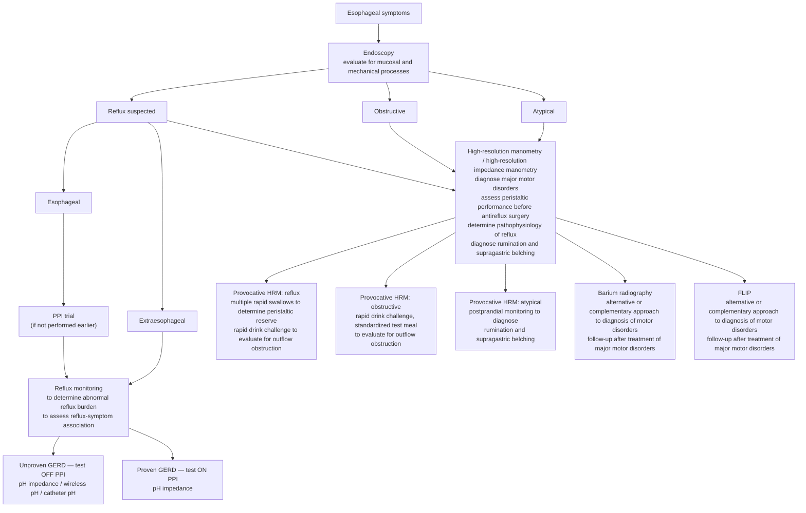

## Contents
- [[#Bibliographic Info]]
- [[#Summary]]
- [[#Grading Scheme]]
- [[#Recommendations]]
  - [[#Obstructive Symptoms — Recommendations 1–4]]
  - [[#Unnumbered Recommendation — FLIP]]
  - [[#Typical Reflux Symptoms — Recommendations 5–11]]
  - [[#Testing After Antireflux Surgery — Recommendation 12]]
  - [[#Extraesophageal and Atypical Symptoms — Recommendations 13–16]]
- [[#Key Concepts]]
- [[#Clinical Algorithm]]
- [[#Thresholds and Cut-Points]]
- [[#Key Findings / Claims]]
  - [[#Obstructive Symptoms — Test Performance]]
  - [[#Typical Reflux Symptoms — Test Performance]]
  - [[#Esophageal Manometry in Reflux and Chest Pain]]
  - [[#Extraesophageal and Atypical Symptoms — Test Performance]]
  - [[#FLIP]]
  - [[#New Diagnostic Modalities and Metrics]]
- [[#Relevance to Wiki]]
- [[#Contradictions / Open Questions]]
- [[#See Also]]
- [[#Sources]]

---

## Bibliographic Info

- **Article:** [Gyawali CP, Carlson DA, Chen JW, Patel A, Wong RJ, Yadlapati RH. ACG Clinical Guidelines: Clinical Use of Esophageal Physiologic Testing. Am J Gastroenterol 2020;115:1412–1428.](https://doi.org/10.14309/ajg.0000000000000734)
- **Authors:** C. Prakash Gyawali, Dustin A. Carlson, Joan W. Chen, Amit Patel, Robert J. Wong (Grading of Recommendations Assessment, Development and Evaluation [GRADE] methodologist), Rena H. Yadlapati
- **Year:** 2020 (received October 5, 2019; accepted May 4, 2020; published online August 5, 2020)
- **Journal/Publisher:** American Journal of Gastroenterology 2020;115:1412–1428
- **DOI:** [10.14309/ajg.0000000000000734](https://doi.org/10.14309/ajg.0000000000000734)
- **Type:** Guideline (American College of Gastroenterology [ACG] Clinical Guideline, GRADE-based)

---

## Summary

This American College of Gastroenterology (ACG) guideline describes the performance characteristics and clinical value of the esophageal physiologic tests — esophageal manometry (principally [[high-resolution-manometry|high-resolution manometry (HRM)]] and high-resolution impedance manometry [HRIM]), [[ambulatory-reflux-monitoring|ambulatory reflux monitoring]], barium esophagram, and the [[flip-panometry|functional lumen imaging probe (FLIP)]] — and gives recommendations for their use in routine practice.

It is organized around **3 symptom categories**: obstructive symptoms ([[dysphagia]] and regurgitation), esophageal reflux symptoms (heartburn, regurgitation, chest pain), and extraesophageal or atypical symptoms (cough, hoarseness, globus, belching, rumination). The authors developed population, intervention, comparator, and outcome (PICO) questions within each category; a librarian performed the searches; and 2 formally trained GRADE methodologists evaluated the quality of supporting evidence.

Two framing principles run through the document. First, **no test should be performed without a proper clinical history and without understanding of what the test will provide toward the patient's diagnosis and/or management**. Second, **esophagoscopy (with biopsies) is an important first step and should be performed before ordering esophageal physiologic studies** — esophagoscopy has very low yield as a test of esophageal physiology and motor pathophysiology but is essential for excluding structural or mechanical lesions. Figure 1 routes patients by dominant symptom category from that endoscopy onward.

For obstructive symptoms, HRM is strongly recommended over conventional line tracing manometry (CM); provocative maneuvers and a barium tablet are conditional additions; and FLIP is positioned as complementary to HRM, not a replacement. For esophageal reflux symptoms, ambulatory reflux monitoring is preferred over [[gerd|gastroesophageal reflux disease (GERD)]] questionnaires, over assessment of response to a [[proton-pump-inhibitors|proton pump inhibitor (PPI)]] trial, and over [[upper-endoscopy|upper endoscopy]] alone for a conclusive GERD diagnosis — performed **off** antisecretory therapy in unproven GERD and **on** PPI (pH impedance) in proven GERD. For extraesophageal symptoms, pH impedance monitoring off acid suppression is strongly recommended over laryngoscopy. The authors close by noting that the existing evidence base for esophageal function testing is of **very low GRADE quality**, yet these tests remain integral to evaluating symptoms that persist without an endoscopic explanation.

---

## Grading Scheme

The document contains exactly **three kinds of graded or labelled statement**, and no others:

- **16 numbered Recommendations**, each carrying a **strength** (`strong` or `conditional`) and a **quality of evidence** (`high`, `moderate`, `low`, `very low`).
- **1 unnumbered recommendation** on FLIP, printed with a full GRADE strength and quality but given no recommendation number (it appears inside the Key concept 4 box).
- **10 numbered Key concepts** — statements *not amenable to the GRADE process*, either because of the structure of the statement or because of the available evidence; some are based on extrapolation of evidence and/or expert opinion. **Key concepts carry no strength and no evidence quality.**

Definitions as printed:

- **Strong** — made when the benefits clearly outweigh the negatives and the result of no action.
- **Conditional** — used when some uncertainty remains about the balance of benefits/potential harm.
- Strengths of recommendations are **not always contingent on the GRADE quality of evidence**, particularly when the population health benefits are obvious and/or there is a suspected large magnitude of effect.

**Table 1 — GRADE quality criteria.**

| Quality of evidence | Study design |
|---|---|
| High | Randomized trial |
| Moderate | — |
| Low | Observational study |
| Very low | Any other evidence |

- **Factors lowering the quality of evidence** — study quality: −1 serious limitations, −2 very serious limitations; −1 important inconsistency; directness: −1 some uncertainty, −2 major uncertainty; −1 sparse or imprecise data; −1 high probability of reporting bias.
- **Factors increasing the quality of evidence** — strong association: +1 strong, no plausible confounders; +2 very strong, no major threats to validity; +1 evidence of a dose response gradient; +1 all plausible confounders would have reduced the effect.

---

## Recommendations

Text below is the wording of the numbered recommendation boxes. The summary tables (Tables 2–4) word Recommendation 1 and the unnumbered FLIP statement as *"We suggest…"* rather than *"We recommend…"*; the grades are identical in both places.

### Obstructive Symptoms — Recommendations 1–4

| # | Recommendation | Strength | Quality |
|---|---|---|---|
| 1 | "We recommend that patients with obstructive esophageal symptoms without a mechanical cause undergo high-resolution esophageal manometry for the evaluation of esophageal motility disorders." | Conditional | Very low |
| 2 | "We recommend HRM over conventional line tracing manometry for the diagnosis of esophageal motility disorders in patients with obstructive esophageal symptoms." | **Strong** | **Moderate** |
| 3 | "We recommend the utilization of supplementary/provocative maneuvers with the manometry protocol to improve the diagnostic yield of esophageal motility disorders in patients with obstructive esophageal symptoms." | Conditional | Low |
| 4 | "We recommend inclusion of a barium tablet with a barium esophagram during the evaluation of obstructive esophageal symptoms." | Conditional | Very low |

### Unnumbered Recommendation — FLIP

- **No recommendation number is assigned.** Printed inside the Key concept 4 box, with a full GRADE label:
  > "We recommend the use of FLIP to complement HRM for the diagnosis of esophageal motility disorders in patients with obstructive esophageal symptoms and borderline HRM findings **(conditional recommendation, low quality of evidence)**."
- Table 2 lists the same statement among the obstructive-symptom GRADE statements (conditional, low quality), also without a number.

### Typical Reflux Symptoms — Recommendations 5–11

| # | Recommendation | Strength | Quality |
|---|---|---|---|
| 5 | "We recommend the use of ambulatory reflux monitoring over patient-reported symptoms on GERD questionnaires for a conclusive diagnosis of GERD in patients with esophageal reflux symptoms." | Conditional | Very low |
| 6 | "We recommend the use of ambulatory reflux monitoring over the assessment of response to PPI therapy for a conclusive diagnosis of GERD in patients with esophageal reflux symptoms." | Conditional | Very low |
| 7 | "We recommend the use of ambulatory reflux monitoring over upper endoscopy alone (if endoscopy is not definitive) for a conclusive diagnosis of GERD in patients with esophageal reflux symptoms not responding to PPI." | Conditional | Very low |
| 8 | "We recommend the use of ambulatory reflux monitoring performed off antisecretory therapy over ambulatory reflux monitoring on antisecretory therapy for a conclusive diagnosis of GERD in patients with typical reflux symptoms and unproven GERD." | Conditional | **Low** |
| 9 | "We recommend the use of prolonged wireless pH monitoring over 24-hour catheter-based monitoring for the diagnosis of GERD in adults with infrequent symptoms or day-to-day variation in esophageal symptoms." | Conditional | Very low |
| 10 | "We recommend the use of ambulatory pH impedance monitoring on PPI therapy over endoscopic evaluation or pH monitoring alone to diagnose persisting GERD in adults with typical esophageal reflux symptoms and previous confirmatory evidence of GERD (proven GERD)." | Conditional | Very low |
| 11 | "We recommend that for patients with esophageal symptoms being evaluated for antireflux surgery, abnormal AET [acid exposure time] be considered a predictor of treatment outcome; RSA [reflux symptom association] and mean nocturnal BI [baseline impedance] provide adjunctive value." | Conditional | Very low |

*RSA includes the symptom index and the symptom association probability (SAP).*

### Testing After Antireflux Surgery — Recommendation 12

| # | Recommendation | Strength | Quality |
|---|---|---|---|
| 12 | "We recommend that the EGJ [esophagogastric junction] and gastric cardia anatomy should be inspected endoscopically and/or radiographically to assess mechanical abnormalities in patients with esophageal symptoms after ARS [antireflux surgery]." | Conditional | Very low |

### Extraesophageal and Atypical Symptoms — Recommendations 13–16

| # | Recommendation | Strength | Quality |
|---|---|---|---|
| 13 | "We recommend ambulatory reflux monitoring, specifically pH impedance monitoring performed off acid suppression, over laryngoscopy for a diagnosis of extraesophageal reflux." | **Strong** | Low |
| 14 | "We recommend up-front ambulatory reflux monitoring off acid suppression over an empiric trial of PPI therapy for extraesophageal reflux symptoms without concurrent typical reflux symptoms." | Conditional | Very low |
| 15 | "We recommend HRIM with postprandial monitoring be used to confirm the diagnosis of rumination if clinically necessary in patients with esophageal symptoms suspicious for [[rumination-syndrome\|rumination syndrome]]." | Conditional | Low |
| 16 | "We recommend that for patients with excessive belching, pH impedance monitoring can be used to confirm the diagnosis of supragastric belching." | Conditional | Very low |

*HRIM = high-resolution impedance manometry.*

---

## Key Concepts

Ten numbered key concepts (Table 5). **Ungraded** — no strength, no evidence quality.

| # | Key concept |
|---|---|
| 1 | "Patient-reported symptom questionnaires may aid evaluation of patients with obstructive esophageal symptoms, but symptom questionnaires alone should not be used to diagnose specific esophageal conditions." |
| 2 | "When performing an esophagram for evaluation of patients with obstructive esophageal symptoms, a standardized, upright, timed barium esophagram protocol should be used." |
| 3 | "Barium esophagography provides information about bolus clearance in patients with dysphagia; HRIM provides adjunctive information about bolus clearance." |
| 4 | "In patients whom a manometry study cannot be completed, such as catheter placement failure despite attempts at endoscopic placement, FLIP topography may be used for the diagnosis of esophageal motility disorders." |
| 5 | "When available, FLIP can be used to measure EGJ distensibility or minimal EGJ cross-sectional area intraprocedurally during invasive treatment for [[achalasia]]." |
| 6 | "When available, FLIP may be considered for the measurement of distensibility to assess the fibrostenotic remodeling of the esophagus and stratify risk of food impaction in patients with [[eosinophilic-esophagitis\|eosinophilic esophagitis]]." |
| 7 | "Patient-reported outcome measurement during follow-up after treatment in achalasia, accompanied by an objective measure of esophageal function (e.g., timed barium esophagram) may be used to assess the treatment outcome." |
| 8 | "Esophageal HRM complements the diagnostic evaluation of chest pain not responsive to PPI therapy." |
| 9 | "HRM is important for ruling out motor disorders and for assessing esophageal peristaltic performance in patients with GERD symptoms; HRM should be performed before ARS or invasive GERD management." |
| 10 | "HRM complements endoscopy and barium esophagography in improving the diagnostic yield of identifying [[hiatal-hernia\|hiatal hernia]]." |

---

## Clinical Algorithm

Figure 1 — clinical scheme for the evaluation of esophageal symptoms.

Points the figure legend makes explicitly:

- A PPI test may be an appropriate starting point for typical esophageal reflux symptoms **without alarm features**; it does **not** provide conclusive evidence of GERD, but is pragmatic because most typical reflux patients do not need further invasive testing.
- Manometry helps identify major motor disorders as a mechanism for obstructive symptoms, may rule out confounding motor diagnoses in reflux presentations, and may assist with diagnosis in atypical presentations.
- Goals of provocative testing vary according to the symptom pathway.
- A timed upright barium swallow is a useful, safe, and inexpensive approach when appropriately performed.
- Barium studies and FLIP provide complementary value to evaluation of obstructive esophageal symptoms.

---

## Thresholds and Cut-Points

Every cut-point printed in the document, with the qualifier that makes it usable.

| Metric | Cut-point | Context as stated in the document |
|---|---|---|
| Distal esophageal AET | **>6%** | Lyon consensus proposal — considered **pathologic**. Based on existing normative data and expert consensus |
| Distal esophageal AET | **4%–6%** | Lyon consensus proposal — considered **borderline**, with the need for additional GERD evidence to confirm pathologic GERD |
| Distal esophageal AET | **~4.0%** | The threshold "many studies used… to designate GERD" |
| AET | **>4.0%** (off PPI) | Predicted PPI response (683 patients with suspected GERD, retrospective); predicted symptom improvement with PPI (128 patients tested off PPI); with RSA using impedance-detected reflux events, predicted treatment success before medical or surgical antireflux management (187 subjects) |
| AET | **>4.2%** | Objective GERD diagnosis criterion (with erosive esophagitis) in a prospective study of 366 patients — 88% reported symptom relief with PPI |
| AET | **>5.5%** | "Abnormal AET" as used in the 2-week PPI-test analysis and in the 471-patient prolonged wireless pH cohort |
| AET | **>6.3%** (off PPI) | Reference standard against which GERDQ ≥8 was scored |
| AET | **total ≥5.5%, supine ≥6.9%, upright ≥6.7%** | GERD definition (with reflux esophagitis on esophagogastroduodenoscopy [EGD] or positive SAP) in the 169-patient GERDQ ≥9 study |
| SAP | **>95%** | "Positive SAP" in the 2-week PPI-test analysis |
| Mean nocturnal baseline impedance (MNBI) | **<2,292 Ω** | Predicts symptomatic response with medical or surgical antireflux therapy when AET is inconclusive; identified erosive reflux disease (91% sensitivity, 86% specificity) and pH-positive GERD (86% sensitivity, 86% specificity) |
| MNBI acquisition | 3 × 10-minute periods in the **distal-most 2 impedance channels** during the **nocturnal sleep period**, when there are limited artifacts, swallows, and reflux episodes | Definition of MNBI from 24-hour pH impedance |
| Postreflux swallow-induced peristaltic wave (PSPW) | Primary swallow **within 30 seconds** after a reflux episode | PSPW index = proportion of reflux episodes with a PSPW ÷ total number of reflux episodes on a pH impedance study |
| Prolonged wireless pH recording | **48–96 hours** | Extended recording increases diagnostic yield — both for increased identification of abnormal reflux burden and for RSA |
| Timed upright barium esophagram | **8 oz / 236 mL** barium; barium height abnormal when **>5 cm at 1 minute** and **>2 cm at 5 minutes** | Evidence for abnormal esophageal emptying — not just in achalasia but in other esophageal outflow obstruction syndromes |
| Barium tablet | **13 mm** | Abnormal passage or retention can be indicative of an obstructive process at the EGJ |
| Multiple rapid swallows | **5 repetitive 2 mL water swallows less than 3 seconds apart** | Standard provocative maneuver during HRM |
| Rapid drink challenge | **free drinking of 100–200 mL of water through a straw as fast as possible, upright** | Identifies EGJ outflow obstruction via elevated post-swallow residual pressures or panesophageal pressurization |
| Standardized test meal | typically **cooked rice and gravy**, or a **cheese and onion pasty** | Increases diagnostic yield for obstructive motility disorders (EGJ outflow obstruction and spasm) |
| Standard manometry protocol | **10 supine test swallows** | Baseline protocol to which provocative maneuvers are added |
| Rumination on HRIM | intragastric pressure increase **>30 mm Hg** with proximal movement of gastric content, esophageal pressurization, and a clinically recognized rumination episode | Manometric criteria for rumination |
| Postprandial HRIM monitoring | lasting up to **90 minutes** after a refluxogenic meal | 20% of 94 patients with persistent esophageal symptoms despite PPI had a rumination profile |
| Supragastric belching (Rome IV) | frequent, repetitive, bothersome belching episodes occurring **more than 3 days a week**, criteria fulfilled for **3 months** with symptom onset **at least 6 months** prior | Clinical definition |
| Oropharyngeal pH (Restech Dx-pH) composite Ryan score | number of reflux episodes, duration of longest reflux episode, and % time spent below a pH threshold of **5.5 upright / 5.0 supine** | Components of the Ryan score |
| Salivary pepsin | **>210 ng/mL** | 98.2% specific for GERD and/or reflux hypersensitivity compared with pH impedance monitoring (100 controls, 111 patients with symptomatic heartburn) |

**The guideline does not use a DeMeester score** — acid burden is expressed throughout as AET. It gives a single SAP cut-point (>95%) and **no numeric symptom index cut-point**; symptom index and SAP are described only as the components of RSA.

---

## Key Findings / Claims

### Obstructive Symptoms — Test Performance

- **Esophagoscopy first.** Esophagoscopy has very low yield as a test of esophageal physiology and motor pathophysiology, but performs an essential role in excluding structural or mechanical lesions — therefore esophagoscopy with biopsies is an important first step and should be performed **before** ordering esophageal physiologic studies.
- **Barium esophagram — sensitivity 0.69, specificity 0.50** for detecting esophageal dysmotility, with suboptimal positive and negative predictive values (**0.61** and **0.58**). From a retrospective study of 281 patients at a single center with esophagram completed within 90 days of HRM; there was significant disagreement between the 2 studies (P = 0.04). Esophagram is therefore a **suboptimal screening examination** for detecting esophageal dysmotility in patients with esophageal dysphagia.
- **Questionnaires.** The Mayo Dysphagia Questionnaire and the brief esophageal dysphagia questionnaire (BEDQ) modestly differ between patients with and without major esophageal motor disorders; **BEDQ was only 70% sensitive and 65% specific** in identifying major motor disorders, and neither questionnaire differentiates between specific esophageal motor disorders. In eosinophilic esophagitis, a low symptom score (eosinophilic esophagitis activity index) was only able to detect histologic or endoscopic remission with approximately **60% accuracy**.
- **HRM over CM.** A multicenter randomized trial of **247 patients** demonstrated improved diagnostic yield for achalasia with HRM compared with CM; diagnoses tended to be more frequently confirmed in patients who underwent HRM. HRM provided superior inter-rater agreement and diagnostic accuracy for esophageal motility disorders compared with CM. HRM-based subtyping of achalasia predicted treatment outcome — a CM-based paradigm does not exist. **Novice and intermediate learners** demonstrated higher accuracy and reported greater ease at identification of obstructive motor disorders with HRM compared with CM.
- **Provocative maneuvers.** Absence of contraction reserve on multiple rapid swallows may be associated with a higher likelihood of postfundoplication dysphagia after [[antireflux-surgery|ARS]] and with development or worsening of ineffective esophageal motility over time. In studies evaluating provocative maneuvers, there is **uniform demonstration of added clinically useful information** compared with interpretation of the 10-swallow protocol alone.
- **Barium tablet.** In a study of combined liquid barium plus a 13-mm barium tablet vs liquid barium alone, both were abnormal more often (**74.8%**) in **107 patients with untreated achalasia**; barium tablet transit was abnormal with normal liquid barium transit in **48.9% of 45 patients** with EGJ outflow obstruction, and both were normal in **60.6% of 132 patients** without achalasia (statistically significant differences between groups).
- **Bolus transit.** In a study comparing bolus transit between HRIM and barium esophagram in **20 patients with achalasia**, impedance-barium esophagram concordance was high for swallows with normal esophageal emptying and for severe barium stasis.

### Typical Reflux Symptoms — Test Performance

- **Neither symptom assessment (GERD questionnaires) nor response to PPI is adequate for conclusive diagnosis of GERD**, which is necessary before invasive management.
- **GERDQ (six-item).** Among 85 patients undergoing 24-hour pH impedance monitoring: score **≥8** had **100% sensitivity but 37% specificity** for AET >6.3% off PPI, and **75% sensitivity but 26% specificity** on PPI.
- **GERDQ ≥9.** Multicenter study of 169 Norwegian patients: **66% sensitivity, 64% specificity** for GERD defined as any of reflux esophagitis on EGD, total AET ≥5.5%, supine AET ≥6.9%, upright AET ≥6.7%, or positive SAP.
- **Reflux disease questionnaire (12-item, precursor to GERDQ).** Diamond study, using a positive broader GERD definition (abnormal AET and positive symptom response to PPI): **62% sensitivity, 67% specificity**.
- **Mayo-GERD questionnaire.** Compared with distal esophageal AET >4% on ambulatory reflux monitoring in a cohort of over 300 patients: **68% sensitivity, 72% specificity** at the optimal threshold.
- **Empiric PPI trial.** Original PPI test = **40–80 mg/day of omeprazole or equivalent, typically in divided doses, for 7–28 days**. Meta-analysis of 15 studies (trials of 1–4 weeks) against ambulatory pH testing: **78% sensitivity, 54% specificity**. For noncardiac chest pain (with erosive esophagitis and/or 24-hour pH monitoring as reference): **80% sensitivity**.
- **PPI test, Diamond data.** With a 2-week PPI test against any of reflux esophagitis at EGD, abnormal AET >5.5%, or positive SAP >95%: **69% of patients with GERD had a positive response compared with 51% without GERD** — positive likelihood ratio **1.52**, negative likelihood ratio **0.71**.
- **Endoscopy.** High specificity but low sensitivity. Among **696 patients** undergoing EGD for suspected GERD symptoms, those without reflux esophagitis were more likely to be on PPI therapy than those with erosive esophagitis (53% vs 29%; univariate odds ratio 2.75, P < 0.001; multivariate odds ratio 3.19, P < 0.001). Among over **700 patients** with a partial response to PPI therapy, only **20%–30%** had esophageal mucosal breaks on EGD. A good-quality EGD is nevertheless essential before further evaluation.
- **Unproven GERD.** Symptoms, PPI response, and low-grade erosive esophagitis (Los Angeles [LA] grades A and B) on endoscopy are **insufficient conclusive evidence for GERD** and do not always correlate with abnormal reflux burden off PPI. Most patients not responding to PPI, and **as many as half of patients referred for invasive GERD management, will not have pathologic reflux evidence** on ambulatory reflux monitoring.
- **Proven GERD.** Advanced grade erosive esophagitis and confirmed [[barretts-esophagus|Barrett's esophagus]] constitute conclusive evidence for GERD; reflux testing in these settings can be performed **on** therapy. Escalation benefits patients with proven GERD who continue to have abnormal pH impedance metrics on submaximal or maximal medical antireflux therapy. Of 39 patients with refractory symptoms tested both on and off therapy, weakly acid reflux episodes were more frequently encountered **on** therapy in patients with abnormal AET off therapy. Abnormal pH impedance on once-a-day PPI normalized with maximal PPI therapy in **71.1% of 45 patients**; **89% of 38 patients** with refractory symptoms and abnormal pH impedance metrics on maximal PPI improved with laparoscopic fundoplication.
- **Prolonged wireless pH monitoring.** In a cohort of 471 patients, **56%** of patients with heartburn evaluated with prolonged wireless pH monitoring off PPI had abnormal AET >5.5%; the presence of a hiatus hernia and body mass index >25 were predictors of abnormal AET. Diagnosis may shift to nonerosive reflux disease from [[functional-heartburn|functional heartburn]] when additional days' data are taken into consideration. Wireless pH monitoring is particularly useful when the transnasal catheter is not tolerated or yields a negative result despite high suspicion of GERD, but it is **expensive**, limiting availability in many countries.
- **Reflux phenotyping by AET + RSA** (cohort of nearly 100 patients who underwent pH impedance monitoring off PPI): abnormal AET + positive RSA = **strong evidence for GERD**; abnormal AET + negative RSA = **good evidence**; normal AET + positive RSA = **reflux hypersensitivity**; normal AET + negative RSA = **no evidence**. Symptomatic outcomes with antireflux therapy were best with strong or good evidence for GERD on testing, and poorest with physiologic AET and negative RSA. **RSA alone has modest performance characteristics** in predicting reflux management outcome and is subject to accuracy of symptom reporting; RSA is best used as an **adjunctive measure to complement AET**.
- **AET and treatment outcome.** "Distal esophageal AET is a cardinal reflux metric that predicts **GERD treatment outcome**." Separately, abnormal AET and RSA **also predict treatment success from ARS** — in 187 subjects referred for pH impedance before medical or surgical antireflux management, AET >4%, RSA with impedance-detected reflux events, and testing performed off PPI predicted treatment success; in 33 patients who underwent laparoscopic fundoplication, the **only** predictor of successful postoperative outcome was **positive RSA on pH impedance performed on PPI therapy**.
- **Cost modeling** suggests that early referral for ambulatory reflux monitoring, as long as the sensitivity of pH monitoring remains **above 35%**, may be more cost-effective than prolonged PPI trials, because early ambulatory testing may support averting PPI use in potentially half of tested patients.
- **Baseline impedance.** BI correlates inversely with esophageal mucosal integrity and esophageal acid burden. Earlier work suggested BI had **78% sensitivity, 71% specificity** for differentiating reflux disease from functional heartburn. A retrospective study of over 400 patients found MNBI linked reflux with PPI responsiveness better than AET. BI can also be evaluated using balloon catheters as mucosal impedance (MI) or from BI-HRIM studies; automated analysis is anticipated.

### Esophageal Manometry in Reflux and Chest Pain

- **Noncardiac chest pain.** Once cardiac etiologies are excluded, GERD is the most common mechanism. Among **177 patients with noncardiac chest pain** who underwent manometry and pH testing: **35%** GERD, **7%** jackhammer esophagus, **5%** distal esophageal spasm, **2%** achalasia. Esophageal HRM is required to make a diagnosis of functional chest pain.
- **Before fundoplication.** In one study, **3%** of patients undergoing HRM before planned fundoplication had **achalasia spectrum disorders** — proceeding with standard fundoplication would have worsened the obstruction. A study of **524 patients with achalasia** found that **29%** had been treated unsuccessfully with antisecretory medications and referred for ARS.
- **HRM by itself cannot diagnose GERD.** It rules out motor disorders that can mimic GERD and demonstrates the adequacy of esophageal peristalsis before invasive GERD therapy.
- **Reflux monitoring in refractory presentations.** Of 62 PPI nonresponders with suspected nonerosive reflux disease, **66%** had normal acid exposure on pH impedance testing off antisecretory therapy. In a prospective study of 366 patients with refractory GERD in a Veterans Administration study, **99 (27%) had functional heartburn**, 23 (6%) non-GERD esophageal disorders, and 7 (2%) esophageal motility disorders. In a retrospective study of 221 patients referred for ambulatory reflux monitoring, **only 45% had confirmation of GERD**. Patients with typical GERD symptoms, normal EGD, and poor PPI response may have non-GERD etiologies and **should not be referred for ARS**.
- **Hiatal hernia detection.** Each row below is the test the guideline credits with that performance:

| Study | Reference standard | Test | Sensitivity | Specificity |
|---|---|---|---|---|
| 215 patients with and without hiatus hernia | Endoscopy | CM | 28% | 97% (positive predictive value 82%) |
| 92 obese subjects evaluated before bariatric surgery | Barium radiography | Endoscopy | ≤40% | ≥94% |
| 34 patients undergoing bariatric surgery | Surgical identification | HRM | 88.9% | 60.0% |
| " | " | Endoscopy or barium radiography | 77.4% | 44.0% |
| 90 patients | — | HRM | 92% | 95% |
| 100 consecutive patients (53 with hiatus hernia at laparoscopy) | Surgical measurement | HRM | **94.3%** | **91.5%** |
| " | " | Endoscopy | 96.2% | 74.5% |
| " | " | Barium radiography | 69.8% | 97.9% |

- **False-positive/false-negative rates (retrospective study of 83 consecutive patients undergoing laparoscopic fundoplication; 42 had a hiatus hernia >2 cm at surgery):** preoperative **HRM false-positive rate 5%**, significantly lower than **endoscopic diagnosis at 32%** (P = 0.01); false-negative rates were similar (**48% vs 45%**, not significant). The **32%** figure is endoscopy's, not manometry's.
- The guideline's own conclusion: available data suggest **higher sensitivity of HRM** for hiatus hernia detection compared with either endoscopy or barium radiography, but because of varying performance characteristics **the 3 studies are complementary**. Note the 215-patient study used CM and must be interpreted with caution; endoscopic identification of a hiatus hernia has poor sensitivity despite high specificity when compared with barium esophagography. Body position affects manometric detection, with a higher detection rate in the upright vs supine position.
- **After ARS.** Disrupted integrity of the antireflux surgical site may have implications on management. An **intact fundoplication is associated with successful symptomatic outcome in 81.7%** of patients; normal radiologic and endoscopic evidence of an intact fundoplication correlates with normal manometry and 24-hour pH monitoring. There are **little data** comparing the diagnostic yield of esophagram vs endoscopy in detecting a defective fundoplication wrap.

### Extraesophageal and Atypical Symptoms — Test Performance

- **Burden.** On average, patients with extraesophageal symptoms will visit **10 consultants** and undergo **6 diagnostic procedures in the first year** of evaluation, often without diagnostic clarity, contributing to **more than $5,000 in annual health care costs per patient**.
- **Laryngoscopy.** Laryngoscopic findings of erythema, edema, and/or postcricoid hyperplasia have **low specificity for GERD and are common in healthy volunteers**. Performance characteristics of laryngoscopy for extraesophageal reflux compared with reflux monitoring: **86% sensitivity, 9% specificity, 44% diagnostic accuracy**. Reflux finding scores from laryngoscopy did not correlate with pH impedance test findings; in a prospective study of 33 patients with suspected laryngopharyngeal reflux (LPR), laryngoscopic findings did **not** predict response to PPI therapy; inter-rater reliability and agreement between otolaryngologists for laryngoscopic findings is **suboptimal**. In small prospective cohorts with laryngeal symptoms and laryngoscopic signs of LPR, pH impedance testing off PPI confirmed GERD in **less than half** of patients.
- **Empiric PPI in extraesophageal reflux.** A meta-analysis of 72 studies, including 10 randomized controlled trials, reported a **relative risk of 1.31 in favor of PPIs** for extraesophageal reflux — but highlighted significant heterogeneity in studies and risk of bias. **More than 50% of patients may have nonacid reflux.**
- **Up-front testing is cheaper.** A cost minimization study of an empiric PPI regimen vs initial physiologic evaluation with pH impedance estimated an average weighted cost of **$1,897 for up-front testing and $3,033 for empiric twice daily (BID) PPI**, and an overall cost-saving with up-front testing.
- **Empiric PPI vs dual probe pH for LPR:** empiric PPI therapy had **92.5% sensitivity and 14% specificity**. In a retrospective cohort of 237 patients with extraesophageal symptoms not responsive to PPI, **AET on reflux monitoring predicted response to fundoplication**. In a prospective study of 24 patients with suspected LPR not responsive to PPI therapy, pH impedance findings did not differ compared with controls.
- **Chronic cough.** A randomized controlled trial of PPI vs placebo in 40 subjects with chronic cough without heartburn found PPI did **not** improve chronic cough-related quality of life or symptoms. In a prospective study of 30 patients (10 chronic cough, 10 GERD, 10 healthy controls), those responding to PPI were more likely to have weakly acidic esophagopharyngeal reflux and swallowing-induced acidic/weakly acidic esophagopharyngeal reflux. In 156 patients with chronic cough undergoing pH impedance, pathological AET and BI increased the probability of PPI response. A study of 27 patients with unexplained chronic cough randomized to high-dose PPI vs placebo found significant symptom improvement in the PPI arm **regardless of whether they met criteria for reflux**. The **HASBEER tool** reports concomitant asthma, hiatal hernia, heartburn, and rising body mass index as pretest predictors of abnormal pH in patients failing PPI therapy. **High AET time is uncommon with extraesophageal symptoms, and pH impedance monitoring seems to improve diagnostic yield.**
- **Rumination syndrome.** Diagnosis is made when patients report repetitive, effortless regurgitation of recently ingested food into the mouth, followed by either spitting or rematication and reswallowing, **without nausea, retching, or vomiting**; the regurgitated food is often recognized and has a pleasant taste. Clinical suspicion and the final diagnosis are **essentially clinical**, using the Rome IV criteria. HRIM sensitivity and specificity for rumination syndrome are **75%–80% and 100%** respectively — based on a study of only **15 children and adolescents** with rumination syndrome and 15 controls. A postprandial monitoring protocol increases the likelihood of identification of rumination episodes. Frequent swallowing during HRIM can confound the diagnosis because of relaxation of the lower esophageal sphincter (LES). On pH impedance studies, rumination episodes are **not distinguishable from GERD** using standard reflux metrics; BI values are also similar to GERD and do not provide discrimination. In a study of 5 patients with rumination, combined ambulatory HRM and pH impedance had **86% sensitivity** for identification of rumination episodes, but this technique is not universally available for clinical use.
- **Supragastric belching.** **pH impedance monitoring is considered the gold standard** for the diagnosis of supragastric belching — air within the esophagus is identified by rapid increase in intraesophageal impedance, and directionality of air movement by interrogation of data from sequential impedance electrodes. HRIM can also identify supragastric belches, but only if a postprandial monitoring protocol is used. When *clinical evaluation* was compared with ambulatory pH impedance monitoring, **repetitive belching on questioning** had **93.4% sensitivity, 75% specificity, positive predictive value 96.8%, negative predictive value 60.0%** for a diagnosis of supragastric belching — these are the performance figures for the bedside question, with pH impedance as the reference standard, not figures for pH impedance itself. Supragastric belching episodes were identified in **48% of 50 consecutive patients** with reflux symptoms at a baseline rate of **13 episodes/24 hours** (interquartile range 6–52), whereas **50% of 10 normal healthy volunteers had 2 (1–6) episodes**. In 14 patients with excessive belching, supragastric belches occurred almost exclusively while **upright** (37.8 ± 6.1 episodes/hr vs 0.9 ± 0.5 episodes/hr supine, P < 0.001) — supragastric belching is suppressed during sleep, whereas gastric belches remain constant throughout the 24-hour period. In patients with troublesome belching symptoms, supragastric belches are **more frequent than gastric belches**, and supragastric belches determine the severity of symptoms rather than gastric belches.

### FLIP

- FLIP is a **Food and Drug Administration (FDA)-approved** measurement tool used to measure simultaneous pressure, cross-sectional area (CSA), and distensibility in the esophagus.
- Commercially available since 2009, but **limited penetrance into clinical settings outside of specialized centers** — because of a lack of standardized protocols, lack of data analysis methodology, and paucity of data supporting utility in general practice.
- In a study comparing esophageal motility assessed using FLIP topography to HRM in patients with dysphagia, FLIP was **well-tolerated and accurately detected major motility disorders including achalasia**.
- FLIP topography enhanced the evaluation of esophageal function in **nonobstructive dysphagia** by detecting an abnormal response to esophageal distension in **50%** of patients diagnosed with ineffective esophageal motility in one study.
- FLIP can **characterize achalasia subtypes** by detecting nonocclusive esophageal contractions not observed with HRM; such contractility was detected to varying degrees in each of the achalasia subtypes, allowing additional subclassification.
- **EGJ distensibility measured using FLIP can diagnose achalasia in patients with clinically suspected achalasia but manometrically normal EGJ relaxation** — a known caveat for the use of integrated relaxation pressure alone in excluding achalasia. FLIP can thus identify an obstructive element in major disorders presenting with dysphagia despite a normal integrated relaxation pressure, but **is not intended to replace HRM** in the characterization of motor disorders.
- **The value of FLIP lies in** the identification of achalasia or esophageal outflow obstruction in patients with borderline manometric findings, or in patients with obstructive symptoms despite management of esophageal outflow obstruction.
- Intraoperative CSA measurements demonstrated correlation of the final EGJ CSA during [[poem|peroral endoscopic myotomy (POEM)]] and surgical myotomy for achalasia with clinical response. Other investigators report an increase in EGJ diameter and distensibility index after POEM. Intraprocedural EGJ distensibility measurements correlate with immediate symptom outcome after [[pneumatic-dilation|pneumatic dilation]]. **However, the exact FLIP protocol to be used and target values for post-treatment distensibility and CSA have not been defined.**
- **In eosinophilic esophagitis**, patients with previous food impaction had significantly lower distensibility plateau values than those with solid food dysphagia alone. Reduced esophageal distensibility in eosinophilic esophagitis may predict the risk for food impaction and indicate the requirement for esophageal dilation. FLIP has been demonstrated to be feasible and useful as a marker for esophageal remodeling in both pediatric and adult eosinophilic esophagitis populations, but **further research is needed before this indication for FLIP can become a part of routine clinical care**.
- **In GERD:** FLIP studies evaluating EGJ barrier function in GERD have **not demonstrated a discriminative value** for EGJ distensibility in segregating symptomatic GERD from controls. Impaired esophageal body contractile response to volumetric distension has been associated with abnormal esophageal acid burden in a small study, but more research is needed. Intraoperative FLIP during ARS and endoscopic reflux procedures is feasible, and the distensibility index can help tailor the intervention to prevent postoperative dysphagia. **FLIP utilization in GERD is in its infancy.**

### New Diagnostic Modalities and Metrics

- **Oropharyngeal pH monitoring (Restech Dx-pH).** Nasopharyngeal catheter measuring pH in liquid or aerosolized droplets at the posterior oropharynx. In both pediatric and adult populations, **correlation could not be demonstrated regarding reflux events between esophageal pH impedance monitoring and oropharyngeal pH monitoring**. Differences in oropharyngeal pH monitoring could not be identified between symptomatic patients and healthy volunteers, and **as many as 33% of healthy volunteers had a positive Ryan score**. Oropharyngeal pH monitoring was **unable to predict which patients with laryngeal symptoms would respond to acid suppressive therapy**. These data have tempered the initial enthusiasm for this device.
- **Salivary pepsin (Peptest).** Initial assessment of saliva from 58 patients with GERD and 51 controls identified acceptable test characteristics with an **81% positive predictive value and 78% negative predictive value**. Salivary pepsin >210 ng/mL was **98.2% specific** for GERD and/or reflux hypersensitivity (100 controls, 111 patients with symptomatic heartburn). More recently, 2 studies comparing symptomatic patients with GERD to asymptomatic volunteers **identified no significant difference in salivary pepsin concentration** between the 2 groups and detected positive salivary pepsin results in most volunteers. A recent meta-analysis of **11 observational studies** assessing Peptest in LPR reported a **pooled sensitivity of 64% and specificity of 68%**, limited by significant heterogeneity across studies. Salivary pepsin testing remains noninvasive, rapid, and cost-efficient and continues to be studied as an alternative diagnostic screening tool for GERD and LPR.
- **PSPW index.** After a reflux episode, a primary swallow — the postreflux swallow-induced peristaltic wave — is often seen in healthy individuals, bringing saliva for neutralization of esophageal mucosal acidification and serving as a marker of esophageal chemical clearance. The PSPW index is lower in erosive or nonerosive GERD compared with functional heartburn or healthy controls. Data from a single research group suggest PSPW measurements might **outperform AET and MNBI** in predicting PPI responsiveness in endoscopy-negative heartburn; these data need to be **replicated by other investigators**, and further research is needed before widespread use.
- **Mucosal impedance.** The clinical use of a balloon-mounted MI probe ("mucosal integrity") may help elucidate whether MI measurements can predict esophageal symptom management better than the current paradigms; this tool recently received FDA approval.

**Conclusions as printed.** Esophageal presentations, patient self-report questionnaire information, and even empiric therapeutic trials are **not always predictive of esophageal disorders with high certainty**. The overall goal of esophageal physiologic testing should be to identify unique characteristics about each symptomatic patient that will allow delivery of precision, personalized management. **A major setback is that existing esophageal manometry research evaluating the value of esophageal function tests has very low quality of evidence.** Despite low GRADE quality and conditional recommendations, esophageal physiologic testing options form an integral part of patient evaluation in the setting of esophageal symptoms that persist without objective evidence of etiology or pathophysiology on endoscopy.

---

## Relevance to Wiki

- **[[reflux-testing]]** — test-selection framework by symptom category; the off-PPI (unproven GERD) vs on-PPI (proven GERD) rule; what does and does not constitute conclusive evidence of GERD (LA grades A and B are insufficient; advanced erosive esophagitis and confirmed Barrett's esophagus are conclusive).
- **[[ambulatory-reflux-monitoring]]** — Recommendations 5–11 with their exact grades; AET, RSA, MNBI, and PSPW metrics and their cut-points; wireless vs catheter selection; reflux phenotyping by AET + RSA; cost modeling.
- **[[high-resolution-manometry]]** — Recommendations 1–3 and 12, Key concepts 3 and 8–10; the 10-swallow protocol plus multiple rapid swallows, rapid drink challenge, and standardized test meal specifications; hiatal hernia test-performance table (each number attributed to its own test); role before ARS and in noncardiac chest pain.
- **[[flip-panometry]]** — the unnumbered FLIP recommendation and Key concepts 4–6; the four FLIP use cases (failed catheter placement, borderline HRM, intraprocedural achalasia treatment, eosinophilic esophagitis remodeling); explicit statement that FLIP does not replace HRM and that protocol/target values are undefined.
- **[[gerd]]** — the diagnostic-certainty hierarchy and the limits of questionnaires, PPI trials, and endoscopy.
- **[[laryngopharyngeal-symptoms]]** — Recommendations 13–14; laryngoscopy performance (86% sensitivity, 9% specificity, 44% accuracy); up-front testing cost data; oropharyngeal pH and salivary pepsin.
- **[[rumination-syndrome]]** — Recommendation 15; HRIM manometric criteria and postprandial protocol.
- **[[achalasia]]**, **[[eosinophilic-esophagitis]]**, **[[hiatal-hernia]]**, **[[antireflux-surgery]]**, **[[upper-endoscopy]]** — supporting data on testing before and after intervention.
- Two topics the guideline covers substantively that have no wiki page yet: **barium esophagram** (Recommendation 4, Key concepts 2–3, timed protocol cut-points) and **supragastric belching** (Recommendation 16, diagnostic criteria and episode counts).

---

## Contradictions / Open Questions

- **Internal wording inconsistency.** Recommendation 1 and the unnumbered FLIP statement are printed as *"We recommend…"* in the recommendation boxes but as *"We suggest…"* in Table 2. The GRADE labels are the same in both places (conditional, very low; and conditional, low).
- **The unnumbered FLIP recommendation.** It carries a full GRADE strength and quality and is listed alongside the graded statements in Table 2, yet it is the only such statement without a recommendation number, and it is printed inside a Key concept box.
- **AET cut-points.** The document reports the Lyon consensus proposal of **AET >6% pathologic** and **AET 4%–6% borderline**, and separately notes that many studies used approximately **4.0%** to designate GERD. It **does not state a "<4% = physiologic" cut-point**; "physiologic AET" appears only as a phenotype label, never with a number. Lyon Consensus 2.0 ([[lyon-2024-gerd-diagnosis]]) is the later and higher-priority framework for the diagnostic thresholds.
- **AET and outcome.** The "cardinal reflux metric" sentence is about **GERD treatment outcome** generally. The ARS-specific claim is a separate statement (Recommendation 11 and the 187-subject and 33-patient studies) — the two should not be merged.
- **Chicago Classification.** The guideline cites Chicago Classification v3.0 among its references and predates v4.0 (2021); see [[chicago-classification-v4]] for the current scheme.
- **PROs vs objective testing after achalasia therapy.** Available data do not provide direction on the use of patient-reported outcomes vs objective testing after achalasia therapy, or whether either mode of post-treatment evaluation can be used in lieu of the other. The Eckardt score was developed without rigorous evaluation for validity, and subsequent analysis suggests only fair psychometric performance, with particular weakness related to the chest pain and weight loss items. Discordance is sometimes observed between symptom severity and objective esophageal function after achalasia treatment.
- **Extraesophageal reflux.** Parameters on pH impedance monitoring that have best value for diagnosis of extraesophageal reflux **remain unresolved**.
- **FLIP protocols.** The exact FLIP protocol and target values for post-treatment distensibility and CSA have not been defined; the role of FLIP in GERD needs large prospective studies. The Dallas Consensus ([[dallas-2025-flip-panometry]]) subsequently addressed FLIP protocol standardization and classification.
- **PSPW index** requires replication outside the originating research group.
- **Esophagram vs endoscopy after ARS** — little comparative data on detecting a defective fundoplication wrap.
- **Overall evidence quality.** Fourteen of the 16 numbered recommendations are conditional, and 11 rest on very low quality evidence; only Recommendation 2 (HRM over CM) reaches strong/moderate.

## See Also

[[high-resolution-manometry]], [[ambulatory-reflux-monitoring]], [[flip-panometry]], [[reflux-testing]], [[gerd]], [[achalasia]], [[dysphagia]], [[hiatal-hernia]], [[antireflux-surgery]], [[rumination-syndrome]], [[laryngopharyngeal-symptoms]], [[upper-endoscopy]], [[chicago-classification-v4]], [[eosinophilic-esophagitis]], [[functional-heartburn]], [[barretts-esophagus]], [[poem]], [[pneumatic-dilation]], [[proton-pump-inhibitors]]

---

## Sources

1. [[acg-2020-esophageal-physiologic-testing|ACG Clinical Guidelines: Clinical Use of Esophageal Physiologic Testing]]
</content>
</invoke>
