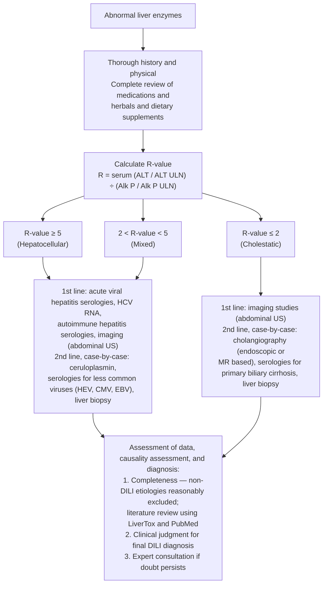

## Contents
- [[#Bibliographic Info]]
- [[#Summary]]
- [[#Scope and Grading Method]]
- [[#Key Definitions]]
- [[#Key Findings / Claims]]
  - [[#Risk Factors]]
  - [[#Diagnostic Evaluation — Blood Tests and Imaging]]
  - [[#Diagnostic Algorithm (Figure 1)]]
  - [[#Causality Assessment]]
  - [[#Liver Biopsy]]
  - [[#Prognosis]]
  - [[#Treatment]]
  - [[#Most Common or Well-Described Agents (Table 6)]]
  - [[#HDS-Induced Liver Injury]]
  - [[#Liver Injury Due to Immune-Checkpoint Inhibitors]]
  - [[#DILI in Patients With Chronic Liver Disease]]
  - [[#DILI in Children]]
- [[#Recommendations]]
- [[#Key Concepts]]
- [[#Relevance to Wiki]]
- [[#Contradictions / Open Questions]]
- [[#See Also]]
- [[#Sources]]

## Bibliographic Info

- **Article:** [Chalasani NP, Maddur H, Russo MW, Wong RJ, Reddy KR; on behalf of the Practice Parameters Committee of the American College of Gastroenterology. ACG Clinical Guideline: Diagnosis and Management of Idiosyncratic Drug-Induced Liver Injury. Am J Gastroenterol 2021;116:878–898.](https://doi.org/10.14309/ajg.0000000000001259)
- **Authors:** Chalasani NP, Maddur H, Russo MW, Wong RJ (Grading of Recommendations Assessment, Development and Evaluation [GRADE] methodologist), Reddy KR
- **Year:** 2021 (received 2020-10-15; accepted 2021-01-25; literature search through September 2020)
- **Journal/Publisher:** American Journal of Gastroenterology 2021;116:878–898
- **DOI:** [10.14309/ajg.0000000000001259](https://doi.org/10.14309/ajg.0000000000001259)
- **Type:** Clinical practice guideline, American College of Gastroenterology (ACG); GRADE methodology; update of the 2014 ACG guideline

## Summary

This guideline updates the 2014 ACG guideline on idiosyncratic drug-induced liver injury (DILI). Sections of the 2014 document where no clinically important publications appeared are explicitly unmodified. Idiosyncratic DILI is hepatotoxicity affecting only rare susceptible individuals — less dose-dependent and more varied in latency, presentation, and course than intrinsic DILI (acetaminophen [APAP] being the prototype and the only intrinsic hepatotoxin in wide use). APAP hepatotoxicity is excluded from scope, as are DILI in clinical trials, autoimmune DILI, and statin/lipid-lowering and chemotherapy-specific hepatotoxicity.

DILI is a **diagnosis of exclusion**. Antimicrobials, herbal and dietary supplements (HDS), and anticancer therapeutics (tyrosine kinase inhibitors, immune-checkpoint inhibitors [ICIs]) are the most common classes in the Western world; antibiotics and antiepileptics together account for >60% of DILI overall. DILI carries a mortality rate up to **10% when hepatocellular jaundice is present**. Model for End-Stage Liver Disease (MELD) score and comorbidity burden are the important determinants of mortality in suspected DILI.

The document covers injury-pattern classification by R-value, causality assessment (Roussel Uclaf Causality Assessment Method [RUCAM]), liver biopsy indications, prognostic models, treatment (withdrawal of the agent; N-acetylcysteine [NAC] in early-stage acute liver failure [ALF]; the contested role of corticosteroids), rechallenge, HDS-hepatotoxicity, ICI hepatotoxicity, DILI in chronic liver disease (CLD), and DILI in children.

**Patients with DILI who develop progressive jaundice with or without coagulopathy should be referred to a tertiary care center for specialized care, including consideration for potential liver transplantation.**

## Scope and Grading Method

- **16 numbered recommendations**; recommendations 1, 2, and 3 carry lettered sub-recommendations (1a–d, 2a–c, 3a–e), so the document contains **25 individually graded statements** — 13 strong, 12 conditional.
- Each statement is graded by GRADE as `(strong | conditional recommendation, high | moderate | low | very low quality of evidence)`. **The document uses no other label** — there is no "summary statement" category, and no recommendation is left ungraded.
- A **separate, deliberately ungraded series of "Key concepts"** runs through the document: **7 boxes, 23 numbered statements**, renumbered from 1 within each box. Per the Introduction, key concepts are "statements that are not amenable to the GRADE process, either because of the structure of the statement or because of the available evidence… based on extrapolation of evidence and/or expert opinion."
- "Strengths of recommendations are not always contingent on GRADE quality of evidence" — population health benefit or suspected large effect magnitude can carry a strong recommendation on low-quality evidence, which is why 13 of 25 statements are strong while **none** of the 25 rests on moderate- or high-quality evidence.

## Key Definitions

Table 3 of the guideline — terminology and definitions.

| Term or concept | Definition (as given) |
|---|---|
| Intrinsic DILI | Hepatotoxicity with potential to affect all individuals to varying degrees. Reaction typically stereotypic and dose dependent (e.g., acetaminophen). |
| Idiosyncratic DILI | Hepatotoxicity affecting only rare susceptible individuals. Reaction less dose dependent and more varied in latency, presentation, and course. |
| Chronic DILI | Failure of return of liver enzymes or bilirubin to pre-DILI baseline, and/or other signs or symptoms of ongoing liver disease (e.g., ascites, encephalopathy, portal hypertension, and coagulopathy) **6–9 months after onset**. |
| Latency | Time from medication (or HDS) start to onset of DILI. Footnoted elsewhere as **short = 3–30 days; moderate = 30–90 days; long = >90 days**. |
| Washout, resolution, or dechallenge | Time from DILI onset to return of enzymes and/or bilirubin to pre-DILI baseline levels. |
| Rechallenge or re-exposure | Readministration of the medicine or HDS to a patient who already had a DILI to the same agent. |
| Hy's law | Observation made by the late Hyman Zimmerman suggesting **~10% mortality risk of DILI if the following 3 criteria are met**: (1) serum alanine aminotransferase (ALT) **or** aspartate aminotransferase (AST) **>3× upper limit of normal (ULN)**; (2) serum total bilirubin elevated to **>2× ULN, *without* initial findings of cholestasis (elevated serum alkaline phosphatase [Alk P])**; (3) no other reason can be found to explain the combination of increased aminotransferases and bilirubin, such as viral hepatitis A, B, C, or other pre-existing or acute liver disease. |
| Temple's corollary | An imbalance in the frequency of ALT >3× ULN between active treatment and control arms in a randomized controlled trial (RCT). Used to assess hepatotoxic potential of a drug from premarketing clinical trials. A sensitive marker, but **specificity in predicting DILI liability of a compound is limited**. |
| *R*-value | **ALT/ULN ÷ Alk P/ULN.** Used to define hepatotoxicity injury patterns: **hepatocellular (*R* > 5), mixed (*R* = 2–5), cholestatic (*R* < 2)**. |
| RUCAM | Diagnostic algorithm that uses a scoring system based on clinical data, pre-existing hepatotoxicity literature on the suspected agent, and rechallenge. |

**Hy's law corollary (stated in the Prognosis section):** if drug-induced hepatocellular injury causes jaundice, then **for every 10 jaundiced patients, 1 will develop ALF**.

## Key Findings / Claims

### Risk Factors

Table 4 — variables that may predispose to idiosyncratic DILI.

| Host factors | Environmental factors | Drug-related factors |
|---|---|---|
| Age · Sex · Pregnancy · Malnutrition · Obesity · Diabetes mellitus · Comorbidities including underlying liver disease · Indications for therapy | Smoking · Alcohol consumption · Infection and inflammatory episodes | Daily dose · Metabolic profile (lipophilicity and reactive metabolites) · Class effect and cross-sensitization · Drug interactions and polypharmacy |

- **Genetic risk factors are explicitly out of scope** ("still in its infancy").
- Age confers susceptibility in a **drug-specific** fashion: central nervous system agents (anticonvulsants) and antimicrobials (minocycline) are commoner causes in children; infants/children are more susceptible to **valproate** injury and to aspirin-associated **Reye syndrome**; propylthiouracil may cause DILI at all ages but children are more susceptible to severe/fatal injury. With increasing age, risk rises for **isoniazid, amoxicillin-clavulanate, and nitrofurantoin**.
- No evidence women are at higher risk of all-cause DILI, but they appear at higher risk from **minocycline, methyldopa, diclofenac, nitrofurantoin, and nevirapine** — the typical signature being chronic hepatitis resembling autoimmune hepatitis (AIH) with female preponderance.
- **Diabetes mellitus** is not shown to increase all-cause DILI risk in humans, but was independently associated with death or liver transplantation in the US Drug-Induced Liver Injury Network (DILIN) — **hazard ratio 2.3, 95% confidence interval (CI) 1.5–3.5**. Injury from methotrexate and antituberculosis (anti-TB) medicines may be increased in diabetes.
- **Chronic alcohol consumption is not a risk factor for all-cause DILI.** Heavy consumption is a risk factor for DILI from APAP, methotrexate, and isoniazid. DILIN observed anabolic steroids to be the most common DILI cause among heavy drinkers (likely guilt by association) and that **heavy drinking was not associated with worse outcomes** in DILI.
- Drug-drug interactions/polypharmacy: "scant evidence" they increase all-cause DILI risk; may exacerbate risk from anti-TB agents and valproate.
- The US Food and Drug Administration (FDA) approved an average of **90 drugs per year from 2007 to 2011**; *LiverTox* is the recommended free resource, covering **>1,200 agents**.

### Diagnostic Evaluation — Blood Tests and Imaging

- **DILI usually occurs within the first 6 months** of starting a medication, "but there are exceptions" — nitrofurantoin, minocycline, and statins have longer latency.
- **Minimum diagnostic data set:** the guideline's Table 5 (recommended minimal elements of the work-up — sex, age, race/ethnicity, indication, rechallenge timing, prior drug reactions, prior liver disorders, alcohol history, exposure time/latency, symptoms and signs, physical findings, complete medication and HDS list with attention to those started in the initial 6 months, laboratory results including eosinophil counts at presentation, viral hepatitis serologies, autoimmune serologies, imaging, histology, washout/dechallenge data, clinical outcome) is reproduced on [[drug-induced-liver-injury]].
- **Hepatocellular differential:** acute viral hepatitis, AIH, ischemic liver injury, acute [[budd-chiari-syndrome|Budd-Chiari syndrome]], and [[wilson-disease|Wilson disease]]. Acute biliary obstruction may initially present with a hepatocellular pattern that evolves to cholestatic.
- **Hepatitis C and E are known masqueraders.** Anti–hepatitis C virus (HCV) antibodies may be negative initially; in the DILIN Prospective Study acute hepatitis C masqueraded as DILI in **1.5%** of cases — hence exclusion by **HCV RNA** testing. **3%** of suspected DILI tested positive for anti–hepatitis E virus (HEV) immunoglobulin M (IgM); reliability of currently available HEV tests "is not high," so HEV serology should be reserved for cases with obvious risk factors (e.g., travel to an endemic area).
- Acute cytomegalovirus (CMV), Epstein-Barr virus (EBV), and herpes simplex virus (HSV) can elevate liver biochemistries, often with **lymphadenopathy, rash, and atypical lymphocytes**.
- **AIH belongs in the differential of all DILI cases** — minocycline and nitrofurantoin have high propensity to cause autoimmune-like DILI. Obtain antinuclear antibody (ANA), anti-smooth muscle antibody (ASMA), and IgG routinely. **Low titers (e.g., dilutions less than 1:80) are of little help** because ~30% of adults, especially women, have such autoantibodies.
- **Wilson disease:** screen with serum ceruloplasmin particularly in patients **younger than 40 years**, though cases are reported in older individuals. **Ceruloplasmin is an acute-phase reactant and may be falsely normal or elevated during an acute hepatitis.** If suspicion remains or ceruloplasmin is low → 24-hour urine copper, slit-lamp exam for Kayser-Fleischer rings, serum copper, and *ATP7B* genetic testing.
- **Cholestatic DILI:** extrahepatic causes (choledocholithiasis, pancreaticobiliary or lymphoma malignancy) are readily identified by ultrasonography (US), computed tomography (CT), or magnetic resonance imaging (MRI). Intrahepatic mimics must be excluded by history/exam (sepsis, total parenteral nutrition, heart failure), serology (antimitochondrial antibody for [[primary-biliary-cholangitis|primary biliary cholangitis (PBC)]]), or imaging (liver metastases, paraneoplastic syndromes, sclerosing cholangitis). **Endoscopic retrograde cholangiography is "largely limited" to instances where routine imaging cannot exclude impacted bile duct stones or [[primary-sclerosing-cholangitis|primary sclerosing cholangitis (PSC)]] with certainty.**

### Diagnostic Algorithm (Figure 1)

Recreated from the guideline's Figure 1. **Note:** the figure's strata (*R* ≥ 5 / 2 < *R* < 5 / *R* ≤ 2) are drawn with different boundary signs from Table 3's definitions (*R* > 5 / *R* = 2–5 / *R* < 2); the caption states **"the *R*-value cutoff numbers of 2 and 5 serve only as a guideline"** and that which tests are sent, and in what order, must be based on the overall clinical picture — risk factors for competing diagnoses (e.g., recent travel to an HEV-endemic area), associated symptoms (abdominal pain, fever), and timing of laboratory tests, because **the *R*-value may change as the DILI evolves**.

*Figure 1 — algorithm to evaluate suspected idiosyncratic DILI. ([[acg-2021-dili]])*

### Causality Assessment

- Available instruments: **RUCAM**, the **Maria and Victorino system (Clinical Diagnostic Scale, CDS)**, and the **Digestive-Disease-Week Japan 2004 scale (DDW-J)** — the last published only in Japanese-literature English publications. DDW-J and CDS are modifications of RUCAM: DDW-J differs in number of assessment categories and in weightage attributed to drug or patient characteristics; **CDS is more stringent in attributing causality as "probable"** because of a tight numerical score range.
- **RUCAM** is designed for bedside/clinic use and yields a summed score from **−10 to +14**, higher scores indicating higher likelihood of DILI. Bands: **excluded (score ≤0) · unlikely (1–2) · possible (3–5) · probable (6–8) · highly probable (>8)**. Separate score sets for hepatocellular vs cholestatic/mixed injury.
- **Limitations stated:** ambiguities in scoring some sections; **suboptimal retest reliability (reliability coefficient 0.51, upper 95% confidence limit 0.76)**; concordance with the DILIN expert-opinion causality score is only **modest (r = 0.42, P < 0.05)**. Its greatest utility is "providing a framework on which the clinician can organize history taking and tests."

**Table 7 — RUCAM scoring (reproduced).** Causality grading: ≤0 excluded; 1–2 unlikely; 3–5 possible; 6–8 probable; ≥9 highly probable.

| Criterion | Hepatocellular | Cholestatic or mixed | Points |
|---|---|---|---|
| **Time to onset from drug start** — initial exposure / subsequent exposure | 5–90 d / 1–15 d | 5–90 d / 1–90 d | +2 |
| | <5 or >90 d / >15 d | <5 or >90 d / >90 d | +1 |
| **Time to onset from drug stop** | ≤15 d / ≤15 d | ≤30 d / ≤30 d | +1 |
| **Course after drug stop** (difference between peak ALT and ULN; for cholestatic/mixed, peak Alk P or bilirubin and ULN) | Decrease ≥50% in 8 d | Decrease ≥50% in 180 d | +3 hepatocellular / +2 cholestatic |
| | Decrease ≥50% in 30 d | Decrease <50% in 180 d | +2 hepatocellular / +1 cholestatic |
| | Decrease ≥50% in >30 d | Persistence, increase, or no information | 0 |
| | Decrease <50% in >30 d | — | −2 |
| **Risk factor** | Ethanol: yes | Ethanol or pregnancy: yes | +1 |
| | Ethanol: no | Ethanol or pregnancy: no | 0 |
| **Age** | ≥50 yr | ≥50 yr | +1 |
| | <50 yr | <50 yr | 0 |
| **Other drugs** | None or no information | None or no information | 0 |
| | Drug with suggestive timing, known hepatotoxin with suggestive timing | same | −1 |
| | Drug with other evidence for a role (e.g., positive rechallenge) | same | −2 |
| | — | — | −3 |
| **Competing causes** | All group I and group II ruled out | All group I and group II ruled out | +2 |
| | All of group I ruled out | All of group I ruled out | +1 |
| | 4–5 of group I ruled out | 4–5 of group I ruled out | 0 |
| | <4 of group I ruled out | <4 of group I ruled out | −2 |
| | Nondrug causes highly probable | Nondrug causes highly probable | −3 |
| **Previous information** | Reaction in product label | Reaction in product label | +2 |
| | Reaction published; no label | Reaction published; no label | +1 |
| | Reaction unknown | Reaction unknown | 0 |
| **Rechallenge** | Positive | Positive | +3 |
| | Compatible | Compatible | +1 |
| | Negative | Negative | −2 |
| | Not performed or not interpretable | Not performed or not interpretable | 0 |

*Group I = hepatitis A virus (HAV), hepatitis B virus (HBV), HCV (acute), biliary obstruction, alcoholism, and recent hypotension (shock liver). Group II = CMV, EBV, and herpes virus infection.*

### Liver Biopsy

- Fewer than 50% of the first 300 DILIN registry cases had a biopsy; the frequency with which biopsy makes a definitive DILI diagnosis is low. **Biopsy usually supplements the work-up by suggesting another diagnosis or ruling out a competing one**, rather than revealing a textbook description of DILI.
- **Strongest indication: discriminating AIH from DILI**, because commitment to immunosuppression is often long term with side effects. In most such instances immunosuppressants can eventually be stopped without inciting a flare of AIH, whereas in idiopathic AIH most patients relapse when immunosuppressants are stopped. Early ALT response to corticosteroid therapy may also help distinguish DILI from AIH.
- **Persistence of biochemical abnormalities lowers the threshold** for biopsy; it weakens the case for DILI and strengthens PSC, AIH, PBC, cancer, or granulomatous hepatitis. **Cholestatic DILI takes longer to resolve than hepatocellular DILI.**
- Thresholds cited from scoring algorithms: **<50% decline in peak ALT 30 days after stopping** the agent reduces the likelihood of DILI (RUCAM/CDS); others place the cutoff at **60 days**. For cholestatic injury, **lack of a significant drop in Alk P or bilirubin (>50% drop in peak ULN, or drop to <twice ULN) at 180 days** is considered significant. **No prospective studies examine biopsy yield based on these cutoffs**, but biopsy at **60 days for unresolved acute hepatocellular DILI and 180 days for cholestatic DILI is reasonable**.
- **Vanishing bile duct syndrome** suspicion → biopsy for diagnostic and prognostic purposes.
- Biopsy when continued use or contemplated rechallenge is clinically necessary: **chronic methotrexate** guidelines exist; need may also be high for isoniazid and chemotherapeutic agents. For methotrexate-induced fibrosis and fatty change, the **Roenigk Classification System** is the recognized histologic grading system (**the guideline does not print its grade criteria**). For other agents, risk stratification is based on degree of necrosis and fibrosis. **Hepatic eosinophils and lesser degrees of necrosis predict greater likelihood of recovery.**
- **Previous liver transplant recipients** are a population where biopsy may be warranted — competing pathologies such as rejection must be excluded.
- Serum biomarkers (glutamate dehydrogenase, miRNA-122 for diagnosis; keratin18, osteopontin, macrophage colony-stimulating factor receptor for prognosis during acute DILI) are **not sufficiently advanced and not routinely available for clinical implementation**.

### Prognosis

- Among **899 patients** in the DILIN Prospective Study with definite, probable, or possible DILI: **69% recovered, 17% developed chronic liver injury** (liver tests elevated more than 6 months after onset), and **10% died or underwent liver transplantation**. In a population-based study, **23%** of DILI patients were hospitalized; jaundice was the most common symptom.
- Patients with persistent liver injury were **older** than those who resolved (mean age 52 vs 43.7 years, *P* = 0.01). African Americans developed more severe liver injury, higher hospitalization rates, higher rates of liver transplantation or liver-related death, and were more likely to develop chronic liver injury (most frequently implicated: **trimethoprim-sulfamethoxazole in African Americans, amoxicillin-clavulanate in whites**). Women account for 56%–70% in large studies.
- **Pattern predicts outcome:** cholestatic DILI is **more than twice as likely** to develop chronic liver injury; hepatocellular injury is **more likely to be fatal or result in liver transplantation**. The hepatocellular DILI phenotype leading to ALF evolves **more slowly** than ALF due to APAP.
- In **1,198 individuals with ALF** in the US ALF Study Group, **11% of ALF** was due to DILI and their **3-week transplant-free survival was only 27%**; mortality in the absence of transplantation was primarily due to systemic infection and/or cerebral edema. The most common non-APAP drugs associated with ALF in the US are **anti-TB drugs, antiepileptics, and antibiotics**.
- **King's College criteria or US ALF Study Group criteria for non-APAP ALF** can be applied for prognosis and timing of transplant evaluation, **but these models are not specific for DILI**.
- **Predicting liver-related death within 26 weeks of onset — two separate predictors, with their own test performance:**

| Predictor | Definition | c-statistic |
|---|---|---|
| MELD score | cutoff **19** | **0.83** |
| Modified Hy's law ("nr Hy's law") | bilirubin **≥2.5 mg/dL** **and** [(ALT/ULN) ÷ (Alk P/ULN)] **>5** — both required | **0.73** |

- **Ghabril model (Recommendation 4; Figure 2 nomogram):** serum **albumin + MELD + Charlson comorbidity index (CCI)** predicting **6-month** mortality in suspected acute DILI — **c-statistic 0.89 (95% CI 0.86–0.94) in a discovery cohort of 306** patients and **0.91 (95% CI 0.83–0.99) in a validation cohort of 254**. Web calculator at `http://gihep.com/calculators/hepatology/dili-cam/`. Nomogram scales: albumin 4.5→1.5 g/dL; MELD 6→40; CCI ≤2 vs >2; total points 0→205; risk of event 0.004→0.767.
- **Chronicity:** evaluated at **6 months** after onset, chronicity occurs in approximately **17%**, significantly more frequent with cholestatic injury. At **1 year**, frequency of chronic DILI was **8%**; predictors were older age, dyslipidemia, severe DILI, and hepatotoxicity associated with use of statins and anti-infectives. Chronic DILI may resemble AIH and may respond to corticosteroids. **Late development to cirrhosis is observed but is quite rare after acute DILI.**
- **The guideline does not print a DILI severity grading scale** (no DILIN 1–5 severity-grade definitions appear anywhere in the document); severity is expressed through Hy's law, jaundice, coagulopathy/encephalopathy (the ALF threshold), MELD, and the prognostic models above.

### Treatment

- **The hallmark of treatment is withdrawal of the offending medication.** It is said — "and it seems inherently reasonable" — that early withdrawal prevents progression to ALF, **but there is little firm evidence to support this**; in some instances a drug taken for only 2–3 days may lead to a fatal outcome.
- **There is no approved antidote for ALF due to idiosyncratic DILI.** Most clinicians use antihistamines such as diphenhydramine and hydroxyzine for symptomatic pruritus. As many as **30%** of DILIN prospective-study patients received **ursodeoxycholic acid**, but its efficacy in acute and chronic DILI **is not established**.
- **Corticosteroids:** no RCTs have evaluated efficacy and safety. A limited number of retrospective studies suggested steroid therapy may be associated with improvement; **other studies found steroids either not associated with improvement and/or associated with increased adverse events**. The guideline states "there are no well-conducted studies to either recommend or refute corticosteroid therapy" and **gives no dose, route, or duration anywhere in the document**.
- **NAC:** the proven antidote for APAP overdose (intrinsic DILI) was tested in an RCT in **non-APAP ALF that included DILI as one subgroup**. **The primary outcome (improvement in overall survival) was not achieved.** Two different numbers from that trial, each attached to a different group:
  - **Early coma grade (I–II) patients** (whole trial): transplant-free survival **52% with NAC vs 30% with placebo**.
  - **DILI-etiology subgroup (N = 42)**: transplant-free survival **58% with NAC vs 27% without NAC**.
  - All ALF trials in the modern era "are confounded by the availability of transplantation that rescues ~40% of those with non-APAP ALF, so that their true natural histories will never be known."
  - **Children:** intravenous (IV) NAC in children with non-APAP ALF **demonstrated a lower rate of survival at 1 year**.
  - **Anti-TB DILI:** a South African study of IV NAC in **102 hospitalized** patients with anti-TB liver injury found **the primary endpoint (time to ALT <100 U/L) and overall mortality no different** between arms, but **time to discharge was significantly shorter in the NAC arm (median 9 vs 18 days)**; the authors concluded IV NAC should be considered in hospitalized anti-TB DILI. **No NAC dose or infusion protocol is given in the guideline.**
- **Rechallenge:** reintroduction may be associated with more rapid return of injury than was initially experienced, and a more severe and possibly fatal reaction may result **even when the first instance was relatively mild**. Rechallenge is "generally discouraged in all but the most life-threatening situations where there is a suitable alternative." Package inserts for newer anticancer agents (**idelalisib, regorafenib, ribociclib, pazopanib**) increasingly recommend resumption of treatment with dose modification. Clinicians should educate patients with the name of the suspect drug and **medical alert bracelets and cards are encouraged**.

### Most Common or Well-Described Agents (Table 6)

*Latency footnote: short = 3–30 days; moderate = 30–90 days; long = >90 days.*

| Agent | Latency | Typical pattern of injury / identifying features |
|---|---|---|
| **Antibiotics** | | |
| Amoxicillin/clavulanate | Short to moderate | Cholestatic injury, but can be hepatocellular; onset is frequently detected after drug cessation |
| Isoniazid | Moderate to long | Acute hepatocellular injury similar to acute viral hepatitis |
| Trimethoprim/sulfamethoxazole | Short to moderate | Cholestatic injury, but can be hepatocellular; often with immunoallergic features (fever, rash, eosinophilia) |
| Fluoroquinolones | Short | Variable — hepatocellular, cholestatic, or mixed in relatively similar proportions |
| Macrolides | Short | Hepatocellular, but can be cholestatic |
| Nitrofurantoin — acute form (rare) | Short | Typically hepatocellular; often resembles idiopathic AIH |
| Nitrofurantoin — chronic form | Moderate to long (months–years) | Hepatocellular |
| Minocycline | Moderate to long | Hepatocellular and often resembles AIH |
| **Antiepileptics** | | |
| Phenytoin | Short to moderate | Hepatocellular, mixed, or cholestatic often with immune-allergic features (fever, rash, eosinophilia) — anticonvulsant hypersensitivity syndrome |
| Carbamazepine | Moderate | Hepatocellular, mixed, or cholestatic often with immune-allergic features (anticonvulsant hypersensitivity syndrome) |
| Lamotrigine | Moderate | Hepatocellular often with immune-allergic features (anticonvulsant hypersensitivity syndrome) |
| Valproate — hyperammonemia | Moderate to long | Elevated blood ammonia and encephalopathy |
| Valproate — hepatocellular | Moderate to long | Hepatocellular |
| Valproate — Reye-like syndrome | Moderate | Hepatocellular, acidosis; microvesicular steatosis on biopsy |
| **Analgesics** | | |
| Nonsteroidal anti-inflammatory agents | Moderate to long | Hepatocellular injury |
| Diclofenac | — | Hepatocellular injury with autoimmune features |
| **Immune modulators** | | |
| Interferon-beta | Moderate to long | Hepatocellular |
| Interferon-alpha | Moderate | Hepatocellular, AIH-like |
| Anti–tumor necrosis factor (TNF) agents | Moderate to long | Hepatocellular; can have AIH features |
| Azathioprine | Moderate to long | Cholestatic or hepatocellular, but can present with portal hypertension (veno-occlusive disease and nodular regenerative hyperplasia) |
| **Immune-checkpoint inhibitors** | | |
| Ipilimumab (cytotoxic T-lymphocyte antigen-4 [CTLA-4] inhibitor); nivolumab, pembrolizumab, cemiplimab (programmed cell death receptor-1 [PD-1] inhibitors); atezolizumab, avelumab, durvalumab (programmed cell death receptor-ligand 1 [PDL-1] inhibitors) | Under 12 weeks | Initially mixed pattern, but evolves primarily into hepatocellular pattern, without significant autoantibodies |
| **Miscellaneous** | | |
| [[methotrexate\|Methotrexate]] (oral) | Long | Fatty liver, fibrosis |
| Allopurinol | Short to moderate | Hepatocellular or mixed. Often with immune-allergic features. Granulomas often present on biopsy |
| Amiodarone (oral) | Moderate to long | Hepatocellular, mixed, or cholestatic. Macrovesicular steatosis and steatohepatitis on biopsy |
| Androgen-containing steroids | Moderate to long | Cholestatic. Can present with peliosis hepatis, nodular regenerative hyperplasia, or [[hepatocellular-carcinoma\|hepatocellular carcinoma]] |
| Inhaled anesthetics | Short | Hepatocellular. May have immune-allergic features ± fever |
| Sulfasalazine | Short to moderate | Mixed, hepatocellular, or cholestatic. Often with immunoallergic features |
| [[proton-pump-inhibitors\|Proton pump inhibitors]] | Short | Hepatocellular; very rare |

### HDS-Induced Liver Injury

- **HDS are the second most common class of agents to cause DILI in the United States** and account for **20% of cases of hepatotoxicity** in the US. No population-based incidence statistics exist. DILIN showed increasing representation of HDS-hepatotoxicity across all enrolled cases **from 2004 to 2014**; **bodybuilding and weight loss supplements** are the most common types implicated.
- **Regulation:** under the **Dietary Supplement Health Education and Safety Act of 1994**, HDS can be marketed **without previous approval by the FDA**; they undergo **neither preclinical/clinical toxicology safety testing nor clinical trials for safety or efficacy**. The 2007 Final Rule for Dietary Supplement Current Good Manufacturing Practices places responsibility for truthful labels and safe products **on the manufacturer**. FDA monitors post-market adverse events through its Center for Food Safety and Applied Nutrition; **reporting by consumers and health care providers is voluntary, through MEDWATCH**, and voluntary reporting probably leads to underreporting.
- **Medical foods** (e.g., flavocoxid [Limbrel]) are administered under physician supervision but are **not subject to the same rigorous safety and efficacy testing** as drugs; flavocoxid caused a **mixed hepatocellular/cholestatic pattern** in a DILIN case series.
- **Causality assessment in HDS is harder:** none of the causality processes in use was created for HDS; product variability, batch-to-batch variation, **unlabeled ingredients** (often powerful prescription pharmaceuticals added for a product-intended effect, such as enhancing sexual performance), and contaminants (**microbials or heavy metals**) confound every approach. In RUCAM specifically, the presence of a labeled hepatotoxicity warning increases the score — but **such warnings typically do not exist on HDS labels, so the highest score could rarely be awarded**. **Expert opinion is therefore the best-adapted approach.**
- **Signature patterns:** apart from cholestasis from bodybuilding products, **anabolic steroids** have been linked in some instances to **sinusoidal obstruction syndrome**, as have **pyrrolizidine alkaloids**. **Flavocoxid** and **OxyELITE Pro** have been associated with severe liver injury. **With the notable exception of HDS marketed for bodybuilding, most HDS cause a hepatocellular-type injury (*R* > 5).** In a DILIN report of **40 patients with green tea–induced liver injury**, the pattern was **hepatocellular in 95% and associated with HLA-B\*35:01**. In those with cholestatic injury, **degree of bile duct loss predicted poor outcome**. Anabolic steroids typically cause prolonged cholestatic injury; **green tea extract**-induced injury is acute and hepatocellular.
- **HDS latency may be quite prolonged**, and clinicians must query patients directly about HDS use — many will not volunteer it.
- **Management** mirrors prescription DILI: high level of suspicion, stop the suspected agent(s), observe closely because herbal products may cause an unpredictable course. Management of ALF and severe cholestatic injury from HDS is the same as for prescription agents.

### Liver Injury Due to Immune-Checkpoint Inhibitors

- **Seven ICIs** are FDA approved (listed in Table 6 above). Mechanisms: blockade of CTLA-4, PD-1, and PDL-1.
- **Immune-related adverse events are seen in up to 90%** of individuals receiving ICIs; **liver enzyme elevations have been reported in up to 30%** of patients.
- **Onset typically occurs at 4–12 weeks or after 1–3 doses** of ICIs.
- **Pattern:** often asymptomatic at presentation; generally **mixed** liver injury initially, evolving **primarily to a hepatocellular pattern**. **Low titers of ANA can be present in up to 50%, but ASMA are infrequent.** **Jaundice and liver failure are distinctly uncommon.** **Histologically, DILI due to ICIs does not resemble that of AIH.**
- **HBV reactivation may occur** in those with either chronic infection or past exposure to HBV, and the picture may mimic DILI — **such patients should be serologically evaluated for it**.
- **Frequency:** a retrospective study from MD Anderson Cancer Center described **2% frequency of moderate or severe hepatotoxicity** (defined by Common Terminology Criteria for Adverse Events) in **more than 5,000** individuals with advanced malignancies. Characteristics of liver injury, response to steroid therapy, and outcomes **were not different between patients with and without underlying liver disease**. **Combination ICI therapy carried higher DILI prevalence than monotherapy (9.2% vs 1.2%, *P* < 0.001), but severity of liver injury was not different.**
- **Before initiating ICI or other chemotherapeutic agents, serological tests for viral hepatitis B and C should be performed**, and those with positive serology should receive appropriate hepatitis B or C therapy or hepatitis B prophylaxis, either previous or concomitantly as dictated by the clinical picture.
- **Treatment:** mainstay for moderate to severe ICI hepatotoxicity is **withholding or delaying ICI administration and initiating immunosuppressive therapy. Corticosteroids are the primary immunosuppressants used, with alternate agents such as mycophenolate mofetil added or reserved for severe hepatotoxicity unresponsive to, or with adverse events to, systemic corticosteroids.** In those with HBV reactivation, appropriate therapy should be directed at the HBV infection.
- **No doses, taper schedules, or severity-grade thresholds are given — a detailed discussion of treatment algorithms for ICI DILI is explicitly "beyond the scope of this practice guideline,"** which refers readers to published reviews and consensus statements on the management of ICI hepatotoxicity (the cited American Society of Clinical Oncology [ASCO] immune-related adverse event guideline among them).
- **The ICI section carries no numbered recommendation and no key concepts box.**

### DILI in Patients With Chronic Liver Disease

- **4.5 million US adults (1.8%)** are diagnosed with CLD. Most common: nonalcoholic fatty liver disease (NAFLD) **20%**, alcoholic liver disease **5%**, chronic HCV **1%–5%**, chronic HBV **0.5%–1%**.
- **10%** of patients enrolled in the DILIN Prospective Study had pre-existing CLD. However, **DILI accounts for <1% of consecutive inpatients or outpatients presenting with clinically apparent acute liver injury** — the <1% is of all such presentations, not of CLD patients specifically.
- **Diagnosis is harder in CLD:** some CLD can present with an icteric flare (alcoholic hepatitis, AIH, chronic HBV) mistakable for DILI. **Most patients with NAFLD and HCV do not experience icteric flares in disease activity**, although liver biochemical indices may wax and wane from **2- to 5-fold**.
- **Underlying liver disease is not a general risk factor for DILI.** Over an **8-year period**, the US DILIN reported **only 22 cases of DILI attributed to statins among 1,188 total DILI cases**, and underlying liver disease **was not a risk factor**. Patients with NAFLD or hepatitis C may **benefit** from statins. In the US ALF Study Group, antiretroviral hepatotoxicity is commoner in human immunodeficiency virus (HIV) patients with HCV or HBV coinfection; greater use of tenofovir-containing regimens and less frequent use of dideoxynucleotides, abacavir, and nevirapine may be driving a decline in severe acute DILI from HIV medications.
- Patients with chronic HBV, HCV, and HIV may be at **increased risk of isoniazid hepatotoxicity**. **Liver histology may be of benefit** in diagnosing DILI in liver transplant recipients, but more data are needed.
- **Specific cautions in advanced disease:** patients at increased risk of complications from DILI include those with **Child-Pugh class B and C cirrhosis**. **Protease inhibitors used to treat HCV have been associated with exacerbating hepatic decompensation in Child-Pugh B and C cirrhosis, and non–protease-containing regimens should be used.** **Obeticholic acid carries a hepatotoxicity warning and a dose-reduction advisory in Child-Pugh class B and C cirrhosis due to PBC**, and dose-related liver toxicity has been reported in patients with cirrhosis due to PBC; **dose modification is required in patients with PBC Child-Pugh B or C cirrhosis**.
- **Outcomes:** DILI occurring in individuals with underlying CLD was associated with **much higher mortality than in individuals without underlying liver disease (16% vs 5.2%, *P* < 0.001)**. Among individuals with DILI, **heavy alcohol consumption was associated with higher peak aminotransferases but liver-related deaths were not significantly different**. **Patients with cirrhosis hospitalized for DILI had an in-hospital mortality of 15.8%.**

### DILI in Children

- DILI in children is **underreported**; it tends to be **hepatocellular**. Injury responses vary by agent: **APAP hepatotoxicity is associated with less severe injury in children** than adults; conversely, **antiepileptic agents lead to more severe injury in children**.
- **Antimicrobial and antiepileptic agents are the most common causes** of DILI in children (DILIN). The antimicrobials differ from adults: **minocycline is the most common antimicrobial associated with DILI in children, whereas it is amoxicillin-clavulanate in adults**. DILI related to **valproic acid and other antiepileptics occurs at a far higher rate** in children than adults.
- Risk factors may include previous documented medication allergy and underlying medical conditions. For **valproate**, increased hepatotoxicity risk in infants was attributed to **lower expression of hepatic cytochrome P450 2C9**, although inborn errors of metabolism and mitochondrial dysfunction (polymerase gamma, *POLG1*) also play a role.
- **Severity in the DILIN Prospective Study: 63% of children with DILI were hospitalized, 24% had evidence for severe liver dysfunction, liver transplantation was required in 5%, and the incidence of chronic DILI at 6 months was 17%.**
- **Minocycline DILI may have long latency (e.g., >1 year)** and can present with features consistent with AIH including elevated autoantibodies and serum immunoglobulins; **many children with minocycline DILI may need corticosteroid therapy** (no dose given).

## Recommendations

All **16 numbered recommendations** reproduced verbatim or near-verbatim with the document's own numbering and GRADE wording. Abbreviations inside quoted text are expanded earlier on this page.

### 1. In individuals with suspected hepatocellular or mixed DILI

| # | Recommendation (verbatim) | Strength | Quality of evidence |
|---|---|---|---|
| 1a | "Acute viral hepatitis (A, B, and C) and autoimmune hepatitis should be excluded with standard serologies and HCV RNA testing." | Strong | Very low |
| 1b | "Anti-HEV IgM testing may be considered in selected patients where there is heightened clinical suspicion (e.g. recent travel in an endemic area, DILI phenotype is atypical, or there is no readily identifiable culprit agent). However, it should be noted that the performance of the currently available commercial tests is not clear." | Conditional | Very low |
| 1c | "We recommend testing for acute CMV, acute EBV, or acute HSV infection be undertaken if classical viral hepatitis has been excluded or clinical features such as atypical lymphocytosis and lymphadenopathy suggest such causes." | Strong | Very low |
| 1d | "We recommend evaluation for Wilson disease and Budd-Chiari syndrome when clinically appropriate." | Strong | Low |

### 2. In individuals with suspected cholestatic DILI

| # | Recommendation (verbatim) | Strength | Quality of evidence |
|---|---|---|---|
| 2a | "We recommend abdominal imaging (ultrasound, computed tomography scan, and MRI) be performed in all instances to exclude biliary tract pathology **and infiltrative processes**." | Strong | Low |
| 2b | "We recommend limiting serological testing for PBC to those with no evidence of obvious biliary tract pathology on abdominal imaging." | Strong | Low |
| 2c | "We suggest limiting endoscopic retrograde cholangiography to instances where routine imaging including MRI or endoscopic ultrasound is unable to exclude impacted common bile duct stones, primary sclerosing cholangitis, or pancreaticobiliary malignancy." | Conditional | Very low |

### 3. When to consider a liver biopsy?

| # | Recommendation (verbatim) | Strength | Quality of evidence |
|---|---|---|---|
| 3a | "We recommend performing a liver biopsy if autoimmune hepatitis remains a competing etiology **and** if immunosuppressive therapy is contemplated." | Strong | Low |
| 3b | "We suggest performing a liver biopsy if there is unrelenting rise in liver biochemistries **or signs of worsening liver function** despite stopping the suspected offending agent." | Conditional | Very low |
| 3c | "We suggest performing a liver biopsy if peak ALT level has not fallen by >50% at 30–60 days after onset in cases of hepatocellular DILI or if peak Alk P has not fallen by >50% at 180 days in cases of cholestatic DILI despite stopping the suspected offending agent." | Conditional | Very low |
| 3d | "We suggest performing a liver biopsy in cases of DILI where continued use or re-exposure to the implicated agent is contemplated." | Conditional | Very low |
| 3e | "We suggest considering a liver biopsy if liver biochemistry abnormalities persist beyond 180 d, especially if associated with symptoms (e.g., itching) or signs (e.g., jaundice and hepatomegaly), to evaluate for the presence of chronic liver diseases and chronic DILI." | Conditional | Very low |

### 4–9. Prognosis, rechallenge, and treatment

| # | Recommendation (verbatim) | Strength | Quality of evidence |
|---|---|---|---|
| 4 | "We suggest using a prognostic model consisting of MELD, Charlson comorbidity index, and serum albumin in clinical practice for predicting 6-month mortality in individuals presenting with suspected DILI. A web-based DILI mortality calculator is available at http://gihep.com/calculators/hepatology/dili-cam/" | Conditional | Low |
| 5 | "We strongly recommend against re-exposure to a drug thought likely to have caused hepatotoxicity, especially if the initial liver injury was associated with significant aminotransferase elevation (e.g., >5×ULN, Hy's law, or jaundice). **An exception to this recommendation is in cases of life-threatening situations where there is no suitable alternative.**" | Strong | Low |
| 6 | "We recommend promptly stopping suspected agent(s) in individuals with suspected DILI, especially when liver biochemistries are rising rapidly or there is evidence of liver dysfunction." | Strong | Low |
| 7 | "Although no definitive therapies are available either for idiosyncratic DILI with or without ALF, we suggest consideration of NAC treatment in adults with early stage ALF, given its good safety profile and some evidence for efficacy in early coma stage patients." | Conditional | Low |
| 8 | "We suggest against using NAC for children with severe DILI leading to ALF." | Conditional | Low |
| 9 | "**There are no well-conducted studies to either recommend or refute corticosteroid therapy in patients with DILI.** However, they may be considered in a subset of patients with DILI exhibiting AIH-like features." | Conditional | **Very low** |

### 10–13. HDS-induced liver injury

| # | Recommendation (verbatim) | Strength | Quality of evidence |
|---|---|---|---|
| 10 | "We recommend encouraging patients to report use of HDS to their health care providers and be reminded that supplements are not subject to the same rigorous testing for safety and efficacy as are prescription medications." | Strong | Low |
| 11 | "We recommend applying the same diagnostic approach for DILI to suspected HDS-hepatotoxicity. That is, other forms of liver injury must be excluded through a careful history and appropriate laboratory testing and hepatobiliary imaging. Excluding other causes, the diagnosis of HDS-hepatotoxicity can be made with confidence in the setting of recent use of HDS." | Strong | Low |
| 12 | "We recommend stopping all HDS in patients with suspected HDS-hepatotoxicity and continued monitoring for resolution of their liver injury." | Strong | Low |
| 13 | "We recommend consideration of liver transplantation evaluation in patients who develop ALF and severe cholestatic injury from HDS-DILI." | Strong | Low |

### 14–16. DILI in patients with CLD

| # | Recommendation (verbatim) | Strength | Quality of evidence |
|---|---|---|---|
| 14 | "As the diagnosis of DILI in patients with CLD requires a high index of suspicion, we recommend exclusion of other more common causes of acute liver injury including a flare-up of the underlying liver disease." | Strong | Low |
| 15 | "The decision to use potentially hepatotoxic drugs in CLD patients should be based on the risk vs benefit of the proposed therapy on a case-by-case basis." | Conditional | Low |
| 16 | "**There are no data to recommend a specific liver biochemistry monitoring plan** when a potential hepatotoxic agent is prescribed in individuals with known CLD. Often, information contained in the package inserts is incomplete or unhelpful. Patients should be advised to promptly report any new onset symptoms such as scleral icterus, abdominal pain/discomfort, nausea/vomiting, itching, or dark urine. In addition, it is reasonable to monitor serum liver biochemistries at 4–6 weekly intervals, especially during the initial 6 mo of treatment with a potentially hepatotoxic agent." | Conditional | **Very low** |

## Key Concepts

Ungraded by design — 7 boxes, 23 statements, renumbered within each box.

**Genetic and nongenetic risk factors**

1. Although a number of host, environmental, and compound-specific risk factors have been described in the literature, there is no evidence to suggest that these variables represent major risk factors for all-cause DILI.
2. Certain variables such as age, sex, and alcohol consumption may increase risk of DILI in a drug-specific fashion.

**Diagnosis and liver biopsy**

1. Accurate clinical history related to medication exposure and the onset of liver test abnormalities should be obtained when DILI is suspected.
2. DILI is a diagnosis of exclusion, and thus, appropriate competing etiologies should be excluded in a systematic fashion.
3. Based on the *R*-value at presentation, DILI can be categorized into hepatocellular, cholestatic, or mixed types. This categorization allows testing for competing etiologies in a systematic approach.
4. Liver biopsy can support a clinical suspicion of DILI, provide important information regarding disease severity, and also help exclude competing causes of liver injury.

**Causality assessment**

1. Scoring systems that include RUCAM should not be used as a sole diagnostic tool in isolation because of their suboptimal retest reliability and lack of robust validation, but they can be used by clinicians as a diagnostic framework for excluding competing etiologies when evaluating a patient with suspected DILI.
2. Consensus expert opinion after a thorough evaluation for competing etiologies is the current gold standard for establishing causality in individuals with suspected DILI, but this approach is not widely available and therefore cannot be recommended for clinical practice.
3. If uncertainty persists after thorough history and evaluation for competing etiologies, clinicians should consider seeking expert consultation to ascertain the diagnosis of DILI and to attribute causality to a suspected agent.

**Prognosis**

1. The outcomes of idiosyncratic DILI are relatively favorable, with only ~10% reaching the threshold of ALF (coagulopathy and encephalopathy) and fewer than 20% developing chronic liver injury.
2. DILI that results in ALF carries a poor prognosis with 40% requiring liver transplantation and 42% dying of the episode. Advanced coma grade and high MELD scores are associated with poor outcomes.
3. Prognostic scores have been developed that incorporate readily available clinical and laboratory data that have good test performance of identifying individuals at risk of death from DILI.

**HDS**

1. HDS account for an increasing proportion of DILI events in the United States, with body building and weight loss supplements being the most commonly implicated.
2. The current regulation for HDS differs substantially from conventional prescription medications. Most importantly, there is no requirement for premarketing safety analyses of HDS.
3. Patients and providers must be aware that regulation is not rigorous enough to assure complete safety of marketed products. Patients should be made aware of this fact and of the potential for HDS to cause liver injury.
4. Current causality assessment approaches are not well suited for HDS-hepatotoxicity, given the possibility of product variability and contamination; however, expert opinion is probably the best suited for HDS-hepatotoxicity because all information is taken into consideration in assigning a likelihood of injury.
5. Voluntary reporting of suspected HDS-hepatotoxicity cases through the FDA MEDWATCH system is essential.

**DILI in patients with CLD**

1. There are no definitive data to show that underlying CLD is a major risk factor for all-cause DILI, but it may increase the risk of DILI due to selected medications. Patients with chronic HBV and HCV may be more prone to develop liver injury due to specific agents such as isoniazid and antiretrovirals and may experience more severe outcomes.
2. Individuals with underlying fatty liver disease are not at increased risk of hepatotoxicity from statins. Indications for statins should be reevaluated in patients with decompensated cirrhosis because their risk to cause rhabdomyolysis may be heightened in such patients.
3. Patients with decompensated cirrhosis who have chronic hepatitis C should avoid protease inhibitors. Obeticholic acid has been associated with hepatic decompensation in patients with PBC and Child-Pugh class B and C cirrhosis who received a higher than recommended dose.

**DILI in children**

1. Children may rarely develop DILI. Antimicrobial agents such as minocycline administered for facial acne and antiepileptic agents are the most common culprits for DILI in children in the United States.
2. Pediatric DILI may be associated with significant morbidity and mortality including requiring liver transplantation and death.
3. Minocycline DILI may have long latency (e.g., >1 year) and can present with features resembling AIH. Adolescents with presenting autoimmune such as liver disease should be carefully questioned about their minocycline use for facial acne.

## Relevance to Wiki

- Primary guideline source for [[drug-induced-liver-injury]] — definitions, *R*-value, Hy's law, Temple's corollary, biopsy thresholds, prognostic models, NAC and rechallenge policy, chronic DILI definition.
- [[immune-checkpoint-inhibitor-hepatitis]] — this guideline supplies **epidemiology, latency, injury pattern, autoantibody profile, combination-vs-monotherapy risk, and pretreatment viral screening only**; it explicitly places **ICI treatment algorithms out of scope** and gives **no dose, grade threshold, or taper**. Those must be cited to another source.
- [[acute-liver-failure]] — NAC in early coma grade I–II ALF, transplant referral for progressive jaundice ± coagulopathy, US ALF Study Group DILI figures.
- [[autoimmune-hepatitis]] — DILI vs AIH discrimination, biopsy indication 3a, low-titer autoantibody caveat, corticosteroid response as a discriminator.
- [[methotrexate]] — Roenigk Classification System named as the recognized histologic grading system for methotrexate fibrosis/fatty change; **criteria not printed here**.
- [[wilson-disease]] — ceruloplasmin as an acute-phase reactant, age <40 years screening trigger, confirmatory testing cascade.
- [[cirrhosis]] / [[portal-hypertension]] — Child-Pugh B/C cautions (HCV protease inhibitors, obeticholic acid), 15.8% in-hospital mortality for cirrhotics hospitalized with DILI.
- Candidate page not yet present: **herbal and dietary supplement hepatotoxicity** — this document alone substantively covers epidemiology, regulation, causality pitfalls, signature agents and patterns, and management (Recommendations 10–13 plus a 5-statement key-concepts box).

## Contradictions / Open Questions

- **Internal inconsistency in the *R*-value cut-points.** Table 3 defines hepatocellular *R* > 5, mixed *R* = 2–5, cholestatic *R* < 2; Figure 1 strata are *R* ≥ 5, 2 < *R* < 5, and *R* ≤ 2. The figure caption concedes the cutoffs "serve only as a guideline." Table 3's boundaries (*R* > 5 / 2–5 / *R* < 2) are the form used throughout this page.
- **RUCAM score range.** This guideline gives **−10 to +14**; [[aasld-2022-dili]] gives the updated RUCAM range as **−9 to +14**. Band labels agree (≤0 excluded, 1–2 unlikely, 3–5 possible, 6–8 probable, ≥9 highly probable).
- **NAC in DILI-ALF:** the parent RCT's primary outcome was negative; benefit is a subgroup finding (early coma grade I–II), confounded by transplant availability rescuing ~40% of non-APAP ALF. Not studied for non-ALF DILI. **No dose is given.**
- **Corticosteroids:** Recommendation 9 is explicitly a non-recommendation — "no well-conducted studies to either recommend or refute." It should not be read as endorsement; the only affirmative content is "may be considered in a subset of patients with DILI exhibiting AIH-like features." **No dose, route, or duration anywhere in the document.**
- **No severity grading scale.** The guideline never prints a DILI severity grading scheme (no DILIN 1–5 grade definitions); severity decisions rest on Hy's law, jaundice, the ALF threshold, MELD, and the Ghabril model.
- **No drug-specific laboratory monitoring schedule.** Recommendation 16 states there are **no data** to recommend a monitoring plan and offers only the 4–6 weekly interval during the initial 6 months in CLD. **No ALT- or bilirubin-based stopping rule is printed for anti-TB therapy, methotrexate, or any other agent** — those thresholds must come from another source.
- **Genetic risk factors, statin/lipid-lowering hepatotoxicity, autoimmune DILI, and DILI in clinical trials are declared out of scope**; the only pharmacogenetic datum given is HLA-B\*35:01 in green tea–induced injury.
- **HDS causality:** every validated instrument is ill-suited; RUCAM systematically under-scores HDS because label warnings rarely exist. Expert opinion is the fallback, which is itself "not widely available."

## See Also

[[drug-induced-liver-injury]], [[immune-checkpoint-inhibitor-hepatitis]], [[acute-liver-failure]], [[autoimmune-hepatitis]], [[wilson-disease]], [[budd-chiari-syndrome]], [[primary-biliary-cholangitis]], [[primary-sclerosing-cholangitis]], [[methotrexate]], [[abnormal-liver-chemistries]], [[liver-biopsy]], [[cirrhosis]]

---

## Sources

1. [[acg-2021-dili|ACG Clinical Guideline: Diagnosis and Management of Idiosyncratic Drug-Induced Liver Injury (2021)]]
