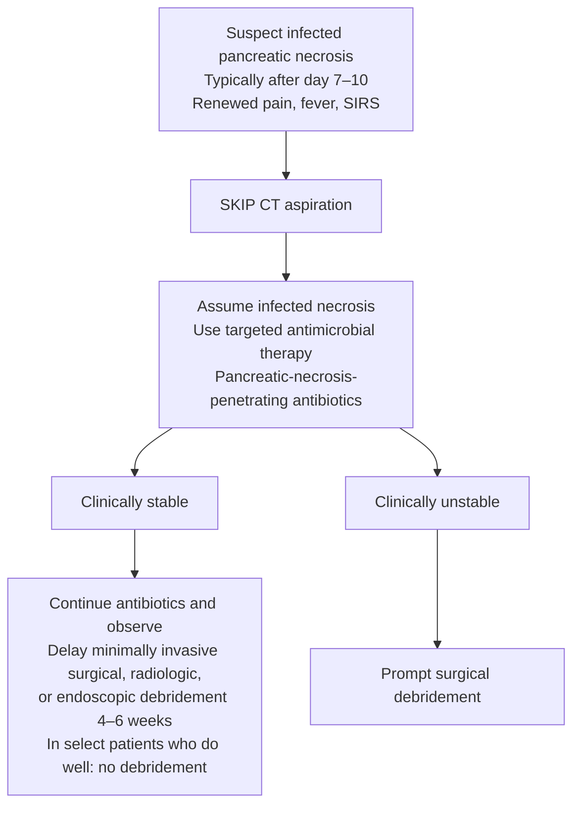

## Contents
- [[#Bibliographic Info]]
- [[#Summary]]
- [[#Key Findings / Claims]]
  - [[#Diagnosis]]
  - [[#Etiology]]
  - [[#Severity and definitions]]
  - [[#Initial assessment and risk stratification]]
  - [[#Fluid resuscitation]]
  - [[#ERCP in acute pancreatitis]]
  - [[#Preventing post-ERCP pancreatitis]]
  - [[#Antibiotics]]
  - [[#Nutrition]]
  - [[#Necrosis and surgery]]
- [[#Recommendations (Table 2)]]
- [[#Key Concepts (Table 3)]]
- [[#Relevance to Wiki]]
- [[#Contradictions / Open Questions]]

## Bibliographic Info

- **Article:** [Tenner S, Vege SS, Sheth SG, Sauer B, Yang A, Conwell DL, Yadlapati RH, Gardner TB. American College of Gastroenterology Guidelines: Management of Acute Pancreatitis. Am J Gastroenterol 2024;119(3):419–437.](https://doi.org/10.14309/ajg.0000000000002645)
- **Authors:** Scott Tenner, Santhi Swaroop Vege, Sunil G. Sheth, Bryan Sauer, Allison Yang, Darwin L. Conwell, Rena H. Yadlapati, Timothy B. Gardner
- **Year:** 2024 (received June 8, 2023; accepted December 8, 2023; published online November 7, 2023)
- **Journal/Publisher:** American Journal of Gastroenterology 2024;119:419–437
- **DOI:** [10.14309/ajg.0000000000002645](https://doi.org/10.14309/ajg.0000000000002645)
- **Type:** Guideline

## Summary

ACG guideline on the management of [[acute-pancreatitis|acute pancreatitis]] (AP), built on 16 PICO questions. It issues **11 GRADE-rated recommendations (Table 2)** and **23 key concepts (Table 3)**. Key concepts are statements not amenable to the GRADE process, or where evidence is limited, derived from extrapolation and expert opinion; they carry **no strength or evidence rating**.

Only **one** recommendation in the guideline is Strong: rectal indomethacin to prevent post-ERCP pancreatitis. The other ten are all Conditional, on low or very low quality evidence. Diagnosis, severity classification, and cholecystectomy timing are handled entirely through key concepts and narrative, not through graded recommendations.

The central management positions are moderately aggressive hydration with lactated Ringer solution early in the course, early oral feeding with a low-fat solid diet in mild AP, avoidance of prophylactic antibiotics and of CT-guided FNA, medical therapy over early [[ercp|ERCP]] in biliary AP without cholangitis, and delayed minimally invasive intervention for pancreatic necrosis.

The guideline is deliberately negative about severity prediction: it states that scoring systems and imaging alone are not accurate for determining which patients will develop moderately severe or severe AP, and that no single laboratory test is consistently accurate. It favours tracking a panel of clinical risk factors (Table 4) over any one score.

## Key Findings / Claims

### Diagnosis

- Diagnosis established by **2 of 3 criteria**: (i) abdominal pain consistent with the disease, (ii) serum amylase and/or lipase **greater than 3 times the upper limit of normal**, and/or (iii) characteristic findings on abdominal imaging.
- **Serum lipase is preferred.** Amylase alone cannot be used reliably (limitations in sensitivity and negative predictive value). Amylase rises within a few hours and returns to normal within 3–5 days; it may remain within the normal range on admission in as many as one-fifth of patients.
- The guideline notes an upper limit of normal **greater than 3–5 times** may be needed in some groups, e.g. patients with diabetes. Lipase is also elevated in nonpancreatic disease.
- Once AP is diagnosed, there is **no reason to follow** serum amylase or lipase — no relationship to severity, prognosis, or the decision to refeed or discharge.
- Contrast-enhanced CT provides **more than 90% sensitivity and specificity** for the diagnosis of AP. Routine CT is unwarranted; reserve it for patients failing to improve after **48–72 hours** (persistent pain, fever, nausea, unable to begin oral feeding), where CT or MRI is recommended to assess local complications.
- MRI advantages: contrast allergy and renal insufficiency (necrosis on nongadolinium T2-weighted images), and more accurate detection of stones in the common bile duct and pancreatic duct disruption. See [[mri-mrcp]].

### Etiology

| Etiology | Frequency / threshold as stated |
|---|---|
| Gallstones | 40%–70% |
| Alcohol | 25%–35% |
| Hypertriglyceridemia | 5% of all cases of AP; up to 56% of AP in pregnancy. Serum TG should rise **above 1,000 mg/dL** to be considered the cause |
| Pancreatobiliary tumor | 5%–14% of patients with benign or malignant pancreatobiliary tumors present with acute idiopathic pancreatitis; ~1% of AP due to pancreatic cancer |
| Pancreas divisum / SOD | Anatomic and physiologic anomalies occur in 10%–15% of the population |

- Risk of AP increases by **4% for every 100 mg/dL of TG** above the normal limit, even higher when TG levels are above 500 mg/dL. A lactescent serum has been observed in as many as 20% of patients with AP; a fasting TG should be re-evaluated **1 month after discharge**.
- "Heavy" alcohol consumption is generally considered to be greater than **50 g per day**, but is likely much higher; the diagnosis should not be entertained unless a person has consumed over **5 years** moderate or heavy alcohol. Clinically evident AP occurs in only up to 5% of heavy drinkers.
- **Idiopathic AP (IAP)** = pancreatitis with no etiology established after initial evaluation (including lipid and calcium levels) and imaging tests (transabdominal ultrasound and MRCP in the appropriate patient). [[endoscopic-ultrasound|EUS]] identifies the etiology in most patients with recurrent IAP; diagnostic [[ercp|ERCP]] should **not** be performed because of the increased risk of causing pancreatitis.
- Patients with IAP who have an abnormal LFT on the first day of their presentation may be more likely to benefit from cholecystectomy. A meta-analysis in IAP after extensive testing including EUS and ERCP found significantly fewer recurrences of AP after cholecystectomy, **11% vs 39%**.
- A recurrent attack is seen in approximately **20%–29%** of patients after an initial attack of AP.
- Endoscopic therapy focused on treating [[pancreas-divisum|pancreas divisum]] or [[sphincter-of-oddi-dysfunction|SOD]] carries a significant risk of precipitating AP and should be performed only in specialized units. The EPISOD trial ruled out the role of endoscopic sphincterotomy in SOD type 2 and SOD type 3.
- [[pancreatic-cancer|Pancreatic cancer]] should be suspected in any patient older than 40 years with idiopathic pancreatitis, especially with a prolonged or recurrent course.

### Severity and definitions

Defining criteria as given by the guideline (citing the 2012 revision of the classification of acute pancreatitis):

| Class | Defining criteria |
|---|---|
| **Severe AP** | **Persistent organ failure** (fails to resolve within 48 hours) and/or death |
| **Moderately severe AP** | **Transient organ failure** (resolves within 48 hours) and/or the development of **local complications** — acute pancreatic and/or peripancreatic fluid collections, acute necrotic collections, pseudocyst, or walled-off pancreatic necrosis |
| **Mild / interstitial** | In the absence of pancreatic necrosis and/or organ failure, the edematous pancreas is defined as **interstitial pancreatitis** |

**Organ failure** is defined in simple clinical terms as any of:

| Organ failure criterion | Threshold |
|---|---|
| Shock | Systolic blood pressure **less than 90 mm Hg** |
| Pulmonary insufficiency | PaO₂ **less than 60 mm Hg** |
| Renal failure | Creatinine **>2 mg/dL after rehydration** |
| Gastrointestinal bleeding | **>500 mL/24 hours** |
| — or — | **Modified Marshall score of 2 or more** in the 3 accepted organ systems |

- **Pancreatic necrosis** = diffuse or focal areas of nonviable pancreatic parenchyma **greater than 3 cm in size or greater than 30% of the pancreas**.
- Necrotizing pancreatitis comprises pure peripancreatic necrosis (~45%), pancreatic and peripancreatic necrosis (~45%), and rarely pure pancreatic necrosis (~5%).
- Moderately severe and severe AP constitute approximately **15%–25%** of all cases of AP. Almost a third of patients with AP will develop severe or moderately severe disease. Mortality in infected necrosis is a mean of 30% (range 14%–69%).
- Morphologically, necrotizing AP is usually synonymous with moderately severe and severe disease; interstitial pancreatitis is usually mild.

### Initial assessment and risk stratification

**Table 4 — Clinical findings associated with a severe course for initial risk assessment.** (Footnote: the presence of organ failure and/or pancreatic necrosis defines severe AP.)

| Domain | Findings |
|---|---|
| Patient characteristics | Age >55 · Obesity (BMI >30 kg/m²) · Altered mental status · Comorbid disease |
| SIRS — defined by the presence of **>2** of the following | Pulse >90 beats per minute · Respirations >20 per minute or PaCO₂ <32 mm Hg · Temperature >38 °C or <36 °C · WBC count >12,000 or <4,000 cells/mm³ or >10% immature neutrophils (bands) |
| Laboratory findings | BUN >20 · Rising BUN · HCT >44 · Rising HCT · Elevated creatinine |
| Radiology findings | Pleural effusions · Pulmonary infiltrates · Multiple or extensive extrapancreatic collections |

- Values reported to have significant predictive value for determining moderately severe and severe disease: elevated **HCT (≥44)**, **BUN (≥20 mg/dL)**, **C-reactive protein (≥150 mg/dL)**, and **creatinine (≥2 mg/dL)**.
- **The guideline does not endorse a scoring system.** Scoring systems and imaging alone are not accurate in determining which patients will develop moderately severe or severe AP; at best, 50% of cases predicted to be moderately severe or severe by any predicting system turn out to be such. Prediction for **mild** AP is highly reliable — only approximately **3%** progress to moderately severe or severe.
- Ranson, Imrie, and APACHE scoring systems are cumbersome and typically require 48 hours to become accurate. The Bedside Index for Severity Scoring System — which includes BUN and the presence of SIRS — has been consistently shown to be superior, but may be no more accurate than simply monitoring BUN and/or the development of SIRS. A score of **3 or more** has been used to prompt consideration of ICU treatment. The guideline does not print the component list or point values of any of these scores.
- CRP is not practical for early determination — it takes **48–72 hours** to become accurate in predicting necrosis and/or death.
- SIRS during the initial 24 hours has high sensitivity for predicting organ failure (85%) and mortality (100%), but lacks specificity for severe disease (41%).
- CT and/or MRI also cannot reliably determine severity early: necrosis usually is not present on admission and may develop after **24–48 hours**.

### Fluid resuscitation

- **Moderately aggressive** hydration with **isotonic crystalloid**; **lactated Ringer solution over normal saline** (Rec 3, Rec 4). Normal saline is more acidic (pH 5.5) and is associated with nonanion gap hyperchloremic metabolic acidosis and renal injury at large volumes.
- Rates and volumes as printed:

| Situation | Fluid as stated |
|---|---|
| No evidence of hypovolemia | Initial resuscitation rate of **no more than 1.5 mL/kg of body weight per hour** |
| Hypovolemia present | Administer a **bolus of 10 mL/kg** |
| Most patients, first 24 hours | Likely benefit from **3–4 L in the first 24 hours**, depending on body mass index |

- **Timing:** fluid resuscitation is likely more important early in the course (within the first 24 hours). Once a patient has severe disease there seems to be **no benefit** of early aggressive hydration; when severe disease develops and/or after 24 hours, aggressive hydration may actually be harmful.
- **Reassessment:** fluid volumes need to be reassessed at frequent intervals **within 6 hours of presentation and for the next 24–48 hours**, with a goal to decrease the BUN. The latest evaluation of HCT and BUN should be **6–8 hours after admission**; if an adjustment is to be made it must be determined within this time frame.
- Target physiology: a decrease in HCT (hemodilution) and/or decreased BUN (increased renal perfusion) have been associated with decreased morbidity and mortality. Do **not** allow BUN and HCT to rise within the first 24–48 hours, and do not let SIRS and/or renal insufficiency develop.
- **Caution** if a cardiovascular and/or renal comorbidity exists; monitor for volume overload. Watch for volume overload, pulmonary edema, and abdominal compartment syndrome. Recent data indicate the intrathoracic blood volume index may have a better correlation with cardiac index than central venous pressure.
- The guideline is **explicitly skeptical of "goal-directed" therapy**: a systematic review of RCTs found insufficient evidence that goal-directed therapy reduces persistent single or multiple organ failure, infected pancreatic necrosis, or mortality; another systematic review found scant high-quality evidence for the numerous goal-directed methods or combinations.

### ERCP in acute pancreatitis

- **Rec 5: medical therapy over early (within the first 72 hr) ERCP in acute biliary pancreatitis without cholangitis** (conditional, low quality).
- **With cholangitis:** early ERCP within the first 24 hours has been shown to decrease morbidity and mortality (Key concept 13) — see [[acute-cholangitis]].
- **In the absence of cholangitis and/or jaundice**, if a CBD stone is suspected, **MRCP or EUS should be used to screen** for the presence of CBD stones before the use of ERCP, and **diagnostic ERCP should be avoided** (Key concept 14). See [[choledocholithiasis]].
- Most gallstones readily pass to the duodenum and are lost in the stool; most patients with gallstone pancreatitis will not benefit from ERCP, including early ERCP.
- In the multicenter trial in gallstone pancreatitis with predicted severe AP (APACHE >8, Imrie >3, or CRP >150 mg/dL), early (within 24 hours) ERCP was not found to decrease complications including mortality. The authors concluded urgent ERCP is indicated in this situation only for cholangitis or progressive cholestasis defined by a rising bilirubin in the setting of severe or moderately severe AP (**bilirubin >3–5 mg/dL**).
- Risk of PEP is greater with a **normal caliber CBD and normal bilirubin (odds ratio 3.4)** than in a jaundiced patient with a dilated CBD (odds ratio 0.2).

### Preventing post-ERCP pancreatitis

- Incidence of AP after ERCP varies widely **1%–30%**.
- **Rec 6 (the only Strong recommendation in the guideline):** rectal indomethacin to prevent PEP in individuals considered to be at high risk. Multiple studies show a single dose of **100 mg** of rectal indomethacin before or immediately after ERCP will prevent PEP in patients at high risk; rectal indomethacin suppositories (100 mg) should be used in all patients undergoing ERCP, unless contraindicated.
- **Rec 7:** pancreatic duct stent in patients at high risk for PEP who are receiving rectal indomethacin. Prophylactic pancreatic duct stenting is cost-effective for high-risk patients; higher incidence of severe pancreatitis has been reported in patients with **failed** pancreatic duct stenting, with reported failure rate ranging from **4% to 10%**.
- Interventions shown to prevent PEP: (i) guidewire cannulation compared with contrast-guided cannulation, (ii) pancreatic duct stents in the appropriate patient, (iii) rectal indomethacin suppositories, and (iv) preprocedure intravenous hydration.
- Periprocedural lactated Ringer regimens described: 3 mL/kg/hr during the ERCP, a 20 mL/kg bolus after the procedure, followed by an 8-hour infusion at 3 mL/kg/hr.

### Antibiotics

- **Rec 8: against prophylactic antibiotics in patients with severe AP** (conditional, very low quality). 11 prospective randomized trials and 10 meta-analyses; all 3 placebo-controlled double-blind RCTs and 5 of the 9 meta-analyses published after 2006 did not support prophylaxis.
- **Rec 9: against fine-needle aspiration (FNA) in patients with suspected infected pancreatic necrosis** (conditional, very low quality). CT-FNA will not change management in many patients; antibiotics can be started for suspected infection on clinical grounds even without FNA, because a negative aspiration would still make the antibiotic use necessary due to clinical suspicion.
- Antibiotics **are** an important part of treatment in infected necrosis along with debridement/necrosectomy; they should not be used in sterile necrosis (Key concept 15).
- Infection is proven by blood or other body fluid cultures, or by **the presence of gas in the pancreatic necrosis**.
- Agents chosen must be known to penetrate the necrosis: **carbapenems, quinolones, cephalosporins, and metronidazole**.
- **Routine administration of antifungal agents** along with prophylactic or therapeutic antibiotics **is not needed** (Key concept 17).
- In infected necrosis, antibiotics should be used largely to **delay surgical, endoscopic, and radiologic drainage beyond 4 weeks**; some patients may avoid drainage altogether because the infection may completely resolve with antibiotics (Key concept 16).

### Nutrition

- **Rec 10:** in mild AP, early oral feeding **within 24–48 hours** as tolerated, over the traditional nothing-by-mouth approach (conditional, low quality).
- **Rec 11:** in mild AP, initial oral feeding with a **low-fat solid diet** rather than a stepwise liquid-to-solid approach (conditional, low quality). A low-fat solid diet has been found to be safe compared with clear liquids and provides more calories; oral feeding with a soft diet has been found safe and shortens hospital stay.
- For early feeding it is important to have bowel sounds present and no significant nausea, vomiting, or ileus. Desire for food, simple hunger, can help guide the decision on when to start feeding. Discharging a patient with persistent nausea despite early eating can result in readmission for recurrent AP.
- **Enteral nutrition** in moderately severe or severe AP seems to prevent infectious complications (Key concept 18). A meta-analysis of 8 RCTs (381 patients) found a decrease in infectious complications, organ failure, and mortality with enteral nutrition compared with TPN.
- **Parenteral nutrition should be avoided, unless the enteral route is not possible, not tolerated, or not meeting the caloric needs** (Key concept 19). The guideline does **not** attach a day count to this condition. See [[nutrition-in-hospitalized-patients]].
- **Nasogastric rather than nasojejunal** route is preferred for delivery of enteral feeding because of comparable safety and efficacy (Key concept 20). Nasojejunal tube placement requires interventional radiology or endoscopy and is expensive. Nasogastric patients should be placed more upright and on aspiration precautions; evaluating for residuals is not likely to be helpful.
- If enteral nutrition is administered by tube feeds, **continuous infusion is preferred over cyclic or bolus** administration. A small peptide-based medium-chain TG oil formula may improve tolerance.
- In **predicted severe** AP, more recent studies suggest that early (within the first 24 hours) initiation of enteral feeding is **not** beneficial — early enteral tube feeding within 24 hours did not reduce the rate of infection (25% vs 26%) or mortality (11% vs 7%) compared with on-demand feeding.

### Necrosis and surgery

- **Key concept 23: delay any intervention (surgical, radiological, and/or endoscopic) in stable patients with pancreatic necrosis, preferably 4 weeks**, to allow for the wall of collection to mature. Early in the course (within the first 7–10 days) necrosis is a diffuse solid and/or semisolid inflammatory mass; after 4 weeks a fibrous wall develops.
- **Key concept 22: minimally invasive methods are preferred to open surgery** for debridement and necrosectomy in stable patients with symptomatic pancreatic necrosis. The Dutch step-up approach (percutaneous catheter drainage followed by video-assisted retroperitoneal debridement) demonstrated lower morbidity (less multiple organ failure and surgical complications) and lower costs; mortality with open surgery was higher both as an emergency (78%) and planned (30%) compared with a minimally invasive approach.
- Percutaneous drainage without necrosectomy may be the most frequent minimally invasive method; overall success in avoiding surgery is approximately **50%**. In a recent well-designed randomized controlled clinical trial, endoscopic necrosectomy seems to be superior to surgical necrosectomy.
- Initial management of infected necrosis in the clinically stable should be a **2- to 4-week course of antibiotics** before surgery to allow the inflammatory reaction to become better organized. Postponing necrosectomy in stable patients with antibiotics until **30 days** after initial hospital admission is associated with decreased mortality; median time to surgery was **28 days** where necrosectomy for infected necrosis was delayed, and mortality decreased **22%**.
- Many patients with sterile necrosis, and select patients with infected necrosis, seem to improve and remain asymptomatic, and no intervention may be necessary. The concept that urgent surgery is required in all patients found to have infected necrosis is **no longer valid**.

**Figure 2 — late management of patients with AP** (pathway as given):

**Cholecystectomy:**

- **Key concept 21: patients with mild acute biliary pancreatitis should undergo cholecystectomy early, preferably before discharge.** Same-admission cholecystectomy decreases recurrent gallstone-related complications with a very low risk of cholecystectomy-related complications. Of 998 patients discharged rather than undergoing cholecystectomy, 95 (18%) were readmitted for recurrent biliary events (18% vs 0%, P < 0.0001), including recurrent biliary pancreatitis (n = 43, 8%).
- **In pancreatic necrosis complicating biliary pancreatitis**, cholecystectomy is typically **delayed to a later course in the typically prolonged hospitalization**, as part of the management of the pancreatic necrosis if present, and/or to a later date after discharge. The guideline does not specify an interval in weeks.
- **Key concept 4:** following a second episode of AP with no identifiable cause, in patients fit for surgery, perform a cholecystectomy to reduce the risk of recurrent episodes of AP. In a small randomized prospective trial in idiopathic pancreatitis, laparoscopic cholecystectomy was highly effective in preventing recurrent AP, with a **number needed to treat of 5**.
- In patients with mild AP whose bilirubin is normal, laparoscopic cholecystectomy with intraoperative cholangiography can be undertaken, with any remaining bile duct stones dealt with by postoperative or intraoperative ERCP. In patients with low to moderate risk, MRCP can be used preoperatively; however, routine use of MRCP is unnecessary.
- In patients with mild AP who **cannot undergo surgery** — older individuals and/or those with severe comorbid disease — **biliary sphincterotomy** has been shown to be effective to prevent recurrent biliary AP.

## Recommendations (Table 2)

The guideline issues exactly **11 numbered recommendations**, grouped as below. Statements outside this table are key concepts or narrative and carry **no GRADE rating**.

| # | Recommendation | Strength | Quality of evidence |
|---|---|---|---|
| **Etiology** | | | |
| 1 | We suggest transabdominal ultrasound in patients with AP to evaluate for biliary pancreatitis and a repeat ultrasound if the initial examination is inconclusive | Conditional | Very low |
| 2 | In patients with IAP, we suggest additional diagnostic evaluation with repeat abdominal ultrasound, MRI, and/or endoscopic ultrasound (EUS) | Conditional | Very low |
| **Initial management** | | | |
| 3 | We suggest moderately aggressive fluid resuscitation in patients with AP. Additional boluses will be needed if there is evidence of hypovolemia | Conditional | Low |
| 4 | We suggest using lactated Ringer solution over normal saline for intravenous resuscitation in AP | Conditional | Low |
| **ERCP in AP** | | | |
| 5 | We suggest medical therapy over early (within the first 72 hr) ERCP in acute biliary pancreatitis without cholangitis | Conditional | Low |
| **Preventing PEP** | | | |
| 6 | We recommend rectal indomethacin to prevent PEP in individuals considered to be at high risk of post-ERCP pancreatitis | **Strong** | **Moderate** |
| 7 | We suggest placement of a pancreatic duct stent in patients at high risk for PEP who are receiving rectal indomethacin | Conditional | Low |
| **The role of antibiotics in AP** | | | |
| 8 | We suggest against prophylactic antibiotics in patients with severe AP | Conditional | Very low |
| 9 | We suggest against fine-needle aspiration (FNA) in patients with suspected infected pancreatic necrosis | Conditional | Very low |
| **Nutrition in AP** | | | |
| 10 | In patients with mild AP, we suggest early oral feeding (within 24–48 hr) as tolerated by the patient compared with the traditional nothing-by-mouth approach | Conditional | Low |
| 11 | In patients with mild AP, we suggest initial oral feeding with low-fat solid diet rather than a stepwise liquid to solid approach | Conditional | Low |

## Key Concepts (Table 3)

Ungraded statements — not amenable to the GRADE process or limited by the available evidence; derived from extrapolation from the literature and expert opinion.

| # | Key concept |
|---|---|
| **Diagnosis** | |
| 1 | We suggest that early/at admission routine CT not be performed for the purpose of determining severity in AP and should be reserved for patients in whom the diagnosis is unclear or who fail to improve clinically within the first 48–72 hr after hospital admission |
| **Etiology** | |
| 2 | In the absence of gallstones and/or significant history of alcohol use, serum triglyceride should be obtained and considered the etiology, preferably if greater than 1,000 mg/dL |
| 3 | In patients older than 40 years in whom an etiology is not established, a pancreatic tumor should be considered as a possible cause of AP |
| 4 | Following a second episode of AP with no identifiable cause, in patients fit for surgery, we suggest performing a cholecystectomy to reduce the risk of recurrent episodes of AP |
| **Initial assessment and risk stratification** | |
| 5 | Hemodynamic status and risk assessment should be performed to stratify patients into higher-risk and lower-risk categories to assist consideration of admission to a nonmonitored bed or monitored bed setting, including the intensive care setting |
| 6 | Patients with organ failure and/or the SIRS should preferably be admitted to a monitored bed setting |
| 7 | Scoring systems and imaging alone are not accurate in determining which patients with AP will develop moderately severe or severe AP |
| 8 | In patients with mild disease, clinicians should remain vigilant for the development of severe disease and organ failure during the initial 48 hr from admission |
| 9 | Risk factors for the development of severe disease (Table 4) include elevated BUN, HCT, the presence of obesity, comorbidities, and the presence of SIRS |
| **Initial management** | |
| 10 | While we suggest all patients with AP receive moderately aggressive intravenous hydration of isotonic crystalloid, caution is needed if a cardiovascular and/or renal comorbidity exists. Patients should be monitored for volume overload |
| 11 | Fluid resuscitation in patients with AP is likely more important early in the course of the disease (within the first 24 hr) |
| 12 | Fluid volumes need to be reassessed at frequent intervals within 6 hr of presentation and for the next 24–48 hr with a goal to decrease the BUN |
| **ERCP in AP** | |
| 13 | In patients with AP complicated by cholangitis, early ERCP within the first 24 hr has been shown to decrease morbidity and mortality |
| 14 | In the absence of cholangitis and/or jaundice, if a common bile duct stone is suspected, MRCP or EUS should be used to screen for the presence of common bile duct stones before the use of ERCP, and diagnostic ERCP should be avoided |
| **The role of antibiotics in AP** | |
| 15 | While antibiotics should not be used in patients with sterile necrosis, antibiotics are an important part of treatment in infected necrosis along with debridement/necrosectomy |
| 16 | In patients with infected necrosis, antibiotics known to penetrate pancreatic necrosis should be used largely to delay surgical, endoscopic, and radiologic drainage beyond 4 wk. Some patients may avoid drainage altogether because the infection may completely resolve with antibiotics |
| 17 | Routine administration of antifungal agents along with prophylactic or therapeutic antibiotics is not needed |
| **Nutrition in AP** | |
| 18 | Enteral nutrition in patients with moderately severe or severe AP seems to prevent infectious complications |
| 19 | Parenteral nutrition should be avoided, unless the enteral route is not possible, not tolerated, or not meeting the caloric needs |
| 20 | Using a nasogastric rather than nasojejunal route for delivery of enteral feeding is preferred because of comparable safety and efficacy |
| **The role of surgery in AP** | |
| 21 | Patients with mild acute biliary pancreatitis should undergo cholecystectomy early, preferably before discharge |
| 22 | Minimally invasive methods are preferred to open surgery for debridement and necrosectomy in stable patients with symptomatic pancreatic necrosis |
| 23 | We suggest delaying any intervention (surgical, radiological, and/or endoscopic) in stable patients with pancreatic necrosis, preferably 4 wk, to allow for the wall of collection to mature |

## Relevance to Wiki

- Primary source for [[acute-pancreatitis]] — diagnosis, severity and organ-failure criteria, Table 4 risk factors, fluid rates, nutrition, antibiotics, necrosis intervention timing, cholecystectomy timing.
- [[ercp]] and post-ERCP pancreatitis prophylaxis — rectal indomethacin 100 mg, pancreatic duct stent, guidewire cannulation, periprocedural lactated Ringer.
- [[choledocholithiasis]] and [[acute-cholangitis]] — screening with MRCP or [[endoscopic-ultrasound|EUS]] before ERCP; ERCP within 24 hr only with cholangitis.
- [[pancreas-divisum]] and [[sphincter-of-oddi-dysfunction]] — EPISOD trial ruled out endoscopic sphincterotomy in SOD types 2 and 3.
- [[chronic-pancreatitis]] — failure to treat a biliary etiology is a common cause of recurrent AP and development of chronic pancreatitis.
- [[nutrition-in-hospitalized-patients]] — enteral over parenteral; nasogastric over nasojejunal.

## Contradictions / Open Questions

- **Prophylactic antibiotics in severe AP.** Earlier meta-analyses and one RCT reported benefit in mortality, infection of pancreatic necrosis, and extrapancreatic infections; all 3 placebo-controlled double-blind RCTs and 5 of the 9 meta-analyses published after 2006, and 2 of the recent guidelines (British Society of Gastroenterology and ACG), do not support prophylaxis. This guideline recommends against it.
- **Pancreatic duct stent plus rectal indomethacin.** A large-scale multicenter RCT showed patients receiving rectal indomethacin alone were less likely to develop PEP than patients receiving indomethacin plus a pancreatic duct stent; a well-designed NIH-sponsored multicenter trial (20 centers, USA and Canada, 1,950 patients) recently showed the opposite result. The guideline sides with the latter and calls for a case-by-case approach, noting the difficulty of placing a pancreatic duct stent in all high-risk patients outside tertiary centers.
- **CT-FNA in suspected infected necrosis.** The technique is safe, effective, and accurate in distinguishing infected from sterile necrosis, but the guideline recommends against it because it will not change management in many patients.
- **Goal-directed hydration.** Other experts and guidelines advocate the term; this guideline finds insufficient evidence that goal-directed therapy improves outcomes, and notes clinicians often miss the goal, failing to provide adequate hydration during the initial 24 hours.
- **Timing of enteral feeding in predicted severe AP** remains controversial; more recent studies suggest early (within the first 24 hours) initiation is not beneficial.
- **Cholecystectomy timing after AP complicated by pancreatic necrosis** is not given a numeric interval — only "a later course in the typically prolonged hospitalization" and/or after discharge.
- **Prediction of severity** — the guideline declines to endorse any scoring system and does not print the components or cut-points of Ranson, Imrie, APACHE-II, the Bedside Index for Severity Scoring System, or any CT severity index.

## See Also

[[acute-pancreatitis]], [[chronic-pancreatitis]], [[choledocholithiasis]], [[acute-cholangitis]], [[pancreas-divisum]], [[sphincter-of-oddi-dysfunction]], [[pancreatic-cancer]], [[ercp]], [[endoscopic-ultrasound]], [[mri-mrcp]], [[nutrition-in-hospitalized-patients]]

---

## Sources

1. [[acg-2024-acute-pancreatitis|American College of Gastroenterology Guidelines: Management of Acute Pancreatitis (2024)]]
