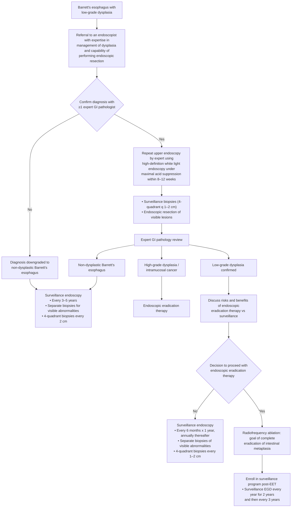

# AGA 2016 Clinical Practice Update: Diagnosis and Management of Low-Grade Dysplasia in Barrett's Esophagus (Expert Review)

## Bibliographic Info

- **Article:** [Wani S, Rubenstein JH, Vieth M, Bergman J. Diagnosis and Management of Low-Grade Dysplasia in Barrett's Esophagus: Expert Review From the Clinical Practice Updates Committee of the American Gastroenterological Association. Gastroenterology 2016;151(5):822–835.](https://doi.org/10.1053/j.gastro.2016.09.040)
- **Authors:** Sachin Wani (University of Colorado, Anschutz Medical Campus); Joel H. Rubenstein (VA Center for Clinical Management Research / University of Michigan); Michael Vieth (Klinikum Bayreuth, Germany); Jacques Bergman (Academic Medical Center, Amsterdam)
- **Year:** 2016 (November 2016 issue)
- **Journal/Publisher:** Gastroenterology 2016;151:822–835 — AGA Institute
- **DOI:** [10.1053/j.gastro.2016.09.040](https://doi.org/10.1053/j.gastro.2016.09.040)
- **Type:** Guideline — AGA Institute **Clinical Practice Update (Expert Review)**, 16 numbered *Practice Advice* statements. **Tier 1.**

> **Grading: none.** The document attaches no GRADE rating, no strength-of-recommendation label, and no evidence-quality label to any of its 16 Practice Advice statements. **Methods, verbatim:** "The best practices outlined in this review are based on relevant publications, including systematic reviews and expert opinion (when applicable)." And: "A formal systematic review for all relevant aspects regarding diagnosis and management of LGD was not performed with the exception of natural history of LGD (Tables 1 and 2) and predictors for progression to HGD and EAC (Table 3). A panel of experts was convened to create a document that highlights the current controversies in LGD, provides practice advice based on the best available evidence, including systematic reviews and recent guidelines, and provides a framework for future research in this field."

**Scope note, verbatim:** "The discussion around presence or absence of intestinal metaplasia is not part of this publication."

---

## Contents
- [[#Practice Advice (Complete, Verbatim — 16 Statements, Ungraded)]]
- [[#Figure 1 — Algorithmic Approach to Barrett's Esophagus With Low-Grade Dysplasia]]
- [[#Table 2 — Progression Rates Before vs After Expert Pathology Review]]
- [[#Table 3 — Predictors of Progression to HGD/EAC in BE With LGD]]
- [[#Quality Indicators for LGD and EET]]
- [[#Summary]]
- [[#Key Findings / Claims]]
- [[#Relevance to Wiki]]
- [[#Contradictions / Open Questions]]
- [[#See Also]]

---

## Practice Advice (Complete, Verbatim — 16 Statements, Ungraded)

1. The extent of Barrett's esophagus should be defined using a standardized grading system documenting the circumferential and maximal extent of the columnar lined esophagus (Prague classification) with a clear description of landmarks and visible lesions (nodularity, ulceration) when present.
2. Given the significant interobserver variability among pathologists, the diagnosis of Barrett's esophagus with LGD should be confirmed by an expert gastrointestinal pathologist (defined as a pathologist with a special interest in Barrett's esophagus–related neoplasia who is recognized as an expert in this field by his/her peers).
3. Expert pathologists should report audits of their diagnosed cases of LGD, such as the frequency of LGD diagnosed among surveillance patients and/or the difference in incidence of neoplastic progression among patients diagnosed with LGD vs nondysplastic Barrett's esophagus.
4. Patients in whom the diagnosis of LGD is downgraded to nondysplastic Barrett's esophagus should be managed as nondysplastic Barrett's esophagus.
5. In Barrett's esophagus patients with confirmed LGD (based on expert gastrointestinal pathology review), repeat upper endoscopy using high-definition/high-resolution white-light endoscopy should be performed under maximal acid suppression (twice daily dosing of proton pump inhibitor therapy) in 8–12 weeks.
6. Under ideal circumstances, surveillance biopsies should not be performed in the presence of active inflammation (erosive esophagitis, Los Angeles grade C and D). Pathologists should be informed if biopsies are obtained in the setting of erosive esophagitis and if pathology findings suggest LGD, or if no biopsies are obtained, surveillance biopsies should be repeated after the antireflux regimen has been further intensified.
7. Surveillance biopsies should be performed in a four-quadrant fashion every 1–2 cm with target biopsies obtained from visible lesions taken first.
8. Patients with a confirmed histologic diagnosis of LGD should be referred to an endoscopist with expertise in managing Barrett's esophagus–related neoplasia practicing at centers equipped with high-definition endoscopy and capable of performing endoscopic resection and ablation.
9. Endoscopic resection should be performed in Barrett's esophagus patients with LGD with endoscopically visible abnormalities (no matter how subtle) in order to accurately assess the grade of dysplasia.
10. In patients with confirmed Barrett's esophagus with LGD by expert GI pathology review that persists on a second endoscopy, despite intensification of acid-suppressive therapy, risks and benefits of management options of endoscopic eradication therapy (specifically adverse events associated with endoscopic resection and ablation), and ongoing surveillance should be discussed and documented.
11. Endoscopic eradication therapy should be considered in patients with confirmed and persistent LGD with the goal of achieving complete eradication of intestinal metaplasia.
12. Patients with LGD undergoing surveillance rather than endoscopic eradication therapy should undergo surveillance every 6 months times 2, then annually unless there is reversion to nondysplastic Barrett's esophagus. Biopsies should be obtained in 4-quadrants every 1–2 cm and of any visible lesions.
13. In patients with Barrett's esophagus–related LGD undergoing ablative therapy, radiofrequency ablation should be used.
14. Patients completing endoscopic eradication therapy should be enrolled in an endoscopic surveillance program. Patients who have achieved complete eradication of intestinal metaplasia should undergo surveillance every year for 2 years and then every 3 years thereafter to detect recurrent intestinal metaplasia and dysplasia. Patients who have not achieved complete eradication of intestinal metaplasia should undergo surveillance every 6 months for 1 year after the last endoscopy, then annually for 2 years, then every 3 years thereafter.
15. Following endoscopic eradication therapy, the biopsy protocol of obtaining biopsies in 4 quadrants every 2 cm throughout the length of the original Barrett's esophagus segment and any visible columnar mucosa is suggested.
16. Endoscopists performing endoscopic eradication therapy should report audits of their rates of complete eradication of dysplasia and intestinal metaplasia and adverse events in clinical practice.

---

## Figure 1 — Algorithmic Approach to Barrett's Esophagus With Low-Grade Dysplasia

The source presents its management pathway as a decision figure (Figure 1, p. 830). Recreated here with the source's own decision points and intervals:

---

## Table 2 — Progression Rates Before vs After Expert Pathology Review

*Verbatim from the source (Table 2: "Studies Highlighting the Difference in Progression Rates Among Barrett's Esophagus Patients With Low-Grade Dysplasia After Expert Pathology Review").*

| Author | Year | Country | Study design | N BE-LGD | % of BE initially diagnosed as LGD | % of LGD confirmed | Progression to HGD/EAC with expert downgrading | Progression to HGD/EAC with expert confirmation of LGD |
|---|---|---|---|---|---|---|---|---|
| Curvers | 2010 | Netherlands | Multicenter | 122 | 10.2% | 18.0% | 4.9 per 1000 p-y (95% CI 0, 13) | 134 per 1000 py (95% CI 35, 232) |
| Duits | 2015 | Netherlands | Single Center | 293 | — | 27.0% | 6 per 1000 p-y (95% CI 2, 13) | 91 per 1000 p-y (95% CI 58, 136) |
| Lim | 2007 | UK | Single Center | 34 | 9.5% | 41.2% | 21% (4/19) | 28% (4/14) |
| Wani | 2011 | US | Multicenter | 210 | 9.3% | 46.5% | 9.4 per 1000 p-y | 8.4 per 1000 p-y |
| Skacel | 2000 | US | Single Center | 25 | — | 68.0% | 0% (0/8) | 80 per 1000 p-y if 2 agreed; 456 per 1000 p-y if 3 agreed |

**Table 1 note (verbatim):** "Sorted by incidence. Incidence correlates roughly with whether there was a 2nd pathologist review, but even among those with review, the incidence varies by an order of magnitude."

---

## Table 3 — Predictors of Progression to HGD/EAC in BE With LGD

*Verbatim from the source (Table 3). "NS" = not significant; positive association unless marked NS.*

| Author | Year | Country | Study type | Dx LGD confirmed by "expert" | N BE-LGD | Predictors |
|---|---|---|---|---|---|---|
| Younes | 1997 | US | Single Center | NR | 25 | p53 IHC |
| Reid | 2000 | US | Single Center | NR | 43 | abnormal DNA ploidy |
| Weston | 2001 | US | Single Center | Yes | 48 | p53 IHC |
| Skacel | 2002 | US | Single Center | Yes | 16 | p53 IHC |
| Weston | 2004 | US | Single Center | Yes | 58 | length of BE |
| Srivastava | 2007 | US | Single Center | Yes | 31 | Proportion of crypts with LGD; Multifocal LGD – NS |
| Hvid-Jensen | 2011 | Denmark | Population | No | 621 | Prevalent LGD – NS |
| Wani | 2011 | US | Multicenter | Partial | 210 | Multifocal LGD – NS; Persistent LGD – NS; Prevalent LGD – NS |
| Bird-Lieberman | 2012 | Northern Ireland | Population | Yes | 25 | Abnormal DNA ploidy; aspergillus oryzae lectin; p53 IHC – NS |
| Kastelein | 2013 | Netherlands | Multicenter | Yes | 223 | p53 IHC |
| Singh | 2014 | Multiple | Systematic Review | Partial | 2694 | Multifocal LGD – NS; Prevalent LGD – NS; BE Length – NS; Europe vs North America – NS |
| Thota | 2015 | US | Single Center | Partial | 299 | Multifocal LGD; LGD prevalent at diagnosis of BE; Male sex; Nodularity |
| Duits | 2016 | Netherlands | Multicenter | Yes | 255 | Persistent LGD |
| Kestens | 2016 | Netherlands | Population | No | 1579 | Persistent LGD; Multifocal LGD – NS; Age – NS; Length of BE – NS |
| Tavakkoli | 2016 | US | Single Center | Partial | 202 | Persistent LGD; LGD prevalent at diagnosis of BE; Male sex; Outside hospital referral; Year of LGD diagnosis |

**The source's own bottom line, verbatim:** "Aside from expert pathologist confirmation of LGD and persistent LGD, no other factor appears to be reproducibly associated with progression."

---

## Quality Indicators for LGD and EET

The source lists 7 quality indicators "pertinent to this document" (verbatim):

1. Dysplasia diagnosis is confirmed by an expert GI pathologist
2. Centers performing endoscopic eradication therapy should have high-definition white light endoscopy
3. Endoscopists that perform mucosal ablation and ER
4. Complete endoscopic resection is performed in patients with visible lesions
5. Rate at which CE-IM and CE-D is achieved by 18 months after embarking on endoscopic eradication therapy
6. Surveillance occurs after achieving CE-IM
7. Adverse events are tracked and documented

**Training / competence data cited:**

- Increasing experience of endoscopists and centers (threshold of **30**) was associated with a lower number of treatment sessions required to achieve CE-IM; no significant association between case volume and safety or efficacy outcomes.
- An "unacceptably high rate of perforation of **5%** in the first 120 esophageal endoscopic resections performed by 6 participants," despite an intense structured training program — suggesting **20 procedures are insufficient** to achieve competency in esophageal endoscopic resection.
- Audit results "should be readily available to endoscopists, such as posted online and/or accompanying a pathology report of LGD."

---

## Summary

This Clinical Practice Update addresses the single most consequential problem in Barrett's LGD: the diagnosis itself is unreliable, and almost every management decision downstream depends on getting it right. Histologic LGD has fair-to-slight interobserver agreement (κ = 0.32 for LGD, κ = 0.15 for indefinite for dysplasia; κ = 0.14 between two expert central GI pathologists in one multicenter cohort), and 73–75% of community LGD diagnoses are downgraded to nondysplastic BE or indefinite for dysplasia on expert panel review. Because reported progression rates in LGD span 0.4%–13.4% per year across cohorts, the update's organizing claim is that this spread is driven largely by diagnostic overcall rather than by biology.

Expert confirmation therefore functions as the risk stratifier. Confirmed LGD progressed to HGD/EAC at 9.1% per year vs 0.6% in downgraded cases (Duits); 13.4% vs 0.49% (Curvers). The number of pathologists concurring compounds this (OR 47.14, 95% CI 13.1–169.7 when all 3 agreed). A confirmed diagnosis mandates repeat high-definition endoscopy under maximal acid suppression (twice-daily PPI) within 8–12 weeks, with endoscopic resection of any visible abnormality "no matter how subtle," since resection changes the histopathologic diagnosis in ~30% of patients with early neoplasia and yields better interobserver agreement than biopsy (κ = 0.33 vs 0.22).

For management, the update declines to declare a winner between ablation and surveillance, instead framing it as a documented shared decision. Endoscopic eradication therapy "should be considered" in confirmed **and persistent** LGD, with CE-IM as the goal and radiofrequency ablation as the modality if ablating. Surveillance remains defensible: it must run every 6 months × 2 then annually, with 4-quadrant biopsies every 1–2 cm, and it detects progression at a stage still amenable to endoscopic treatment. Post-EET, surveillance is stratified by whether CE-IM was achieved — a distinction not carried forward in later guidelines.

Finally, the update is unusually explicit about **audit as a practice obligation**: expert pathologists should audit and publish their LGD diagnosis rates and progression differentials, and endoscopists performing EET should audit their CE-D/CE-IM and adverse-event rates. It pairs this with seven named quality indicators and with data suggesting that 20 procedures are insufficient for competency in esophageal endoscopic resection.

---

## Key Findings / Claims

**Diagnostic reliability**
- Interobserver agreement: LGD κ = 0.32 (fair); indefinite for dysplasia κ = 0.15 (slight); between 2 expert central GI pathologists for LGD κ = 0.14 (slight).
- Endoscopic resection specimens give better agreement than biopsies (κ = 0.33 vs 0.22; P < .001); ER changed the diagnosis in **30%** of BE patients with early neoplasia.
- 75% of community-hospital LGD (147 patients, 6 hospitals) downgraded to nondysplastic BE on 2-expert review; 73% of 293 Amsterdam LGD cases downgraded to nondysplastic BE or indefinite for dysplasia.
- 15%–40% of BE patients are diagnosed with LGD at some point during follow-up.
- **p53 IHC:** aberrant staining had **71% sensitivity / 68% specificity** for neoplastic progression in the largest study; the role of adding p53 IHC to routine histologic assessment "needs further clarification."
- Histologic features of LGD (verbatim): crypts with relative preservation of glandular architecture; epithelial cell nuclei oval or elongated, generally retaining polarity or with mild loss of polarity; nuclei elongated, slightly enlarged, hyperchromatic, with mild irregularity of nuclear membrane contour; nuclear stratification present, nuclei usually occupying the lower half of the epithelium with absence of full-thickness stratification; mucin depletion, decreased goblet cells, increased mitotic figures; **loss of surface maturation** such that cytologic atypia extends from the deeper glands to the surface epithelium. Changes resembling LGD can be seen in regenerating epithelium — overdiagnosis should be avoided.

**Natural history and progression**
- Pooled annual incidence (systematic review, 24 studies, 2694 LGD patients): **1.73%** (95% CI 0.99–2.47) for HGD/EAC combined; **0.54%** (95% CI 0.32–0.76) for EAC — with substantial heterogeneity.
- Reported progression rates across cohorts range **0.4%–13.4% per year**.
- Confirmed vs downgraded LGD: 9.1%/yr vs 0.6%/yr (Duits); 13.4%/yr vs 0.49%/yr (Curvers).
- Dutch study: confirmed LGD incidence rate 5.18 per 100 person-years (95% CI 3.63–7.19) vs 1.85 (95% CI 1.52–2.22) without confirmation; P < .001.
- Number of concurring pathologists: OR **47.14** (95% CI 13.1–169.7) when all 3 agreed; OR range 4.48–11.33 for individual pathologists.
- **Persistent LGD** (LGD on 2 consecutive endoscopies) was the only independent risk factor for HGD/EAC in one Dutch cohort (HR 3.5, 95% CI 1.48–8.28); OR 7.25 (95% CI 1.28–41.1) in another.
- Nodularity HR 3.12 (95% CI 1.18–8.25) and multifocal dysplasia (dysplasia on ≥2 specimens from different locations in the BE segment on the same endoscopy) HR 3.09 (95% CI 1.49–6.41) were independent predictors in a multicenter US study; shorter BE length, active smoking, and PPI use were associated with regression.
- Prevalent LGD HR 2.9 (95% CI 1.6–5.2) in one single-center study; OR 7.57 (95% CI 1.9–30.2) in another; index biopsy of LGD vs indefinite for dysplasia HR 2.8 (95% CI 1.01–8.1).
- Increasing BMI was **inversely** associated with progression (OR per 5 kg/m² increment 0.52; 95% CI 0.28–0.94). Unifocal LGD was associated with regression.
- A **LGD/BE ratio <0.15** (proportion of BE patients diagnosed with LGD in a practice) was associated with a higher rate of progression to EAC than a ratio >0.15 (**0.76%/yr vs 0.32%/yr**) — the threshold itself "has not been defined," but experts believe it should be <0.05.
- Missed EAC (EAC diagnosed within 1 year of initial endoscopy) rate **25.3%** (95% CI 16.4–36.8) in cohorts of nondysplastic BE and BE with LGD.

**Endoscopic evaluation**
- Post-hoc analysis of 2 RCTs: the **proximal half** of the BE segment is almost twice as likely to demonstrate dysplasia as the distal-most quartile.
- NBI vs HD-WLE randomized crossover: comparable detection of intestinal metaplasia and early neoplasia with **fewer biopsies** in the NBI arm.
- Advanced imaging (optical chromoendoscopy and chromoendoscopy) increased dysplasia or cancer detection by **34%** (95% CI 20%–56%; P < .0001) — but no standardized classification system including LGD exists.
- Confocal laser endomicroscopy, autofluorescence, optical frequency domain imaging, spectroscopy, and high-resolution microendoscopy "cannot be recommended in the routine clinical management of these patients."

**Treatment**
- **AIM Dysplasia RCT** (127 patients, 2:1 RFA vs sham; 64 with LGD): at 12 months, complete eradication of LGD 90% (RFA) vs 23% (sham); CE-IM 81% vs 4% (P < .001). At 2 years, CE-D 51/52 (98%) and CE-IM 51/52 (98%). Among LGD subjects, annual progression to EAC 0.51%/patient-year and overall disease progression 2.04%/patient-year.
- **SURF RCT** (136 patients, confirmed LGD, qualifying endoscopy within 6 months): ablation every 3 months to a maximum of 2 circumferential and 3 focal sessions. Progression to HGD/EAC 1.5% (RFA) vs 26.5% (surveillance), P < .001 → **absolute risk reduction 25% (95% CI 14.1–35.9), NNT 4**; EAC 1.5% vs 8.8%, P = .03 → **ARR 7.4% (95% CI 0–14.7), NNT 13.6**. Treatment-related adverse events 19.1%, strictures most common.
- Multicenter retrospective: progression LGD→HGD/EAC 0.77% (RFA) vs 6.6% (surveillance); adjusted HR 0.06 (95% CI 0.008–0.48), NNT 3.
- Large RFA cohort (4982 patients, 20% LGD): 2% developed EAC (7.8/1000 person-years); 0.2% died of EAC (0.7/1000 person-years); all-cause mortality 11.2/1000 person-years (cardiovascular disease and extra-esophageal cancers the most common causes). Among the 1020 LGD patients, EAC incidence 4.3/1000 person-years. On multivariate analysis, BE length (OR 1.2/cm; 95% CI 1.1–1.2) and baseline histologic grade (LGD OR 5.9, 95% CI 1.6–21.5; HGD OR 48.4, 95% CI 14.9–157) predicted incident EAC. **Achieving CE-IM was protective (OR 0.4; 95% CI 0.3–0.6).**
- Pooled adverse events with RFA ± endoscopic resection: **8.8%** (95% CI 6.5–11.9), stricture rate **5.6%** (95% CI 4.2–7.4).
- Cost-effectiveness: RFA "might be cost-effective for confirmed (agreement between more than one expert pathologist) and persistent (LGD found on more than one endoscopy spaced at least 6 months apart) LGD compared with surveillance with RFA when HGD is detected" — **ICER $18,231 per quality-adjusted life-year**.
- CE-IM, not CE-D, is the goal: "achieving complete eradication of dysplasia is not sufficient, given the risk of metachronous neoplasia."

**Post-EET recurrence**
- Pooled incidence of **any** recurrence **7.3 per 100 patient-years** (95% CI 5.9–8.8); intestinal metaplasia recurrence **4.7 per 100 patient-years** (95% CI 3.6–5.8); dysplasia recurrence **1.7 per 100 patient-years** (95% CI 1.2–2.2).
- The vast majority of recurrences are amenable to repeat endoscopic eradication therapy.
- "Given the risk of recurrence several years after CE-IM, discontinuation of surveillance after negative surveillance endoscopies cannot be recommended."

---

## Relevance to Wiki

- **[[barretts-esophagus]]** — adds the LGD-specific decision content this CPU owns: manage downgraded LGD as NDBE; do not take surveillance biopsies during active erosive esophagitis (LA grade C/D) and inform the pathologist if they are taken anyway; the LGD/BE-ratio and audit concept; the surveillance-vs-EET conversation must be **documented**; persistent LGD as the progression discriminator.
- **[[endoscopic-eradication-therapy]]** — adds the quality-indicator set, the audit obligation, the competence/volume data (threshold of 30; 20 procedures insufficient; 5% perforation in the first 120 esophageal ERs), and the post-EET surveillance schedule **for patients who never achieved CE-IM** (a scenario later guidelines do not schedule).
- **[[radiofrequency-ablation]]** — Practice Advice 13 names RFA as the ablative modality for LGD; AIM Dysplasia 2-year durability (98% CE-D, 98% CE-IM) and the SURF ablation protocol (q3 months, max 2 circumferential + 3 focal sessions).
- **[[esophageal-adenocarcinoma]]** — the 25.3% missed-EAC rate within 1 year of index endoscopy in NDBE/LGD cohorts.
- Supersedes nothing currently on the wiki; it is the oldest Barrett's source ingested and is outranked on every overlapping claim by [[acg-2022-barretts|ACG 2022]], [[aga-2024-barretts-eet|AGA 2024]], and [[aga-2025-barretts-surveillance|AGA 2025]].

---

## Contradictions / Open Questions

**Newer guidelines govern each of the following; the 2016 position is recorded here only.**

| Question | AGA 2016 CPU | Newer source (governs) |
|---|---|---|
| Timing of the confirmatory endoscopy after confirmed LGD | **8–12 weeks**, on twice-daily PPI | [[aga-2020-endoscopic-treatment-barretts-dysplasia\|AGA 2020 CPU]]: within **3–6 months**. [[aga-2025-barretts-surveillance\|AGA 2025]]: by an expert endoscopist **within 6 months** on high-dose acid suppression |
| Post-EET surveillance after CE-IM, baseline LGD | Every year for 2 years, then **every 3 years** thereafter | [[aga-2024-barretts-eet\|AGA 2024]] / AGA 2020 CPU: **1 year and 3 years**, then revert to NDBE intervals. [[acg-2022-barretts\|ACG 2022]]: every 2 years thereafter |
| Post-EET biopsy protocol | 4-quadrant every **2 cm throughout the length of the original BE segment** and any visible columnar mucosa | ACG 2022 / AGA 2025: 4-quadrant from the **high cardia just below the Z line** plus the **distal 2–3 cm** of neosquamous epithelium (separate containers); random biopsies above that range have very low additional yield |
| Patients who never achieve CE-IM | Explicit schedule — every 6 months for 1 year after the last endoscopy, then annually for 2 years, then every 3 years | No newer ingested guideline schedules this group; the 2016 advice is the only ingested guidance for it |
| Surveillance interval for downgraded (nondysplastic) BE | Figure 1: every **3–5 years** | AGA 2025: **every 3 years**, extendable to 5 years in lower-risk (short-segment) patients |

**Open questions raised by the source itself:**
- No validated criteria for *how* an expert pathologist should make an LGD diagnosis, or how consensus should be reached — "providing practice advice on detailed criteria for making a diagnosis of LGD or of how consensus diagnosis should be reached is not a part of this document."
- The LGD/BE-ratio threshold "has not been defined"; experts *believe* it should be <0.05 — that figure is belief, not data.
- No biomarker (p53, DNA ploidy, p16, methylation, the 90-gene expression panel) is "widely available and ready for application in clinical practice"; all require validation in large prospective multicenter studies.
- Whether the definition of BE requires intestinal metaplasia is explicitly outside this document's scope.
- Quality indicators for EET "are lacking"; feasibility, case-mix variability, implementation cost, and unintended consequences remain unaddressed.

---

## See Also

[[barretts-esophagus]], [[esophageal-adenocarcinoma]], [[endoscopic-eradication-therapy]], [[radiofrequency-ablation]], [[endoscopic-mucosal-resection]], [[upper-endoscopy]], [[gerd]], [[proton-pump-inhibitors]]
