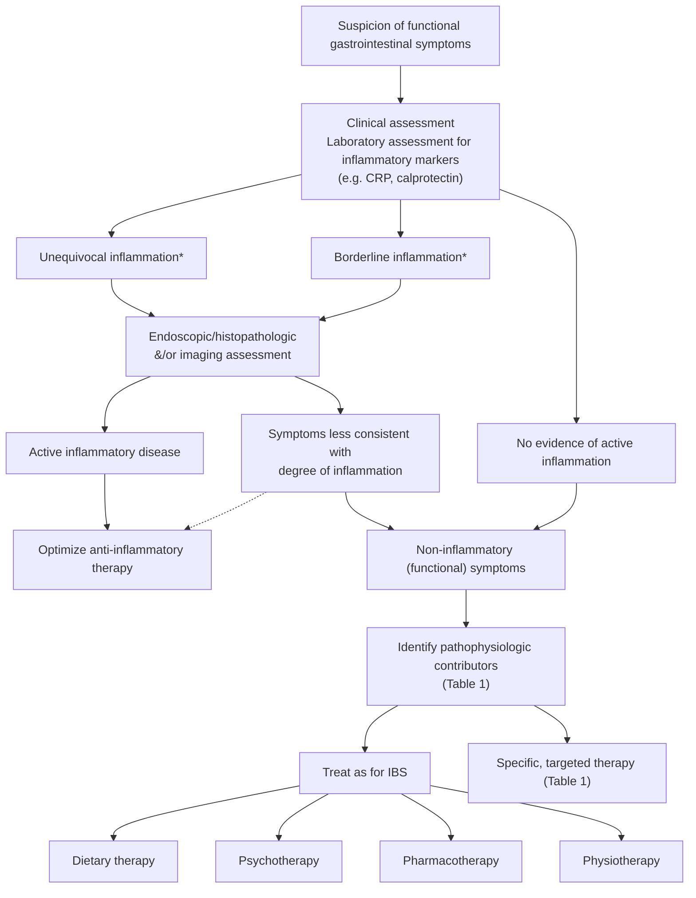

# AGA 2018 Clinical Practice Update on Functional Gastrointestinal Symptoms in Patients With Inflammatory Bowel Disease

## Bibliographic Info

- **Article:** [Colombel JF, Shin A, Gibson PR. AGA Clinical Practice Update on Functional Gastrointestinal Symptoms in Patients With Inflammatory Bowel Disease: Expert Review. *Clinical Gastroenterology and Hepatology* 2019;17(3):380–390. doi:10.1016/j.cgh.2018.08.001.](https://doi.org/10.1016/j.cgh.2018.08.001)
- **Authors:** Jean-Frederic Colombel (Icahn School of Medicine at Mount Sinai), Andrea Shin (Indiana University School of Medicine), Peter R. Gibson (Monash University and Alfred Hospital, Melbourne)
- **Year:** 2018 (DOI assigned 2018; published in the February 2019 issue, *Clin Gastroenterol Hepatol* Vol 17, No 3, pp 380–390; © 2019 AGA Institute)
- **Journal/Publisher:** *Clinical Gastroenterology and Hepatology* — AGA Institute Clinical Practice Update
- **DOI:** [10.1016/j.cgh.2018.08.001](https://doi.org/10.1016/j.cgh.2018.08.001)
- **Type:** AGA Institute Clinical Practice Update — **Expert Review**
- **Numbering and grading:** The document **numbers its statements** — 14 statements labelled *Best practice advice 1* through *Best practice advice 14*. It assigns **no GRADE ratings, no strength of recommendation, and no quality-of-evidence ratings** to any of them. Stated method: *"The evidence and best practices summarized in this manuscript are based on relevant scientific publications, systematic reviews, and expert opinion where applicable."*

---

## Summary

Functional GI symptoms and IBD overlap constantly, and the Update's central problem is that symptoms do not track inflammation in either direction. Pooled IBS prevalence across IBD patients is **39% (95% CI 30%–48%)**, with an **odds ratio of 4.89 (95% CI 3.43–6.98)** vs control subjects and a higher frequency in Crohn's disease than ulcerative colitis (**46% vs 36%; OR 1.62, 95% CI 1.21–2.18**). In the other direction, endoscopic healing does not guarantee symptom resolution: only **29% and 41%** of UC patients who reached a **Mayo endoscopy subscore of 0** reported normal stool frequency at **8 and 52 weeks**, and up to **27%** of UC patients with *both* endoscopic and histologic healing may still have increased stool frequency. The clinical stake is overtreatment — escalating anti-inflammatory therapy for symptoms driven by functional pathophysiology adds adverse-event risk with no symptomatic benefit.

The diagnostic approach is stepwise (Figure 1): detailed symptom history and physical/rectal exam, then objective assessment for inflammation with **CRP and fecal calprotectin**, then endoscopy with biopsy and/or cross-sectional imaging when markers are unequivocal or borderline. The Update is explicit that noninvasive biomarkers are imperfect — **up to 15% of patients fail to mount a CRP response**, and fecal calprotectin cutoffs remain contested (see thresholds below). Where symptoms are out of proportion to demonstrated inflammation, alternative *acquired* pathophysiologic mechanisms are worked up before the symptoms are called functional: bile acid diarrhea, SIBO, pancreatic exocrine insufficiency, carbohydrate (lactose/fructose) malabsorption, fecal stasis proximal to distal colitis, intestinal stenosis, pelvic floor dyssynergia, and coexisting celiac disease (Table 1).

Treatment is largely borrowed from IBS and other disorders of gut–brain interaction, because there is "a paucity of randomized controlled trials or even prospective studies" of therapy for functional GI symptoms in IBD (Table 2). The Update endorses a **low FODMAP diet** with attention to nutritional adequacy, **psychological therapies** (CBT, gut-directed hypnotherapy, mindfulness), **osmotic and stimulant laxatives** for chronic constipation, **hypomotility agents or bile-acid sequestrants** for chronic diarrhea in quiescent IBD, **antispasmodics / neuropathic-directed agents / antidepressants** for functional pain with explicit avoidance of opiates, **pelvic floor therapy** for underlying defecatory disorder, and **physical exercise**. Probiotics "may be considered." **Fecal microbiota transplant should not be offered**, and complementary/alternative therapies should not be routinely offered, for functional symptoms in IBD until further evidence is available.

---

## Key Findings / Claims

### Best Practice Advice — all 14, as numbered by the document

The document assigns no evidence grade or strength to any statement. Text below is verbatim from the abstract.

| # | Best practice advice (verbatim) |
|---|---|
| **1** | A stepwise approach to rule-out ongoing inflammatory activity should be followed in IBD patients with persistent GI symptoms (measurement of fecal calprotectin, endoscopy with biopsy, cross-sectional imaging). |
| **2** | In those patients with indeterminate fecal calprotectin levels and mild symptoms, clinicians may consider serial calprotectin monitoring to facilitate anticipatory management. |
| **3** | Anatomic abnormalities or structural complications should be considered in patients with obstructive symptoms including abdominal distention, pain, nausea and vomiting, obstipation or constipation. |
| **4** | Alternative pathophysiologic mechanisms should be considered and evaluated (small intestinal bacterial overgrowth, bile acid diarrhea, carbohydrate intolerance, chronic pancreatitis) based on predominant symptom patterns. |
| **5** | A low FODMAP diet may be offered for management of functional GI symptoms in IBD with careful attention to nutritional adequacy. |
| **6** | Psychological therapies (cognitive behavioural therapy, hypnotherapy, mindfulness therapy) should be considered in IBD patients with functional symptoms. |
| **7** | Osmotic and stimulant laxative should be offered to IBD patients with chronic constipation. |
| **8** | Hypomotility agents or bile-acid sequestrants may be used for chronic diarrhea in quiescent IBD. |
| **9** | Antispasmodics, neuropathic-directed agents, and anti-depressants should be used for functional pain in IBD while use of opiates should be avoided. |
| **10** | Probiotics may be considered for treatment of functional symptoms in IBD. |
| **11** | Pelvic floor therapy should be offered to IBD patients with evidence of an underlying defecatory disorder. |
| **12** | Until further evidence is available, fecal microbiota transplant should not be offered for treatment of functional GI symptoms in IBD. |
| **13** | Physical exercise should be encourage[d] in IBD patients with functional GI symptoms. |
| **14** | Until further evidence is available, complementary and alternative therapies should not be routinely offered for functional symptoms in IBD. |

The three questions the Update sets out to answer: (1) what steps to take when attempting to differentiate symptoms driven by underlying IBD from those related to functional pathophysiology; (2) what other pathophysiologic mechanisms beyond active inflammation to consider and investigate; (3) key principles in management of IBD patients with overlapping functional GI symptoms.

### Prevalence and consequences

- Pooled IBS prevalence in all IBD patients (meta-analysis of 4 case-control + 9 cross-sectional studies): **39% (95% CI 30%–48%)**; **OR 4.89 (95% CI 3.43–6.98)** vs controls.
- Higher in **CD than UC: 46% vs 36%, OR 1.62 (95% CI 1.21–2.18)**. Caveat stated by the Update: IBS was defined by Manning, Rome I, Rome II, or Rome III or other validated questionnaires, and the quality assessment of the 4 case-control studies was low — "the aforementioned numbers should be taken with caution."
- **Rome IV criteria cannot be strictly applied to IBD patients**, but addressing functional pathophysiology is still important.
- Symptom–inflammation disconnect in UC: normal stool frequency in only **29% (8 weeks)** and **41% (52 weeks)** of patients achieving **Mayo endoscopy subscore 0**; up to **27%** of UC patients with endoscopic *and* histologic healing may have increased stool frequency.
- CCFA Partners: an IBS diagnosis in IBD was associated with higher narcotic use — **17% vs 11% in CD (P < .001)** and **9% vs 5% in UC/indeterminate colitis (P < .001)**.
- Persistent diarrhea and abdominal pain in **16.3%** of IBD patients despite mucosal healing, associated with increased intestinal permeability.
- Functional symptoms in IBD carry higher anxiety, depression and somatization scores and lower QOL (360-patient longitudinal study); anxiety and reduced vitality independently predict functional/IBS-like symptoms in IBD in remission.
- Trial-design consequence: CDAI can be as high in IBS as in IBD (SONIC — no difference between treatment arms for patients enrolled on CDAI only without objective inflammation). "No therapeutic decision should be taken based on clinical consideration alone."

### Figure 1 — diagnostic algorithm (recreated)

\*Per the figure's own footnote: **cut-off values for inflammatory markers such as calprotectin will vary according to the clinical scenario.** The Update gives no single decision threshold in the algorithm itself.

### Biomarker thresholds (the decision inputs behind BPA 1 and 2)

- **CRP:** acute phase reactant, poor sensitivity; **up to 15% of patients may fail to mount a CRP response**. Optimal biomarker cutoffs "remain a source of debate."
- **Fecal calprotectin (FC)** — the individual study cutoffs the Update cites:

| FC value | What it predicted | Performance | Study type |
|---|---|---|---|
| **<60 µg/g** | Deep remission in UC | Sensitivity **86%**, specificity **87%** | 1 retrospective review |
| **≤40.5 µg/g** | Histological remission | Sensitivity **41%**, specificity **100%** | Prior prospective study |
| **200–250 µg/g** | Endoscopic remission in both UC and CD | (range of thresholds; no performance figures given) | — |

- Interpretive rule as stated: **FC <50 µg/g** may be reassuring and should prompt consideration of a non-IBD etiology for persisting symptoms; **values between 50 and 250 µg/g may be challenging to interpret**, as upper normal limits may be seen with nonspecific low-grade inflammation.
- **Serial calprotectin monitoring at 3- to 6-month intervals** may be appropriate in those with mild symptoms, to facilitate early recognition and treatment of impending disease flares (the operative interval behind BPA 2).
- If a flare is suspected, **endoscopy with biopsies or dedicated imaging of the small bowel in CD** should be considered.

### Clinical assessment detail (what to ask and examine)

- Detailed symptom history including review of bowel patterns; query **presence and severity** of: associated pain, incontinence episodes, urgency, tenesmus; **alarm features** (weight loss, nocturnal symptoms, bleeding, high-volume or high-frequency diarrhea, fevers); **recent antibiotic use**; and **symptom duration**.
- **Alarm features or acute symptom onset in previously well-controlled disease** → maintain a high index of suspicion for underlying inflammation.
- Physical exam for abdominal distension or masses; inspect for perianal/anorectal disease; in those without obvious perianal pathology explaining symptoms, perform a **careful digital rectal exam** to palpate for mass lesions and to screen for a **rectal evacuation disorder**.

### Table 1 — Acquired pathophysiological mechanisms that might contribute to persistent GI symptoms in IBD (verbatim structure)

| Potential pathophysiological abnormality | Presentation | Potential investigations | Potential therapy |
|---|---|---|---|
| **Inflammation-associated abnormalities in GBA** — Anxiety and depression | Pain, IBS, fatigue | Psychological or psychiatric evaluations | Psychological therapy, antidepressant, anxiolytic |
| Hypervigilance, central sensitization of pain processing | Pain, IBS | — | Similar approaches as for IBS |
| Altered visceral sensory neurons (neuroinflammation) with structural, receptor and functional abnormalities; activation or sensitization of nociceptors; ↑mast cell density | Pain, IBS | — | — |
| **Consequences of IBD due to changes in structure or function of GI tract** — Bile acid diarrhea | Diarrhea, IBS | ⁷⁵SeHCAT testing*, fecal bile acids | Bile salt sequestrant |
| Small intestinal bacterial overgrowth | Diarrhea, bloating, gas, pain, IBS | Breath testing, culture of small bowel aspirates | Antibiotics |
| Pancreatic exocrine insufficiency | Pain, weight loss, bloating, diarrhea | Fecal elastase | Pancreatic enzyme replacement |
| Lactose or fructose malabsorption | Gas, bloating, diarrhea, IBS | Breath testing | Dietary restriction |
| Obstipation or constipation from fecal stasis in uninflamed colon proximal to distal colitis (UC) | Constipation | Abdominal x-ray | Laxation, prokinetic |
| Intestinal stenosis (CD) | Pain, obstruction | Imaging, endoscopy | Dilatation, surgery |
| Pelvic floor dyssynergia | Pain, constipation, IBS | Rectal exam, anorectal physiological studies | Biofeedback therapy |
| **Mechanisms not specifically associated with IBD** — Celiac disease | Diarrhea, gas, malabsorption | Celiac serology, small intestinal biopsy | Gluten-free diet |

\*Table footnote: ⁷⁵SeHCAT testing is not widely available in most countries outside of Europe or Canada.

### Mechanism-specific numbers

- **Pancreatic exocrine insufficiency:** increased prevalence in IBD — **OR 10.5 (95% CI 2.5–44.8)** vs controls, by fecal elastase screening. Caveat: falsely low fecal elastase may be secondary to diarrhea, and the **clinical significance of PEI in IBD remains undefined**.
- **Bile acid diarrhea:** may matter not only in CD with ileal disease but is also a common cause of functional diarrhea / diarrhea-predominant IBS. Tests named: **48-hour fecal bile acid excretion** (reasonable diagnostic yield vs ⁷⁵SeHCAT retention, which is not widely available in most countries); **serum C4 and FGF19** may be practical but **further clinical validation is required**.
- **SIBO:** common in CD, **occurring in up to 30%**; may be particularly important in **stricturing or fistulizing phenotype** and may be associated with **hypomotility or loss of the ileocecal valve**. In UC the reported prevalence is lower and its role in producing symptoms less clear.
  - Small-bowel culture deemed unsatisfactory by many experts (oropharyngeal contamination, inaccessibility with false negatives, invasive, costly).
  - **Recent consensus guidelines** (cited North American consensus, not AGA's own statement) suggest hydrogen and methane-based breath testing using glucose or lactulose substrates until validated gold standards are established.
  - **Glucose breath test: sensitivity 20%–93%, specificity 30%–86%. Lactulose hydrogen breath test: sensitivity 31%–68%, specificity 44%–100%.** Some have suggested avoiding lactulose breath testing due to effects on small bowel transit and sensitivity/specificity concerns.
  - "For some patients, the suspicion of bacterial overgrowth may be high enough that empiric therapy is indicated."
- **Carbohydrate malabsorption:** breath testing (same consensus) for malabsorption leading to diarrhea, bloating, flatulence. **Lactose malabsorption was twice as frequent in UC and CD** compared with healthy controls and patients with FGID. **Fructose malabsorption more frequent in CD** than comparator groups by hydrogen breath testing unrelated to small intestinal transit, intestinal resection or SIBO.
- **Visceral hypersensitivity:** data conflicting. 19 patients with quiescent UC vs 17 controls — increased visceroperception by **rectal barostat** in UC patients in remission, with a weak but significant correlation between perception and **number of mucosal mast cells**. An earlier study found rectal sensitivity in UC *decreased* during remission and not significantly different from quiescent colitis/controls, suggesting visceral hypersensitivity is unlikely to be explained by permanent scarring or sensitization.
- **Anatomic/structural (BPA 3):** active small-bowel CD and complications such as stenosis and fistulas can be missed if diagnosis is made by ileocolonoscopy alone without systematic cross-sectional imaging of the small bowel. Fibrostenotic disease from chronic inflammation or surgical sequelae (ischemic strictures, adhesions) → obstructive symptoms of abdominal pain, nausea and vomiting, distention, or obstipation/constipation from fecal stasis in uninflamed colon proximal to distal colitis. Transmural chronic inflammation and fibrosis also occur in UC (thickening of the muscularis mucosa, increased collagen deposition; mucosa, submucosa, and in some cases muscularis propria and subserosa, particularly with deep ulceration) and are likely to affect colonic motility and anorectal function **even in the absence of strictures or active mucosal disease**.
- **Pelvic floor / defecatory disorders:** exploration of IBS symptoms may include **anorectal manometry and balloon expulsion testing** in those with chronic constipation, fecal incontinence, overflow diarrhea, or other defecatory disorders, as these may respond to biofeedback therapy.

### Table 2 — Summary of therapies applicable to IBS or related disorders and IBD (verbatim structure)

| Therapy | Intervention(s) | Evidence for efficacy in IBS or related disorders | Evidence for efficacy in IBD | Overall interpretation |
|---|---|---|---|---|
| Diet | Low FODMAP; GFD | Evidence of benefit with ↓FODMAP intake; GFD possibly helpful in subset of IBS | Evidence for benefit with ↓FODMAP in CD and IBD; no randomized trials testing GFD in IBD | Restrictive diet potentially helpful with consideration of nutritional adequacy; further data required |
| Psychological therapy | Cognitive behavioral therapy, hypnotherapy, mindfulness therapy | Efficacy for abdominal symptoms, psychological distress | Limited evidence supports efficacy for anxiety and depression | Clinically valuable therapeutic option in IBD patients with functional symptoms |
| Pharmacologic treatment for constipation | PEG, stimulant laxative, secretagogue, prokinetic (eg, 5-HT₄ receptor agonists including tegaserod* and prucalopride†) | PEG effective for constipation; stimulants beneficial in CC; secretagogues approved for IBS-C and CC; 5-HT₄ receptor agonists effective for CC | Lack of clinical trial data examining specific effects of pharmacologic treatment for constipation in IBD | Osmotic and stimulant laxatives generally safe and effective for treatment of constipation in IBD; further data required on use of newer agents |
| Pharmacologic treatment for diarrhea | Loperamide, 5-HT₃ antagonist (alosetron‡), bile acid sequestrant, mixed opioid agonist/antagonist (eluxadoline§) | Net benefit with loperamide; alosetron improves IBS symptoms; bile acid sequestrants improve diarrhea; eluxadoline approved for IBS-D | Loperamide effective in CD; bile acid sequestrants effective in CD with malabsorption; no data on safety and efficacy of alosetron or eluxadoline | Hypomotility agents and bile acid sequestrants can be used for diarrhea in IBD; further study needed for newer agents |
| Pharmacologic treatment for pain, anxiety, depression | Antispasmodic, antidepressant (tricyclic antidepressant, SSRI) | Antispasmodics and antidepressants effective in IBS | Tricyclics associated with benefit in IBD | Consider antispasmodics, neuropathic-directed agents, antidepressants for functional pain in IBD |
| Antibiotics | Rifaximin | Rifaximin approved for diarrhea-predominant IBS | Rifaximin associated with negative breath test in CD; induction and maintenance of remission in active CD, and benefit over placebo in steroid-refractory UC | Evidence for use in IBD; however, indication for use in IBD and mechanisms by which rifaximin exerts its benefit are unclear |
| Probiotics | Multiple agents | Variable success | Efficacy for functional symptoms in IBD has not been evaluated | Further data supporting use of probiotics for functional symptoms in IBD needed; however, risk of harm is low |
| Pelvic floor therapy | Biofeedback for dyssynergic defecation | Beneficial for treatment of constipation with dyssynergia | Benefit with biofeedback in 30% IBD patients with dyssynergia | Potential for benefit; however, formal study is needed |
| Physical exercise | Exercise | Exercise improves GI symptoms | Exercise beneficial in quiescent or mild IBD and associated with ↓risk of active disease | Likely beneficial with low risk of harm. No formal evaluation for functional symptoms in IBD reported |
| CAM | Herbal therapy, dietary supplements, acupuncture, moxibustion, yoga | CAM such as herbal therapies and acupuncture potentially beneficial, but rigorous clinical trials lacking | Marijuana may reduce symptoms, but does not clearly alter disease course; Curcumin associated with induction and maintenance of remission in UC; Higher remission rates with aloe vera in UC; Acupuncture and moxibustion superior to oral sulfasalazine in IBD | Further research needed to validate CAM for functional symptoms in IBD |

Table footnotes, as given: \*Tegaserod taken off market due to concern for possible cardiovascular events. †Prucalopride is not available in the United States. ‡Alosetron approved with restrictions for women with severe diarrhea-predominant IBS in United States. §Eluxadoline associated with increased risk of pancreatitis and should be used with careful monitoring following Food and Drug Administration prescribing information.

### Therapy detail from the text

- **Dietary (BPA 5):** approaches associated with improved functional GI symptoms in IBD are **lactose-reduced, FODMAP-reduced, gluten-free, and specific-carbohydrate diets**; the common denominator is reduced intake of indigestible and slowly absorbed carbohydrates acting via osmotic effects and fermentability. **Benefit from a reduced FODMAP diet in at least 50% of IBD patients with ongoing symptoms despite controlled inflammatory disease**; a blinded rechallenge study confirmed FODMAPs as a likely dietary culprit for functional symptoms in quiescent IBD. Typical FODMAP intake was associated with **increased symptom severity** in a randomized controlled feeding study in a small CD cohort.
- **Gluten-free diet:** no current evidence that gluten or wheat protein is the culprit dietary component in more than a small minority of IBS patients; concomitant reduction in FODMAP intake is the likely mechanism (fructans coexist with gluten in cereals). In self-reported nonceliac sensitivity, symptoms were significantly higher with **fructans than gluten** on double-blind crossover challenge. **At least 1 in 4 patients in UK and US surveys** found symptomatic relief from a gluten-free diet, prompting **6%–8% of patients** to remain gluten-free. **No completed randomized studies.**
- **Nutritional adequacy (the qualifier on BPA 5):** in conditions where undernutrition is common, such as IBD, attention to nutritional adequacy in the face of dietary restriction is essential, and **dietary instruction should be delivered by a dietitian**. Reducing carbohydrates with prebiotic actions might have deleterious effects on gut microbiota — though a feeding study in CD found strictly controlled FODMAPs did not alter the relative abundance of a limited number of key bacteria with functional significance.
- **Psychological (BPA 6):** CBT, gut-directed hypnotherapy, mindfulness therapy, and psychodynamic psychotherapy have strong evidence for abdominal symptoms in IBS; the evidence base in IBD is **less compelling** and most studies addressed coping skills, anxiety and depression rather than abdominal symptoms or inflammatory activity. High prevalence of psychological comorbidity in IBD gives greater impetus, particularly since GI symptoms may be more directly linked to psychological distress affecting health-related QOL in IBD than in IBS alone.
- **Pharmacologic (BPA 7–9):** therapies are directed at the specific symptom — laxatives or prokinetics for chronic constipation, **particularly in association with distal UC**; hypomotility agents/antidiarrheals (loperamide) and bile acid sequestrants for presumed BAD; **pancreatic enzyme replacement for presumed PEI** with chronic diarrhea; antispasmodics or neuropathic-directed analgesia for chronic pain; antidepressant and anxiolytic medication for abdominal symptoms as well as anxiety/depression. **One retrospective cohort of 81 IBD patients with functional GI symptoms showed tricyclic antidepressants lead to a clinically relevant benefit for symptoms.**
- **Opiates (BPA 9):** use should be avoided for management of chronic abdominal pain in general and particularly in patients with IBS symptoms after remission of acute inflammation; widespread use for noncancer pain has been tied to increasing risk of overdose and may contribute to opioid-induced GI side effects. **APB371**, a cannabinoid receptor type 2 agonist, was in phase 2 trials in CD at the time of writing.
- **Microbiota (BPA 10, 12):** rifaximin is often applied for presumed SIBO; formal evaluation in IBD is limited to **a small randomized study of 14 CD patients with inactive ileal disease and breath test–diagnosed SIBO, in which all 7 randomized to rifaximin had a negative follow-up breath test vs 2 of 7 on placebo**. The exact mechanism of rifaximin benefit remains uncertain, and a recent cross-sectional analysis observed **no association between IBS symptoms and microbiome alterations in patients with IBD**. Probiotics: variable success, increments of benefit often small, **efficacy for functional symptoms in IBD has not been evaluated**. **FMT has been directed toward mucosal inflammation rather than functional symptoms** (the basis for BPA 12).
- **Pelvic floor (BPA 11):** in a study of **30 patients with IBD in remission and defecatory disorders, 30% had clinically relevant benefit from biofeedback therapy**.
- **CAM (BPA 14):** studies have not been directed specifically at functional symptoms; marijuana may reduce symptoms but does not clearly alter objective disease activity; curcumin, aloe vera, acupuncture and moxibustion data are cited, but "studies have generally been of low quality."
- **Exercise (BPA 13):** moderate exercise programs improve well-being and are safe in quiescent or mildly active IBD without detectable benefit to inflammatory activity. CCFA Partners cohort: **higher exercise levels were associated with decreased risk of active disease among CD patients in remission**. In IBS, physical activity improved GI symptoms in a randomized clinical trial. **Whether exercise benefits IBD patients with concomitant functional GI symptoms is untested.**

### Figures present in the document

- **Figure 1 (p. 382)** — diagnostic algorithm for evaluation of suspected functional GI symptoms in patients with IBD (recreated above as a flowchart).
- **Supplementary Figure 1** — "Clinical spectrum of active inflammation and persistent gastrointestinal symptoms in patients with inflammatory bowel disease": a scatter/Venn schematic plotting **symptom severity (none / moderate / severe)** against **inflammatory activity (none / mild / severe)**, with an FGID circle, an IBD circle, and an **FGID:IBD overlap** zone, labelling the four discordant quadrant positions — *quiescent IBD with mild symptoms*, *quiescent IBD with moderate to severe symptoms*, *active IBD with mild to no symptoms*, *active IBD with severe symptoms*.

---

## Relevance to Wiki

- **[[inflammatory-bowel-disease]]** — the stepwise "is this inflammation?" workup (BPA 1–4), the Figure 1 algorithm, and the symptom–inflammation discordance figures.
- **[[crohns-disease]]**, **[[ulcerative-colitis]]** — IBS-overlap prevalence (39% overall; CD 46% vs UC 36%), Mayo endoscopy subscore 0 with persistent stool frequency (29% at 8 wk / 41% at 52 wk; up to 27% with endoscopic+histologic healing), fecal-stasis constipation proximal to distal colitis in UC, transmural fibrosis in UC.
- **[[irritable-bowel-syndrome]]** and **[[disorders-of-gut-brain-interaction]]** — Rome IV cannot be strictly applied in IBD; IBD-specific acquired mechanisms (Table 1).
- **[[small-intestinal-bacterial-overgrowth]]** — up to 30% in CD, stricturing/fistulizing phenotype and loss of ileocecal valve; breath-test performance ranges; the 14-patient rifaximin RCT.
- **[[bile-acid-diarrhea]]** — BAD as a cause of persistent diarrhea in IBD; ⁷⁵SeHCAT availability limitation; 48-h fecal bile acids; C4/FGF19 needing validation.
- **[[exocrine-pancreatic-insufficiency]]** — PEI in IBD OR 10.5 (95% CI 2.5–44.8); fecal elastase caveat with diarrhea; clinical significance undefined.
- **[[low-fodmap-diet]]** — benefit in ≥50% of IBD patients with ongoing symptoms despite controlled inflammation; dietitian-delivered, nutritional-adequacy qualifier.
- **[[ibd-pain-management]]** — BPA 9 (antispasmodics/neuropathic agents/antidepressants; avoid opiates); the 81-patient TCA retrospective cohort.
- **[[defecation-disorders]]**, **[[biofeedback-therapy]]**, **[[fecal-incontinence]]** — BPA 11 and the 30-patient biofeedback study (30% benefit).
- **[[probiotics]]**, **[[fmt]]**, **[[rifaximin]]**, **[[loperamide]]**, **[[alosetron]]**, **[[eluxadoline]]** — Table 2 rows and their IBD-specific evidence gaps.
- **[[chronic-diarrhea]]**, **[[chronic-constipation]]**, **[[celiac-disease]]** — Table 1 entries as differential contributors in IBD.

---

## Contradictions / Open Questions

- **Fecal calprotectin cutoffs differ from those elsewhere in the wiki.** This Update quotes **<50 µg/g reassuring, 50–250 µg/g indeterminate, 200–250 µg/g predicting endoscopic remission**, plus single-study cutoffs of **<60 µg/g (Sn 86%/Sp 87%, deep remission in UC)** and **≤40.5 µg/g (Sn 41%/Sp 100%, histologic remission)**. `[[ulcerative-colitis]]` currently carries a treat-to-target biochemical target of **100–250 µg/g** and `[[crohns-disease]]` a diagnostic cutoff of **>50–100 μg/g**; `[[chronic-diarrhea]]` uses **50 µg/g** for screening. These are different questions (diagnosis vs remission target vs screening) but the numbers sit close enough that the context qualifier must stay attached wherever they appear. Newer guideline sources take precedence over this 2018 Update for treat-to-target values.
- **The Update states no single actionable calprotectin decision threshold in its own algorithm** — the figure footnote says cut-offs "will vary according to the clinical scenario," and BPA 2 says "indeterminate fecal calprotectin levels" without defining indeterminate in the statement itself. The 50–250 µg/g band in the body text is the closest the document comes.
- **Rome framework is out of date.** The Update reasons from **Rome IV** and uses "functional gastrointestinal disorder (FGID)" throughout; `[[disorders-of-gut-brain-interaction]]` follows **Rome V (2026)**, which retires the term FGID. The Update's clinical content stands; its terminology does not.
- **Drug-availability footnotes are superseded by time.** Table 2 states tegaserod was taken off market and prucalopride is not available in the United States — both statements are as of 2018 and conflict with later sources on `[[tegaserod]]` and `[[prucalopride]]`.
- **BPA 9 vs [[aga-2024-ibd-pain]].** Both avoid opiates, but the 2024 Commentary is the newer AGA source on IBD pain and carries the detailed neuromodulator classes and dosing; this 2018 Update should not be used to set pain pharmacotherapy specifics.
- **Unanswered by the document:** whether persistent symptoms with apparent mucosal healing are a consequence of coexisting functional disease at all is described as debated (some authors call the question irrelevant); when acute symptoms should be reclassified as functional is not operationalized; the clinical significance of PEI in IBD is "undefined"; probiotic efficacy for functional symptoms in IBD "has not been evaluated"; whether exercise helps IBD patients with functional symptoms is "untested."
- **Breath-testing recommendation is borrowed, not AGA's own.** The hydrogen/methane breath testing guidance is attributed by the Update to cited **North American consensus guidelines**, not issued as AGA Best Practice Advice.
