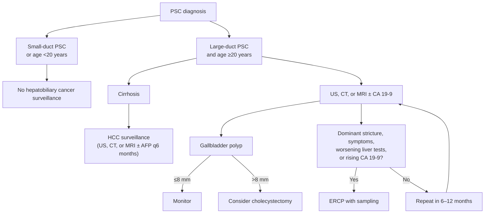

## Bibliographic Info
- **Article:** [Bowlus CL, Lim JK, Lindor KD. AGA Clinical Practice Update on Surveillance for Hepatobiliary Cancers in Patients With Primary Sclerosing Cholangitis: Expert Review. Clin Gastroenterol Hepatol. 2019;17(12):2416–2422.](https://doi.org/10.1016/j.cgh.2019.07.011)
- **Authors:** Christopher L. Bowlus (UC Davis), Joseph K. Lim (Yale), Keith D. Lindor (Mayo Clinic Scottsdale / Arizona State University)
- **Year:** 2019 (November 2019 issue; vol 17, no 12)
- **Journal/Publisher:** Clinical Gastroenterology and Hepatology — AGA Institute
- **DOI:** [10.1016/j.cgh.2019.07.011](https://doi.org/10.1016/j.cgh.2019.07.011)
- **Type:** guideline (AGA Institute Clinical Practice Update — **Expert Review**)

**Scope and evidence basis (as stated by the document).** Purpose: "to define key principles in the surveillance of hepatobiliary cancers including cholangiocarcinoma, gallbladder adenocarcinoma, and hepatocellular carcinoma in patients with primary sclerosing cholangitis (PSC)." Methods: "The recommendations outlined in this expert review are based on available published evidence including observational studies and systematic reviews, and incorporates expert opinion where applicable." Commissioned and approved by the AGA Institute Clinical Practice Updates Committee and the AGA Governing Board; internal CPUC peer review plus external peer review.

**No evidence grading and no recommendation numbering beyond the eight Best Practice Advice statements.** This Expert Review assigns **no GRADE ratings, no strength-of-recommendation labels, and no quality-of-evidence labels** to any statement. The eight statements are labelled "Best Practice Advice 1" through "Best Practice Advice 8" by the document itself; nothing else in the paper is numbered as a recommendation.

**What this update does not cover.** It addresses hepatobiliary cancers only. It notes that PSC "significantly increases the risk of colon cancer to greater than that of IBD alone" but gives **no colorectal surveillance interval, starting age, or technique** — for colorectal surveillance in PSC-IBD see [[aasld-2022-psc]].

## Contents
- [[#Best Practice Advice (verbatim)]]
- [[#Key Findings / Claims]]
  - [[#Cholangiocarcinoma — epidemiology and risk factors]]
  - [[#Surveillance modality performance]]
  - [[#CA 19-9 cut-points]]
  - [[#Dominant stricture — definition and sampling]]
  - [[#Tissue sampling yields]]
  - [[#Gallbladder polyps and gallbladder cancer]]
  - [[#Hepatocellular carcinoma]]
  - [[#Surveillance algorithm (Figure 1)]]
- [[#Relevance to Wiki]]
- [[#Contradictions / Open Questions]]

## Best Practice Advice (verbatim)

> **Best Practice Advice 1:** Surveillance for cholangiocarcinoma and gallbladder cancer should be considered in all adult patients with PSC regardless of disease stage, especially in the first year after diagnosis and in patients with ulcerative colitis and those diagnosed at an older age.

> **Best Practice Advice 2:** Surveillance for cholangiocarcinoma and gallbladder cancer should include imaging by ultrasound, computed tomography, or magnetic resonance imaging, with or without serum carbohydrate antigen 19-9, every 6 to 12 months.

> **Best Practice Advice 3:** Endoscopic retrograde cholangiopancreatography with brush cytology should not be used routinely for surveillance of cholangiocarcinomas in PSC.

> **Best Practice Advice 4:** Cholangiocarcinomas should be investigated by endoscopic retrograde cholangiopancreatography with brush cytology with or without fluorescence in situ hybridization analysis and/or cholangioscopy in PSC patients with worsening clinical symptoms, worsening cholestasis, or a dominant stricture.

> **Best Practice Advice 5:** Fine-needle aspiration of perihilar biliary strictures should be used with caution in PSC patients considered to be liver transplant candidates because of concerns for tumor seeding if the lesion is a cholangiocarcinoma.

> **Best Practice Advice 6:** Surveillance for cholangiocarcinoma should not be performed in PSC patients with small-duct PSCs or those younger than age 20.

> **Best Practice Advice 7:** The decision to perform a cholecystectomy in PSC patients with a gallbladder polyp should be based on the size and growth of the polyp, as well as the clinical status of the patient, with the knowledge of the increased risk of gallbladder cancer in polyps greater than 8 mm.

> **Best Practice Advice 8:** Surveillance for hepatocellular carcinoma in PSC patients with cirrhosis should include ultrasound, computed tomography, or magnetic resonance imaging, with or without α-fetoprotein every 6 months.

## Summary

An AGA Expert Review of surveillance for the three hepatobiliary malignancies that complicate [[primary-sclerosing-cholangitis|PSC]]: [[cholangiocarcinoma|cholangiocarcinoma (CCA)]], [[gallbladder-cancer|gallbladder adenocarcinoma]], and [[hepatocellular-carcinoma|HCC]]. Its central problem is that no level-1 evidence exists for CCA surveillance in PSC and no validated risk-stratification tool exists, so the eight advice statements are explicitly framed as "a reference point for clinicians to gauge their practice."

The operative content is the shape of the surveillance program: **cross-sectional imaging (US, CT, or MRI) with or without CA 19-9 every 6 to 12 months in every adult with large-duct PSC**, independent of disease stage, with MRI the modality "preferred by many experts" because of superior sensitivity over US. Two populations are excluded outright — **small-duct PSC and age <20 years** — because CCA is vanishingly rare in both. [[ercp|ERCP]] is not a surveillance test; it is the response to a surveillance abnormality (a dominant stricture, a mass, worsening cholestasis, or a rising CA 19-9), where [[brush-cytology|brush cytology]] ± [[fish|FISH]] and/or [[cholangioscopy]] are then used.

For the gallbladder, the update converts a size threshold into a decision: the risk of cancer rises in **polyps >8 mm**, and cholecystectomy is decided on polyp size *and* growth *and* the patient's clinical status — because PSC patients tolerate cholecystectomy poorly (40% early postoperative complications in one series, worst with advanced liver disease). For HCC it confines surveillance to **PSC with [[cirrhosis]]**, at the standard 6-month interval, while noting HCC has never been shown to be common in PSC cirrhosis.

The update is candid about competing risks: the same patient may be progressing toward liver failure, and CCA may preclude the only effective therapy for PSC — [[liver-transplantation|liver transplantation]]. That framing is why every recommendation is "should be considered" rather than mandated.

## Key Findings / Claims

### Cholangiocarcinoma — epidemiology and risk factors

- PSC prevalence 4.15–13.6 per 100,000 (United States), up to 16.2 per 100,000 globally; highest in Scandinavia and northern Europe.
- Median time from diagnosis to death or [[liver-transplantation|LT]]: **9–18 years** in transplant centers vs **21.3 years** in nontransplant centers.
- [[inflammatory-bowel-disease|IBD]] present in approximately **two thirds** of PSC patients.
- CCA annual risk **0.5%–1.0%**; 10-year cumulative incidence **6%–11%**, 30-year **20%**; **400-fold** the risk of the general population.
- **27%–37% of incident CCAs are detected within 1 year of the PSC diagnosis** — the highest incidence is in the first year, but this accounts for fewer than half of all cases.
- Reported frequency of CCA in PSC ranges **4%–36%** across cohorts. Pooled adult cohorts not limited to transplant recipients: 531 of 6591 (**8%**; 95% CI 7%–9%), median follow-up 2.5–13 years. International PSC Study Group: 821 of 7120 (**8%**; 95% CI 7%–9%), incidence **1.25 per 100 patient-years** (95% CI 0.90–1.60) among large-duct PSC.
- Prevalence of hepatobiliary malignancy (primarily CCA) in that cohort: **7%, 11%, 16%, 22% at 5, 10, 15, and 20 years**.
- Risk factors: **age, sex, and IBD status**.
  - Age <20 years: **1.2 per 100 patient-years** vs **21.0 per 100 patient-years** at age >60.
  - Compared with [[ulcerative-colitis|UC]], PSC without IBD and PSC with [[crohns-disease|Crohn's]] carry significantly **lower** CCA risk (1.22 vs 1.02 and 1.11 per 100 patient-years, respectively).
  - Women lower than men (**0.90 vs 1.28 per 100 patient-years**).
- Special populations: post-transplant CCA rate reported **9%–36%** among patients undergoing LT; pediatric PSC **8 of 781 (1%)**; small-duct PSC — rare, **no cases in 254 patients**; African American PSC (193 patients, multicenter) incidence **0.55 per 100 person-years** (95% CI 0.26–1.16).
- Benefit of surveillance (observational): in a large PSC population, regular surveillance was associated with higher 5-year survival than no regular surveillance — **68% vs 20%** (the paper prints *P* < .0061).
- EASL clinical guidelines are cited as recommending that **biliary dysplasia detected with brush cytology represents a possible indication for liver transplantation**.

### Surveillance modality performance

| Modality | Sensitivity | Specificity | Diagnostic average |
|---|---|---|---|
| US alone | 57% | 94% | — |
| [[mri-mrcp\|MRI/MRCP]] alone | 89% | 75% | — |
| [[ercp\|ERCP]] alone | 91% | 66% | — |
| MRI/MRCP + CA 19-9 (cut-off 20 U/mL) | **100%** | 38% | 89% |
| US + CA 19-9 (cut-off 20 U/mL) | 91% | 62% | 93% |
| ERCP + CA 19-9 (cut-off 20 U/mL) | **100%** | 43% | — |

- MRI is "the imaging mode preferred by many experts for cholangiocarcinoma surveillance" because of **superior sensitivity compared with US**.
- **CT is used less commonly** because of radiation and contrast exposure.
- ERCP + CA 19-9 reaches 100% sensitivity but at low specificity (43%) **and a risk of pancreatitis, cholangitis, bleeding, and hospitalization** — which is why ERCP is not a surveillance test.

### CA 19-9 cut-points

| Cut-off | Sensitivity | Specificity |
|---|---|---|
| **129 U/mL** | 78% | **98%** |
| **20 U/mL** | 78% | 67% |

- CA 19-9 is a glycolipid expressed by cancer cells, the most common serum marker associated with CCA; **its sensitivity and specificity both depend on the cut-off chosen**.
- **Up to one third of PSC patients with an increased CA 19-9 may not have CCA.**
- Expression of CA 19-9 requires the **Lewis blood group antigen, which is lacking in up to 10% of the population**; genotypic variants of **fucosyltransferases 2 and 3 (FUT2/FUT3)** influence levels, and cut-offs adjusted for FUT2/FUT3 genotype may improve sensitivity.

### Dominant stricture — definition and sampling

- **Dominant stricture** (strict definition, by ERCP): a stenosis with a diameter **≤1.5 mm in the common bile duct** and/or **≤1.0 mm in a hepatic duct within 2 cm of the main hepatic confluence**. The figure legend extends the working definition to include **strictures in these ducts associated with evidence of worsening cholestasis**.
- Typically refers to strictures of the CBD and the right and left confluence of the hepatic ducts. The update states that the clinical relevance of these strict criteria compared with strictures of the common bile or hepatic ducts "is unclear."
- **6.2% to 26.3% of PSC patients with a dominant stricture will be diagnosed with CCA** over a 6.2- to 9.8-year follow-up period.
- Benign and malignant strictures can look the same on imaging → maintain a high index of suspicion in any patient with **worsening cholestasis plus a stricture of the CBD and/or right, left, or confluence of hepatic ducts**; direct sampling should be considered to rule out CCA.
- Triggers to move from surveillance to ERCP evaluation: increasing cholestatic biochemistries, [[jaundice]], fever, right-upper-quadrant pain, or pruritus — such patients "no longer fit within the paradigm of cholangiocarcinoma surveillance."

### Tissue sampling yields

- **[[brush-cytology|Bile duct brushings]]:** specific (**84%–89%**) but insensitive (**8%–100%** across studies, limiting performance as a screening tool); recent meta-analysis **43% sensitive, 97% specific**.
- **[[fish|FISH]]** on brushings (DNA probes for aneuploidy and polysomy) raises overall sensitivity of standard cytology to **64%–68%**, specificity **70%–94%**.
- **[[cholangioscopy]]:** can differentiate IgG4-related sclerosing cholangitis from PSC; in a prospective study of 47 PSC patients, **4 target lesions could not have been reached without cholangioscopic visualization** of the bile duct. Despite similar sensitivity/specificity/accuracy for cancer diagnosis in PSC and non-PSC patients, **cannulation failure with cholangioscopy is more frequent in PSC (15% vs 2% in controls; *P* = .015)**.
- [[endoscopic-ultrasound|EUS]] and intraductal ultrasonography may also be used to direct biopsy sampling.
- **Fine-needle aspiration through any imaging modality should be pursued with great caution in transplant candidates because of the risk of tumor seeding.**

### Gallbladder polyps and gallbladder cancer

- Gallbladder cancer develops in an estimated **2% of PSC patients over their lifetime**; **5-year survival 5%–10%**.
- Gallbladder polyps found in **10% and 17%** of PSC patients in two recent reports; **mean size 10 mm, median size 4 mm**.
- In 366 PSC patients, incidence of gallbladder cancer among those **with** a gallbladder polyp was **1.6 per 100 person-years**.
- **No significant growth in polyp size** was observed among polyps **smaller than 8 mm** after a **median of 5 years** of follow-up.
- Optimal imaging modality for gallbladder polyps in PSC is unknown:
  - Transabdominal **US**: sensitivity **0.84** (95% CI 0.59–0.95), specificity **0.96** (95% CI 0.92–0.98) (Cochrane analysis).
  - **CT with oral contrast** detected only **76 of 96 (79.2%)** surgically confirmed gallbladder polyps — **all missed lesions were smaller than 5 mm**.
  - **There are no data on the ability of MRI to identify gallbladder polyps.**
- Dysplasia and cancer in resected gallbladders: of 53 PSC gallbladder specimens, **2 high-grade and 7 low-grade dysplasia without masses**; among 72 cholecystectomies performed before or during LT in PSC, **37% contained dysplasia and 14% adenocarcinoma**.
- Size–histology relationship in that small series: **polyps <0.8 cm contained no dysplasia**, and **lesions <1.2 cm contained no carcinoma**. Pooled with other literature (52 cases), a **0.8-cm cut-off for any lesion found on US gave sensitivity 96% and specificity 53% for neoplasia detection**.
- **Annual US screening** is advised for gallbladder mass lesions, because of high malignancy risk in gallbladder mass lesions and 5%–10% 5-year survival.
- Surgical risk: **40% of PSC patients in one series had early postoperative complications after cholecystectomy, especially with more severe liver disease.**
- Society divergence documented by the update: EASL and AASLD PSC guidelines recommend cholecystectomy in PSC **regardless of gallbladder lesion size**; ACG suggests cholecystectomy for **polyps >8 mm**; other societies concluded data are insufficient to support cholecystectomy in all PSC patients with gallbladder polyps. "Guidelines should be applied cautiously to individual circumstances, and with consideration of benefits and risks."

### Hepatocellular carcinoma

- HCC "appears to be relatively rare in PSC," but once **cirrhosis** develops the risk may resemble other causes of cirrhosis; existing studies have not specifically examined HCC risk in PSC cirrhosis.
- Retrospective 2-center study: **119 PSC patients with cirrhosis, 292 patient-years of follow-up — no HCC identified**, with an **upper limit of the 95% CI for instantaneous HCC risk of 1.03%**.
- Current PSC guidelines do not address HCC surveillance; HCC guidelines recommend surveillance for all patients with cirrhosis regardless of etiology → **US, CT, or MRI ± α-fetoprotein every 6 months** in PSC with cirrhosis.

### Surveillance algorithm (Figure 1)

*Algorithm — surveillance for hepatobiliary cancers in PSC, recreated from Figure 1. ([[aga-2019-psc-cancer-surveillance]])*

## Relevance to Wiki

- **[[primary-sclerosing-cholangitis]]** — adds to Cancer Surveillance: the 6–12-month imaging ± CA 19-9 program with the modality performance and CA 19-9 cut-point tables; the explicit age <20 / small-duct exclusion; ERCP as a response to a surveillance abnormality rather than a surveillance test; the "within 2 cm of the main hepatic confluence" qualifier on the dominant-stricture definition; gallbladder polyp thresholds and cholecystectomy surgical risk; the HCC interval in PSC cirrhosis.
- **[[cholangiocarcinoma]]** — new subsection on CCA risk in PSC (annual risk, cumulative incidence, first-year clustering, age/sex/IBD risk gradients).
- **[[gallbladder-cancer]]** — PSC-specific gallbladder polyp data (prevalence, size–histology relationship, US/CT performance, 8-mm threshold) and the society divergence on cholecystectomy in PSC.
- **[[mri-mrcp]]** — PSC row: MRI preferred for CCA surveillance on sensitivity grounds; no data for MRI detection of gallbladder polyps.
- **[[brush-cytology]]** — PSC-specific yields (84%–89% specific, 43%/97% meta-analysis) and the statement that brushing should not be used routinely for surveillance.
- Also relevant: [[fish]], [[cholangioscopy]], [[ercp]], [[hcc-surveillance]], [[liver-transplantation]].

## Contradictions / Open Questions

- **Surveillance interval.** This update advises imaging ± CA 19-9 **every 6 to 12 months**; [[aasld-2022-psc]] advises **annual** MRI/MRCP ± CA 19-9. AASLD 2022 is the newer guidance and governs the wiki's recommendation; the 6-month option remains an accepted lower bound in this update.
- **Age threshold for starting surveillance.** This update: **no surveillance below age 20**. [[aasld-2022-psc]]: no surveillance below age **18**. AASLD 2022 governs.
- **Surveillance modality.** This update permits **US, CT, or MRI**; [[aasld-2022-psc]] specifies **MRI/MRCP** as the surveillance modality. AASLD 2022 governs; note this update's own text says MRI is preferred by many experts.
- **Cholecystectomy for gallbladder polyps in PSC.** Three positions coexist in the wiki's sources: cholecystectomy **regardless of size** ([[asge-2013-biliary-neoplasia]], and the EASL/AASLD PSC guidelines cited by this update); **>8 mm** ([[acg-2015-psc]], this update, [[aasld-2022-psc]]); and insufficient data. The **>8 mm** threshold is the wiki's assertion, from the newest guidance ([[aasld-2022-psc]]).
- **Gallbladder polyp follow-up interval.** This update says **annual** US for gallbladder mass lesions and does not specify a repeat interval for a sub-8-mm polyp beyond the 6–12-month surveillance cycle; [[aasld-2022-psc]] specifies **US every 6 months** for polyps ≤8 mm. AASLD 2022 governs.
- **Effect size of surveillance on survival.** Both this update and [[aasld-2022-psc]] cite the same 68%-vs-20% 5-year survival comparison; the *P* values printed differ between the two documents.
- **Open question in the source itself:** no validated risk-stratification tool exists to individualize CCA surveillance in PSC, and no prospective surveillance trial has been done. The optimal imaging modality for gallbladder polyps in PSC is unknown, with no MRI data at all.
