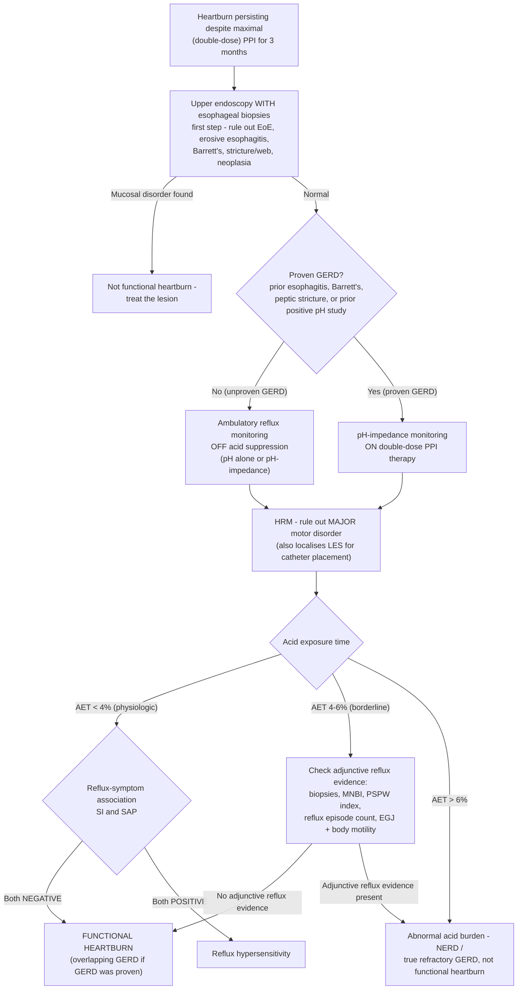

## Bibliographic Info
- **Article:** [Fass R, Zerbib F, Gyawali CP. AGA Clinical Practice Update on Functional Heartburn: Expert Review. Gastroenterology. 2020;158(8):2286–2293.](https://doi.org/10.1053/j.gastro.2020.01.034)
- **Authors:** Ronnie Fass, Frank Zerbib, C. Prakash Gyawali
- **Year:** 2020 (June issue)
- **Journal/Publisher:** Gastroenterology (AGA Institute)
- **DOI:** [10.1053/j.gastro.2020.01.034](https://doi.org/10.1053/j.gastro.2020.01.034)
- **Type:** guideline (AGA Clinical Practice Update — Expert Review)

**Article type verified on page 1.** A genuine **Clinical Practice Update** carrying **7 numbered Best Practice Advice (BPA) statements**.

**The statements are UNGRADED.** The document attaches no GRADE rating, evidence quality, or strength of recommendation to any BPA. None may be inferred.

## Contents
- [[#Summary]]
- [[#Key Findings / Claims]]
  - [[#Best Practice Advice statements (verbatim, as numbered in the source)]]
  - [[#Diagnostic criteria — what has to be true]]
  - [[#Diagnostic algorithm (Figure 1)]]
  - [[#Adjunctive metrics when AET is borderline]]
  - [[#Therapeutic options (Table 1)]]
  - [[#Neuromodulator trials (Table 2)]]
  - [[#Supporting data points]]
- [[#Relevance to Wiki]]
- [[#Contradictions / Open Questions]]
- [[#See Also]]

---

## Summary

Functional heartburn is retrosternal burning **without** abnormal esophageal acid exposure, **without** a major esophageal motor disorder, and **without** mucosal pathology — and, critically, **without** a reflux–symptom association. It is the diagnosis in roughly a quarter of patients whose heartburn persists on PPI, and it matters because the reflexive response to persistent heartburn — escalate acid suppression, then operate — is not merely ineffective in these patients but potentially harmful.

The update draws the line between three entities that present identically. **NERD** requires abnormal acid exposure on ambulatory reflux monitoring. **Reflux hypersensitivity** has physiologic acid exposure but a *positive* symptom association. **Functional heartburn** has physiologic acid exposure and a *negative* symptom association. Rome IV added a fourth possibility the wiki must not collapse into the others: functional heartburn **overlapping proven GERD**, diagnosed when a patient with previously documented GERD still burns on maximal PPI and pH-impedance testing *on therapy* shows normal acid exposure with negative SI and SAP for both acid and weakly acidic reflux.

Getting there requires the full workup, in order: upper endoscopy with esophageal biopsies (rule out erosive esophagitis, Barrett's, eosinophilic esophagitis, strictures, webs, pill esophagitis, neoplasia), high-resolution manometry (rule out major motor disorders — heartburn is reported in up to 35% of achalasia), and reflux monitoring — **off** PPI in unproven GERD, **on** PPI with impedance in proven GERD. A minor motor disorder such as ineffective esophageal motility does *not* exclude the diagnosis.

Treatment is a different ladder entirely. PPIs have **no** therapeutic value unless GERD overlaps. Neuromodulators are first-line: tricyclics dosed "low and slow," SSRIs, tegaserod, H2RAs (an independent pain-modulatory effect, not an acid effect), melatonin. Acupuncture and hypnotherapy have supporting evidence as monotherapy or adjuncts. Anti-reflux surgery and endoscopic GERD therapy should not be recommended — normal preoperative acid exposure is itself a risk factor for poor fundoplication outcome. Prognosis is benign organically; the burden is on quality of life.

## Key Findings / Claims

### Best Practice Advice statements (verbatim, as numbered in the source)

*Ungraded — the source attaches no evidence grade or strength to any statement.*

1. A diagnosis of functional heartburn should be considered when retrosternal burning pain or discomfort persists despite maximal (double-dose) proton pump inhibitor (PPI) therapy taken appropriately before meals during a 3-month period.
2. A diagnosis of functional heartburn requires upper endoscopy with esophageal biopsies to rule out anatomic and mucosal abnormalities, esophageal high-resolution manometry to rule out major motor disorders, and pH monitoring off PPI therapy (or pH-impedance monitoring on therapy in patients with proven gastroesophageal reflux disease [GERD]), to document physiologic levels of esophageal acid exposure in the distal esophagus with absence of reflux–symptom association (ie, negative symptom index and symptom association probability).
3. Overlap of functional heartburn with proven GERD is diagnosed according to Rome IV criteria when heartburn persists despite maximal PPI therapy in patients with history of proven GERD (ie, positive pH study, erosive esophagitis, Barrett's esophagus, or esophageal ulcer), and pH impedance testing on PPI therapy demonstrates physiologic acid exposure without reflux–symptom association (ie, negative symptom index and symptom association probability).
4. PPIs have no therapeutic value in functional heartburn, the exception being proven GERD that overlaps with functional heartburn.
5. Neuromodulators, including tricyclic antidepressants, selective serotonin reuptake inhibitors, tegaserod, and histamine-2 receptor antagonists have benefit as either primary therapy in functional heartburn or as add-on therapy in functional heartburn that overlaps with proven GERD.
6. Based on available evidence, acupuncture and hypnotherapy may have benefit as monotherapy in functional heartburn, or as adjunctive therapy combined with other therapeutic modalities.
7. Based on available evidence, anti-reflux surgery and endoscopic GERD treatment modalities have no therapeutic benefit in functional heartburn and should not be recommended.

### Diagnostic criteria — what has to be true

*All of the following, per BPA 1–2. The symptom-frequency floor comes from the body text: heartburn **at least 2 times per week for the previous 3 months** despite double-dose PPI taken appropriately before meals.*

| Domain | Requirement for functional heartburn |
|---|---|
| **Symptom** | Retrosternal burning pain/discomfort, troublesome, ≥2×/week for ≥3 months, persisting despite **maximal (double-dose)** PPI taken before meals |
| **Endoscopy + biopsies** | Normal — no erosive esophagitis, [[barretts-esophagus\|Barrett's esophagus]], [[eosinophilic-esophagitis\|eosinophilic esophagitis]], stricture, web, pill esophagitis, or neoplasia |
| **[[high-resolution-manometry\|HRM]]** | No **major** esophageal motor disorder. A **minor** disorder ([[ineffective-esophageal-motility\|IEM]]) does **not** preclude the diagnosis, provided reflux disease is excluded |
| **Acid exposure** | **Physiologic** — AET **<4%** (reliably normal below 4%, abnormal above 6%) |
| **Reflux–symptom association** | **Negative both SI and SAP** — SI positive if **>50%**; SAP positive if **≥95%** |
| **Which study, off or on PPI** | **Unproven GERD** → pH or pH-impedance **off** anti-secretory medication. **Proven GERD** → pH-impedance **on** double-dose PPI |

**The three-way discrimination (all with normal endoscopy):**

| | Acid exposure time | SI / SAP | Diagnosis |
|---|---|---|---|
| Abnormal acid burden | AET **>6%** | either | **NERD** (true reflux disease) |
| Physiologic acid burden, symptoms track reflux | AET **<4%** | **both positive** | **Reflux hypersensitivity** |
| Physiologic acid burden, symptoms do not track reflux | AET **<4%** | **both negative** | **Functional heartburn** |

- No consensus exists on which index governs when **SI and SAP disagree**.
- **Overlap with proven GERD** (BPA 3): prior positive pH study, erosive esophagitis, Barrett's, or esophageal ulcer, **plus** normal AET **and** negative SI and SAP for **both acid and weakly acidic** reflux events on pH-impedance **on** PPI.

### Diagnostic algorithm (Figure 1)

*Figure 1 legend, verbatim on the borderline band:* "When acid exposure time is borderline (4%–6%), absence of adjunctive reflux evidence (ie, normal esophageal biopsies, normal baseline impedance >2292 ohms, normal PSPW index >0.61, negative reflux-symptom association, <40 reflux episodes, normal esophagogastric junction, and esophageal body motor profile on high-resolution manometry) indicates the possibility of functional heartburn." ([[aga-2020-functional-heartburn]])

### Adjunctive metrics when AET is borderline

| Metric | Normal value cited | What it means | Source's caveat |
|---|---|---|---|
| **Mean nocturnal baseline impedance (MNBI)** | **>2292 ohms** = normal; **low MNBI (<2292 ohms)** favours reflux | Surrogate for reflux-induced altered mucosal integrity; linked to mucosal damage | — |
| **Post-reflux swallow-induced peristaltic wave (PSPW) index** | **>0.61** = normal, favours functional heartburn | Proportion of reflux episodes followed by a swallow; reflects integrity of reflux-stimulated primary peristalsis | — |
| **Reflux episode count** | **<40** episodes | Part of the "no adjunctive reflux evidence" set | — |

- **Explicit limitation, verbatim:** *"both MNBI and PSPW index may prove to be helpful for the management of patients with refractory heartburn, but more data are needed to recommend the use of these metrics, including inter-observer reproducibility, normal values, and relevant cutoff values in clinical practice."*

### Therapeutic options (Table 1)

| Modality | Agents / techniques listed |
|---|---|
| **Lifestyle modifications** | Improved sleep experience |
| **Pharmacotherapy** | Tricyclic antidepressants; selective serotonin reuptake inhibitors; [[tegaserod]]; histamine-2 receptor antagonists; melatonin |
| **Alternative / complementary medicine** | Acupuncture |
| **Psychological intervention** | Hypnotherapy |

- **TCA dosing rule, verbatim:** *"Treatment with tricyclic antidepressants should follow the 'low and slow' approach, where the lowest dose of tricyclic antidepressant is initially used and is increased by weekly increments of the same dose to a goal of 50–75 mg daily."* Commonly given at bedtime — somnolence improves the sleep experience and augments the analgesic effect.
- **A subset of patients requires more than one modality** for acceptable symptom control.
- **Lifestyle:** only improved night-time sleep has (limited) supporting evidence; stressful activity, loud noise and sleep deprivation increase perception of esophageal symptoms. Patients with **predictable, repetitive** triggering by specific foods or activities may benefit from avoiding them. *"There is no conclusive evidence that further lifestyle modifications have a role in functional heartburn in contrast to GERD."*
- **PPI handling:** if no conclusive GERD evidence, **an attempt to discontinue PPI therapy is warranted**. If overlap with GERD is demonstrated, PPI can be **maintained** while targeted functional-heartburn therapy is started.
- **H2RAs are the exception to "antireflux drugs don't work"** — an independent benefit via esophageal **pain modulation**, not acid suppression.

### Neuromodulator trials (Table 2)

*Reproduced verbatim from the source's table.*

| Class | Drug | Dose | No. of subjects | Outcome | Study type |
|---|---|---|---|---|---|
| TCA | Imipramine | 25 mg/d | 83 | No difference than placebo in symptom relief; improved QOL | RCT |
| SSRI | Fluoxetine | 20 mg/d | 144 | Improvement in percentage of heartburn-free days | RCT |
| Serotonin agonist (5-HT4) | [[tegaserod\|Tegaserod]] | 6 mg bid | 42 | Decreased frequency of heartburn, regurgitation, and distress | RCT |
| H2RA | Ranitidine | 150 mg | 18 | Decrease in esophageal sensitivity | RCT |
| Miscellaneous anxiolytics, sedatives, and hypnotics | Melatonin | 6 mg bid | 60 | Improved GERD-HRQOL | RCT |

Trial detail from the body text:

- **Imipramine 25 mg daily × 8 weeks** vs placebo in 83 functional heartburn + reflux hypersensitivity patients — no difference in heartburn improvement; significant QOL improvement per-protocol (*P* = .045).
- **Fluoxetine 20 mg daily** (the only SSRI studied) as add-on in patients failing standard-dose once-daily omeprazole, vs double-dose omeprazole vs add-on placebo — greater proportion of heartburn-free days (median 35.7 vs 7.14 vs 7.14 days; *P* < .001 for both comparisons). **Superior effect seen only in the subset with a normal pH test.**
- **Tegaserod 6 mg bid × 14 days** vs placebo — tolerated higher balloon pressures (*P* = .04) and maximum wall tension (*P* = .0004); decreased frequency of heartburn (*P* = .004), regurgitation (*P* = .048) and distress from regurgitation (*P* = .039); higher global preference for tegaserod.
- **Ranitidine 150 mg daily** — decreased chemoreceptor sensitivity to esophageal acid perfusion. ⚠ The source notes certain brands were then **subject to a US FDA recall for contamination with agents that may have a carcinogenic effect**.
- **Melatonin 6 mg at bedtime × 3 months** vs nortriptyline 25 mg vs placebo — significant GERD-HRQOL improvement vs nortriptyline (*P* = .0015) and vs placebo (*P* < .0001).
- **Acupuncture:** 30 heartburn patients failing standard-dose PPI randomised to add-on acupuncture (10 sessions over 4 weeks) vs double-dose PPI — significant decrease in mean daytime heartburn, night-time heartburn and acid regurgitation scores vs double-dose PPI; mean general health score improved only with acupuncture. *Caveat stated by the source:* unclear what proportion of participants had functional heartburn alone vs overlapping GERD.
- **Hypnotherapy:** 9 patients, 7 weekly esophageal-directed sessions — well tolerated, significant improvement in heartburn symptoms, visceral anxiety and quality of life, trend toward improvement in catastrophizing.

### Supporting data points

- **Prevalence:** as many as **21%–39%** of patients with PPI-refractory heartburn undergoing pH-impedance monitoring fulfil criteria for functional heartburn; **21%–40%** in 24-hour pH-impedance series; diagnosed in **as many as one-quarter** of patients with persistent heartburn on PPI, alone or overlapping established GERD.
- **VA prospective study, 366 patients with refractory heartburn:** **99 (27%)** had functional heartburn on negative esophageal testing; **23 (6%)** had non-GERD esophageal disorders; **7 (2%)** had esophageal motility disorders.
- **Erosive esophagitis prevalence is <10%** in patients refractory to PPI; when found it indicates poorly controlled persistent acid reflux or true refractory GERD per Rome IV.
- **Eosinophilic esophagitis prevalence does not exceed 8%** in patients presenting with refractory heartburn — but must still be excluded by **adequate biopsy sampling** to satisfy the definition of functional heartburn.
- **Abnormal AET reported in 26.3%–72%** of refractory heartburn patients across series.
- **Heartburn is reported in up to 35% of achalasia** — the reason HRM is mandatory rather than optional.
- **Clinical description of heartburn has only modest sensitivity and specificity** vs objective reflux evidence or PPI response. **40% dissatisfaction rate** with PPI therapy among patients with heartburn.
- **pH-impedance on therapy in proven GERD** establishes a relationship between symptoms and acid reflux in **10%**, and weakly acidic reflux in **30%–40%**; studies are **negative in 50%–60%**.
- **Prolonged (48- or 96-hour) wireless pH monitoring** increases detection of reflux disease; **worst-day analysis** gives the highest diagnostic yield, reducing the proportion of patients labelled functional heartburn.
- **Off therapy, the added value of impedance over pH alone is relatively limited**; on therapy, impedance is what allows weakly acidic reflux detection.
- **Mechanism:** esophageal mucosal afferent nerves are **deeply localized** in functional heartburn (like healthy volunteers) rather than **superficially** localized as in NERD; balloon distension shows similar visceral hypersensitivity in **esophagus and rectum**, supporting generalized heightened visceral perception. High likelihood of **anxiety and other affective disorders**. **Functional dyspepsia and IBS are frequently associated** and negatively impact response to therapy.
- **Acid does not trigger functional heartburn symptoms** — shown by acid perfusion studies comparing functional heartburn to NERD.
- **Why surgery fails:** *"Normal preoperative esophageal acid exposure has been shown to be a risk factor for poor outcomes after surgical fundoplication."*
- **Prognosis:** no long-term pathologic consequences, but substantially reduced quality of life. Because 24-hour monitoring can miss abnormal acid exposure through day-to-day variation, long-term GERD complications (Barrett's, peptic stricture) can occasionally emerge in patients labelled functional heartburn — *"anticipated to be rare."*
- **Treatment goals are three-fold:** symptom improvement and ideally resolution; prevention of symptom recurrence; improvement of health-related quality of life.

## Relevance to Wiki

- **[[functional-heartburn]]** — created by this ingest. The whole page is this CPU: the diagnostic requirements (BPA 1–2), the overlap-with-GERD entity (BPA 3), the three-way NERD / reflux hypersensitivity / functional heartburn discrimination, Figure 1's algorithm, the borderline-AET adjunctive metrics, and the neuromodulator-first treatment ladder (BPA 4–7).
- **[[gerd]]** — the differential row for functional heartburn now carries the actual criteria rather than the label, and points at the new page.
- **[[reflux-testing]]** — SI >50% and SAP ≥95% positivity thresholds; MNBI >2292 ohms and PSPW index >0.61 as adjunctive metrics for the borderline 4%–6% AET band, with the source's own "more data needed" caveat; the off-PPI vs on-PPI study selection rule.
- **[[disorders-of-gut-brain-interaction]]** — supplies the operative content behind Rome category **A2 (functional heartburn)** and its separation from **A3 (reflux hypersensitivity)**.
- **[[proton-pump-inhibitors]]** — BPA 4: no therapeutic value in functional heartburn; discontinuation warranted when GERD is not proven.
- **[[tegaserod]]** — the functional heartburn indication and the 6 mg bid × 14 days trial data.
- Reinforces without changing: [[eosinophilic-esophagitis]] (≤8% of refractory heartburn; biopsies mandatory), [[achalasia]] (heartburn in up to 35%), [[ineffective-esophageal-motility]] (a minor disorder does not exclude functional heartburn), [[antireflux-surgery]] (normal preoperative AET predicts poor outcome).

## Contradictions / Open Questions

- **Rome IV here, Rome V in the wiki.** This CPU is written against **Rome IV** criteria; [[rome-v-2026-dgbi]] is the newest tier-1 source and supersedes it on the criteria themselves. Where the two differ, Rome V governs the [[functional-heartburn]] and [[disorders-of-gut-brain-interaction]] pages; this CPU remains the operative source for the *workup sequence*, the *adjunctive metrics*, and the *treatment ladder*, none of which Rome V replaces.
- **Tegaserod's availability.** BPA 5 and Table 2 endorse tegaserod for functional heartburn. The [[tegaserod]] page carries the drug's regulatory history from its own sources; this CPU does not discuss availability restrictions.
- **Ranitidine is named as a supporting-evidence agent but flagged by the source itself** as subject to a US FDA recall for possible carcinogenic contamination. BPA 5's endorsement is of the **H2RA class**, not of ranitidine specifically.
- **Borderline-AET metrics are explicitly not yet recommendable.** MNBI and PSPW index carry named cut-offs (>2292 ohms, >0.61) *and* an explicit statement that more data on reproducibility, normal values and cut-offs are needed before recommending clinical use. Both facts belong together wherever these metrics are cited.
- **SI vs SAP discordance is unresolved.** The source states there is no consensus on which index to follow when they disagree.
- **Melatonin has no wiki page and no other ingested source.** BPA-adjacent evidence (6 mg at bedtime, one RCT) sits on this source page and on [[functional-heartburn]]; no drug-class page is created from a single trial.
- **Figure 1 is reproduced as a Mermaid flowchart**, not screenshotted, per the Style Guide's preference for text-rendered content where the structure survives; the legend's numeric thresholds are quoted verbatim above.

---

## See Also

[[functional-heartburn]], [[gerd]], [[reflux-testing]], [[ambulatory-reflux-monitoring]], [[disorders-of-gut-brain-interaction]], [[high-resolution-manometry]], [[proton-pump-inhibitors]], [[tegaserod]], [[eosinophilic-esophagitis]], [[achalasia]], [[ineffective-esophageal-motility]], [[antireflux-surgery]], [[barretts-esophagus]], [[upper-endoscopy]], [[irritable-bowel-syndrome]], [[dyspepsia]]
