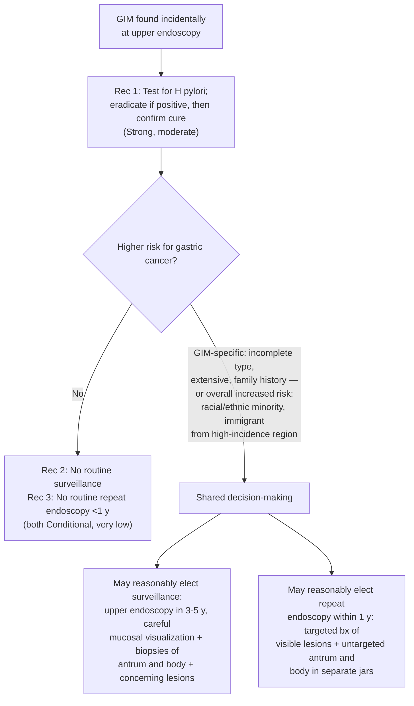

## Contents
- [[#Bibliographic Info]]
- [[#Summary]]
- [[#Key Findings / Claims]]
  - [[#Scope and Out-of-Scope]]
  - [[#PICO Questions]]
  - [[#Decision Threshold for Surveillance]]
  - [[#Evidence on H. pylori Eradication]]
  - [[#Natural History — Risk of Progression]]
  - [[#Risk Factors for Gastric Cancer in GIM]]
  - [[#Biopsy and Specimen Handling]]
  - [[#What Other Guidelines Say]]
  - [[#Evidence Gaps Named by the Panel]]
- [[#Recommendations]]
- [[#GRADE Framework Used]]
- [[#Relevance to Wiki]]
- [[#Contradictions / Open Questions]]
- [[#See Also]]
- [[#Sources]]

## Bibliographic Info

- **Article:** [Gupta S, Li D, El Serag HB, Davitkov P, Altayar O, Sultan S, Falck-Ytter Y, Mustafa RA. AGA Clinical Practice Guidelines on Management of Gastric Intestinal Metaplasia. Gastroenterology 2020;158:693–702.](https://doi.org/10.1053/j.gastro.2019.12.003)
- **Authors:** Samir Gupta, Dan Li, Hashem B. El Serag, Perica Davitkov, Osama Altayar, Shahnaz Sultan, Yngve Falck-Ytter, Reem A. Mustafa
- **Year:** 2020
- **Journal/Publisher:** Gastroenterology 2020;158:693–702
- **DOI:** [10.1053/j.gastro.2019.12.003](https://doi.org/10.1053/j.gastro.2019.12.003)
- **Type:** American Gastroenterological Association (AGA) clinical practice **guideline** (journal section "Clinical Practice Guidelines"), developed with Grading of Recommendations Assessment, Development and Evaluation (GRADE) methodology — **3 recommendations** answering **4 population, intervention, comparator, and outcome (PICO) questions**, supported by 2 accompanying technical reviews (Gawron et al — natural history and clinical outcomes; Altayar et al — epidemiology and risk factors)

## Summary

First evidence-based guideline for management of gastric intestinal metaplasia (GIM) published in the United States. GIM is the histologic step just before dysplasia in the Correa cascade — normal mucosa → non-atrophic gastritis → [[atrophic-gastritis|atrophic gastritis]] → intestinal metaplasia → [[gastric-adenocarcinoma|gastric adenocarcinoma]] — and is linked mainly to risk for **non-cardia** gastric cancer, which the document calls "gastric cancer" throughout. Chronic [[helicobacter-pylori-infection|*Helicobacter pylori*]] infection is the primary risk factor, with at least 80% of the global gastric cancer burden attributable to it.

The panel issued **3 recommendations**: one strong (test and eradicate *H pylori*) and two conditional suggestions *against* routine practices (routine endoscopic surveillance; routine short-interval repeat endoscopy for risk stratification). Both conditional recommendations rest on **very low** quality evidence — the technical review found **no** randomized trial, cohort study, or case–control study comparing surveillance vs no surveillance in GIM, and **no** cohort or case series of short-interval repeat endoscopy in incidentally found GIM. In place of a recommendation for surveillance, the panel directs **shared decision-making** for defined higher-risk groups.

The guideline's operative decision threshold is explicit: the panel would support surveillance at an annual rate of progression to gastric cancer **exceeding 0.5%–1%**. Observed pooled progression was **0.16% per year**, below that bar — which is why surveillance is not recommended routinely.

Scope is deliberately narrow: GIM found incidentally at upper endoscopy done in North America for workup of endoscopically identified gastropathy/presumed gastritis, dyspepsia, or exclusion of *H pylori*. Gastric cancer **screening**, and management of gastric **dysplasia**, gastric **adenocarcinoma**, and **autoimmune gastritis**, are all explicitly out of scope — as is **duration** of surveillance.

## Key Findings / Claims

### Scope and Out-of-Scope

| In scope | Out of scope |
|---|---|
| GIM detected at routine upper endoscopy (workup of endoscopic gastropathy/presumed gastritis, [[dyspepsia]], exclusion of *H pylori*) | Screening for gastric cancer, population-wide or in select populations |
| Patients undergoing upper endoscopy in **North America** | Management of gastric mucosal **dysplasia**, gastric adenocarcinoma, autoimmune gastritis |
| Non-cardia gastric cancer risk | **Duration** of surveillance; method of *H pylori* testing and strategies for confirming eradication |

### PICO Questions

1. Among patients with GIM, does testing for *H pylori* and treating if positive vs no testing affect patient-important outcomes?
2. Among patients with GIM identified as **low risk**, does subsequent upper endoscopic surveillance vs no follow-up affect patient-important outcomes?
3. Among patients with GIM identified as **high risk**, does subsequent upper endoscopic surveillance vs no follow-up affect patient-important outcomes?
4. Among patients with GIM **without dysplasia**, does short-term upper endoscopy follow-up (<1 year) with biopsies to determine the extent of GIM vs no short-term follow-up affect patient-important outcomes?

- Patient-important outcomes prioritized: early cancer detection · reduced gastric cancer morbidity/mortality · endoscopy complications · costs · psychological harms (e.g., anxiety and stress related to coping with a precancerous condition).

### Decision Threshold for Surveillance

- The panel **pre-specified** the decision threshold to support surveillance: **rate of progression to gastric cancer among individuals with GIM exceeding 0.5%–1% annually.**
- Observed pooled annual rate of progression: **0.16% per year** — below the threshold.
- For comparison the panel cites a previously reported pooled annual cumulative risk of **0.33%** for esophageal adenocarcinoma in non-dysplastic Barrett's esophagus, a condition for which endoscopic surveillance is often routinely recommended.

### Evidence on H. pylori Eradication

- Technical review used **22 studies, including 7 randomized controlled trials and 3 cohort studies**.
- *H pylori* eradication (vs placebo) in individuals **with or without GIM**, absent gastric neoplasia: **32% pooled relative risk (RR) reduction in incident gastric cancer — RR 0.68 (95% confidence interval [CI] 0.48–0.96)**.
- Same population, gastric cancer **mortality**: **33% pooled RR reduction — RR 0.67 (95% CI 0.38–1.17)**.
- Restricted to individuals with *H pylori* infection and **confirmed GIM**: qualitatively similar but non-significant — **RR 0.76 (95% CI 0.36–1.61)** for incident gastric cancer. Data were **insufficient** to assess the effect on gastric cancer **mortality** in confirmed GIM.
- Evidence rated **moderate** (not high) partly because of this lack of data in confirmed GIM, and because the trial with the largest influence on the pooled estimate was limited by attrition bias and conducted in an indigenous Chinese population with possibly different gastric cancer risk.
- *H pylori* accounts for up to **89%** of non-cardia gastric cancers worldwide.
- **Confirming eradication is recommended**, given high known eradication failure rates with current therapies; the method of testing and the confirmation strategy are outside this guideline's scope.

### Natural History — Risk of Progression

| Outcome in patients with GIM | Estimate | Basis |
|---|---|---|
| Pooled prevalence of GIM among people **undergoing gastric biopsy** | **4.8% (95% CI 4.8%–4.9%)** among 897,371 individuals | Mostly a single study of biopsies submitted to one national gastrointestinal pathology service company in the US |
| Cumulative incident gastric cancer at **3 years** | **0.4% (95% CI 0.1%–0.8%)** | 4 studies |
| Cumulative incident gastric cancer at **5 years** | **1.1% (95% CI 1.0%–1.2%)** | 7 studies |
| Cumulative incident gastric cancer at **10 years** | **1.6% (95% CI 1.5%–1.7%)** | 4 studies |
| Pooled **annual** rate of progression to gastric cancer | **0.16% per year** | — |
| Cumulative 5-year risk, **US** cohort (Southern California integrated health plan) | **0.9% (95% CI 0.3%–1.6%)** | 1 study |
| Cumulative progression to **dysplasia** at 3 years | **15% (95% CI 13%–17%)** | 7 studies, ~3000 patients; **all from outside the US** |
| Cumulative progression to **dysplasia** at 5 years | **15% (95% CI 12%–19%)** | Same 7 studies |
| Gastric cancer **within 1 year** of GIM diagnosis (proxy for missed prevalent cancer) | **0.5% (95% CI 0.4%–0.6%)** | 4 cohort studies — "the overall risk of missed cancer is low" |

- The guideline frames the higher-risk patient who might reasonably elect surveillance as one at **≥1.6% ten-year risk** of gastric cancer.

### Risk Factors for Gastric Cancer in GIM

**Risk factors specific to patients with GIM** (these raise risk *within* a GIM population):

| Factor | Definition given in the document | Effect size | Quality of evidence |
|---|---|---|---|
| **Incomplete vs complete GIM** | Incomplete = **at least partial colonic type**; complete = **small intestinal type** | **3-fold** increased risk for incident gastric cancer — **RR 3.33 (95% CI 1.96–5.64)**, 7 studies | **Low** |
| **Family history of gastric cancer** | **First-degree relative** with gastric cancer | **4.5-fold** increased risk — **RR 4.53 (95% CI 1.33–15.46)**, 3 studies | **Very low** |
| **Extensive vs limited GIM** | Extensive = involving the **gastric body plus either antrum and/or incisura**; limited = **antrum and/or incisura only** | **2-fold** higher pooled risk — **RR 2.07 (95% CI 0.97–4.42)**, 2 studies | **Very low** |

- None of the 7 studies informing the incomplete-vs-complete estimate were from the United States.

**Groups at overall increased risk for gastric cancer** — *irrespective of the presence or absence of GIM*; the guideline keeps this category separate:

- **Racial/ethnic minorities** — Hispanics, Asians, African Americans, Native Americans/Alaska Natives.
- **Immigrants from regions with high gastric cancer incidence** — the document's examples are **East Asia or South America**.
- Important qualification: the technical review did **not** identify higher prevalence of GIM among racial/ethnic minorities, and did **not** find that racial/ethnic minorities *with GIM* have increased gastric cancer risk compared with non-Hispanic whites *with GIM*. Among confirmed GIM, cumulative gastric cancer risk was **not statistically different**: Hispanics **1.0% (95% CI 0.4%–1.7%)**, Asians **0.3% (95% CI 0.1%–0.8%)**, blacks **0.4% (95% CI 0.0%–1.4%)**, non-Hispanic whites **0.3% (95% CI 0.1%–0.6%)**. Wide CIs and varying point estimates do not rule out clinically meaningful differences, and data came from just 3 studies that did not account for US- vs foreign-born status or duration of residence.

**Factors the guideline found it could NOT use:** little to no evidence was available to assess gastric cancer risk in patients with GIM based on **concurrent smoking, pernicious anemia, autoimmune gastritis, or candidate risk biomarkers**.

- The guideline does **not** adopt Operative Link on Gastritis Assessment (OLGA) / Operative Link on Gastric Intestinal Metaplasia Assessment (OLGIM) staging in any of its own recommendations; OLGA/OLGIM appears only in its description of the European Society of Gastrointestinal Endoscopy (ESGE) position and in its research agenda.

### Biopsy and Specimen Handling

- If shared decision-making favors surveillance: repeat upper endoscopy with **careful mucosal visualization** and **gastric biopsies of the antrum and body**, plus **any concerning lesions**.
- If a short-interval repeat endoscopy is elected, the document specifies: **targeted** biopsies of any visible abnormalities, **plus untargeted biopsies at minimum of the antrum and body**, submitted in **separate specimen jars** for pathology, to better define anatomic extent and histologic subtype.
- The guideline names US practice as a barrier: routinely submitting gastric biopsies **without specifying the total number** of biopsies, and **without separating them into jars labeled by anatomic location**, could defeat the use of anatomic extent for risk stratification unless practice shifts.
- This guideline does **not** specify a named mapping protocol or a minimum biopsy count — it requires antrum and body at minimum, separately labeled.

### What Other Guidelines Say

| Society | Position as summarized by AGA 2020 |
|---|---|
| **American Society for Gastrointestinal Endoscopy (ASGE) 2015** | Quoted: "We suggest surveillance endoscopy for patients with GIM who are at increased risk for gastric cancer due to ethnic background or family history. Optimal surveillance intervals have not been extensively studied and should be individualized." Also suggests surveillance may be **suspended after 2 consecutive endoscopies negative for dysplasia**, and recommends eradication of *H pylori* if identified |
| **ESGE 2019 (MAPS II)** | Recommends **consideration** of *H pylori* eradication in GIM (AGA's is an outright recommendation). GIM at a **single anatomic location alone**: "increased risk does not justify surveillance in most cases, particularly if a high quality endoscopy with biopsies has excluded advanced stages of atrophic gastritis" — **strong recommendation, moderate-quality evidence**. Surveillance **3 years** from baseline may be considered for GIM at a single location **plus** family history of gastric cancer, incomplete GIM, or persistent *H pylori* gastritis — **weak recommendation, low-quality evidence**. Surveillance **every 3 years** for **severe gastric atrophy or GIM in both antrum and body**, and/or **OLGA/OLGIM stage III/IV** — **strong recommendation, low-quality evidence**. Those with a **family history** might consider more intense **1- to 2-year** surveillance — **weak recommendation, low-quality evidence**. ESGE made **no explicit recommendation** for or against short-interval repeat endoscopy |

- AGA's position is described as **consistent with ESGE and ASGE** in not recommending routine surveillance for GIM in the absence of increased extent (antrum and body), family history, or incomplete GIM. The difference is emphasis: ESGE *explicitly recommends* surveillance for increased extent, whereas AGA recommends **shared decision-making** to discuss pros and cons in patients with risk factors. On interval, **AGA recommends consideration of 3–5 years; ESGE recommends 3 years.**
- AGA's test-and-eradicate recommendation "complement[s] and extend[s]" the ASGE recommendation to eradicate *H pylori* if identified.

### Evidence Gaps Named by the Panel

- No observational studies or randomized trials of surveillance vs no surveillance on outcomes.
- More data needed on extensive vs limited (antrum/incisura only) GIM as a risk factor.
- Yield of systematically repeating baseline endoscopy for anatomic extent and subtype ("gastric mapping") requires study.
- Whether US pathologists can feasibly report **incomplete vs complete** subtype without a substantial educational initiative — the panel notes US pathologists anecdotally rarely report it.
- Natural history studies by race, ethnicity, country of origin; whether GIM found at routine endoscopy differs from GIM found in a screening program.
- **Conflicting reports on whether GIM continues to progress after *H pylori* eradication** — some studies observed improvement or reversal, others that GIM persists or progresses ("a point of no return").
- Optimal biopsy protocol to increase GIM detection yield remains undetermined; OLGA/OLGIM have shown benefit in identifying extensive disease but adoption in daily practice may be challenging.
- **Image-enhanced technologies** (virtual chromoendoscopy such as narrow band imaging) have been reported to improve GIM detection via targeted biopsy; routine application and outcome translation warrant further investigation.
- Serum **pepsinogens (I and II)** are commonly used for risk stratification in Asian countries but have not been well studied in the US.
- Cost-effectiveness of GIM management within the larger context of gastric prevention.

## Recommendations

*Reproduced from Table 4, "AGA Recommendations for Management of Gastric Intestinal Metaplasia." The document numbers exactly 3 recommendations and issues no separate ungraded, "summary," "key concept," or "best practice advice" statements — the indented material is published as **Comment** text attached to its recommendation.*

| # | Statement | Strength | Quality of evidence |
|---|---|---|---|
| **1** | "In patients with GIM, the AGA recommends testing for *H pylori*, followed by eradication over no testing and eradication" | **Strong** | **Moderate** |
| **2** | "In patients with GIM, the AGA suggests against routine use of endoscopic surveillance" | **Conditional** | **Very low** |
| **3** | "In patients with GIM, the AGA suggests against routine repeat short-interval endoscopy with biopsies for the purpose of risk stratification" | **Conditional** | **Very low** |

**Comment on Recommendation 2:** "Patients with GIM at higher risk for gastric cancer who put a high value on potential but uncertain reduction in gastric cancer mortality, and who put a low value on potential risks of surveillance endoscopies, may reasonably elect for surveillance."

- Patients with GIM **specifically at higher risk** of gastric cancer include those with:
  - Incomplete vs complete GIM
  - Extensive vs limited GIM
  - Family history of gastric cancer
- Patients at **overall increased risk** for gastric cancer include:
  - Racial/ethnic minorities
  - Immigrants from high incidence regions

**Interval (Table 4 footnote a, verbatim intent):** "There are insufficient data to guide optimal surveillance interval. Based on indirect evidence regarding cumulative gastric cancer incidence among patients with GIM, repeat upper endoscopy with careful mucosal visualization and gastric biopsies of the antrum and body and any concerning lesions may be considered in **3–5 years** among patients with incidentally detected GIM, if shared decision-making favors surveillance."

**Comment on Recommendation 3:** "Based on shared decision-making, patients with GIM and high-risk stigmata, concerns about completeness of baseline endoscopy, and/or who are at overall increased risk for gastric cancer (racial/ethnic minorities, immigrants from regions with high gastric cancer incidence, or individuals with family history of first-degree relative with gastric cancer) may reasonably elect for repeat endoscopy within 1 year for risk stratification."

- Purposes the document gives for an elected short-interval repeat endoscopy: establish **anatomic extent** ("gastric mapping"), establish **histologic subtype** if local pathologist expertise permits, and **exclude prevalent cancer**.
- "High-risk stigmata" is illustrated as **visually detected abnormalities such as nodularity**; the document does not define the term further.

*Decision pathway as stated in Recommendations 1–3 and their comments. ([[aga-2020-gastric-intestinal-metaplasia]])*

## GRADE Framework Used

*Table 2 — interpretation of certainty in evidence:*

| GRADE | Description |
|---|---|
| High | Very confident the true effect lies close to the estimate |
| Moderate | Moderately confident; true effect likely close to the estimate, but possibly substantially different |
| Low | Confidence limited; true effect may be substantially different from the estimate |
| Very low | Very little confidence; true effect likely substantially different from the estimate |

*Table 3 — interpretation of strong vs conditional recommendations:*

| Implications | Strong recommendation ("we recommend") | Conditional recommendation ("we suggest") |
|---|---|---|
| For patients | Most individuals would want the recommended course; only a small proportion would not | The majority would want the suggested course, but many would not |
| For clinicians | Most individuals should receive the intervention; formal decision aids not likely needed | Different choices appropriate for different patients. **Use shared decision-making.** Decision aids may help |
| For policy-makers | Can be adapted as policy or performance measure in most situations | Substantial debate and stakeholder involvement required; performance measures should assess whether decision-making is appropriate |

- The term *AGA recommends* is used for strong recommendations; *AGA suggests* for conditional ones.
- Panel: gastroenterologists, guideline methodologist trainees, and GRADE experts; funded wholly by the AGA with no other outside funding.
- Draft recommendations underwent public comment and external review; the document was revised for comments, but **no changes were made to the recommendations**.
- The document states it will be updated when major new research is published, with need for update determined **no later than 2022**.

## Relevance to Wiki

- Primary source for [[gastric-intestinal-metaplasia]] — supplies the AGA progression rates, the 0.5%–1% annual decision threshold, and the three GIM-specific risk-factor effect sizes with their definitions.
- Supports [[helicobacter-pylori-infection]] — eradication and confirmation of cure is the one strong recommendation in GIM.
- Supplies the AGA 2020 row in the surveillance comparison table and the ESGE summary rows on [[gastric-intestinal-metaplasia]].
- Relates to [[atrophic-gastritis]] and [[gastric-premalignant-conditions]] as the earlier US position that [[acg-2025-gastric-premalignant|ACG 2025]] later moved away from.

## Contradictions / Open Questions

- **Surveillance is the central disagreement.** AGA 2020 suggests *against* routine endoscopic surveillance (conditional, very low); [[acg-2025-gastric-premalignant|ACG 2025]] recommends surveillance every 3 years for high-risk GIM; ESGE 2019 recommends 3-yearly surveillance for extensive GIM and OLGA/OLGIM III/IV; [[aga-2021-atrophic-gastritis|AGA 2021]] endorses 3-year surveillance for OLGA/OLGIM III/IV. Per source priority, the newer ACG 2025 governs the entity page; this guideline's position is recorded alongside it.
- **Demography.** AGA 2020 places racial/ethnic minorities and immigrants from high-incidence regions in a separate "overall increased risk" bucket and found **no** increased gastric cancer risk in minorities *once GIM is established* — whereas ACG 2025 makes high-risk race/ethnicity and foreign birth each independently sufficient to classify GIM as high-risk. [[aga-2026-gastric-polyps|AGA 2026]] goes further and states surveillance frequency should not be altered on ethnicity or family history alone.
- **OLGA/OLGIM.** AGA 2020 declines to adopt these staging systems in its own recommendations, calling daily-practice adoption challenging; later guidelines on the wiki use them as risk bands.
- **Subtype reporting.** The guideline's strongest GIM-specific risk factor (incomplete vs complete) is one US pathologists anecdotally rarely report, which the panel flags as a barrier to using it for risk stratification.
- **Does GIM regress after eradication?** The panel reports conflicting evidence and takes no position.
- A suggested management algorithm is published separately as an AGA Clinical Decision Support Tool and is not contained in this article.

## See Also

[[gastric-intestinal-metaplasia]], [[helicobacter-pylori-infection]], [[atrophic-gastritis]], [[gastric-premalignant-conditions]], [[gastric-adenocarcinoma]], [[gastric-cancer-screening]], [[upper-endoscopy]], [[dyspepsia]], [[test-and-treat]]

---

## Sources

1. [[aga-2020-gastric-intestinal-metaplasia|AGA Clinical Practice Guidelines on Management of Gastric Intestinal Metaplasia]]
