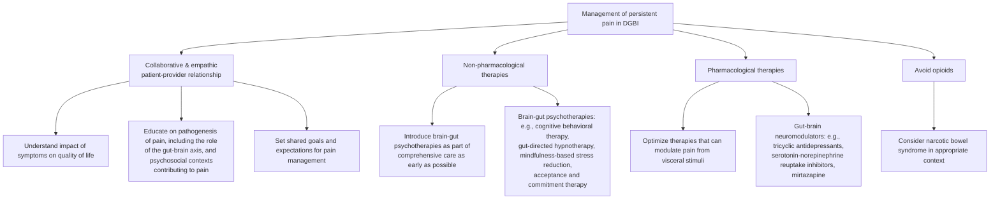

# AGA Clinical Practice Update on Management of Chronic Gastrointestinal Pain in Disorders of Gut–Brain Interaction: Expert Review

## Bibliographic Info

- **Article:** [Keefer L, Ko CW, Ford AC. AGA Clinical Practice Update on Management of Chronic Gastrointestinal Pain in Disorders of Gut–Brain Interaction: Expert Review. *Clinical Gastroenterology and Hepatology* 2021;19(12):2481–2488. doi:10.1016/j.cgh.2021.07.006.](https://doi.org/10.1016/j.cgh.2021.07.006)
- **Authors:** Laurie Keefer, Cynthia W. Ko, Alexander C. Ford
- **Year:** 2021 — print issue **December 2021**, Vol. 19, No. 12, pages 2481–2488. Citation year matches the file name; no discrepancy.
- **Journal/Publisher:** *Clinical Gastroenterology and Hepatology* (AGA Institute)
- **DOI:** [10.1016/j.cgh.2021.07.006](https://doi.org/10.1016/j.cgh.2021.07.006)
- **Type:** American Gastroenterological Association (AGA) Institute Clinical Practice Update — **Expert Review**. Commissioned and approved by the AGA Institute Clinical Practice Updates Committee and the AGA Governing Board; internal peer review by the Clinical Practice Updates Committee plus external peer review through standard journal procedures.

### Numbering and grading (as published)

- **Numbered:** yes — six statements, labelled **BEST PRACTICE ADVICE 1** through **BEST PRACTICE ADVICE 6**.
- **Graded:** no. METHODS verbatim: *"This was not a formal systematic review but was based on a review of the literature to provide best practice advice statements. **No formal rating of the quality of evidence or strength of recommendation was performed.**"* No GRADE ratings, no strength labels, no evidence levels anywhere in the document.
- Grades that appear in the text belong to **other bodies** and are described, not issued, by this update: the **2014 AGA guideline** on pharmacologic management of irritable bowel syndrome (IBS) suggested using selective serotonin reuptake inhibitors (SSRIs) in IBS; the **2021 American College of Gastroenterology (ACG) guideline** on IBS "did not make a strong recommendation for their use."

---

## Summary

Disorders of gut–brain interaction (DGBI) — including IBS, functional dyspepsia (FD), and centrally mediated abdominal pain syndrome (CAPS) — are present in **more than 40% of the population globally**. Most patients are treated first with therapies directed at visceral stimuli such as food and bowel movements; esophageal or gastroduodenal DGBI such as functional heartburn or FD are often treated with proton pump inhibitors (PPIs), which can be efficacious. First-line dietary treatments, antidiarrheals, and laxatives are used frequently in IBS but have limited evidence of efficacy for abdominal pain. This expert review addresses the subset whose pain **persists after therapies directed at visceral stimuli have failed**.

The update is explicitly bounded: it does **not** discuss complementary or alternative therapies such as marijuana, and it does **not** apply to abdominal wall or pelvic pain syndromes.

Its six Best Practice Advice statements build a four-part management frame (Figure 1): a collaborative, empathic, culturally sensitive patient–provider relationship; patient-friendly explanation of pain pathogenesis grounded in neuroscience and behavioral science; **avoidance of opioids**, with narcotic bowel syndrome considered in the appropriate context; **nonpharmacologic (brain–gut psychotherapy) treatment offered routinely and early**, not as a last resort; and pharmacologic treatment that distinguishes **visceral (peripheral) from centrally mediated** pain — peripherally acting drugs for the former, gut–brain neuromodulators (tricyclic antidepressants [TCAs], serotonin-norepinephrine reuptake inhibitors [SNRIs], mirtazapine; SSRIs least analgesic) started low and titrated for the latter.

The update supplies two clinically operative tables — network meta-analysis rankings of peripherally acting drugs for pain in IBS by predominant stool pattern (Table 1) and starting dose, titration, and side effects of gut–brain neuromodulators (Table 2) — plus an evidence grid by drug/therapy and DGBI (Appendix Table 1).

---

## Key Recommendations (verbatim)

All six statements are reproduced in full; the document gives **no evidence grade or strength rating** for any of them.

> **BEST PRACTICE ADVICE 1:** Effective management of persistent pain in disorders of gut–brain interaction requires a collaborative, empathic, culturally sensitive, patient–provider relationship.

> **BEST PRACTICE ADVICE 2:** Providers should master patient-friendly language about the pathogenesis of pain, leveraging advances in neuroscience and behavioral science. Providers also must understand the psychological contexts in which pain is perpetuated.

> **BEST PRACTICE ADVICE 3:** Opioids should not be prescribed for chronic gastrointestinal pain because of a disorder of gut–brain interaction. If patients are referred on opioids, these medications should be prescribed responsibly, via multidisciplinary collaboration, until they can be discontinued.

> **BEST PRACTICE ADVICE 4:** Nonpharmacologic therapies should be considered routinely as part of comprehensive pain management, and ideally brought up early on in care.

> **BEST PRACTICE ADVICE 5:** Providers should optimize medical therapies that are known to modulate pain and be able to differentiate when gastrointestinal pain is triggered by visceral factors vs centrally mediated factors.

> **BEST PRACTICE ADVICE 6:** Providers should familiarize themselves with a few effective neuromodulators, knowing the dosing, side effects, and targets of each and be able to explain to the patient why these drugs are used for the management of persistent pain.

---

## Key Findings / Claims

### Figure 1 — Management of persistent pain in disorders of gut–brain interaction

*Figure 1 — the four components of management of persistent pain in DGBI, recreated from the source figure. ([[aga-2021-chronic-gi-pain-dgbi]])*

### Best Practice Advice 1 — the patient–provider relationship

- Patients may have seen multiple providers without clear benefit or improvement and may be dissatisfied with their medical care.
- A **sensitive, nonjudgmental** approach integrates medical with psychosocial information.
- Cultural differences affect understanding, interpretation, and preferred management of pain → address pain **in a culturally sensitive manner** for effective reporting and treatment.
- **Obtain the medical history initially using a nondirective interview with open-ended questions**; closed-ended questions can be used later for clarification.
- Address the impact of symptoms on health-related quality of life (QoL) and daily functioning **explicitly**, using open-ended questions — builds rapport and targets interventions at improving function. Examples given: *"how do your symptoms interfere with your ability to do what you want in your daily life?"*; *"how are these symptoms impacting your life the most?"* Such questions also identify patients who might benefit most from behavioral health interventions.
- **Ask about symptom-specific anxiety.** Understanding that symptoms do not necessarily indicate cancer or mean surgery is required may relieve significant anxiety. Many patients are relieved to hear that **a diagnosis of IBS or FD does not shorten life expectancy**.
- Elicit the patient's perspective: *"what do you think is causing your symptoms,"* *"why are you coming to see me now,"* *"what are you most concerned about with your symptoms?"*
- Patient and provider should reach a **shared set of expectations and goals** around pain relief and management, revisited and modified as the therapeutic relationship develops.

### Best Practice Advice 2 — explaining pain

- **Four messages patients must hear from their gastroenterology provider:** (1) chronic DGBI pain is **real**; (2) pain is **perceived from sensory signals that are processed and modulated in the brain**; (3) **peripheral factors can drive increased pain**; (4) pain is **modifiable**.
- Unlike acute pain (informative, an alarm — e.g., a perforated appendix), chronic gastrointestinal pain is perpetuated by a complex interaction of nerve impulses that may be **unrelated to** (e.g., CAPS) or **out of proportion to** actual sensory input (e.g., postprandial fullness).
- These impulses originate from the enteric nervous system or digestive viscera and activate perceptual and behavioral brain networks that amplify the painful experience. Beyond the **sensory-discriminative** component (location, intensity), higher-order brain processes are **cognitive-evaluative** (based on prior experiences/expectations) and **affective-motivational** (unpleasantness / fear / desire to take action).
- Framing for patients: sensory inputs may result from **increased attention to innocuous (or normal) abdominal sensations** as the brain scans for potential threats from the gut, based on prior experience with infection, injury, or inflammation (e.g., postinfection IBS or FD); instead of down-regulating and being confident in one's safety, the brain mistakenly engages higher-order (unhelpful) processes.
- This framework is drawn from the **Fear-Avoidance model of pain**; it explains why some people have more pain than others despite a similar diagnosis, and instills hope that a change in one's approach to pain could improve function.
- **Context matters:** factors that *initiate* the problem (an infection, a surgery, a stressful life event) are not always the same as those that *perpetuate* it.
- **Psychological inflexibility**, or overfocusing on a cause or solution, is common in chronic pain syndromes and interferes with pain acceptance and response to treatment.
- **Pain solicitation** from members of the support system (routinely asking about pain) or psychological comorbidity (depression, anxiety, post-traumatic stress disorder, somatization) also interferes with pain processing.
- **Pain hypervigilance:** behaviors such as checking to see if pain occurs after a meal or bowel movement; patients may avoid activities important to them out of fear that symptoms will occur.
- **Pain catastrophizing** = overestimating the seriousness of the pain coupled with feelings of helplessness; associated with **higher health care utilization and opioid misuse**.
- **Providers should avoid engaging in pain catastrophizing** — avoid language such as the patient *"shouldn't be in so much pain,"* and avoid continuing to order tests to find the "cause" of pain.

### Best Practice Advice 3 — opioids and narcotic bowel syndrome

- Use of opioids for non–cancer-related pain is under heavy scrutiny owing to risks of opioid use disorders and overdose-related deaths.
- In patients with chronic gastrointestinal conditions including DGBI, opioid use is **not infrequent** but is **ineffective and potentially harmful**.
- Patients with **overlapping inflammatory bowel disease and DGBI** are more likely to be using opioids than those without a DGBI; likewise patients with DGBI compared with those with structural diagnoses.
- **Narcotic bowel syndrome** occurs in approximately **6%** of long-term opioid users in this population and is often under-recognized. Characterized by **chronic or frequently recurring paradoxic increases in abdominal pain despite continued or escalating dosages of opioids**; associated with significant impairment in QoL.
- Diagnosis is difficult because symptoms **overlap with IBS and CAPS**; narcotic bowel syndrome may **coexist with, and complicate**, management of patients with painful DGBI → **a high index of suspicion is needed**, because continued opioid treatment leads to clinical worsening and repeated medical evaluations.
- Open, collaborative relationship plus patient-friendly language explaining pathogenesis helps gain the patient's acceptance of the disorder and collaboration in management.
- **Tramadol is considered an opioid** and has the potential for addiction and other opioid-associated adverse events.
- **Primary treatment is cessation of opioids**, if possible; **behavioral and psychiatric approaches are needed for long-term management and reduced recidivism**.
- Patients may be referred to a gastroenterologist already on opioids → prescribe responsibly in a **multidisciplinary setting, with monitoring for efficacy, side effects, and potential for abuse**, until other forms of pain management can be implemented. The **Centers for Disease Control and Prevention (CDC) guideline for prescribing opioids for chronic pain** is named as a useful resource.

### Best Practice Advice 4 — brain–gut psychotherapies

- Brain–gut psychotherapies are **brief, evidence-based interventions adapted to address the gut–brain dysregulation** underlying DGBI; highly customizable by patient, symptoms, and context, and usable **across the spectrum of painful DGBI, including IBS, FD, and CAPS**.
- **Introduce the role of brain–gut psychotherapy at the outset of care.** Patients are more likely to adopt these recommendations when it does not feel like a last-ditch effort after every other intervention has failed, or a "punishment" for not improving with traditional approaches.
- These therapies are **well-tolerated with minimal side effects**.
- The provider should **identify a few mental health providers in their community** with whom to collaborate if such services are not already integrated.

| Brain–gut psychotherapy | What it targets / how it works | Evidence stated |
|---|---|---|
| **Cognitive behavior therapy** | Brief, **4–12 sessions**; remediation of skills deficits — pain catastrophizing, pain hypervigilance, visceral anxiety — via cognitive reframing, exposure, relaxation training, flexible problem solving | More than **30 randomized controlled trials (RCTs)** support its use for IBS, in multiple forms of delivery (self-administered, web-based, group, individual) |
| **Gut-directed hypnotherapy** | Somatic awareness and **down-regulation of pain sensations** through guided imagery and posthypnotic suggestions; deliverable in **groups or online**, and by **non–mental health professionals** | Systematic reviews and meta-analyses for pain relief in IBS; RCTs in CAPS and FD |
| **Mindfulness-based stress reduction** | Decreases visceral hypersensitivity, improves cognitive appraisal of symptoms, improves QoL; deliverable by **non–mental health professionals** | Effective in IBS and musculoskeletal pain syndromes; in IBS improves constipation, diarrhea, bloating, and gastrointestinal-specific anxiety, **especially in women** |
| **Acceptance and commitment therapy** | Pairs acceptance and mindfulness strategies with behavior change techniques to reduce suffering; improves **psychological flexibility** via metaphor, paradox, and experiential exercises — building a meaningful life despite chronic pain | Highly effective in the broader pain literature; research in painful DGBI specifically is **ongoing** |

- Defer decisions **as to the choice of treatment to the mental health provider**; the gastroenterology provider's job is familiarity with the approach, structure, and targets of each intervention.

### Best Practice Advice 5 — visceral vs centrally mediated pain, and peripherally acting drugs

- **Visceral (peripheral) pattern:** abdominal pain in DGBI is often **intermittent** and arises from peripheral stimulation, as seen in **visceral hypersensitivity** — common in both IBS and FD.
- **Central sensitization:** because of it, pain in DGBI can become **persistent even in the absence of ongoing peripheral stimulation**, and **worsen with minimal non-painful stimulation, termed allodynia**. May be accompanied by central nervous system changes visible on imaging.
- **Factors that predispose to central sensitization** in DGBI (stated as not limited to these): **a history of abuse, anxiety, catastrophizing, and hypervigilance**.
- **Peripherally acting drugs used in painful DGBI:** antispasmodics, peppermint oil, secretagogues, 5-hydroxytryptamine (5-HT) receptor drugs such as alosetron and tegaserod, nonabsorbable antibiotics (e.g., rifaximin), and the mixed opioid receptor drug eluxadoline. Studied extensively in IBS and ranked in several network meta-analyses. **Data for other painful DGBI are limited**, although tegaserod and rifaximin have been shown to be efficacious in RCTs in FD.
- **Rifaximin was not superior to placebo** in terms of likelihood of abdominal pain persisting in IBS with diarrhea, but **ramosetron, alosetron, and eluxadoline were efficacious**.
- **Eluxadoline is contraindicated** in patients with prior sphincter of Oddi problems or cholecystectomy, alcohol dependence, pancreatitis, or severe liver impairment. **Ramosetron is available only in Asia.**

**Table 1 — Relative efficacy of drugs for pain in IBS according to predominant stool pattern in network meta-analyses** (relative risk of persistent pain with 95% confidence interval; lower = better):

| Trial population | First-ranked drug | Second-ranked drug | Third-ranked drug |
|---|---|---|---|
| Trials recruiting patients with IBS irrespective of predominant bowel habit | Tricyclic antidepressants (0.53; 0.34–0.83) | Antispasmodics (0.64; 0.49–0.84) | Peppermint oil (0.64; 0.44–0.93) |
| Trials recruiting only patients with IBS with constipation | Linaclotide 290 mcg once daily (0.79; 0.73–0.85) | Tenapanor 50 mg twice daily (0.82; 0.75–0.90) | Linaclotide 500 mcg once dailya (0.83; 0.77–0.91) |
| Trials recruiting only patients with IBS with diarrhea | Ramosetron 2.5 mcg once daily (0.75; 0.65–0.85) | Ramosetron 5 mcg once daily (0.82; 0.75–0.89) | Alosetron 1 mg twice daily (0.83; 0.78–0.88) |

a The maximum approved dose for linaclotide in the United States is 290 mcg once daily.

- The relative efficacy of the secretagogues **linaclotide, lubiprostone, plecanatide, and tenapanor** for abdominal pain was examined in IBS with constipation: although all treatments were more efficacious than placebo, **linaclotide 290 mcg once daily ranked first and tenapanor 50 mg twice daily ranked second** in reducing the likelihood of abdominal pain persisting.
- TCAs, antispasmodics, and peppermint oil ranked first, second, and third for relief of abdominal pain in IBS irrespective of bowel habit, **although they performed similarly**.

### Best Practice Advice 6 — gut–brain neuromodulators

- The enteric nervous system shares its embryologic development with the brain and spinal cord and therefore shares neurotransmitters and receptors; the gut–brain axis — **norepinephric, serotonergic, dopaminergic** — is relevant to gut motor function and visceral sensation, so drugs acting on these pathways also affect gastrointestinal symptoms.
- **Low-dose antidepressants, now termed gut–brain neuromodulators**, are used in painful DGBI because they have **pain-modifying properties in addition to their known effects on mood**: TCAs, SSRIs, SNRIs, and others such as **mirtazapine**.
- **SSRIs act solely on 5-HT receptors and have the least analgesic effect.** In contrast, **TCAs, SNRIs, and mirtazapine have norepinephric effects and greater effects on pain**.
- **Start at a low dose and titrate according to symptom response and tolerability**, with patients **made aware of potential side effects**.
- **Opioid drugs should be avoided** in painful DGBI, but **naltrexone at a low dose may have analgesic effects without gastrointestinal side effects**.
- Where the evidence sits: TCAs ranked **second for the treatment of FD** in a network meta-analysis of RCTs — ahead of PPIs, even though **all 3 trials of TCAs recruited patients with symptoms refractory to PPIs**; **SSRIs were no more efficacious than placebo** in that analysis. In a network meta-analysis for IBS irrespective of predominant bowel habit, **TCAs ranked first** for efficacy for pain. **SNRIs are less well studied** — 1 trial of venlafaxine in FD showed no benefit, and evidence in IBS is limited to case series of patients taking duloxetine; there is, however, high-quality evidence that duloxetine is efficacious in other chronic painful disorders such as **fibromyalgia and low back pain**. **Mirtazapine** was used in 1 small trial in FD but seemed to have greater effects on **early satiety than epigastric pain**; a recent trial in IBS with diarrhea showed significant improvements in abdominal pain. An **open-label trial of low-dose naltrexone in IBS** showed a significant improvement in **pain-free days**.

**Table 2 — Starting dose, dose titration, and common side effects of gut–brain neuromodulators:**

| Drug class | Starting dose | Dose titration | Common side effects |
|---|---|---|---|
| Tricyclic antidepressantsa (e.g., amitriptyline or nortriptyline) | 10 mg at night | By 10 mg/wk or 10 mg/fortnight according to response to treatment and tolerability, to a **maximum of 30–50 mg at night** | Sedation, dry eyes, dry mouth, constipation |
| Serotonin-norepinephrine reuptake inhibitors (e.g., duloxetine) | 30 mg once daily | According to response to treatment and tolerability, to a **maximum of 60 mg once daily** | Sedation, dry mouth, constipation or diarrhea, anxiety, reduced appetite, nausea, headache, fatigue |
| Mirtazapine | 15 mg once daily | According to response to treatment and tolerability, to a **maximum of 45 mg once daily** | Sleep disorders, constipation or diarrhea, anxiety, increased appetite and weight gain, nausea, headache, fatigue |

a Secondary amines include desipramine and nortriptyline; tertiary amines include amitriptyline and imipramine. **Secondary amines may have fewer anticholinergic side effects than tertiary amines.**

**Appendix Table 1 — Evidence for efficacy of gut–brain neuromodulators and nonpharmacologic therapies in painful DGBI** (as tabulated by the update, citing the Rome Foundation working team report):

| Drug / therapy | Functional dyspepsia | Irritable bowel syndrome | Noncardiac chest pain | Functional heartburn | Functional biliary pain | Functional anorectal pain |
|---|---|---|---|---|---|---|
| Tricyclic antidepressants | Efficacious in a meta-analysis of 3 RCTs | Efficacious in a meta-analysis of 11 RCTs | Efficacious in a meta-analysis of 2 RCTs | Not efficacious in 1 RCT | No data | Efficacious in 1 case series |
| Selective serotonin reuptake inhibitorsa | Not efficacious in a meta-analysis of 2 RCTs | Efficacious in a meta-analysis of 7 RCTs | Not efficacious in a meta-analysis of 4 RCTs | Efficacious in 1 RCT | No data | No data |
| Serotonin-norepinephrine reuptake inhibitors | Not efficacious in 1 RCT | Efficacious in 2 case series | Efficacious in 1 RCT | No data | Efficacious in 1 case series | No data |
| Mirtazapine | Efficacious in 1 RCT | Efficacious in 1 RCT | No data | No data | No data | No data |
| Cognitive behavior therapy | Efficacious in 3 RCTs | Efficacious in a meta-analysis of 21 RCTs | Efficacious in RCTs | No data | No data | No data |
| Gut-directed hypnotherapy | Efficacious in 4 RCTs | Efficacious in a meta-analysis of 5 RCTs | Efficacious in 2 RCTs | Efficacious in 1 case series | No data | No data |
| Mindfulness-based stress reduction | No data | Efficacious in a meta-analysis of 3 RCTs | No data | No data | No data | No data |

a Table footnote: the 2014 AGA guideline on pharmacologic therapy for IBS suggested against using SSRIs for patients with IBS; the 2021 ACG guideline on treatment of IBS did not make a strong recommendation for their use. (The body text of the update states that the 2014 AGA guideline *suggested using* SSRIs in IBS — the two statements are not reconciled in the document.)

### Conclusions (as stated)

- Patients frequently present with co-existing psychiatric comorbidities and a limited range of coping skills.
- Avoiding opioid medications is critical to prevent development of opioid use disorders and narcotic bowel syndrome.
- **In patients who do not respond to the measures outlined, involvement of a pain management specialist may be required.**
- Overall, management of patients with DGBI with persistent pain requires a **multipronged approach**.

---

## Relevance to Wiki

- [[disorders-of-gut-brain-interaction]] — adds the whole chronic-pain management layer: the Figure 1 four-part frame, visceral vs centrally mediated pain and the predisposing factors for central sensitization, the four brain–gut psychotherapies with their evidence, peripherally acting drug rankings (Table 1), and gut–brain neuromodulator dosing/titration (Table 2).
- [[narcotic-bowel-syndrome]] — created from this update: definition, ~6% prevalence among long-term opioid users in this population, overlap with IBS and CAPS, and opioid cessation plus behavioral/psychiatric management.
- [[ibd-pain-management]] — corroborates the no-opioids stance and the neuromodulator-first strategy in patients with overlapping inflammatory bowel disease and DGBI, who are more likely to be on opioids.
- Entity pages this update touches but that were **not** edited in this ingest: [[irritable-bowel-syndrome]] (Table 1 drug rankings; TCA max dose), [[dyspepsia]]/functional dyspepsia (TCAs rank second, ahead of PPIs; tegaserod and rifaximin efficacious in RCTs), [[functional-heartburn]] (SSRIs efficacious in 1 RCT, TCAs not efficacious in 1 RCT), [[linaclotide]], [[tenapanor]], [[alosetron]], [[eluxadoline]], [[rifaximin]], [[tegaserod]].

---

## Contradictions / Open Questions

- **Tricyclic antidepressant dose ceiling.** This update caps TCAs at **30–50 mg at night** (starting 10 mg at night, titrated by 10 mg/wk or 10 mg/fortnight). [[irritable-bowel-syndrome]] currently carries the ACG IBS target ranges (amitriptyline 50–100 mg, desipramine 25–100 mg, nortriptyline 25–75 mg) from [[acg-2020-ibs]], and [[ibd-pain-management]] carries amitriptyline 10–100 mg/d and nortriptyline 50–150 mg/d from [[aga-2024-ibd-pain]]. Same tier; the ranges are stated for different populations and neither document withdraws the other.
- **SSRIs in IBS.** The update's body text says the **2014 AGA guideline suggested using** SSRIs for patients with IBS, while its own Appendix Table 1 footnote says that guideline **suggested against** using them; the document does not reconcile the two. It records that the **2021 ACG IBS guideline did not make a strong recommendation** for their use. [[irritable-bowel-syndrome]] currently records AGA 2022 as suggesting **against** SSRIs (conditional, low).
- **Rifaximin.** Not superior to placebo for likelihood of abdominal pain persisting in IBS with diarrhea in the network meta-analysis cited here, yet efficacious for pain in RCTs in FD — the update states both without resolving the difference across disorders.
- **No grading.** Because no quality-of-evidence or strength ratings were performed, the six Best Practice Advice statements carry no formal weight relative to graded society guidelines on the same drugs.
- **Scope limits.** Complementary/alternative therapies including marijuana are not discussed, and abdominal wall and pelvic pain syndromes are outside the update's scope — neither absence is evidence against those approaches.
- **Narcotic bowel syndrome diagnostic criteria** are not given in this update — it describes the clinical picture (paradoxic pain increase despite continued or escalating opioid doses) but provides no criteria set, duration threshold, or dose threshold.
