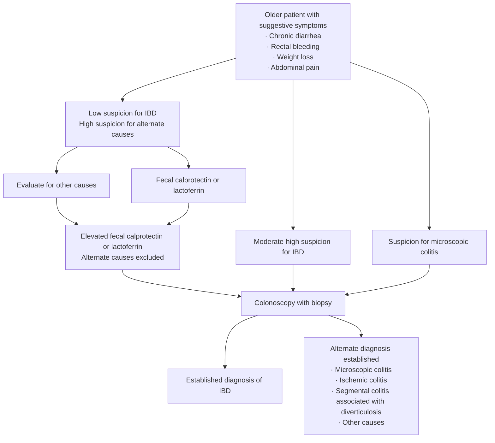

# AGA Clinical Practice Update on Management of Inflammatory Bowel Disease in Elderly Patients: Expert Review

## Bibliographic Info

- **Article:** [Ananthakrishnan AN, Nguyen GC, Bernstein CN. AGA Clinical Practice Update on Management of Inflammatory Bowel Disease in Elderly Patients: Expert Review. *Gastroenterology* 2021;160(1):445–451. doi:10.1053/j.gastro.2020.08.060.](https://doi.org/10.1053/j.gastro.2020.08.060)
- **Authors:** Ashwin N. Ananthakrishnan (Massachusetts General Hospital / Harvard Medical School), Geoffrey C. Nguyen (Mount Sinai Hospital Centre for IBD, University of Toronto), Charles N. Bernstein (University of Manitoba IBD Clinical and Research Centre)
- **Year:** 2021 (received July 18, 2020; accepted August 28, 2020)
- **Journal/Publisher:** *Gastroenterology* 2021;160(1):445–451 (AGA Institute — Clinical Practice Update, Expert Review)
- **DOI:** [10.1053/j.gastro.2020.08.060](https://doi.org/10.1053/j.gastro.2020.08.060)
- **Type:** AGA Institute Clinical Practice Update — **Expert Review**. Carries **15 Best Practice Advice statements** in Table 1, numbered **within three thematic groups** (Diagnosis 1–3; Treatment: general principles 1–10; Health maintenance 1–2) — there is **no single continuous 1–15 numbering**. **No GRADE ratings and no strength-of-recommendation or quality-of-evidence labels are assigned to any statement.** The paper's own caveat: "most clinical data to inform these practices are based on observational data or indirect evidence because elderly patients with IBD comprise a very small proportion of participants enrolled in IBD clinical trials or long-term pharmacovigilance initiatives." Commissioned and approved by the AGA Institute Clinical Practice Updates Committee and the AGA Governing Board; internal peer review by the CPU Committee plus external peer review through *Gastroenterology*.

---

## Summary

Elderly IBD is defined here as **age 60 years and older**, and the population is growing from two directions at once: incident elderly-onset disease and the aging of the prevalent IBD cohort. Roughly **1 in 160 elderly individuals** is affected; prevalence is rising **5.2% annually**; **up to 15% of IBD in North America and Asia is diagnosed after age 60**, with incidence **4–8 per 100,000** in persons older than 60. The Update's central argument is that **chronologic age alone is a poor decision variable** — comorbidity, frailty, functional status, polypharmacy and immunosenescence are what should drive diagnosis and drug selection.

On diagnosis, the point is that IBD is harder to separate from its mimics after 60. Compared with persons younger than 40, older patients are more likely to have colorectal cancer, ischemic colitis, segmental colitis associated with diverticulosis, NSAID-induced pathology, radiation enteritis/colitis, or microscopic colitis instead of IBD. First-line labs are CBC, serum albumin, serum ferritin and CRP, plus liver enzymes, urea and creatinine (comorbidity assessment **and** a baseline for toxicity monitoring), *C. difficile* stool testing in **all** new presentations of diarrhea regardless of antibiotic exposure, and selective culture/O&P. Colonoscopy with histologic confirmation remains the cornerstone, but the Update explicitly allows fecal calprotectin/lactoferrin and cross-sectional imaging to modify that when procedural or anesthesia risk is high.

On therapy, the *principles* of drug selection are declared **the same as in the general population** — the differences are safety, not efficacy. Systemic corticosteroids are out for maintenance in any age group and should be minimized for induction, with budesonide preferred for ileocolonic/right-sided CD and left-sided UC. Thiopurines carry the sharpest age-specific penalty (nonmelanoma skin cancer and lymphoproliferative disease), anti-TNF carries higher infection and malignancy signals in observational data, and vedolizumab/ustekinumab are the agents "maybe slightly favored" when complication risk is high. Tofacitinib's age-specific risks are herpes zoster and — at 10 mg twice daily with cardiovascular risk factors — venous thromboembolism. Critically, the Update states that **therapy choices should not be delayed and/or corticosteroid therapy prolonged out of concerns for immune therapy–associated risks**, and that routine avoidance of thiopurines solely on chronologic age is **not appropriate**.

Surgery, comorbidity optimization, and health maintenance round it out. NSQIP data show higher 30-day postoperative mortality and a higher complication rate (**34.5% vs 21.3%**) in older IBD patients; emergent surgery independently raises mortality; reduced anal sphincter tone may make an **end-ostomy preferable to ileal pouch–anal anastomosis** in selected older UC patients. Vaccination (influenza, pneumococcal, herpes zoster — inactivated zoster in the figure) should be scheduled **before** immunosuppression where possible, and the decision to continue or stop dysplasia surveillance in long-standing colitis becomes an explicit life-expectancy/candidacy-for-surgery judgment rather than an automatic interval.

---

## Key Findings / Claims

### Best Practice Advice statements — Table 1, verbatim

*Reproduced as published. Numbering restarts within each of the three groups; the document assigns **no** evidence grade or strength rating to any statement.*

**Table 1. Best Practice Advice Statements: Management of IBD in Older Patients**

**Diagnosis**

1. A diagnosis of IBD (CD, UC) should be considered in older patients who present with diarrhea, rectal bleeding, urgency, abdominal pain, or weight loss because up to 15% of new diagnoses of IBD occur in individuals older than 60 years.
2. Fecal calprotectin or lactoferrin may help prioritize patients with a low probability of IBD for endoscopic evaluation. Individuals presenting with hematochezia or chronic diarrhea with intermediate to high suspicion for underlying IBD, microscopic colitis, or colorectal neoplasia should undergo colonoscopy.
3. In elderly patients with segmental left-sided colitis in the setting of diverticulosis, consider a diagnosis of segmental colitis associated with diverticulosis in addition to the possibility of CD or IBD–unclassified.

**Treatment: general principles**

1. A comprehensive initial assessment of the older patient is important to collaboratively establish short- and long-term treatment goals and priorities.
2. Clinicians should risk-stratify patients based on the likelihood of severe clinical course, including assessment of perianal or penetrating phenotype, long-segment small bowel involvement (CD), extensive colitis (UC), anemia, hypoalbuminemia, elevated inflammatory markers, and weight loss, to determine an appropriate therapeutic strategy.
3. Systemic corticosteroids are not indicated for maintenance therapy. When used for induction therapy, when possible, clinicians should prefer nonsystemic corticosteroids (like budesonide) or even early biological therapy initiation if budesonide is not appropriate for the phenotype of the disease being treated.
4. Candidacy for immunosuppression should be based on chronologic age, as well as consideration for the patient's functional status, comorbidities including prior neoplasia and potential for infectious complications, and frailty.
5. When possible, immunomodulatory treatments with lower overall infection or malignancy risk (vedolizumab, ustekinumab) may be preferred in older patients. However, choice of treatment must also include assessment of clinical context, efficacy of treatments for specific phenotypes, rapidity of onset of action, and ability to achieve corticosteroid-free remission.
6. Consideration of thiopurine monotherapy for maintenance of remission in older patients should balance the convenience of its oral route of administration and lower cost with relatively lower efficacy, slow onset of action, and an increase in risk of nonmelanoma skin cancers and lymphoma in this population.
7. Older patients with IBD have a greater burden of comorbidity than younger patients. Optimization of comorbidity is important to minimize the risks associated with IBD and its treatment and guide selection of the appropriate agent.
8. The decision about the timing and type of surgery in older patients with IBD should incorporate disease severity, impact on functional status and independence, risks and effectiveness of medical therapy, candidacy for surgery, and risk of postoperative complications.
9. The increased risk of fracture, venous thromboembolism, infections including pneumonia, opportunistic infections, and herpes zoster and risk of skin and nonskin cancers (including lymphoma) should be incorporated in therapeutic decisions.
10. Care for the older patient with IBD should be multidisciplinary, actively engaging gastrointestinal specialists, primary care providers (including geriatricians), other medical subspecialists (eg, cardiologists) mental health professionals, general or colorectal surgeons, nutritionists, and pharmacists. Engaging with family and caregivers may also be appropriate in formulating a plan.

**Health maintenance**

1. Clinicians should facilitate adherence to vaccination schedules, including influenza, pneumococcal, and herpes zoster vaccines, in older patients with IBD. If possible, vaccination should be scheduled before starting immunosuppression.
2. The decision to continue or stop colorectal cancer surveillance in older patients with long-standing UC or Crohn's colitis should be made incorporating age, comorbidity, overall life expectancy, likelihood of endoscopic resectability of the lesion, and candidacy for colon resection surgery.

---

### Epidemiology and natural history

- **Elderly is defined as 60 years and older.**
- ~**1 in 160** elderly individuals is affected by IBD; prevalence rising **5.2% annually**.
- **Up to 15%** of IBD in North America and Asia is diagnosed **after age 60**; incidence **4–8 per 100,000** in persons older than 60 years.
- **Mortality:** no difference in mortality rates for older vs younger age of onset in UC; elderly patients are more likely to die of CD — **33/10,000 person-years** vs middle-age **5.6/10,000** vs young **1/10,000**.
- **Presenting phenotype (CD):** elderly more likely to present with **isolated colonic disease (44%)** and less likely to have penetrating or perianal disease.
- **Presenting phenotype (UC):** elderly more likely to have **left-sided disease, occurring in 40%**.
- More benign phenotypes suggest better outcomes, but some data show **elderly-onset UC more likely to undergo colectomy**. "In attempting to predict disease course, it may be more prudent to consider specific disease characteristics rather than chronologic age."

### Diagnosis — Figure 1 algorithm

*Recreated from Figure 1, "Diagnostic algorithm for elderly patients with inflammatory bowel disease."*

- **Mimics to exclude in persons older than 60** (vs younger than 40): colorectal cancer, ischemic colitis, segmental colitis associated with diverticulosis, NSAID-induced pathology, radiation enteritis or colitis, microscopic colitis. "Because the medical and surgical management of these conditions varies substantially, a vigorous approach to confirming the diagnosis of IBD is important in the elderly population."
- **First diagnostic steps — labs:** complete blood count, serum albumin, serum ferritin, C-reactive protein. **Liver enzymes, urea and creatinine** serve both to assess underlying comorbidities and as a **baseline for toxicity monitoring**.
- **Stool testing for *Clostridium difficile* in all new presentations of diarrhea, regardless of antibiotic use history**; selective testing of stool for culture and ova and parasites may be appropriate.
- **Cross-sectional imaging with CT** is appropriate in elderly persons presenting with acute symptoms, especially when abdominal pain is prominent, because it can also rule out other diagnoses (eg, ischemic colitis, diverticular disease).
- **Colonoscopy with histologic confirmation remains a cornerstone of diagnosis** — but add consideration of procedural risk and anesthesia tolerance in the presence of comorbidities and polypharmacy. Where the indication for colonoscopy is equivocal or relatively high risk, noninvasive stool markers of inflammation (fecal calprotectin) and imaging may aid decision making.

### Multidisciplinary care and polypharmacy

- National Social Life Health and Aging Project sample: nearly a third (**29%**) of persons **aged 57–85 years** were using **at least 5 prescription drugs**, and **4%** of the cohort were at risk of **major drug–drug interactions** — the basis for pharmacist support.
- Comanagement with a geriatrician for multiple coexisting chronic diseases; mental health access for high prevalence of depression; social workers/health care navigators for access and home support.

### Medical therapy — Figure 2 algorithm

*Recreated from Figure 2, "Treatment algorithm for elderly patients with inflammatory bowel disease." The asterisked parentheses are the figure's own annotations.*

**Three parallel assessments at new diagnosis of IBD:**

| Assessment | Outputs |
|---|---|
| Assess prognostic factors · Assess disease phenotype · Assess psychosocial supports & needs | Mild disease / Severe disease |
| Assess comorbidity, frailty, and functional status | Fit patient / Frail patient |
| Health maintenance | General health maintenance + vaccination (below) |

**Induction**

- Steroids (preference for budesonide over prednisone)
- Anti-TNF (assess ability to administer and adhere to prescribed regimen)
- Vedolizumab (*maybe slightly favored in those with higher risk of complication)
- Ustekinumab (*maybe slightly favored in those with higher risk of complication)
- Tofacitinib (*higher risk of VTE with 10mg BID in those with cardiac risk factors)

**Maintenance**

- Anti-TNF (assess ability to administer and adhere to prescribed regimen)
- Vedolizumab (*maybe slightly favored in those with high risk of complication)
- Ustekinumab (*maybe slightly favored in those with high risk of complication)
- Thiopurines (in select cases; higher risk of lymphoma and NMSC when compared to more targeted biologics)
- Tofacitinib 5mg BID

**Health maintenance (figure branch)**

- *General health maintenance:* depression screen · optimize comorbidity · colon & non-colon cancer screening
- *Vaccination:* pneumococcal · influenza (annual) · **inactivated** zoster

**Framing statements**

- "The principles behind the selection of optimal medical therapy in elderly patients with IBD based on disease presentation and prognostic factors is similar to that of the general population."
- There is **little evidence for age-related differences in efficacy** of various therapeutic agents; the differences are **safety** considerations, given higher frequency of malignancy and immunosenescence.
- In addition to chronologic age, assess **overall fitness and frailty**. **Pretreatment frailty was associated with an increased risk of infections after immunomodulator or anti-TNF treatment or after surgery.**
- **Pre-therapy screening is the same as in younger patients:** hepatic and renal function, latent tuberculosis, hepatitis B, and thiopurine methyl transferase status before thiopurine use.
- **"Despite the potential risks for immunomodulatory therapy in elderly patients, therapy choices should not be delayed and/or corticosteroid therapy prolonged out of concerns for immune therapy–associated risks."**

### Aminosalicylates

- Proven efficacy for induction and maintenance in **mild to moderate UC**; efficacy **less well established in CD**, with most clinical trials showing either no or a modest benefit over placebo.
- Lack of systemic immunosuppressive effect makes them frequently relied on in older patients — **more than two thirds of older patients with UC and CD receive mesalamine** in population-based cohorts.
- Adverse effects infrequent, but the rare complication of **interstitial nephritis may be especially pertinent in older patients** because of superimposed age-related decline in renal function.

### Corticosteroids

- Efficacy appears **similar in elderly and younger patients**.
- Elderly patients are **more likely to be given corticosteroids for maintenance** than younger patients, despite evidence that they are **less likely to be corticosteroid dependent (21% vs 30%)**.
- Corticosteroid-related adverse effects may not be more frequent in the elderly, but older patients have a greater prevalence of **diabetes, hypertension, glaucoma, cataract, osteoporosis, and cognitive impairment**, all of which corticosteroids may exacerbate; also anxiety, depression, fatigue, and poor sleep quality.
- **Budesonide:** high first-pass metabolism, only **modestly lower efficacy** than conventional systemic corticosteroids in CD with fewer adverse effects; **budesonide-MMX** effective for mild to moderate **left-sided UC**; long-term budesonide **less likely to cause adrenal axis suppression**. → **Budesonide may be preferred over conventional corticosteroids in older patients with ileocolonic or right-sided luminal CD or left-sided UC.**
- Any use of systemic corticosteroids should prompt consideration of **corticosteroid-sparing therapy** and **measures to mitigate osteoporosis risk** should a prolonged course be required.
- **Topical corticosteroids (or aminosalicylates)** may be effective for distal colonic disease but may be **poorly tolerated with limited mobility or weak sphincter tone** — a **lower-volume formulation (such as foam)** may be preferred.
- Corticosteroids have **no efficacy for maintaining remission in IBD in any age group** → corticosteroid use for IBD maintenance therapy should be avoided.
- Initiation of therapies (biologic or small molecule) with **rapid onset of action** may reduce or eliminate the need for corticosteroids.

### Thiopurines and methotrexate

- Effective for maintaining remission in both CD and UC, but data are limited, particularly in the elderly. **More than a third** of elderly patients had been exposed to thiopurines within **5 years** of IBD diagnosis in one cohort.
- Among elderly patients, **higher frequency of adverse events including hepatotoxicity**, although **acute pancreatitis was less likely** to occur.
- **Nonmelanoma skin cancer** with thiopurine use: **4.04 vs 0.66 per 1000** in those **older than 65 years** vs **younger than 50 years**.
- **Lymphoproliferative disorders** with thiopurine use: **5.41 vs 0.37 per 1000 person-years** (elderly vs younger than 50 years); in **thiopurine nonusers** the age-related difference was far smaller — **1.68 vs 0 person-years**.
- Balance: oral administration, convenience, low cost **vs** inferior efficacy, delayed efficacy (prolonging corticosteroid exposure), and higher absolute risk of serious treatment-related malignancy.
- **"Routine discontinuation or absolute avoidance of their use solely based on chronologic age is not appropriate, and consideration of thiopurine use should be on a case-by-case basis."**
- **Methotrexate** is an attractive option in older patients with **CD**, with data supporting induction and maintenance of remission; it can also **substitute for a thiopurine in combination therapy** in individuals considered at high risk for thiopurine-related adverse effects including malignancy.

### Anti-TNF biologics

- **Effectiveness:** mixed. In 114 biologic-naive patients started on anti-TNF, older patients had lower persistence and were **more than half as likely** to achieve corticosteroid-free remission at 12 months (**31% vs 67%**). Lower clinical response at **10 weeks** in older patients but **no difference at later timepoints**. A meta-analysis found **no difference in efficacy of infliximab and golimumab** in CD and UC between older and younger patients.
- **Safety — observational study, 95 elderly initiated on anti-TNF vs 190 matched younger controls:** severe infections **11% vs 2.6%**, cancer **3% vs 0%**, death **10% vs 1%** (cause of mortality not specified). Rates were also higher than in **older non–anti-TNF users** (0.5% severe infections, 2% cancer, 2% death).
- **A fifth of elderly patients discontinued anti-TNF within 12 months** of initiation.
- Multicenter Spanish cohort, older-onset vs younger IBD: **any infection 46% vs 26%**; **malignancy 7.6% vs 1.8%**.
- **Meta-analysis across all anti-TNF indications:** pooled prevalence of infection **13% in older biologic users vs 6% in younger users** (**OR 2.28; 95% CI 1.57–3.31**), and vs older non-biologic controls (**OR 3.60; 95% CI 1.62–8.01**). **3-fold higher malignancy risk** in older vs younger biologic users (**OR 3.07; 95% CI 1.98–4.62**) — **but not** when compared with older control individuals.
- Limitation: these studies **cannot separate the independent effect of anti-TNF** from concomitant steroid or immunomodulator therapy.
- **"In many older patients, particularly those who are not frail, the benefit of anti-TNF biologic therapy will likely outweigh the small increase in risk."**
- **Combination therapy (immunomodulator + anti-TNF) — evidence is mixed:** post hoc analysis of REACT found benefit of early combined intervention **similar in older and younger patients with no increase in risk**; a separate cohort found older patients on combination therapy **twice as likely to stop therapy early** than those on anti-TNF monotherapy (**HR 2.20; 95% CI 1.12–4.32**).
- **When to combine vs not:** combination therapy may be appropriate with **severe disease including deep ulceration, extensive bowel involvement, and penetrating phenotype**; **anti-TNF monotherapy** may be the preferred initial option in the setting of **significant frailty, comorbidity, or infection risk**.

### Vedolizumab, ustekinumab, tofacitinib, cyclosporine

- **Vedolizumab:** limited clinical trial data suggest effectiveness in CD and UC is **similar between older and younger patients**, with **no age-related difference in any adverse events including infections and serious infections**. Gut specificity → less systemic immunosuppression and a favorable safety profile. However, a comparison of **131 patients initiated on anti-TNF vs 103 on vedolizumab** showed **no difference in infection rates at 1 year** in either CD or UC, **although confidence intervals were quite wide**.
- **Ustekinumab:** **no published data examining safety specifically in older patients with IBD**; a limited case series of **24 patients with psoriasis** showed few infection events.
- **Tofacitinib:** most safety data are **indirect, from rheumatology**. Higher frequency of serious infections in older patients on tofacitinib vs placebo, but **similar to the risk observed in younger individuals**. Pooled phase 3 / long-term rheumatoid arthritis data identified **16% of patients aged ≥65 years**; serious adverse events were more common in older than younger users at **both the 5-mg and 10-mg twice-daily dose**, but a similar effect was seen among **placebo** users — suggesting **no incremental age-related increase in risk**.
  - **Herpes zoster** in older patients: **5.5 (5 mg) and 3.1 (10 mg) per 100 patient-years vs 0 for placebo**.
  - **VTE including pulmonary embolism** in older rheumatoid arthritis patients **with cardiovascular risk factors** on **tofacitinib 10 mg twice daily: 0.4 per 100 patient-years vs 0.07 per 100 patient-years on anti-TNF** — the interim analysis that led to placement of a **boxed warning**.
- **Cyclosporine:** rarely used in older patients with IBD, but **may be considered for acute severe UC as rescue therapy** where anti-TNF biologics are contraindicated or previously failed.

### Surgery

- Data on whether older age raises postoperative complication risk are **conflicting** — some small studies found no difference.
- **ACS NSQIP database:** **30-day postoperative mortality higher** in older patients with **both CD and UC** vs younger controls; **postoperative complications 34.5% vs 21.3%**. Older patients also had higher rates of **postoperative infection; venous thromboembolic events; bleeding requiring blood transfusion; and cardiac, renal, and neurologic complications including stroke and coma.**
- **Emergent surgery was independently associated with an increase in mortality.**
- **Choice of operation differs in UC:** due to **reduced anal sphincter tone**, older patients may have **worse functional outcomes from an ileal pouch–anal anastomosis**; an **end-ostomy may offer more functional independence in select patients**.
- **Pharmacologic thromboprophylaxis** is important in older patients undergoing surgery because of higher VTE risk.
- **Assessment and optimization of nutritional status before surgery** may reduce postoperative morbidity and facilitate recovery.

### Health maintenance

- Older patients are at higher risk for vaccine-preventable illness, particularly on systemic immunosuppression; **influenza and herpes zoster vaccines are underused** in persons with IBD, where risk of influenza, pneumococcal pneumonia, or shingles is increased — **especially in persons using immunomodulatory drugs**.
- Gastroenterologists often defer vaccination to primary care, but **patients with IBD of any age may have no primary care provider**, and primary care providers may be **uncertain about the safety and timing of vaccines in persons on immunomodulatory drugs**.
- Ensure older patients with IBD are **up to date with age-appropriate cancer screenings recommended for the general population**.
- **Chronic colitis (usually of at least 8 years duration)** related to UC or CD confers approximately a **2-fold risk of colorectal cancer** vs age-matched community counterparts. **Relative risk is higher in younger patients with IBD; absolute risk is higher in elderly patients** as CRC becomes increasingly common → vigilance toward ongoing surveillance colonoscopy and readiness to address dysplastic lesions.
- **Adenomas and serrated polyps are also more common in elderly individuals.**
- Persistence with surveillance colonoscopy with advancing age should consider **anesthesia and perforation risks associated with the procedure itself, comorbidity, overall life expectancy, and candidacy for colon resection surgery**.

---

## Relevance to Wiki

- **[[crohns-disease]]** — adds an elderly/older-adult block under Special Considerations: elderly-onset phenotype (isolated colonic disease 44%, less penetrating/perianal), CD mortality 33/10,000 person-years, budesonide preference for ileocolonic/right-sided disease, thiopurine NMSC and lymphoproliferative absolute risks, the anti-TNF monotherapy-vs-combination split by frailty, and postoperative risk.
- **[[ulcerative-colitis]]** — adds the elderly-onset UC block: left-sided disease in 40%, budesonide-MMX for left-sided UC, topical therapy tolerability with weak sphincter tone, cyclosporine as rescue when anti-TNF is contraindicated, and the IPAA-vs-end-ostomy decision driven by anal sphincter tone.
- **[[inflammatory-bowel-disease]]** — supplies an age-specific overlay on the general framework (definition of elderly as ≥60 y, epidemiology, the "principles are the same, safety differs" framing, the multidisciplinary team composition).
- **[[ibd-preventive-care]]** — corroborates and adds the older-adult vaccination rationale (influenza, pneumococcal, **inactivated** zoster; schedule before immunosuppression) and the "no primary care provider / PCP uncertainty" gap.
- **[[segmental-colitis-associated-with-diverticulosis]]** — named explicitly as a diagnosis to consider in elderly patients with segmental left-sided colitis and diverticulosis, alongside CD and IBD-unclassified.
- **[[corticosteroids-ibd]]**, **[[thiopurines]]**, **[[anti-tnf-agents]]**, **[[vedolizumab]]**, **[[il-23-and-il-12-23-inhibitors]]**, **[[jak-inhibitors]]**, **[[mesalamine-5-asa]]**, **[[calcineurin-inhibitors]]** — each gains age-specific safety data (budesonide preference and osteoporosis mitigation; thiopurine absolute malignancy risks; anti-TNF infection/malignancy odds ratios; vedolizumab's null age effect; ustekinumab's absent IBD-specific data; tofacitinib zoster and VTE rates; mesalamine interstitial nephritis with age-related renal decline; cyclosporine as ASUC rescue).
- **[[colonoscopy-surveillance]]** / **[[colorectal-cancer]]** — the "when to stop surveillance" inputs in long-standing colitis (age, comorbidity, life expectancy, endoscopic resectability, candidacy for colon resection surgery).
- **[[microscopic-colitis]]**, **[[colon-ischemia]]**, **[[chronic-diarrhea]]** — reinforced as principal mimics of new-onset IBD after age 60.

---

## Contradictions / Open Questions

- **No formal evidence grading.** Expert Review format; Best Practice Advice statements carry no GRADE rating, no strength of recommendation, and no quality-of-evidence label. Numbering restarts within each of the three groups.
- **Best Practice Advice (Treatment) 4 reads "Candidacy for immunosuppression should be based on chronologic age, as well as consideration for the patient's functional status, comorbidities … and frailty."** The surrounding text argues the opposite emphasis — that chronologic age alone is a poor basis for decisions, and that "routine discontinuation or absolute avoidance of [thiopurines] solely based on chronologic age is not appropriate." Read the statement as adding comorbidity, function and frailty to age, not as endorsing age alone.
- **Vedolizumab and ustekinumab are positioned as "maybe slightly favored" in higher complication risk, but the supporting data are thin** — the one head-to-head infection comparison (131 anti-TNF vs 103 vedolizumab) was null with wide confidence intervals, and there are **no published safety data for ustekinumab specifically in older patients with IBD**.
- **Anti-TNF malignancy signal is not consistent across comparators:** a 3-fold higher malignancy risk in older vs younger biologic users, but **no excess when compared with older control individuals** — and none of the observational studies can separate anti-TNF from concomitant steroid or immunomodulator exposure.
- **Combination therapy in older patients is unresolved** — REACT post hoc found no added risk; a separate cohort found twice the rate of early therapy discontinuation.
- **Tofacitinib safety is extrapolated from rheumatoid arthritis**, not IBD; the boxed-warning VTE signal comes from an interim analysis in RA patients with cardiovascular risk factors.
- **Surgical risk data conflict** — small studies show no difference in postoperative complications by age; the NSQIP analysis shows higher 30-day mortality and complications.
- **Newer positioning frameworks supersede Figure 2 for drug sequencing.** Figure 2 predates the IL-23 (p19) inhibitors and the selective JAK-1 inhibitors now ranked on [[crohns-disease]] and [[ulcerative-colitis]] by the AGA living guidelines; this Update's contribution is the **age- and frailty-specific safety overlay**, not the efficacy ordering.
