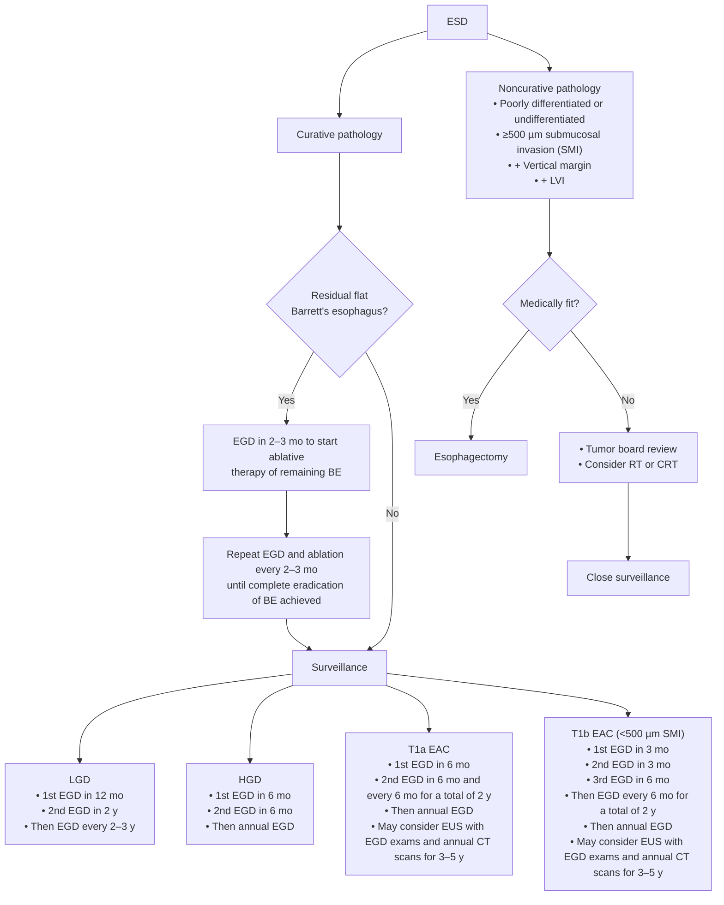

## Bibliographic Info
- **Article:** [Wang AY, Hwang JH, Bhatt A, Draganov PV. AGA Clinical Practice Update on Surveillance After Pathologically Curative Endoscopic Submucosal Dissection of Early Gastrointestinal Neoplasia in the United States: Commentary. *Gastroenterology* 2021;161:2030–2040.](https://doi.org/10.1053/j.gastro.2021.08.058)
- **Authors:** Andrew Y. Wang, Joo Ha Hwang, Amit Bhatt, Peter V. Draganov
- **Year:** 2021
- **Journal/Publisher:** *Gastroenterology* (AGA Institute)
- **DOI:** [10.1053/j.gastro.2021.08.058](https://doi.org/10.1053/j.gastro.2021.08.058)
- **Type:** guideline (AGA Institute Clinical Practice Update — Commentary)

**Format of the advice.** This Clinical Practice Update is a **Commentary**. It contains **no numbered Best Practice Advice statements and no GRADE or evidence-strength ratings** — the advice is narrative plus five suggested-surveillance tables. The authors state that the level of evidence supporting most of the advice is **generally low**, that post-ESD surveillance guidance rests more on expert opinion than rigorous evidence, and that NCCN and other oncologic guidelines were not constructed with [[endoscopic-submucosal-dissection|ESD]] in mind.

---

## Summary

Post-[[endoscopic-submucosal-dissection|ESD]] surveillance in the United States is extrapolated from Asian data, from polypectomy and piecemeal [[endoscopic-mucosal-resection|EMR]] experience, and from guidelines written for local surgical resection — none of which map cleanly onto en bloc endoscopic resection. This Update proposes surveillance schedules for **five GI sites** (esophageal squamous, Barrett's/esophageal adenocarcinoma, gastric, colonic, rectal) after ESD whose pathology was deemed **curative**, and defines what "curative" and "R0" mean in an ESD specimen.

The central practical problem the Update addresses is pathologic: many Western pathologists do not process ESD specimens by the Japanese method (2–3 mm serial sectioning, special stains for lymphovascular invasion), and there is no uniformly accepted definition of a negative (R0) margin. Because of that uncertainty, the authors argue for **closer post-ESD surveillance in the US** than Asian protocols would demand, until Western pathology practice standardizes and longer-term outcome data mature.

Surveillance is technique-dependent as well as interval-dependent: high-definition endoscopy augmented by image-enhancing modalities (dye-based or electronic chromoendoscopy), optical magnification where available, central and peripheral biopsies of the post-ESD scar, and careful inspection of the rest of the organ for **metachronous** lesions — the dominant late failure mode at every site.

The suggested intervals **do not apply to hereditary malignancy syndromes** ([[hereditary-diffuse-gastric-cancer|hereditary gastric cancer]], [[lynch-syndrome]]), which may need definitive surgery or more intense surveillance.

---

## Key Findings / Claims

### Criteria for a pathologically curative ESD — all five must be satisfied

- Circumferential (horizontal) **and** deep (vertical) margins microscopically devoid of malignant cells (**R0 resection**)
- **Well (G1) or moderate (G2) differentiation**
- **Absence of lymphovascular invasion**
- **Low-grade (grade 1) or absent tumor budding**
- **Absence of deep invasion**

### Deep-invasion thresholds — organ-specific, and this is the decision

| Cancer type / organ | Submucosal invasion below the muscularis mucosae still considered curative |
|---|---|
| Esophageal and gastric **adenocarcinoma** | **<500 µm** |
| Colorectal **adenocarcinoma** | **<1000 µm** |
| Esophageal **squamous cell carcinoma** | **No depth is curative once the muscularis mucosae is reached** — invasion of the muscularis mucosae (m3) or submucosa is *not* considered curative, given the increased risk of LN metastasis |

### What counts as R0 in a field of premalignant mucosa

- There is **no minimal distance requirement** between tumor cells and the resection margin for ESD — unlike surgical R0 resection.
- When the lesion sits inside a field that itself contains lesser dysplasia ([[barretts-esophagus|Barrett's esophagus]], severe [[atrophic-gastritis]]), the consensus advice is to consider the resection **R0 if the highest histologic grade of the target neoplasm is not present at the margins**. Example given: R0 for HGD in BE when a large HGD nodule was completely removed but flat LGD is present at the specimen margin.
- **R1 horizontal-margin** positivity (microscopic) with otherwise low-risk histology → additional therapy by ESD or EMR is possible.
- **R1 deep/vertical-margin** positivity after ESD of a malignant neoplasm → **prompt referral for surgery**.

### Esophageal dysplasia and squamous cell carcinoma

- Local recurrence usually occurs **within 1 year**, but can present up to **2–3 years** later.
- Metachronous esophageal cancer after endoscopic resection of SCC: **annual incidence 2.2%–9%**.
- LN metastasis risk with T1a–m3 lesions invading the muscularis mucosae: **0%–26.7%** across small studies.
- **T1a–m3 and T1b–Sm1 SCC are noncurative resections.** If unfit for esophagectomy → multidisciplinary review and close endoscopic follow-up, potentially augmented by [[endoscopic-ultrasound|EUS]] and periodic CT of chest and abdomen or PET-CT to surveil for LN metastasis and more distant spread. Chemoradiotherapy is also a consideration.
- If ESD is noncurative due to a positive horizontal margin, endoscopic treatment of residual disease and close surveillance is advised — additional endoscopic resection (EMR or ESD), or ablation (argon plasma coagulation, [[radiofrequency-ablation|RFA]], photodynamic therapy, cryotherapy).
- **Ablation is explicitly not recommended as first-line treatment for SCC** — it does not allow pathologic staging to assess LN metastasis risk and guide further management.

**Table 1 — Suggested surveillance for esophageal dysplasia and SCC removed by ESD meeting histopathologic criteria for curative resection**

| Variable | First follow-up endoscopy (mo) | Second follow-up endoscopy (mo) | Subsequent endoscopic examinations | Need for EUS surveillance | Need for radiographic surveillance | Estimated risk of LN metastasis (affected by size), % |
|---|---|---|---|---|---|---|
| LGD | 6–12 | 12 | Annually | No | No | 0 |
| HGD | 6–12 | 6–12 | 6–12 mo; after 2 y from ESD then annually | No | No | 0 |
| T1a, m1–m2 esophageal SCC | 3–6 | 3–6 | 6–12 mo; after 2 y from ESD then annually | May consider EUS with each EGD | May consider CT scan of chest and abdomen annually for 3–5 y | 8–18 |

*"After 2 y" includes the first and second follow-up endoscopies.*

### Barrett's dysplasia and esophageal adenocarcinoma

- Objective of treatment: endoscopic resection of visible or nodular dysplasia, **followed by complete ablation of any remaining BE** and associated (flat and/or invisible) dysplasia.
- **Wait 2–3 months after ESD** for the post-ESD ulcer to heal, in conjunction with high-dose [[proton-pump-inhibitors|PPI]] therapy, before starting endoscopic mucosal ablative therapy (typically [[radiofrequency-ablation|RFA]]) of any residual BE. Repeat ablation every **2–3 months until complete eradication of intestinal metaplasia (CE-IM)** is achieved, then move to surveillance.
- Surveillance endoscopy assesses not only recurrent/metachronous dysplasia but **recurrent nondysplastic BE**, which can present as **subsquamous columnar epithelium**.
- **All patients with noncurative ESD of EAC should be discussed at a multidisciplinary tumor board.**
- **Stricture prevention:** resection of **>75% of the esophageal circumference** risks post-ESD stricture. Prevention — injection of steroids into the ESD defect, or ingested **viscous budesonide slurry**. In patients at increased risk, perform an [[upper-endoscopy|EGD]] at **4 weeks** — not for surveillance, but so that endoscopic dilation can be started before a severe stricture forms — and repeat endoscopy with dilation **every 1–2 weeks until stricture resolution**.

**Table 2 — Suggested surveillance for Barrett's dysplasia and EAC removed by ESD meeting histopathologic criteria for curative resection**

| Variable | First stage of follow-up endoscopy and treatment (if residual flat BE remains) | Second stage of follow-up endoscopy (after ESD if no BE remains, or after CE-IM is achieved) | Subsequent endoscopic examinations | Need for EUS surveillance | Need for radiographic surveillance | Estimated risk of LN metastasis (affected by size), % |
|---|---|---|---|---|---|---|
| LGD | 2–3 mo to initiate mucosal ablative therapy, then repeat every 2–3 mo until CE-IM achieved | At 12 mo for surveillance after CE-IM/ESD | At 3 y after CE-IM/ESD (a 2-y interval), and then every 2–3 y | No | No | 0 |
| HGD | 2–3 mo to initiate mucosal ablative therapy, then repeat every 2–3 mo until CE-IM achieved | At 6 mo for surveillance after CE-IM/ESD | 6 mo later, and then annually | No | No | 0 |
| T1a EAC (m1–m3) | 2–3 mo to initiate mucosal ablative therapy, then repeat every 2–3 mo until CE-IM achieved | At 6 mo for surveillance after CE-IM/ESD | Every 6 mo for 2 y after CE-IM/ESD, and then annually | May consider EUS with each EGD | May consider CT chest and abdomen annually for 3–5 y | 1–2 |
| T1b, Sm1 EAC (<500 µm submucosal invasion) | 2–3 mo to initiate mucosal ablative therapy, then repeat every 2–3 mo until CE-IM achieved | At 3, 6, and 12 mo for surveillance after CE-IM ESD | Every 6 mo for a total of 2 y after CE-IM, and then annually | May consider EUS with each EGD | May consider CT chest and abdomen annually for 3–5 y | 7.5 |

*CE-IM = complete eradication of intestinal metaplasia (endoscopic and histologic).*

**Figure 1 — pathway for clinical management after ESD for Barrett's dysplasia and esophageal adenocarcinoma**

*Figure 1 — pathway for clinical management after ESD for Barrett's dysplasia and esophageal adenocarcinoma, including post-resection ablative therapy and subsequent surveillance. CRT, chemoradiotherapy; LVI, lymphovascular invasion; RT, radiation therapy; SMI, submucosal invasion; T1a, mucosally invasive cancer; T1b, submucosally invasive cancer.*

### Gastric dysplasia and adenocarcinoma

- Criteria for curative endoscopic resection of [[gastric-adenocarcinoma|gastric adenocarcinoma]] derive largely from Japanese experience, with **limited validation in US datasets**.
- **Metachronous gastric cancer after curative ESD for early gastric cancer (EGC): 5.9% within 3 years.** Testing for and eradicating [[helicobacter-pylori-infection|*H. pylori*]] is associated with lower rates of metachronous gastric cancer.
- First surveillance endoscopy: **6 months for T1a EGC**, **3–6 months for T1b–Sm1 EGC**. At least one additional examination during the first year; if no neoplasia is identified, subsequent examinations can be annual. Annual examinations identified metachronous EGCs early enough for ESD or EMR in **96%** of cases.
- A **2021 Japanese guideline** reclassified T1a EGCs with **<1% LN metastasis risk** — formerly "expanded criteria" — as now meeting **absolute criteria** for curative ESD.
- **Differentiated T1b EGCs, ≤3 cm, <500 µm submucosal invasion, no lymphovascular invasion, R0** still meet criteria for potentially curative resection, although not included in the absolute criteria. EUS or cross-sectional imaging should be incorporated into surveillance of these T1b lesions (and may be considered for selected T1a lesions) at **6–12-month intervals for 3–5 years**.
- **Histologic grade drives cure:** differentiated (G1, G2) favorable; undifferentiated (G3, G4) unfavorable. Mixed-histology rules as stated by Japanese guidelines:
  - Resected **T1a, <3 cm, ulcerated, mixed histology** — still curative if the histology is **predominantly differentiated** (risk of metastatic disease remains <1%).
  - A **T1a lesion >2 cm with no ulcer is noncurative if the undifferentiated region is >2 cm**, even though a majority of the lesion has differentiated histology.
  - A **T1b lesion with <500 µm submucosal invasion that is predominantly differentiated but has undifferentiated histology focally invading into the submucosa is not curative** → consider surgical resection.

**Table 3 — Suggested surveillance for gastric dysplasia and adenocarcinoma removed by ESD meeting histopathologic criteria for curative resection (absolute and expanded Japanese criteria used)**

| Variable | First follow-up endoscopy (mo) | Second follow-up endoscopy (mo) | Subsequent endoscopic examinations | Need for EUS surveillance | Need for radiographic surveillance | Estimated risk of LN metastasis (affected by size, ulceration), % |
|---|---|---|---|---|---|---|
| LGD | 6–12 | 12 | Annually | No | No | 0 |
| HGD | 6–12 | 6–12 | Annually | No | No | 0 |
| T1a EGC | 6 | 6 | Annually | No — CT and/or EUS can be considered | No — CT and/or EUS can be considered | <1–5.1 |
| T1b, Sm1 EGC (<500 µm submucosal invasion) | 3–6 | 3–6 | Annually | Yes — CT chest and abdomen and/or EUS every 6–12 mo for 3–5 y | Yes — CT chest and abdomen and/or EUS every 6–12 mo for 3–5 y | 2.6–10.6 |

### Colonic dysplasia and adenocarcinoma

- Recurrence after **piecemeal EMR of lesions >20 mm is high**, which is why USMSTF recommends intensive endoscopic follow-up; **en bloc, R0 ESD carries a well-documented low recurrence rate**, and that difference drives the lighter schedules below.
- Lymphatic vessels are generally thought to be absent above the level of the colonic muscularis mucosae/submucosa (a notion that has been challenged), and the risk of LN metastasis for neoplastic lesions **confined to the colonic mucosa is exceedingly low**.
- Three surveillance schedules are suggested, by lesion pathology (Table 4). Japanese guideline data: recurrence or metastasis after endoscopic resection of T1 (Sm) colonic carcinoma occurs **mainly within 3–5 years**.
- **Size modifies the schedule:** consider closer post-ESD follow-up for histologically lower-risk lesions (adenomas with LGD, SSLs without dysplasia) **>50 mm**, akin to the HGD/Tis schedule — because pathologic evaluation of a very large lesion can miss a small current focus of invasive cancer.
- **No data support serum CEA or cross-sectional imaging** after ESD of T1 colonic adenocarcinoma deemed pathologically curative; NCCN does not recommend CT or CEA after surgical resection of stage I colon cancer, so these modalities can be **discretionary**.
- In chronic [[inflammatory-bowel-disease|IBD]], borders of dysplastic lesions are harder to identify and the "field effect" raises metachronous cancer risk — but visible, clearly delineated dysplastic lesions without signs of invasive cancer are accepted for endoscopic resection.

**Table 4 — Suggested surveillance for colonic dysplasia and adenocarcinoma removed by ESD meeting histopathologic criteria for curative resection**

| Variable | First follow-up colonoscopy | Second follow-up colonoscopy | Subsequent colonoscopy examinations | Need for EUS surveillance | Need for radiographic surveillance | Estimated risk of LN metastasis (affected by size), % |
|---|---|---|---|---|---|---|
| Adenoma with LGD; SSL without dysplasia | 1 y | 3 y after the first surveillance | Revert to USMSTF recommendations | No or NA | No | 0 |
| TSA; SSL with dysplasia; HGD; carcinoma in situ; intramucosal carcinoma; dysplasia in the setting of IBD | 6–12 mo | 1 y after the first surveillance | 3 y after second surveillance, and then revert to USMSTF recommendations (patients with CR of IBD-associated dysplasia may require colonoscopy annually) | No or NA | No | 0 |
| T1, Sm1 colonic adenocarcinoma (<1000 µm submucosal invasion) | 3–6 mo | 6 mo after the first surveillance | 1 y after second surveillance, and then revert to USMSTF recommendations | No or NA | No | <1 |

*CR, curative resection; SSL, sessile serrated lesion (formerly sessile serrated adenoma or polyp); TSA, traditional serrated adenoma. May consider closer post-ESD surveillance for histologically lower-risk lesions >50 mm in size.*

### Rectal dysplasia and adenocarcinoma — surveilled harder than colonic

- **29% of colorectal cancers arise in the rectum** (roughly the distal 12 cm of the large intestine; 16–20 cm of endoscope is often required to reach the rectosigmoid junction in a distended lumen).
- Anatomy drives the difference: the **upper third** of the rectum is covered by peritoneum anteriorly and laterally, the **middle third** only on the anterior wall; the **lower third has no peritoneal covering (no serosa)**, which allows transmural spread.
- **LN metastasis risk for T1 rectal adenocarcinoma: 10%–16%** — higher than for early-stage colonic adenocarcinoma. Small (**<1–3 cm**) and **differentiated (G1, G2)** T1 rectal adenocarcinomas carry lower risk. For superficial T1 lesions (**<1000 µm** submucosal invasion) with favorable prognostic features after ESD deemed curative, the crude LN metastasis rate estimate is **3%–6%**.
- **Local recurrence:** early T1 rectal cancers **1.1%–6.3%** vs early colon cancers **0%–1.9%**. After en bloc, R0 ESD of rectal neoplasia, recurrence is rare (**≤2.5%**) — but when rectal cancer recurs it can be **distant and appear after 3–5 years**.
- **Surveillance CEA after curative ESD for rectal adenocarcinoma is not recommended by NCCN and should be considered optional.**
- Comparator guidance the Update cites (written for surgical/local excision, not ESD): NCCN for T1 NX rectal adenocarcinoma without high-risk features — flexible sigmoidoscopy with concomitant contrasted pelvic MRI or EUS every 3–6 mo for 2 y, then every 6 mo for a total of 5 y; 2016 USMSTF — flexible sigmoidoscopy or EUS every 3–6 mo for the first 2–3 y after ESD of localized rectal cancer.

**Table 5 — Suggested surveillance for rectal dysplasia and adenocarcinoma removed by ESD meeting histopathologic criteria for curative resection**

| Variable | First follow-up endoscopy (assuming prior colonoscopy) | Second follow-up endoscopy | Subsequent endoscopic examinations | Need for EUS surveillance | Need for radiographic surveillance | Estimated risk of LN metastasis (affected by size), % |
|---|---|---|---|---|---|---|
| Adenoma with LGD; SSL without dysplasia | Flexible sigmoidoscopy at 1 y | Colonoscopy 3 y after first surveillance examination | Revert to USMSTF recommendations | No | No | 0 |
| TSA; SSL with dysplasia; adenoma with HGD (includes carcinoma in situ and intramucosal carcinoma); dysplasia in the setting of IBD | Flexible sigmoidoscopy at 6–12 mo | Colonoscopy 1 y after first surveillance examination | Colonoscopy 3 y later and then as per USMSTF recommendations (patients with CR of IBD-associated dysplasia, particularly with colitis extending proximal to the rectum, may require colonoscopy annually) | No | No | 0 |
| T1, Sm1 rectal adenocarcinoma (<1000 µm submucosal invasion; size of invasive cancer <3 cm, not inclusive of any surrounding LGD or HGD) | Flexible sigmoidoscopy at 3–6 mo | Flexible sigmoidoscopy at 3–6 mo after first surveillance examination. Colonoscopy at 1 y after ESD — if advanced adenoma found, repeat in 1 y; if no advanced adenoma found, repeat in 3 y, then as per USMSTF recommendations | Flexible sigmoidoscopy every 6 mo for a total of 5 y from ESD, then as per USMSTF recommendations | EUS or pelvic MRI with contrast every 3–6 mo for 2 y, then every 6 mo to complete 5 y | May consider CT of the chest, abdomen, and pelvis annually for 3–5 y | 3–6 |

*For T1 rectal adenocarcinoma with <1000 µm submucosal invasion but size **≥3 cm**, removed by R0 ESD with favorable histopathology, multidisciplinary tumor board discussion should be pursued due to an elevated risk of cancer recurrence.*

### Surveillance technique (applies at every site)

- **High-definition endoscopy**, augmented by **image-enhancing modalities** — dye-based or electronic chromoendoscopy — as needed, and where possible using endoscopes capable of **optical magnification**.
- **Central and peripheral biopsies of the post-ESD scar** — prudent and reasonable, although no supporting data are available.
- Examine the **mucosa of the whole luminal organ** carefully for metachronous lesions.

---

## Relevance to Wiki

- [[endoscopic-submucosal-dissection]] — curative-resection criteria, the organ-specific depth thresholds, R0 definition in a premalignant field, stricture prophylaxis, and the post-ESD surveillance schedules.
- [[colorectal-esd]] — colonic and rectal schedules; the colon-vs-rectum LN-risk difference.
- [[barretts-esophagus]] and [[esophageal-adenocarcinoma]] — post-ESD ablation timing (2–3 mo, high-dose PPI), CE-IM endpoint, Table 2 intervals, Figure 1 pathway.
- [[esophageal-cancer]] — squamous arm: m3/Sm1 SCC as noncurative; ablation not first-line for SCC.
- [[gastric-adenocarcinoma]] and [[gastric-premalignant-conditions]] — EGC curative criteria, 5.9% metachronous rate, *H. pylori* eradication, Table 3 intervals.
- [[colorectal-cancer]] — T1 colonic vs rectal surveillance after curative endoscopic resection.
- [[endoscopic-eradication-therapy]] and [[radiofrequency-ablation]] — sequencing after ESD.

---

## Contradictions / Open Questions

- **Deliberately more intensive than Asian practice.** The authors state US surveillance may need to be closer than Asian protocols because Western ESD specimen processing (2–3 mm serial sectioning, LVI stains) is not uniform and there is **no uniformly accepted definition of a negative R0 margin**. So these intervals are a US-context adjustment, not a difference in biology.
- **NCCN and oncologic guidelines were not written with ESD in mind**, and the surgical-resection guidance they contain (which makes no distinction between cancer invading <1000 µm and deeper submucosal disease) is not directly generalizable to patients after local excision by ESD.
- **Evidence level is low throughout** and no interval has been validated against outcomes — there are no studies evaluating the impact of different surveillance intervals on early detection of neoplasia or on mortality after endoscopic resection of esophageal SCC, and no prospective trials comparing transanal surgery with rectal ESD.
- **Hereditary syndromes are out of scope** — the intervals explicitly do not apply to [[lynch-syndrome]] or hereditary gastric cancer.

---

## See Also

[[endoscopic-submucosal-dissection]], [[colorectal-esd]], [[endoscopic-mucosal-resection]], [[barretts-esophagus]], [[esophageal-adenocarcinoma]], [[esophageal-cancer]], [[gastric-adenocarcinoma]], [[gastric-premalignant-conditions]], [[colorectal-cancer]], [[endoscopic-eradication-therapy]], [[radiofrequency-ablation]], [[helicobacter-pylori-infection]], [[lynch-syndrome]]
