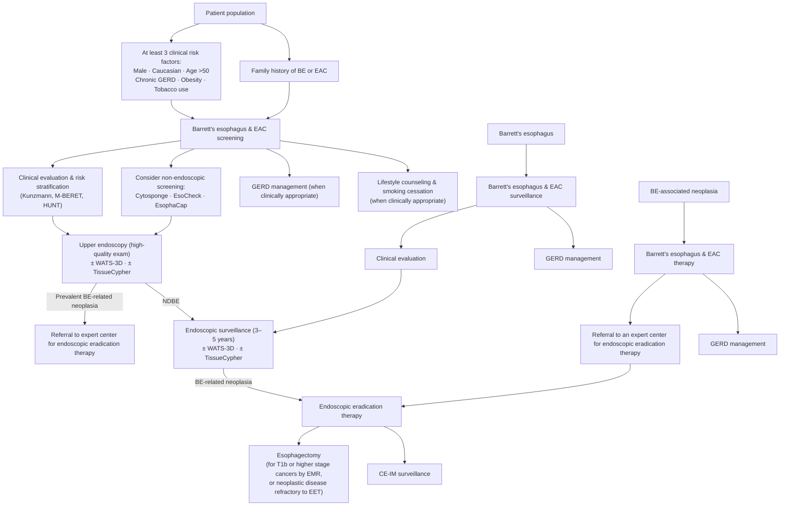

# AGA Clinical Practice Update on New Technology and Innovation for Surveillance and Screening in Barrett's Esophagus: Expert Review (2022)

## Bibliographic Info

- **Article:** [Muthusamy VR, Wani S, Gyawali CP, Komanduri S; CGIT Barrett's Esophagus Consensus Conference Participants. AGA Clinical Practice Update on New Technology and Innovation for Surveillance and Screening in Barrett's Esophagus: Expert Review. Clin Gastroenterol Hepatol 2022;20(12):2696–2706.](https://doi.org/10.1016/j.cgh.2022.06.003)
- **Authors:** V. Raman Muthusamy (Vatche and Tamar Manoukian Division of Digestive Diseases, UCLA); Sachin Wani (University of Colorado School of Medicine, Denver); C. Prakash Gyawali (Washington University School of Medicine, St. Louis); Srinadh Komanduri (Feinberg School of Medicine, Northwestern University, Chicago) — for the CGIT Barrett's Esophagus Consensus Conference Participants
- **Year:** 2022 (December 2022 issue; Clin Gastroenterol Hepatol Vol 20, No 12)
- **Journal/Publisher:** Clinical Gastroenterology and Hepatology — AGA Institute
- **DOI:** [10.1016/j.cgh.2022.06.003](https://doi.org/10.1016/j.cgh.2022.06.003)
- **Type:** Guideline — AGA Institute **Clinical Practice Update (Expert Review)**, 15 numbered **Best Practice Advice (BPA)** statements. **Tier 1.**

> **Grading: none — ungraded.** The source attaches **no evidence grade and no strength of recommendation** to any of its 15 statements. **Methods, verbatim:** "The BPA statements presented here were developed from expert review of existing literature combined with discussion and expert opinion to provide practical advice. **Formal rating of the quality of evidence or strength of BPAs was not the intent of this clinical practice update.** This expert review was commissioned and approved by the AGA Institute Clinical Practice Updates Committee (CPUC) and the AGA Governing Board to provide timely guidance on a topic of high clinical importance to the AGA membership, and underwent internal peer review by the CPUC and external peer review through standard procedures of *Clinical Gastroenterology and Hepatology*." Do not attach GRADE labels to these statements — the document gives none.

**Description, verbatim:** "The purpose of this best practice advice (BPA) article from the Clinical Practice Update Committee of the American Gastroenterological Association is to provide an update on advances and innovation regarding the screening and surveillance of Barrett's esophagus."

**Provenance:** commissioned jointly by the AGA Institute Clinical Practice Updates Committee, the **AGA Center for GI Innovation and Technology (CGIT)**, and the AGA Governing Board. Content was generated, discussed, and **voted upon** by expert faculty contributors at a closed-door meeting during the AGA CGIT conference. Target audience: all gastroenterologists and endoscopists; target population: **adults with known or suspected BE**.

---

## Contents
- [[#Best Practice Advice (Complete, Verbatim — 15 Statements, Ungraded)]]
- [[#Wording Variants Within the Document]]
- [[#Summary]]
- [[#Ten-Step Approach to Endoscopic Examination of BE (Table 1, verbatim)]]
- [[#Key Findings / Claims]]
  - [[#Screening — Who and How]]
  - [[#Endoscopic Examination and Sampling]]
  - [[#Advanced Imaging Performance]]
  - [[#Risk Stratification]]
  - [[#Provider Expertise]]
  - [[#Acid Suppression and Surveillance]]
  - [[#Post-EET Surveillance Biopsies]]
- [[#Figures Not Captured]]
- [[#Relevance to Wiki]]
- [[#Contradictions / Open Questions]]
- [[#See Also]]

---

## Best Practice Advice (Complete, Verbatim — 15 Statements, Ungraded)

*Reproduced from the document's own consolidated "Best Practice Advice (BPA) Statements" table (pp. 2703–2704), including its own section headings and its own "BPA #n" numbering. **No grades, strengths, or certainty ratings are attached by the source.***

### Screening for Barrett's Esophagus (BE)

**BPA #1.** Screening with standard upper endoscopy may be considered in individuals with established risk factors for BE and esophageal adenocarcinoma – presence of at least 3 risk factors (individuals who are male, non-Hispanic white, age >50 years, have a history of smoking, chronic gastrointestinal reflux disease, obesity, or a family history of BE or esophageal adenocarcinoma).

**BPA #2.** Nonendoscopic cell collection devices can be considered as an option to screen for BE.

### Endoscopic Examination of BE

**BPA #3.** Screening and surveillance exams should be performed using high-definition white light endoscopy and virtual chromoendoscopy, with endoscopists spending adequate time inspecting the Barrett's segment.

**BPA #4.** Screening and surveillance exams should define the extent of BE using a standardized grading system documenting the circumferential and maximal extent of the columnar lined esophagus (Prague classification) with a clear description of landmarks and the location and characteristics of visible lesions (nodularity, ulceration), when present.

**BPA #5.** Advanced imaging technologies such as endomicroscopy may be used as adjunctive imaging techniques to identify dysplasia.

**BPA #6.** Sampling during screening and surveillance exams should be performed using the Seattle biopsy protocol (4-quadrant biopsies every 1–2 cm and target biopsies from any visible lesion).

**BPA #7.** Wide area transepithelial sampling may be used as an adjunctive technique to sample the suspected or established Barrett's segment (in addition to the Seattle biopsy protocol).

**BPA #8.** Patients with erosive esophagitis may be biopsied when concern of dysplasia or malignancy exists, with the caveat that a repeat endoscopy after 8 weeks of twice a day proton pump inhibitors is performed.

### Risk Stratification of BE

**BPA #9.** Tissue systems pathology-based prediction assay may be utilized for risk stratification of patients with nondysplastic BE.

**BPA #10.** Risk stratification models may be utilized to selectively identify individuals at risk for Barrett's associated neoplasia.

### Provider Expertise in Managing BE

**BPA #11.** Given the significant interobserver variability among pathologists, the diagnosis of BE-related neoplasia should be confirmed by an expert pathology review.

**BPA #12.** Patients with BE-related neoplasia should be referred to endoscopists with expertise in advanced imaging, resection, and ablation.

### Follow-up and Surveillance of BE

**BPA #13.** Patients with BE should be placed on at least daily proton pump inhibitor therapy.

**BPA #14.** Patients with nondysplastic BE should undergo surveillance endoscopy in 3 to 5 years.

**BPA #15.** In patients undergoing surveillance after endoscopic eradication therapy, 4-quadrant random biopsies should be taken of the esophagogastric junction, gastric cardia, and the distal 2 cm of the neosquamous epithelium as well as from all visible lesions, independent of the length of the original BE segment.

---

## Wording Variants Within the Document

The same 15 statements appear three times (abstract block, italic in-text statement, summary table) and the wording is **not identical**. Where the modal verb differs, both are recorded here; the summary-table text above is the version reproduced as canonical.

| BPA | Summary table (canonical above) | Abstract block (p. 2696) |
|---|---|---|
| #1 | "…individuals with **established risk factors** for BE and esophageal adenocarcinoma – presence of at least 3 risk factors…" | "…individuals with **at least 3 established risk factors** for Barrett's esophagus (BE) and esophageal adenocarcinoma, including individuals who are male, non-Hispanic white, age >50 years, have a history of smoking, chronic gastroesophageal reflux disease, obesity, or a family history of BE or esophageal adenocarcinoma." |
| #2 | "Nonendoscopic cell collection devices **can** be considered…" | "Nonendoscopic cell-collection devices **may** be considered…" |
| #8 | "Patients with erosive esophagitis **may** be biopsied when concern of dysplasia or malignancy exists, **with the caveat that** a repeat endoscopy after 8 weeks of twice a day proton pump inhibitors **is performed**." | "Patients with erosive esophagitis **should** be biopsied when concern of dysplasia or malignancy exists. A repeat endoscopy **should be performed** after 8 weeks of twice a day proton pump inhibitor therapy." |
| #11 | "…the diagnosis of **BE-related** neoplasia should be confirmed…" | "…the diagnosis of **BE-related** neoplasia…" (in-text version reads "Barrett's-related neoplasia") |

The in-text version of BPA #2 matches the table ("can be considered"). BPA #8 is the only statement where the strength genuinely differs between renderings (**should** vs **may** biopsy); the body text supports the permissive reading — the panel's stated position is that active inflammation "should not preclude obtaining biopsies."

---

## Summary

This CGIT/AGA expert review updates how patients are **selected for** Barrett's screening and how the Barrett's segment is **examined, sampled, and risk-stratified** — it is a technology-and-innovation document, not a treatment guideline. Its central argument is that current screening paradigms are inadequate: fewer than 20% of patients diagnosed with esophageal adenocarcinoma (EAC) in the US have a preceding diagnosis of BE, and up to 90% of patients with EAC have never had a BE diagnosis. The single largest cause is the **GERD-symptom prerequisite** built into existing guidelines — in prevalent-EAC cohorts, 54.9% (US) and 38.9% (UK) of patients would not have been identified by current screening recommendations, and the dominant reason for failing to meet criteria was lack of symptomatic GERD (US 86.5%; UK 61.4%).

The panel therefore proposes a screening approach **not restricted to patients with GERD**: any 3 of the established risk factors (male, non-Hispanic white, age >50, smoking history, chronic GERD, obesity, family history of BE/EAC) may prompt screening endoscopy, with GERD demoted from a prerequisite to one risk factor among several. Nonendoscopic cell-collection devices (Cytosponge, EsoCheck, EsophaCap) are endorsed as an option; transnasal endoscopy is acknowledged but remains costly, expert-dependent, and unattractive to patients.

For the examination itself the panel anchors quality on **HD-WLE plus virtual chromoendoscopy** (preferred over dye-based CE on availability, cost, and practicality), adequate inspection time, Prague and Paris reporting, and **Seattle-protocol sampling**, with WATS-3D as an adjunct and endomicroscopy as an adjunctive imaging technique that is **not required** for a high-quality exam. A 10-step approach to the high-quality BE examination is given in Table 1. Adherence is the weak link: in a registry of 58,709 endoscopies nearly 20% were non-adherent to the Seattle protocol, and non-adherence rose 31% with every 1-cm increase in BE length.

Risk stratification is the document's most novel content. A commercially available **tissue systems pathology assay (TissueCypher)** quantifying 9 protein biomarkers plus nuclear morphology and tissue architecture on routine formalin-fixed biopsies stratifies NDBE into low/intermediate/high risk for progression; the **Progression in Barrett's Esophagus score** is described as the only validated *clinical* model. Follow-up advice is conventional and concordant with prior guidelines — at least daily PPI, NDBE surveillance in 3 to 5 years — except for post-EET sampling, where the panel endorses a **simplified** biopsy strategy (EGJ, gastric cardia, distal 2 cm of neosquamous epithelium, plus all visible lesions) rather than random biopsies every 1 cm along the entire original segment.

---

## Ten-Step Approach to Endoscopic Examination of BE (Table 1, verbatim)

*Adapted by the source from Kolb J, Wani S. Curr Opin Gastroenterol 2020;36:351–358.*

| # | Approach | Rationale |
|---|---|---|
| 1 | Identify esophageal landmarks, including the location of the diaphragmatic hiatus, gastroesophageal junction, and squamocolumnar junction | Critical for future exams |
| 2 | Consider use of a distal attachment cap (especially in patients with prior diagnosis of dysplasia) | Facilitate visualization |
| 3 | Clean mucosa well using water jet channel and carefully suction the fluid | Remove any distracting mucus or debris and minimize mucosal trauma |
| 4 | Utilize insufflation and desufflation | Fine adjustments to luminal insufflation can help with detection of subtle abnormalities |
| 5 | Spend adequate time inspecting the Barrett's segment and gastric cardia in retroflexion | Careful examination increases dysplasia detection |
| 6 | Examine the Barrett's segment using HD-WLE | Standard of care |
| 7 | Examine the Barrett's segment using chromoendoscopy (including virtual chromoendoscopy) | Enhances mucosa pattern and surface vasculature |
| 8 | Use the Prague classification to describe the circumferential and maximal Barrett's segment length | Standardized reporting system |
| 9 | Use the Paris classification to describe superficial neoplasia | Standardized reporting system |
| 10 | Use the Seattle protocol (in conjunction with virtual chromoendoscopy) with a partially deflated esophagus to sample the Barrett's segment | Increases dysplasia detection |

---

## Key Findings / Claims

### Screening — Who and How

- **Case for change:** <20% of US patients diagnosed with EAC have a preceding BE diagnosis; up to 90% of patients with EAC have never had a BE diagnosis.
- **BE prevalence in GERD:** 3% (meta-analysis of 49 studies); increases with each additional risk factor. **Highest prevalence with family history: 23.4%.**
- **"Chronic GERD" as used by current guidelines:** symptoms (heartburn or regurgitation) for **>5 years**, or occurring **frequently (weekly or greater)**.
- **Risk factors cited by current guidelines:** chronic GERD **and at least 2 of** — age >50, male gender, Caucasian race, smoking, obesity, family history of BE or EAC. The panel's BPA #1 instead requires **≥3 risk factors with no GERD prerequisite**.
- **Miss rate of current criteria (prevalent-EAC cohorts):** US n=663, **54.9%** not identified; UK n=645, **38.9%** not identified. Reason for not meeting criteria = **lack of symptomatic GERD** in US 86.5%, UK 61.4%. A second US veterans study: **>50%** of patients with EAC did not have frequent GERD symptoms and would not meet current criteria.
- **Predictive tools better than GERD symptoms alone** for predicting BE (may be considered in clinical evaluation for endoscopic screening; further validation needed): **HUNT** (Nord-Trøndelag Health Study), **M-BERET** (Michigan BE pREdiction Tool), and **Kunzmann**.
- **Threshold number of risk factors is "largely based on expert opinion"**; the optimal number remains to be well-defined and inclusion of GERD remains fraught.
- **Nonendoscopic cell-collection devices** (current US devices): **Cytosponge** (Medtronic GI Solutions), **EsoCheck** (Lucid Diagnostics), **EsophaCap** (Capnostics). All 3 demonstrated **excellent tolerability, safety, and sensitivity** for the diagnosis of BE. Further data needed to validate patient selection and the optimal setting for administration in the US. *(The document gives no numeric sensitivity/specificity for these devices in the main text.)*
- **Transnasal endoscopy:** ultrathin endoscope, office setting, no sedation; acknowledged by guidelines as an alternative to sedated endoscopy but **costly, expert-dependent, and not desirable to patients**.

### Endoscopic Examination and Sampling

- **Virtual chromoendoscopy + HD-WLE vs HD-WLE alone** (updated meta-analysis, 504 patients): HGD/EAC detection **14.7% vs 10.1%; relative risk 1.44**.
- **VC is the preferred chromoendoscopy platform** (comparable detection to dye-based CE): available in most endoscopes, no additional cost, and avoids dye-spray equipment, added time, cumbersome/uneven mucosal coating, and inability to detect superficial vascular patterns. Majority of supporting data are for **narrow-band imaging** specifically.
- **Inspection time:** the panel **purposefully did not name** an adequate exam duration (lack of data). It cites **ESGE/United European Gastroenterology** performance measures — procedure time **≥7 minutes** for upper endoscopy and inspection time **≥1 minute/cm** of the circumferential extent of the Barrett's mucosa.
- **Post-endoscopy neoplasia:** a high proportion of HGD/EAC is diagnosed **within the first year** after the index endoscopy that diagnosed BE. An international working group standardized the terms **post-endoscopy esophageal adenocarcinoma** (EAC detected before the next recommended surveillance endoscopy in a patient with NDBE) and **post-endoscopy esophageal neoplasia** (HGD/EAC so detected).
- **Prague and Paris classifications:** the panel suggests routine use as **surrogates for performance of a high-quality exam**, explicitly acknowledging their impact on critical outcomes (improved detection of BE-associated neoplasia) **has not been assessed**.
- **Seattle protocol** — 4-quadrant biopsies every 1–2 cm plus target biopsies of visible lesions: associated with a higher dysplasia detection rate (**relative risk 2.75**). Odds of detecting dysplasia **decreased with nonadherence (OR 0.53; 95% CI 0.35–0.82)**.
- **Adherence data:** national quality benchmarking registry of **58,709 endoscopies** — nearly **20%** non-adherent to the Seattle protocol; non-adherence increased by **31% with every 1-cm increase** in BE length.
- Endoscopists **can** meet the Seattle criterion "if they prefer not to sample a visible lesion and refer the patient for endoscopic resection."
- **WATS-3D** (wide-area transepithelial sampling with 3-dimensional analysis): abrasive brush sampling larger esophageal surface areas; specimens preserve 3-dimensional tissue aspects; analyzed by software using **convoluted neural networks** to identify abnormal cells, **confirmed by an expert pathologist**.
  - Systematic review + meta-analysis of **7 studies**: **incremental yield for dysplasia detection 7.2%**.
  - Pathologic interpretation shows **less interobserver variability — kappa 0.86**.
  - ASGE supported WATS-3D in addition to the Seattle protocol in **select patients** (e.g., indeterminate for dysplasia, or clinically high-risk NDBE) undergoing surveillance.
  - Further prospective studies directly comparing WATS-3D and Seattle protocol are needed to determine whether **WATS-3D sampling alone** is as or more effective.
- **Erosive esophagitis (BPA #8) — the operative detail:**
  - Potential for **over-calling dysplasia (especially LGD)** in active inflammation exists, but this should **not preclude** obtaining biopsies — expert pathologists have been shown to distinguish inflammation from true LGD.
  - When such samples are obtained, **document the presence and severity of the esophagitis visualized**.
  - **Twice-daily** PPI (rather than once daily) was suggested to maximize efficacy given the limited downside of a **short** course.
  - **8 weeks** chosen as the typical duration of most PPI trials for healing of esophagitis and as recommended by prior guidelines.
  - The panel noted a relook endoscopy may be **more useful for Los Angeles Grade C and D** esophagitis.
  - Indication for the repeat endoscopy: **document healing** of esophagitis and **assess for features of malignancy**. Follow-up EGD may reveal **underlying Barrett's in up to 10% to 12%** of patients.

### Advanced Imaging Performance

| Modality | Evidence base | Performance |
|---|---|---|
| **Confocal laser endomicroscopy (CLE)** — per-lesion | Meta-analysis, 14 studies, 789 patients, 4047 lesions | Pooled sensitivity **77% (95% CI 0.73–0.81)**; specificity **89% (95% CI 0.87–0.90)** |
| **CLE vs narrow-band imaging** — within-patient | Meta-analysis, 5 studies, 251 patients | Pooled **additional** per-lesion neoplasia detection rate of CLE **19.3% (95% CI 0.05–0.33)**; **comparable** per-patient pooled sensitivity and specificity |
| **Volumetric laser endomicroscopy (VLE)** | — | **Not currently available commercially**; new advances include laser marking and interpretation of imaging using artificial intelligence |

- Panel position: these technologies were **not required for a high-quality exam** and the data to date **did not support their routine use**; they are "promising," carry potential benefits in **select cases**, and "currently might be best utilized in expert centers." The panelists "felt strongly this was an important area where further innovation is needed."

### Risk Stratification

**Tissue systems pathology assay (TissueCypher) — BPA #9:**

- Commercially available in the US; validated to risk-stratify NDBE into **low, intermediate, high** for progression to HGD/EAC, with a **4.7-fold increased risk** in patients stratified as high risk.
- Performed on **routine biopsies** from the Barrett's segment; **formalin-fixed, paraffin-embedded**.
- Quantifies **9 protein-based biomarkers** — **p16, p53, AMACR, HER2, Cytokeratin 20, CD68, COX-2, HIF-1alpha, CD45Ro** — along with **nuclear morphology and tissue architecture**.
- Result is a **numeric score from 1 to 10** corresponding to a patient's risk for progression.
- Evidence base: **5 independent studies**, **239 progressors and 656 nonprogressors** across the US and Europe.
- **Sensitivity 30.4%, specificity 95%** for detecting progression in NDBE; **sensitivity increases to 50% if multiple levels are examined**.
- Spatial-temporal analysis: a **high-risk score** was associated with a progression rate of **6.9% — similar to LGD**.
- Markov modeling: risk stratification becomes **cost-effective after 5 years**, with an incremental cost-effectiveness ratio of **$52,483/quality-adjusted life year**.
- Pooled analysis of international studies, **472 patients with NDBE**: a high TissueCypher risk score was a **3rd independent predictor** for progression to HGD/EAC (**OR 14.2; 95% CI 5–39; P<.001**).

**Progression in Barrett's Esophagus (PIB) score — BPA #10:**

- Described as **the only validated clinical risk stratification model** for predicting progression to HGD/esophageal cancer in patients with known BE.
- Derived from **2697 patients**, of whom **154 (5.7%)** developed HGD or esophageal cancer.
- Factors significantly associated with progression: **baseline confirmed LGD, male sex, smoking, and BE length**.
- Discrimination: **c-statistic 0.76 (95% CI 0.72–0.80; P<.001)**.

| PIB risk group | Annual rate of progression to HGD/EAC |
|---|---|
| High | **2.1%** |
| Intermediate | **0.73%** |
| Low | **0.13%** |

- The score is **heavily influenced by the presence of LGD** but performed **better than LGD alone** in predicting progression in a separate BE cohort.
- **Non-validated** models have additionally included: presence of esophagitis, lack of PPI use, being overweight, increasing age, and a known **duration of BE ≥10 years**.
- Panel view: several additional models are in development; models incorporating **both clinical and biomarker parameters** will likely ultimately be needed to optimize predictive accuracy.
- Use case named by the panel: risk stratification models may be used to **stratify surveillance intervals** and to **influence the decision on whether to perform EET**.

### Provider Expertise

- **Expert pathology review changed the pathologic diagnosis (upgrading or downgrading) in 55% (95% CI 31%–77%)** of all patients (systematic review and meta-analysis).
- LGD **as confirmed by expert pathology review** is associated with a **higher rate of disease progression** to HGD/EAC.
- **p53 immunohistochemistry** can help confirm dysplasia and improve consistency of reporting.
- Physicians with expertise in Barrett's neoplasia management identify **more visible lesions** than nonexperts.
- Physicians performing EET should **either perform or work in centers that can offer both resection and ablation** techniques. Expert centers should ideally be defined based on **adequate volume, availability of needed technology, procedural expertise, and exceeding established quality metrics**.

### Acid Suppression and Surveillance

- **PPI and progression:** systematic review + meta-analysis — PPI therapy associated with a **71% reduction in risk of HGD or EAC (adjusted OR 0.29; 95% CI 0.12–0.79)**. In **4 cohort studies** reporting time to progression, PPI users were significantly less likely to progress (**adjusted HR 0.32; 95% CI 0.15–0.67**).
- **AspECT trial:** high-dose PPI superior to low-dose PPI for lengthening time to the combined end point of **death from any cause, EAC, or HGD**. Panel-listed limitations preventing generalization: **not double-blinded, low event rate, small effect size**, and the overall benefit was **skewed toward all-cause mortality rather than cancer-related mortality**, which is most relevant to the BE population.
- **Twice-daily vs once-daily PPI:** "there was insufficient information in these studies on whether taking PPI twice daily would provide any added benefit over once daily administration."
- **Dosing advice:** at least **daily** dosing, with **higher doses considered** for (a) those requiring them for **symptom control** and (b) patients with **BE-related neoplasia undergoing EET**.
- **PPI harms:** evidence is **inadequate to establish causal relationships** between PPI and the proposed associations, **with the exception of enteric infection**.
- **Surveillance interval (BPA #14):** current guidelines recommend endoscopic surveillance **every 3 to 5 years** based on a low risk of progression in NDBE. Intervals are **shortened significantly** in patients with dysplasia. The 3-to-5-year range "allows the interval for gastroenterologists some flexibility to individualize intervals for each patient."
- The panel notes **ACG 2022** recommended consideration of **segment length** when determining the surveillance interval, with **longer intervals for segments <3 cm**.
- **Endoscopic surveillance in known BE remains the gold standard** for dysplasia and neoplasia detection. "Careful discussions and assessments of the value of endoscopic surveillance, given other comorbidity and risks, should be a part of the management of all patients with BE."

### Post-EET Surveillance Biopsies

- **Traditional** post-EET protocol: 4-quadrant random biopsies **in the cardia, at the esophagogastric junction, and every 1 cm in the entire prior BE segment**.
- **Evidence for the simplified protocol (BPA #15):** 3 studies, **1235 patients** achieving complete eradication of intestinal metaplasia, **233 recurrences** — aggregate recurrence rate **18.9%**.
  - The majority of **nonvisible** recurrence of IM occurred **at the esophagogastric junction**; most recurrences in the **tubular esophagus were visible**.
  - Using the BPA #15 strategy, **98% (228/233)** of all recurrences could be identified.
- **Exception — short segments:** for a **BE length <2 cm**, the traditional **1-cm approach was still felt reasonable**, given the potential for **subsquamous/tangential extension up to 1 cm beyond the proximal end of the squamocolumnar junction**.
- The panelists recognized the value of obtaining **cardia biopsies** to assess for dysplasia. All visible lesions in the cardia and tubular esophagus should be **biopsied separately**.

---

## Figures Not Captured

Two figures in this source could not be extracted in this environment (PDF image-extraction tooling unavailable):

- **Figure 1** (p. 2700) — *A*, the Prague classification for BE (worked C4M7 example with landmark distances); *B*, illustration of the Seattle biopsy protocol for surveillance in NDBE; *C*, illustration of the simplified protocol for random surveillance biopsies **status post EET** (2 cm proximal, 1 cm proximal, at the EGJ, and 0.5 cm distal). The content of *A* and *B* is already represented textually on [[barretts-esophagus]]; *C* is the figure form of BPA #15.
- **Figure 2** (p. 2702) — *Suggested BE care pathway*: a three-track flowchart (patient population → BE/EAC screening; BE → BE/EAC surveillance; BE-associated neoplasia → BE/EAC therapy), with footnotes "\*May be utilized as per BPA in this document," "\*\*When clinically appropriate," and "\*\*\*For T1b or higher stage cancers by EMR or neoplastic disease refractory to EET."

The Figure 2 pathway is transcribed below so the decision content still reaches the reader:

---

## Relevance to Wiki

- **[[barretts-esophagus]]** — the primary page updated. Adds: the ≥3-risk-factor, GERD-optional screening proposition (BPA #1) and the data behind it; nonendoscopic cell-collection devices by name (BPA #2); the VC-vs-HD-WLE detection numbers (RR 1.44); the ESGE/UEG ≥7-minute / ≥1-minute-per-cm inspection-time figures; Seattle-protocol adherence data (58,709-endoscopy registry, OR 0.53, RR 2.75); WATS-3D incremental yield 7.2% and kappa 0.86; the erosive-esophagitis biopsy rule with its 8-week twice-daily PPI qualifier and 10%–12% underlying-BE yield; the **corrected TissueCypher composition (9 biomarkers, score 1–10)** and its full performance data; the **PIB score** with its components and per-stratum annual progression rates; expert-pathology-review change rate of 55%; PPI progression data; and the post-EET simplified biopsy strategy with its 98% recurrence-capture and the **<2 cm exception**.
- **[[esophageal-adenocarcinoma]]** — the screening-failure statistics (<20% of EAC preceded by a BE diagnosis; up to 90% never diagnosed with BE; >50% of veterans with EAC had no frequent GERD symptoms) belong in the epidemiology/screening context there.
- **[[confocal-laser-endomicroscopy]]** — supplies per-lesion pooled sensitivity/specificity (77%/89%) and the additional-detection-rate-vs-NBI figure (19.3%), plus the panel's "adjunctive, not required, best in expert centers" position and BPA #5.
- **[[proton-pump-inhibitors]]** — BE chemoprevention effect sizes (OR 0.29; HR 0.32), AspECT interpretation and its limitations, and the "causality inadequate except enteric infection" harms position.
- **[[upper-endoscopy]]** — quality-of-examination content: the 10-step BE exam, inspection-time performance measures, and the post-endoscopy esophageal adenocarcinoma/neoplasia definitions.
- **[[endoscopic-eradication-therapy]]** — post-EET surveillance biopsy targets (EGJ, gastric cardia, distal 2 cm of neosquamous epithelium, all visible lesions) independent of original segment length, plus the <2 cm exception; referral/expertise criteria for expert centers.
- **[[gerd]]** — the definition of "chronic GERD" as used in BE screening criteria (>5 years, or weekly-or-greater heartburn/regurgitation) and the finding that GERD-anchored screening misses the majority of EAC.
- **Potential new pages this source could support** (from ingested content): a page on **nonendoscopic BE cell-collection devices** (Cytosponge/EsoCheck/EsophaCap) and a page on **WATS-3D** — both are currently only mentioned in passing on [[barretts-esophagus]].

---

## Contradictions / Open Questions

**Contradictions with existing wiki content**

1. **TissueCypher biomarker count and score range.** [[barretts-esophagus]] currently states "15-biomarker tissue systems pathology risk score (0–10)." This source states **9 protein-based biomarkers** (p16, p53, AMACR, Cytokeratin 20, CD68, COX-2, HIF-1alpha, HER2, CD45Ro) plus nuclear morphology and tissue architecture, and a numeric score **from 1 to 10**. The wiki figure is not supported by this document; the page's own cited source ([[aga-2025-barretts-surveillance]]) should be re-checked before either number is asserted.
2. **Screening criteria — GERD as prerequisite.** [[barretts-esophagus]] presents the ACG 2022 rule (chronic GERD **plus** ≥3 risk factors) and the ASGE 2019 strata. This source explicitly **removes GERD as a prerequisite**, making it one of the risk factors, with ≥3 of any of them sufficient. The page currently has no representation of this position. Per source priority, ACG 2022 and AGA 2025 are newer/equal-tier and govern where they speak; but the AGA 2022 position is a distinct, named alternative and should be surfaced.
3. **WATS-3D endorsement.** The wiki notes ASGE 2019 as "the only society endorsing it" (per AGA 2025 Rec 4's no-recommendation). This AGA 2022 CPU **does** endorse WATS-3D as an adjunctive technique (BPA #7), so the "only society" phrasing on [[barretts-esophagus]] is now inaccurate and needs qualification — AGA's own 2022 CPU endorsed it before the 2025 guideline declined to make a recommendation.
4. **Post-EET biopsy extent.** The wiki's post-CEIM protocol (high cardia below the Z line + distal 2–3 cm of neosquamous epithelium) is concordant in spirit; this source specifies **distal 2 cm** and adds the **<2 cm segment exception** (revert to the traditional every-1-cm approach), which the page does not carry.

**Supersession relative to AGA 2018 (being ingested concurrently)**

- Both documents address **nonendoscopic BE screening**; the 2018 CPU covered new screening techniques and this 2022 CPU is explicitly framed as "an update on advances and innovation regarding the screening and surveillance of BE." Where the two disagree on the status, availability, or endorsement of a screening technology, **2022 governs** (same tier, newer publication date).
- The 2022 document extends beyond 2018's screening scope into **surveillance, risk stratification, provider expertise, and post-EET sampling** — areas where 2018 does not speak and therefore does not conflict.
- Device landscape: this source names **Cytosponge (Medtronic GI Solutions), EsoCheck (Lucid Diagnostics), EsophaCap (Capnostics)** as the current US nonendoscopic cell-collection devices. Any device list or performance figure in the 2018 page that conflicts with this is superseded.

**Open questions flagged by the source itself**

- The **optimal number of risk factors** for screening "remains to be well-defined," and the threshold "is largely based on expert opinion."
- The **optimal inspection time per cm** of BE segment — the panel declined to specify one; future studies should assess the impact of inspection time on detection of BE-associated neoplasia.
- Whether **WATS-3D sampling alone** is as good as or better than the Seattle protocol — requires prospective head-to-head studies.
- Whether **twice-daily PPI** adds benefit over once-daily for chemoprevention — insufficient information.
- **Patient selection and optimal administration setting** for nonendoscopic cell-collection devices in the US, and the **impact (benefits and harms)** of this screening approach.
- The panel notes the impact of Prague/Paris classification practices on critical outcomes **has not been assessed** — they are used as surrogates for a high-quality exam.

---

## See Also

[[barretts-esophagus]], [[esophageal-adenocarcinoma]], [[gerd]], [[upper-endoscopy]], [[endoscopic-eradication-therapy]], [[endoscopic-mucosal-resection]], [[radiofrequency-ablation]], [[confocal-laser-endomicroscopy]], [[artificial-intelligence-endoscopy]], [[proton-pump-inhibitors]], [[polypectomy]], [[reflux-testing]], [[obesity]], [[esophageal-cancer]]
