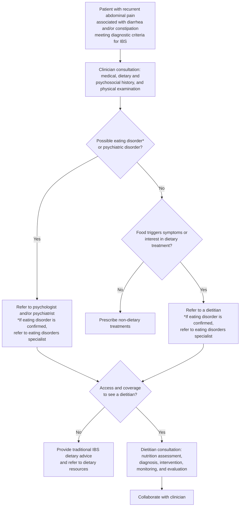

## Bibliographic Info
- **Article:** [Chey WD, Hashash JG, Manning L, Chang L. AGA Clinical Practice Update on the Role of Diet in Irritable Bowel Syndrome: Expert Review. Gastroenterology. 2022;162(6):1737–1745.](https://doi.org/10.1053/j.gastro.2021.12.248)
- **Authors:** William D. Chey, Jana G. Hashash, Laura Manning, Lin Chang
- **Year:** 2022 (received June 12, 2021; accepted December 10, 2021)
- **Journal/Publisher:** Gastroenterology, Vol. 162, No. 6, pp. 1737–1745 — AGA Institute
- **DOI:** [10.1053/j.gastro.2021.12.248](https://doi.org/10.1053/j.gastro.2021.12.248)
- **Type:** guideline (AGA Clinical Practice Update — expert review)

**No evidence grading.** The update states its methods explicitly: the best practice advice statements "were drawn from reviewing existing literature combined with expert opinion… Because this was not a systematic review, formal rating of the quality of evidence or strength of the presented considerations was not performed." The 9 statements carry numbers only — no GRADE strength, no evidence-quality rating.

## Contents
- [[#Summary]]
- [[#Best Practice Advice Statements]]
- [[#Key Findings / Claims]]
  - [[#Selecting patients for a diet intervention]]
  - [[#Table 1 — Practical Questions to Investigate a Possible Eating Disorder]]
  - [[#Figure 1 — Approach to patients with IBS]]
  - [[#Fiber]]
  - [[#Low-FODMAP diet]]
  - [[#Gluten-free diet]]
  - [[#Biomarkers of diet response]]
- [[#Relevance to Wiki]]
- [[#Contradictions / Open Questions]]

## Summary

Most patients with [[irritable-bowel-syndrome|IBS]] associate their GI symptoms with eating — surveys suggest >80% link symptoms to a meal — and medical therapies improve global symptoms in fewer than half of patients (therapeutic gain 7%–15% over placebo). This update positions diet as a primary treatment and gives practical advice on **which patients to treat with diet, who should deliver it, and how long to try it**, rather than a systematic evidence appraisal.

The central operational messages: diet works best in patients who have insight into meal-related symptoms and are motivated; a **registered dietitian nutritionist (RDN)** should deliver restrictive diets where available; every diet trial gets a **predetermined duration** and is abandoned for another treatment if there is no response; and restrictive diets are **contraindicated in patients with an eating disorder**, with routine screening for disordered eating a necessary step before prescribing one.

On the diets themselves, **soluble fiber** is efficacious for global IBS symptoms, and the **low-FODMAP diet (LFD)** is the most evidence-based diet intervention — but only as a structured 3-phase program (restriction ≤4–6 weeks → reintroduction → personalization), not as an open-ended restriction. Healthy eating advice (NICE-style traditional dietary advice) benefits a subset of patients. Evidence for a **gluten-free diet (GFD)** is mixed, and rechallenge data suggest fructans rather than gluten drive symptoms in many patients. Biomarkers that predict diet response (serologies, HLA DQ2/8, IgG food antibodies, leukocyte activation testing, confocal laser endomicroscopy, sucrase-isomaltase variants, fecal microbiome/metabolites, fructose breath testing) are promising but not ready for routine use.

## Best Practice Advice Statements

Nine numbered Best Practice Advice (BPA) statements, reproduced as given. **None carries an evidence grade or strength rating** (see Bibliographic Info).

**BPA 1:** "Dietary advice is ideally prescribed to patients with IBS who have insight into their meal-related GI symptoms and are motivated to make the necessary changes. To optimize the quality of teaching and clinical response, referral to a RDN should be made to patients who are willing to collaborate with a RDN and patients who are not able to implement beneficial dietary changes on their own. If a GI RDN is not available, other resources can assist with implementation of diet interventions."

**BPA 2:** "Patients with IBS who are poor candidates for restrictive diet interventions include those consuming few culprit foods, those at risk for malnutrition, those who are food insecure, and those who have an eating disorder or uncontrolled psychiatric disorder. Routine screening for disordered eating or eating disorders by careful dietary history is critical because they are common and often overlooked in GI conditions."

**BPA 3:** "Specific diet interventions should be attempted for a predetermined length of time. If there is no clinical response, the diet intervention should be abandoned for another treatment alternative, for example, a different diet, medication, or other form of therapy."

**BPA 4:** "In preparation for a visit with a RDN, patients should provide dietary information that will assist in developing an individualized nutrition care plan."

**BPA 5:** "Soluble fiber is efficacious in treating global symptoms of IBS."

**BPA 6:** "The LFD is currently the most evidence-based diet intervention for IBS. Healthy eating advice as described by the National Institute of Health and Care Excellence Guidelines, among others, also offers benefit to a subset of patients with IBS."

**BPA 7:** "The LFD consists of 3 phases: 1) restriction (lasting no more than 4–6 weeks), 2) reintroduction of FODMAP foods, and 3) personalization based on results from reintroduction."

**BPA 8:** "Although observational studies found that most patients with IBS improve with a gluten-free diet, randomized controlled trials have yielded mixed results."

**BPA 9:** "There are limited data showing that selected biomarkers may predict response to diet interventions in patients with IBS, but there is insufficient evidence to support their routine use in clinical practice."

*Abbreviations as defined in the paper: LFD = low-FODMAP diet; FODMAP = fermentable oligo-, di-, and monosaccharides and polyols; RDN = registered dietitian nutritionist; GFD = gluten-free diet; MNT = medical nutrition therapy; IBS-SSS = IBS Symptom Severity Score; ARFID = avoidant/restrictive food intake disorder; CLE = confocal laser endomicroscopy.*

## Key Findings / Claims

### Selecting patients for a diet intervention

- Diet is a primary treatment because most medical therapies improve global symptoms in **fewer than one-half** of patients (therapeutic gain **7%–15%** over placebo); **>80%** of patients associate symptoms with a meal.
- **Poor candidates** for restrictive diets (BPA 2): few culprit foods consumed; risk for malnutrition; food insecurity; eating disorder or uncontrolled psychiatric disorder.
  - If a patient already eats a diet with minimal FODMAP-containing foods, there is little benefit to trialing the LFD.
- **Disordered eating is common and overlooked.** Eating disorders of concern include anorexia nervosa, bulimia nervosa, binge eating disorder, and — of particular importance to gastroenterologists — **ARFID**. Recent data suggest **20%** of patients in GI practice screen positive for ARFID, though ARFID screening tools have not been validated in patients with GI disorders. **Restrictive diets like the LFD should be avoided in patients with an eating disorder.**
- **Malnutrition screening** should be considered before starting a diet intervention. The **Malnutrition Screening Tool** is validated, consists of **2 questions** (appetite and weight loss), and can be administered by a nurse or medical assistant; a higher score indicates the patient is **not appropriate for dietary restrictions** and should be referred to an RDN for comprehensive nutritional assessment.
- **Predetermined trial length** (BPA 3) — do not place patients on "open-ended" dietary restrictions. Numerous clinical trials found **4–6 weeks of LFD** is enough to determine response; failure within the prescribed time means abandoning the diet for another treatment.
- Practical barriers: planning/preparation burden; decreased cognitive ability or significant psychiatric disease impairing reproducible trigger reporting; incremental cost; limited food access.

### Table 1 — Practical Questions to Investigate a Possible Eating Disorder

| # | Question |
|---|---|
| **General questions** | |
| 1 | Have you changed your diet recently and, if so, why? |
| 2 | What feelings do you have at mealtime or when you look at food? (Anxious or fearful?) |
| 3 | How much time do you spend planning out your meals or thinking about food? |
| **For those who volunteer information about their weight loss or appear malnourished** | |
| 4 | What do you think caused you to lose this much weight? |
| 5 | Are you concerned about your weight loss? Has anyone else expressed concern? |
| 6 | Has your weight influenced how you feel about yourself? |
| 7 | Would you like to go back to your previous weight? |
| 8 | How often do you exercise and for how long? (Is it more than 60 minutes per day?) |
| **For those with suspected vomiting/purging/laxative use** | |
| 9 | How often do you eat to the point that it makes you feel sick? |
| 10 | Is the vomiting spontaneous or do you ever force/induce it? |
| 11 | Do you use laxatives even when you are not constipated? |

*Table 1 note (as printed): "This is not a validated questionnaire, but the health care provider should use their clinical judgment in referring a patient to a RDN or psychologist and/or psychiatrist with expertise in eating disorders."*

### Figure 1 — Approach to patients with IBS

*Figure 1 — Approach to patients with IBS.*

- **RDN preparation (BPA 4):** before the visit, clinician and patient supply previous medical and demographic information, test and procedure results, biochemical data, and anthropometrics; the patient keeps a **food diary for a minimum of 3 days** plus a corresponding symptom chart.
- The RDN then conducts a **4-step process**: 1) nutrition assessment information, 2) nutrition diagnosis, 3) nutrition intervention, 4) nutrition monitoring and evaluation.
- **Medical nutrition therapy (MNT)** delivered by an RDN has improved outcomes in weight management, diabetes, hypertension, lipid disorders, pregnancy, HIV infection, chronic kidney disease, and unintended weight loss in adults. Provide an ICD-10 diagnosis with the referral and state that the consultation is medically necessary and/or preventative. Medicare currently covers nutrition visits for diabetes mellitus, end-stage renal disease (not on dialysis), and post kidney transplantation, with a specified number of visits per year.
- Where no GI RDN is available, a provider can collaborate with a **community RDN with an interest in digestive disorders**, and reliable educational materials/digital tools can support implementation — but "dietary interventions should not be implemented solely on the basis of a brief document or mobile application."

### Fiber

- **Definition used:** dietary fiber = a carbohydrate not absorbed or digested in the small intestine with a degree of polymerization of **3 or more monomeric units**.
- **FDA recommends 25–35 g of total fiber daily** for all people.
- **Soluble fiber sources:** psyllium, ispaghula husk, corn fiber, calcium polycarbophil, methylcellulose, oat bran, and the flesh of fruits and vegetables.
- **Insoluble fiber sources:** wheat bran, whole grains, and fruit and vegetable skins and seeds.
- The 2021 ACG IBS guideline made a **strong recommendation for soluble (but not insoluble) fiber**, based on a systematic review and meta-analysis of **15 RCTs**; insoluble fiber did not significantly improve IBS symptoms and **may exacerbate bloating and abdominal pain**.
- A recent **network meta-analysis of 5 psyllium husk studies did not show benefit** in global IBS symptoms vs placebo; the **2 excluded studies were positive**.
- **Selection of soluble fiber should be made specifically among patients with IBS-C.** Fiber characteristics from viscosity to rate of fermentation affect symptom impact.

### Low-FODMAP diet

- FODMAPs are **short-chain, poorly digestible, poorly absorbed sugars**; carbohydrates are the most common macronutrient trigger. Fat content and total caloric intake can enhance the gastrocolonic response contributing to sensorimotor bowel dysfunction.
- Efficacy data cited:
  - Traditional meta-analysis of **7 RCTs (397 patients)** — LFD significantly reduced global symptoms vs different control interventions.
  - Network meta-analysis of **13 RCTs** — LFD was the **most effective diet strategy** for relief of global symptoms, abdominal pain, and bloating.
  - RCT of **100 patients with IBS-D**, LFD vs traditional dietary advice based on NICE guidelines: both improved IBS-SSS and IBS-related QOL vs baseline; primary outcome (**>50-point reduction in IBS-SSS**) favored LFD — **62.7% vs 40.8%; P = .04**.
  - Crossover RCT of **42 patients** (LFD vs GFD vs "balanced"/Mediterranean diet): all 3 significantly improved symptom severity, bloating, abdominal pain, and QOL (P < .05); LFD gave significantly greater improvement in **bloating only**, not pain, IBS-SSS, or IBS-related QOL. Needs confirmation in a larger trial.
  - **Two comparative effectiveness trials** reported similar benefit of the LFD in improving overall IBS symptoms **for up to 6 months** compared with gut-directed hypnotherapy or yoga.
  - LFD improves symptoms and disease-specific QOL **particularly in IBS-D**; studies in **IBS-C are currently lacking**, but RCTs show IBS-C patients benefit from a higher intake of soluble fiber.
- **Nutritional adequacy:** short-term FODMAP restriction has little impact on micronutrient intake and, when taught by an RDN, might actually improve overall diet quality relative to habitual diets of most patients with IBS. **Long-term effectiveness and adherence data are lacking**; preliminary observational data appear promising.
- The full 3-phase structure, its durations, and the prerequisites for starting are captured on [[low-fodmap-diet]] (Figure 2).
- A **simplified version of the LFD** may be effective but "remains to be proven in RCTs."

### Gluten-free diet

- Two placebo-controlled **rechallenge** trials randomly assigned patients with IBS who had symptomatically responded to a GFD to a gluten-containing diet or placebo — both reported **significant worsening of IBS symptoms with gluten vs placebo**.
- A recent **ACG systematic review and meta-analysis** found the overall difference was **not statistically significant: relative risk 0.46 (95% CI, 0.16–1.28)**.
- In a placebo-controlled crossover rechallenge study, patients with IBS who responded to a GFD **followed by a LFD** did **not** experience worsening with reintroduction of gluten — elimination of gluten does not explain the additional symptom improvement with a LFD.
- In individuals with self-reported gluten sensitivity (**31% with IBS**) on a GFD, overall GI symptoms and bloating were significantly higher on a diet with **fructans** than with gluten, although neither group differed from placebo → **fructans, rather than gluten, induce symptoms** in patients with presumed gluten sensitivity. Limitation: rechallenge designs may increase the likelihood of a nocebo response.
- Two small uncontrolled studies showed a GFD improved overall IBS symptoms; a third found only a significant improvement in **stool frequency**.
- **"At present, it remains unclear whether a GFD is of benefit to patients with IBS."**

### Biomarkers of diet response

| Candidate biomarker | What the data show |
|---|---|
| Celiac genetics/serology (HLA DQ2/8, IgG anti-gliadin, anti-tTG) | IBS-D with positive IgG anti-gliadin/anti-tTG and/or positive DQ2 status were more likely to normalize GI symptom score and stool frequency after a GFD. Positive anti-gliadin antibody status was associated with **less diarrhea but not less abdominal pain**. Two studies: HLA DQ2/8 status predicted improvement in **only certain individual symptoms** (stool frequency, abdominal distension) with a GFD. |
| IgG food antibody testing | RCT of **150 patients**: 12-week diet excluding foods with elevated IgG antibodies gave a **10% greater reduction** in IBS symptoms vs sham diet. Open-label trial of **20 patients**: significant improvement in stool frequency, abdominal pain, and QOL. A cross-sectional study found **no correlation between IBS symptoms and IgG4 antibody titers** to foods. Older, limited data — additional validation required. |
| Leukocyte activation testing | RCT: a diet excluding "positive" foods vs a sham diet excluding "negative" foods gave significant improvement in IBS symptoms. |
| [[confocal-laser-endomicroscopy\|CLE]] with food challenge | One study of **36 patients**: **61% had a positive CLE response**; of those, **86% had a >50% reduction in symptoms after 4 weeks** on an exclusion diet, with further improvement by 12 months. **None** of the CLE-negative patients had a significant symptom reduction. |
| Sucrase-isomaltase (SI) variants | SI variants are more common in IBS and may be associated with **lower response to LFD**. Post-hoc analysis: pathogenic SI variants associated with a **3- to 4-fold reduction in response** to either diet, particularly the LFD. Limitations: small sample, no mucosal disaccharidase measurements. |
| Fecal microbiome / metabolites | Pediatric abdominal-pain responders to LFD had stool enriched with microbes with increased carbohydrate-metabolizing enzymes. Two adult studies using the GA-map dysbiosis test both found baseline fecal bacterial profile could discriminate responders from nonresponders — but **the discriminating profiles differed between studies**. Fecal volatile organic compound patterns at baseline and after LFD distinguished responders from nonresponders. |
| Fructose breath testing | **No convincing evidence** it predicts response to a fructose-restricted diet or LFD. "A fructose breath test does not appear to predict response to a fructose-restricted diet but may predict response to a LFD, however, further studies are needed." |

## Relevance to Wiki

- [[irritable-bowel-syndrome]] — adds a full diet-therapy section: candidate selection and eating-disorder/malnutrition screening (BPA 1–4), soluble vs insoluble fiber detail and the FDA 25–35 g/d target (BPA 5), the LFD's place among diets (BPA 6–7), gluten-free evidence (BPA 8), and biomarkers of diet response (BPA 9).
- [[low-fodmap-diet]] — new page; single home for the 3-phase structure, durations, prerequisites, reintroduction protocol, and liberalization data (Figure 2 + BPA 6–7).
- [[disorders-of-gut-brain-interaction]], [[abdominal-bloating-and-distention]] — LFD as a diet strategy with the strongest bloating signal.

## Contradictions / Open Questions

- **Soluble fiber — strength of the evidence.** [[acg-2020-ibs|ACG]] gives soluble fiber a **strong recommendation** (Moderate quality) from a meta-analysis of 15 RCTs, while this update cites a **network meta-analysis of 5 psyllium husk studies showing no benefit** vs placebo (2 positive studies were excluded). The update nonetheless states soluble fiber is efficacious (BPA 5), so both guidelines land in the same place; the psyllium signal is weaker than the recommendation implies.
- **Low-FODMAP diet — confidence.** [[acg-2020-ibs|ACG 2020]] recommends a limited LFD trial only **conditionally, on very-low-quality evidence**; this newer update calls it "the most evidence-based diet intervention for IBS." Same tier, newer publication — the wiki asserts the AGA framing while keeping the ACG grade visible, since the AGA update assigns no grades of its own.
- **Internal discrepancy on liberalization.** The body text states "up to 76% of patients with IBS can liberalize their LFD after completion of the reintroduction phase," while Figure 2 states ">80% can liberalize." Both figures are recorded on [[low-fodmap-diet]].
- **Gluten.** Whether a GFD benefits patients with IBS remains unresolved; rechallenge data point to **fructans rather than gluten** as the trigger, which places gluten avoidance inside the LFD rather than beside it.
- **IBS-C.** LFD efficacy data in IBS-C are lacking; the update directs soluble fiber selection specifically to IBS-C.
- Reintroduction and personalization phases still lack RCT evidence; the simplified LFD is unproven; long-term LFD adherence data are absent.

---

## See Also
[[irritable-bowel-syndrome]], [[low-fodmap-diet]], [[disorders-of-gut-brain-interaction]], [[abdominal-bloating-and-distention]], [[confocal-laser-endomicroscopy]]
