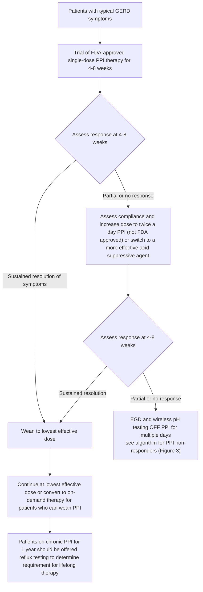

## Bibliographic Info
- **Article:** [Yadlapati R, Gyawali CP, Pandolfino JE, on behalf of the CGIT GERD Consensus Conference Participants. AGA Clinical Practice Update on the Personalized Approach to the Evaluation and Management of GERD: Expert Review. Clin Gastroenterol Hepatol. 2022;20(5):984–994.](https://doi.org/10.1016/j.cgh.2022.01.025)
- **Authors:** Rena Yadlapati, C. Prakash Gyawali, John E. Pandolfino, on behalf of the CGIT GERD Consensus Conference Participants
- **Year:** 2022 (May issue)
- **Journal/Publisher:** Clinical Gastroenterology and Hepatology (AGA Institute)
- **DOI:** [10.1016/j.cgh.2022.01.025](https://doi.org/10.1016/j.cgh.2022.01.025)
- **Type:** guideline (AGA Clinical Practice Update — Expert Review)

**Article type verified on page 1.** This is a genuine **Clinical Practice Update** carrying **14 numbered Best Practice Advice (BPA) statements**, not an AGA "Here and Now"/commentary column.

**Note on evidence rating — the statements are UNGRADED.** The Methods state verbatim: *"The Best Practice Advice statements presented here were developed from expert review of existing literature combined with extensive discussion and expert opinion to provide practical advice. Formal rating of the quality of evidence or strength of recommendations was not the intent of this clinical practice update."* **No GRADE rating, strength, or evidence quality may be attached to any BPA below** — the document assigns none.

**Correction on record (not clinically relevant):** *Clin Gastroenterol Hepatol* 2022;20(9):2156, [doi 10.1016/j.cgh.2022.05.005](https://doi.org/10.1016/j.cgh.2022.05.005) — corrects the spelling of Sri Komanduri's name in the participants/disclosures list only. No content change.

## Contents
- [[#Summary]]
- [[#Key Findings / Claims]]
  - [[#Best Practice Advice statements (verbatim, as numbered in the source)]]
  - [[#The phenotyping grid (Figure 2) — endoscopy × prolonged reflux monitoring off PPI]]
  - [[#Management by phenotype (Figure 3)]]
  - [[#Empiric PPI trial pathway (Figure 1)]]
  - [[#Adjunctive pharmacotherapy matched to phenotype (BPA 10)]]
  - [[#PPI dosing (Supplementary Table 1)]]
  - [[#Supporting data points]]
- [[#Relevance to Wiki]]
- [[#Contradictions / Open Questions]]
- [[#See Also]]

---

## Summary

Up to **one-half of patients with suspected GERD derive no benefit from acid suppression**. This CPU, generated by the AGA Center for GI Innovation and Technology (CGIT) GERD Consensus Conference, replaces the historic "catch-all" management of reflux symptoms with a **phenotype-driven** approach: characterise the mechanism driving symptoms, then match therapy to that mechanism.

The clinical spine is a two-axis grid. **Upper GI endoscopy off PPI** and **prolonged wireless pH monitoring off PPI** are read together to place the patient in one of three phenotypes — **No GERD**, **borderline GERD**, or **GERD** — with a **severe GERD** modifier layered on top. Each phenotype gets a different treatment ladder: no-GERD patients stop the PPI and are worked up as a functional esophageal disorder; borderline patients get PPI optimisation plus aggressive lifestyle/behavioural measures; GERD patients get long-term acid suppression, and severe-phenotype patients are candidates for indefinite PPI or an invasive anti-reflux intervention.

For patients presenting with typical symptoms and no alarm features, the entry point is still an empiric **4- to 8-week single-dose PPI trial**, escalated to twice daily or to a more potent agent if response is inadequate and **tapered to the lowest effective dose** if it is adequate. What is new is the **exit criterion**: a patient on PPI for **unproven** GERD should have appropriateness and dosing re-evaluated **within 12 months**, and be offered endoscopy plus prolonged wireless reflux monitoring **off PPI** to establish whether lifelong therapy is justified. Patients with **isolated extra-esophageal symptoms** skip the empiric trial altogether and go straight to objective testing off medication.

Beyond acid, the update pushes clinicians to treat the other drivers of reflux symptoms: **adjunctive pharmacotherapy matched to the phenotype** (alginates for breakthrough, nocturnal H2RAs, baclofen for regurgitation/belching, prokinetics only for coexistent gastroparesis) rather than empirically; and **neuromodulation and behavioural therapy** (CBT, esophageal-directed hypnotherapy, diaphragmatic breathing) for functional heartburn, reflux hypersensitivity, esophageal hypervigilance, and behavioural disorders. Invasive options — laparoscopic fundoplication, magnetic sphincter augmentation, transoral incisionless fundoplication, and Roux-en-Y gastric bypass in obesity — all require the same gate: **confirmatory evidence of pathologic GERD, exclusion of achalasia, and assessment of esophageal peristaltic function**.

## Key Findings / Claims

### Best Practice Advice statements (verbatim, as numbered in the source)

*Ungraded — the source attaches no evidence grade or strength to any statement. Section headings below are the source's own groupings from its BPA summary table.*

**Approaching GERD Symptoms in Clinic**

1. Clinicians should develop a care plan for investigation of symptoms suggestive of gastroesophageal reflux disease (GERD), selection of therapy (with explanation of potential risks and benefits), and long-term management, including possible de-escalation, in a shared decision-making model with the patient.
2. Clinicians should provide standardized educational material on GERD mechanisms, weight management, lifestyle and dietary behaviors, relaxation strategies, and awareness about the brain-gut axis relationship to patients with reflux symptoms.
3. Clinicians should emphasize safety of proton pump inhibitors (PPIs) for the treatment of GERD.
4. Clinicians should provide patients presenting with troublesome heartburn, regurgitation, and/or non-cardiac chest pain without alarm symptoms a 4- to 8-week trial of single-dose PPI therapy. With inadequate response, dosing can be increased to twice a day or switched to a more effective acid suppressive agent once a day. When there is adequate response, PPI should be tapered to the lowest effective dose.

**Personalized Diagnostic Approach to GERD Symptoms**

5. If PPI therapy is continued in a patient with unproven GERD, clinicians should evaluate the appropriateness and dosing within 12 months after initiation, and offer endoscopy with prolonged wireless reflux monitoring off PPI therapy to establish appropriate use of long-term PPI therapy.
6. If troublesome heartburn, regurgitation, and/or non-cardiac chest pain do not respond adequately to a PPI trial or when alarm symptoms exist, clinicians should investigate with endoscopy and, in the absence of erosive reflux disease (Los Angeles B or greater) or long-segment (≥3 cm) Barrett's esophagus, perform prolonged wireless pH monitoring off medication (96-hour preferred if available) to confirm and phenotype GERD or to rule out GERD.
7. Complete endoscopic evaluation of GERD symptoms includes inspection for erosive esophagitis (graded according to the Los Angeles classification when present), diaphragmatic hiatus (Hill grade of flap valve), axial hiatus hernia length, and inspection for Barrett's esophagus (graded according to the Prague classification and biopsy when present).
8. Clinicians should perform upfront objective reflux testing off medication (rather than an empiric PPI trial) in patients with isolated extra-esophageal symptoms and suspicion for reflux etiology.
9. In symptomatic patients with proven GERD, clinicians should consider ambulatory 24-hour pH-impedance monitoring on PPI as an option to determine the mechanism of persisting esophageal symptoms despite therapy (if adequate expertise exists for interpretation).

**Precision Management Approach to GERD**

10. Clinicians should personalize adjunctive pharmacotherapy to the GERD phenotype, in contrast to empiric use of these agents. Adjunctive agents include alginate antacids for breakthrough symptoms, nighttime H2 receptor antagonists for nocturnal symptoms, baclofen for regurgitation or belch predominant symptoms, and prokinetics for coexistent gastroparesis.
11. Clinicians should provide pharmacologic neuromodulation, and/or referral to a behavioral therapist for hypnotherapy, cognitive behavioral therapy, diaphragmatic breathing, and relaxation strategies in patients with functional heartburn or reflux disease associated with esophageal hypervigilance, reflux hypersensitivity, and/or behavioral disorders.
12. In patients with proven GERD, laparoscopic fundoplication and magnetic sphincter augmentation are effective surgical options, and transoral incisionless fundoplication is an effective endoscopic option in carefully selected patients.
13. In patients with proven GERD, Roux-en-Y gastric bypass is an effective primary anti-reflux intervention in obese patients, and a salvage option in non-obese patients, whereas sleeve gastrectomy has potential to worsen GERD.
14. Candidacy for invasive anti-reflux procedures includes confirmatory evidence of pathologic GERD, exclusion of achalasia, and assessment of esophageal peristaltic function.

### The phenotyping grid (Figure 2) — endoscopy × prolonged reflux monitoring off PPI

*Recreated as a table per the Style Guide (the source renders it as a coloured grid). Reflux monitoring is offered only to patients **without** high-grade esophagitis on endoscopy.*

| Upper GI endoscopy (off PPI) ↓ / Prolonged ambulatory reflux monitoring off PPI → | **All days AET <4.0%** | **≥1 day AET ≥4.0%; not meeting criteria for GERD** | **≥2 days with AET >6%** |
|---|---|---|---|
| **No erosive reflux disease** | **No GERD** | **Borderline** | **GERD\*** |
| **Los Angeles A esophagitis** | **Borderline** | **Borderline** | **GERD\*** |
| **Los Angeles B/C/D esophagitis** | **GERD\*** — ambulatory reflux monitoring off PPI **not recommended** | ← same | ← same |

\* **Severe GERD phenotype modifier.** Source footnote, verbatim: *"In a patient with GERD, the presence of Los Angeles C or D esophagitis, AET >12.0%, DeMeester score >50, bipositional reflux, and/or a large hiatal hernia indicates a more severe GERD phenotype."*

- Figure 2 legend (verbatim on the thresholds): *"Absence of pathologic acid exposure on ambulatory reflux monitoring (AET <4.0% on all 4 days of the prolonged wireless pH study) with a normal endoscopy rules out GERD. Erosive esophagitis of Los Angeles Grade B or higher, and/or AET ≥6.0% on 2 or more days constitutes conclusive GERD evidence. Patients with LA grade A esophagitis, and/or AET ≥4.0% but otherwise not meeting criteria for conclusive GERD are considered to have borderline GERD."*
- ⚠ The source states the top-tier acid threshold **two ways** within the same paper: the Figure 2 and Figure 3 column headers read **AET >6.0% on ≥2 days**, while the Figure 2 legend reads **AET ≥6.0% on 2 or more days**. The body text (p. 989) uses *">6%"*. Recorded as printed; not reconciled by the source.

### Management by phenotype (Figure 3)

Entry: *patients with esophageal symptoms, unproven GERD, incomplete response to a PPI trial for 4–8 weeks; no previous endoscopy or prior endoscopy without erosive disease.* → **EGD off PPI for ≥7 days**; if EGD shows no LA B/C/D esophagitis and no long-segment (≥3 cm) Barrett's, add **concurrent prolonged wireless pH monitoring off PPI**.

| | **No GERD** (no erosive disease **and** AET <4.0% on all days) | **Borderline GERD** (LA A esophagitis **and/or** ≥1 day AET ≥4.0%, not meeting GERD criteria) | **GERD** (LA B/C/D esophagitis **and/or** ≥2 days AET >6.0%) |
|---|---|---|---|
| **Initial** | 1. Stop PPI 2. HRM if rumination or esophageal motor disorder suspected 3. CBT, gut-directed hypnotherapy, or neuromodulators | 1. Optimize PPI to control symptoms 2. Aggressive lifestyle modifications / weight management 3. CBT, gut-directed hypnotherapy, or neuromodulators as indicated | 1. Optimize PPI to control symptoms 2. Aggressive lifestyle modifications / weight management 3. CBT, gut-directed hypnotherapy, or neuromodulators as indicated |
| **Controlled after optimization** | — (PPI already stopped) | Wean to lowest effective dose and/or on-demand therapy with H2 blockers/antacids | If **no** erosive disease at baseline → wean to lowest effective dose and/or on-demand therapy with H2 blockers/antacids. If **erosive disease at baseline or severe GERD\* suspected** → **continue PPI indefinitely** and consider anti-reflux intervention for chronic maintenance |
| **Uncontrolled after optimization** | — | HRM/pH-impedance monitoring **on** PPI in patients with belching and regurgitation; then precision approach based on pattern of reflux on pH-impedance, integrity of the anti-reflux barrier, obesity and/or psychological considerations | Esophageal physiologic testing (**HRM / esophagram**) to assess pre-intervention candidacy and for alternative diagnoses; consider gastric emptying study; then precision approach based on pattern of reflux on pH-impedance, integrity of the anti-reflux barrier, obesity and/or psychological considerations |

\* Figure 3 footnote, verbatim: *"The presence of Los Angeles C or D esophagitis, bipositional reflux, extreme levels of acid exposure (AET >12.0% or DeMeester Score >50) and/or a large hiatal hernia may indicate a more severe phenotype of GERD."*

### Empiric PPI trial pathway (Figure 1)

### Adjunctive pharmacotherapy matched to phenotype (BPA 10)

| Phenotype / problem | Adjunctive agent | Source's rationale |
|---|---|---|
| Breakthrough symptoms, especially post-prandial | **Alginate antacids** | Neutralize the post-prandial acid pocket; particularly useful post-prandially, at night, and with a known hiatal hernia |
| Nocturnal symptoms | **Nighttime H2 receptor antagonist** | Helpful for breakthrough and/or night-time symptoms; **use limited by tachyphylaxis** |
| Regurgitation- or belch-predominant symptoms | **Baclofen** (GABA-B agonist) | Inhibits transient lower esophageal sphincter relaxations; may help belch-predominant symptoms and mild regurgitation; **limited by CNS and GI side effects** |
| Coexistent gastroparesis | **Prokinetics** | **Prokinetics have not been shown to be useful in GERD** — a role only with concomitant gastroparesis |

### PPI dosing (Supplementary Table 1)

*Reproduced verbatim. Header note: doses listed "in order of potency based on omeprazole equivalents"; maximal doses "reported based on doses used in clinically published studies."*

| Proton pump inhibitor | Starting dose | Maximal dose |
|---|---|---|
| Pantoprazole | 40 mg qd | 40 mg bid |
| Lansoprazole | 15 mg qd | 30 mg bid |
| Omeprazole | 20 mg qd | 40 mg bid |
| Esomeprazole | 20 mg qd | 40 mg bid |
| Dexlansoprazole | 30 mg qd | 60 mg qd |
| Rabeprazole | 20 mg qd | 20 mg bid |

- Source note, verbatim: *"Once-daily dose optimally taken 30 to 60 minutes before breakfast; twice-daily dose taken 30 to 60 minutes before breakfast and dinner."*

### Supporting data points

- **More than 30% of United States adults** report at least weekly reflux symptoms.
- **Up to 50% of patients do not derive relief from empirical PPI therapy.**
- **Typical esophageal symptoms of heartburn and regurgitation are approximately 70% sensitive and specific for objective GERD** — the rationale for first-line empiric PPI trials in typical presentations, and for skipping the trial in isolated extra-esophageal presentations.
- **Up to 80% of symptomatic patients will not have objective reflux evidence on endoscopy.**
- **Los Angeles A esophagitis can be seen in healthy asymptomatic volunteers and is not considered evidence of erosive reflux disease.**
- **Wireless pH monitoring (Bravo):** pH capsule introduced via a trans-oral catheter during sedated EGD, adhering to the distal esophagus **6 cm proximal to the endoscopically identified squamocolumnar junction** using a vacuum suction mechanism; measures acid exposure for **up to 96 hours** (recorder battery life). It is the **preferred** ambulatory method for objectively assessing GERD in a symptomatic patient (day-to-day variability capture, ease of placement during sedated endoscopy, patient tolerance).
- **Prospective outcome data on the 96-hour wireless study:** normal AET (**<4.0%**) on **all 4 days** → **OR 10.0 (95% CI, 2.70–43.32)** for predicting successful PPI withdrawal; abnormal AET on **≥2 days** → **OR 5.3 (95% CI, 2.91–13.44)** for predicting need to continue PPI.
- **Symptom-association thresholds:** *"symptom association probability >95% and symptom index >50% increase confidence that symptoms are truly associated with reflux when AET is increased, and indicate reflux hypersensitivity (a functional esophageal disorder) when AET is physiologic."*
- **24-hour pH-impedance off PPI** may be preferred in evaluating extra-esophageal symptoms; in symptomatic patients with **previously proven GERD**, pH-impedance is the optimal reflux monitoring system, performed **on twice-a-day PPI therapy**.
- **PPI timing/agent optimisation:** take PPI **30–60 minutes prior to a meal**; for inadequate response switch to a more potent PPI, one **less metabolized through CYP2C19** (e.g. rabeprazole, esomeprazole), one in an **extended-release formulation** (e.g. dexlansoprazole), or a **potassium-competitive acid blocker** when available.
- **Exceptions to weaning acid suppression:** *"patients with erosive esophagitis (Los Angeles B or greater), biopsy proven Barrett's esophagus, and/or peptic stricture, who will require at least single-dose, long-term PPI therapy."*
- **Off-PPI endoscopy timing:** the body text states endoscopy with prolonged reflux monitoring is *"optimally performed after withholding PPI for 2 to 4 weeks whenever possible"*; Figure 3's entry box states **EGD off PPI for ≥7 days**.
- **Anti-reflux barrier / surgical nuance:** partial fundoplication preferred where there is esophageal hypomotility or impaired peristaltic reserve, because of post-operative dysphagia risk; magnetic sphincter augmentation is often combined with crural repair for a known hiatal hernia; TIF is for GERD **in the absence of a hiatal hernia**, with recent data supporting TIF combined with laparoscopic hiatal hernia/crural repair when there is a minor crural defect.
- **Non-acid drivers named as management determinants:** reflux-symptom association, integrity of the anti-reflux barrier, central obesity, esophageal physiology, visceral sensitivity, hypervigilance, and downstream GI motility.
- **Patient education content:** reflux is a physiologic process, commonly mediated through transient lower esophageal sphincter relaxations and controlled by protective factors (anti-reflux barrier, effective esophageal peristalsis and salivation, downstream gastric motility). Where there is a known hiatal hernia and/or symptom burden after meals or during sleep — **elevate the head of the bed and avoid meals within 3 hours of bedtime**.
- **The most researched behavioral interventions** for esophageal disorders are **CBT, esophageal-directed hypnotherapy, and diaphragmatic breathing**, administered by clinical health psychologists or other mental health professionals with specialized training.

## Relevance to Wiki

- **[[gerd]]** — the phenotyping grid (Figure 2) and the phenotype-matched management ladder (Figure 3) are new to the page and are the reason this CPU exists; added to *Classification / Typing* and *Therapeutics*. Also added: the 4–8 week trial framing, the 12-month reassessment rule (BPA 5), the invasive-procedure candidacy gate (BPA 14), the RYGB/sleeve-gastrectomy positioning (BPA 13), and adjunctive pharmacotherapy by phenotype (BPA 10).
- **[[ambulatory-reflux-monitoring]]** — wireless capsule placement mechanics (6 cm above the SCJ, up to 96 h), the OR/CI outcome data behind the 96-hour study, and the on-PPI pH-impedance positioning.
- **[[reflux-testing]]** — indications for objective testing (BPA 5, 6, 8), the ~70% sensitivity/specificity of typical symptoms, the "up to 80% have no objective endoscopic evidence" figure, and partial closure of the standing **DeMeester score** corpus gap (the >50 severe-phenotype threshold; the score's *components* and its normal/abnormal boundary remain unsourced).
- **[[proton-pump-inhibitors]]** — Supplementary Table 1 starting/maximal doses; the 4–8 week trial and taper-to-lowest-effective-dose rule; the 12-month reassessment + offer-reflux-testing rule; the exceptions-to-weaning list.
- Reinforces without changing: [[extraesophageal-reflux]] (upfront testing over empiric PPI in isolated extra-esophageal symptoms — same as [[aga-2023-extraesophageal-gerd]] BPA 4), [[antireflux-surgery]], [[potassium-competitive-acid-blockers]].

## Contradictions / Open Questions

- **Off-PPI reflux monitoring in LA grade B — this CPU says don't, [[acg-2021-gerd]] says the exclusion starts at LA C.** ACG 2021 (Strong/Low) advises against off-therapy reflux monitoring solely to diagnose GERD in **LA grade C or D** esophagitis or long-segment Barrett's. This CPU sets that bar one grade lower: BPA 6 sends the patient to prolonged wireless pH monitoring only *"in the absence of erosive reflux disease (**Los Angeles B or greater**)"*, and Figure 2 marks LA B/C/D as *"GERD; ambulatory reflux monitoring off PPI not recommended."* **The wiki asserts the LA-B floor**: this CPU is newer (2022 vs 2021) and [[lyon-2024-gerd-diagnosis|Lyon 2.0]] (2024, newest tier-1) independently promoted LA grade B from borderline to **conclusive** GERD evidence, which is the same position. The ACG wording is recorded here.
- **Duration of long-term PPI for LA grade B — this CPU vs [[aga-2022-ppi-deprescribing]], two 2022 AGA CPUs that disagree.** This update states patients with erosive esophagitis **LA B or greater** *"will require at least single-dose, long-term PPI therapy."* The de-prescribing CPU (Targownik et al., *Gastroenterology* 2022;162:1334–1342, April 2022 — one month earlier) lists only *"clinically significant (LA grade **C/D**) erosive esophagitis"* as a definite long-term indication, and [[acg-2021-gerd]] likewise reserves indefinite maintenance for **LA C/D**. Same tier, essentially the same date; the source-priority rule does not cleanly resolve it. The wiki records both positions side by side on [[proton-pump-inhibitors]] rather than silently picking one, and notes that Lyon 2.0's promotion of LA B to conclusive GERD supports the lower floor.
- **PPI trial duration — 4–8 weeks (this CPU) vs 8 weeks ([[acg-2021-gerd]]).** ACG 2021 recommends an **8-week** empiric trial (Strong/Moderate); BPA 4 here permits **4 to 8 weeks**. Not a direct conflict (8 weeks lies within the range), but the shorter floor is newer and is what this CPU's Figures 1 and 3 use. Both are stated on [[gerd]].
- **Internal inconsistency — how long to withhold PPI before EGD.** Body text: *"optimally performed after withholding PPI for 2 to 4 weeks whenever possible."* Figure 3 entry box: *"EGD off PPI for ≥7 days."* Both appear in this document, unreconciled. The wiki keeps the ≥2–4 week figure for **endoscopy** (concordant with [[acg-2021-gerd]] and Lyon 2.0's 2–4 week rule) and the **7-day** figure for stopping PPI before **reflux monitoring** (concordant with [[acg-2021-gerd]]).
- **Internal inconsistency — the top acid threshold.** Figures 2 and 3 read **AET >6.0% on ≥2 days**; the Figure 2 legend reads **AET ≥6.0% on 2 or more days**. Recorded as printed. Lyon 2.0 uses **>6%**, which is what the wiki asserts.
- **Ungraded, expert-opinion document.** Every statement is expert consensus from a closed-door CGIT conference with heavy industry participation (disclosures list Medtronic, Ironwood, Phathom, Boston Scientific, EndoGastric Solutions, Torax/Ethicon and others across the author group and participants). Where a graded society guideline covers the same ground ([[acg-2021-gerd]], [[asge-2024-gerd]]), that grading is retained on the entity pages; this CPU adds the phenotyping framework, which no graded guideline in the corpus supplies.
- **DeMeester score still only partially sourced.** This CPU gives **>50** as a *severe-phenotype* threshold, but — like every other ingested GERD source — never states the score's **components** or its **normal/abnormal cut-off**. The corpus gap on [[reflux-testing]] is narrowed, not closed; the original DeMeester/Johnson reference is still required.
- **Figures not captured as images.** Figures 1, 2 and 3 (empiric PPI algorithm, phenotyping grid, phenotype-management algorithm) could not be screenshotted — image cropping to `raw/assets/` is unavailable in this environment. All three are recreated above as native Markdown tables and Mermaid per the Style Guide's table-recreation rule. Flagged for a later pass with figure tooling available.

---

## See Also

[[gerd]], [[reflux-testing]], [[ambulatory-reflux-monitoring]], [[proton-pump-inhibitors]], [[potassium-competitive-acid-blockers]], [[extraesophageal-reflux]], [[antireflux-surgery]], [[bariatric-surgery]], [[hiatal-hernia]], [[high-resolution-manometry]], [[gastroparesis]], [[rumination-syndrome]], [[disorders-of-gut-brain-interaction]], [[barretts-esophagus]], [[upper-endoscopy]], [[obesity]]
