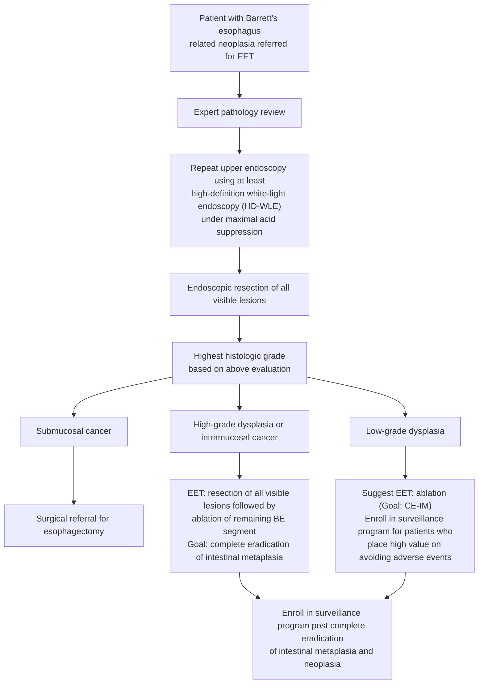

# ASGE 2018 — Endoscopic Eradication Therapy for BE-Associated Dysplasia and Intramucosal Cancer

## Bibliographic Info

- **Article:** [Wani S, Qumseya B (co-first authors), Sultan S, Agrawal D, Chandrasekhara V, Harnke B, Kothari S, McCarter M, Shaukat A, Wang A, Yang J, Dewitt J; ASGE Standards of Practice Committee. ASGE Guideline: Endoscopic Eradication Therapy for Patients with Barrett's Esophagus-Associated Dysplasia and Intramucosal Cancer (2018). Gastrointestinal Endoscopy 2018;87(4):907-931 (DOI 10.1016/j.gie.2017.10.011).](https://doi.org/10.1016/j.gie.2017.10.011)
- **Authors:** Wani S, Qumseya B (co-first authors), Sultan S, Agrawal D, Chandrasekhara V, Harnke B, Kothari S, McCarter M, Shaukat A, Wang A, Yang J, Dewitt J; ASGE Standards of Practice Committee
- **Year:** 2018
- **Journal/Publisher:** Gastrointestinal Endoscopy 2018;87(4):907-931 (DOI 10.1016/j.gie.2017.10.011)
- **DOI:** [10.1016/j.gie.2017.10.011](https://doi.org/10.1016/j.gie.2017.10.011)
- **Type:** guideline (GRADE methodology, official ASGE recommendations)

## Summary

This American Society for Gastrointestinal Endoscopy (ASGE) guideline addresses the role of endoscopic eradication therapy (EET) in the management of [[barretts-esophagus|Barrett's esophagus]] (BE)-related neoplasia — high-grade dysplasia (HGD), low-grade dysplasia (LGD), and intramucosal cancer (IMC/T1a esophageal adenocarcinoma [EAC]). In this document EET refers to endoscopic mucosal resection (EMR) of visible lesions plus radiofrequency ablation (RFA) of the remaining flat Barrett's segment, unless stated otherwise; contemporary EET also includes cryotherapy as an ablative technique.

The panel answered 7 PICO (population, intervention, comparison, outcome) questions and issued **8 graded statements** (Table 4), numbered by the document itself as 1, 2a, 2b, 3, 4, 5, 6, 7. Grading of Recommendations Assessment, Development and Evaluation (GRADE) methodology was used: strength is **Strong** ("the guideline panel recommends") or **Conditional** ("suggests"), and quality of evidence is High, Moderate, Low, or Very low. Core messages: confirm dysplasia with an expert gastrointestinal (GI) pathologist; offer EET (vs surveillance) for confirmed LGD (conditional) and HGD (strong); recommend EET over esophagectomy for HGD/IMC (strong, on the basis that lymph-node metastasis risk is 0% for HGD and ~2% for IMC); resect all visible lesions endoscopically before ablation (strong); ablate the remaining flat BE segment after EMR (conditional); do NOT routinely perform complete EMR of the entire BE segment (strong against — higher stricture/bleeding/perforation than focal EMR + RFA with equivalent eradication); and continue surveillance after complete eradication of intestinal metaplasia (CE-IM) (conditional).

The goal of EET is **CE-IM** — absence of endoscopically visible BE plus no intestinal metaplasia on surveillance biopsies. Most patients achieve CE-IM within ~3 ablation sessions. EET is cost-effective for HGD and confirmed/stable LGD (not for nondysplastic BE [NDBE]). The basic premise allowing EET over surgery is the very low lymph-node metastasis risk in mucosal disease; submucosal (T1b sm2-3) cancer, poor differentiation, and lymphovascular invasion shift the balance toward esophagectomy (lymph-node [LN] metastasis risk ≥20%).

## Key Findings / Claims (Recommendations — near-verbatim, with strength and quality)

**Summary of recommendations (Table 4) — statement numbers, strength, and quality are the document's own:**

| # | Statement (verbatim, Table 4) | Strength | Quality |
|---|---|---|---|
| 1 | In BE patients with LGD and HGD being considered for EET, we suggest confirmation of diagnosis by at least 1 expert GI pathologist or panel of pathologists compared with review by a single pathologist. | Conditional | Low |
| 2a | In BE patients with LGD, we suggest EET compared with surveillance; however, patients who place a high value on avoiding adverse events related to EET may choose surveillance as the preferred option. | Conditional | Moderate |
| 2b | In BE patients with confirmed HGD, we recommend EET compared with surveillance. | Strong | Moderate |
| 3 | In BE patients with HGD/IMC, we recommend against surgery compared with EET. | Strong | Very low |
| 4 | In BE patients referred for EET, we recommend endoscopic resection of all visible lesions compared with no endoscopic resection of visible lesions. | Strong | Moderate |
| 5 | In BE patients with visible lesions who undergo endoscopic resection, we suggest ablation of the remaining Barrett's segment compared with no ablation. | Conditional | Low |
| 6 | In BE patients with dysplasia and IMC referred for EET, we recommend against routine complete endoscopic resection of entire Barrett's segment compared with endoscopic resection of visible lesion followed by ablation of remaining Barrett's segment. | Strong | Very low |
| 7 | In BE patients with dysplasia and IMC who have achieved CE-IM after EET, we suggest surveillance endoscopy versus no surveillance. | Conditional | Very low |

**Decision tool (Figure 9) — algorithmic approach to the patient referred for EET:**

*Figure 9 — decision tool with an algorithmic approach to management of BE patients referred for EET. ([[asge-2018-barretts-eet]])*

**Pre-EET general statements (ungraded good practice):** Before embarking on EET, patients should have a clear understanding of the risks, benefits, and alternatives to EET; clinicians should obtain informed consent including discussion of natural history of BE, progression rates to EAC, surveillance and treatment options, risks/benefits of each approach, and the frequency of EET sessions and duration of follow-up. Patient comorbidities and life expectancy should be considered.

**Supporting evidence by question:**

- **Q1 — Expert pathology confirmation:** LGD confirmed by expert/panel pathologists carried a higher cumulative progression to HGD/EAC than unconfirmed studies (15.7% [12.7%-19.3%] vs 8.1% [5.3%-12%], P=.004) and higher incidence rate (.031 vs .012/person-year). Expert review changed the pathologic diagnosis in 55% (31%-77%) of cases, most often downgrading (36% [18%-59%]). Interobserver agreement among expert pathologists: κ NDBE .22, LGD .11, HGD .43. Duits et al: progression risk rose dramatically when all 3 pathologists agreed on LGD (odds ratio [OR] 47.14; 95% confidence interval [CI] 13.10-169.70).
- **Q2a — EET vs surveillance in LGD:** Relative risk (RR) of progression with RFA vs surveillance .14 (22 studies, 2746 pts); pooled from 2 randomized controlled trials (RCTs) RR .16 (95% CI .04-.57; P=.001). Cumulative progression: surveillance 12.6% (9.8%-15.9%) vs RFA 1.7% (1.1%-2.6%). For confirmed LGD, absolute risk ~25/100 over up to 84 mo on surveillance; treating 100 with EET → 21 fewer with HGD/EAC and ~9 (mostly treatable stricture) adverse events. **Confirmed LGD** (expert/panel-confirmed) and **persistent LGD** (LGD on 2 consecutive endoscopies) are the only reproducible progression risk factors; no biomarker is ready for clinical practice. The panel declined to make risk-group-specific recommendations, emphasizing confirmation of LGD plus shared decision-making.
  - *LGD managed by surveillance rather than EET* — the expert review the panel cites suggests endoscopy **every 6 months ×2, then annually** unless there is reversion to NDBE, with **4-quadrant biopsies every 1-2 cm** plus biopsy of any visible lesion. Evidence-based recommendations on surveillance intervals are not available.
- **Q2b — EET vs surveillance in HGD:** RR of progression .42 (95% CI .24-.73; P=.0002) from 2 RCTs; indirect comparison cumulative progression surveillance 34% (25.5%-43.8%) vs EET 7.4% (4.5%-11.7%), RR .22. HGD adverse-event subanalysis 10.6% (5.7%-19.1%).
- **EET safety (RFA ± EMR, 37 studies, 9200 pts):** overall serious adverse event rate **8.8% (6.5%-11.9%)**; **stricture 5.6% (4.2%-7.4%)** (most common), bleeding 1% (.8%-1.3%), perforation 0.6% (.4%-.9%). Adverse events significantly higher for RFA *with* EMR vs RFA alone (RR 4.4; P=.015).
- **Q3 — EET vs esophagectomy (HGD/IMC):** No difference in complete eradication of HGD/IMC (RR .96; .91-1.01) or in 1-, 3-, 5-year survival (5-yr RR .88; .74-1.04) or EAC-related mortality. Neoplasia recurrence higher with EET (RR 9.5; 3.26-27.75 — 2 more per 100). Major adverse events fewer with EET (RR .38; .20-.73; 16 fewer per 100). LN metastasis risk: 0% in HGD, up to 2% in IMC. Esophagectomy preferred for **T1b sm2-3 submucosal cancer, poorly differentiated cancer, lymphovascular invasion** (LN metastasis risk ≥20%). Esophagectomy operative mortality ~2%. >95% of recurrences after EET are successfully re-treated endoscopically.
- **Q4 — EMR of visible lesions:** EMR changed the pathologic diagnosis in **39% (34%-45%)** of patients, mostly **upstaging**. EMR provides larger/deeper specimens (to muscularis mucosa/submucosa) improving staging accuracy and interobserver agreement. EMR safety: in 681-patient cohort (2513 EMRs) no perforations, bleeding 1.2%, stricture 1%. "Visible lesions" = nodularity, ulceration, plaques, depression, or mucosal discoloration; resect all "no matter how subtle."
- **Q5 — Ablation of remaining flat BE after EMR:** Pech et al — metachronous neoplasia 16.5% (EMR + ablation) vs 29.9% (EMR alone), P=.0014; lack of ablation predicted recurrence (RR 2.5; 1.52-3.85). Manner RCT (EMR + argon plasma coagulation [APC] vs EMR alone) stopped early: recurrence 3% vs 36.7%. Achieving CE-IM was protective for mortality (OR .4; .3-.6).
- **Q6 — Focal EMR + RFA vs complete EMR (cEMR) of entire segment:** Equivalent complete eradication of neoplasia (EMR+RFA 93.4% vs cEMR 94.9%) and CE-IM, but cEMR caused significantly more strictures (OR 4.73; 1.61-13.85), bleeding (OR 6.88; 2.19-21.62), and perforation (OR 7.00; 1.56-31.33). No difference in recurrence. cEMR may be acceptable in select cases (multifocal disease, diffuse nodularity, select short-segment BE).
- **Q7 — Surveillance after CE-IM:** Pooled recurrence (Fujii-Lau): any recurrence **7.5/100 patient-years**, intestinal metaplasia recurrence **4.8/100 patient-years**, dysplasia recurrence **2.0/100 patient-years**; most recurrences reported within the first 3 years after achieving CE-IM. CE-IM defined by 1 or 2 consecutive negative endoscopies (number not standardized; no difference in recurrence rates by definition).
  - *Post-CE-IM surveillance intervals* — largely driven by expert opinion and low-quality evidence; intervals are set by **pretreatment histology** after an initial endoscopy at **3-6 months** post-CE-IM. Baseline **HGD**: every 3 months in year 1, then every 6 months in year 2, then yearly. Baseline **LGD**: the most recent American Gastroenterological Association (AGA) guidelines suggest yearly for 2 years, then every 3 years.
  - *Post-CE-IM biopsy technique* — not standardized; the suggested protocol is 4-quadrant biopsies every 2 cm throughout the length of the **original** BE segment plus any visible columnar mucosa/lesion. Recent data suggest no additional yield from biopsies taken >2 cm above the gastroesophageal junction (GEJ) when the neosquamous epithelium has no visible lesion. Histology is required to confirm recurrent intestinal metaplasia or neoplasia.
  - *Who to enroll* — also patients in whom the goal of EET was complete eradication of dysplasia only (a select few).
  - *Recurrence risk factors (limited data, need confirmation)* — ongoing reflux and erosive esophagitis, older age, nonwhite race, smoking, obesity, pretreatment BE length, number of EET sessions.
  - *Reflux control* — medical antireflux therapy aimed at minimizing reflux symptoms and achieving absence of esophagitis on endoscopy is critical after CE-IM; EET with a structured reflux management protocol achieved a high CE-IM rate with low recurrence (intestinal metaplasia 4.8%, dysplasia 1.5%).
- **Cost-effectiveness:** in HGD, RFA was more effective and less costly than esophagectomy (.704 more quality-adjusted life years, costing $25,609); initial RFA was cost-effective for confirmed and stable LGD but **not** for NDBE; EET was also cost-effective in submucosal cancer, especially at high operative risk.
- **Who should perform EET (expert suggestion, ungraded):** expertise in HD-WLE and optical chromoendoscopy for inspecting BE; use of uniform grading systems and recognition of visible lesions within the BE segment; expertise in both EMR and ablative techniques; ability to manage EET adverse events including recurrences. No validated competency assessment tool exists.

## Relevance to Wiki

- Updates [[barretts-esophagus]] therapeutics: screening-independent dysplasia management — expert pathology confirmation, EET indications by grade, EMR-first for visible lesions, focal EMR + ablation over complete EMR, EET over esophagectomy for HGD/IMC, post-CE-IM surveillance.
- Anchors [[endoscopic-eradication-therapy]] (EET technique, RFA/cryotherapy, CE-IM goal, adverse-event rates, recurrence).
- Cross-links to [[radiofrequency-ablation|RFA]], [[endoscopic-mucosal-resection|EMR]], [[esophageal-adenocarcinoma]], [[upper-endoscopy]].

## Contradictions / Open Questions

- **Submucosal cancer — ASGE 2018 is more restrictive than later guidelines.** Its Figure 9 routes *all* submucosal cancer to surgical referral, although its text limits the esophagectomy indication to T1b sm2-3 disease, poor differentiation, or lymphovascular invasion. [[acg-2022-barretts]] allows EET to be considered for sm1 cancer with low-risk features (well differentiated, <2 cm, no lymphovascular invasion). The newer guideline governs management on entity pages.
- **Post-CE-IM surveillance intervals differ between documents.** ASGE 2018 relays expert-opinion schedules (baseline HGD: 3 months ×4, then 6 months ×2, then yearly; baseline LGD: yearly ×2, then every 3 years per AGA at the time). ACG 2022 gives baseline HGD/T1a at 3, 6, and 12 months then annually, and baseline LGD at 1 year, 3 years, then every 2 years. Use the newer schedule for timing.
- ASGE 2018 issues a *strong recommendation against esophagectomy* for HGD/IMC on very low-quality evidence, reflecting the low lymph-node metastasis risk — directionally consistent with [[aga-2024-barretts-eet]] and American College of Gastroenterology (ACG) positions.
- No RCT of EET vs esophagectomy exists and none is anticipated; the Q3 comparison rests entirely on observational data with selection bias (sicker patients preferentially received EET).
- Panel-identified knowledge gaps: no validated histologic criteria or uniform reporting for LGD, no validated EET competency tool, and no risk-stratification model combining demographics, endoscopic findings, histopathology, and biomarkers.

## See Also

[[barretts-esophagus]], [[endoscopic-eradication-therapy]], [[radiofrequency-ablation]], [[endoscopic-mucosal-resection]], [[esophageal-adenocarcinoma]], [[upper-endoscopy]]
