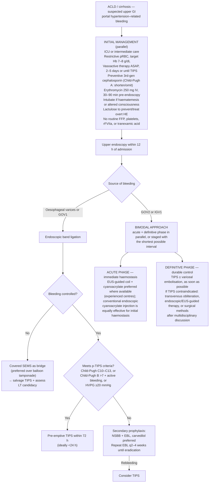
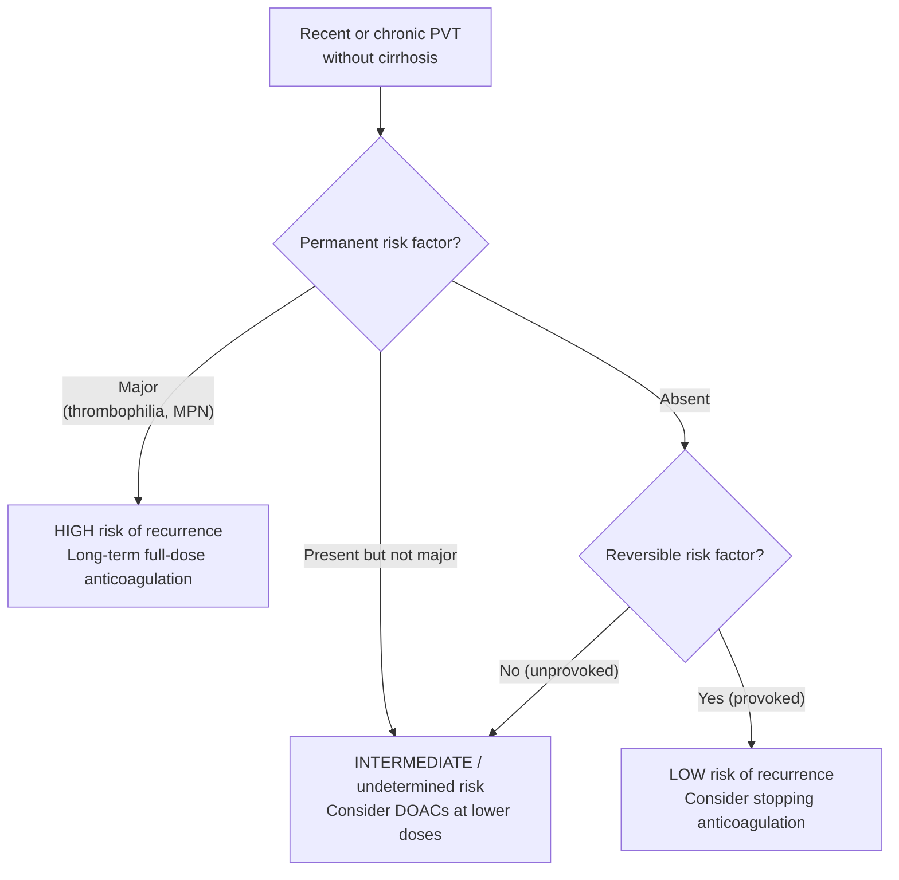

## Bibliographic Info

- **Article:** [Baveno VIII Faculty (Berzigotti A, Mandorfer M, Pons M, Abraldes JG, Dajti E, Genescà J, et al.; de Franchis R, senior author). Baveno VIII – Advancing consensus in portal hypertension. J Hepatol. 2026; accepted pre-proof (31 July 2026).](https://doi.org/10.1016/j.jhep.2026.07.030)
- **Authors:** Baveno VIII Faculty (n=84 across 9 panels + 5 invited lecturers); panel chairs/panelists incl. Berzigotti, Mandorfer, Pons, Abraldes, Genescà, Tsochatzis, Castera, Ripoll, Bosch, Villanueva, Trebicka, García-Pagán, Thabut, Albillos, Bajaj, Garcia-Tsao, Reiberger, Hernández-Gea, Valla, Rautou, Sarin, Krag, Shneider, Gracia-Sancho, de Franchis
- **Year:** 2026 (consensus conference held March 2026, Baveno, Italy; received 26 May 2026, accepted 30 July 2026)
- **Journal/Publisher:** Journal of Hepatology (Elsevier) — Baveno Cooperation, an official EASL consortium, with VALDIG; endorsed by **EASL**, **ESGE**, and **ERN RARE-LIVER**
- **DOI:** [10.1016/j.jhep.2026.07.030](https://doi.org/10.1016/j.jhep.2026.07.030)
- **Type:** consensus statement (international consensus workshop; 272 statements, each with Oxford CEBM level of evidence, strength of recommendation, change status vs Baveno VII, and % faculty agreement; **strong consensus = >80% agreement**)

## Contents
- [[#Summary]]
- [[#What changed from Baveno VII]]
- [[#Key Findings / Claims]]
  - [[#Panel 1 — Risk stratification in cACLD]]
  - [[#Panel 2 — Modifiers of steatotic liver disease (SLD)]]
  - [[#Panel 3 — Prevention of (first) decompensation]]
  - [[#Panel 4 — Prevention of further decompensation]]
  - [[#Panel 5 — Management of portal hypertensive bleeding]]
  - [[#Panel 6 — Management of further decompensation]]
  - [[#Panel 7 — Cirrhosis recompensation]]
  - [[#Panel 8 — Vascular liver diseases, BCS, PSVD/NCPF]]
  - [[#Panel 9 — Portal vein thrombosis]]
  - [[#Figures reproduced as text]]
  - [[#Prior-Baveno statements that remain valid]]
  - [[#Research agenda — selected priorities]]
- [[#Relevance to Wiki]]
- [[#Contradictions / Open Questions]]

---

## Summary

Baveno VIII is the eighth international consensus conference on portal hypertension (Baveno, Italy, March 2026), run by the Baveno Cooperation with the Vascular Liver Disease Interest Group (VALDIG) and endorsed by EASL, ESGE, and ERN RARE-LIVER. It updates [[baveno-vii-2022-portal-hypertension|Baveno VII]] across **nine panels**: (1) NIT-based risk stratification in cACLD; (2) modifiers of steatotic liver disease; (3) prevention of first decompensation; (4) prevention of further decompensation; (5) management of portal hypertension–related GI bleeding; (6) management of further decompensation; (7) cirrhosis recompensation; (8) vascular liver diseases including Budd-Chiari syndrome and PSVD/NCPF; (9) portal vein thrombosis with and without underlying liver disease. **272 statements** reached ≥80% agreement. For the first time the document includes **paediatric** statements (Panels 1 and 9).

The direction of travel is away from the catheter and toward the non-invasive test. Baveno VII said NITs were "sufficiently accurate" to identify CSPH; Baveno VIII makes them the operative diagnostic route, adds an **explicit three-limb diagnostic definition of CSPH by NIT** (ANTICIPATE/ANTICIPATE-NASH or NICER ≥75%; LSM ≥25 kPa in virus/alcohol/non-obese MASLD; SSM at 100 Hz >55 kPa), and states that HVPG statements from earlier workshops "remain valid but should be interpreted in the context of current Baveno VIII recommendations which favor non-invasive tests over routine HVPG measurements in daily clinical practice." Statement 1.18 names the next step explicitly: the paradigm is shifting from **estimating the probability of CSPH** to **directly predicting decompensation**.

Three other shifts matter clinically. **Recompensation is redefined and operationalised** — the vague "stable improvement in liver function" of Baveno VII becomes **CTP A5/A6**, the sustained-resolution window drops from ≥12 months to **>6 consecutive months**, patients with TIPS are explicitly eligible, and NSBB withdrawal now requires *confirmed* CSPH resolution with named non-invasive rules (LSM <10 kPa; or LSM <15 + SSM <25 kPa). **Adjunctive drug claims are walked back** — Baveno VII "encouraged" statins in patients with an approved indication on the strength of a portal-pressure and survival signal; Baveno VIII finds the evidence insufficient to recommend statins *or* anticoagulation to prevent either first or further decompensation, and separately withdraws the Baveno VII recommendation for long-term primary antibiotic prophylaxis after a first decompensating event. **PSVD gets a scoring system and, for the first time, a non-invasive escape from endoscopy** (SSM <40 kPa plus bilirubin <1 mg/dL), and is formally dual-named PSVD **or** NCPF under a 2026 multi-society nomenclature agreement.

Baveno VIII also removes a number that clinicians carry: the Baveno VII **TIPS futility rule** (CTP ≥14, or MELD >30 with lactate >12 mmol/L) is gone. Statement 5.37 instead directs that salvage TIPS "should be discussed for any refractory variceal bleeding, regardless of age, the Child-Pugh and MELD scores, on a case-by-case basis," and the research agenda asks for a **new** externally validated futility score (RA5.13).

## What changed from Baveno VII

The single highest-yield table on this page — every Baveno VII rule this document supersedes, with the old value beside the new one.

| Topic | Baveno VII (2022) | Baveno VIII (2026) |
|---|---|---|
| Terminology | "cACLD" and "compensated cirrhosis" both acceptable, no preference (2.3) | **cACLD preferred** when the diagnosis is established by NITs (1.2) |
| Confirming an index LSM ≥10 kPa | Repeat fasting **or** corroborate with a named serum marker (FIB-4 ≥2.67, ELF ≥9.8, FibroTest ≥0.58/0.48) (2.11) | **LSM is always performed fasting**; index ≥10 kPa → repeat, or complement with "another validated NIT of advanced fibrosis" — the named serum cut-offs are not restated (1.4) |
| Ruling **in** CSPH non-invasively | LSM ≥25 kPa (2.16); ANTICIPATE **≥60%** risk bands (LSM 20–25 + PLT <150, or LSM 15–20 + PLT <110) (2.17); SSM >50 kPa in viral cACLD (2.21) | **Any of three:** ANTICIPATE/ANTICIPATE-NASH **or NICER ≥75%**; LSM ≥25 kPa (virus/alcohol/non-obese MASLD); **SSM (100 Hz) >55 kPa** — aetiology-agnostic (1.16) |
| Ruling **out** CSPH | LSM ≤15 kPa + PLT ≥150 ×10⁹/L (B.2) (2.15) | Same thresholds, **upgraded to LoE 1 / strong** (1.15) |
| SSM rule-out of CSPH | **<21 kPa**, viral cACLD only (2.21) | Not restated as a CSPH rule-out; SSM appears as a **rule-in at >55 kPa** and as an endoscopy-sparing threshold at **<40 kPa** (1.16c, 1.19) |
| Repeating NITs in cACLD | LSM **could be** repeated every 12 months (2.12) | NITs for CSPH **should be** repeated every 12 months (1.9); **the most recent value guides decisions** (1.10) |
| Sparing screening endoscopy (NSBB-ineligible) | Endoscopy if LSM ≥20 kPa **or** PLT ≤150 (2.19); SSM **≤**40 kPa as escape (2.22) | Endoscopy **unless** LSM <20 kPa **and** PLT ≥150, **or** SSM **<**40 kPa (1.19) |
| Follow-up when endoscopy avoided | Yearly TE + platelet count (2.20) | Repeat **EGD** at **2 years** (active aetiology) or **3 years** (aetiology removed/suppressed) if no varices at index EGD (1.20) |
| Statins | Use "should be **encouraged**" with an approved indication — may lower portal pressure (A.1) and improve survival (B.1) (4.1) | **Insufficient evidence to recommend** statins to prevent first (3.22) or further (4.11) decompensation; use/continue only for approved indications |
| Anticoagulation as a portal-hypertension therapy | "Should not be discouraged" — may reduce liver-related outcomes and improve survival (B.1) (4.11) | **Insufficient evidence to recommend** to prevent decompensation; use/maintain for approved indications (3.22) |
| Long-term primary antibiotic prophylaxis | Recommended in selected high-SBP-risk patients (GI haemorrhage, CTP C with low-protein ascites) (4.6) | **Not recommended** after a first decompensating event to prevent further decompensation (4.12) |
| Primary prophylaxis of gastric variceal bleeding | No indication for BRTO/BATO or TIPS; cyanoacrylate evidence noted but NSBB indicated (5.21–5.22) | High-risk **GOV2/IGV1** with NSBB contraindication/intolerance → **endoscopic injection, EUS-guided therapy, or transvenous obliteration** may be considered in expert centres (3.21b) |
| Pre-emptive TIPS criteria | Child-Pugh **C <14 points**, or B >7 with active bleeding, or HVPG **>**20 mmHg (6.27) | Child-Pugh **C 10–13 points**, or B >7 with active bleeding, or HVPG **≥**20 mmHg (5.31) |
| Missed pre-emptive TIPS window | Not addressed | TIPS within **2 weeks** (CTP C 10–13) or **1 week** (CTP B >7 + active bleeding) may still benefit (5.32) |
| TIPS futility | May be futile at **Child-Pugh ≥14, or MELD >30 with lactate >12 mmol/L** (6.31) | **Rule removed.** Salvage TIPS discussed for any refractory bleeding **regardless of age, CTP, MELD**, case-by-case (5.37); a new futility score is a research priority (RA5.13) |
| Vasoactive drug duration in AVB | 2–5 days (6.5) | 2–5 days **or until TIPS is placed** (5.7); a **shorter course, even 24 h**, after successful endoscopic haemostasis **provided NSBB is then initiated** (5.8) |
| Antibiotics in AVB | Ceftriaxone **1 g/24 h** in advanced cirrhosis / quinolone-resistant settings (6.9) | **3rd-generation cephalosporins** generally preferred (no dose given); **duration and need individualized** — Child-Pugh A may need a shorter course or none (5.10, 5.11) |
| Erythromycin before endoscopy | 250 mg IV, **30–120 min** before (6.19) | 250 mg IV single dose, **30–90 min** before (5.20) |
| Refractory oesophageal variceal bleeding | SEMS **as efficacious as** balloon tamponade and safer (6.29) | Dedicated covered SEMS **preferred over** balloon tamponade (5.35) |
| GAVE with transfusion dependence | APC, RFA, or band ligation "may be used" for PHG/GAVE (6.25) | **EVL recommended over argon plasma coagulation** — higher eradication, fewer sessions, less rebleeding/hospitalisation/transfusion (5.43) |
| PHG bleeding | Endoscopic therapy (APC, hemospray) may be used (7.14); TIPS for transfusion-dependent PHG (7.15) | **NSBB first**; **TIPS is the most effective rescue therapy**; endoscopic therapies give limited benefit — reserved for focal lesions or salvage (5.44) |
| Ascites + varices, choice of prophylaxis | Stratified by variceal size/red signs/CTP C (7.5, 7.6) | **Any varices + ascites → carvedilol/cNSBB, carvedilol preferred** — size stratification dropped (4.4) |
| Secondary prophylaxis after OV bleed | Traditional NSBB **or** carvedilol + EVL, no preference (7.8) | NSBB + EVL, **carvedilol preferred over cNSBB** (4.8) |
| Recompensation — duration of sustained resolution | **≥12 months** (7.23b) | **>6 consecutive months** (7.4d) |
| Recompensation — liver function criterion | "Stable improvement of liver function tests (albumin, INR, bilirubin)" (7.23c) | Improvement **to CTP A5/A6** (7.4e) |
| Recompensation after TIPS | Resolution of ascites or freedom from rebleeding after TIPS "is not evidence of recompensation" (7.25) | **Patients with TIPS may achieve recompensation** if all 7.4 criteria met; ascites resolution or absence of rebleeding *alone* still is not (7.8) |
| Stopping NSBB after recompensation | Do not stop unless CSPH resolves (7.24) — no method given | Stop only if CSPH resolution is **confirmed** (7.18): **HVPG <10 mmHg off carvedilol/cNSBB** (7.16), or **LSM <10 kPa**, or **LSM <15 + SSM <25 kPa** (7.19) |
| BCS prognostic scores | **BCS-TIPS prognostic index >7** → consider LT before TIPS (8.24, 8.25) | Available BCS scores **should not determine individual management alone**; research use only (8.36) |
| BCS — biopsy | Do not biopsy when imaging shows outflow obstruction (8.11) | Same, stated positively: **radiologically confirmed BCS needs no biopsy** (8.26) |
| BCS — HCC surveillance | Periodic imaging + AFP, 6-month interval; US vs MRI unclear (8.13–8.15) | 6-month imaging **+ AFP**; **AFP >15 ng/mL should raise suspicion**; **LI-RADS cannot be applied**; MRI with hepatobiliary contrast to characterise; histology to confirm HCC (8.29, 8.30) |
| PSVD nomenclature | PSVD only (9.14) | **PSVD *or* NCPF** — both accepted under a 2026 multi-society nomenclature agreement, same definition and criteria (8.39) |
| PSVD — biopsy adequacy | Specimen **>20 mm**, minimal fragmentation (9.18) | Specimen **≥15 mm with at least one fragment ≥10 mm** (8.41) |
| PSVD — diagnostic criteria | Three-way rule on specific/non-specific PH features × specific/compatible histology (9.19, Table 2) | **Point-scoring system** (Figure 4) with major/minor histological criteria and a penalty for concomitant CLD (8.42–8.44) |
| PSVD — endoscopy | Endoscopic screening **required** at diagnosis; non-invasive criteria **cannot be applied** (9.21, 9.22) | Screening at diagnosis, **but endoscopy can be safely avoided if SSM <40 kPa and bilirubin <1 mg/dL** (8.47); only the **LSM-based** cirrhosis criteria remain inapplicable (8.48) |
| PSVD — surveillance interval | Not defined (9.23) | **2 years if no varices, 1 year if small varices** (8.46) |
| PVT — degree of occlusion | % of lumen **obstructed** by clot: complete (no lumen) / partial (>50% obstructed) / minimal (<50% obstructed) (Table 1) | **VALDIG criteria — % of *remnant* lumen (RL)** vs largest diameter: **minimal RL ≥50%; partial RL <50%; complete RL = 0%**, on portal-venous-phase CT/MRI perpendicular to the main PV (9.3) |
| Non-cirrhotic PVT — first oral anticoagulant | LMWH → **switch to VKA** when possible; DOACs in selected cases (8.37) | LMWH → oral; **DOACs may be the primary oral choice** absent double/triple-positive APS, pregnancy, CTP C–equivalent dysfunction, or GFR <30 (8.6) |
| Non-cirrhotic PVT — long-term AC | Recommended with a permanent prothrombotic state, considered without one (8.39, 8.45); D-dimer <500 ng/mL at 1 month predicts low recurrence (8.40) | **Stratified by risk factor** (9.10): permanent **major** RF → long-term full-dose; **no** permanent major RF → **long-term DOAC at lower dose**; resolved reversible RF with no permanent RF → consider stopping. **D-dimer rule dropped** (moved to research agenda RA9.4) |
| Non-cirrhotic PVT — stopping early | ≥6 months in all (8.38) | ≥6 months, **but stopping may be considered after complete recanalisation at 3 months** if a reversible RF has fully resolved and no permanent RF exists (9.8) |
| AC vs variceal prophylaxis sequencing (VLD) | Start AC **after** bleeding prophylaxis has been initiated in high-risk varices (8.47) | **AC should be initiated without delay and not postponed** pending endoscopic prophylaxis (8.10) |
| PVT in cirrhosis — LT candidates | AC recommended in potential transplant candidates regardless of degree/extension (9.5iii) | AC recommended in potential LT candidates **with any PVT** (9.18); continue **until surgery** (9.20) |
| PVT in cirrhosis — post-TIPS AC | Not addressed | **Routine anticoagulation after TIPS is not recommended** (9.28) |
| Rifaximin before elective TIPS | Consider **in patients with previous overt HE** (4.9) | Consider **in candidates for elective TIPS** generally (6.16) |
| Rifaximin for SBP prophylaxis | "**Not indicated**" beyond HE indications, including SBP prophylaxis (4.10) | "**Data are insufficient** to recommend rifaximin for secondary prophylaxis of SBP" (6.23) |
| Long-term albumin in ascites | "No formal recommendation can be given until further data" (4.4) | **May be considered** in recurrent/refractory ascites in patients who are **not TIPS candidates** (6.10) |
| Minimal/imaging-only ascites, covert HE, occult PHG bleeding | "Insufficient data" whether they count as decompensation (5.6) | **Cannot be considered decompensation** (3.4a) — though minimal/imaging-only ascites may carry decreased survival (3.4b) |

---

## Key Findings / Claims

*Complete statement list as given in the source. Each carries the source's own level of evidence (LoE, Oxford CEBM), strength of recommendation (SoR) where given, change status vs Baveno VII, and % faculty agreement. Throughout the document, **LSM refers to values obtained by vibration-controlled transient elastography (VCTE)** unless otherwise specified.*

### Panel 1 — Risk stratification in cACLD

**Definition and identification of cACLD**

- **1.1** The term "compensated advanced chronic liver disease (cACLD)" reflects the continuum of severe fibrosis and cirrhosis. A pragmatic definition of cACLD based on liver stiffness measurement (LSM) aims to identify those at risk of CSPH, decompensation, and liver-related death at point of care, irrespective of histological stage or the ability of LSM to identify these stages. (LoE 3; modified; Agreement: 100%)
- **1.2** "Compensated cirrhosis" and "cACLD" are not interchangeable, and the latter is preferred if the diagnosis is established by non-invasive tests (NITs). (LoE 3; modified; Agreement: 97%)
- **1.3** LSM values <10 kPa in the absence of other known clinical/imaging signs rule out cACLD; values between 10 and 15 kPa are suggestive of cACLD; values >15 kPa are highly suggestive of cACLD. (LoE 3; SoR: strong; modified; Agreement: 100%)
- **1.4** LSM should always (i.e., for diagnosis of cACLD or CSPH) be performed under fasting conditions. In patients with an index LSM ≥10 kPa, LSM should either be repeated (LoE 2; SoR: strong), or may be complemented by another validated NIT of advanced fibrosis (LoE 3; SoR: weak) to confirm cACLD. (modified; Agreement: 97%)
- **1.5** Patients with chronic liver disease (which does not include vascular liver disease – see respective section) and an LSM <10 kPa have a negligible 3-year risk (≤1%) of decompensation and liver-related death. (LoE 1; modified – minimal; Agreement: 98%)
- **1.6** LSM values <10 kPa in patients with clinical/imaging signs of portal hypertension should raise the suspicion for vascular liver disease (see respective section). (LoE 3; SoR: strong; new; Agreement: 100%)
- **1.7** Patients with cACLD should be referred to a liver disease specialist for further work-up. (LoE 3; SoR: strong; unchanged; Agreement: 100%)

**Prognosis and monitoring**

- **1.8** In patients with cACLD, LSM holds prognostic information. (LoE 1) A rule of 5 for LSM (10-15-20-25 kPa) denotes progressively higher relative risks of decompensation and liver-related death, independently of the aetiology of chronic liver disease. (LoE 2; modified; Agreement: 100%)
- **1.9** In patients with cACLD, NITs for CSPH (see below) should be repeated every 12 months. (LoE 3; SoR: strong; modified; Agreement: 97%)
- **1.10** Changes in LSM confer prognostic information; however, the most recent value should guide clinical decision-making. (LoE 2; SoR: strong; new; Agreement: 97%)

**Non-invasive diagnosis of CSPH**

- **1.11** Although the concept of CSPH is based on HVPG, validated elastography- and validated NITs (see 1.12–1.16) are sufficiently accurate to exclude or identify CSPH and are similarly predictive of hepatic decompensation in cACLD. (LoE 1) The body of evidence for rare aetiologies is more limited. (modified; Agreement: 97%)
- **1.12** LSM and platelet count (PLT), as well as their derivatives (i.e., ANTICIPATE models) are the mainstay of non-invasive diagnosis of CSPH. (LoE 1; modified; Agreement: 94%)
- **1.13** Spleen stiffness measurement (SSM) may further improve the classification of CSPH. (LoE 2; new; Agreement: 94%)
- **1.14** ANTICIPATE (ANTICIPATE-NASH for people with MASLD and obesity [≥30 kg/m²]) (LoE 1; SoR: strong) or NICER (LoE 2; SoR: strong) should be used to non-invasively estimate the probability of CSPH in cACLD. (new; Agreement: 97%)
- **1.15** In patients with cACLD, LSM ≤15 kPa and PLT ≥150×10⁹/L rule out CSPH (negative predictive value >90%). (LoE 1; SoR: strong; modified; Agreement: 100%)
- **1.16** In patients with cACLD, the following criteria are recommended to establish the diagnosis of CSPH, while considering their individual limitations: (new)
  - a. Estimated probability of CSPH **≥75%** by ANTICIPATE/ANTICIPATE-NASH (LoE 1; SoR: strong) or NICER. (LoE 2; SoR: strong; Agreement: 93%)
  - b. In virus- and/or alcohol-related cACLD and non-obese (BMI <30 kg/m²) MASLD-related cACLD, **LSM ≥25 kPa**. (LoE 1; SoR: strong; Agreement: 91%)
  - c. **SSM (100 Hz) >55 kPa**. (LoE 2; SoR: strong; Agreement: 88%)
- **1.17** In patients with cACLD and NITs in the indeterminate range (i.e., not meeting rule out or diagnostic criteria for CSPH), re-evaluation at 12 months may be the preferred management strategy. (LoE 4; SoR: weak; new; Agreement: 88%)
- **1.18** Given the need to identify patients at substantial risk of decompensation, who benefit the most from preventive treatments (e.g., carvedilol/non-selective beta-blockers [NSBBs] and investigative therapies), the paradigm is shifting from non-invasive estimation of CSPH probability to non-invasive prediction of decompensation as a direct endpoint. Key prognostic indicators for decompensation include presence of CSPH, hepatic function, and aetiological factors. (LoE 2; new; Agreement: 94%)

**Variceal screening**

- **1.19** Patients with cACLD who are ineligible for NSBB (contraindications or intolerance) to prevent decompensation should undergo oesophago-gastro-duodenoscopy (EGD) to screen for varices, unless LSM is <20 kPa and PLT ≥150 ×10⁹/L, or SSM <40 kPa. (LoE 1; SoR: strong; modified; Agreement: 100%)
- **1.20** Patients with cACLD who are ineligible for NSBB therapy to prevent decompensation and who do not have varices at index EGD should undergo repeat EGD, unless they subsequently meet criteria specified in 1.19. Time intervals for repeating EGD are **2 years** for cACLD patients with an active aetiological factor and **3 years** for those in whom the primary aetiological factor has been removed/suppressed. (LoE 4; SoR: strong; new; Agreement: 100%)

**Use of NITs in patients with hepatocellular carcinoma (HCC)**

- **1.21** In patients with macrovascular invasion, NITs for CSPH/high-risk varices may not be applicable. (LoE 3; SoR: weak; new; Agreement: 94%)
- **1.22** In patients with cACLD and Barcelona Clinic Liver Cancer (BCLC) stages 0-C, LSM ≤15 kPa and PLT ≥150×10⁹/L rule out CSPH (negative predictive value >90%) and EGD may be avoided. (LoE 3; SoR: weak; new; Agreement: 94%)
- **1.23** In patients with cACLD and BCLC stages 0-A without large (>5 cm) nodules in the right liver lobe, an estimated probability of CSPH ≥75% by ANTICIPATE/ANTICIPATE-NASH may be highly suggestive of CSPH. (LoE 3; SoR: weak; new; Agreement: 95%)

**Paediatric statements**

- **1.24** In children, extrahepatic portal vein obstruction and advanced chronic liver disease (ACLD) due to biliary atresia are the two leading causes of portal hypertension. (LoE 1; new; Agreement: 95%)
- **1.25** LSM is a valuable complementary tool that enables the non-invasive identification of children at risk for portal hypertension due to ACLD and helps to monitor disease progression. (LoE 3; SoR: strong; new; Agreement: 97%)
- **1.26** In paediatric patients, management of portal hypertension cannot rely solely on LSM and/or SSM, as cut-offs to identify the presence or absence of varices require further validation. (LoE 3; SoR: strong; new; Agreement: 100%)
- **1.27** In children, integrating multiple NITs (e.g., the clinical prediction rule based on the age-adjusted Z-score for spleen length, PLT, and serum albumin) may facilitate prediction of high-risk varices and guide endoscopy intervals. (LoE 3; new; Agreement: 100%)

### Panel 2 — Modifiers of steatotic liver disease (SLD)

**Alcohol abstinence and liver-related events**

- **2.1** Return to/continuation of alcohol use is a major driver of liver-related events in patients with alcohol-related cACLD. (LoE 2; new; Agreement: 98%)
- **2.2** In patients with alcohol-related cACLD, complete alcohol abstinence should be favoured over reduction of alcohol consumption to decrease liver-related events. (LoE 2; SoR: strong; new; Agreement: 100%)

**Interpretation of NIT changes in ALD**

- **2.3** In patients with alcohol-related cACLD, a confirmed ≥30% relative change in LSM is associated with a corresponding change in the risk of liver-related events. (LoE 5; new; Agreement: 94%)
- **2.4** In patients with alcohol-related liver disease, FIB-4, LSM, Enhanced Liver Fibrosis (ELF) test and Fibrotest are associated with liver-related events and survival. (LoE 2; new; Agreement: 100%)

**Interpretation of NIT changes in MASLD**

- **2.5** In MASLD-related cACLD, HVPG may underestimate the true portal pressure gradient. However, an HVPG ≥10 mmHg remains associated with a significantly increased risk of decompensation compared with the lower, albeit still present, risk observed with HVPG <10 mmHg. (LoE 3; new; Agreement: 98%)
- **2.6** In patients with MASLD-related cACLD without CSPH, a confirmed ≥30% relative reduction in LSM may indicate a ≥1 stage fibrosis regression. (LoE 3; new; Agreement: 90%)
- **2.7** In patients with MASLD-related cACLD without CSPH, combining a confirmed ≥30% relative reduction in LSM with improvement in an independent non-invasive test (e.g., ≥0.5-unit absolute reduction in ELF) improves the assessment of ≥1 stage fibrosis regression compared with LSM alone. (LoE 3; new; Agreement: 88%)
- **2.8** NITs and their longitudinal changes should preferentially be calibrated to estimate the risk of liver-related events and its modification over time rather than to assess fibrosis stage or fibrosis stage change. (LoE 4; new; Agreement: 91%)
- **2.9** In patients with MASLD-related cACLD, a confirmed ≥30% relative change in LSM is associated with a clinically meaningful change in the risk of liver-related events, particularly when it results in crossing the 15 kPa risk threshold. (LoE 2; new; Agreement: 96%)
- **2.10** Although the confirmed relative changes in LSM by point-shear wave elastography and 2D shear wave elastography likely carry similar clinical meaning as LSM, the available evidence is currently insufficient to support a specific recommendation on their use as monitoring tools. (LoE 4; new; Agreement: 97%)
- **2.11** A ≥20% relative change in LSM by magnetic resonance elastography is associated with a clinically meaningful change in the risk of liver-related events in patients with MASLD-related cACLD. (LoE 4; new; Agreement: 94%)
- **2.12** A 0.5-unit absolute change in ELF is associated with a clinically meaningful change in the risk of liver-related events in patients with MASLD. (LoE 3; new; Agreement: 96%)
- **2.13** In patients with MASLD-related cACLD, ≥10% weight reduction is associated with a ≥30% relative reduction in LSM, a surrogate of reduced risk of liver-related events. (LoE 3; new; Agreement: 83%)

**Metabolic and bariatric surgery**

- **2.14** In patients with MASLD-related cACLD without CSPH, metabolic and bariatric surgery is associated with only a modest increase in the risk of surgical complications and may improve liver histology and liver-related events. Therefore, MASLD-related cACLD may be considered an obesity-associated morbidity that justifies consideration of metabolic and bariatric surgery at a lower BMI threshold. (LoE 3; new; Agreement: 96%)
- **2.15** Surgical complications from metabolic and bariatric surgery are increased in patients with CSPH. Patients with features suggestive of CSPH who are being considered for metabolic and bariatric surgery should be managed by a multidisciplinary team at expert centers. (LoE 3; SoR: strong; new; Agreement: 100%)
- **2.16** Metabolic and bariatric surgery is generally contraindicated in patients with decompensated cirrhosis, except in highly specialised settings, such as in conjunction with liver transplantation. These patients should be managed by a multidisciplinary team at expert centers. (LoE 3; SoR: strong; new; Agreement: 98%)

**Therapeutic agents for steatotic liver disease**

- **2.17** There are currently no regulatory approved pharmacologic therapies for the treatment of patients with MASLD and established cirrhosis. Efficacy data derived from noncirrhotic MASLD populations (moderate or advanced fibrosis) should not be extrapolated to patients with established cirrhosis. (LoE 2; SoR: strong; new; Agreement: 98%)
- **2.18** In the absence of approved disease-modifying therapies, management of MASLD-related cirrhosis should focus on optimization of lifestyle and metabolic comorbidities, prevention of hepatic decompensation, and referral for clinical trial participation. (LoE 3; SoR: strong; new; Agreement: 100%)
- **2.19** SGLT2 inhibitors and GLP-1–based therapies, including mono- and multi-receptor agonists, can be safely used in patients with cACLD, in the absence of contraindications, for their approved indications, including type 2 diabetes and, for GLP-1–based therapies, obesity. (LoE 3; SoR: strong; new; Agreement: 96%)

### Panel 3 — Prevention of (first) decompensation

**Definition of compensated cirrhosis/cACLD**

- **3.1** Compensated cirrhosis/cACLD is defined by the absence of current or past decompensation of cirrhosis. The transition from compensated to decompensated cirrhosis markedly increases mortality risk. (LoE 2; modified; Agreement: 99%)
- **3.2** (modified; Agreement: 97%)
  - a) Compensated cirrhosis/cACLD can be divided into two stages, based on the absence or presence of CSPH. (LoE 2)
  - b) CSPH increases the risk of decompensation, especially in patients with gastro-oesophageal varices. (LoE 2)
  - c) Patients with compensated cirrhosis/cACLD should be evaluated for the presence of CSPH. (LoE 2)
  - d) Presence of varices and/or portosystemic collaterals are generally signs of CSPH (LoE 2), but in cases of cured/controlled aetiology they may persist despite resolution of CSPH. (LoE 3)
  - e) The main therapeutic goal in compensated cirrhosis/cACLD with CSPH is to prevent decompensation. (LoE 2)
- **3.3** The events that define first decompensation are clinically evident ascites (or hepatic hydrothorax) caused by portal hypertension, variceal bleeding and/or overt hepatic encephalopathy (HE) (West Haven grade ≥II). (LoE 2; modified; Agreement: 99%)
- **3.4** (modified; Agreement: 93%)
  - a) Minimal ascites or ascites detectable only by imaging (LoE 3), covert overt HE (LoE 3) and occult bleeding from portal hypertensive gastroenteropathy (LoE 5) cannot be considered as decompensation.
  - b) Minimal ascites or ascites detectable only by imaging may be associated with decreased survival. (LoE 3)
- **3.5** Jaundice alone (in non-cholestatic aetiologies) may be the first clinical manifestation in a minority of patients with cACLD/cirrhosis (LoE 2), however its definition, association with superimposed liver injury, and prognostic implications require further research. (LoE 4; modified; Agreement: 96%)

**Determinants of the natural history of compensated cirrhosis/cACLD**

- **3.6** Development of hepatocellular carcinoma (HCC) in patients with cirrhosis/cACLD increases the risk of decompensation and/or death. (LoE 3; new; Agreement: 99%)
- **3.7** Superimposed acute liver injury due to alcohol-related hepatitis, acute viral hepatitis (HEV, HAV, HBV), HBV flares, autoimmune hepatitis or drug-induced liver injury (DILI) can precipitate decompensation and/or ACLF in patients with compensated cirrhosis/cACLD. (LoE 2; modified; Agreement: 100%)
- **3.8** Diabetes mellitus and overweight/obesity are frequent comorbidities in patients with compensated cirrhosis/cACLD that can adversely impact prognosis and should be addressed in clinical trials and managed in clinical practice. (LoE 2; modified; Agreement: 99%)
- **3.9** There is inconclusive data on the impact of sarcopenia and frailty on the natural history of compensated cirrhosis/cACLD. (LoE 2; modified; Agreement: 94%)
- **3.10** Bacterial infections in compensated cirrhosis/cACLD patients with CSPH can precipitate decompensation and/or ACLF and, consequently, adversely affect natural history. (LoE 2; modified; Agreement: 100%)
- **3.11** The prognostic impact of infections in the natural history of compensated cirrhosis/cACLD without CSPH is unclear. (LoE 5; modified; Agreement: 96%)
- **3.12** Periodontal disease is associated with a higher risk of decompensation in compensated cirrhosis/cACLD. (LoE 4; new; Agreement: 87%)
- **3.13** Surgery, especially major surgery, can precipitate decompensation and/or ACLF in patients with compensated cirrhosis/cACLD and CSPH, with an increasing risk at greater severity of portal hypertension. (LoE 3; new; Agreement: 100%)

**Management and therapy**

- **3.14** (new; Agreement: 99%)
  - a) Successful aetiological treatment can improve portal hypertension and reduce the incidence of decompensation. (LoE 2)
  - b) After aetiological therapy, CSPH can persist and should be reassessed. (LoE 3; SoR: strong)
- **3.15** Treatment with NSBBs, particularly carvedilol, is recommended in patients with compensated cirrhosis/cACLD and CSPH to prevent decompensation and improve survival. (LoE 2; SoR: strong; modified; Agreement: 97%)
- **3.16** In patients with compensated cirrhosis/cACLD without CSPH, NSBB should not be used for the prevention of decompensation/death. (LoE 2; SoR: strong; modified; Agreement: 99%)
- **3.17** In patients with compensated cirrhosis/cACLD with CSPH and HCC, prevention of decompensation is a clinically relevant endpoint across all stages of the oncological disease, independent of tumour-directed therapy. (LoE 3; new; Agreement: 100%)
- **3.18** Patients with compensated cirrhosis/cACLD who are on NSBBs do not require screening endoscopy for variceal detection as the results would not impact clinical management. (LoE 2; modified; Agreement: 92%)
- **3.19** In patients with compensated cirrhosis/cACLD with contraindications or intolerance to NSBB, endoscopy is recommended and if large varices (OV and GOV1) are detected, endoscopic variceal ligation (EVL) is recommended to prevent first variceal bleeding. (LoE 1; SoR: strong; modified) Endoscopic therapy on its own has no effect on prevention of non-bleeding decompensating events. (LoE 1; modified; Agreement: 100%)
- **3.20** (modified; Agreement: 97%)
  - a) In compensated cirrhosis/cACLD patients with CSPH, TIPS is not recommended for the prevention of decompensation. (LoE 5; SoR: strong)
  - b) Preoperative TIPS may be considered prior to major surgery to reduce the risk of postoperative decompensation. (LoE 4; SoR: weak)
- **3.21**
  - a) Patients with compensated cirrhosis/cACLD with gastric varices have CSPH and benefit from NSBBs, particularly carvedilol, for the prevention of decompensation. (LoE 2; modified; Agreement: 96%)
  - b) In patients with high risk GOV2, IGV1 (cardiofundal) varices who have contraindication or intolerance to NSBBs, local therapy [i.e. endoscopic injection therapy (LoE 2; SoR: strong), endosonography-guided therapy (LoE 4; SoR: weak) or transvenous obliteration (LoE 3; SoR: weak)] can be considered to prevent bleeding in centers with expertise. (modified; Agreement: 95%)
  - c) In patients with compensated cirrhosis/cACLD and GOV2, IGV1 (cardiofundal) varices, there is limited evidence to support the use of endoscopic injection therapy (LoE 3), endosonography-guided therapy (LoE 5) or transvenous obliteration (LoE 5) in addition to NSBBs to prevent first variceal bleeding and improve survival. (modified; Agreement: 96%)
- **3.22** There is insufficient evidence to recommend statins or anticoagulation to prevent decompensation (LoE 3) but they should be used or maintained if prescribed for approved indications. (LoE 2; SoR: strong; modified; Agreement: 99%)
- **3.23** Regular dental and periodontal care may decrease the risk of decompensation in compensated cirrhosis/cACLD. (LoE 3; SoR: weak; new; Agreement: 81%)

### Panel 4 — Prevention of further decompensation

**Definition**

- **4.1** In patients with decompensated cirrhosis, further decompensation (FD) represents a more advanced disease stage with a higher mortality (LoE 2; modified; Agreement: 86%) and is defined as follows:
  - (a) In patients with a **single** decompensation:
    - If **ascites**, by the need for ≥3 large-volume paracenteses (LVP) within 1 year, the occurrence of SBP, HRS-AKI, or a second decompensating event (CSPH-related bleeding, overt HE, or jaundice);
    - If **variceal bleeding**, by the development of CSPH-related re-bleeding or a second decompensating event (ascites, overt HE, or jaundice);
    - If **overt HE**, by the development of recurrent overt HE or a second decompensating event (ascites, bleeding, or jaundice);
  - (b) In patients with **≥2 decompensating events**, by any combination of ascites, PH-related bleeding, overt HE and/or jaundice.

**Aetiology, transplantation, and NSBBs**

- **4.2** After the first decompensating event, an aetiological treatment is recommended to prevent FD. (LoE 2; SoR: strong; new; Agreement: 100%)
- **4.3** Patients with decompensated cirrhosis should be considered for liver transplantation (LT). (LoE 1; SoR: strong; unchanged; Agreement: 98%)
- **4.4** In patients with ascites and varices, carvedilol/cNSBB should be used to prevent first bleeding (LoE 1; SoR: strong; new), and to lower the risk of ascites-related complications (LoE 3; SoR: strong; new), with carvedilol being preferred over cNSBB. (LoE 3; SoR: strong; new; Agreement: 81%)
- **4.5** In patients with ascites and varices, ineligible for carvedilol/cNSBB (intolerance or contraindication), endoscopic therapy alone should be considered to prevent first variceal bleeding. (LoE 3; SoR: strong; modified; Agreement: 92%)
- **4.6** Carvedilol/cNSBB should be dose-reduced or discontinued in case of persistently low blood pressure (systolic arterial pressure <90 mmHg or mean arterial pressure <65 mmHg) and/or HRS-AKI. (LoE 2; modified; Agreement: 95%)
- **4.7** Carvedilol/cNSBBs can be re-initiated and/or re-titrated once HRS-AKI has resolved and/or blood pressure has recovered. (LoE 2; SoR: strong; Agreement: 95%)

**Secondary prophylaxis of variceal bleeding**

- **4.8** In patients with a history of bleeding from oesophageal varices as the first decompensating event, the first line therapy for prevention of recurrent bleeding is the combination of NSBB + EVL (LoE 1; SoR: strong), with carvedilol being preferred over cNSBB (LoE 2; SoR: strong), independently of prior primary prophylaxis with carvedilol/cNSBB. (modified; Agreement: 85%)
- **4.9** In patients recovering from an episode of acute bleeding from oesophageal varices as a single decompensating event (ineligible for rescue or pre-emptive TIPS [p-TIPS]) who cannot be treated with either EVL or carvedilol/cNSBB, the tolerated therapy should be started/maintained as monotherapy. (LoE 1; SoR: strong; modified; Agreement: 87%)
- **4.10** In patients recovering from an episode of acute bleeding from oesophageal varices (ineligible for rescue or p-TIPS) who also experienced a non-bleeding decompensating event, TIPS and LT may be considered. (LoE 3; SoR: weak; modified; Agreement: 92%)

**Non-aetiological therapies and TIPS**

- **4.11** In patients with decompensated cirrhosis, statins are not recommended to prevent FD, but they should be used or continued if prescribed for approved indications, taking into account the higher risk of statin toxicity in Child-Pugh C patients. (LoE 2; SoR: strong; modified; Agreement: 82%)
- **4.12** In patients after the first decompensating event, long-term primary antibiotic prophylaxis is not recommended to prevent FD. (LoE 2; SoR: strong; new; Agreement: 99%)
- **4.13** TIPS should be considered in patients with PH-bleeding despite secondary prophylaxis with carvedilol/cNSBB + EVL (failure of secondary prophylaxis). (LoE 3; SoR: strong; modified; Agreement: 92%)
- **4.14** The prevention of FD in patients with HCC should be managed in the same way as in patients without HCC, while considering life expectancy and treatment side effects. (LoE 3; SoR: strong; new; Agreement: 95%)
- **4.15** The presence of HCC does not represent an absolute contraindication to TIPS in patients with recurrent/refractory ascites or hepatic hydrothorax, unless the tumour lies along the TIPS trajectory. An improved control of hepatic decompensation with TIPS may facilitate access to effective oncological treatment. (LoE 3; SoR: weak; new; Agreement: 90%)

**Frailty, sarcopenia, nutrition**

- **4.16** Frailty, malnutrition, sarcopenia and myosteatosis have an impact on survival in patients with decompensated cirrhosis or prior history of decompensation (LoE 2; modified). These conditions should be evaluated using available standardised tools. (LoE 3; SoR: strong; unchanged; Agreement: 90%)
- **4.17** All patients with decompensated cirrhosis should undergo a structured nutritional assessment, including an individualised nutrition plan and counselling on regular physical activity. (LoE 2; SoR: strong; modified; Agreement: 94%)
- **4.18** In patients identified as frail and/or sarcopenic, targeted interventions should be encouraged in addition to standard nutritional and physical activity counselling, as muscle health may improve and lead to improved clinical outcomes (LoE 2; SoR: strong; new), but further evaluation is required regarding their impact on the natural history of further decompensation. (LoE 3; SoR: weak; new; Agreement: 92%)
- **4.19** Sarcopenia and frailty can improve after TIPS but can also be associated with poor outcomes. Sarcopenia and/or frailty alone should neither indicate nor contraindicate TIPS but should be considered together with other factors in the pre-TIPS work-up. (LoE 3; SoR: strong; modified; Agreement: 91%)

### Panel 5 — Management of portal hypertensive bleeding

**Definitions**

- **5.1** Acute variceal bleeding (AVB) is defined by bleeding from oesophageal, gastric or ectopic varices (blood emanating from a varix: spurting or oozing), or by varices with signs of recent bleeding (clots, white nipple sign), or by varices without other sources of bleeding in the presence of blood in the stomach in a patient with upper gastrointestinal bleeding. (LoE 4; modified; Agreement: 85%)
- **5.2** Active bleeding at endoscopy is defined as blood coming from a varix (spurting, oozing). However, interobserver agreement for the diagnosis of active bleeding is moderate. (LoE 3; modified; Agreement: 87%)

**Resuscitation and initial management**

- **5.3** The goal of resuscitation is to preserve organ perfusion. Volume restitution should aim to restore and maintain haemodynamic stability. (LoE 5; SoR: strong; modified; Agreement: 97%)
- **5.4** Restrictive transfusion of packed red blood cell transfusions should be performed with a target haemoglobin level between **7–8 g/dL**. However, individualized transfusion strategies should be considered based on the presence of cardiovascular disorders, age, haemodynamic status, and ongoing bleeding. (LoE 2; SoR: strong; modified; Agreement: 92%)
- **5.5** Intubation is recommended before endoscopy in patients with altered consciousness or active haematemesis. (LoE 5; SoR: strong; modified; Agreement: 97%)
- **5.6** Extubation should be performed as quickly as possible after endoscopy. (LoE 5; SoR: strong; unchanged; Agreement: 96%)

**Vasoactive drugs**

- **5.7** In suspected variceal bleeding, vasoactive drugs (terlipressin, somatostatin, octreotide) should be started as soon as possible and continued for **2–5 days or until a TIPS (if indicated) is placed**. (LoE 1; SoR: strong; modified; Agreement: 82%)
- **5.8** A **shorter course (even 24 hours)** of vasoactive drugs can be considered following successful endoscopic haemostasis, provided NSBB treatment is then initiated. (LoE 2; SoR: strong; modified; Agreement: 82%)
- **5.9** Sodium levels should be monitored for patients on terlipressin due to risk of hyponatraemia. (LoE 2; SoR: strong; modified; Agreement: 97%)

**Antibiotics and supportive care**

- **5.10** Preventive antibiotic therapy is recommended at presentation with AVB (LoE 1; SoR: strong). Duration and need could be individualized based on infection risk and cirrhosis severity, as Child-Pugh A patients may only require a shorter course or no therapy. (LoE 2; SoR: weak; modified; Agreement: 85%)
- **5.11** In patients with cirrhosis experiencing AVB, **3rd generation cephalosporins** are generally preferred for preventive antibiotic therapy; however, local resistance patterns and antimicrobial policies should be considered. (LoE 2; SoR: strong; modified; Agreement: 94%)
- **5.12** Malnutrition increases the risk of adverse outcomes in patients with cirrhosis and AVB. Therefore, oral nutrition should be started as soon as possible. (LoE 5; SoR: strong; modified; Agreement: 93%)
- **5.13** Airway manipulation and placement of a nasogastric tube should be performed with caution because of the risk of aspiration and pulmonary infection. (LoE 5; SoR: strong; modified; Agreement: 91%)
- **5.14** Proton pump inhibitors (PPIs), when started before endoscopy, should be discontinued after portal hypertension-related bleeding has been confirmed, unless there is a strong indication to continue them. (LoE 5; SoR: strong; modified; Agreement: 91%)

**Endpoints and prognosis**

- **5.15** Six-week mortality is the recommended primary endpoint for studies on the treatment of AVB. (LoE 5; SoR: strong; modified; Agreement: 97%)
- **5.16** Treatment failure is defined either by uncontrolled bleeding or by rebleeding within 5 days. (LoE 5; SoR: strong; modified; Agreement: 94%)
- **5.17** Child-Pugh class C, MELD and variants (e.g. MELD-Na, MELD 3.0), and failure to control bleeding represent key risk factors for 6-week mortality. (LoE 1; modified; Agreement: 87%)

**Endoscopy**

- **5.18** Following haemodynamic resuscitation, patients with suspected AVB should undergo upper endoscopy **within 12 h** of presentation (LoE 2; SoR: strong). If the patient is haemodynamically unstable, endoscopy should be performed as soon as possible depending on local availability. (LoE 5; SoR: strong; modified; Agreement: 93%)
- **5.19** In centers with a hepatology service, 24/7 availability of an on-call GI endoscopist and assistant staff proficient in endoscopic treatment of variceal/GI bleeding is recommended. (LoE 5; SoR: strong; modified; Agreement: 94%)
- **5.20** In patients with suspected AVB and no contraindications (QT prolongation), a single intravenous dose of **erythromycin (250 mg, 30–90 minutes before endoscopy)** may improve gastric clearance, enhance endoscopic visualization and result in a reduced blood transfusion requirement. (LoE 2; SoR: weak; new; Agreement: 94%)
- **5.21** Patients with AVB should be managed in intensive or intermediate care units. (LoE 5; SoR: strong; unchanged; Agreement: 94%)
- **5.22** In patients presenting with AVB, lactulose is recommended (orally or by enemas) to prevent or to treat overt HE by accelerating blood elimination from the gastrointestinal tract. (LoE 2; SoR: strong; modified; Agreement: 91%)

**Haemostasis and transfusion of blood products**

- **5.23** In patients with cirrhosis and AVB, transfusion of fresh frozen plasma is not routinely recommended, as it does not correct coagulopathy and may lead to volume overload and worsening of portal hypertension. (LoE 4; SoR: strong; modified; Agreement: 96%)
- **5.24** In patients with cirrhosis and AVB, platelet count and fibrinogen levels do not correlate with the risk of failure to control bleeding or rebleeding and their transfusion is not routinely recommended. However, in case of failure to control bleeding, transfusion of platelets or fibrinogen supplementation may be considered. (LoE 5; SoR: weak; modified; Agreement: 90%)
- **5.25** The use of recombinant factor VIIa and tranexamic acid is not recommended for AVB. (LoE 2; SoR: strong; modified; Agreement: 94%)
- **5.26** In patients with AVB, anticoagulation should be temporarily discontinued until bleeding is controlled. Timing of re-initiation should be individualized based on the strength of the indication for anticoagulation. (LoE 5; SoR: strong; modified; Agreement: 96%)
- **5.27** In patients recovering from AVB, **iron supplementation should be considered in those with blood loss anaemia**. (LoE 3; SoR: strong; new; Agreement: 87%)

**Endoscopic therapy**

- **5.28** The use of haemoclips, over-the-scope-clips, topical haemostatic agents and fibrin is not recommended as first-line endoscopic therapy for AVB. (LoE 4; SoR: strong; modified; Agreement: 97%)
- **5.29** In AVB, immediate haemostasis with **EVL** is recommended for AVB from oesophageal varices and type 1 gastro-oesophageal varices (GOV-1). (LoE 1; SoR: strong; modified; Agreement: 95.6%)
- **5.30** All patients with AVB should undergo abdominal imaging, preferably contrast-enhanced cross-sectional imaging (CT or MRI) to exclude portal/splanchnic vein thrombosis and HCC, and to map portosystemic collaterals in order to guide treatment. (LoE 5; SoR: strong; modified; Agreement: 87%)

**TIPS in acute variceal bleeding**

- **5.31** Pre-emptive TIPS (p-TIPS) with polytetrafluoroethylene (PTFE)-covered stents **within 72 h (ideally <24 h)** is indicated in patients bleeding from oesophageal varices and type 1 gastric varices (GOV-1) who meet **any** of the following criteria: **Child-Pugh class C 10–13 points**, or **Child-Pugh class B >7 with active bleeding at initial endoscopy**, or **HVPG ≥20 mmHg** at the time of AVB. (LoE 1; SoR: strong; modified; Agreement: 93%)
- **5.32** In patients fulfilling the p-TIPS criteria who did not undergo TIPS within the preferred 72 h window, **TIPS placement within 2 weeks in patients with Child-Pugh class C 10–13, or within 1 week in patients with Child-Pugh class B >7 with active bleeding**, may still provide benefit. (LoE 4; SoR: weak; new; Agreement: 88.2%)
- **5.33** In patients fulfilling p-TIPS criteria, **ACLF, overt HE, hyperbilirubinaemia, MELD score, or severe alcohol-related hepatitis should not be considered absolute contraindications**. (LoE 3; SoR: strong; new; Agreement: 94%)
- **5.34** Patients with overt HE refractory to medical and interventional therapy after TIPS may be prioritised for liver transplantation. (LoE 4; SoR: weak; new; Agreement: 85%)
- **5.35** In refractory oesophageal variceal bleeding, a **dedicated covered self-expanding metal stent (cSEMS) is preferred over balloon tamponade**, as bridge therapy to TIPS or liver transplantation. (LoE 4; SoR: strong; modified; Agreement: 91%)
- **5.36** Failure to control variceal bleeding despite combined pharmacological and endoscopic therapy is best managed by salvage TIPS. (LoE 2; SoR: strong; Agreement: 97%)
- **5.37** **Salvage TIPS should be discussed for any refractory variceal bleeding, regardless of age, the Child-Pugh and MELD scores, on a case-by-case basis.** (LoE 3; SoR: strong; modified; Agreement: 96%)

**Gastric, ectopic varices, GAVE, and PHG**

- **5.38** The **Sarin classification** is recommended for gastric varices, distinguishing gastroesophageal varices type 1/2 (GOV1/2) and isolated gastric varices type 1/2 (IGV1/2) in order to harmonise reporting, stratify bleeding risk, and inform therapeutic strategy. (LoE 3; SoR: strong; new; Agreement: 97%)
- **5.39** AVB from GOV-2 or IGV1 is a high-risk event that requires rapid, structured multidisciplinary management. Treatment is **bimodal**: an acute phase focused on immediate haemostasis and a definitive phase, pursuing durable bleeding control and prevention of further decompensation. Both phases may start in parallel; if staged, the interval between them should be kept as short as possible. (LoE 5; SoR: strong; new; Agreement: 87%)
- **5.40** In patients with AVB from GOV2 or IGV1, immediate haemostasis can be achieved with either conventional endoscopic cyanoacrylate injection or **EUS-guided therapy**, as both appear similarly effective in controlling bleeding and preventing early rebleeding. When available, **EUS-guided coil plus cyanoacrylate** may be recommended in experienced centres because it may achieve higher variceal obliteration rates, reduce late rebleeding and need for reintervention. (LoE 2; SoR: weak; new; Agreement: 81%)
- **5.41** **TIPS ± variceal embolisation performed as soon as possible is the preferred definitive treatment option in patients with AVB from GOV2/IGV1.** When TIPS is contraindicated, other definitive strategies — including transvenous obliteration, endoscopic therapies (including EUS-guided approaches), or surgical methods — may be utilised depending on available expertise and after multidisciplinary discussion, based on the anatomy and location of the bleeding site. (LoE 2; SoR: strong; new; Agreement: 81%)
- **5.42** Either endovascular (TIPS or transvenous obliteration) or endoscopic treatment should be considered in patients with ectopic varices. (LoE 4; SoR: strong; modified; Agreement: 91%)
- **5.43** In patients with **gastric antral vascular ectasia (GAVE) requiring serial transfusion, EVL is recommended over argon plasma coagulation**, as it is associated with higher eradication rates and fewer treatment sessions, with reductions in recurrent bleeding, hospitalisations, and transfusion requirements. (LoE 1; SoR: strong; modified; Agreement: 90%)
- **5.44** Management of **portal-hypertensive gastropathy** focuses primarily on reducing portal pressure with NSBB. In cases of severe or refractory bleeding from PHG, **TIPS is the most effective rescue therapy**. Since endoscopic therapies do not improve portal hypertension, they provide limited benefit and are reserved for focal bleeding lesions or salvage situations. (LoE 4; SoR: strong; modified; Agreement: 91%)

**Special situations**

- **5.45** In patients with cirrhosis and portal vein thrombosis (PVT), management of AVB should generally follow the recommendations for patients without PVT. In selected patients, **TIPS ± portal vein recanalisation** may be considered when additional factors related to portal hypertension are present (e.g., ascites or documented progression of PVT) or LT candidacy. (LoE 5; SoR: strong; modified; Agreement: 85%)
- **5.46** The presence of HCC alone may not preclude consideration of all potential treatments in the setting of AVB. Treatment decisions should be individualised within a multidisciplinary framework and should account for futility criteria related to both liver function and tumour prognosis. (LoE 5; SoR: weak; new; Agreement: 94%)
- **5.47** **Post-EVL ulcer bleeding** is a rare but serious complication, the management of which should be individualised and may require vasoactive therapy, endoscopic haemostasis, temporary stenting or tamponade, and rescue TIPS with embolisation when needed — particularly in high-risk patients (**MELD >18 or emergency EVL**). (LoE 1; SoR: strong; new; Agreement: 88%)
- **5.48** Current evidence is insufficient to recommend the routine use of PPIs for the prevention of (bleeding from) post-EVL ulcers. (LoE 2; SoR: weak; new; Agreement: 91%)

### Panel 6 — Management of further decompensation

**General**

- **6.1** Patients with further decompensation (FD) should be evaluated for liver transplantation (LT). (LoE 1; SoR: strong; new; Agreement: 97%)
- **6.2** In patients with FD, aetiological cure/control improves survival and should be pursued. (LoE 2; SoR: strong; new; Agreement: 96%)

**Ascites and hepatic hydrothorax**

- **6.3** Patients with recurrent or refractory ascites should be considered for TIPS. (LoE 1; SoR: strong; modified; Agreement: 97%)
- **6.4** In patients with recurrent or refractory ascites/hydrothorax, TIPS and LT should be discussed together. (LoE 2; SoR: strong; new; Agreement: 91%)
- **6.5** In patients with recurrent/refractory ascites, to reduce the risk of post-TIPS **overshunting (HE, cardiac failure)** while preserving efficacy, the stent may be dilated to the **smallest diameter that achieves an adequate response**. (LoE 3; SoR: weak; new; Agreement: 97%)
- **6.6** **Stepwise dilation** should be considered in patients with no improvement in ascites. (LoE 3; SoR: strong; new; Agreement: 97%)
- **6.7** In patients with hepatic hydrothorax refractory to standard medical treatment, TIPS should be considered. (LoE 3; SoR: strong; new; Agreement: 90%)
- **6.8** TIPS may be considered for the management of recurrent/refractory ascites or refractory hepatic hydrothorax in selected **older adults (≥70 years)** on a case-by-case basis and taking into account the benefit/risk. (LoE 3; SoR: weak; new; Agreement: 90%)
- **6.9** In patients undergoing evaluation for TIPS for recurrent/refractory ascites, **renal function should be systematically assessed, and CKD staged (eGFR)** for risk stratification. (LoE 2; SoR: strong; new; Agreement: 91%)
- **6.10** In patients with recurrent/refractory ascites who are **not TIPS candidates, long-term albumin treatment may be considered** as it can improve ascites control and reduce the incidence of ascites-related complications. (LoE 3; SoR: weak; new; Agreement: 83%)
- **6.11** In patients with refractory ascites who have contraindications or an inadequate response to TIPS and are not candidates for liver transplantation, **home-based drainage devices (tunnelled peritoneal catheter or low-flow ascites pump)** may be considered as an alternative to repeated large-volume paracentesis. (LoE 3; SoR: weak; new; Agreement: 93%)

**Hepatic encephalopathy**

- **6.12** In patients with recurrent/persistent HE despite optimal pharmacological therapy, **embolisation of large portosystemic shunts (PSS)** should be considered, in addition to LT discussion, particularly when liver function is preserved. (LoE 3; SoR: strong; new; Agreement: 91%)
- **6.13** In patients with recurrent/persistent HE, treatment with **L-ornithine-L-aspartate (LOLA)** can be considered. (LoE 3; SoR: weak; new; Agreement: 80%)
- **6.14** Before elective TIPS placement, history of overt HE and use of HE medications should be carefully assessed. (LoE 2; SoR: strong; new; Agreement: 96%)
- **6.15** A history of prior overt HE is **not an absolute contraindication** for elective TIPS placement, and the decision should be individualised based on the patient's clinical context. (LoE 2; SoR: strong; new; Agreement: 95%)
- **6.16** **Rifaximin should be considered for prophylaxis of HE in patients with cirrhosis who are candidates for elective TIPS placement.** (LoE 2; SoR: strong; modified; Agreement: 85%)
- **6.17** In patients with cirrhosis who develop recurrent or persistent HE after TIPS despite removal of precipitants and standard medical treatment, spontaneous shunt embolization and/or **reduction or occlusion of the TIPS** could be considered. (LoE 3; SoR: weak; new; Agreement: 87%)

**HRS-AKI**

- **6.18** In patients with HRS-AKI, treatment with terlipressin and albumin should be considered. (LoE 1; SoR: strong; new; Agreement: 93%)
- **6.19** Terlipressin should preferably be administered as **continuous intravenous infusion (starting dose 2–3 mg/24 hours)** to reduce the incidence of adverse events. (LoE 2; SoR: strong; new; Agreement: 93%)
- **6.20** **Norepinephrine can be used as an alternative to terlipressin**, if terlipressin is unavailable, contraindicated or not tolerated. (LoE 1; SoR: strong; new; Agreement: 86%)

**Infection prophylaxis and other**

- **6.21** In patients with cirrhosis and a history of SBP, antibiotic prophylaxis should be considered to prevent recurrence of SBP. (LoE 2; SoR: strong; modified; Agreement: 93%)
- **6.22** **Antibiotic SBP prophylaxis should be discontinued in case of recompensation.** (LoE 4; SoR: strong; new; Agreement: 99%)
- **6.23** Data are insufficient to recommend rifaximin for secondary prophylaxis of SBP. (LoE 4; new; Agreement: 94%)
- **6.24** In patients with FD, **withdrawal of PPIs is recommended unless there is a clear indication**. (LoE 2; SoR: strong; new; Agreement: 93%)
- **6.25** In patients with **jaundice as the sole manifestation of FD**, an immediate and exhaustive search for precipitating events — specifically bacterial infections (even if asymptomatic), alcohol-related hepatitis, flares of viral or autoimmune hepatitis, DILI or biliary obstruction — should be performed. (LoE 3; SoR: strong; new; Agreement: 86%)

### Panel 7 — Cirrhosis recompensation

**Concept**

- **7.1** Recompensation defines the stage of cirrhosis that has transitioned from a decompensated stage to a compensated stage after aetiologic therapy. Therefore, the term only applies to patients with cirrhosis who have developed **overt** decompensating events. (LoE 5; new; Agreement: 96.1%)
- **7.2** Recompensation should **not be confused with cirrhosis regression**, which denotes histological regression from a cirrhotic to a non-cirrhotic liver architecture. (LoE 5; new; Agreement: 96%)
- **7.3** Recompensation is associated with significantly lower risk of death and HCC when compared to patients who remain decompensated. (LoE 1; new; Agreement: 93.4%)

**Definition — all criteria required**

- **7.4** The definition of recompensation requires fulfilling **ALL** of the following criteria:
  - **a.** Removal, control or suppression of the primary aetiology/aetiologies of cirrhosis. (LoE 2; modified; Agreement: 97%)
  - **b.** Resolution of ascites **on imaging** in the absence of diuretics (unless indicated for non-ascites-related conditions) and no clinical evidence of HE (off lactulose, rifaximin, LOLA; unless indicated for non-HE-related conditions). (LoE 2; modified; Agreement: 93%)
  - **c.** After variceal bleeding as a decompensating event, absence of recurrent variceal bleeding, **regardless of ongoing therapy with carvedilol/cNSBB**. (LoE 2; modified; Agreement: 94.7%)
  - **d.** Criteria (a–c) must be fulfilled for **>6 consecutive months** to define a state of recompensated cirrhosis. (LoE 4; new; Agreement: 88.2%)
  - **e.** Improvement in liver function tests, to the range consistent with a **Child-Turcotte-Pugh (CTP) A5/A6 score**. (LoE 2; modified; Agreement: 88%)
- **7.5** Evidence of recompensation and definitions for aetiologic cure/control exist for the following liver disease aetiologies:
  - a. **Alcohol-related liver disease (ALD):** sustained alcohol abstinence. (LoE 1; new; Agreement: 94%)
  - b. **Hepatitis B virus (HBV) infection:** sustained suppression of HBV-DNA. (LoE 1; new; Agreement: 100%)
  - c. **Hepatitis C virus (HCV) infection:** sustained virological response (SVR). (LoE 1; new; Agreement: 100%)
- **7.6** Resolution of ascites while on diuretics is not considered evidence of recompensation. (LoE 5; modified) Withdrawal of diuretics should be considered in patients who achieve aetiologic cure/control, once ascites has resolved and liver synthetic function has improved to CTP A laboratory criteria. (LoE 5; SoR: strong; new; Agreement: 88%)
- **7.7** Absence of HE while on specific HE medication (lactulose/rifaximin/LOLA) is not considered evidence of recompensation. (LoE 5; modified) Withdrawal of HE medication should be considered in patients who achieve aetiologic cure/control once HE has resolved and liver synthetic function has improved to CTP A laboratory criteria. (LoE 5; SoR: strong; Agreement: 89%)
- **7.8** **Patients with TIPS may also achieve recompensation**, provided all criteria listed in statement 7.4 are fulfilled. However, resolution of ascites alone or lack of recurrent variceal bleeding alone after TIPS are not considered evidence of recompensation. (LoE 4; modified; Agreement: 87%)

**Predictors**

- **7.9** Severity of liver disease at the time of decompensation is a negative predictor of recompensation, with higher CTP and MELD scores and/or the presence of further decompensation indicating a lower likelihood of recompensation. (LoE 2; new; Agreement: 94%)
- **7.10** Severity of portal hypertension at the time of decompensation seems to be a negative predictor of recompensation, with the presence of high-risk varices indicating a lower likelihood of recompensation. (LoE 3; new; Agreement: 96%)
- **7.11** A shorter time from decompensation to aetiological therapy may increase the potential for recompensation. (LoE 2; new; Agreement: 90%)
- **7.12** The type and number of decompensating events may impact the likelihood of recompensation. (LoE 4; new; Agreement: 91%)

**Follow-up after recompensation**

- **7.13** Patients with recompensated cirrhosis remain at risk for liver-related events and should remain under follow up by a hepatologist at **6-monthly intervals**. (LoE 3; SoR: strong; new; Agreement: 86%)
- **7.14** Even though the risk of HCC in recompensated patients is lower compared to decompensated patients, they are still at risk of developing HCC and should thus **continue to undergo regular HCC surveillance**. (LoE 2; SoR: strong; new; Agreement: 99%)
- **7.15** In patients achieving recompensation, CSPH may resolve over time. (LoE 2; new; Agreement: 93%)
- **7.16** CSPH resolution in recompensated patients can be confirmed by an **HVPG <10 mmHg when measured off carvedilol/cNSBB**. (LoE 2; new; Agreement: 93%)
- **7.17** Portosystemic collaterals and varices may persist after recompensation, despite resolution of CSPH. Therefore, they are **not reliable indicators of CSPH persistence** after recompensation. (LoE 3) The risk of bleeding from persisting varices after recompensation seems to be low. (LoE 2; new; Agreement: 96%)
- **7.18** **Carvedilol/cNSBB treatment may be discontinued in recompensated patients only if resolution of CSPH can be confirmed.** (LoE 3; SoR: weak; new; Agreement: 93%)
- **7.19** In patients with recompensated cirrhosis, CSPH resolution/persistence may be **non-invasively** assessed via liver (LSM) and spleen (SSM) stiffness measurements:
  - a. **LSM <10 kPa** may rule out CSPH. (LoE 2; SoR: weak; new; Agreement: 90%)
  - b. **LSM <15 kPa plus SSM <25 kPa** may rule out CSPH. (LoE 4; SoR: weak; new; Agreement: 92%)
  - c. **LSM >25 kPa** may rule in CSPH. (LoE 4; SoR: weak; new; Agreement: 94%)

### Panel 8 — Vascular liver diseases, BCS, PSVD/NCPF

**General considerations in vascular liver diseases (VLD)**

- **8.1** Patients with VLD should be managed in close collaboration with centres having experience in VLD, particularly when endovascular treatments are being considered. (LoE 4; SoR: strong; new; Agreement: 98.5%)
- **8.2** In patients with VLD, vaccinations (including viral hepatitis and SARS-CoV-2) and a lifestyle including regular physical activity, a healthy diet and alcohol abstinence should be encouraged. Psychological and social aspects are commonly overlooked in clinical care and require systematic assessment and management. (LoE 3; SoR: strong; new; Agreement: 90%)
- **8.3** In adults without cirrhosis, vascular liver diseases are frequently associated with ≥1 aetiology factor(s), which may be occult at presentation and should be systematically investigated with a comprehensive workup (detailed information provided in the EASL CPG on Vascular Liver Diseases). (LoE 2; SoR: strong; modified; Agreement: 97.3%)

**Anticoagulation in VLD**

- **8.4** Current evidence does not support selecting anticoagulant therapy based on the type of vascular liver disease. (LoE 4; SoR: weak; new; Agreement: 97.5%)
- **8.5** When anticoagulation is indicated, therapy should be initiated with low-molecular-weight heparin (LMWH), followed by transition to an oral anticoagulant. (LoE 3; SoR: weak) Because of the increased risk of heparin-induced thrombocytopenia, the use of unfractionated heparin is generally not recommended and should be reserved for special situations (e.g. glomerular filtration rate <30 ml/min or pending invasive procedures). (LoE 3; SoR: weak; unchanged; Agreement: 96%)
- **8.6** When anticoagulation is indicated, **direct oral anticoagulants (DOACs) may be the primary choice for oral anticoagulation** in the absence of double/triple positive anti-phospholipid syndrome, pregnancy, severely impaired liver function (equivalent to Child-Pugh class C) or impaired renal function (glomerular filtration rate <30 mL/min). (LoE 3; SoR: weak; modified; Agreement: 91%)
- **8.7** Anticoagulation therapy should be revisited regularly in a multidisciplinary team and adapted according to liver and kidney function, and patient adherence. (LoE 3; SoR: strong; new; Agreement: 96%)

**Management of portal hypertension–related complications in VLD**

- **8.8** There is currently no evidence to favour EVL over NSBB for primary prophylaxis of variceal bleeding in patients with VLD. (LoE 5; new; Agreement: 95%)
- **8.9** In VLD, current evidence is insufficient to support the preferential use of carvedilol over other cNSBB. (LoE 5; SoR: strong; new; Agreement: 95%)
- **8.10** When anticoagulation is indicated, it should be **initiated without delay and should not be postponed pending endoscopic prophylaxis** for variceal bleeding. (LoE 3; SoR: strong; new; Agreement: 92%)
- **8.11** EVL may be safely performed without discontinuing LMWH or vitamin K antagonists (VKA). (LoE 3; SoR: weak) **Data are lacking regarding DOACs in this setting.** (modified; Agreement: 92%)
- **8.12** In patients with VLD and acute portal hypertension-related bleeding, initial bleeding management and secondary prophylaxis are similar to those of patients with cirrhosis. (LoE 4; SoR: strong; modified; Agreement: 98%)
- **8.13** TIPS should be considered in patients with refractory or recurrent portal hypertensive bleeding. (LoE 3; SoR: strong; modified; Agreement: 98%)
- **8.14** There is no data to support the use of p-TIPS in VLD. (LoE 5; new; Agreement: 98%)

**Contraception and pregnancy**

- **8.15** Early counselling should be provided to all women of childbearing age with vascular liver disease. This should include guidance on **non-oestrogen contraceptive options**, discussion of the potential for successful pregnancy under the care of a multidisciplinary team experienced in vascular liver disease, and detailed counselling on associated maternal and fetal risks. (LoE 2; SoR: strong; new; Agreement: 91%)
- **8.16** All teratogenic medications, including cytoreductive agents, should be discontinued before conception. **VKA and DOACs should be discontinued as soon as the pregnancy is detected. Oral anticoagulants should be replaced with therapeutic doses of LMWH during pregnancy.** (LoE 2; SoR: strong; new; Agreement: 93%)
- **8.17** In patients with VLD, screening for gastroesophageal varices should be performed **during the second trimester** of pregnancy, unless adequate screening was conducted within the year preceding conception. (LoE 4; SoR: strong; new; Agreement: 86.4%)
- **8.18** Primary and secondary prophylaxis of variceal haemorrhage during pregnancy should follow the same principles as in non-pregnant patients, **including the use of propranolol**. (LoE 3; SoR: strong; new; Agreement: 91%)
- **8.19** In the absence of obstetric contraindications, **vaginal delivery is generally preferred over caesarean section** in patients with portal hypertension, provided the **platelet count is >20 G/L**. (LoE 3; SoR: weak; new; Agreement: 88%)
- **8.20** Treatment with **NSBBs, heparin and warfarin is safe during breastfeeding, whereas other VKA and DOACs are contraindicated.** (LoE 2; new; Agreement: 88%)

**Budd-Chiari syndrome (BCS)**

- **8.21** Budd-Chiari syndrome (BCS) is the consequence of an obstruction to the hepatic venous outflow. Obstruction can be located from the level of the small hepatic veins to the level of the entrance of the IVC into the right atrium. (LoE 1; unchanged; Agreement: 96%)
- **8.22** BCS is the preferred designation for **any** hepatic venous outflow tract obstruction. (LoE 5; unchanged; Agreement: 96%)
- **8.23** BCS is considered **secondary** when the mechanism for venous obstruction is an extrinsic compression **or endoluminal neoplastic/parasitic obstruction**. Otherwise, BCS is considered primary. (LoE 5; modified; Agreement: 97%)
- **8.24** BCS presentation and manifestations are extremely diverse, so the diagnosis must be considered in any patient with acute, acute-on-chronic, or chronic liver disease. (LoE 1; SoR: strong; unchanged; Agreement: 96%)
- **8.25** BCS is diagnosed by demonstrating obstruction of the venous lumen, or by the presence of hepatic vein collaterals associated with the absence of patent hepatic veins. (LoE 1; unchanged; Agreement: 97%)
- **8.26** In patients with **radiologically confirmed BCS, a liver biopsy is not necessary** to establish the diagnosis. (LoE 2; SoR: strong; modified; Agreement: 93%)
- **8.27** When BCS is suspected, and cross-sectional imaging fails to demonstrate large hepatic vein obstruction, **liver biopsy is necessary** to confirm BCS with small hepatic vein involvement. (LoE 2; SoR: strong; modified; Agreement: 96%)
- **8.28** In patients with chronic BCS, hepatic nodules are frequent and most often benign. As HCC may also occur, patients should be monitored with periodic imaging and alpha-fetoprotein (AFP) measurements. (LoE 2; SoR: strong; modified; Agreement: 93%)
- **8.29** A **6-month interval** can be proposed for periodic imaging and AFP monitoring, similar to HCC surveillance in cirrhosis. An **AFP level of >15 ng/mL should raise suspicion for HCC**. (LoE 3; SoR: strong; modified; Agreement: 97%)
- **8.30** The **LI-RADS classification cannot be applied in BCS**. MRI with hepatobiliary contrast agents is recommended to help distinguish between benign and malignant lesions. For lesions suspected of being HCC, **histological confirmation is needed**. (LoE 3; SoR: strong; modified; Agreement: 91%)
- **8.31** Treatment of BCS should follow a **stepwise approach** including anticoagulation, recanalisation via interventional radiology with or without stent, TIPS and LT. (LoE 2; SoR: strong; Agreement: 97%)
- **8.32** **Therapeutic anticoagulation should be initiated as soon as possible after BCS diagnosis and continued long-term, including after LT.** (LoE 2; SoR: strong; modified; Agreement: 95%)
- **8.33** Clinicians should actively assess for venous stenoses that are suitable for percutaneous recanalisation and manage them accordingly. (LoE 2; SoR: strong; modified; Agreement: 95%)
- **8.34** In cases where medical management alone is insufficient to improve symptoms and percutaneous recanalisation is not an option or has failed, **TIPS is the recommended next step**. (LoE 2; SoR: strong; modified; Agreement: 97%)
- **8.35** **Improvement in BCS should be assessed as a combination of the following outcomes, evaluated periodically (e.g., at 2-weekly intervals):** decreasing rate of ascites formation; decreasing serum bilirubin concentration; decreasing serum creatinine concentration; and/or decreasing INR when elevated (and/or increasing factor V in patients receiving VKA). (LoE 4; SoR: strong; modified; Agreement: 95%)
- **8.36** **The currently available prognostic BCS scores should not determine individual patient management alone, but can be used for research purposes.** (LoE 3; SoR: strong; modified; Agreement: 90%)
- **8.37** In patients with BCS presenting with acute liver failure, urgent LT should be considered. **Salvage TIPS should be performed, if possible, independent of LT listing.** (LoE 3; SoR: strong; unchanged; Agreement: 93%)

**Portosinusoidal vascular disorder (PSVD) or non-cirrhotic portal fibrosis (NCPF)** — *all new*

- **8.38** 'Porto-sinusoidal vascular disorder' (PSVD) or 'non-cirrhotic portal fibrosis' (NCPF) represent a broad clinico-pathological entity that can lead to portal hypertension in the absence of cirrhosis, which overlaps with idiopathic portal hypertension or non-cirrhotic intrahepatic portal hypertension and encompasses various histological lesions (see statement 8.43). (LoE 1; SoR: strong; new; Agreement: 98%)
- **8.39** Following the **2026 multi-society nomenclature agreement**, both terms 'PSVD' and 'NCPF' are accepted, and they share the same definition (statements 8.38 and 8.40) and diagnostic criteria (statements 8.42, 8.43 and 8.44). (LoE 5; SoR: strong; new; Agreement: 96%)
- **8.40** The absence of portal hypertension does not rule out PSVD or NCPF. The presence of concomitant causes of cirrhosis (e.g., viral hepatitis, excessive alcohol consumption, metabolic syndrome, etc.) does not rule out PSVD or NCPF, and both can coexist. The presence of PVT does not rule out PSVD or NCPF, and both can coexist. (See Supplementary Table S2 summarizing the conditions excluded from the definition of PSVD or NCPF.) (LoE 2; SoR: strong; new; Agreement: 93%)
- **8.41** A **liver biopsy specimen of ≥15 mm with at least one fragment ≥10 mm** — or otherwise considered adequate for interpretation by an expert pathologist — is required for the diagnosis of PSVD or NCPF. (LoE 3; SoR: strong; new; Agreement: 94%)
- **8.42** Diagnosis of PSVD or NCPF is based on a **scoring system** (Figure 4) that incorporates clinical features of portal hypertension, histological findings, and relevant concomitant conditions. Diagnosis requires **ruling out cirrhosis on an adequate liver biopsy** and confirmation that **no exclusion criteria are present**. (LoE 5; SoR: strong; new; Agreement: 91%)
- **8.43** Histological PSVD or NCPF lesions are categorised as major and minor criteria. **Major histological criteria** include: nodular regenerative hyperplasia (NRH), muscularized portal venules, and portal venule stenosis involving **50% or more** of portal tracts. **Minor histological criteria** include: abnormal distribution of vascular structures, or portal venule stenosis involving **25–49%** of portal tracts, or regenerative changes without clear NRH. **The concomitant presence of all three minor criteria is considered a major criterion.** (LoE 3; new; Agreement: 84%)
- **8.44** **Specific signs of portal hypertension** include: medium/large oesophageal varices, gastric varices, spontaneous portosystemic collaterals, and **SSM >40 kPa in the absence of myeloproliferative neoplasm**. **Non-specific features** of portal hypertension include: clinically overt ascites, small oesophageal varices, thrombocytopenia with platelet counts <150 ×10⁹/L, and splenomegaly. (LoE 3; SoR: strong; new; Agreement: 92%)
- **8.45** Once the diagnosis of PSVD or NCPF is made, patients should be screened for associated immune/inflammatory/systemic diseases, haematological disorders or genetic disorders and exposure to specific drugs/toxins (see Supplementary Table S3). (LoE 4; SoR: strong; modified; Agreement: 93%)
- **8.46** Screening for gastroesophageal varices is recommended at diagnosis of PSVD or NCPF. (LoE 3; SoR: strong) The recommended frequency of endoscopic surveillance for varices is **2 years in case of no varices, and 1 year in case of small varices**. (LoE 3; SoR: strong; modified; Agreement: 95%)
- **8.47** Both at initial diagnosis and throughout follow-up, **endoscopy can be safely avoided if spleen stiffness measurement is <40 kPa and serum bilirubin is <1 mg/dL (<17 µmol/L)**, as the likelihood of finding varices is low. (LoE 3; SoR: strong; new; Agreement: 91%)
- **8.48** **LSM-based criteria** for screening of oesophageal varices used in patients with cirrhosis **cannot be applied** to patients with PSVD or NCPF. (LoE 2; SoR: strong; new; Agreement: 95%)
- **8.49** Contrast-enhanced cross-sectional imaging is recommended at diagnosis of PSVD or NCPF to evaluate the anatomy and patency of the portal venous system, assess for the presence of spontaneous portosystemic collaterals or hepatic veno-venous communications and the presence of nodules. (LoE 4; SoR: strong; new; Agreement: 96%)
- **8.50** **Doppler ultrasound every 6 months** is suggested for PVT screening in patients with PSVD or NCPF **and signs of portal hypertension**. The presence of liver nodules may also be assessed during these evaluations. (LoE 3; SoR: strong; new; Agreement: 95%)
- **8.51** There is no data to guide screening for PVT in patients with PSVD or NCPF **without** features of portal hypertension. (LoE 5; new; Agreement: 96%)
- **8.52** Nodules develop in PSVD or NCPF, less frequently than in BCS. Most are benign, but in case of suspicion of HCC, **histological confirmation is recommended**. (LoE 4; SoR: strong; new; Agreement: 94%)
- **8.53** LT should be considered in patients with PSVD or NCPF and severe and refractory complications of portal hypertension, hepatopulmonary syndrome, HCC, or with advanced liver dysfunction. Indications should be discussed in liver transplant centers with expertise in VLD. (LoE 4; SoR: strong; new; Agreement: 96%)

### Panel 9 — Portal vein thrombosis

**Definitions and imaging**

- **9.1** PVT is characterised by the presence of a thrombus in the portal vein trunk or its branches. In the context of PVT, **portal cavernoma** corresponds to the presence of **multiple dilated peribiliary and/or gallbladder wall veins (≥2 mm) irrespective of the patency of the main portal vein**, that develops as a consequence of prior portal vein obstruction (LoE 5). **Recent PVT** is defined by the formation of a thrombus within the last 6 months. **Acute PVT** refers to symptomatic recent PVT. **Chronic PVT** refers to persistent portal vein obstruction lasting more than 6 months, with or without cavernoma. (LoE 2; modified; Agreement: 90%)
- **9.2** Doppler ultrasound is the **first-line** diagnostic tool, showing solid intraluminal material (suggesting PVT) and/or a network of porto-portal collaterals (suggesting cavernoma). **Multiphase CT should be performed to confirm** PVT diagnosis, assess local factors, determine the extent of PVT, evaluate involvement of other splanchnic veins, and identify complications and signs of portal hypertension. Contrast-enhanced MRI is an alternative. (LoE 2; SoR: strong; modified; Agreement: 92%)
- **9.3** According to the **VALDIG PVT criteria**, the degree of occlusion should be assessed as the **percentage of remnant portal lumen (RL) compared to its largest diameter**. The degree of occlusion should be classified as follows: **minimal if RL ≥50%; partial if RL <50%; complete if RL = 0%** — by CT/MRI in the portal venous phase, with the plane **strictly perpendicular to the main portal vein**. (LoE 4; SoR: strong; modified; Agreement: 93%)

**PVT in the absence of cirrhosis — aetiological workup**

- **9.4** Cirrhosis/cACLD should be investigated by a comprehensive workup, including liver stiffness measurement. Liver biopsy and HVPG measurement should be considered in inconclusive cases or when PSVD or NCPF is suspected. (LoE 4; SoR: strong; modified; Agreement: 93%)
- **9.5** Aetiological workup should include screening for **permanent and reversible** risk factors (see Supplementary Table S4). **Permanent risk factors can be further classified into major (including thrombophilia and myeloproliferative neoplasm) and non-major risk factors**, depending on the risk of thrombosis recurrence. (LoE 3; SoR: strong; new; Agreement: 89%)

**PVT in the absence of cirrhosis — anticoagulation**

- **9.6** Recent PVT rarely resolves spontaneously, and recanalisation correlates with early initiation of anticoagulation. Therefore, **anticoagulation should be started immediately at diagnosis with therapeutic dosing**. (LoE 2; SoR: strong; unchanged; Agreement: 92%)
- **9.7** In patients with PVT and recent extension to the superior mesenteric vein (SMV), clinical and radiological signs of intestinal ischemia should be assessed. (LoE 3; SoR: strong; modified; Agreement: 97%)
- **9.8** In patients with recent PVT, **at least 6 months of anticoagulation** is recommended to prevent extension and achieve recanalisation (LoE 2; SoR: strong; unchanged). However, **discontinuation may be considered in case of complete recanalisation of the portal vein after 3 months, in patients with complete resolution of a reversible risk factor and in the absence of a permanent risk factor.** (LoE 5; SoR: weak; new; Agreement: 94%)
- **9.9** In patients with recent PVT extending into the SMV and/or splenic vein (SV) who fail to achieve recanalisation after 6 months, **full-dose anticoagulation may be continued for an additional 6 months**, as delayed recanalisation can still occur. (LoE 4; SoR: weak; modified; Agreement: 93%)
- **9.10** The indication for long-term anticoagulation depends on the type of risk factor (see Figure 5): (modified; Agreement: 100%)
  - a. **Long-term anticoagulation at therapeutic doses is recommended in patients with a permanent *major* risk factor** for thrombosis. (LoE 3; SoR: strong)
  - b. In patients **without** a permanent major risk factor for thrombosis, **long-term DOACs at lower dose** can be considered to prevent thrombosis recurrence. (LoE 2; SoR: weak)
  - c. After **complete resolution of a reversible risk factor**, discontinuation of anticoagulation can be considered in the absence of a permanent risk factor. (LoE 4; SoR: weak)

**PVT in the absence of cirrhosis — portal hypertension and interventional radiology**

- **9.11** Upper GI endoscopy should be performed **at diagnosis**. In patients without high-risk varices, upper GI endoscopy should be repeated at **12 months and every 2 years thereafter**. In patients with **SSM <40 kPa, endoscopy can be spared** because the risk of high-risk varices is low. (LoE 3; SoR: strong; modified; Agreement: 89%)
- **9.12** Endovascular restoration of portal vein flow relies on a range of techniques, including **thrombolysis and thrombectomy for acute/recent PVT**, and **angioplasty (with/without stenting) and/or TIPS for chronic PVT**. Technical feasibility and treatment selection depend on the age and extent of thrombosis and local expertise. (LoE 5; SoR: strong; new; Agreement: 93%)
- **9.13** Endovascular restoration of portal vein flow includes TIPS placement in patients with **increased intrahepatic resistance** (PSVD, PVT extension to the intrahepatic branches). (LoE 5; SoR: weak; new; Agreement: 90%)
- **9.14** In patients with PVT extending to the SMV, **if bowel ischemia persists or worsens after 24–48 hours of anticoagulation** (by clinical reassessment, blood tests including lactate levels, and repeated CT scan) and the patient does not require immediate intestinal surgical resection, **endovascular treatment should be considered in experienced centers** to prevent/reduce the need for surgical intestinal resection. (LoE 4; SoR: strong; modified; Agreement: 93%)
- **9.15** In patients with chronic PVT, with or without cavernoma, and in the absence of cirrhosis, portal vein flow restoration should be considered in those with **recurrent complications of portal hypertension or symptomatic portal cavernoma cholangiopathy**. (LoE 4; SoR: strong; modified; Agreement: 96%)

**PVT in patients with cirrhosis — screening**

- **9.16** Screening for PVT is recommended in patients with cirrhosis **simultaneously with radiological surveillance for HCC**. (LoE 3; SoR: strong; modified; Agreement: 96%)
- **9.17** Occurrence of PVT in the presence of HCC is **not proof of vascular invasion**. Contrast-enhanced imaging is required, and use of standardised criteria for assessment is recommended (e.g. **A-VENA, LI-RADS**). (LoE 3; SoR: strong; modified; Agreement: 97%)

**PVT in patients with cirrhosis — indications for treatment**

- **9.18** In potential liver transplant candidates, the goal of anticoagulation is to prevent re-thrombosis or progression of thrombosis to facilitate porto-portal anastomosis and reduce post-transplant morbidity and mortality. **Anticoagulation is recommended in potential candidates for liver transplantation with any PVT.** (LoE 3; SoR: strong; modified; Agreement: 93%)
- **9.19** Anticoagulation should be considered in patients with (i) **recent partial (<50% remnant lumen) or complete thrombosis of the main portal vein** (LoE 3; SoR: strong), (ii) **symptomatic PVT, independently of the extension** (LoE 3; SoR: strong), (iii) **nontumoral PVT and HCC, especially in those with indication for locoregional therapy** (LoE 3; SoR: weak). (modified; Agreement: 90%)
- **9.20** In candidates for liver transplantation, anticoagulation should be **continued until surgery**; in all other patients, it should be **maintained for at least 6 months and considered for long-term use, regardless of recanalisation**. (LoE 3; SoR: strong; modified; Agreement: 97%)
- **9.21** If anticoagulation is discontinued, close follow-up with **imaging at 1 month, and then at 3-month intervals thereafter** is recommended to evaluate recurrence/progression of thrombosis. (LoE 5; SoR: strong; new; Agreement: 97%)
- **9.22** In patients with cirrhosis and PVT who are **not treated with anticoagulation**, repeated imaging is recommended **within 6 weeks of diagnosis** to assess for progression of PVT. For patients who do not develop progression, close follow-up with **imaging at 3-month intervals** is recommended, particularly in patients listed for liver transplantation. **For patients who develop progression during follow-up, anticoagulation is indicated.** (LoE 5; SoR: weak; new; Agreement: 94%)

**PVT in patients with cirrhosis — anticoagulant choice**

- **9.23** Certain characteristics may place patients at higher risk of bleeding complications with anticoagulant therapy, including **age, frailty, renal insufficiency (e.g. glomerular filtration rate below 30 mL/min), decompensated liver disease, and severe thrombocytopenia (e.g., PLT <50 G/L)**. Decisions for anticoagulation should be individualised based on expected benefit-to-risk balance. **LMWH, VKA, and DOAC are accepted anticoagulation therapies** for patients with cirrhosis and PVT. Benefit-risk balance should be reassessed routinely for change in risk. (LoE 3; SoR: strong; modified; Agreement: 91%)
- **9.24** **DOACs are safe in patients with Child-Pugh class A cirrhosis and may have reduced bleeding risk compared to VKA.** DOACs should be used with caution in patients with impaired liver function (equivalent to Child-Pugh class B). The use of DOACs in patients with severe liver dysfunction (equivalent to Child-Pugh C) is not recommended outside of research protocols. (LoE 3; SoR: strong; modified; Agreement: 97%)
- **9.25** DOACs may have different safety-efficacy profiles in patients with cirrhosis. Currently no recommendation can be made on the choice of a specific DOAC. (LoE 3; SoR: weak; modified; Agreement: 96%)

**PVT in patients with cirrhosis — interventional radiology**

- **9.26** In patients with cirrhosis and PVT, endovascular restoration of portal vein flow using TIPS can be considered in patients with **main portal vein thrombosis without improvement during anticoagulation therapy** and (i) complications of portal hypertension, (ii) potential liver transplant candidates with the aim of facilitating physiological anastomosis during LT. (LoE 3; SoR: strong; modified; Agreement: 97%)
- **9.27** **TIPS may be considered as a first-line treatment in patients with main portal vein thrombosis with complications of portal hypertension and contraindication to anticoagulation therapy.** (LoE 4; SoR: weak; new; Agreement: 93%)
- **9.28** In patients with PVT and cirrhosis who undergo TIPS, **routine anticoagulation after TIPS is not recommended**. (LoE 2; SoR: strong; new; Agreement: 96%)

**Chronic PVT in children**

- **9.29** Chronic PVT in paediatrics is defined as the complete obstruction to the normal flow of portal vein blood to the liver. It can be congenital or acquired, and it is typically diagnosed on imaging. (LoE 3; new; Agreement: 96%)
- **9.30** Diagnostic work up should include standard evaluations for underlying chronic liver disorders. Liver biopsy may be considered to rule out intrinsic liver disease. Investigation of potential thrombophilia is recommended. (LoE 3; SoR: strong; new; Agreement: 98%)
- **9.31** In the presence of features of portal hypertension, **Meso-Rex bypass** should be considered for **preprimary (i.e. without the presence of varices) and primary prophylaxis** of variceal haemorrhage and/or other complications of portal hypertension in children. To ensure a >90% success rate, established criteria should be met, which include but are not limited to **patency of the intrahepatic portal venous system** and surgical expertise in performance of the Meso-Rex bypass. (LoE 3; SoR: strong; new; Agreement: 100%)
- **9.32** The role of other types of primary prophylaxis (i.e. pharmacologic, endoscopic and interventional radiologic) of variceal haemorrhage is not well established. (LoE 4; new; Agreement: 95%)
- **9.33** The approach to management of varices may need to be individualised for children without ready access to medical care. (LoE 4; SoR: weak; new; Agreement: 90%)
- **9.34** **Meso-Rex bypass is the preferred approach to secondary prophylaxis** of variceal haemorrhage in children with chronic PVT. If Meso-Rex bypass is not feasible, portal vein recanalisation, endoscopic treatment with or without NSBB, or distal splenorenal shunting should be considered. (LoE 3; SoR: strong; new; Agreement: 100%)
- **9.35** **Distal splenorenal shunting** should be considered for recurrent variceal haemorrhage in the absence of hepatopulmonary syndrome, portopulmonary hypertension and/or HE. (LoE 3; SoR: strong; new; Agreement: 93%)
- **9.36** In patients with portal hypertension and/or portosystemic shunts (including both spontaneous and interventional), **annual surveillance** is warranted to monitor for complications related to portosystemic shunting, **especially occurrence of portopulmonary hypertension**. (LoE 4; SoR: strong; new; Agreement: 93%)
- **9.37** In the absence of alternative therapeutic approaches, LT should be considered in children with potentially life-threatening and otherwise untreatable portal hypertensive complications. (LoE 3; SoR: strong; new; Agreement: 100%)

**Recent PVT and PVT in children with cirrhosis**

- **9.38** Recent PVT has been described in neonates with umbilical catheters. **Spontaneous resolution of PVT can occur in neonates** and as such the role of anticoagulation in neonates with recent PVT is uncertain. Monitoring for clot extension is warranted. In the presence of an extensive thrombus, anticoagulant therapy may be considered. (LoE 4; SoR: weak; new; Agreement: 100%)
- **9.39** PVT associated with cirrhosis is uncommon in children. Thus, the evidence supporting the translation from adult recommendations to children with cirrhotic PVT is insufficient. (LoE 5; new; Agreement: 93%)

### Figures reproduced as text

*PyMuPDF/fitz was unavailable at ingest, so the source's 5 figures could not be screenshotted. The three whose content the text layer carries faithfully are recreated below as a table and two Mermaid flowcharts; see [[#Contradictions / Open Questions]] for what could not be recovered.*

**Figure 1 — NIT ladder for cACLD and CSPH (the "rule of 5")**

| LSM (VCTE) | Interpretation | Action per the figure |
|---|---|---|
| <5 kPa → <10 kPa | **Excludes cACLD** | Consider PSVD/NCPF if clinical or imaging signs of portal hypertension |
| 10 kPa → 15 kPa | **Indicates cACLD** | Repeat LSM in 12 months |
| ≥15 kPa **+ PLT ≥150 G/L** | **Excludes CSPH** | Repeat NITs in 12 months, or consider adding SSM |
| 15 → 20 → 25 kPa without a rule-out or rule-in criterion | **Indeterminate zone — CSPH unclear** | Repeat NITs in 12 months, or consider adding SSM |
| ≥25 kPa (except in obese MASLD) | **cACLD with CSPH** | Start NSBBs (preferentially carvedilol) |
| Any LSM with **ANTICIPATE ≥75%**, or **ANTICIPATE-NASH ≥75%** in obese MASH, or aetiology-agnostic **NICER ≥75%** or **SSM ≥55 kPa** | **cACLD with CSPH** | Start NSBBs (preferentially carvedilol) |

*Figure footer: if CSPH cannot be excluded and the patient is ineligible for NSBBs, perform endoscopy to screen for high-risk varices, unless LSM <20 kPa + PLT ≥150 G/L (Baveno VI criteria) **or** SSM <40 kPa.*

**Figure 2 — Disease stages**

| Stage | Defining features (per the figure) |
|---|---|
| **cACLD** | LSM ≥10 kPa suggestive; LSM ≥15 kPa highly suggestive; histology F3/F4; **no current or prior decompensation** |
| **cACLD + CSPH** | Any of: LSM ≥25 kPa; ANTICIPATE ≥75%; ANTICIPATE-NASH ≥75%; SSM ≥55 kPa; NICER ≥75%; varices on endoscopy; HVPG ≥10 mmHg; portosystemic collaterals |
| **First decompensation** | Overt ascites; variceal bleeding (AVB); overt hepatic encephalopathy |
| **Further decompensation** | Any combination of decompensating events; recurrent/refractory ascites; HRS-AKI or SBP; recurrent overt HE; variceal rebleeding; AVB/ascites/OHE **+ jaundice** |
| **Recompensated cirrhosis** | (1) Aetiologic cure/control/suppression; (2) no ascites and no HE off diuretics/HE prophylaxis; (3) no variceal rebleeding; (4) improved liver function to CTP A5/A6 — **criteria 1–3 for ≥6 months** |
| **CSPH resolution** (after recompensation) | HVPG <10 mmHg; **or** LSM <10 kPa; **or** LSM <15 kPa + SSM <25 kPa |

*The figure also marks a "point of no return" beyond further decompensation, past which recompensation is not achievable.*

**Figure 3 — Acute variceal bleeding, stratified by source of bleeding**

*The figure adds two footnotes not in the numbered statements: the p-TIPS candidate profile is qualified as **age <75 years, creatinine <3 mg/dL, no heart failure**, and **iron supplementation should be considered before discharge in patients with blood-loss anaemia (Hb <10 g/dL)**.*

**Figure 4 — PSVD / NCPF diagnostic scoring system**

| Component | Type | Score |
|---|---|---|
| **Clinical signs of portal hypertension** | Specific (medium/large oesophageal varices, gastric varices, spontaneous portosystemic collaterals, SSM >40 kPa without MPN) | **+3** |
| | Non-specific (overt ascites, small oesophageal varices, platelets <150 ×10⁹/L, splenomegaly) | **+2** |
| | No sign | 0 |
| **Histological lesions** | Major (NRH; muscularized portal venules; portal venule stenosis in ≥50% of portal tracts; *or* all three minor criteria together) | **+5** |
| | Minor (abnormal distribution of vascular structures; portal venule stenosis in 25–49% of portal tracts; regenerative changes without clear NRH) | **+2** |
| | Normal | 0 |
| **Condition known to be associated with PSVD/NCPF** | Present | **+1** |
| | Absent | 0 |
| **Concomitant cause of chronic liver disease** | Present | **−1** |
| | Absent | 0 |

- **Total ≥5 → definite PSVD or NCPF.**
- **Total 3–4 → possible PSVD or NCPF** → pursue other investigations (e.g. new liver biopsy, LSM), refer to a centre expert in vascular liver disease, and follow the patient to detect new signs.
- Diagnosis in either band still requires **cirrhosis ruled out on an adequate biopsy** and **no exclusion criteria** (8.42).

**Figure 5 — Long-term anticoagulation for PVT in the absence of cirrhosis**

### Prior-Baveno statements that remain valid

Baveno VIII reprints a summary box of earlier statements it did not revise; these **remain in force**. Selected content:

**Medical management** — the decision to treat with carvedilol/cNSBB is taken when indicated, independent of the possibility of measuring HVPG (Baveno VI, VII); alcohol abstinence encouraged in all cirrhosis irrespective of aetiology (VI); aspirin should not be discouraged where indicated, as it may reduce HCC, liver-related complications and death (VII); PHG must be distinguished from GAVE because treatments differ (VI, VII); short-term albumin is indicated for SBP, AKI >stage 1A, large-volume paracentesis, and with terlipressin for HRS-AKI (VII); TIPS is the treatment of choice for rebleeding despite NSBB + EVL (VI, VII); monotherapy is acceptable when EVL or NSBB cannot be given/tolerated, with TIPS considered in recurrent ascites (VII); bleeding despite adherent NSBB primary prophylaxis → NSBB + EVL, with TIPS considered in recurrent ascites (VII); all patients hospitalised with decompensation get a minimal infection work-up (diagnostic paracentesis, chest X-ray, blood/ascites/urine cultures, skin examination) and prompt empirical antibiotics tailored to local epidemiology, MDR risk factors and infection severity, with viral/fungal infection considered if no response (VII).

**Value of HVPG** *(flagged by Baveno VIII with the caveat that these "remain valid but should be interpreted in the context of current Baveno VIII recommendations which favor non-invasive tests over routine HVPG measurements in daily clinical practice")* — HVPG is the gold-standard method to assess CSPH, defined as **HVPG ≥10 mmHg** (VI, VII); in MASLD-related cirrhosis, signs of portal hypertension can be present at HVPG <10 mmHg (VII); CSPH (HVPG ≥10 mmHg or clinical manifestations) predicts decompensation and mortality after liver resection for HCC (VII); **HVPG ≥16 mmHg** predicts increased short-term mortality after non-hepatic abdominal surgery (VII); removal/suppression of the primary aetiological factor lowers HVPG and substantially reduces decompensation risk (VII); absence/resolution of CSPH after aetiological cure prevents decompensation (VII); the optimal percent/absolute HVPG decrease after aetiological cure is not established (VII); **HVPG response to NSBB — a decrease of ≥10% from baseline or to ≤12 mmHg after chronic treatment** — is clinically relevant in primary prophylaxis, and acute HVPG response to intravenous propranolol (≥10% decrease or to ≤12 mmHg) may identify responders (Baveno VI); HVPG measurements should be encouraged in trials but are not essential if portal hypertension–associated endpoints are well defined (V, VI).

**HVPG/PPG technique** — end-hole compliant balloon-occlusion catheter preferred over a straight catheter; inject a small contrast volume with the balloon inflated to confirm occlusion and exclude veno-venous communications; deep sedation causes inaccurate values, low-dose **midazolam 0.02 mg/kg** is acceptable for light sedation; WHVP requires a **≥1-minute** stabilised recording with attention to the last 20–30 s, **in triplicate**; the wedged-to-free gradient is the standard reference and right atrial pressure can be measured to rule out a post-hepatic component; the immediate post-TIPS PPG may be distorted by anaesthesia, vasoactive agents, or haemodynamic instability, so measurements in haemodynamically stable, non-sedated patients are recommended (all Baveno VII).

### Research agenda — selected priorities

153 priority topics across the nine panels. Themes most relevant to the wiki's decision gaps:

- **Panel 1:** validation of non-VCTE elastography and VITRO for CSPH; NIT-based prognostication in rare aetiologies; a generally accepted prognostic model for cACLD; NIT-based surgical risk prediction; NIT criteria for ruling out varices in children.
- **Panel 2:** optimal strategy for repeating LSM; impact of obesity on LSM; diagnostic/prognostic value of non-VCTE modalities; refined NIT thresholds for CSPH in SLD.
- **Panel 3:** NSBB for decompensation prevention in CSPH **without** varices; role of statins; pre-surgical TIPS; local therapies added to NSBB for first gastric variceal bleeding.
- **Panel 4:** whether carvedilol/cNSBB should be started in ascites regardless of varices; which patients benefit from long-term albumin and the optimal baseline albumin to start it; RCT of long-term albumin vs TIPS; elective TIPS for patients who missed the p-TIPS window.
- **Panel 5:** RCT of preventive antibiotics vs none in Child-Pugh A; validation of a <48 h vasoactive course; validation of high-risk p-TIPS criteria including CLIF-C AD; impact of a 1–2 week delay to p-TIPS; **building a new externally validated futility score for rescue TIPS**; prevention/management of post-EVL ulcer bleeding.
- **Panel 6:** optimal haemodynamic response for TIPS in refractory ascites and how to assess it; RCT of small-diameter TIPS; FMT for HE prevention; stopping rules for secondary SBP prophylaxis beyond recompensation.
- **Panel 7:** defining "adequate control of metabolic comorbidities" as an aetiologic-control surrogate in MASLD/MetALD; evidence for recompensation in PBC, AIH, HDV, and hereditary liver diseases; whether albumin rise or MELD fall alone suffices; NITs to monitor CSPH resolution in recompensated cirrhosis.
- **Panel 8:** definition of a VLD centre of expertise; role of LSM in BCS outcome; benefit of carvedilol over cNSBB in PSVD/NCPF; EUS-guided portal pressure gradient in PSVD/NCPF.
- **Panel 9:** efficacy of long-term low-dose anticoagulation with a major risk factor; DOACs other than **rivaroxaban 15 mg/day** in chronic PVT without a major risk factor; safety of anticoagulation interruption guided by D-dimer; safety of EVL on DOACs; TIPS as first-line treatment in PVT.

---

## Relevance to Wiki

- **[[portal-hypertension]]** — primary page. New non-invasive CSPH diagnostic criteria (1.14–1.16), the revised endoscopy-sparing pathway and repeat-EGD intervals (1.19–1.20), NIT use in HCC (1.21–1.23), NSBB positioning (3.15–3.16, 3.18–3.19), the statin/anticoagulation reversal (3.22), gastric-variceal primary prophylaxis (3.21), pre-operative TIPS (3.20b), and paediatric statements (1.24–1.27).
- **[[cirrhosis]]** — Baveno VIII stage definitions (3.1–3.5), the operative further-decompensation definition (4.1), and the rewritten recompensation criteria including the CTP A5/A6 and >6-month rules (7.1–7.19).
- **[[porto-sinusoidal-vascular-disorder]]** — the PSVD/NCPF dual nomenclature, the point-scoring diagnostic system, the revised biopsy adequacy standard, and the SSM + bilirubin endoscopy escape (8.38–8.53).
- **[[portal-vein-thrombosis]]** — the VALDIG remnant-lumen occlusion criteria (9.3), the risk-factor–stratified long-term anticoagulation framework (9.5, 9.10), stopping rules (9.8), the SSM endoscopy escape (9.11), and the cirrhotic-PVT changes (9.16–9.28).
- **[[budd-chiari-syndrome]]** — biopsy rules (8.26–8.27), AFP >15 ng/mL and the LI-RADS exclusion (8.29–8.30), 2-weekly response assessment (8.35), and the demotion of prognostic scores (8.36).
- **[[variceal-upper-gi-bleeding]]**, **[[tips]]** — the AVB bundle (5.1–5.48): p-TIPS criteria and the delayed window, removal of the numeric salvage-TIPS futility rule, the 24 h vasoactive option, individualized antibiotics, EUS-guided coil + cyanoacrylate for GOV2/IGV1, EVL over APC for GAVE, and post-EVL ulcer management; plus TIPS technique and selection (6.3–6.9, 6.14–6.17, 4.15, 4.19).
- **[[hepatic-venous-pressure-gradient]]**, **[[liver-stiffness-measurement]]**, **[[noninvasive-liver-disease-assessment]]** — the NIT-first paradigm (1.11, 1.18), new SSM cut-offs (1.16c, 1.19, 7.19b), the "most recent value governs" rule (1.10), and relative-change thresholds for LSM, MRE and ELF (2.3, 2.9, 2.11, 2.12).
- **[[nafld-masld]]** — metabolic and bariatric surgery in cACLD (2.14–2.16), absence of approved pharmacotherapy in MASLD cirrhosis (2.17–2.18), and the safety of SGLT2 inhibitors and GLP-1–based therapies in cACLD (2.19).
- **[[spontaneous-bacterial-peritonitis]]** — secondary prophylaxis and its discontinuation on recompensation (6.21–6.22), rifaximin (6.23), and the withdrawal of long-term primary prophylaxis after first decompensation (4.12).
- **[[hepatic-encephalopathy]]** — LOLA (6.13), portosystemic shunt embolisation (6.12, 6.17), rifaximin before elective TIPS (6.16), and LT prioritisation for refractory post-TIPS HE (5.34).
- **[[aki-in-cirrhosis]]** — continuous terlipressin infusion at 2–3 mg/24 h (6.19) and norepinephrine as alternative (6.20).
- **[[ascites]]** — long-term albumin when not a TIPS candidate (6.10), home-based drainage devices (6.11), smallest-diameter/stepwise TIPS dilation (6.5–6.6), TIPS in patients ≥70 (6.8), and CKD staging before TIPS (6.9).
- **[[acute-on-chronic-liver-failure]]** — ACLF is not an absolute contraindication to pre-emptive TIPS (5.33); superimposed liver injury and surgery as ACLF precipitants (3.7, 3.13).

## Contradictions / Open Questions

- **Salvage/rescue TIPS futility — Baveno VIII vs [[aasld-2024-tips]].** AASLD 2024 Guidance Statement 23 states that with **MELD >30, lactate >12 mmol/L, or Child-Pugh >13**, salvage/rescue TIPS should not be used unless as a short-term bridge to transplant — a rule AASLD inherited from Baveno VII 6.31. **Baveno VIII 5.37 removes it**, directing that salvage TIPS be discussed for any refractory variceal bleeding "regardless of age, the Child-Pugh and MELD scores," and its research agenda (RA5.13) calls for a **new** futility score. Baveno VIII is newer and both are tier-1, so the wiki asserts the Baveno VIII position; the AASLD numbers are retained on [[tips]] as the older, still widely applied rule, explicitly labelled superseded.
- **Statins — Baveno VIII vs Baveno VII.** Baveno VII 4.1–4.2 "encouraged" statins in patients with an approved indication on the basis of a portal-pressure (A.1) and survival (B.1) signal. Baveno VIII 3.22 and 4.11 find the evidence **insufficient to recommend statins to prevent decompensation** in either compensated or decompensated cirrhosis. Same consortium, newer document — the Baveno VIII position governs. Statins remain appropriate for their own cardiovascular indications; the Child-Pugh B/C dose cap and toxicity caution carry forward.
- **Pre-emptive TIPS criteria — Baveno VIII now aligns with AASLD.** [[aasld-2023-portal-hypertension]] GS 32 and [[aasld-2024-tips]] GS 20 both use **CTP C 10–13** or **CTP B 8–9 (i.e. >7) with active bleeding**, and neither includes an HVPG limb. Baveno VIII 5.31 adopts **CTP C 10–13** (Baveno VII said "C <14") and keeps the **HVPG ≥20 mmHg** limb (Baveno VII said ">20"). The residual difference between the documents is therefore only the HVPG limb.
- **The Baveno VII SSM CSPH cut-offs are not restated.** Baveno VII 2.21 gave SSM <21 kPa (rule out) and >50 kPa (rule in) in **viral** cACLD only. Baveno VIII gives **>55 kPa at 100 Hz** as an aetiology-agnostic rule-in (1.16c) and **<40 kPa** as an endoscopy-sparing threshold (1.19), and **<25 kPa with LSM <15 kPa** to rule out CSPH after recompensation (7.19b) — but no general SSM rule-out for CSPH. The Baveno VII <21 kPa figure should be treated as superseded rather than combined with the new numbers.
- **Antibiotic dose in AVB is now unsourced by Baveno.** Baveno VII 6.9 named **ceftriaxone 1 g/24 h**; Baveno VIII 5.11 states only that **3rd-generation cephalosporins** are generally preferred, with no agent-specific dose. The concrete dose on [[variceal-upper-gi-bleeding]] therefore now rests on [[aasld-2023-portal-hypertension]] GS 27, not on Baveno.
- **Serum-marker cut-offs confirming an index LSM ≥10 kPa are not restated.** Baveno VII 2.11 named FIB-4 ≥2.67, ELF ≥9.8, FibroTest ≥0.58 (alcohol/viral) or ≥0.48 (NAFLD). Baveno VIII 1.4 requires only "another validated NIT of advanced fibrosis." The numbers are retained on the wiki as Baveno VII's, not as Baveno VIII's.
- **The D-dimer stopping rule for non-cirrhotic PVT is gone.** Baveno VII 8.40 offered **D-dimer <500 ng/mL one month after discontinuation** as a marker of low recurrence risk. Baveno VIII replaces the whole framework with risk-factor stratification (9.10) and moves D-dimer to the research agenda (RA9.4). Do not present it as current guidance.
- **"Long-term DOACs at lower dose" (9.10b) has no dose in the statement.** The only concrete figure in the document is in the research agenda (RA9.3), which asks about "DOACs *other than* **rivaroxaban 15 mg/day**" — implying rivaroxaban 15 mg/day is the studied lower dose, but the statement itself does not prescribe it. Flagged as a decision gap rather than filled.
- **Non-cirrhotic PVT anticoagulation sequencing reverses Baveno VII.** Baveno VII 8.47 said to start anticoagulation **after** bleeding prophylaxis had been initiated in patients with high-risk varices. Baveno VIII 8.10 says anticoagulation should be started **without delay and not postponed** pending endoscopic prophylaxis. Newer document governs.
- **PSVD scoring bands below 3 points could not be recovered.** The Figure 4 total-score axis prints tick marks at 0–1, 2, 3–4 and 5+, but only the **≥5 (definite)** and **3–4 (possible)** bands carry a legible label in the PDF text layer. What the ≤2 band is called is not recoverable without the rendered figure.
- **Referenced supplementary material is not in the extracted text.** Supplementary Tables S1 (frailty/sarcopenia assessment tools), S2 (conditions excluded from the PSVD/NCPF definition), S3 (conditions associated with PSVD/NCPF), and S4 (permanent vs reversible PVT risk factors) are cited by statements 4.16, 8.40, 8.45, and 9.5 but are separate files. The **EASL CPG on Vascular Liver Diseases**, cited by 8.3 for the VLD aetiological workup, is **not ingested**.
- **Terminology.** Baveno VIII uses **MASLD/MASH** throughout (Baveno VII used NASH/NAFLD), with the exception of the retained model name **ANTICIPATE-NASH**; see [[aasld-2023-masld-nomenclature]]. It also standardises **cNSBB** ("conventional non-selective beta-blocker" = propranolol or nadolol) as distinct from carvedilol.
- **Publication status.** The ingested file is the **accepted pre-proof (31 July 2026)**, not the version of record; the publisher notes that copyediting may still alter content. One internal inconsistency already visible: statement 1.16c gives the SSM rule-in as **>55 kPa** while Figures 1 and 2 print **≥55 kPa**. The statement text is used on the wiki.
