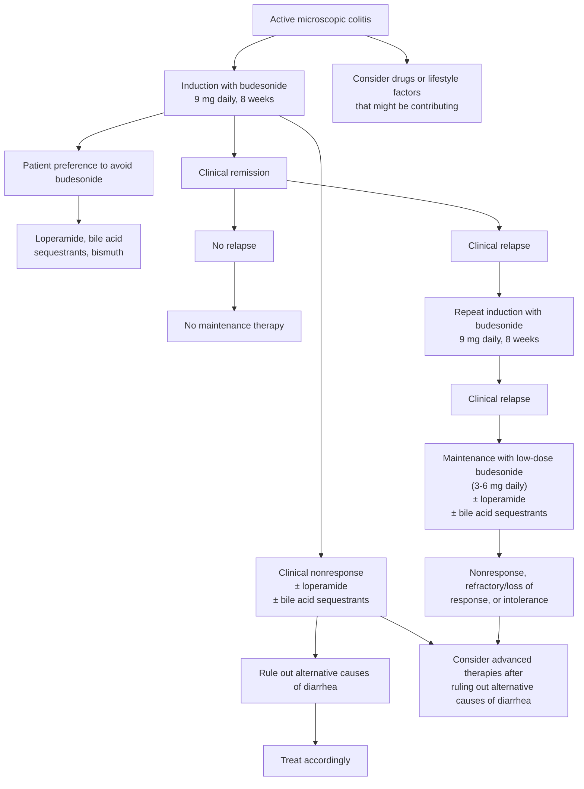

## Bibliographic Info

- **Article:** [Peery AF, Khalili H, Münch A, Pardi DS. Update on the Epidemiology and Management of Microscopic Colitis. *Clin Gastroenterol Hepatol.* 2025;23(3):490–500.](https://doi.org/10.1016/j.cgh.2024.08.026)
- **Authors:** Anne F. Peery, Hamed Khalili, Andreas Münch, Darrell S. Pardi
- **Year:** 2025
- **Journal/Publisher:** Clinical Gastroenterology and Hepatology (AGA Institute)
- **DOI:** [10.1016/j.cgh.2024.08.026](https://doi.org/10.1016/j.cgh.2024.08.026)
- **Type:** review (narrative, evidence-based)

> **Not a guideline.** This is a narrative review, not a society guideline, clinical practice update, or consensus statement. Where it disagrees with [[aga-2016-microscopic-colitis]], the guideline's position is what [[microscopic-colitis]] asserts and the disagreement is recorded below and on that page.

## Contents
- [[#Summary]]
- [[#Key Findings / Claims]]
  - [[#Epidemiology and Risk Factors]]
  - [[#Presentation and Natural History]]
  - [[#Diagnosis]]
  - [[#Treatment]]
  - [[#Health Care Maintenance]]
  - [[#Table 1 — Key Considerations for Diagnosing and Managing Microscopic Colitis]]
  - [[#Table 2 — Indications for Advanced Therapy]]
  - [[#Figure 3 — Treatment Algorithm]]
- [[#Relevance to Wiki]]
- [[#Contradictions / Open Questions]]

## Summary

A 2025 narrative review of microscopic colitis (MC) covering epidemiology, risk factors, pathophysiology, diagnosis, and treatment. Its most useful contribution to this wiki is **diagnostic**: it supplies the histologic thresholds that separate collagenous from lymphocytic colitis, the definition of incomplete MC, and the biopsy protocol — none of which [[aga-2016-microscopic-colitis]] provides, because that guideline covers medical management only and explicitly does not address diagnosis.

On risk factors the review **challenges the long-standing teaching that medications cause MC**. Aspirin, nonsteroidal anti-inflammatory drugs (NSAIDs), proton pump inhibitors, and selective serotonin reuptake inhibitors have all been associated with increased risk, but the authors judge the evidence low-certainty because of heterogeneity and because the earlier studies used colonoscopy or chronic-diarrhea controls. Two recent studies that compared against patients with chronic diarrhea found most previously implicated medications **not** associated with MC (NSAIDs the exception in one). The practical consequence is a narrower stopping rule: stop a drug only when there is a clear temporal relationship between exposure and diarrhea onset; long-standing medications with no temporal association should not be discontinued.

On treatment the review is largely concordant with the 2016 guideline on budesonide — 9 mg daily for 8 weeks to induce, low-dose maintenance for relapsers — but it adds the magnitude of relapse (50%–80% after discontinuation), the low end of maintenance dosing (as low as 3 mg/day or every other day), and a role for loperamide and bile acid sequestrants as adjuvant therapy to reduce budesonide dependence. It **diverges from the guideline on three agents**: it recommends against mesalamine, against systemic corticosteroids, and against bismuth subsalicylate *for maintenance* (bismuth remains an option for induction and for mild symptoms).

Finally, it defines a structured approach to budesonide failure that the 2016 guideline does not cover — three indications for advanced therapy, a mandatory re-evaluation step before escalating, pooled remission rates for vedolizumab, infliximab, and adalimumab, and referral to an inflammatory bowel disease (IBD) centre for severe disease.

## Key Findings / Claims

### Epidemiology and Risk Factors

- **Incidence 10.5–25.8 per 100,000 person-years** in Europe and select US populations; **prevalence 197.9–246.2 per 100,000**.
- Lifetime risk in Sweden: **0.9% in women, 0.4% in men**.
- Olmsted County, United States: incidence **rose 1985→2001 and stabilized 2002–2019**; corroborated by 2 European studies.
- **Age** — risk increases with age; mean age at diagnosis **60–64 y**. Reported in all age groups including children.
- **Sex** — affects both sexes; **women nearly 3× more likely** than men.
- **Race** — limited research suggests MC is **less common in Black, Asian, and Hispanic patients**; it is described worldwide and is likely more prevalent in diverse populations than current research suggests. Consider it in patients of all races and ethnicities.
- **Alcohol and smoking** — both associated with increased risk. Alcohol shows a **dose-dependent** association in a prospective cohort of women; **current smokers have 3× the odds** of MC vs non-smokers.
- **Diet** — no association with protein, carbohydrate, fat, or fiber intake, with lower-quality diet, or with dietary gluten intake.
- **Obesity** — obesity and adult weight gain are associated with **reduced** risk in women; mechanism not well understood, possibly hormonal effects of adipose tissue.
- **Medications — the association is now contested.** Aspirin, NSAIDs, proton pump inhibitors, and selective serotonin reuptake inhibitors have been associated with increased risk, but the evidence was judged **lower-certainty** (heterogeneity; lack of association when colonoscopy or chronic-diarrhea controls were used). **Two recent studies using chronic-diarrhea comparators found most previously implicated medications were not associated with MC**, NSAIDs excepted in 1 study.
- **Immune checkpoint inhibitors can induce a type of MC** that may be **more severe than sporadic MC and may require different treatment**.
- **Autoimmune disease** is a risk factor; **celiac disease is the most important**. Risk of MC was highest in the **first year after a celiac diagnosis** but remained elevated after **10 years** of follow-up. An estimated **6.7% of patients with celiac disease will be diagnosed with MC**. Also associated: ankylosing spondylitis, type 1 diabetes, Graves disease, Hashimoto thyroiditis, rheumatoid arthritis, multiple sclerosis, Crohn's disease, ulcerative colitis.
- **Predominant antibody deficiency, particularly common variable immunodeficiency**, carries increased risk. **Consider antibody deficiency in younger patients with MC and refractory symptoms.**
- **Gastrointestinal infections** — 2 large cohort studies showed an association. One found greatest risk with *Clostridium difficile*, *Norovirus*, and *Escherichia* species; the other with *Campylobacter concisus*. Risk was **highest in the first year after infection but remained increased for years**.
- **Family history** — one cross-sectional study showed higher risk among those with a family history; several common genetic variants identified for collagenous colitis. The collective genetic contribution is not well defined.

### Presentation and Natural History

- Presents with **multiple loose or watery bowel movements daily**.
- **15%–30% of patients who have a colonoscopy for chronic diarrhea will be diagnosed with MC.**
- Symptom frequencies: **fecal urgency 93%**, **fecal incontinence 68%**, **weight loss 65%**, **nocturnal bowel movements 62%**, **abdominal pain 52%**. Fatigue is often reported and may be caused by sleep disturbance from nocturnal bowel movements.
- **Symptoms are worse in patients with a history of cholecystectomy.**
- **MC can be misdiagnosed as irritable bowel syndrome (IBS); prevalence of MC among patients with IBS with diarrhea is 4.1%.**
- **Natural history:** in a prospective cohort, **40% had a relapsing or chronic disease course 5 years after diagnosis**, with worse quality of life than those with a quiescent course.
- **Mortality is unsettled.** One population-based cohort found slightly increased risk of death attributed to a greater burden of comorbidities; a second found increased risk of death from smoking-related diseases; a US study showed **no increase in mortality**. The excess in the first two studies is likely **residual confounding from smoking**.

### Diagnosis

- Consider MC in **any patient with chronic watery diarrhea**.
- **There are no reliable blood or fecal biomarkers, including fecal calprotectin, to screen for MC** — it cannot be ruled out with them.
- **Biopsy protocol: histopathologic analysis of ≥2 biopsies from the right colon and ≥2 biopsies from the left colon, rectum excluded.**
- **Colonoscopy to the terminal ileum** should be performed to rule out alternative diagnoses.
- **Endoscopic appearance:** the colon mucosa **most commonly appears normal**; macroscopic findings are seen in **17%** — erythema, erosions, scarring, and less commonly pseudomembranes, ulceration, or mucosal tears.

**Histologic criteria (Figure 1):**

| Subtype | Defining histology | Shared features |
|---|---|---|
| **Collagenous colitis** | Thickened subepithelial **collagen band >10 µm** | Lymphoplasmacytic lamina propria infiltration (lymphocytes, plasma cells, eosinophils, neutrophils); **minimal or no crypt architectural distortion** |
| **Lymphocytic colitis** | **>20 intraepithelial lymphocytes per 100 surface epithelial cells** | As above |
| **Incomplete MC** | Chronic diarrhea **plus either** intraepithelial lymphocytes **5–20 per 100 epithelial cells** **or** a collagen band **5–10 µm** — not meeting the thresholds for a classic diagnosis | — |

- **The subtype can change over time.** In a large study, **1.6%** of patients changed phenotype from lymphocytic to collagenous colitis and **0.5%** from collagenous to lymphocytic.
- **Histologic severity does not track symptoms:** lamina propria lymphocyte density and collagen band thickness are **not associated with symptom burden**.
- **Outpatient follow-up to assess treatment response is critical after diagnosis.** In a study of patients with a new diagnosis, some were unaware of the diagnosis, some were not treated, and many remained symptomatic at 1-year follow-up.

### Treatment

- **Management does not differ between collagenous and lymphocytic colitis** — there is no evidence to suggest it should, so the approach applies to both subtypes.
- **Treatment is symptom-centered and patient-centered**; it should improve symptoms and quality of life. **It is not necessary to confirm histologic response to treatment.**
- **Clinical remission (Hjortswang criteria), as suggested by some:** a mean of **<3 stools per day and <1 watery stool per day**.
- **First step — contributing factors:**
  - **Stop a culprit medication only if there is a clear temporal relationship between the medication exposure and diarrhea onset.** Mainly proton pump inhibitors, NSAIDs, and selective serotonin reuptake inhibitors. **Long-standing medications with no temporal association should not be discontinued.**
  - **Smoking cessation should be encouraged** — smoking is associated with MC and with reduced treatment response.
- **Mild symptoms:** in patients who report subjectively mild symptoms, **antidiarrheal medications — loperamide, bismuth subsalicylate, or bile acid sequestrants — may be sufficient**.
- **Budesonide is the primary treatment for inducing clinical remission.**
  - **Induction dose 9 mg daily for 8 weeks.** Superior to placebo in multiple randomized controlled trials and in population-based cohorts; a meta-analysis of 9 studies reported an **odds ratio 7.3 (95% CI 4.1–13.2)** for induction vs placebo **with no increase in adverse events**.
  - High first-pass hepatic metabolism gives low systemic bioavailability and fewer side effects than other steroids.
  - **The benefit of tapering is not clear** — some experts taper over a few weeks to months after a standard induction course, others do not. Select patients with severe symptoms may elect not to discontinue and instead taper to the lowest dose that maintains clinical remission.
- **Maintenance:**
  - **Recurrence after discontinuation is common: 50%–80%.**
  - A meta-analysis of 5 studies reported a pooled remission rate on budesonide maintenance of **84%**; the 9-study meta-analysis reported an **odds ratio 8.35** for maintenance vs placebo.
  - **Most patients can be maintained on lower doses, often as low as 3 mg per day or every other day.** Several studies reported no increase in steroid-related side effects during maintenance.
  - **To decrease budesonide dependence, loperamide or bile acid sequestrants can be used as adjuvant therapy.**
- **Bismuth subsalicylate:** **3 × 262-mg tablets 3 times a day for 6–8 weeks**, alone or with budesonide if response is incomplete. One meta-analysis reported response rates up to **62% for loperamide and 75% for bismuth**, with **50% achieving remission**. Prospective controlled trials are needed. **Maintenance therapy with bismuth subsalicylate is not recommended because of potential toxicity.**
- **Bile acid sequestrants** are used increasingly. No robust randomized trials, but considerable open-label evidence of effectiveness **as monotherapy or in combination with budesonide to decrease budesonide dependence**. A meta-analysis of 9 studies reported a **response rate of 60% and remission of 29%**.
- **Mesalamine was inferior to budesonide and no better than placebo** in clinical trials in both lymphocytic and collagenous colitis, and **is not recommended as a treatment in MC**.
- **Systemic corticosteroids are poorly studied with small studies suggesting limited to no benefit; given the harms and the availability of alternatives, they are no longer recommended to treat MC.**

**Advanced therapy (immunomodulators, biologics, small molecules):**

- **Before initiating advanced therapy, an individualized therapeutic decision should be made:**
  - **Repeat colonoscopy with biopsy if the diagnosis was established years ago** — to confirm the diagnosis and rule out other causes of diarrhea.
  - **Exclude celiac disease** — an estimated **7.7% of patients with MC will be diagnosed with celiac disease**.
  - **Consider Crohn's disease and ulcerative colitis** — a history of MC is associated with increased risk of both.
  - **Medication review** for new drugs contributing to ongoing diarrhea.
  - **Smoking cessation** — associated with reduced treatment response.
- **Immunomodulators** (azathioprine, 6-mercaptopurine, methotrexate) have shown limited efficacy in small case series.
- **Biologics — pooled analysis of 14 studies (n = 164):**

  | Agent | Induction remission | Maintenance remission | Therapy-limiting adverse events |
  |---|---|---|---|
  | **Vedolizumab** | 63.5% | 65.9% | 12.2% |
  | **Infliximab** | 57.8% | 45.3% | 32.9% |
  | **Adalimumab** | 39.3% | 32.5% | 23.0% |

- In a separate article, **tumor necrosis factor inhibitors (infliximab and adalimumab) showed a response rate of 73% with a remission rate of 44%**; **vedolizumab was similar — 73% response, 56% remission**.
- In a large retrospective European series of **99 patients**, anti–tumor necrosis factor agents were commonly used first line but with **frequent discontinuation for nonresponse or loss of efficacy over time**; vedolizumab and ustekinumab were often second- or third-line; **Janus kinase (JAK) inhibitor–treated patients exhibited the highest remission rate, albeit with a small sample (n = 14)**.
- **Referral to an IBD centre with advanced therapy experience is recommended for severe cases**, and is advised for patients who fail budesonide.
- Vedolizumab's safety profile is **crucial for older patients with comorbidities**, and in 1 systematic review it was better with respect to maintenance therapy and safety. **JAK inhibitors show promise but necessitate further investigation, particularly regarding adverse events.**
- **In severe cases of MC, surgery may be required when all medications fail.**

### Health Care Maintenance

- Small studies suggest patients with MC are at **increased risk for osteoporosis or osteopenia** vs controls.
- **Budesonide use was associated with a dose-related risk of fractures** in one study; another showed **no** increased risk of osteoporosis or other steroid-related adverse events even when budesonide was used for maintenance.
- **Patients on budesonide maintenance may benefit from calcium and vitamin D supplementation.**
- **Unlike IBD, MC is not associated with an increased risk of colorectal polyps or cancer.**
- Patients treated with immunomodulators or biologic therapy may be at increased risk for infections and **may benefit from the vaccination recommendations for patients with IBD receiving immunosuppressive therapy**.

### Table 1 — Key Considerations for Diagnosing and Managing Microscopic Colitis

*Reproduced in full; the review's own summary table.*

| Key consideration |
|---|
| Microscopic colitis should be considered in the differential for all adults with chronic, watery diarrhea. |
| Several autoimmune diseases and select gastrointestinal infections are risk factors for developing microscopic colitis. |
| Immune checkpoint inhibitors can induce a type of microscopic colitis that may be more severe and may require different treatment. |
| Microscopic colitis can be misdiagnosed as irritable bowel syndrome. |
| Microscopic colitis cannot be ruled out with blood or fecal biomarkers, including fecal calprotectin. |
| The diagnosis requires histopathologic analysis of ≥2 biopsies from the right colon and ≥2 biopsies from the left colon, rectum excluded. |
| Smoking cessation should be encouraged. |
| Stop a medication only if a clear temporal relationship with medication exposure and diarrhea onset. Long-standing medications with no association should not be discontinued. |
| In patients who report experiencing subjectively mild symptoms, antidiarrheal medications, such as loperamide, bismuth subsalicylate, or bile acid sequestrants, may be sufficient. |
| Mesalamine and systemic corticosteroids are not recommended as a treatment in microscopic colitis. |
| The primary treatment for inducing clinical remission in microscopic colitis is budesonide. |
| Maintenance therapy is often necessary for microscopic colitis. |
| After induction, most patients can be maintained on lower doses of budesonide, often as low as 3 mg per day or every other day. |
| To decrease budesonide dependence, loperamide or bile acid sequestrants can be used as adjuvant therapy. |
| Maintenance therapy with bismuth subsalicylate is not recommended. |
| Treatment should improve patient's symptoms and quality of life. Some have suggested that clinical remission be defined as a mean of <3 stools per day and <1 watery stool per day. |
| Budesonide failure is uncommon and requires further investigation. In cases with a remote diagnosis, repeat colonoscopy should be performed to confirm the diagnosis. Alternative diagnoses (celiac disease, ulcerative colitis, and Crohn's disease) should be ruled out. Antibody deficiency should be considered in younger patients. |
| Therapies reserved for ulcerative colitis and Crohn's disease (biologics and small molecules) are a treatment option for patients who fail budesonide. Consultation with an inflammatory bowel disease centre is advised for patients who fail budesonide. |

### Table 2 — Indications for Advanced Therapy

| Indication | Definition |
|---|---|
| **Nonresponse** | Clinical activity persists despite budesonide 9 mg induction therapy |
| **Refractory / loss of response** | Clinical activity despite budesonide 3–6 mg maintenance treatment |
| **Intolerance** | Unacceptable side effects from budesonide |

### Figure 3 — Treatment Algorithm

*Recreated from the review's Figure 3.*

- **Figure 1** of the review is a four-panel histology plate (hematoxylin–eosin, CD3, and trichrome stains) labelling each diagnostic feature on the slide — the intraepithelial lymphocyte threshold, the collagen band, the lamina propria expansion, and the preserved crypt architecture. The criteria it labels are tabulated under [[#Diagnosis]]; the images themselves are not reproduced here.
- **Figure 2** is a schematic of pathophysiology (risk factors → genetics and microbiome → normal-appearing mucosa with collagenous or lymphocytic histology).

## Relevance to Wiki

- **[[microscopic-colitis]]** — the main beneficiary. Supplies the **histologic diagnostic criteria the page previously could not state** (collagen band >10 µm; >20 intraepithelial lymphocytes per 100 surface epithelial cells; incomplete MC at 5–10 µm / 5–20 lymphocytes), the **≥2 right + ≥2 left biopsy protocol with rectum excluded**, the **17% macroscopic-findings figure**, the **fecal calprotectin cannot rule it out** rule, the **Hjortswang remission definition**, the **advanced-therapy indications and biologic remission rates**, the **budesonide maintenance dose floor (3 mg/day or every other day)**, bile acid sequestrants as adjuvant, bone health, and the risk-factor section the page lacked entirely.
- **[[chronic-diarrhea]]** — the 15%–30% diagnostic yield of colonoscopy for MC in chronic diarrhea, and that no blood or fecal biomarker screens for it.
- **[[irritable-bowel-syndrome]]** — MC prevalence of 4.1% among patients with IBS with diarrhea.
- **[[celiac-disease]]** — bidirectional association quantified: 6.7% of celiac patients develop MC; 7.7% of MC patients are diagnosed with celiac disease.
- **[[immune-checkpoint-inhibitor-colitis]]** — checkpoint inhibitors induce a type of MC that may be more severe and require different treatment.
- **[[bile-acid-diarrhea]]** / bile acid sequestrants — response 60%, remission 29% in MC.
- **[[corticosteroids-ibd]]** — budesonide dosing floor and the dose-related fracture signal.
- **[[clostridioides-difficile]]**, **[[campylobacter-infection]]** — antecedent gastrointestinal infection as an MC risk factor.
- **No Anki cards may be written from this source** — the deck takes tier-1 guideline, clinical practice update, and consensus material only, and this is a narrative review.

## Contradictions / Open Questions

- **Mesalamine.** This review states mesalamine **is not recommended** in MC (inferior to budesonide, no better than placebo in trials in both subtypes). [[aga-2016-microscopic-colitis]] makes a **conditional recommendation for mesalamine 3 g daily when budesonide is not feasible** (moderate quality). The guideline is the higher-priority source and remains what [[microscopic-colitis]] asserts; the disagreement is surfaced on that page.
- **Systemic corticosteroids.** This review states prednisone/prednisolone are **no longer recommended** to treat MC. The 2016 guideline makes a **conditional recommendation (very low quality)** for prednisolone when budesonide is not feasible. Same resolution as above.
- **Bismuth subsalicylate.** Both sources support bismuth for **induction**; this review adds that **maintenance** with bismuth **is not recommended because of potential toxicity** — a restriction the 2016 guideline does not state. This is net-new, non-conflicting information and is carried on the page.
- **Medication triggers.** The 2016 guideline and [[asge-2010-diarrhea]] treat NSAIDs, proton pump inhibitors, and selective serotonin reuptake inhibitors as established precipitants to review and withdraw. This review reports that **two recent studies using chronic-diarrhea comparators found most previously implicated medications were not associated with MC**, and narrows the action to stopping only drugs with a clear temporal relationship to diarrhea onset. The guideline's framing stands as the page's assertion; the challenge is recorded alongside it.
- **Mortality** is unresolved within the review itself — two cohorts found increased death risk, a US study found none, and the authors attribute the excess to residual confounding by smoking.
- **Not covered by this review or any ingested source:** the European guideline on microscopic colitis (United European Gastroenterology and European Microscopic Colitis Group, 2021), which the review cites as its guideline reference. Recorded in [[needed-sources]].
