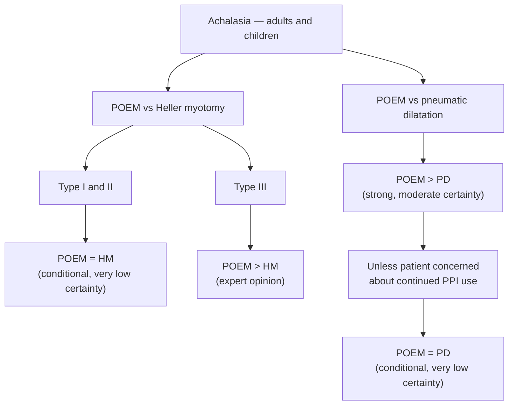

> ⚠ **Superseded — read as a record of the 2021 document, not as current practice.** This is the original Society of American Gastrointestinal and Endoscopic Surgeons (SAGES) peroral endoscopic myotomy (POEM) guideline. It is updated by [[sages-2024-poem|SAGES Guideline Update: POEM for Achalasia (2024)]]; where the two differ, the 2024 update governs. The 2021 document remains the only one of the pair that addresses pediatric patients and achalasia subtype III explicitly.

## Contents
- [[#Bibliographic Info]]
- [[#Summary]]
- [[#The Four Recommendations]]
  - [[#Decision Figure]]
- [[#Evidence Base]]
- [[#What the Document Does Not Address]]
- [[#Relevance to Wiki]]
- [[#Contradictions / Open Questions]]
- [[#See Also]]

## Bibliographic Info
- **Article:** [Kohn GP, Dirks RC, Ansari MT, et al. Guidelines for the use of peroral endoscopic myotomy (POEM) for the treatment of achalasia. Surg Endosc 2021;35(5):1931–1948.](https://doi.org/10.1007/s00464-020-08282-0)
- **Authors:** Geoffrey P. Kohn, Rebecca C. Dirks, Mohammed T. Ansari, Jason Clay, Christy M. Dunst, Lars Lundell, Jeffrey M. Marks, Daniela Molena, Ceciel Rooker, Payal Saxena, Lee Swanstrom, Reuben K. Wong, Aurora D. Pryor, Dimitrios Stefanidis
- **Year:** 2021
- **Journal/Publisher:** Surgical Endoscopy (SAGES)
- **DOI:** [10.1007/s00464-020-08282-0](https://doi.org/10.1007/s00464-020-08282-0)
- **Type:** guideline

## Summary
This SAGES guideline used the Grading of Recommendations Assessment, Development and Evaluation (GRADE) methodology to compare [[poem|POEM]] against the two established treatments for [[achalasia]] — pneumatic dilation (PD) and Heller myotomy (HM), performed laparoscopically with fundoplication (LHM) — across **two key questions** (POEM vs HM; POEM vs PD). The panel issued **four recommendations**, covering adults and children.

Strength vocabulary is GRADE's: **"the guideline panel recommends" = strong**, **"the guideline panel suggests" = conditional**. Certainty of evidence is reported separately for each statement. Final recommendations required ≥70% panel agreement.

Headline: a **strong recommendation for POEM over PD** (moderate certainty), with a **separate conditional recommendation** that for the subgroup particularly concerned about continued postoperative proton pump inhibitor (PPI) use, either POEM or PD may be chosen jointly. POEM vs HM was judged a balanced trade-off — the panel unanimously agreed the balance of effects favored neither — so for **types I and II either POEM or laparoscopic Heller myotomy** is acceptable by shared decision-making (conditional, very low certainty). For **type III no evidence-based recommendation was possible**; the panel favored POEM **as expert opinion only**, because a longer myotomy can be performed endoscopically. The defining trade-off preserved here: **POEM has no inherent anti-reflux component, so post-POEM reflux is its main downside versus Heller-plus-fundoplication.**

## The Four Recommendations
Grouped by key question, as the document numbers them (1 and 2 within each question — there is no continuous 1–4 numbering in the source). Strength and certainty are the document's own wording.

**Key question 1 — Should POEM vs HM be used for achalasia in adults and children?**

| # | Recommendation | Strength | Certainty |
|---|---|---|---|
| 1 | Adult **and pediatric** patients with **type I and II** achalasia may be treated with **either POEM or laparoscopic Heller myotomy**, based on surgeon and patient's shared decision-making. | Conditional ("suggests") | Very low |
| 2 | Based on their collective experience, the panel suggests **POEM over laparoscopic Heller myotomy for type III adult or pediatric achalasia**. | **Expert opinion** (no evidence-based recommendation was possible) | — |

**Key question 2 — Should POEM vs PD be used for achalasia in adults and children?**

| # | Recommendation | Strength | Certainty |
|---|---|---|---|
| 1 | **POEM over pneumatic dilatation** in patients with achalasia. | Strong ("recommends") | Moderate |
| 2 | For the subgroup **particularly concerned about continued postoperative PPI use**, either POEM or pneumatic dilatation can be used, based on joint patient and surgeon decision-making. | Conditional ("suggests") | Very low |

The conclusion paragraph for key question 1 states the comparator as laparoscopic Heller myotomy **with fundoplication**, and notes the type I/II statement was generalized to children because no contradictory pediatric data were found.

### Decision Figure

*Figure 1 — the guideline's visual abstract, redrawn: the four recommendations as a decision tree. ([[sages-2021-poem]])*

## Evidence Base

- **Key question 1 (POEM vs HM):** 21 studies in the systematic review; the panel used **1 recent randomized controlled trial (RCT)** at low risk of bias (POEM vs laparoscopic Heller myotomy with Dor fundoplication) and **14 high-risk-of-bias observational studies**. Overall certainty: **very low**.
  - Similar effectiveness — success/symptom resolution by Eckardt score ≤3 (1 RCT, 221 participants, risk ratio [RR] 1.02, confidence interval [CI] 0.90–1.15); postoperative lower esophageal sphincter (LES) relaxation pressure (1 RCT, 148, mean difference 0.75 mmHg lower); gastrointestinal quality of life at 2 years (1 RCT, 202, mean difference 0.14 higher). Panel judged the combined magnitude **trivial**.
  - POEM better, to a degree the panel called clinically significant: postoperative pain (3 observational, 269, RR 0.88); serious adverse events (1 RCT, 221, RR 0.36); return to the operating room for complications (9 observational, 618, RR 0.79).
  - Harm: reflux esophagitis (Los Angeles grade B, C or D) at 2 years more frequent after POEM (1 RCT, 165, RR 1.79, CI 0.90–3.59). Restricted to the more severe **Los Angeles grades C–D the effect favored POEM** (RR 0.72, CI 0.20–2.58); neither reached statistical significance. The undesirable effect was downgraded from moderate to small because the biggest between-procedure difference was in **grade A** esophagitis.
  - Cost: 4 observational studies, no variance measures; 3 of 4 found POEM more expensive, estimated difference for the index admission **$3,301 cheaper to $1,026 more expensive**.
  - Panel-judged POEM advantages not captured in the literature: no incisional hernia risk, lower wound infection rate, none of the post-fundoplication effects (bloating, flatulence, inability to belch or vomit).
- **Key question 2 (POEM vs PD):** 8 studies; **1 RCT** plus **5 predominantly high-risk-of-bias observational studies**. Overall certainty: **moderate**.
  - POEM superior in nearly all desirable effects: symptom resolution by Eckardt score at 2 years (1 RCT, 126, RR 1.71, CI 1.34–2.17, 38.5% more); short-term Eckardt at 0–6 months (6 observational, 471, mean difference 0.7 lower); need for retreatment for failure of symptom relief (1 RCT, 126, RR 0.19, CI 0.08–0.47); treatment-related serious adverse events (1 RCT, 126, RR 0.33); disease-specific quality of life (1 RCT, 92, mean difference 0).
  - Harms, both proxies for postoperative reflux: **PPI use at 2 years** (1 RCT, 92, RR 2.01, CI 0.97–4.16, 20.8% more) and **patient-reported short-term reflux symptoms** (3 observational, 164, RR 2.67, CI 1.02–7.0).
  - **Esophagitis was dropped as a critical outcome** — an absolute effect could not be calculated because the PD group had no esophagitis events and no observational data were available. The panel believed POEM does likely raise esophagitis risk but could not gauge the degree.
- **Subtype distribution.** Studies often did not report subtype or did not stratify outcomes by it, precluding subgroup analysis. Among those that did, types I or II predominated — **averages of 70%–100% types I or II in 16 of 18 studies** — with only one study reporting predominantly type III. Recommendations therefore apply best to types I and II.
- **Follow-up** was short (up to 2 years) and used explicitly as a **proxy** for 5-, 10- and 15-year outcomes.

## What the Document Does Not Address

- **No myotomy length is specified.** The only statement on extent is that for type III "a longer myotomy can be performed with that approach"; no centimetre figure, landmark, or gastric-extension length is given.
- **No post-POEM reflux protocol.** The document states there is no research on the role, patient acceptance, or efficacy of PPI use after POEM, and that defined criteria for PPI use were absent in the studies, so the appropriateness of PPI use in these patients is unknown. It gives no PPI dose, duration, or reflux-surveillance schedule.
- **No correlation between post-POEM LES pressure and outcome** is established; the panel explicitly declined to carry over the Heller myotomy data.
- No recommendations on technique, anterior vs posterior approach, training thresholds, or periprocedural care.

## Relevance to Wiki
- Foundational source for [[poem]] (previously sourced only from the [[sages-2024-poem|2024 update]]) and for the treatment section of [[achalasia]]: anchors the strong POEM-over-PD recommendation, the POEM-or-Heller equivalence for subtypes I/II, the POEM-favored stance for subtype III, and the post-POEM GERD trade-off. Added additively to both pages' Sources; current positioning continues to reflect the 2024 update.

## Contradictions / Open Questions
- No direct contradiction with [[sages-2024-poem|SAGES 2024]]; the 2024 document refines and updates these same recommendations with newer evidence. Long-term (5–10 year) comparative durability and optimal reflux-mitigation strategy after POEM remain open questions flagged by the panel.

## See Also
[[poem]], [[achalasia]], [[gerd]], [[heller-myotomy]], [[high-resolution-manometry]]

---

## Sources

1. [[sages-2021-poem|SAGES Guidelines for the Use of Peroral Endoscopic Myotomy (POEM) for the Treatment of Achalasia (2021)]]
